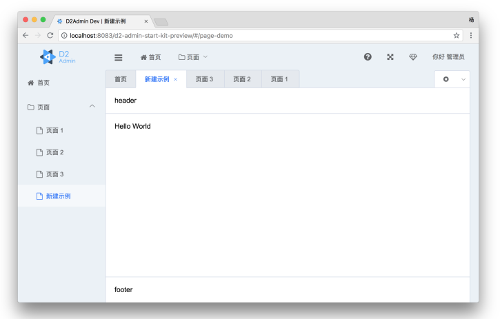
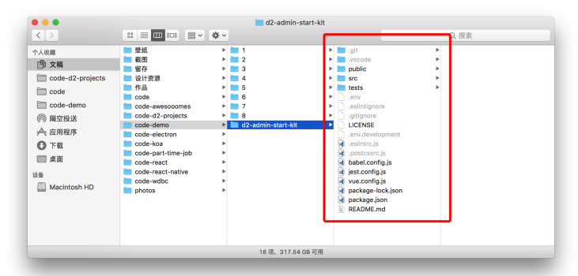
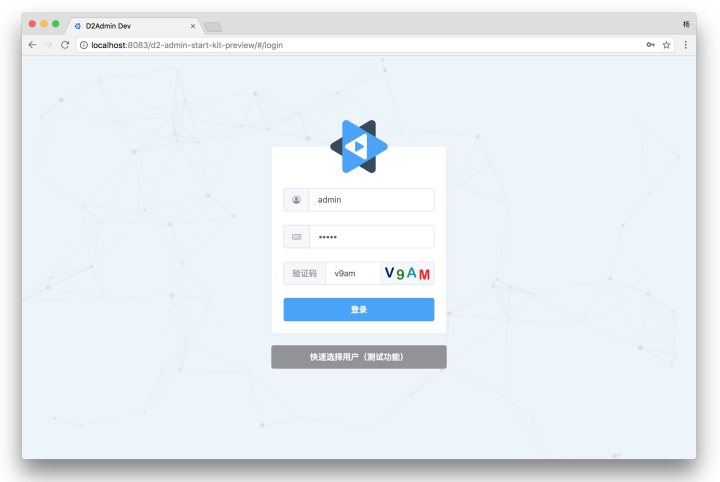
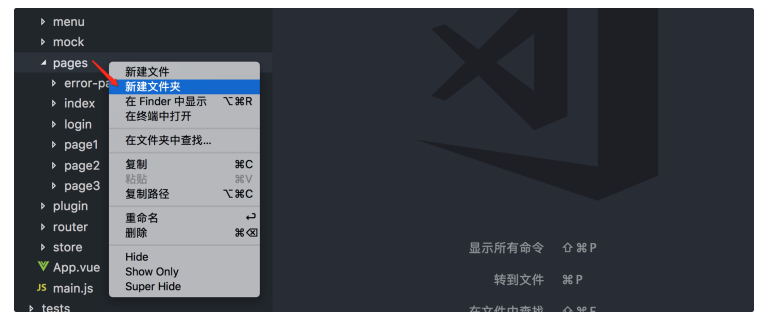
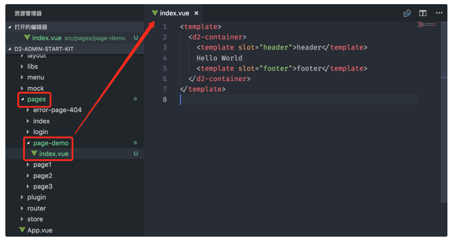

(注1：现在是2021年3月16日，我上班的第一天。领导让我着重学习一下`D2Admin`，这个是用Vue写的后台管理系统。然后还给我看了一下他们现在正在做的用`D2Admin`做的一个项目。那我当前的学习目的就很明确了，复习Vue和学习`D2Admin`这个后台管理系统，顺便再把`SVN`学一下，这个很好学，和Git一样，但是比Git简单。)

(注2：我现在就主要把官方文档看一遍吧，然后再跟着抄一遍官方文档，再根据里面的示例代码和郭哥给的项目代码进行一些代码测试方面的工作。)

(注3：[我写的代码的仓库地址](https://github.com/lm101845/LearnD2Admin))

(注4：[官方文档](https://d2.pub/zh/doc/d2-admin/))

(注5：我想了一下，还是下载特定版本的V1.1.5的代码进行学习吧，这个版本和官方文档也一致，也省得自己去改了。)

# 开始使用

## D2Admin

[D2Admin](https://github.com/d2-projects/d2-admin)是一个完全 **开源免费** 的企业中后台产品前端集成方案，使用最新的前端技术栈，小于 60kb 的本地首屏 js 加载，已经做好大部分项目前期准备工作，并且带有大量示例代码，助力管理系统快速开发。

**完整版**

- 仓库： [Github ](https://github.com/d2-projects/d2-admin)/ [码云](https://gitee.com/d2-projects/d2-admin)/ [coding](https://d2-projects.coding.net/p/d2-projects/d/d2-admin/git)
- 预览： [https://d2.pub/d2-admin/preview](https://d2.pub/d2-admin/preview)

**简化版**

- 仓库： [Github](https://github.com/d2-projects/d2-admin-start-kit)/ [码云](https://gitee.com/d2-projects/d2-admin-start-kit)/ [coding](https://d2-projects.coding.net/p/d2-projects/d/d2-admin-start-kit/git)
- 预览： [https://d2.pub/d2-admin-start-kit/preview](https://d2.pub/d2-admin-start-kit/preview)

### 功能

- 使用 vue-cli3 构建
- 首屏加载等待动画
- 五款主题
- 内置 UEditor 富文本编辑器
- 详细的文档
- 登录和注销
- 分离的路由和菜单设置
- 可折叠侧边栏
- 多国语
- 富文本编辑器
- Markdown 编辑器
- 全屏
- Fontawesome 图标库
- 图标选择器
- 自动注册 SVG 图标
- 模拟数据
- 剪贴板封装
- 图表库
- 时间日期计算工具
- 导入 Excel （ xlsx + csv ）
- 数据导出 Excel （ xlsx + csv ）
- 数据导出文本
- 数字动画
- 可拖拽调整大小的区块布局
- 可拖拽调整大小和位置的网格布局
- 开箱即用的页面布局组件
- 加载并解析 markdown 文件
- GitHub 样式的 markdown 显示组件
- markdown 内代码高亮
- 为 markdown 扩展了百度云链接解析和优化显示
- 右键菜单组件
- 自定义滚动条和滚动控制
- 公用样式抽离，方便的主题定制
- 支持临时菜单配置
- 系统功能展示模块 `1.1.4 +`
- 多标签页模式 `1.1.4 +`
- 美化滚动条 `1.1.4 +`
- json view `1.1.4 +`
- cookie 封装 `1.1.5 +`
- 多标签页全局控制 API `1.1.5 +`
- 菜单全局控制 API `1.1.5 +`
- 多标签页关闭控制支持右键菜单 `1.1.10 +`
- 模块化全局状态管理 `1.2.0 +`
- 多种数据持久化方式：区分用户，区分路由，页面数据快照功能 `1.2.0 +`
- 支持跳出外部链接的菜单系统 `1.2.0 +`
- 支持菜单 svg 图标 `1.3.0 +`
- 日志记录和错误捕捉 `1.3.0 +`
- 全局菜单搜索 `1.3.0 +`
- 自定义登录重定向 `1.3.0 +`
- 切换全局基础组件尺寸 `1.4.0 +`
- 页面载入进度条 `1.4.1 +`
- 自适应的顶部菜单栏 `1.4.7 +`
- 数据导出 xslx 时支持合并单元格 `1.5.4 +`
- 多标签页支持拖拽排序 `1.8.0 +`
- 优化生产环境构建，首页只加载小于 60kb 的本地 js 代码 `1.8.0 +`
- 内置了构建文件体积检查工具 `1.8.0 +`

###  项目结构

> 树形图生成工具
>
> [Folder Explorer](https://github.com/d2-projects/folder-explorer)

~~~json
├─.browserslistrc ------------------- // 目标浏览器配置
├─.editorconfig --------------------- // 编辑器配置
├─.env ------------------------------ // 基础环境变量配置
├─.env.development ------------------ // 开发模式下的环境变量配置
├─.env.preview ---------------------- // 各个环境通用的环境变量
├─.eslintignore --------------------- // ESLint 的忽略目录配置
├─.eslintrc.js ---------------------- // ESLint 的配置文件
├─.github --------------------------- // Github 配置
│ ├─ISSUE_TEMPLATE ------------------ // GitHub issue 模板
│ └─workflows ----------------------- // GitHub action 配置文件
├─.gitignore ------------------------ // git 的忽略配置
├─.postcssrc.js --------------------- // postcss 插件设置
├─.releaserc.js --------------------- // semantic 配置文件
├─LICENSE --------------------------- // 开源协议
├─README.md ------------------------- // 介绍
├─README.zh.md ---------------------- // 中文介绍 在码云仓库下自动加载这个文件
├─babel.config.js ------------------- // babel 设置
├─d2-admin.babel -------------------- // 多国语设置软件 BabelEdit 的项目文件
├─dependencies-cdn.js --------------- // 构建时的 CDN 依赖配置
├─docs ------------------------------ // 文档相关
├─jest.config.js -------------------- // 单元测试配置
├─jsconfig.json --------------------- // 指定根文件和 JavaScript 语言服务提供的功能选项
├─package-lock.json ----------------- // 锁定依赖版本
├─package.json ---------------------- // 项目信息和依赖
├─public ---------------------------- // 静态资源文件夹，不经过 webpack 处理
│ ├─html ---------------------------- // 用于演示加载静态页面的资源
│ ├─icon.ico ------------------------ // 网站图标
│ ├─image 
│ │ ├─baidu-pan-logo.png 
│ │ ├─loading ----------------------- // index.html 使用的加载图标
│ │ │ └─loading-spin.svg 
│ │ └─theme ------------------------- // 主题图片资源
│ │   ├─chester 
│ │   ├─d2 
│ │   ├─element 
│ │   ├─line 
│ │   ├─star 
│ │   ├─tomorrow-night-blue 
│ │   └─violet 
│ ├─index.html ---------------------- // 网站的基础页面模板
│ ├─lib ----------------------------- // 静态依赖
│ │ └─UEditor ----------------------- // 编辑器
│ └─markdown ------------------------ // 用于展示 Markdown 远程加载资源的文件
├─src ------------------------------- // 主要的代码目录
│ ├─App.vue ------------------------- // 项目根组件
│ ├─api ----------------------------- // 网络请求配置
│ │ ├─index.js 
│ │ ├─modules ----------------------- // API 配置
│ │ │ ├─demo.js 
│ │ │ ├─file.js 
│ │ │ └─sys.user.js 
│ │ ├─service.js -------------------- // 用于网络请求的实例配置
│ │ └─tools.js ---------------------- // 网络请求相关工具函数
│ ├─assets -------------------------- // 资源文件夹
│ │ ├─style ------------------------- // 样式资源
│ │ │ ├─animate --------------------- // 页面过渡动画
│ │ │ │ └─vue-transition.scss 
│ │ │ ├─fixed ----------------------- // 覆盖一些组件库的默认样式
│ │ │ ├─public-class.scss ----------- // 导出可以直接使用的 class
│ │ │ ├─public.scss ----------------- // 导出所有公用的 scss 资源
│ │ │ ├─theme ----------------------- // 主题样式相关
│ │ │ │ ├─chester 
│ │ │ │ ├─d2 
│ │ │ │ ├─element 
│ │ │ │ ├─line 
│ │ │ │ ├─register.scss ------------- // 注册所有主题样式
│ │ │ │ ├─star 
│ │ │ │ ├─theme-base.scss ----------- // 每个主题共用的样式
│ │ │ │ ├─theme.scss ---------------- // 每个主题特有的设置
│ │ │ │ ├─tomorrow-night-blue 
│ │ │ │ └─violet 
│ │ │ └─unit ------------------------ // scss 的基础变量
│ │ │   └─color.scss 
│ │ └─svg-icons --------------------- // svg 图标
│ │   ├─icons ----------------------- // 用来存放图标的文件夹
│ │   └─index.js -------------------- // 自动导入所有符合条件的图标
│ ├─components ---------------------- // 组件
│ │ ├─d2-container ------------------ // 页面容器
│ │ ├─d2-container-frame ------------ // 用于显示外部网页的页面容器
│ │ ├─d2-count-up ------------------- // 数字动画组件
│ │ ├─d2-highlight ------------------ // 代码高亮组件
│ │ ├─d2-icon ----------------------- // 图标组件
│ │ ├─d2-icon-select ---------------- // 图标选择组件
│ │ ├─d2-icon-svg ------------------- // svg 图标组件
│ │ ├─d2-icon-svg-select ------------ // svg 图标选择组件
│ │ ├─d2-link-btn ------------------- // 链接组件
│ │ ├─d2-markdown ------------------- // Markdown 加载和显示组件
│ │ ├─d2-mde ------------------------ // Markdown 编辑器
│ │ ├─d2-module-index-banner -------- // 演示用 每个模块首页的展示组件
│ │ ├─d2-module-index-menu ---------- // 演示用 每个模块首页的展示组件
│ │ ├─d2-quill ---------------------- // 富文本编辑器
│ │ ├─d2-ueditor -------------------- // 富文本编辑器
│ │ └─index.js ---------------------- // 组件注册
│ ├─i18n.js ------------------------- // 国际化配置
│ ├─layout -------------------------- // 布局
│ │ └─header-aside ------------------ // 具有顶栏加侧边栏的布局
│ │   ├─components 
│ │   ├─index.js 
│ │   ├─layout.vue 
│ │   └─mixins 
│ │     └─search.js 
│ ├─libs ---------------------------- // 一些通用的方法
│ │ ├─util.cookies.js --------------- // cookie 相关
│ │ ├─util.db.js -------------------- // 数据存储相关
│ │ ├─util.import.development.js ---- // 开发环境下使用的页面导入方法
│ │ ├─util.import.production.js ----- // 开发环境下使用的页面导入方法
│ │ ├─util.js ----------------------- // 杂项
│ │ └─util.log.js ------------------- // 日志相关
│ ├─locales ------------------------- // 国际化语言配置
│ │ ├─en.json 
│ │ ├─ja.json 
│ │ ├─mixin.js 
│ │ ├─zh-chs.json 
│ │ └─zh-cht.json 
│ ├─main.js ------------------------- // 程序主入口
│ ├─menu ---------------------------- // 静态的菜单数据
│ │ ├─index.js 
│ │ └─modules 
│ │   ├─demo-business.js 
│ │   ├─demo-charts.js 
│ │   ├─demo-components.js 
│ │   ├─demo-d2-crud.js 
│ │   ├─demo-frame.js 
│ │   ├─demo-playground.js 
│ │   └─demo-plugins.js 
│ ├─plugin -------------------------- // 插件
│ │ ├─api 
│ │ ├─d2admin ----------------------- // 统一注册系统必须的资源
│ │ ├─error ------------------------- // 错误拦截
│ │ ├─log --------------------------- // 日志
│ │ └─open -------------------------- // 新窗口打开
│ ├─router -------------------------- // 路由
│ │ ├─index.js ---------------------- // 注册路由以及设置拦截规则
│ │ ├─modules ----------------------- // 预先设置好的静态路由
│ │ │ ├─business.js 
│ │ │ ├─charts.js 
│ │ │ ├─components.js 
│ │ │ ├─d2-crud.js 
│ │ │ ├─frame.js 
│ │ │ ├─playground.js 
│ │ │ └─plugins.js 
│ │ └─routes.js --------------------- // 导入所有路由
│ ├─setting.js ---------------------- // 全局设置
│ ├─store --------------------------- // vuex
│ │ ├─index.js ---------------------- // vuex 注册主入口
│ │ └─modules ----------------------- // 模块目录
│ │   └─d2admin --------------------- // 系统自带模块，业务模块建议在同级新建
│ │     ├─index.js ------------------ // 模块主入口
│ │     └─modules ------------------- // 子模块
│ │       ├─account.js -------------- // 用户身份
│ │       ├─color.js ---------------- // 主题颜色
│ │       ├─db.js ------------------- // 本地数据库
│ │       ├─fullscreen.js ----------- // 全屏
│ │       ├─gray.js ----------------- // 灰度模式
│ │       ├─log.js ------------------ // 日志
│ │       ├─menu.js ----------------- // 菜单
│ │       ├─page.js ----------------- // 多页面控制
│ │       ├─releases.js ------------- // 版本
│ │       ├─search.js --------------- // 全局搜索
│ │       ├─size.js ----------------- // 全局尺寸
│ │       ├─theme.js ---------------- // 主题
│ │       ├─transition.js ----------- // 过渡效果
│ │       ├─ua.js ------------------- // 浏览器信息
│ │       └─user.js ----------------- // 用户信息
│ └─views --------------------------- // 页面视图
│   ├─demo -------------------------- // 演示页面
│   │ ├─business -------------------- // 业务页面演示
│   │ ├─charts ---------------------- // 图表
│   │ ├─components ------------------ // 内置组件演示
│   │ ├─d2-crud --------------------- // D2CRUD 表格封装演示
│   │ ├─element --------------------- // Element UI 组件
│   │ ├─frame ----------------------- // 嵌套第三方页面演示
│   │ ├─playground ------------------ // 试验台
│   │ └─plugins --------------------- // 插件演示
│   └─system ------------------------ // 系统页面
├─tests ----------------------------- // 单元测试
│ └─unit 
├─vue.config.js --------------------- // vue-cli3 的项目配置文件
└─yarn.lock ------------------------- // 版本锁定
~~~

## 快速上手

本文将会带领您从零开始使用 D2Admin 创建下面的页面：

> 提示：本示例中的代码和截图可能和您现在手中的版本不同，但操作思路一样。

### 安装环境

> 提示：如果您以前运行过 webpack 项目，并且本机 node 版本 >=8，可以忽略这一步。

(以下略，具体怎么安装就不写了。)

### 下载项目

前往仓库下载源码：

- 完整版仓库 [Github ](https://github.com/d2-projects/d2-admin)| [码云](https://gitee.com/d2-projects/d2-admin)
- 简化版起始模板 [Github ](https://github.com/d2-projects/d2-admin-start-kit)| [码云](https://gitee.com/d2-projects/d2-admin-start-kit)

挑选一个您喜欢的网站 Fork 代码到您的仓库，然后下载或克隆。

我的建议是使用 **简化版起始模板** 因为在完整版的基础上做减法，要比在简化版基础上做加法复杂。

下面的步骤都以简化版起始模板为基础演示如何使用。

下载完成后您会得到这些资源（以 1.1.5 版本为例）：

### 安装依赖

将终端切换到项目目录之后安装依赖：

~~~node
npm i
~~~

如果遇到问题比如 node-sass 安装不上，请参考 [常见问题](https://d2.pub/zh/doc/d2-admin/question/)。

> 这里要安装48个依赖包，生成`node_modules`文件夹。

### 开发调试

在项目目录内启动项目：

~~~node
npm run dev
~~~

或者使用：

~~~node
npm start
~~~

也可以使用 cli3 新推荐的命令：

~~~node
npm run serve
~~~

以上每种方式效果都是一样的，只是为了照顾不同人的习惯起了三个名字，实质上都是运行了 `vue-cli-service serve --open`。

成功运行后会显示登录界面：

### 新建页面 

> 注意：这份官方文档的版本是`V1.1.5 `，而我下载的版本是`V1.20.1`，所以有些地方是不一样的。比如，现在已经没有`pages`目录了，现在页面都放到`views`目录下了，所以我做的话，要把`index.vue`放到`src/views/demo`下才对。

`src/pages` 目录是页面存放目录，在此目录下新建目录，例如 **page-demo**：

然后在文件夹内新建 **index.vue** 文件：

~~~vue
<template>
  <d2-container>
    <template slot="header">header</template>
    Hello World
    <template slot="footer">footer</template>
  </d2-container>
</template>
~~~

我的版本这样写：

~~~vue
<template>
  <d2-container>
      <template slot="header">header</template>  
      Hello World 
      <template slot="footer">footer</template>  
  </d2-container>
</template>

~~~

上面的代码生成了一个带有 header 和 footer 的页面，页面内容只有一句话，如果您好奇为什么这么写，可以参考 [页面容器](https://d2.pub/zh/doc/d2-admin/sys-components/container.html)

###  设置路由

`src/router/routes.js` 是路由配置文件。

在 `frameIn` 变量最后添加：

~~~json
{
  path: '/page-demo',
  name: 'page-demo',
  component: () => import('@/pages/page-demo'),
  meta: {
    auth: true,
    title: '新建示例'
  }
}
~~~

最后 `frameIn` 变量应该是这样：

~~~json
const frameIn = [
  {
    path: '/',
    redirect: { name: 'index' },
    component: layoutHeaderAside,
    children: [
      {
        path: 'index',
        name: 'index',
        meta,
        component: () => import('@/pages/index')
      },
      // ...
      {
        path: '/page3',
        name: 'page3',
        component: () => import('@/pages/page3'),
        meta: {
          auth: true, 
          title: '页面 3'
        }
      },
      {
        path: '/page-demo',
        name: 'page-demo',
        component: () => import('@/pages/page-demo'),
        meta: {
          auth: true, 
          title: '新建示例'
        }
      }
    ]
  }
]
~~~

> 这些在我的新版本上都变了，路径应该是`component:()=>_import('demo/page-demo')`了。

### 设置菜单

`src/menu` 目录是**菜单存放目录**，里面的两个文件分别存放顶栏和侧边栏的菜单。

> 提示：D2Admin 现在将顶栏和侧边栏菜单分别存放然后赋值的逻辑只是一个最简单的演示，请根据您的需要自己修改菜变化逻辑，您可以只用一行代码就可以动态更新菜单，方法见 [vuex menu 模块](https://d2.pub/zh/doc/d2-admin/vuex/menu.html)。

~~~javascript
export default [
  { path: '/index', title: '首页', icon: 'home' },
  {
    title: '页面',
    icon: 'folder-o',
    children: [
      { path: '/page1', title: '页面 1' },
      { path: '/page2', title: '页面 2' },
      { path: '/page3', title: '页面 3' },
      { path: '/page-demo', title: '新建示例' }
    ]
  }
]
~~~

打开 `src/menu/aside.js` 添加新的菜单（高亮行）：

~~~javascript
export default [
  { path: '/index', title: '首页', icon: 'home' },
  {
    title: '页面',
    icon: 'folder-o',
    children: [
      { path: '/page1', title: '页面 1' },
      { path: '/page2', title: '页面 2' },
      { path: '/page3', title: '页面 3' },
      { path: '/page-demo', title: '新建示例' }
    ]
  }
]
~~~

# 需要查漏补缺的知识点

## HTML、CSS

* 他使用了`scss`作为预处理器，所以要复习一下`scss`
  * `@extend`
  * `&:hover `
* `opacity: 0;`
* `transform: translateX(30px);`
* `ransform: scale(0.8);`
* `transition: all .5s;`
* `box-shadow: 0 0 8px 0 rgba(232,237,250,.6), 0 2px 4px 0 rgba(232,237,250,.5);`
* `display: table-cell !important;`
* `@import `
* Flex布局
  * `ustify-content: center;`
  * ` align-items: center;`
  * ` flex-direction: column;`

## JS

* `Object.assign()`
* `...语法`
* `setAttribute()`

* `createElement`
* `document.body.removeChild()`
* `async`和`await`

## Vue

* 基础语法
  * `v-if`
  * `:class`

* 常用方法
  * `init ()`
  * `  this.init()`
  * `render (h)`
  * `Vue.use()`

* 组件相关
  * `ref`和`$refs`
  * `props`
  * `this.$el`
  * `this.$emit`
* 插槽：` <template slot="footer">header</template> `
  
* 生命周期函数
  * `mounted()`
  * `beforeDestroy()`
  * `scroll()`
* 混入(mixin)
* 计算属性computed
  * `show()`
* 路由
  * 路由懒加载：`full: () => import('./components/d2-container-full.vue')`
* 由于懒加载页面太多的话会造成webpack热更新太慢，所以开发环境不使用懒加载，只有生产环境使用懒加载
  * `const _import = require('@/libs/util.import.' + process.env.NODE_ENV)`
  
* Vuex状态管理

* 其他

## 网络及数据交互

* `cookies`
* 

## 插件及框架

* 页面滚动插件：`better-scroll`
  * `scrollInit()`
  * `scrollDestroy()`
  * `scrollToTop()`
* 代码高亮插件：`highlight.js`

* 富文本编辑器插件：`quill`
* `element-ui`框架

## 其他

* svg图片
* `mock.js`模拟数据。
* `export function()`
* 正则表达式：` const bdPanUrlPwd = /^链接: https:\/\/pan\.baidu\.com\/s\/[a-z0-9]+ 密码: [a-z0-9]{4}$/i`

# 一些感悟

* 我应该试着去加入一些D2Admin的QQ交流群，微信群，多和一些人进行沟通。
* 我有时间也在网上找一找有没有相关视频什么的看一下。
* 别人也是前端工程师，他能写一个通用后台管理系统出来。而我只是被动的学习，还这么吃力，说明还是水平不够啊。还是要多学习，多敲代码啊！
* 这个好像还有一个简化版，如果学习这个感到吃力的话可以试着从简化版开始看起。总之，一定要多敲代码进行测试，不能光看不敲。
* 感觉自己确实好像是年纪大了，看到现在感觉有点想休息了。所以上班有一个好处就是：如果我现在在家里，我估计就想着先睡一会，现在在上班，所以没有办法睡觉，必须要继续学习。所以上班挺好的，既能学到东西，又有工资可以拿，所以努力吧，抓紧时间跟上同事的进度啊。

# 总结

* 这里面的代码引号都是使用的单引号

* 多行注释的格式是类似这样的：

  ~~~javascript
  /**
   * @description 接口请求返回 正确返回
   * @param {Any} data 返回值
   * @param {String} msg 状态信息
   */
  ~~~

* 

