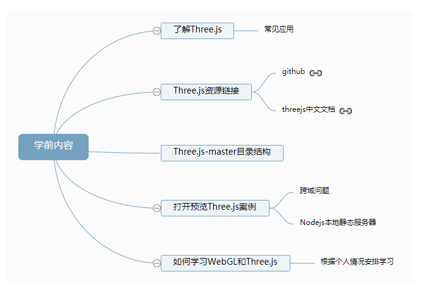
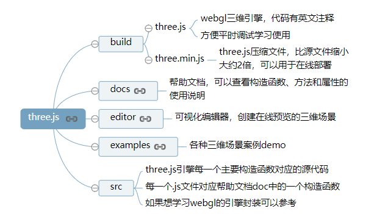

(注1：今天是2021年3月23日，已经是上班第二周了，下班后不知道怎么了不太想再继续学前端了，然后就想着不然换换口味吧，正好我们公司也主要是做多媒体数字视觉服务的，所以我就想着不然就稍微学一下`C#`、`Unity3D`、`WebGL`、`Three.js`、`Canvas`吧，当然了，现在的主要精力还是放在前端上的，不过在学习感到疲倦的时候我觉得调剂一下学点别的也是不错的选择。)

(注2：现阶段也不用说学得有多深，大体了解一下即可。也为了方便以后和其他同事进行沟通和交流吧。)

(注3：[视频链接1](https://www.bilibili.com/video/BV1Xi4y1u7pR?from=search&seid=426737862845848583))

(注4：[视频链接2](https://www.bilibili.com/video/BV1va4y1p7QB?from=search&seid=11868492760104464723))

(注5：[电子书1](http://www.yanhuangxueyuan.com/threejs/docs/index.html#manual/zh/introduction/Creating-a-scene))

(注6：[电子书2](http://www.yanhuangxueyuan.com/Three.js/))

(注7：我主要是抄这个电子书和官方中文文档，然后顺便再看一下视频。)

(注8：我查了一下，Three.js最早的版本是2010年，离现在也只有10年而已。)

# Three.js零基础入门教程(郭隆邦)

# 学前内容

正式学习Three.js编程之前先对threejs进行整体介绍，大家对Three.js整体面貌有一定认知之后，更有利于自己之后的学习安排和规划。

## 了解Three.js

Three.js是基于原生WebGL封装运行的三维引擎，在所有WebGL引擎中，Three.js是国内文资料最多、使用最广泛的三维引擎。

既然Threejs是一款WebGL三维引擎，那么它可以用来做什么想必你一定很关心。所以接下来内容会展示大量基于Threejs引擎或Threejs类似引擎开发的Web3D应用，以便大家了解。

### 物联网3D可视化

在人与人之间联系的互联网时代，主要是满足人与人之间的交流，Web页面的交互界面主要呈现为2D的交互效果，比如按钮、输入框等。

随着物联网的发展,工业、建筑等各个领域与物联网相关Web项目网页交互界面都会呈现出3D化的趋势。物联网相比较传统互联网更强调的是人与物、物与物的联系，当人与物进行交互的时候，比如你通过网页页面远程控制工厂中的一台机器启动或关停，你可以在网页上通过div元素写一个按钮，然后表示机器设备的开关，当然你也可以把该设备以3D的形式展示在网页上，然后就像玩游戏一样直接点击模型上的开关按钮，这两种方式肯定是3D的方式更为直观，当然开发成本也比较大。

[物联网粮仓3D可视化案例](http://www.yanhuangxueyuan.com/3D/liangcang/index.html)

### 产品720在线预览

在浏览器不支持WebGL技术的时代，如果你想在网页上展示一款产品往往是通过2D图片的形式实现。如果想3D展示一个产品，往往依赖于OpenGL技术，比如通过unity3D或ue4开发一个桌面应用，这样做往往很难随意传播，需要用户下载程序很麻烦，如果是通过Web的方式展示产品的三维模型，一个超链接就可以随意传播。

随着WebGL技术的持续推广，5G技术的持续推广，各种产品在线3D展示将会变得越来越普及，比如一家汽车公司的新款轿车可以在官网上在线预览，也许有一天一些电商平台会通过3D模型取代2D图片，现在你朋友推荐推荐给你一款新衣服，你会说发一张图片看看，也许将来你会说发来一个3D模型链接看看。

[玉镯产品在线预览案例](<http://www.yanhuangxueyuan.com/3D/liangcang/index.html>)

[沙发在线预览](<http://app.xuanke3d.com/apps/trayton/#/show>)

[服装在线预览](<http://suit.xuantech.cn/>)

[洗衣机在线交互预览](<https://cdn.weshape3d.com/hir001/1021/web/index.html>)

### 数据可视化

与webgl相关的数据可视化主要是两方面，一方面是海量超大数据的可视化，另一方面是与3D相关的数据可视化。对于超大的海量数据而言，基于canvas、svg等方式进行web可视化，没有基于WebGL技术实现性能更好，对于3D相关的数据可视化基于WebGL技术，借助3D引擎Threejs可以很好的实现。

[解析GeoJOSN数据中国GDP数据可视化](<http://www.yanhuangxueyuan.com/3D/geojsonChina/index.html>)

### H5/微信小游戏

非常火的微信小游戏跳一跳就是使用Three.js引擎开发的。 开发3D类的H5小游戏或者微信小游戏，Three.js引擎是非常好的选择。

通过Threejs开发的小游戏，可以直接部署在微信小程序或者web端，无需下载，方便传播，目前的生态非常和小游戏开发。

### 科教领域

在科教领域通过3D方式展示特定的知识相比较图像更为直观。

[科研平台-蛋白质结构可视化案例](<http://www.rcsb.org/3d-view/2JEN/1>)

[化学相关——分子结构可视化](<http://www.yanhuangxueyuan.com/3D/fenzi/index.html>)

[地理天文相关——太阳系3D预览](<http://www.yanhuangxueyuan.com/3D/solarSystem/index.html>)

### 机械领域

[机械模型在线预览demo](<http://www.yanhuangxueyuan.com/3D/jixiezhuangpei/index.html>)

Onshape是一款机械领域的三维建模软件，如果熟悉Solidworks、UG等CAD软件，那么你可以把Onshape理解为云Solidworks。

### WebVR

对于现在比较火的VR、AR概念，WebGL技术的出现，也是一个好消息，如果你想预览一些VR内容，完全可以不下载一个VR相关的APP，通过threejs引擎实现VR内容发布，然后用户直接通过微信等社交方式推广，直接打开VR内容链接就可以观看。

VR与Web3D技术结合自然就衍生出来一个新的概念WebVR，也就是基于Web实现的VR内容。

### 家装室内设计相关

[室内设计作品展示案例](<http://www.yanhuangxueyuan.com/3D/houseDesign/index.html>)

[云装修平台酷家乐](<https://www.kujiale.com/>)

### 三维模型在线预览平台

| 平台      | 国家 | 网址                      |
| --------- | ---- | ------------------------- |
| sketchfab | 国外 | <https://sketchfab.com/>  |
| 动动三维  | 国内 | <https://www.ddd.online/> |
| 琢刻      | 国内 | <https://gizmohub.com/>   |

### 室内逆向全景漫游平台

通过3D相机对室内空间进行逆向，在Web端以全景图的方式预览室内效果。

| 平台       | 国家 | 网址                      |
| ---------- | ---- | ------------------------- |
| 众趣科技   | 国内 | <http://www.3dnest.cn/>   |
| 贝壳       | 国内 | <https://zz.ke.com//>     |
| matterport | 国外 | <https://matterport.com/> |

## Three.js资源

github链接：<https://github.com/mrdoob/three.js>

Three.js官网：<https://threejs.org/>

### Threejs中文文档

[Threejs中文文档](http://www.yanhuangxueyuan.com/threejs/docs/index.html)

Threejs官网同时提供了英文文档和中文文档，不过有些时候打开会比较慢，所以我在我的个人博客部署了一份官网的中文文档，方便大家查阅。

### Three.js历史版本

github链接查看所有版本：<https://github.com/mrdoob/three.js/releases>

### Three.js-master文件下载

github下载threejs比较慢，所以在网盘放了一份，方便大家下载。

下载地址查看文章：[Three.js-master包下载](http://www.yanhuangxueyuan.com/links.html)

### 相关库

下面表格列举了一些Three.js相关的开源库。

| 库                                                  | 功能                                                         |
| --------------------------------------------------- | ------------------------------------------------------------ |
| [Physijs](https://github.com/chandlerprall/Physijs) | Physijs是一款物理引擎，可以协助基于原生WebGL或使用three.js创建模拟物理现象，比如重力下落、物体碰撞等物理现 |
| [stats.js](https://github.com/mrdoob/stats.js)      | JavaScript性能监控器，同样也可以测试webgl的渲染性能          |
| [dat.gui](https://github.com/dataarts/dat.gui)      | 轻量级的icon形用户界面框架，可以用来控制Javascript的变量，比如WebGL中一个物体的尺寸、颜色 |
| [tween.js](https://github.com/tweenjs/tween.js/)    | 借助tween.js快速创建补间动画，可以非常方便的控制机械、游戏角色运动 |
| [ThreeBSP](https://github.com/sshirokov/ThreeBSP)   | 可以作为three.js的插件，完成几何模型的布尔，各类三维建模软件基本都有布尔的概念 |

## three.js-master目录结构

为了方便大家学习，准备对Three.js工程目录进行简单介绍。如果能很好的利用three.js-master文件下的资源，对于Threejs学习和Web3D项目的开发会极大的帮助。

github链接查看所有目录：<https://github.com/mrdoob/three.js>

~~~javascript
three.js-master
└───build——src目录下各个代码模块打包后的结果
    │───three.js——开发的时候.html文件中要引入的threejs引擎库，和引入jquery一样，可以辅助浏览器调试
    │───three.min.js——three.js压缩后的结构文件体积更小，可以部署项目的时候在.html中引入。
    │
└───docs——Three.js API文档文件
    │───index.html——打开该文件可以实现离线查看threejs API文档
    │
└───editor——Three.js的可视化编辑器，可以编辑3D场景
    │───index.html——打开应用程序
    │
└───docs——Three.js API文档文件
    │───index.html——打开该文件可以实现离线查看threejs API文档
    │
└───examples——里面有大量的threejs案例，平时可以通过代码编辑全局查找某个API、方法或属性来定位到一个案例
    │
└───src——Three.js引擎的各个模块，可以通过阅读源码深度理解threejs引擎
    │───index.html——打开该文件可以实现离线查看threejs API文档
    │
└───utils——一些辅助工具
    │───\utils\exporters\blender——blender导出threejs文件的插件
~~~

### html文件引入three.js引擎

在.html文件中引入three.js就像引入其它.js文件一样直接引入即可。

~~~javascript
<!--相对地址加载-->

~~~

我已经把three.js文件上传到了[我的博客服务器](http://www.yanhuangxueyuan.com/)， 可以通过下面的URL地址去加载

~~~javascript
<!--http绝对地址远程加载-->

<!-- 压缩版本 -->

~~~

.html文件中引入threejs文件之后，可以通过浏览器控制台F12验证是否成功引入，在.html文件引入three.js后可以通过`THREE`访问所有的API。

~~~javascript
// 如果返回的不是未定义，说明threejs成功引入
console.log('打印场景API',THREE.Scene);
~~~

## 打开预览Three.js案例(跨域问题)

不需要加载外部贴图和模型文件的three.js案例，可以直接使用浏览器打开.html案例文件，通常一个threejs项目案例往往都会加载一些外部模型，因此打开threejs案例要搭建一个本地的静态服务器，否则的话，threejs案例无法正常打开，浏览器控制台会提示[跨域问题](http://www.yanhuangxueyuan.com/three.js_course/longword/crossdomain.html)。

如果你知道怎么搭建本地静态服务器，自己用任何方式搭建都可以。如果不了解的话，建议使用nodejs去快速搭建一个本地静态服务器，对于一个WebGL工程师或前端工程师来说，肯定是要学习Nodejs的。

### Nodejs本地静态服务器

使用Nodejs搭建本地静态服务器很简单，首先是你要先百度Nodejs安装的相关文章，先在你的电脑上安装配置好Nodejs，熟悉下NPM的使用，然后使用npm执行`npm install -g live-server`安装`live-server`模块，如果你想通过安装好的`live-server`模块开启一个静态服务器，打开命令行，进入threejs案例所在的文件目录，然后执行`live-server`命令就可以。

通过浏览器访问`http://localhost:8080`或`http://127.0.0.1:8080`地址，找到threejs案例的.html文件直接打开就可以看到三维场景渲染效果。

### 开发调试-热更新

在学习threejs的过程中，往往需要频繁的代码测试，查看threejs代码的渲染效果。这时候你肯定希望代码修改之后，threejs渲染效果立即热更新。

如果通过`live-server`模块搭建的本地静态服务器，你可以实现代码的热加载。也就是说你修改一段代码，然后保存.html代码文件，.html对应的threejs案例就会重新渲染。

# 官方中文文档

