(注1：现在是2021年3月1日，这个项目和我之前做的Vue电商项目感觉大差不差，不过听说这个视频挺经典，授课老师是黄弈，他也是上个项目用的`better-scroll`的作者，所以我决定把这个项目看完，正好自己之前的那个项目做的也过了好几个月了，而且也并没有很扎实的掌握，这个项目就当作再次复习一遍Vue吧。)

(注2：这个视频一共有2期，一个是1期，是用Vue1.0开发的，另一个是2期，是用Vue2.5开发的。不然我先看1期视频，也了解一下Vue1.0吧。)

(注3：这个项目视频只是开发了饿了吗一个模块的开发，没有实现软件的全部功能。不过开发一个模块里面也有很多东西值得去学习的。)

(注4：我本来打算就新建一个仓库，弄2个分支，一个使用Vue1.0和相关的其他版本的工具来做项目，一个使用Vue2.5和其他版本的工具来做项目，但是我后来又怕这样太乱，而且我需要安装不同版本的Vue-cli，所以还是新建2个仓库分别做Vue1.0和Vue2.5的项目比较好。)

(注5：我改变主意了，我下载了老师的源码，发现他是把V1.0和V2.0项目都放到一个仓库，使用2个分支来管理的，既然老师这样做了，那我这样做也应该没问题，那就不建2个仓库了，这个也累赘。)

# 第1期视频(Vue1.0开发)

* `Vue`具体版本：V1.0.21
* `vue-router`：V0.7.13
* `vue-resource`: V1.0.1(现在都用Axios，但是为了和视频一致，就用这个吧。)
* `better-scroll`：V0.1.7
* `webpack`：1.12.2
* `vue-cli`：老师这个视频是2016年的，我就装`vue-cli 2.0`吧。

## 课程简介

### 介绍Vue.js

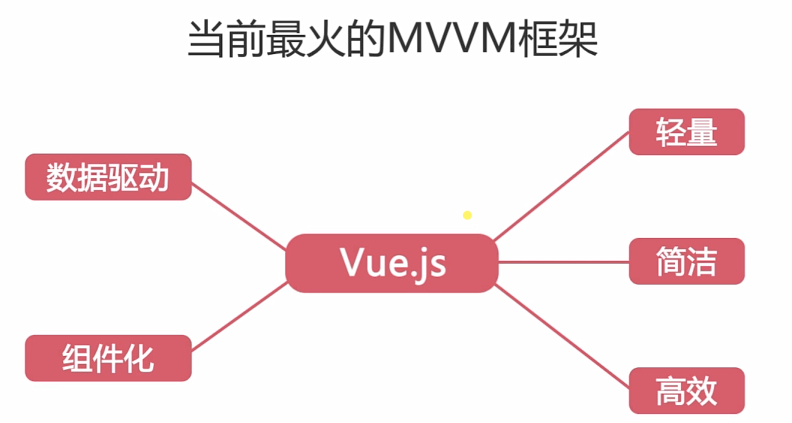

### 项目步骤

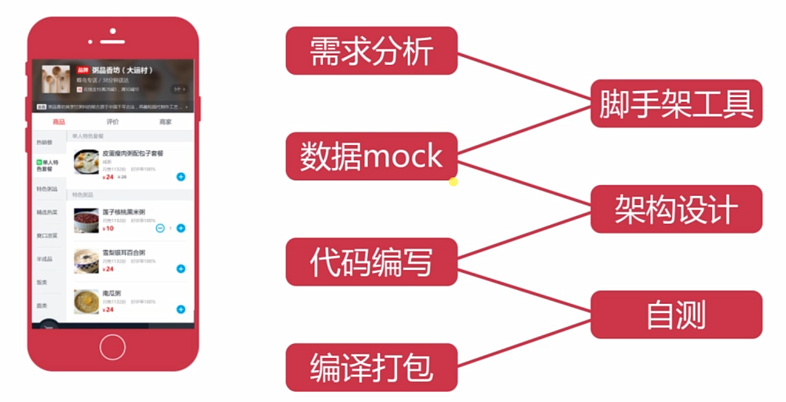

### 代码质量要求

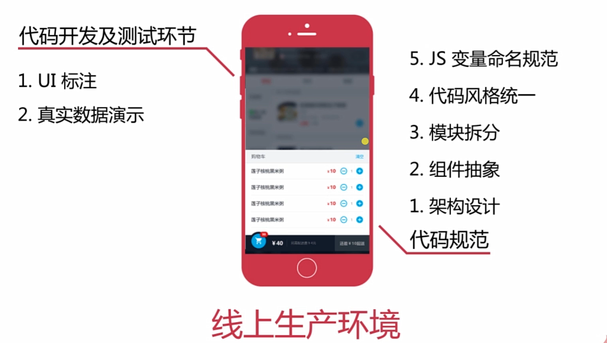

### 功能技术分析

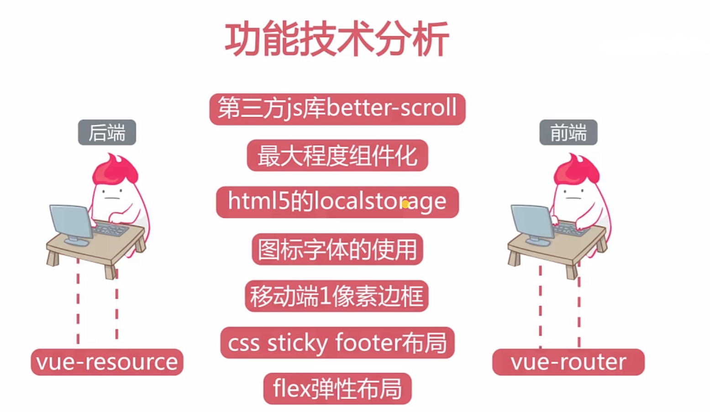

### 前置知识

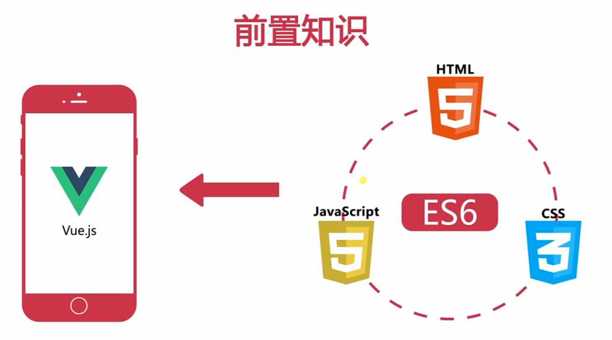

### 学习目标

* 掌握`Vue.js`在实战中的运用
* 学会使用`Vue.js`完整地开发移动端App
* 学会组件化、模块化的开方式

### 学习内容

* `Vue.js`框架介绍
* `Vue-cli`脚手架搭建基本代码框架
* `vue-router`：官方插件管理路由
* `vue-resource`： Ajax通信(现在已废弃，改用Axios了，到时候看怎么弄)
* `Webpack`：构建工具
* `es6 + eslint`：eslint是es6代码风格检查工具

* 移动端常用开发技巧
  * Flex弹性布局
  * CSS的stickyfooter布局
  * 酷炫的交互设计

## Vue.js介绍

### 近年来前端开发趋势

* 旧浏览器逐渐淘汰，移动端需求增加
* 前端交互越来越多，功能越来越复杂
* 架构从传统后台MVC向REST API + 前端`MV*`迁移
  * `MV*`包括`MVC`、`MVP`和`MVVM`框架，而`Vue.js`则是`MVVM`框架设计的。

### MVVM框架

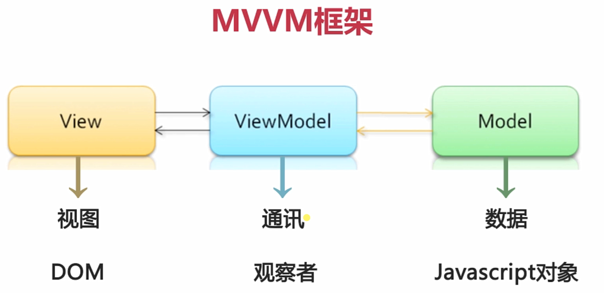

#### MVVM应用场景

* 针对具有复杂交互逻辑的前端应用
* 提供基础的架构抽象
* 通过Ajax数据持久化，保证前端用户体验

### 什么是Vue.js

* 它是一个经量级MVVM框架
* 数据驱动+组件化的前端开发
* Github超过25k+的star数，社区完善

### 对比Angular、React

* Vue.js更轻量，gzip后大小只有20K+
* Vue.js更易上手，学习曲线平稳
* 吸取两家之长，借鉴了angular的指令和react的组件化

### Vue.js核心思想

* 数据驱动

  * DOM是数据的一种自然映射

    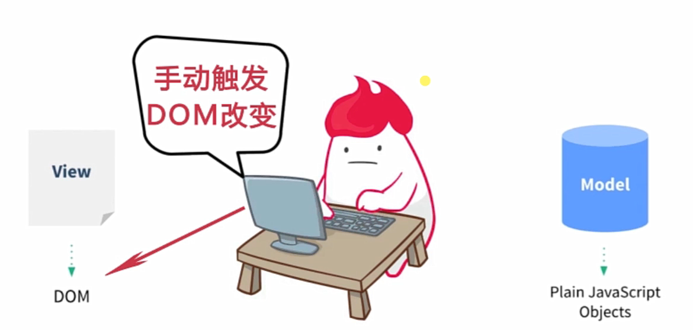

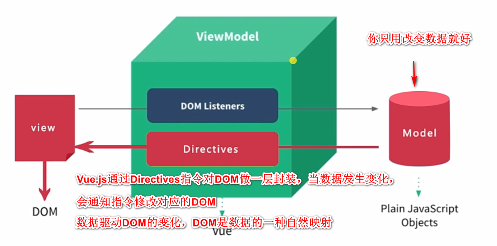

  * 数据响应原理

    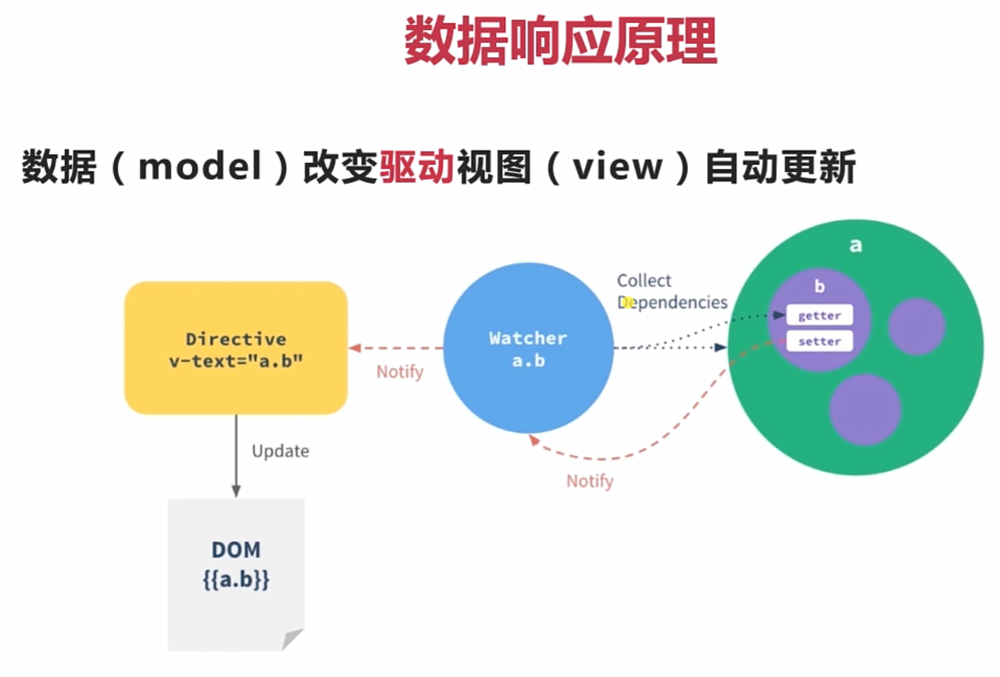

* 组件化

  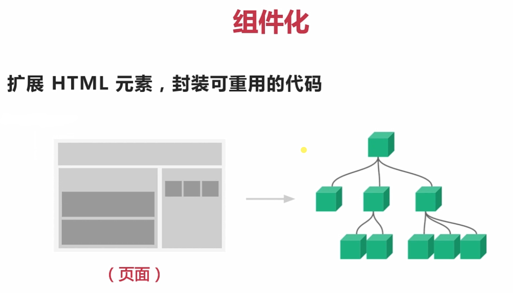

  * 组件设计原则
    * 页面上每个独立的可视/可交互区域视为一个组件
    * 每个组件对应一个工程目录，组件所需要的各种资源在这个目录下就近维护
    * 页面不过是组件的容器，组件可以嵌套自由组合形成完整的页面

## Vue-cli开启Vue.js项目

### Vue-cli介绍

* Vue-cli是Vue的脚手架工具，脚手架可以帮助我们编写基础的代码。Vue-cli就是帮助我们写好基础代码的工具。

  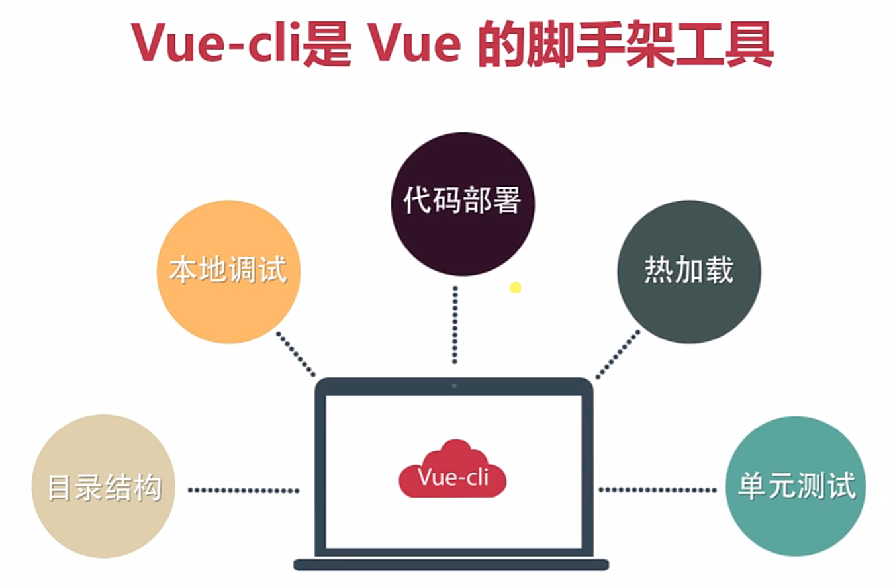

   

### Vue-cli安装

[使用 nvm 管理不同版本的 node 与 npm](https://www.runoob.com/w3cnote/nvm-manager-node-versions.html)

[nvm安装node成功，npm失败问题](https://blog.csdn.net/fenfeidexiatian/article/details/96993384)

[vue-cli多版本共存](https://juejin.cn/post/6869584523416469511)

[同一台电脑 实现 vue-cli2和vue-cli3同时并存](https://blog.csdn.net/Jioho_chen/article/details/90455778)

[Windows下完全卸载node.js并安装node.js的多版本管理工具nvm-windows](https://blog.csdn.net/lewky_liu/article/details/87959839)

[多个项目使用的webpack版本不同怎么打包？](http://errornoerror.com/question/9345265589611341320/)

[webpack 踩过的坑](https://www.jianshu.com/p/ed9af07f2abd)

[让Vue-cli生成vue+webpack的项目为vue1.0版本以及端口占用问题解决办法](https://blog.csdn.net/diligentkong/article/details/75040960)

[vue搭建脚手架 出现问题Command vue init requires a global addon to be installed](https://blog.csdn.net/qq_42429367/article/details/105616392)

* 因为我之前已经安装了V4.5.11版本的Vue-cli了，这里为了防止版本过高产生其他的问题，我这里还要在我的项目里局部安装一下视频里低版本的Vue-cli。

* 我决定学一下`nvm-windows`，来用它管理不同版本的node和npm。

* 我根据上面的提示先把自己的node给删了，然后下载了`nvm-windows`，先下载了视频里老师做Vue1.0项目时所用的node版本`V4.4.5`(我现在vue cli2.0.0的时候，提示node版本太低，于是我又下载了一个8.11.2的版本。)

* 好烦呐！搞了一上午加一下午，还没弄好，我太难了！！！

* 我最终是这样弄的

  * Node还是用的最新的版本了，nvm就相当于没有派上用场。

  * 先是全局安装`vue-cli`，使用的是平常的`npm install -g @vue/cli`，最终安装的版本当然是最新的V4.5.1了。

  * 然后就死马当活马医了，在自己的项目上输入`vue init webpack#1.0 VueEleApp`，然后它停止了好一会儿，终于出现了安装项目目录，我就顺着这个填吧，看到时候项目安装成功后是什么版本吧。

    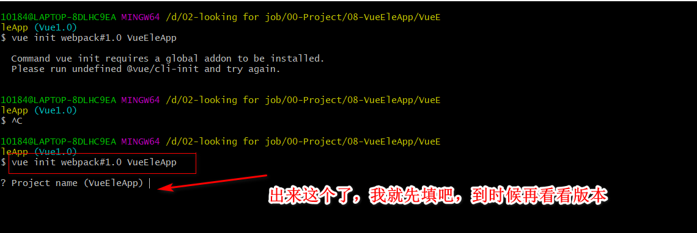

  * 注意项目名不能有大写字母，最终项目名称改成和视频老师的一样，为`sell`了。

  * 激动，我看了一下`package.json`配置信息，发现确实安装的是`vue1.0`版本，早知道这么简单，我前面还这么费劲的折腾什么呢！！！我还以为必须要安装低版本的`Vue-cli`才能安装上`Vue1.0`呢？看来是我错了。

    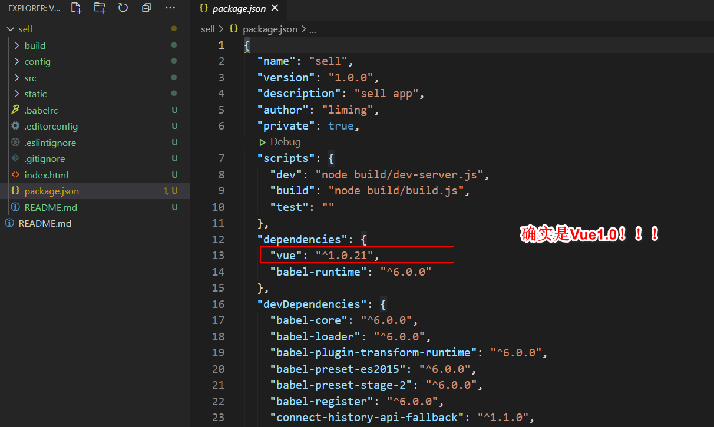

  * 然后再执行`npm install`，安装依赖，生成`node_modules`文件夹。

### 项目运行

* 然后再运行`npm run dev`来执行这个项目。

  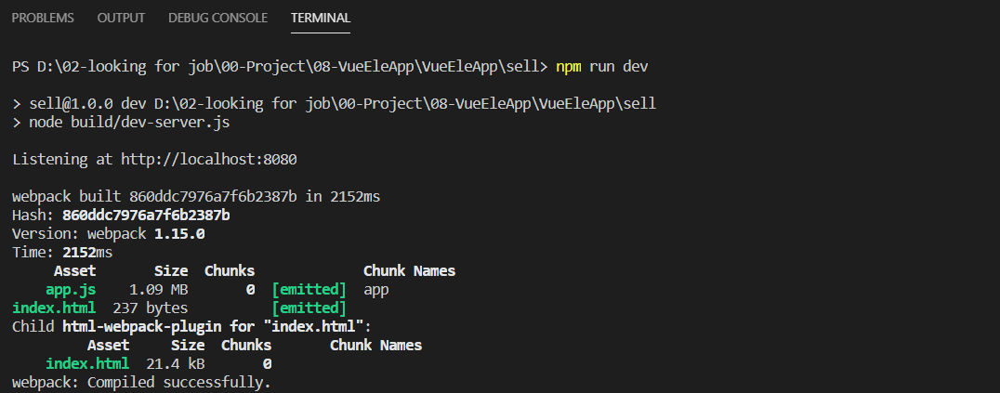

* 因为标签是对大小写不敏感的，所以你导出的是`Hello.vue`，但是使用`<hello></hello>`组件也是可以的。

* `App.vue`中的`import Hello from './components/Hello'`表明先把这个`Hello.vue`组件先引用过来，`export default{components:{Hello}}`表明再把这个组件进行注册，最后才能再`App.vue`里面进行使用。第一步：**引用**；第二步：**注册**；第三步：**使用**。

* 我们之所以可以在`index.html`中直接使用`<app></app>`，是因为我们在入口文件`main.js`里面进行了`new Vue({components:{App}})`的注册，所以才能使用。

### 项目文件介绍

* 老师就简单介绍了一下每个项目具体是干什么的，有什么用。

### Webpack打包

* 老师也就大体讲了一下Webpack文件里面的代码，这玩意儿没法做笔记，我也就大体听了一下了。

## 准备工作

### 需求分析

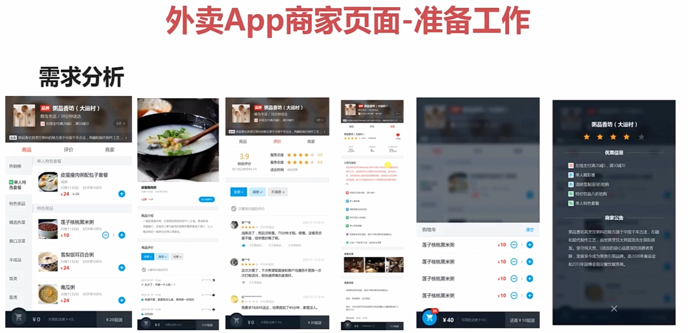

### 项目资源准备

* 老师给我们展示了一下resource文件夹里面的所有准备文件。

### 图标字体制作

* 我们首先登陆IcoMoon图标字体制作网站：https://icomoon.io/
* 点击右上角IcoMoon App这个按钮，它会跳转到新的页面
* 这里它会提供很多免费的图标，不过这里我们不打算使用它们，我们点击左上角的`Import Icons`按钮，导入我们自己的svg图片。
* 导入后我们将svg图片全部选中，点击右下角的`Generate Font`按钮。
* 点击Preferences按钮，进行一些设置。
* 再点击右下角Download按钮，将它下载下来。

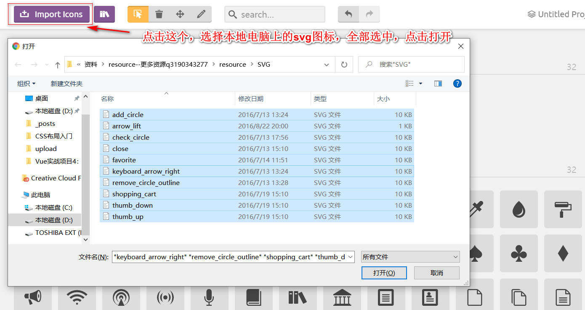

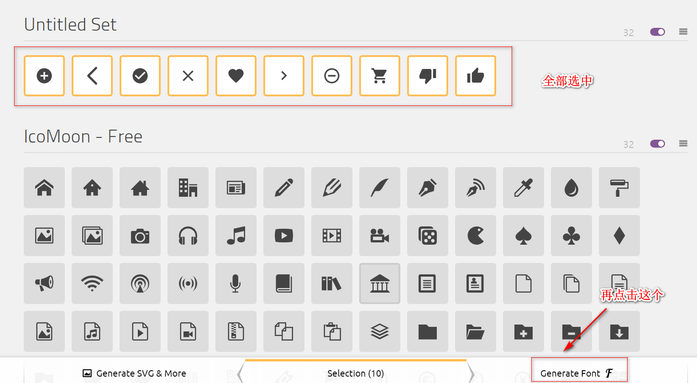

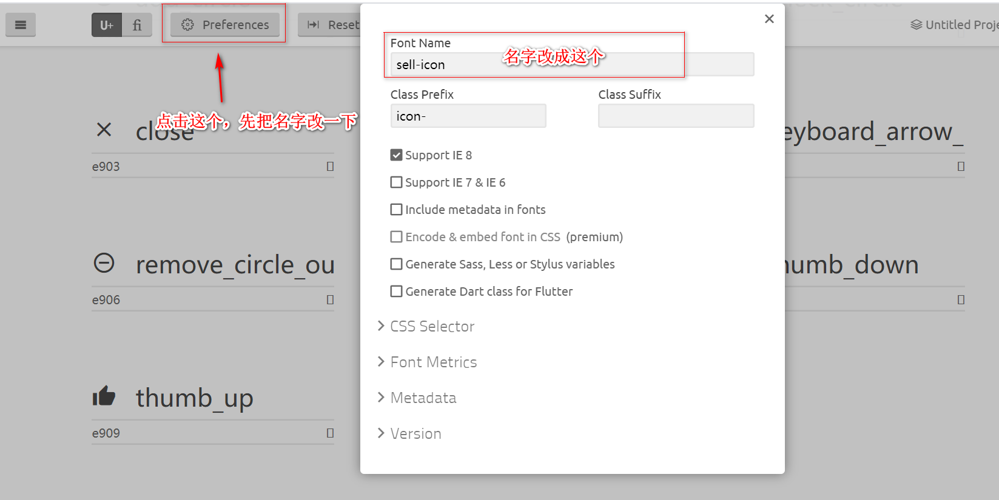

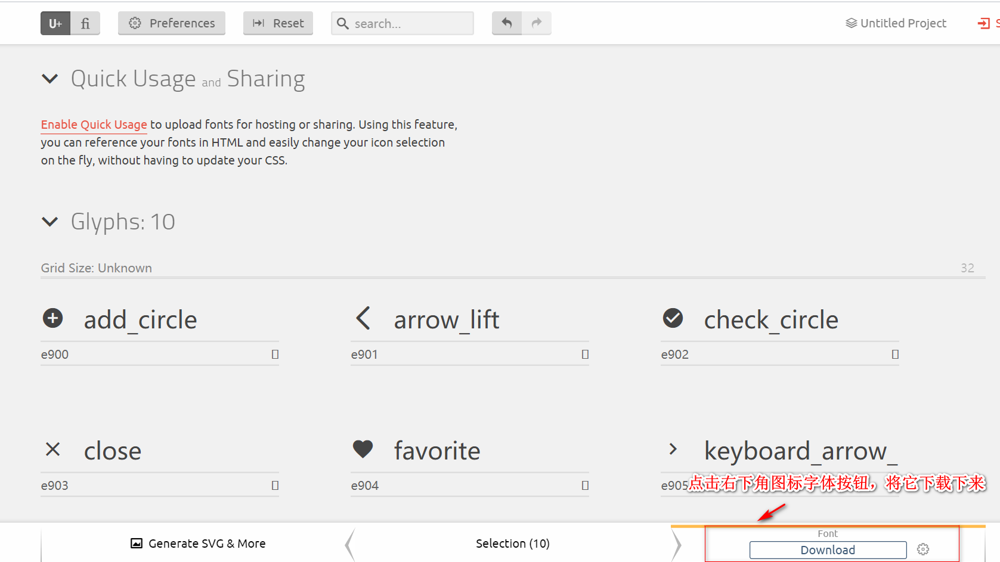

### 项目目录设置

* 我们所有的代码都会放到src目录的文件夹下，其中：
* src里面的`main.js`是我们的入口文件。
* src里面的`App.vue`是整个页面的Vue实例文件，也就是把整个页面看成是Vue的大组件。
* src目录下我们通常会有2个子目录：`common`目录和`components`目录。
  * `components`目录：我们一般不会直接把所有组件都直接放到里面，而是根据页面不同新建不同的文件夹，比如新建一个`header`文件夹，里面存放`Header.vue`及这个组件所需的图片等相关资源。原因是组件的设计原则就是就近维护，我们把一个组件相关的资源都放在一个目录下，对外是隔离的，这样是非常有利于代码的维护。
  * `common`目录：这个目录主要包含一些公共的模块和资源，我们会在这个`common`目录下新建三个子目录，分别是：`js`、`stylus`、`fonts`。
    * 我们在上节课生成的图标字体fonts里面的文件复制到fonts文件夹下。
    * 我们在上节课生成的`style.css`文件复制到stylus文件夹下。并将其改名为`icon.styl`。然后再将里面的小括号去掉，分号再删掉，就变成了stylus语法了。
  * 我们再将src里面的`assets`目录删掉，我们不需要它。

### mock数据模拟

* 老师将模拟的数据放到`data.json`里面去了。

* 然后老师在`dev-server.js`里面使用express的路由来请求数据。(我的Node还没学完，使用express路由的这种数据请求方式也是第一次看见)新增代码如下：

  ~~~javascript
  var app = express()
  //在这里开始写
  // 我们使用express来定义这些数据的读取
  var appData = require('../data.json');
  // 先拿到data.json
  
  var seller = appData.seller;
  var goods = appData.goods;
  var ratings = appData.ratings;
  // 再定义一些变量
  
  var apiRoutes = express.Router();
  apiRoutes.get('/seller',function(req,res){
    res.json({
      errno:0,
      // 真实数据是业务方自己去定义的一些业务码
      // seller:seller
      data:seller
      // 这里我们直接叫data更好
    });
  });
  
  apiRoutes.get('/goods',function(req,res){
    res.json({
      errno:0,
      data:goods
    });
  });
  
  apiRoutes.get('/ratings',function(req,res){
    res.json({
      error:0,
      data:ratings
    });
  });
  // 然后再编写一些路由
  
  app.use('/api',apiRoutes);
  var compiler = webpack(webpackConfig)
  //在这里结束
  ~~~

## 页面骨架开发

[移动设备分辨率（终于弄懂了为什么移动端设计稿总是640px和750px）](https://blog.csdn.net/chelen_jak/article/details/84632804)

* 我们现在static文件夹下新建一个css文件夹，里面新建一个`reset.css`文件，对css进行初始化。[官网链接如下](http://cssreset.com/)、[代码地址如下-官网这个好像不全，我复制的老师的代码](https://meyerweb.com/eric/tools/css/reset/)(现在用`normalize.css`的好像更多了吧)

* 然后在`index.html`里面使用link标签引入`reset.css`样式。

* 另外，因为我们这个是移动端界面，所以还要在`index.html`中写上`    <meta name="viewport" content="width=device-width,initial-scale=1.0,maxmum-scale=1.0,minimum-scale=1.0,user.scale=no">`。

* 我们现在`App.vue`里面先写这3个东西：

  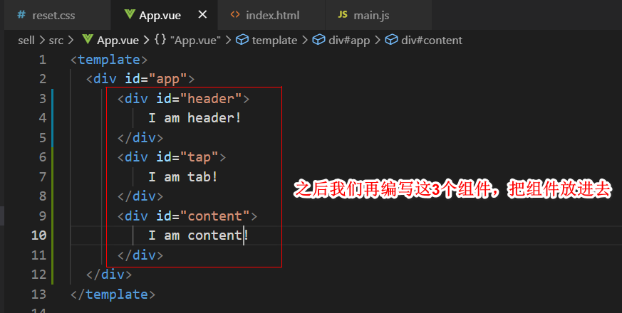

* 移动端的图片设置都是按照2倍大小进行设置的，设备上是375px，但是它的物理像素是750px。所以**商品、评价、商家**美工给的图片高度是80px，我们写代码只能写40px。

* 为什么设计稿640px和750px要除以2，就是因为设计师给的640px和750px是**物理像素**,而我们在浏览器模拟调试移动端的时候看到的像素是**逻辑像素**。

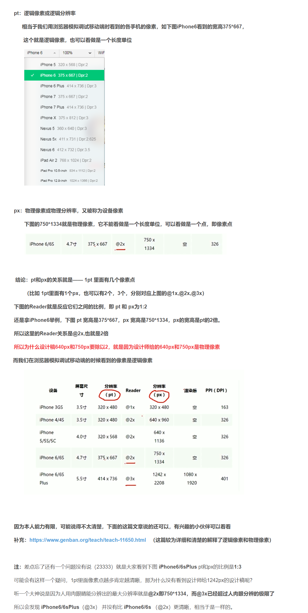

### 大体代码

**App.vue**

~~~vue
<template>
  

      <v-header></v-header>
      <!-- header在HTML5里面是一个原生的标签，所以我们这个组件名最好不要叫header -->
      <!-- 我们可以给它起一个别名 -->
      <!-- 

          I am header!
      
 -->
      

          <!-- I am tab! -->
          
商品

          
评论

          
商家

      

      

          I am content!
      

  

</template>

~~~

### Vue-router

* 老师这里安装的版本是`0.7.13`的，直接在`package.json`的`dependencies`里面写`"vue-router": "^0.7.13",`然后再`npm install`进行安装。
* 刚开始版本的`Vue-router`当你点击链接时，它会自动生成一个`v-link-active`类，你可以为这个类设置一些样式，让它点击时变红色。

### 1像素边框

* 如果我们直接写`border-bottom:1px solid rgba(7,17,27,0.1)`的话，在PC端是没有问题的，1像素就是1像素，但是在手机端的话，1像素就不是1像素了，因为手机端有一个dpi的概念。
* 我们输入`ipconfig`得到我们的IPV4地址，将localhost替换成它，我们依然可以访问到这个页面。然后我们登陆`https://cli.im/`，将地址输入进去，会生成一个二维码，我们微信扫一扫就可以手机登陆这个页面了。(前提条件是手机和电脑在同一个局域网中。)

## header组件开发

### Vue-resource应用

[为何官方推荐使用axios而不用vue-resource？](https://github.com/haizlin/fe-interview/issues/305)

* 老师这里使用了`Vue-resource`来进行数据交互。

  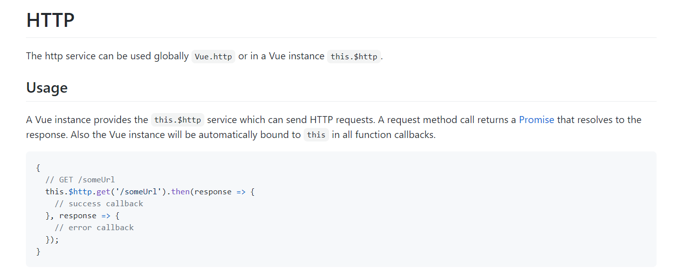

### 外部组件

# 第2期视频(Vue2.5开发)

## 课程导学

### 课程概述

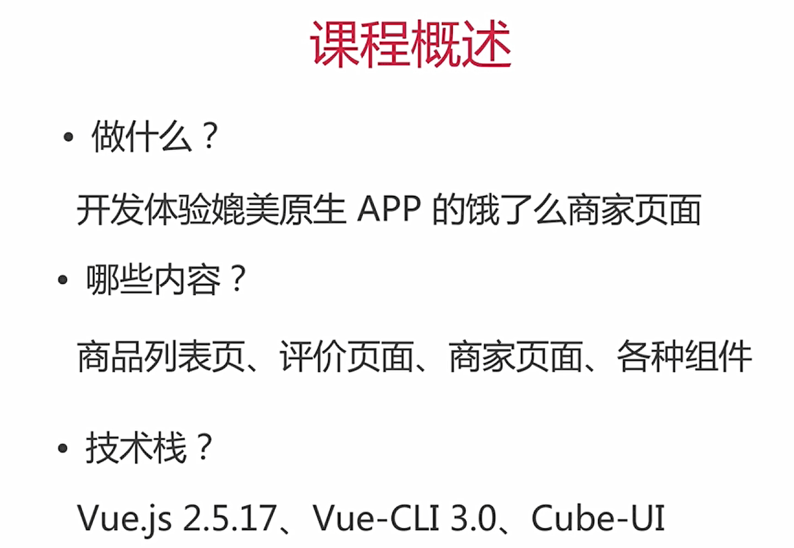

### 核心技术

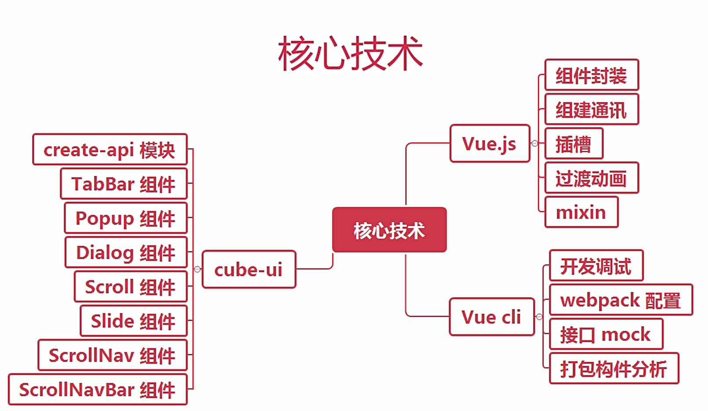

### 课程安排

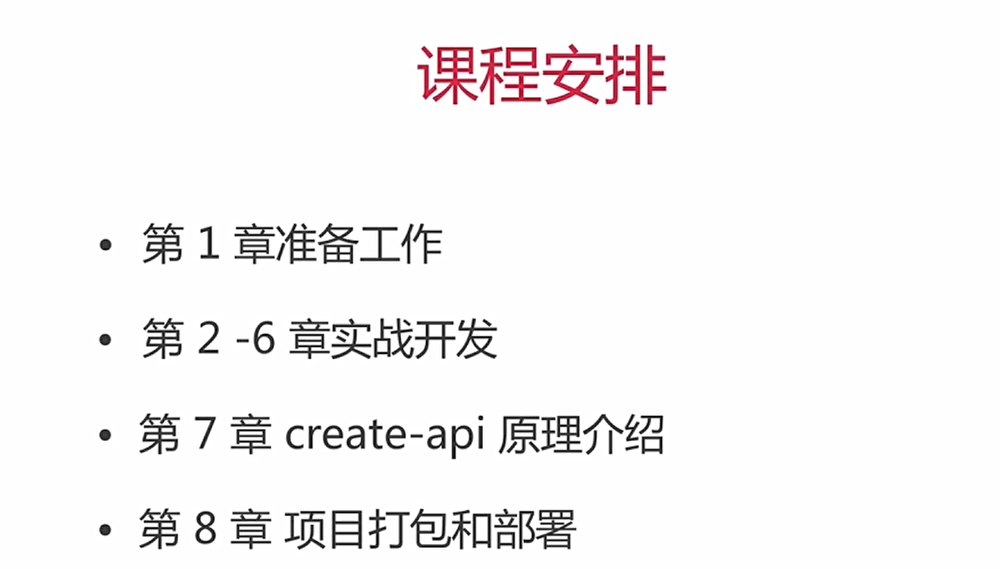

### 讲授方式

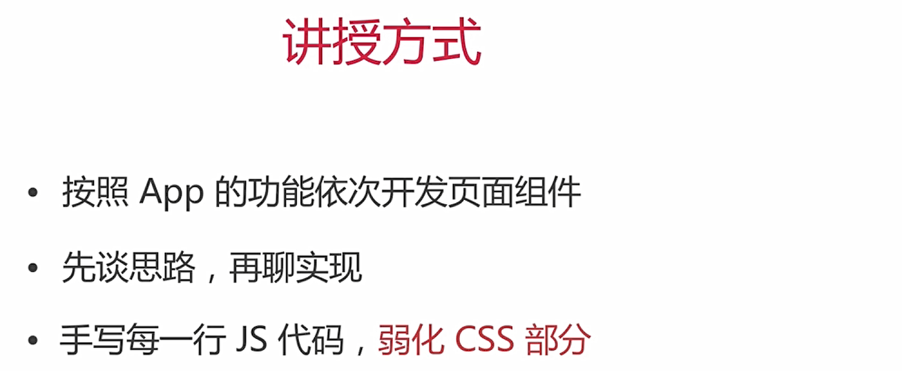

### 课程收获

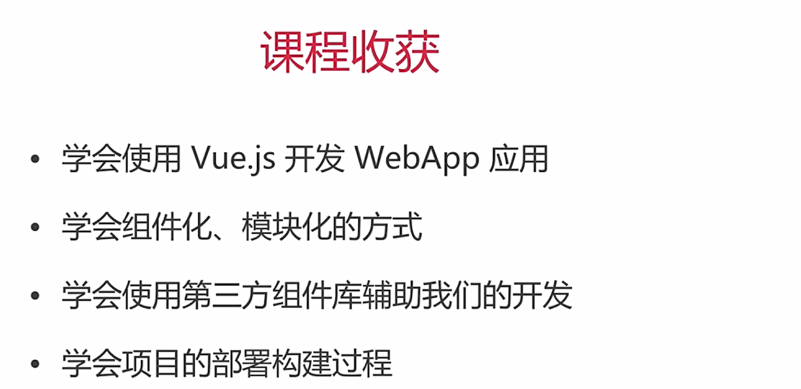

### 学习前提

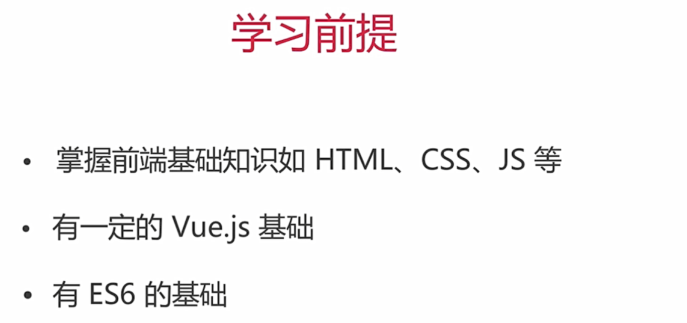

