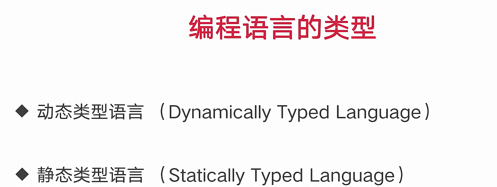
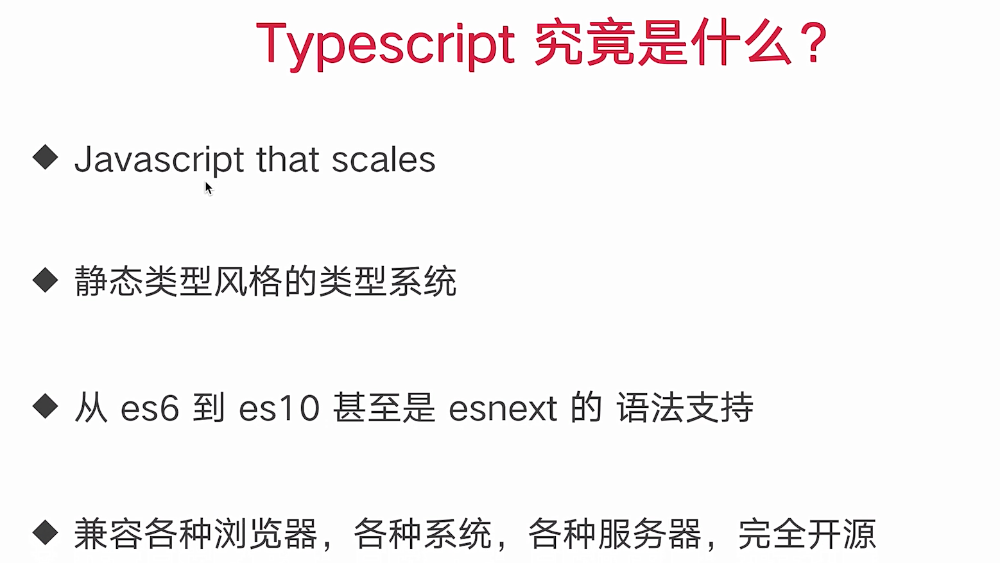

(注1：该项目的相对应文档：[从零到一开发到上线 高仿知乎专栏](http://docs.vikingship.xyz/))

# TypeScript介绍

##  编程语言的类型

## TypeScript究竟是什么

## TypeScript全套相关配置

`tsconfig.json`

~~~javascript
{
  "include": ["src", "demo"],
  "compilerOptions": {
    "module": "commonjs",
    "noImplicitReturns": true,
    "noUnusedLocals": true,
    "esModuleInterop": true,
    "target": "esnext",
    "strict": true,
    "outDir": "app",
    "declaration": true,
    "sourceMap": true
  }
}
~~~

`jest.config.js`

~~~javascript
module.exports = {
  roots: ['<rootDir>/src'],
  transform: {
    '^.+\\.tsx?$': 'ts-jest',
  },
  testPathIgnorePatterns: ['/node_moudles/', './src/utils/test.ts'],
}
~~~

`babel.config.js`

~~~javascript
module.exports = {
  presets: ['@babel/typescript'],
  plugins: [
    '@babel/plugin-transform-modules-commonjs',
    '@babel/proposal-class-properties',
    '@babel/proposal-object-rest-spread',
  ],
}
~~~

## 小贴士

* TypeScript即使编译报错了，还是会生成编译后的结果的，我们仍然可以使用编译后的文件的。

* undefined和null是所有类型的子类型，  举个例子，undefined类型的变量可以赋值给number类型的变量。

