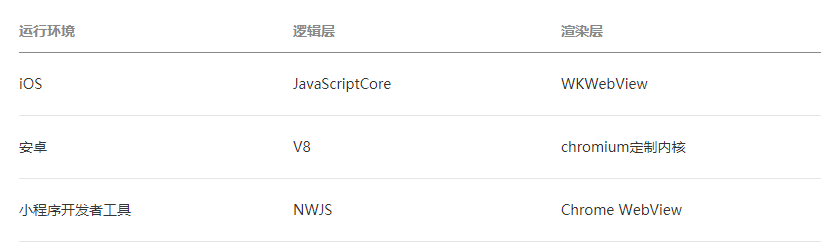
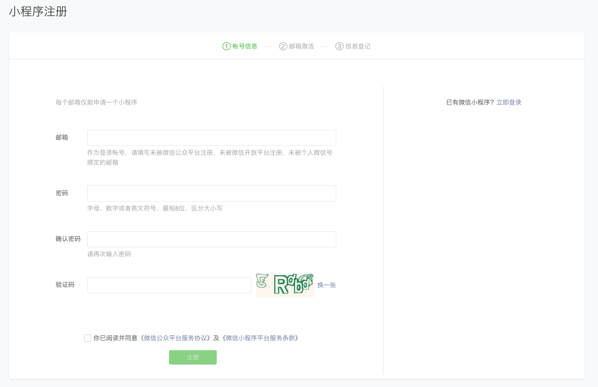
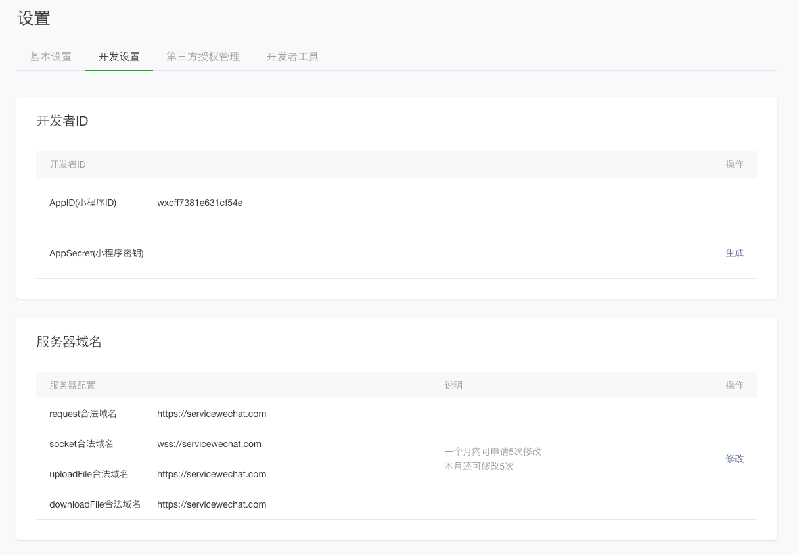
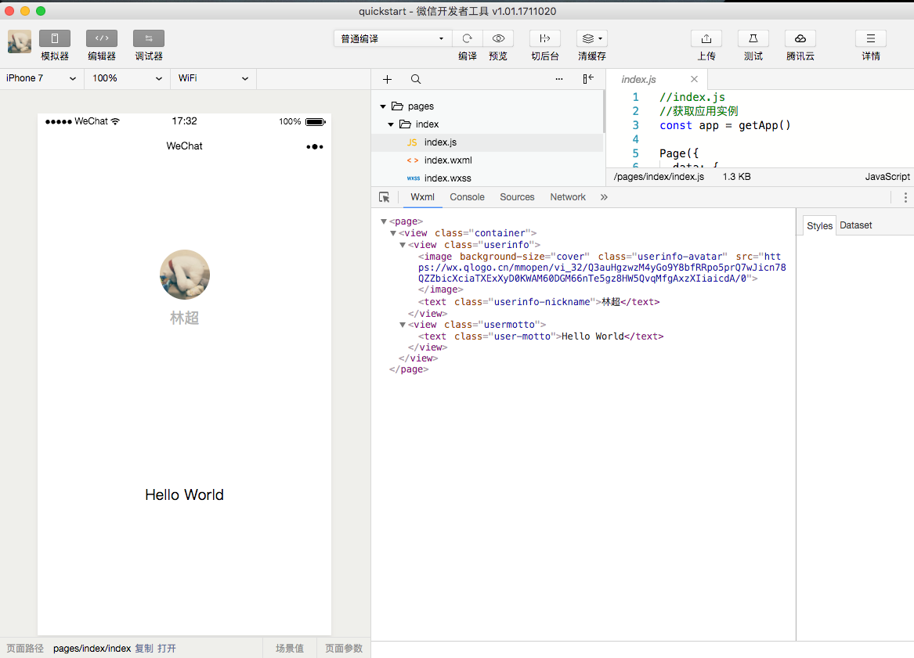

(注1：没时间看视频的时候就看一下官方文档，我觉得我是过于依赖看视频了，对于官方文档的学习主动性不足。就好像一个孩子，吃饭总是不自己吃，总指望着别人喂给他吃一样。如果想要成长的更好一些，这个习惯就不得不改变。不要排斥去读官方文档，所以的视频和其他文章都是对文档的注解，所以根还是在文档这里。暂时看不懂也没有什么打不了的，看一遍，再看一遍，慢慢的，肯定会有收获的。)

(注2：[微信小程序官方文档](https://developers.weixin.qq.com/miniprogram/dev/framework/quickstart/))

(注3：试着看了一下官方文档，目前感觉不算难，跟着教程一步步去做，没有什么大问题。)

# 起步

## 小程序简介

小程序是一种全新的连接用户与服务的方式，它可以在微信内被便捷地获取和传播，同时具有出色的使用体验。

### 小程序技术发展史

小程序并非凭空冒出来的一个概念。当微信中的 **WebView(网络视图)** 逐渐成为移动 Web 的一个重要入口时，微信就有相关的 JS API 了。

[什么是WebView](https://www.cnblogs.com/ricoliu/p/6361022.html)

代码清单1-1 使用 WeixinJSBridge 预览图片

~~~javascript
WeixinJSBridge.invoke('imagePreview', {
    current: 'http://inews.gtimg.com/newsapp_bt/0/1693121381/641',
    urls: [ // 所有图片的URL列表，数组格式
        'https://img1.gtimg.com/10/1048/104857/10485731_980x1200_0.jpg',
        'https://img1.gtimg.com/10/1048/104857/10485726_980x1200_0.jpg',
        'https://img1.gtimg.com/10/1048/104857/10485729_980x1200_0.jpg'
    ]
}, function(res) {
    console.log(res.err_msg)
})
~~~

代码1-1是一个调用微信原生组件浏览图片的JS API，相比于额外引入一个JS图片预览组件库，这种调用方式显得非常简洁和高效。

实际上，微信官方是没有对外暴露过如此调用的，此类 API 最初是提供给腾讯内部一些业务使用，很多外部开发者发现了之后，依葫芦画瓢地使用了，逐渐成为微信中网页的事实标准。2015年初，微信发布了一整套网页开发工具包，称之为 JS-SDK，开放了拍摄、录音、语音识别、二维码、地图、支付、分享、卡券等几十个API。给所有的 Web 开发者打开了一扇全新的窗户，让所有开发者都可以使用到微信的原生能力，去完成一些之前做不到或者难以做到的事情。

同样是调用原生的浏览图片，调用方式如代码清单1-2所示。

代码清单1-2 使用 JS-SDK 调用图片预览组件

~~~javascript
wx.previewImage({
  current: 'https://img1.gtimg.com/10/1048/104857/10485726_980x1200_0.jpg',
  urls: [ // 所有图片的URL列表，数组格式
    'https://img1.gtimg.com/10/1048/104857/10485731_980x1200_0.jpg',
    'https://img1.gtimg.com/10/1048/104857/10485726_980x1200_0.jpg',
    'https://img1.gtimg.com/10/1048/104857/10485729_980x1200_0.jpg'
  ],
  success: function(res) {
    console.log(res)
  }
})
~~~

JS-SDK是对之前的 WeixinJSBridge 的一个包装，以及新能力的释放，并且由对内开放转为了对所有开发者开放，在很短的时间内获得了极大的关注。从数据监控来看，绝大部分在微信内传播的移动网页都使用到了相关的接口。

JS-SDK 解决了移动网页能力不足的问题，通过暴露微信的接口使得 Web 开发者能够拥有更多的能力，然而在更多的能力之外，JS-SDK 的模式并没有解决使用移动网页遇到的体验不良的问题。用户在访问网页的时候，在浏览器开始显示之前都会有一个白屏的过程，在移动端，受限于设备性能和网络速度，白屏会更加明显。我们团队把很多技术精力放置在如何帮助平台上的Web开发者解决这个问题。因此我们设计了一个 JS-SDK 的增强版本，其中有一个重要的功能，称之为“微信 Web 资源离线存储”。

以下文字引用自内部的文档（没有最终对外开放）：

> 微信 Web 资源离线存储是面向 Web 开发者提供的基于微信内的 Web 加速方案。
>
> 通过使用微信离线存储，Web 开发者可借助微信提供的资源存储能力，直接从微信本地加载 Web 资源而不需要再从服务端拉取，从而减少网页加载时间，为微信用户提供更优质的网页浏览体验。每个公众号下所有 Web App 累计最多可缓存 5M 的资源。

这个设计有点类似 HTML5 的 Application Cache，但在设计上规避了一些 Application Cache的不足。

在内部测试中，我们发现 离线存储 能够解决一些问题，但对于一些复杂的页面依然会有白屏问题，例如页面加载了大量的 CSS 或者是 JavaScript 文件。除了白屏，影响 Web 体验的问题还有缺少操作的反馈，主要表现在两个方面：页面切换的生硬和点击的迟滞感。

微信面临的问题是如何设计一个比较好的系统，使得所有开发者在微信中都能获得比较好的体验。这个问题是之前的 JS-SDK 所处理不了的，需要一个全新的系统来完成，它需要使得所有的开发者都能做到：

* 快速的加载

* 更强大的能力

* 原生的体验

- 易用且安全的微信数据开放

- 高效和简单的开发

这就是小程序的由来。

## 小程序与普通网页开发的区别

小程序的主要开发语言是 JavaScript ，小程序的开发同普通的网页开发相比有很大的相似性。对于前端开发者而言，从网页开发迁移到小程序的开发成本并不高，但是二者还是有些许区别的。

网页开发渲染线程和脚本线程是互斥的，这也是为什么长时间的脚本运行可能会导致页面失去响应，而在小程序中，二者是分开的，分别运行在不同的线程中。网页开发者可以使用到各种浏览器暴露出来的 DOM API，进行 DOM 选中和操作。而如上文所述，小程序的逻辑层和渲染层是分开的，逻辑层运行在 JSCore 中，并没有一个完整浏览器对象，因而缺少相关的DOM API和BOM API。这一区别导致了前端开发非常熟悉的一些库，例如 jQuery、 Zepto 等，在小程序中是无法运行的。同时 JSCore 的环境同 NodeJS 环境也是不尽相同，所以一些 NPM 的包在小程序中也是无法运行的。

网页开发者需要面对的环境是各式各样的浏览器，PC 端需要面对 IE、Chrome、QQ浏览器等，在移动端需要面对Safari、Chrome以及 iOS、Android 系统中的各式 WebView 。而小程序开发过程中需要面对的是两大操作系统 iOS 和 Android 的微信客户端，以及用于辅助开发的小程序开发者工具，小程序中三大运行环境也是有所区别的，如表1-1所示。

表1-1 小程序的运行环境

网页开发者在开发网页的时候，只需要使用到浏览器，并且搭配上一些辅助工具或者编辑器即可。小程序的开发则有所不同，需要经过申请小程序帐号、安装小程序开发者工具、配置项目等等过程方可完成。

## 体验小程序

开发者可使用微信客户端(6.7.2 及以上版本)扫码下方小程序码，体验小程序。

[查看小程序示例源码](https://github.com/wechat-miniprogram/miniprogram-demo)

# 开始

## 申请帐号

> 我之前开通过微信公众号，所以就自动有账号了。

进入[小程序注册页](https://mp.weixin.qq.com/wxopen/waregister?action=step1) 根据指引填写信息和提交相应的资料，就可以拥有自己的小程序帐号。

在这个小程序管理平台，你可以管理你的小程序的权限，查看数据报表，发布小程序等操作。

登录 [小程序后台](https://mp.weixin.qq.com/) ，我们可以在菜单 “开发”-“开发设置” 看到小程序的 **AppID** 了 。

小程序的 AppID 相当于小程序平台的一个身份证，后续你会在很多地方要用到 AppID （注意这里要区别于服务号或订阅号的 AppID）。

有了小程序帐号之后，我们需要一个工具来开发小程序。

## 安装开发工具

前往 [开发者工具下载页面](https://developers.weixin.qq.com/miniprogram/dev/devtools/download.html) ，根据自己的操作系统下载对应的安装包进行安装，有关开发者工具更详细的介绍可以查看 [《开发者工具介绍》](https://developers.weixin.qq.com/miniprogram/dev/devtools/devtools.html) 。

打开小程序开发者工具，用微信扫码登录开发者工具，准备开发你的第一个小程序吧！

## 你的第一个小程序

> 开发者ID和小程序ID搞混了，弄了半天才弄好。

新建项目选择小程序项目，选择代码存放的硬盘路径，填入刚刚申请到的**小程序的 AppID**，给你的项目起一个好听的名字，勾选 "不使用云服务" （注意: 你要选择一个空的目录才可以创建项目），点击新建，你就得到了你的第一个小程序了，点击顶部菜单编译就可以在微信开发者工具中预览你的第一个小程序。

接下来我们来预览一下这个小程序的效果。

## 编译预览

点击工具上的编译按钮，可以在工具的左侧模拟器界面看到这个小程序的表现，也可以点击预览按钮，通过微信的扫一扫在手机上体验你的第一个小程序。

通过这个章节，你已经成功创建了你的第一个小程序，并且在微信客户端上体验到它流畅的表现。

[下个章节](https://developers.weixin.qq.com/miniprogram/dev/framework/quickstart/code.html)，我们一起来看看这个小程序的代码构成。

# 小程序代码构成

在上一章中，我们通过开发者工具快速创建了一个 QuickStart 项目。你可以留意到这个项目里边生成了不同类型的文件:

1. `.json` 后缀的 `JSON` 配置文件
2. `.wxml` 后缀的 `WXML` 模板文件
3. `.wxss` 后缀的 `WXSS` 样式文件
4. `.js` 后缀的 `JS` 脚本逻辑文件

接下来我们分别看看这4种文件的作用。

## JSON 配置