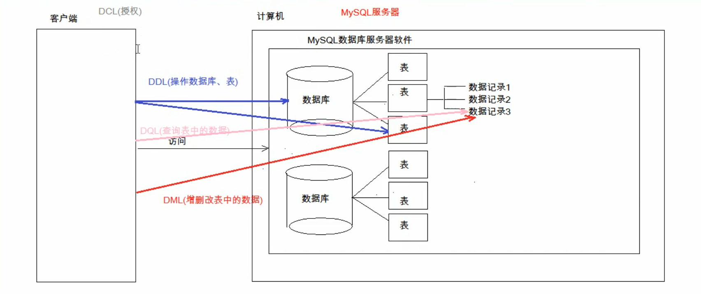
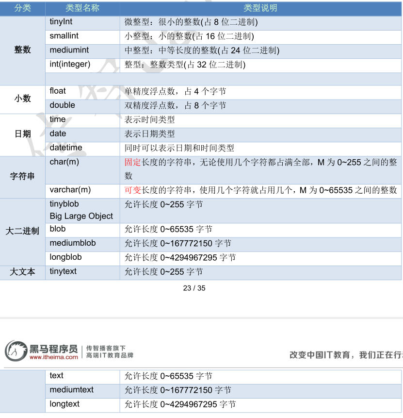
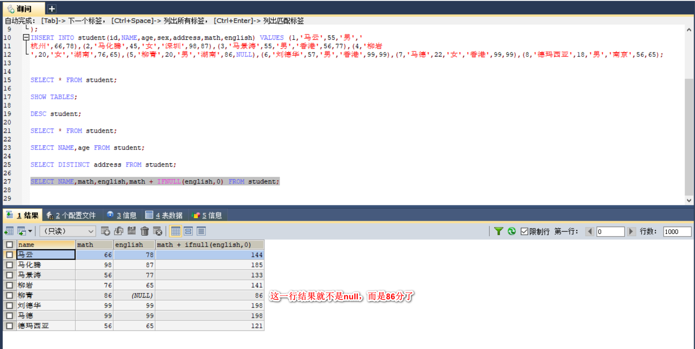

（注1：看《数据库基本概论》的时候发现后续无法继续推进了，于是调转车头学一下MySQL的基本实际使用，理论和实际双管齐下应该学习效果会好一些，这篇博文是看视频的笔记）

首先安装了一下MySQL软件，网上搜了一下教程，非常顺利，一个错都没报，一下就安装好了。

[MySQL下载安装教程](<https://www.jianshu.com/p/dd65cab11e8a>)

# SQL简介

## 什么是SQL

Structured Query Language：结构化查询语言
​	其实就是定义了操作所有关系型数据库的规则。每一种数据库操作的方式存在不一样的地方，称为“方言”。

## SQL通用语法

~~~
1.SQL 语句可以单行或多行书写，以分号结尾。
2. 可使用空格和缩进来增强语句的可读性。
3. MySQL 数据库的SQL语句不区分大小写，关键字建议使用大写。
4. 3 种注释
   	单行注释: -- 注释内容 (--后面要有空格！！！)或 # 注释内容(mysql特有，#后可以没有空格) 
   	多行注释: /* 注释 */
~~~

> 若输入的命令错误，比如select输入成了slect,可以直接将错误的命令以分号结束，MySQL会提示输入的命令错误。
>
> 当键入了错误的命令出现无法退出时，大部分情况是因为MySQ认为命令行尚未结束。在这种情况下，有时即使键入 quit 也会无法退出。若结尾处错误的输入了'，可以补上分号，然后输入quit；退出即可。若忘记输入；可以补充输入；会自动结束此次编辑。

## SQL分类

~~~
1. DDL(Data Definition Language)数据定义语言
	用来定义数据库对象：数据库，表，列等。关键字：create, drop,alter 等
	
2. DML(Data Manipulation Language)数据操作语言
	用来对数据库中表的数据进行增删改。关键字：insert, delete, update 等
	
3. DQL(Data Query Language)数据查询语言
	用来查询数据库中表的记录(数据)。关键字：select, where 等
	
4.DCL(Data Control Language)数据控制语言(了解)
	用来定义数据库的访问权限和安全级别，及创建用户。关键字：GRANT， REVOKE 等
~~~

## DDL：操作数据库、表

### 操作数据库：CRUD

##### C(Create):创建

~~~
创建数据库
create database 数据库名称;

创建数据库，判断不存在，再创建
create database if not exists 数据库名称;

创建数据库，并指定字符集（例如gbk）
create database 数据库名称 character set 字符集名;

练习： 创建db4数据库，判断是否存在，并制定字符集为gbk
create database  if not exists db4 character set gbk;
~~~

##### R(Retrieve):查询

~~~
查询所有数据库的名称
show databases;

查询某个数据库的字符集:查询某个数据库的创建语句
show create database 数据库名称;
~~~

##### U(Update):修改

~~~
修改数据库的字符集(例如gbk改为utf8)
alter database 数据库名称 character set 字符集名称;
~~~

##### D(Delete):删除

~~~
删除数据库
drop database 数据库名称;

判断数据库存在，存在再删除
drop database if exists 数据库名称;
~~~

##### 使用数据库

~~~
查询当前正在使用的数据库名称
select database();

使用数据库
use 数据库名称;
~~~

### 操作表：CRUD

##### C(Create):创建

~~~
创建表
create table 表名(
	列名1 数据类型1,
	列名2 数据类型2,
	...
	列名n 数据类型n
);

*注意：最后一列，不需要加逗号(,)
*数据库类型：
1. int：整数类型
	* age int,
2. double:小数类型
	* score double(5,2)
3. date:日期，只包含年月日，yyyy-MM-dd
4. datetime:日期，包含年月日时分秒	 yyyy-MM-dd HH:mm:ss
5. timestamp:时间戳类型	包含年月日时分秒	 yyyy-MM-dd HH:mm:ss	
	* 如果将来不给这个字段赋值，或赋值为null，则默认使用当前的系统时间，来自动赋值
6. varchar：字符串
	* name varchar(20):姓名最大20个字符
	* zhangsan 8个字符  张三 2个字符
~~~

数据库类型完整版如下图所示：

~~~
具体创建表示例
create table student(
	id 	 int,
	name varchar(32),
	age  int,
	score double(4,1),
	birthday date,
	insert_time timestamp
);

复制表
create table 表名 like 被复制的表名;	
~~~

##### R(Retrieve):查询

~~~
查询某个数据库中所有的表名称
show tables;

查询表结构(desc是description的意思,查的是表的结构，而不是里面的内容)
（要想查看表中的内容命令为select * from 表名;）
desc 表名;（不需要加table!!!!）
~~~

##### U(Update):修改

~~~
修改表名
alter table 表名 rename to 新的表名;

修改表的字符集
alter table 表名 character set 字符集名称;
（查看表的字符集为show create table 表名;）

添加一列
alter table 表名 add 列名 数据类型;

修改列名称 类型
alter table 表名 change 列名 新列别 新数据类型;
alter table 表名 modify 列名 新数据类型;

删除列
alter table 表名 drop 列名;
~~~

##### D(Delete):删除

~~~
删除表
drop table 表名;

判断表存在，存在再删除
drop table if exists 表名;
~~~

## DML:增删改表中数据

### 添加数据

~~~
insert into 表名(列名1，列名2，...,列名n) values(值1，值2，...,值n);

示例：
INSERT INTO stu VALUES(1,"张三丰",99,150,"1893-05-24",NULL); 
（日期要加引号）

注意：
	1. 列名和值要一一对应。
	2. 如果表名后，不定义列名，则默认给所有列添加值
	   insert into 表名 values(值1,值2,...值n);
	3. 除了数字类型，其他类型需要使用引号(单双都可以)引起来
~~~

### 删除数据

~~~
delete from 表名[where 条件];
注意：
	1. 如果不加条件，则删除表中所有记录。
	2. 如果要删除所有记录
		1. delete from 表名; -- 不推荐使用。有多少条记录就会执行多少次删除操作
		2. TRUNCATE TABLE 表名; -- 推荐使用，效率更高 先删除表，然后再创建一张一样的表。
~~~

### 修改数据

~~~
update 表名 set 列名1 = 值1, 列名2 = 值2,... [where 条件];
注意：
	1. 如果不加任何条件，则会将表中所有记录全部修改。
~~~

## DQL:查询表中的记录

### 笼统查询

~~~
select * from 表名;
~~~
### 完整查询

~~~
select 
	字段列表
from 
	表名列表
where 
	条件列表
group by
	分组字段
having
	分组之后的条件
order by
	排序
limit
	分页限定
~~~

### 基础查询

~~~
首先在数据库中先创建一张student的表：
CREATE TABLE student(
id INT, -- 编号
NAME VARCHAR(20), -- 姓名
age INT, -- 年龄
sex VARCHAR(5), -- 性别
address VARCHAR(100), -- 地址
math INT, -- 数学
english INT -- 英语
);
INSERT INTO student(id,NAME,age,sex,address,math,english) VALUES (1,'马云',55,'男','
杭州',66,78),(2,'马化腾',45,'女','深圳',98,87),(3,'马景涛',55,'男','香港',56,77),(4,'柳岩
',20,'女','湖南',76,65),(5,'柳青',20,'男','湖南',86,NULL),(6,'刘德华',57,'男','香港
',99,99),(7,'马德',22,'女','香港',99,99),(8,'德玛西亚',18,'男','南京',56,65);
~~~

#### 多个字段的查询

~~~
select 字段名1，字段名2... from 表名；
 注意：
	-如果查询所有字段，则可以使用*来替代字段列表。
	
示例：查询 姓名 和 年龄
SELECT NAME,age FROM student;
~~~

#### 去除重复的结果集

~~~
select distinct 字段名1，字段名2... from 表名；
（只有2个结果集的数据完全一样才可以去重）

示例：查询去重的地址
SELECT DISTINCT address FROM student;
（如果发现仍然有2个相同的地址，可能是有空字符的问题）
~~~

#### 计算列

~~~
一般可以使用四则运算计算一些列的值。（一般只会进行数值型的计算）

示例：计算 math 和english 分数之和
SELECT NAME,math,english,math + english FROM student;
（这个式子，如果有null参与的运算，计算结果都为null,所以并不合理）

示例修改版：计算 math 和english 分数之和
SELECT NAME,math,english,math + IFNULL(english,0) FROM student;

ifnull(表达式1,表达式2)：null参与的运算，计算结果都为null
	表达式1：哪个字段需要判断是否为null
	如果该字段为null后的替换值。
~~~

#### 起别名

~~~
将列名math + english改为总分
SELECT NAME,math,english,math + IFNULL(english,0) AS 总分 FROM student;
（as也可以省略，中间为空格也行）
~~~

### 条件查询

~~~
where子句后跟条件
运算符
	*  > 、< 、<= 、>= 、= 、<>
	*  BETWEEN...AND  
	* IN( 集合) 
	* LIKE：模糊查询
		*占位符：
		   * _:单个任意字符
		   * %:多个任意字符
	* IS NULL  
	* and  或 &&
	* or  或 || 
	* not  或 !
~~~

~~~
查询年龄大于20岁
SELECT * FROM student WHERE age > 20;

查询年龄等于20岁
SELECT * FROM student WHERE age = 20;

查询年龄不等于等于20岁
SELECT * FROM student WHERE age != 20;
SELECT * FROM student WHERE age <> 20;	//写法2

查询年龄大于等于20 小于等于30
SELECT * FROM student WHERE age >= 20 &&  age <=30;
SELECT * FROM student WHERE age >= 20 AND  age <=30;  //写法2
SELECT * FROM student WHERE age BETWEEN 20 AND 30;	 //写法3

查询年龄22岁，18岁，25岁的信息
SELECT * FROM student WHERE age = 22 OR age = 18 OR age = 25
SELECT * FROM student WHERE age IN (22,18,25);  //写法2

查询英语成绩为null
（错误写法：null值不能使用 = （!=） 进行判断）
SELECT * FROM student WHERE english = NULL;

（正确写法）
SELECT * FROM student WHERE english IS NULL;

查询英语成绩不为null
SELECT * FROM student WHERE english  IS NOT NULL;

查询姓马的有哪些？ like
SELECT * FROM student WHERE NAME LIKE '马%';

查询姓名第二个字是化的人
SELECT * FROM student WHERE NAME LIKE "_化%";

查询姓名是3个字的人
SELECT * FROM student WHERE NAME LIKE '___';

查询姓名中包含德的人
SELECT * FROM student WHERE NAME LIKE '%德%';
~~~

### 查询语句

#### 排序查询

~~~
order by 子句
 * order by 排序字段1 排序方式1 ，  排序字段2 排序方式2...

 * 排序方式：
	* ASC：升序，默认的。
	* DESC：降序。

 * 注意：
	* 如果有多个排序条件，则当前边的条件值一样时，才会判断第二条件。
	
举例：
SELECT * FROM student ORDER BY math;（默认升序，从小到大）

-- 按照数学成绩排名，如果数学成绩一样，则按照英语成绩排名
SELECT * FROM student ORDER BY math ASC , english ASC;
~~~

#### 聚合函数

~~~
 聚合函数：将一列数据作为一个整体，进行纵向的计算。
 1. count：计算个数
		1. 一般选择非空的列：主键
		2. count(*)
 2. max：计算最大值
 3. min：计算最小值
 4. sum：计算和
 5. avg：计算平均值
 
* 注意：聚合函数的计算，排除null值。
	解决方案：
		1. 选择不包含非空的列进行计算
		2. IFNULL函数
举例：
SELECT COUNT(english) FROM student;
SELECT COUNT(IFNULL(english,0)) FROM student;
SELECT COUNT(*) FROM student;
SELECT MAX(math) FROM student;
SELECT MIN(math) FROM student;
SELECT SUM(math) FROM student;
SELECT AVG(math) FROM student;
~~~

#### 分组查询

~~~
group by 分组字段;
	注意：
		1. 分组之后查询的字段：分组字段、聚合函数
		2. where 和 having 的区别？
			1. where 在分组之前进行限定，如果不满足条件，则不参与分组。having在分组之后进行限定，如				  果不满足结果，则不会被查询出来
			2. where 后不可以跟聚合函数，having可以进行聚合函数的判断。
			
-- 按照性别分组。分别查询男、女同学的平均分
SELECT sex , AVG(math) FROM student GROUP BY sex;

-- 按照性别分组。分别查询男、女同学的平均分,人数
SELECT sex , AVG(math),COUNT(id) FROM student GROUP BY sex;

--  按照性别分组。分别查询男、女同学的平均分,人数 要求：分数低于70分的人，不参与分组
SELECT sex , AVG(math),COUNT(id) FROM student WHERE math > 70 GROUP BY sex;

--  按照性别分组。分别查询男、女同学的平均分,人数 要求：分数低于70分的人，不参与分组,分组之后。人数要大于2个人
SELECT sex , AVG(math),COUNT(id) FROM student WHERE math > 70 GROUP BY sex HAVING COUNT(id) > 2;
或
SELECT sex , AVG(math),COUNT(id) 人数 FROM student WHERE math > 70 GROUP BY sex HAVING 人数 > 2;
~~~

#### 分页查询

~~~
limit 开始的索引,每页查询的条数;
公式：开始的索引 = （当前的页码 - 1） * 每页显示的条数

-- 每页显示3条记录 
SELECT * FROM student LIMIT 0,3; -- 第1页
SELECT * FROM student LIMIT 3,3; -- 第2页
SELECT * FROM student LIMIT 6,3; -- 第3页

limit 是一个MySQL"方言"

~~~

### 约束

~~~
概念： 对表中的数据进行限定，保证数据的正确性、有效性和完整性。
分类：
	1. 主键约束：primary key
	2. 非空约束：not null
	3. 唯一约束：unique
	4. 外键约束：foreign key
~~~

#### 非空约束

~~~
非空约束：not null，值不能为null
	1. 创建表时添加约束
		CREATE TABLE stu(
			id INT,
			NAME VARCHAR(20) NOT NULL -- name为非空
		);
		
    2. 创建表完后，添加非空约束
		ALTER TABLE stu MODIFY NAME VARCHAR(20) NOT NULL;
		
	3. 删除name的非空约束
		ALTER TABLE stu MODIFY NAME VARCHAR(20);
~~~

#### 唯一约束

~~~
唯一约束：unique，值不能重复
	1. 创建表时，添加唯一约束
		CREATE TABLE stu(
			id INT,
			phone_number VARCHAR(20) UNIQUE -- 添加了唯一约束		
		);
		* 注意mysql中，唯一约束限定的列的值可以有多个null
		
     2. 删除唯一约束
		ALTER TABLE stu DROP INDEX phone_number;
	
	 3. 在创建表后，添加唯一约束
		ALTER TABLE stu MODIFY phone_number VARCHAR(20) UNIQUE;

~~~

#### 主键约束

~~~javascript
主键约束：primary key。
	1. 注意：
		1. 含义：非空且唯一
		2. 一张表只能有一个字段为主键
		3. 主键就是表中记录的唯一标识
		
	2. 在创建表时，添加主键约束
		create table stu(
			id int primary key,-- 给id添加主键约束
			name varchar(20)
		);
	3. 删除主键
		-- 错误 alter table stu modify id int ;
		ALTER TABLE stu DROP PRIMARY KEY;
		
	4. 创建完表后，添加主键
		ALTER TABLE stu MODIFY id INT PRIMARY KEY;

	5. 自动增长：
		1. 概念：如果某一列是数值类型的，使用 auto_increment 可以来完成值得自动增长
		2. 在创建表时，添加主键约束，并且完成主键自增长
		create table stu(
			id int primary key auto_increment,-- 给id添加主键约束
			name varchar(20)
		);
		//这个会自动沿着id顺序添加id
		INSERT INTO stu VALUES(NULL,'ccc');

  		3. 删除自动增长
		ALTER TABLE stu MODIFY id INT;

		4. 添加自动增长
		ALTER TABLE stu MODIFY id INT AUTO_INCREMENT;
~~~

#### 外键约束

~~~javascript
外键约束：foreign key,让表与表产生关系，从而保证数据的正确性。

如果数据有冗余，则需要进行表的拆分。

1. 在创建表时，可以添加外键
	* 语法：
		create table 表名(
			....
			外键列
			constraint 外键名称 foreign key (外键列名称) references 主表名称(主表列名称)
		);

2. 删除外键
		ALTER TABLE 表名 DROP FOREIGN KEY 外键名称;

3. 创建表之后，添加外键
		ALTER TABLE 表名 ADD CONSTRAINT 外键名称 FOREIGN KEY (外键字段名称) REFERENCES 主表名称(主表列名称);

4. 级联操作
	1. 添加级联操作
		语法：ALTER TABLE 表名 ADD CONSTRAINT 外键名称 
		FOREIGN KEY (外键字段名称) REFERENCES 主表名称(主表列名称) ON UPDATE CASCADE ON DELETE CASCADE  ;
		2. 分类：
			1. 级联更新：ON UPDATE CASCADE 
			2. 级联删除：ON DELETE CASCADE 
~~~

~~~javascript
CREATE TABLE emp (
id INT PRIMARY KEY AUTO_INCREMENT,
NAME VARCHAR(30),
age INT,
dep_name VARCHAR(30),
dep_location VARCHAR(30)
);
-- 添加数据
INSERT INTO emp (NAME, age, dep_name, dep_location) VALUES ('张三', 20, '研发部', '广州');
INSERT INTO emp (NAME, age, dep_name, dep_location) VALUES ('李四', 21, '研发部', '广州');
INSERT INTO emp (NAME, age, dep_name, dep_location) VALUES ('王五', 20, '研发部', '广州');
INSERT INTO emp (NAME, age, dep_name, dep_location) VALUES ('老王', 20, '销售部', '深圳');
INSERT INTO emp (NAME, age, dep_name, dep_location) VALUES ('大王', 22, '销售部', '深圳');
INSERT INTO emp (NAME, age, dep_name, dep_location) VALUES ('小王', 18, '销售部', '深圳');
~~~

