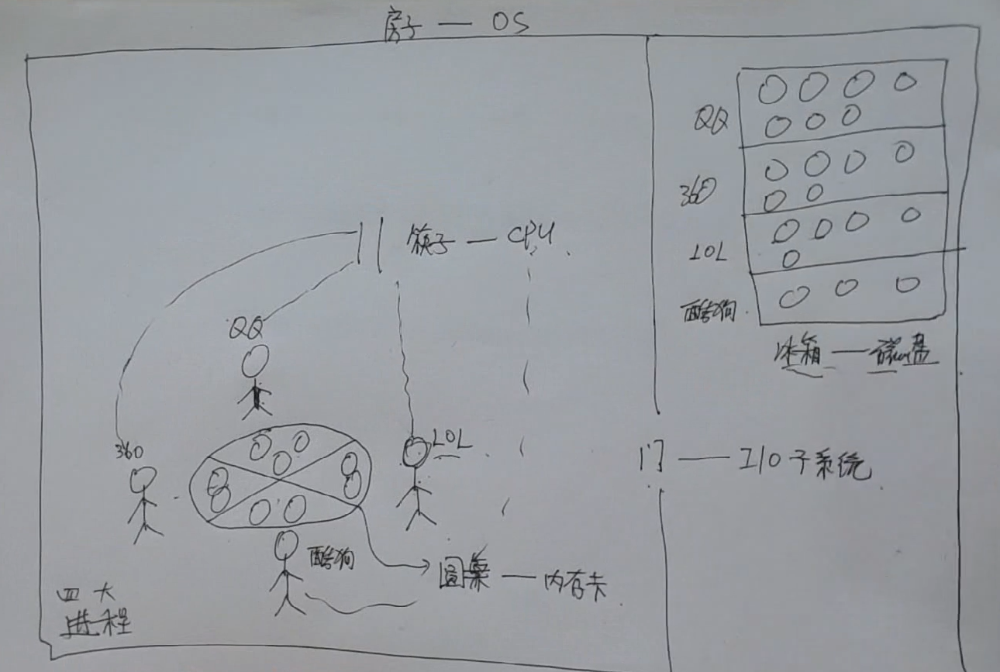
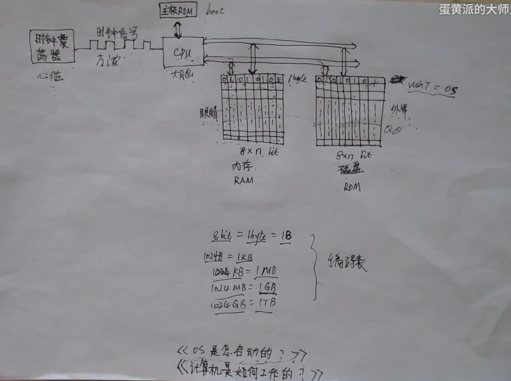
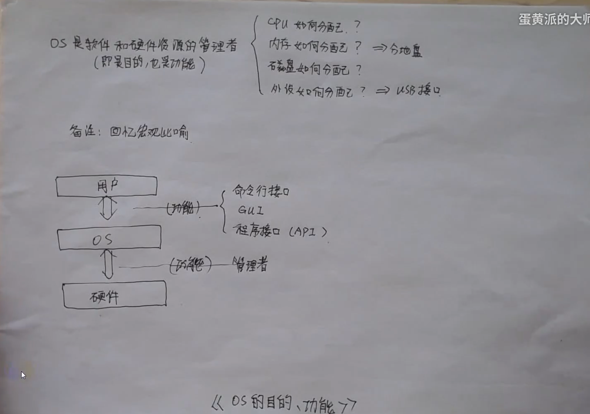
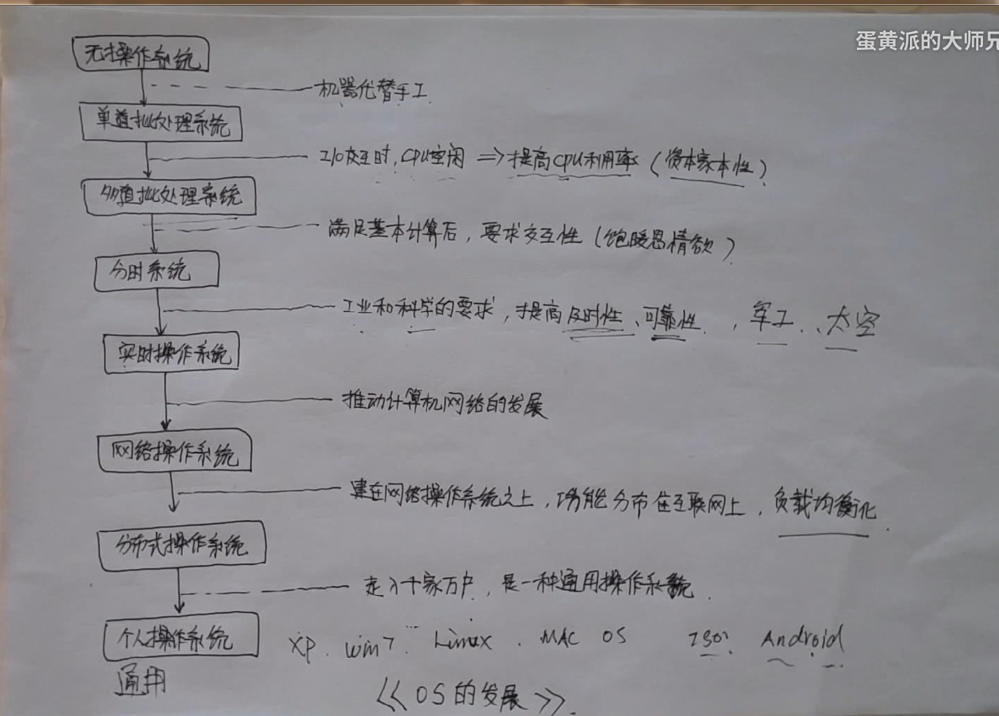

(注1：这是一个考完研的学生讲的计算机操作系统视频，讲的真的是挺好的，非常的通俗易懂。我之前断断续续的干听过7,8集，可是没有坚持听完。现在开始学Node了，我觉得很有必要把这10个多小时的视频给看完，我觉得对于后续的理解Node是很有帮助的。而且这次不能干听了，要边做笔记边听比较好。)

(注2：视频链接为[计算机操作系统(启蒙+经验+套路解题)](https://www.bilibili.com/video/BV1LW411q7Kk?p=1))

# 总体篇

## 操作系统的一个宏观比喻

有一个房子，这个**房子**就是**操作系统**。这个房子有**2个房间**，中间有一道门，这个**门**叫做**I/O子系统**。

**左边**的房间里有4个人，它们的名字分别是：QQ、360、LOL、酷狗。它们4个人就叫**四大进程**。这4个人围在圆桌的四周，圆周被分为4个区域或者说是4块，每个人面前都有一块属于它们的桌子，这个**圆桌**就相当于**内存卡**。

**右边**的房间里面有一个**冰箱**，冰箱相当于电脑里面的**磁盘**，磁盘就和冰箱一样被分成了几个格子，每个格子都分别属于它们每个人，每个格子都分别放着它们自己的菜肴，在电脑里面就相当于它们自己的文件。

这个时候它们想吃饭了，你在玩LOL的时候就代表LOL想吃饭了，当你点击LOL图标的时候，LOL就会穿过I/O子系统(这道门)跑到冰箱里去取自己格子里面的菜，取到之后通过这道门回来，把菜摆放在这个圆桌上面。

有了人，有了桌子，桌子上面放好了菜，但是怎么吃饭呢？还差一双**筷子**，筷子就是电脑的**CPU**,而且筷子只有一双。

它们4个人有个习惯，不会一直拿着筷子吃饭，它们每吃一口都要把筷子放回去，接着要吃下一口的话再去取筷子，吃完一口再放回去。LOL就是这样吃饭的，直到它吃完饭为止。

你之后又分别点击了QQ，360和酷狗，它们和LOL一样的流程，去冰箱拿自己的菜放到盘子上，然后等别人吃一口饭把筷子放回原处它们再分别取筷子，吃一口饭后也将筷子放回原处。

## 计算机怎么工作的？

[印象系列-磁盘和内存的基本认识](https://juejin.im/post/6844903505224826887)

> 磁盘可以理解为硬盘。

* 时钟信号（心脏供血）
  * 有了时钟信号，就如同心脏供血提供了能量一样，CPU就可以根据源源不断的时钟信号处理由0、1构成的指令

* 指令从哪里来呢？从内存中来，但是内存是易失存储器RAM（想想文件没有ctrl+s），断电数据就丢失。

* 内存(眼睛)中的数据那里来呢？从磁盘(外部世界)中来（没有磁盘之前，就从纸带上来）

内存和磁盘本质上可以抽象成一个东西，就跟围棋棋盘一样，每行有8个小格子，每个小格子里面放0或者1。

**磁盘中**假设有n行小格子定义为C盘，里面装win7(操作系统)。

操作系统本质上也是一种程序，它里面装的也是0,1,0,1这样的数据。

* 时钟振荡器是心脏
* CPU是大脑
* 内存(RAM)是眼睛
* 磁盘(ROM)是外部世界

## 操作系统怎么启动的？

**时钟供能--CPU激活--默认地址执行Boot程序--C盘拷贝OS到内存--CPU跳转到内存执行OS--OS启动完成--运行APP**

当电脑开机后，CPU里面有一个小东西boot,它只做一件事情，把磁盘中的win7系统一个格子一个格子的复制到内存中去执行。

开机后你点击QQ图标，你点击的瞬间CPU就在内存里搜索，发现没有QQ程序，就从磁盘中把QQ程序复制到内存中去执行。

## 操作系统的目的，功能

操作系统是管家，管理硬件，用户就是地主，不用自己亲自去管理，有什么事情给管家下达命令叫管家做就可以了。

## 操作系统的发展

* 无操作系统（手工阶段）
  * 在很久以前是没有软件这个东西的，加减乘除这些都是用硬件来实现的。有一门课叫《数字电路》里面讲的就是如何设计电路来完成加减乘除这些运算的。它的优点是专门用来实现加减乘除的硬件运算起来比软件快。缺点是功能做死了，没有灵活性。后来硬件设计出了最基本的指令集就构成了软件。
* 单道批处理系统
* 多道批处理系统
* 分时操作系统
  * 富二代同时交了三个女朋友，这三个女朋友同时不知道对方的存在。情人节三个女朋友都要和富二代过，富二代在同一个酒店开了三间房，一个女朋友陪一个小时后就去陪下一个女朋友，如此循环往复。这样让他的三个女朋友分别都认为富二代陪了自己一晚上。
* 实时操作系统
  * 女朋友让富二代什么时候过来就什么时候过来，比如太空发射什么时候做什么事情要求的时间非常精确。
* 网络操作系统
* 分布式操作系统
* 个人计算机操作系统

> 操作系统历史见我的另一篇博文《操作系统之哲学原理》

## 操作系统的运行机制

# CPU

## 进程管理

进程管理对应的是叫做CPU的这双**筷子**，是怎么在这4个人(4大进程)之间进行分配的。筷子空闲，大家都要的时候应该谁先谁后使用呢？又根据什么样的顺序去取呢？4个人使用筷子产生了矛盾又是如何进行解决的呢？这都是有一个规则或者说有一个算法来管理的。

# 内存卡

## 内存管理

内存管理讲的就是**圆桌**，这张桌子按照多少人分成多少份呢？每一份应该分多大呢？哪一份应该给谁？吃完饭后大家都要离开桌子，清理完桌子之后又应该给谁用呢？或者桌子空闲出一部分出来，又有人来吃应该怎么分配呢？

当人太多的时候，桌子总是会挤满人的，这个桌子又怎么样最大限度的供人使用，让人吃饭呢？

# 磁盘

## 文件管理

说到磁盘管理的时候，其实就是说的是文件管理。它们本质上可以说是你中有我，我中有你的。在这里面就对应着冰箱，它和内存管理有一点是差不多的，就是一个磁盘被分成多少块，每块给谁，这是第一点。

第二点是这里面的盘子是怎么摆放的，比如QQ文件在磁盘里是按照什么样的顺序进行摆放的，怎么样摆放更加合理，结构更加优化。

第三点是目录的问题，目录就相当于一个表格，你在图书馆找书的时候不是也要查目录，查表格吗？书放在哪一个书架上面，书架上面第几层，大概就可以找到了。

# 外设

## I/O管理

I/O管理讲的就是这道门，电脑里讲的就是外设，操作系统是如何设计这一道门的。键盘，鼠标，显示器，打印机，移动硬盘，U盘都属于外设。

你玩LOL的时候，它也得通过I/O子系统这道门去检测，去识别你按了哪些按键，Q,W,E,R放了哪些技能，都要通过这道门给LOL识别到才能正常运行游戏。

你拖动鼠标的时候，也要通过这道门被LOL所识别，才能知道你走到哪个位置去。

显示器也是一样，LOL的图像通过门出来显示到显示器上显示出来。

