(注1：以前翻过这本书几页就放下了，最近学的知识中总是出现"异步编程"，"阻塞"之类的概念，我觉得我这时候又需要再翻一番操作系统这门课了，看书又感觉太晦涩(就算是《操作系统之哲学原理》我看到后面也云里雾里的)，理解的也不深刻。今天偶然在Github上搜操作系统，发现有和这个相关的项目：[《30天自制操作系统》源码中文版](https://github.com/yourtion/30dayMakeOS)，我想试着看看，有空的时候去照着做一下，看自己能做到什么程度。)

# 前言

“好想编写一个操作系统呀！"笔者的朋友曾说这是所有程序员都曾经怀描的一个梦想。说“所有的程序员”可能有点夸张了，不过作为程序员的梦想，它至少也应该能排进前十名吧。

也许很多人觉得编写操作系统是个天方夜谭，这一定是操作系统业界的一个阴谋（笑）。他们故意让大家相信编写操作系统是一件非常困难的事情，这样就可以高价兜售自己开发的操作系统，而且操作系统的作者还会被顶礼膜拜。那么实际情况又怎么样呢？和别的程序相比，其实编写操作系统并没有那么难，至少笔者的感觉是这样。

在各位读者之中，也许有人曾经挑战过操作系统的编写，但因为太难而放弃了。拥有这样经历的人也许不会认同笔者的观点。其实你错了，你的失败并不是因为编写操作系统太难，而是因为没有人告诉你那其实是一件很简单的事而已。

不仅是编写操作系统，任何事都是一样的。如果讲解的人认为它很难，那就不可能把它讲述得通俗易懂，即便是同样的内容，也会讲得无比复杂。这样的讲解，肯定是很难懂的。

那么，你想不想和笔者一起再挑战一次呢？如果你曾经梦想过编写自己的操作系统，一定会觉得乐在其中的。

可能有人会说，这本书足足有700多页，怎么会“有趣”和“简单”呢？唔，这么一说笔者也觉得挺心虚的，不过其实也只是长了那么一点点啦。平均下来的话，每天只有大约23页的内容，你看，也没有那么长吧？

这本书的文风非常轻松，也许你不知不觉中就会读得很快。但是这样的话可能印象不会很深，最好还是能静下心来慢慢地读。书中所展示的程序代码和文字的说明同样重要，因此也希望大家仔细阅读。只要注意这些，理解本书的内容就应该没有问题了。

在本书中，我们使用C语言和汇编语言来编写操作系统，不过不必担心，你可以在阅读本书的同时来逐步学习关于这些编程语言的知识。本书在这方面写得非常仔细，如果能有人通过本书终于把C语言中的指针给搞懂了，那笔者的目的也就达到了。即便是从这样的水平开始，30天后你也能够编写出一个很棒的操作系统，请大家拭目以待吧！

# 第0天：着手开发之前

## 前言

现在，挑选自己喜欢的配件来组装一台世界上独一无二的、个性化的PC（个人电脑）对我们来说已不再困难。不仅如此，只要使用合适的**编译器**，我们就可以自己编写游戏、制作自己的工具软件；使用网页制作工具，我们还可以轻而易举地制作**主页**；如果看过名著《CPU制作法》的话，就连**自制CPU**也不在话下。

> 牛皮！

然而，在“自制领域”里至今还有一个无人涉足的课题--自己制作操作系统（OS），它看起来太难以至于初学者不敢轻易挑战。电脑组装也好，游戏、工具软件制作也好，主页也好，CPU也好，这些都已经成为初学者能够尝试的项目，而唯独操作系统被冷落在一边，实在有些遗憾。“既然还没有这样的书，那我就来写一本。”这就是笔者撰写本书的初衷。

也许是因为面向初学者的书太少的缘故吧，一说起操作系统，大家就会觉着那东西复杂得不得了，简直是高深莫测。特别是像Windows和Linux这些操作系统，庞大得一张光盘都快装不下了，要是一个人凭着兴趣来开发的话，不知道需要历经多么漫长的过程才能完成。笔者也认为，像这么复杂的操作系统，单凭一个人来做，一辈子都做不出来。

不过大家也不必担心太多。笔者就成功地开发过一个小型操作系统，其大小还不到80KB。麻雀虽小，五脏俱全，这个操作系统的功能还是很完整的。有人也许会怀疑："这么小的操作系统，是不是只有命令行窗口啊？要不就是没有多任务？"不，这些功能都有。

怎么样，只有80KB的操作系统，大家不觉得稍作努力就可以开发出来吗？即使是初学者，恐怕也会觉得这不是件难事吧？没错，我们用一个月的时间就能写出自己的操作系统！所以大家不用想得太难，我们轻轻松松地一起来写写看吧。

> 突然有点小激动。

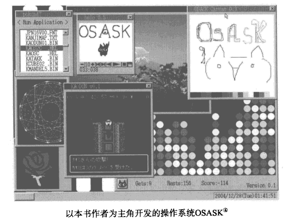

大家一听到编译后的文件大小为80KB可能会觉得它作为程序来讲已经很小了，不过曾经编过程序的人可以查一查自己编的程序（.exe文件）的大小，这样就能体会到80KB到底是难是易了。

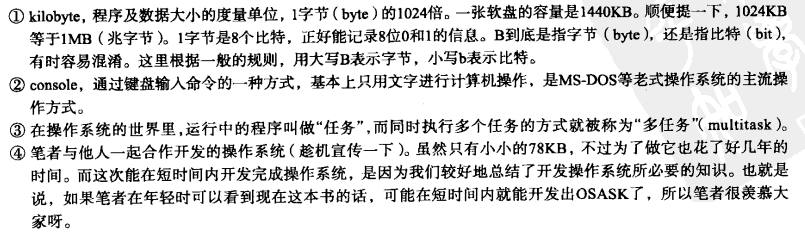

没编过程序的人也可以下载一个看上去不是很复杂的自由软件，看看它的可执行文件有多大。Windows 2000的计算器程序大约是90KB，大家也可以根据这个想象一下。

本书对于不打算自己写操作系统，甚至连想都没想过这个问题的人来说也会大有裨益。举个例子，读本自己组装PC的书就能知道PC是由哪些组件构成的，PC的性能是由哪些部分决定的；读本如何编写游戏的书，就能明白游戏是怎样运行的；同理，读了本书，了解了操作系统的开发过程，就能掌握操作系统的原理。所以说，对操作系统有兴趣的人，哪怕并不想自己做一个出来，也可以看看这本书。

阅读本书几乎不需要相关储备知识，这一点稍后还会详述。不管是用什么编程语言，只要是曾经写过简单的程序，对编程有一些感觉，就已经足够了（即使没有任何编程经验，应该也能看懂），因为这本书主要就是面向初学者的。书中虽然有很多C语言程序，但实际上并没有用到很高深的C语言知识，所以就算是曾经因为C语言太难而中途放弃的人也不用担心看不懂。当然，如果具备相关知识的话，理解起来会相对容易一些，不过即使没有相关知识也没关系，书中的说明都很仔细，大家可以放心。

本书以IBM PC/AT兼容机（也就是所谓的Windows个人电脑）为对象进行说明。至于其他机型，比如Macintosh（苹果机）或者PC-9821等，虽然本书也参考了其中某些部分，但基本上无法开发出在这些机型上运行的操作系统，这一点还请见谅。严格地说，不是所有能称为AT兼容机的机型都可以开发我们这个操作系统，我们对机器的配置要求是CPU高于386（因为我们要开发32位操作系统），换句话说，只要是能运行Windows 95以上操作系统的机器就没有问题，况且现在市面上（包括二手市场）恐怕都很难找到Windows 95以下的机器了，所以我们现在用的机型一般都没问题。

另外，大家也不用担心内存容量和硬盘剩余空间，我们需要使用的空间并不大。只要满足以上条件，就算机器又老又慢，也能用来开发我们的操作系统。

> 本书所讲的操作系统内容仅用Macintosh是开发不了的，并且开发出的操作系统也不能直接在Macintosh上运行。
> 但是在PC上开发的操作系统，可以通过模拟器在Macintosh上运行。

## 何谓操作系统

说老实话，其实笔者也不是很清楚。估计有人会说：“连这个都不懂，还写什么书？"不好意思 笔者见过很多种操作系统，有的功能非常多，而有的功能特别少。在比较了各种操作系统之后，笔者还是没有找到它们功能的共同点，无法下定义。结果就是，软件作者坚持说自己做的就是操作系统，而周围的人也不深究，就那样默认了，以至于什么软件都可以算是操作系统。笔者现在就是这么认为的。

既然就操作系统而言各有各的说法，那笔者也可以反过来利用这一点，一开始就根据自己的需要来定义操作系统，然后开发出一个满足自己定义条件的软件就可以了。这当然也算是开发操作系统了。哪怕做一个MS-DOS那样的，在一片漆黑的画面上显示出白字，输入个命令就能执行的操作系统也可以，这对笔者来说很简单。

但这样肯定会让一些读者大失所望。现在初学者也都见多识广，一提到操作系统，大家就会联想到Windows，Linux之类的庞然大物，所以肯定期待自制操作系统至少能任意显示窗口、实现鼠标光标控制、同时运行几个应用程序，等等。所以为了满足读者的期待，我们这次就来开发一个具有上述功能的操作系统。

## 开发操作系统的各种方法

开发操作系统的方法也是各种各样的。

笔者认为，最好的方法就是从既存操作系统中找一个跟自己想做的操作系统最接近的，然后在此基础上加以改造。这个方法是最节省时间的。

但本书却故意舍近求远，一切从零开始，完完全全是自己从头做起，这是因为笔者想向各位读者介绍从头到尾开发操作系统的全过程。如果我们找一个现成的操作系统，然后在此基础上删删改改的话，那这本书就不能涉及操作系统全盘的知识了，这样肯定无法让读者朋友满意。不过由于是全部从零做起，所以篇幅长些，还请读者朋友们耐下心来慢慢看。

要开发操作系统，首先遇到的问题就是使用什么编程语言，这次我们想以C语言为主。"啊，C语言啊？”笔者仿佛已经听到大家抱怨的声音了（苦笑），“这都什么年代了，用C语言多土啊”、“用C++多好呀”、“还是Java好”、“不，我就喜欢Delphi"、“我还是觉得Visual Basic最好"······大家个人喜好习惯各不相同。这种心情笔者都能理解，但为了讲解时能简单一些，笔者还是想用c语言，请大家见谅。C语言功能虽不多，但用起来方便，所以用来开发操作系统刚好合适。要是用其他语言的话，仅讲解语言本身就要花很长时间，大家恐怕就没兴趣看下去了。

在这里先向大家传授一个从零开始开发操作系统的诀窍，那就是不要一开始就一心想着要开发操作系统，先做一个有点操作系统样子的东西就行了。如果我们一上来就要开发一个完整的操作系统的话，要做的东西太多，想想脑袋都大了，到时恐怕连着手的勇气也没有了。笔者就是因为这个，几年间遇到了很多挫折。所以在这本书里，我们不去大张旗鼓地想着要开发一个操作系统，而是编写几个像操作系统的**演示程序**"就行了。其实在开发演示程序的过程中大家就会逐步发现，演示程序不再是简单的演示程序，而是越来越像一个操作系统了。

> 演示程序的英文是demonstration，指不是为了使用，而是为了演示给人看的软件。

## 无知则无畏

当我们打算开发操作系统时，总会有人从旁边跳出来，罗列出一大堆专业术语，问这问那，像内核怎么做啦，外壳怎么做啦，是不是单片啦，是不是微内核啦，等等。虽然有时候提这些问题也是有益的，但一上来就问这些，当然会让人无从回答。

要想给他们一个满意答复，让他们不再从旁指手画脚的话，还真得多学习，拿出点像模像样的见解才行。但我们是初学者，没有必要去学那些麻烦的东西，费时费力且不说，当我们知道现有操作系统在各方面都考虑得如此周密的时候，就会发现自己的想法太过简单而备受打击没了干劲。如果被前人的成果吓倒，只用这些现有的技术来做些拼拼凑凑的工作，岂不是太没意思了。

所以我们这次不去学习那些复杂的东西，直接着手开发。就算知道一大堆专业术语、专业理论，又有什么意思呢？还不如动手去做，就算做出来的东西再简单，起码也是自己的成果。而且自己先实际操作一次，通过实践找到其中的问题，再来看看是不是已经有了这些问题的解决方案，这样下来更能深刻地理解那些复杂理论。不管怎么说，反正目前我们也无法回答那些五花八门的问题，倒不如直接告诉在一旁指手画脚的人们：我们就是想用自己的方法做自己喜欢的事情，如果要讨论高深的问题，就另请高明吧。

其实反过来看，什么都不知道有时倒是好事。正是因为什么都不知道，我们才可能会认真地去做那些专家们嗤之以鼻的没意义的“傻事”。也许我们大多时候做的都没什么意义，但有时也可能会发掘出专家们千虑一失的问题呢。专家们在很多方面往往会先入为主，甚至根本不去尝试就断定这也不行那也不行，要么就浅尝辄止。因此能够挑战这些问题的，就只有我们这种什么都不知道的门外汉。任何人都能通过学习成为专家，但是一旦成为专家，就再也找不回门外汉的挑战精神了。所以从零开始，在没有各种条条框框限制的情况下，能做到什么程度就做到什么程度，碰壁以后再回头来学习相关知识，也为时未晚。

实际上笔者也正是这样一路磕磕绊绊地走过来，才有了今天。笔者没去过教授编程的学校，也几乎没学什么复杂的理论就开始开发操作系统了。但也正是因为这样，笔者做出的操作系统与其他的操作系统大不相同，非常有个性，所以得到了专家们的一致好评，而且现在还能有机会写这本书，向初学者介绍经验。总地说来，笔者从着手开发直到现在，每天都是乐在其中的。

正是像笔者这样自己摸着石头过河，一路磕磕绊绊走过来的人，讲出的东西才简单易懂。不过在讲解过程中会涉及失败的经验，以及如何重新修正最终取得成功，所以已经懂了的人看着可能会着急。不好意思，如果碰到这种情况请忍耐一下吧。

读了这部分内容或许有人会觉得“是不是什么都不学习才是最好的啊”，其实那倒不是。比如工作上需要编写某些程序，或者一年之内要完成某些任务，这时没有时间去故意绕远路，所以为了避免不必要的失败，当然是先学习再着手开发比较好。但这次我们是因为自己的兴趣而学习操作系统的开发的，既然是兴趣，那就是按自己喜欢的方式慢慢来，这样就挺好的。

## 如何开发操作系统

操作系统（OS）一般打开电源开关就会自动执行。这是怎么实现的呢？一般在Windows上开发的可执行文件（~.exe），都要在操作系统启动以后，双击一下才能运行。我们这次想要做的可不是这种可执行程序，而是希望能够做到把含有操作系统的CD-ROM或软盘插入电脑，或者将操作系统装入硬盘后，只要打开电源开关就能自动运行。

为了开发这样的操作系统，我们准备按照如下的步骤来进行。

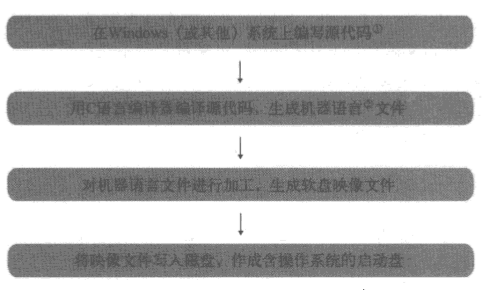

也就是说，所谓开发操作系统，就是想办法制作一张“含有操作系统的，能够自动启动的磁盘”。

这里出现的“映像文件”一词，简单地说就是软盘的备份数据。我们想要把特定的内容写人磁盘可不是拿块磁铁来在磁盘上晃晃就可以的。所以我们要先做出备份数据，然后将这些备份数据写入磁盘，这样才能做出符合我们要求的磁盘。

软盘的总容量是1440KB，所以作为备份数据的映像文件也恰好是1440KB，一旦我们掌握了制作磁盘映像的方法，就可以按自己的想法制作任意内容的磁盘了。

这里希望大家注意的是，开发操作系统时需要利用Windows等其他的操作系统。这是因为我们要使用文本编辑器或者C编译器，就必须使用操作系统。既然是这样，那么世界上第一个操作系统又是怎么做出来的呢？在开发世界上第一个操作系统时，当然还没有任何现成的操作系统可供利用，因此那时候人们不得不对照着CPU的命令代码表，自己将0和1排列起来，然后再把这些数据写人磁盘（估计那个时候还没有磁盘，用的是其他存储设备）。这是一项非常艰巨的工作。所以恐怕最初的操作系统功能非常有限，做好之后人们再利用它来开发一个稍微像点样的操作系统，然后再用这个来开发更实用的操作系统…操作系统应该就是这样一步一步发展过来的。

> ①source program，为了生成机器码所写的程序代码。可通过编译器编译成机器语言。
> ②CPU能够直接理解的语言，由二进制的0和1构成。其实源代码也是由0和1构成的（后述）。

由于这次大部分初学者都是Windows用户，所以决定使用Windows这个现成的操作系统，Windows95/98/Me/2000/XP中任意一个版本都可以。肯定也有人会说还是Linux好用，所以笔者也总结了一下Linux上的做法，具体内容写在了帮助与支持 里，有需要的人请一定看一看。

另外，如果C编译器和映像文件制作工具等不一样的话，开发过程中就会产生一些细微的差别，这很难一一解释，所以笔者就直接把所有的工具都放到附带光盘里了。这些几乎都是笔者所发布的免费软件，它们大都是笔者为了开发后面的OSASK操作系统而根据需要自己编写的。这些工具的源代码也是公开的。除此之外，我们还会用到其他一些免费软件，所有这些软件的功能我们会在使用的时候详细介绍。

## 操作系统开发中的困难

现在市面上众多的C编译器都是以开发Windows或Linux上的应用程序为前提而设计的，几乎从来没有人想过要用它们来开发其他的软件，比如自己的操作系统。笔者所提供的**编译器**，也是以Windows版的gcc为基础稍加改造而做成的，与gcc几乎没什么不同。或许也有为开发操作系统而设计的C编译器，不过就算有，恐怕也只有开发操作系统的公司才会买，所以当然会很贵。这次我们用不了这么高价的软件。

因为这些原因，我们只能靠**开发应用程序用的C编译器**想方设法编写出一个操作系统来。这实际上是在硬来，所以当中就会有很多不方便的地方。

就比如说`printf("hello\n");`吧，这个函数总是出现在C语言教科书的第一章，但我们现在就连它也无法使用。为什么呢？因为prinfi这个函数是以操作系统提供的功能为前提编写的，而我们最开始的操作系统可是什么功能都没有。因此，如果我们硬要执行这个函数的话，CPU会发生一般保护性异常，直接罢工。刚开始的时候不仅是print，几乎所有的函数都无法使用。

> 关于这次开发语言的选择，如果非要说出个所以然的话，其实也是因为C语言还算是很少依赖操作系统功能的语言，基本上只要不用函数就可以了。如果用C++的话，像new/delete这种基本而重要的运算符都不能用了，另外对于类的做法也会有很多要求，这样就无法发挥C+语言的优势了。当然，为了使用这些函数去开发操作系统，只要我们想办法，还是能够克服种种困难的。但是如果做到这个份上，我们不禁会想，到底是在用C++做操作系统呢，还是在为了CH+而做操作系统呢。对别的语言而言这个问题会更加突出，所以这次还是决定使用C语言，希望大家予以理解。

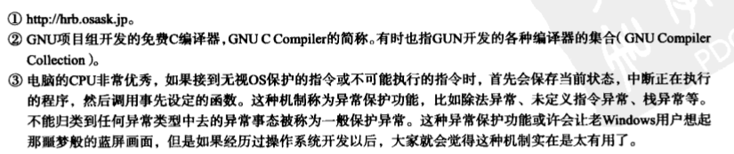

顺便插一句，在开发操作系统时不会受到限制的语言大概就只有汇编语言了。还是汇编语言最厉害（笑），但是如果本书仅用汇编来编写操作系统的话，恐怕没几个人会看，所以就算是做事管前不顾后的笔者也不得不想想后果。

> 另外，在开发操作系统时，需要用到CPU上的许多控制操作系统的寄存器。一般的C编译器都是用于开发应用程序的，所以根本没有任何操作这些寄存器的命令。另外，C编译器还具有非常优秀的自动优化功能，但有时候这反而会给我们带来麻烦。

归根到底，为了克服以上这些困难，有些没法用C语言来编写的部分，我们就只好用汇编语言来写了。这个时候，我们就必须要知道C编译器到底是怎样把程序编译成机器语言的。如果不能够与C编译器保持一致的话，就不能将汇编语言编写的部分与C语言编写的部分很好地衔接起来。这可是在编写普通的C语言程序时所体会不到哦！不过相比之下，今后的麻烦可比这种好处多得多啊（苦笑）。

> 同样，如果用C++来编写操作系统，也必须知道C++是如何把程序编译成机器语言的。当然，C++比C功能更多更强，编译规则也更复杂，所以解释起来也更麻烦，我们选用C语言也有这一层理由。总之，如果不理解自己所使用的语言是如何进行编译的，就没法用这种语言来编写操作系统。

书店里有不少C语言、C++的书，当然也还有Delphi，Java等其他各种编程语言的书，但这么多书里没有一本提到过“这些源代码编译过后生成的机器语言到底是什么样的”。不仅如此，虽然我们是在通过程序向CPU发指令的，但连CPU的基本结构都没有人肯给我们讲一讲。作为一个研究操作系统的人，真觉得心里不是滋味。为了弥补这一空缺，我们这本书就从这些基础讲起（但也仅限于此次开发操作系统所必备的基础知识）。

我们具备了这样的知识以后，说不定还会改变对程序设计的看法。以前也许只想着怎么写出漂亮的源代码来，以后也许就会更注重编译出来的是怎样的机器语言。源代码写得再漂亮，如果不能编译成自己希望的机器语言，不能正常运行的话，也是毫无意义的。反过来说，即便源代码写得难看点儿，即便只有特定的C编译器才能编译，但只要能够得到自己想要的机器语言就没有问题了。虽然不至于说“只要编译出了想要的机器语言，源代码就成了一张废纸”，但从某种意义上说还真就是这样。

对于开发操作系统的人而言，源程序无非是用来得到机器语言的“手段”，而不是目的。浪费太多时间在手段上就是本末倒置了。

对了，还有一点或许会有人担心，所以在这里事先说明一下：虽然操作系统是用C语言和汇编语言编写的，但并不是用C+编写的应用程序就无法在这个操作系统上运行。编写应用程序所用的语言，与开发操作系统所使用的语言是没有任何关系的，大家大可不必担心。

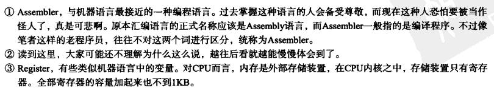

## 学习本书时的注意事项（重要！）

本书从第1章开始，写的是每一天实际开发的内容，虽然一共分成了30天，但这些都是根据笔者现在的能力和讲解的长度来大概切分的，并不是说读者也必须得一天完成一章。每个人觉得难的地方各不相同，有时学习一章可能要花上一星期的时间，也有时可能一天就能学会三章的内容。

当然，学习过程中可能会遇到看不太懂的章节，这种时候不要停下来，先接着往下读上个一两章也许会突然明白过来。如果往后看还是不明白的话，就先确认一下自已已经理解到哪一部分了，然后回过头来再从不懂的地方重新看就是了。千万别着急，看第二遍时，没准就会豁然开朗了。

如果已经弄清了哪里没理解，而且没理解的部分看了很多遍还是不明白的话，大家可以参阅我们的帮助与支持页面，或许“问题与解答”（Q&A）页里会有解说。

本书对C语言的指针和结构体的说明与其他书籍有很大区别。这是因为本书先讲CPU的基本结构，然后讲汇编，最后再讲C语言，而其他的书都不讲这些基础知识，刚一提到指针，马上就转到变量地址如何如何了。所以就算大家“觉得”已经明白了那些书里讲的指针，也不要把本书的指针部分跳过去，相信这次大家能真正地理解指针。当然，如果真的已经弄明白了的话，大概看看就可以了。

从现在开始我们来一点一点地开发操作系统，我们会将每个阶段的进展情况总结出来，这些中间成果都刻在附带光盘里了，只要简单地复制一下就能马上运行。关于这些程序，有些需要注意的地方，我们在这里简单说明一下。
比如最初出现的程序是"helloso"，下一个出现的程序是"helloosl"。即使我们以"helloso"为基础，把书中讲解的内容一个不漏地全部做上一遍，也不能保证肯定可以得到后面的"helloosl"。

书中可能偶尔有讲解得很完整的地方，但其实大多部分都讲得不够明确，这主要是因为笔者觉得这些地方不讲那么仔细大家肯定也能明白。

笔者说这些主要就是想要告诉大家，**不仅要看书里的内容，更要好好看程序**。有时候书上写得很含糊，读起来晦涩难懂，但一看程序马上就明白了。**本书的主角不是正文内容，而是附录中的程序**。正文仅仅是介绍程序是如何做出来的。

所以说从这个意义上讲，与其说这是“一本附带光盘的书”，倒不如说这是“一张附带一本大厚书的光盘”（笑）。

关于程序还有一点要说明的-这里收录的程序的版权全部归笔者所有。可是，读了这本书后打算开发自己的操作系统的话，可能有不少地方要仿照着附带程序来做；也有人可能想把程序的前期部分全盘照搬过来用；还有人可能想接着本书最后的部分继续开发自己的操作系统。这是一本关于操作系统的教材，如果大家有上面这些想法却不能自由使用附录程序的话，这教材也就没什么意义了，所以大家可以随意使用这些程序，也不用事先提出任何申请。尽管大家最后做出来的操作系统中可能会包含笔者编写的程序，不过也不用在版权声明中署上笔者的名字。大家可以把它当作自己独立开发的操作系统，也可以卖了它去赚钱。就算大家靠这个系统成了亿万富翁，笔者也不会要分毫的分成，大家大可放心。

而且这不只是买了本书的人才能享受的特权，从图书馆或朋友那儿借书看的人，甚至在书店里站着只看不买的人，也都享有以上权利。当然，大家要是买了这本书，对笔者、对出版社都是一个帮助。（笑）

在引用本书程序时，只有一点需要注意，那就是大家开发的操作系统的名字。因为它已经不是笔者所开发的操作系统了，所以请适当地改个名字，以免让人误解，仅此一点请务必留意。不管程序的内部是多么相像，它都是大家自己负责发布的另外一个不同的操作系统。给它起个响亮的名字吧。

以上声明仅适用于书中的程序，以及附带光盘中收录的用作操作系统教材的程序。本书正文和附带光盘中的其他工具软件不在此列。复制或修改都受到著作权法的保护。请在法律允许范围内使用这些内容。与光盘中的工具软件相关的许可权会放在本书最后一章予以说明。

## 各章内容摘要

估计看过目录大家就能大概了解各章内容了，但因为目录里项目太多，所以在这里概括总结一下。如果有人想要保留一份神秘感，想边看边猜“后面的内容会是什么”，那么可以跳过本节不读（笑）。这一部分可以说是全书的灯塔，当大家在阅读本书的过程中感觉有什么不放心的时候，就回过头来重新看看本节内容吧。

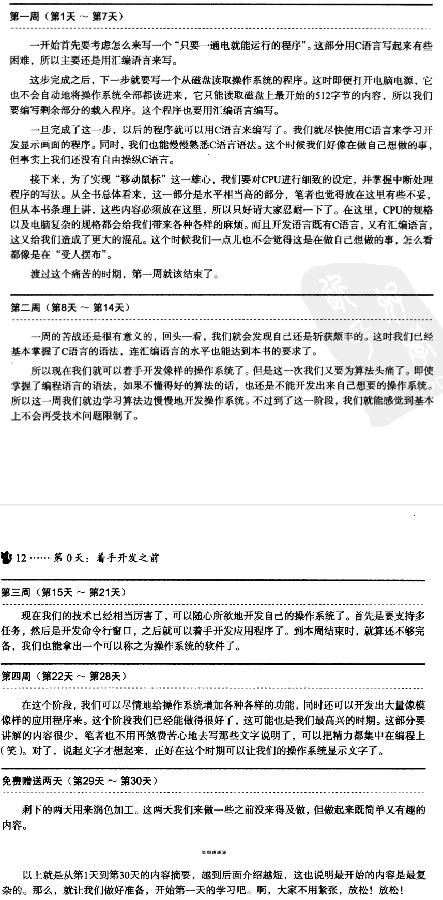

# 第1天：从计算机结构到汇编程序入门

## 先动手操作

与其啰啰嗦嗦地写上一大堆，还不如实际动手开发来得轻松，我们这就开始吧。而且我们一上来就完全抛开前面的说明，既不用C语言，也不用汇编程序，而是采用一个迥然不同的工具来进行开发（笑）。

有一种工具软件名为“**二进制编辑器**”（Binary Editor），是一种能够直接对二进制数进行编辑的软件。我们现在要用它来编辑出下图这样的文件。

也许有人会说“这样的工具我从来没有见过呀”，没关系，下面我们来详细地介绍一下。

首先打开下面这个网页：http://www.zob.ne.jp/-c.mos/sof/bz.html

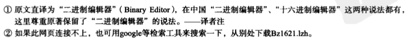

点击“在此下载”（Download）的链接，下载文件B21621.1zh（在此非常感谢c.mos公司无偿公开这么好的软件）。当你读到本书的时候，也许会有新的版本发布，所以文件名可能会有所不同。接下来，安装下载下来的文件，然后双击启动Bz.exe程序。如果不能正常启动的话，可以参考上面网页的“注意*”一项，按照上面的安装指导进行操作。

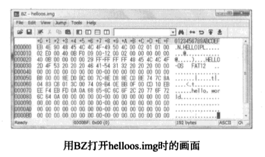

顺利启动的话屏幕上会出现如下画面。

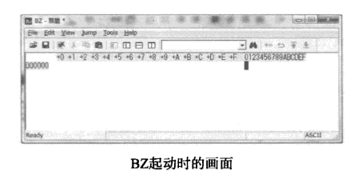

好，让我们赶紧来输入吧，只要从键盘上直接输入EB490484 就可以了，简单吧。其中字符之间的空格是这个软件在显示时为方便阅读自动插入的，不用自己从键盘上输入。另外，右边的.N.HELLOIPL 部分，也不用从键盘输入，这是软件自动显示的。可能版本或者显示模式不一样的时候，右侧显示的内容会与下面的截图有所不同。不过不用往心里去，这些内容完全是锦上添花的东西，即使不一样也没事。

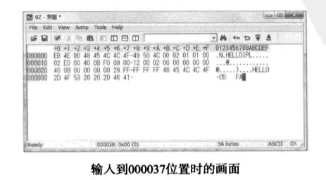

从000090开始后面全都是00，一直输入到最后168000这个地址。如果一直按着键盘上的"0"不放手的话，画面上的0就会不停地增加，但因为个数相当多，也还是挺花时间的。如果家里有只猫的话，倒是可以考虑请它来帮忙按住这个键（日本的谚语：想让猫来搭把手，形容人手不足，连猫爪子都想借用一下），或者也可以干脆就用透明胶把这个键粘上。

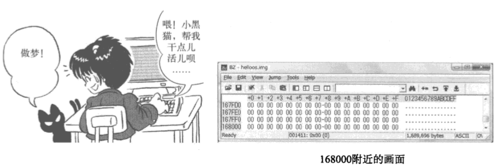

因为一下子输入到最后实在是挺花时间的，大家也许想保存一下中间结果，这时可以从菜单上选择“文件”（File）→“另存为”（Save As），画面上就会弹出保存文件的对话框。我们可以随便取个名字进行保存，笔者推荐使用`"helloos.img"`。当想要打开保存过的文件时，首先要启动Bz.exe，从菜单上选择“文件”（File）→"打开”（Open），然后选择目标文件，这样原来保存的内容就能显示出来了。可是这个时候不管我们怎么努力按键盘，它都一点反应也没有。这是怎么回事？难道必须要一次性输入到最后吗？这个大家不必担心，其实只要从莱单里选择“编辑”（Edit）→“只读”（Read Only）就可以进入编辑状态啦。好了，我们继续输入。

如果家里的猫自由散漫惯了，不肯帮忙，而大家又不想用透明胶粘键盘这种土方法的话，不妨这样：用鼠标选择一部分0，然后从菜单选择“编辑”（Edit）-“复制”（Copy），简简单单复制粘贴几次就可以大功告成了，这工具还真方便呀。

哦，对了，差点忘记一件重要的事-在地址0001F0和001400附近还有些地方不全是00，要像下图那样把它们也改过来，然后整体检查一下，确认没有输入错误。

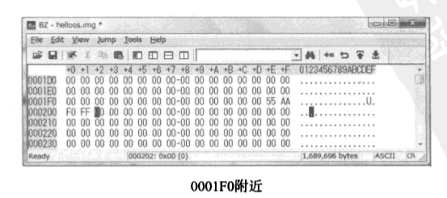

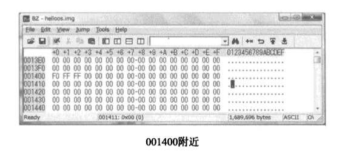

下面，我们把输入的内容保存下来就完成了软盘映像文件的制作，这时查看一下文件属性，应该能看到文件大小正好是1474560字节（=1440x1024字节），然后我们**将这个文件写入软盘（具体后述）**，并用它来启动电脑。如下所示，画面上会显示出"hello，world"这个字符串。目前的程序虽然简单，但毕竟一打开电脑它就能够自动启动，还能在屏幕上显示出一句话来，已经小小成功了哦。不过，我们现在还没有结束这个程序的方法，所以想要结束的时候，只能把软盘取出来后切断电脑电源，或者重新启动。

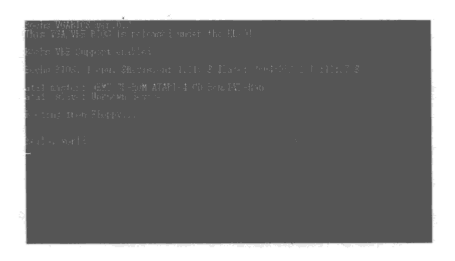

至于最关键的往磁盘上写映像文件的方法，笔者已经预先准备好了一个程序。在介绍它的使用方法之前，我们先把笔者准备的工具全都安装进来吧，这样后面讲解起来比较省事。下面我们就来看怎么安装这些工具。

> 我之前看这本书的时候，遇到这里就卡壳了，不知道怎么制作这个软盘映像文件，现在要好好研究一下，或者在网上找一下有没有别人做的现成的拿来用一下啊。
>
> 我看了一下，之前下载的GitHub上的项目里有这个代码。

打开**附带光盘**，里面有一个名为`tolset`的文件夹，把这个文件夹复制到硬盘的任意一个位置上。现在里面的东西还不多，只有3MB左右，不过以后我们自己开发的软件也都要放到这个文件夹里，所以往后它会越来越大，因此硬盘上最好留出100MB左右的剩余空间。工具安装到此结束，我们既不用修改注册表，也不用设定路径参数，就这么简单。而且以后不管什么时候，都可以把这整个文件夹移动到任何其他地方。用这些工具，我们不仅可以开发操作系统，还可以开发简单的Windows应用程序或OSASK应用程序等。