# HTTP概述

# 第1章：HTTP概述

(注1：学习AJAX过程中发现计算机网络不熟，再来稍微看一下)

(注2：我觉得计算机网络学的差不多了，再回过头来看AJAX，肯定会很容易理解了)

Web浏览器、服务器和相关的Web应用程序都是通过HTTP相互通信的.HTTP是现代全球因特网中使用的公共语言。

本章是对HTTP的简要介绍。在本章中可以看到Web应用程序是如何使用HTTP进行通信的，这样就可以对HTTP如何完成其工作有个大概印象。我们将特别介绍以下方面的内容：

* Web客户端与服务器是如何通信的；
* （表示Web内容的）资源来自何方；
* Web事务是怎样工作的；
* HTTP通信所使用的报文格式；
* 底层TCP网络传输；
* 不同的HTTP协议变体；
* 因特网上安装的大量HTTP架构组件中的一部分。

我们有很多话题要讨论，就此开始HTTP之旅吧。

## HTTP-因特网的多媒体信使

每天，都有数以亿万计的JPEG图片、HTML页面、文本文件、MPEG电影、WAV音频文件、Java小程序和其他资源在因特网上游弋。HTTP可以从遍布全世界的Web服务器上将这些信息块迅速、便捷、可靠地搬移到人们桌面上的Web浏览器上去。

HTTP使用的是可靠的数据传输协议，因此即使数据来自地球的另一端，它也能够确保数据在传输的过程中不会被损坏或产生混乱。这样，用户在访问信息时就不用担心其完整性了，因此对用户来说，这是件好事。而对因特网应用程序开发人员来说也同样如此，因为这样就无需担心HTTP通信会在传输过程中被破坏、复制或产生畸变了。开发人员可以专注于应用程序特有细节的编写，而不用考虑因特网中存在的一些缺陷和问题。

下面，就让我们来近距离地观察一下HTTP是如何传输Web流量的。

## Web客户端和服务器

Web内容都是存储在Web服务器上的。Web服务器所使用的是HTTP协议，因此经常会被称为HTTP服务器。这些HTTP服务器存储了因特网中的数据，如果HTTP客户端发出请求的话，它们会提供数据。客户端向服务器发送HTTP请求，服务器会在HTTP响应中回送所请求的数据，如图1-1所.HTTP户端和HTTP服务器共同构成了万维网的基本组件。

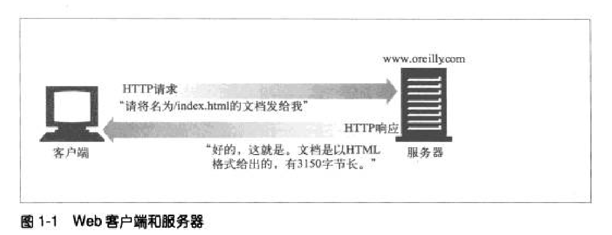

可能你每天都在使用HTTP客户端。最常见的客户端就是Web浏览器，比如微软的Internet Explorer或网景的Navigator.Web浏览器向服务器请求HTTP对象，并将这些对象显示在你的屏幕上。

浏览一个页面时（比如http:/www.oreily.com/index.html），浏览器会向服务器www.oreilly.com发送一条HTTP请求（参见图1-1），服务器会去寻找所期望的对象（在这个例子中就是/index.html），如果成功，就将对象、对象类型、对象长度以及其他一些信息放在HTTP响应中发送给客户端。

## 资源

Web服务器是Web资源（Web resource）的宿主.Web资源是web内容的源头。
最简单的Web资源就是Web服务器文件系统中的静态文件。这些文件可以包含任意内容：文本文件、HTML文件，微软的Word文件、Adobe的Acrobat文件JPEG图片文件、AV1电影文件，或所有其他你能够想到的格式。

但资源不一定非得是静态文件。资源还可以是根据需要生成内容的软件程序。这些动态内容资源可以根据你的身份、所请求的信息或每天的不同时段来产生内容。它们可以为你显示照相机中活生生的照片，也可以帮你进行股票交易，搜索房产数据库，或者从在线商店中购买礼物（参见图1-2）。

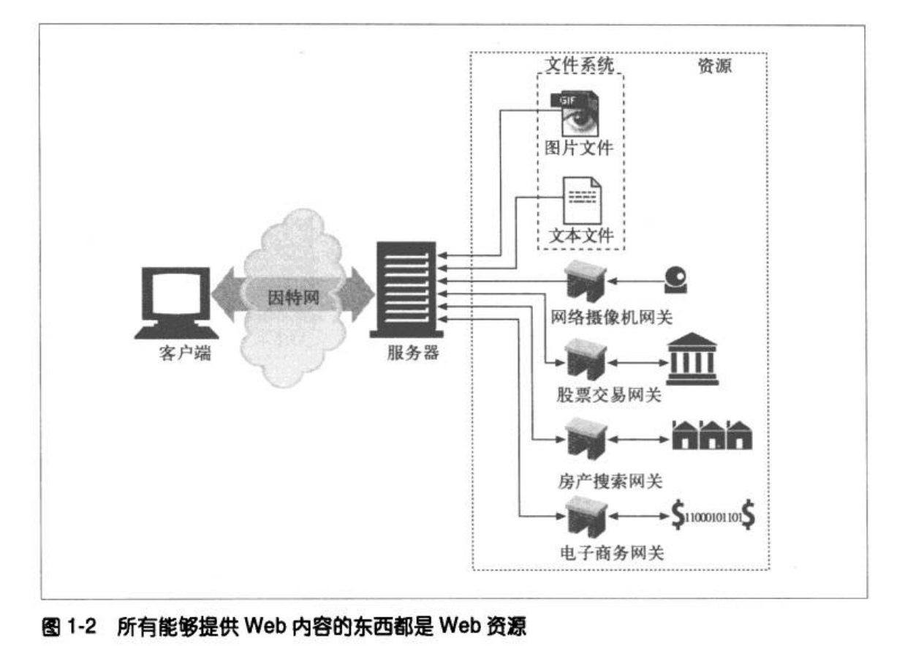

总之，所有类型的内容来源都是资源。包含公司销售预测电子表格的文件是一种资源。扫描本地公共图书馆书架的Web网关是一种资源。因特网搜索引擎也是一种资源。

### 媒体类型

因特网上有数千种不同的数据类型，HTTP仔细地给每种要通过Web传输的对象都打上了名为MIME类型（MIME type）的数据格式标签。最初设计MIME
（Multipurpose Internet Mail Extension，多用途因特网邮件扩展）是为了解决在不同的电子邮件系统之间搬移报文时存在的问题。MIME在电子邮件系统中工作得非常好，因此HTTP也采纳了它，用它来描述并标记多媒体内容。

Web服务器会为所有HTTP对象数据附加一个MIME类型（参见图1-3）。当Web浏览器从服务器中取回一个对象时，会去查看相关的MIME类型，看看它是否知道应该如何处理这个对象。大多数浏览器都可以处理数百种常见的对象类型：显示图片文件、解析并格式化HTML文件、通过计算机声卡播放音频文件，或者运行外部插件软件来处理特殊格式的数据。

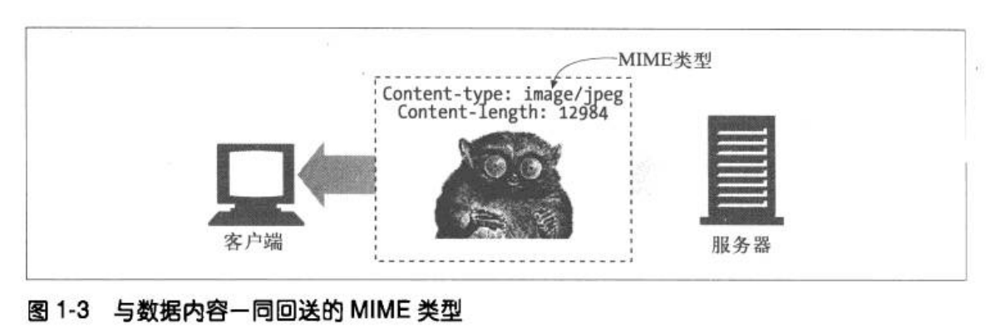

MIME类型是一种文本标记，表示一种主要的对象类型和一个特定的子类型，中间由一条斜杠来分隔。

* HTML格式的文本文档由text/html类型来标记。
* 普通的ASCII文本文档由text/plain类型来标记。
* JPEG版本的图片为image/jpeg类型。
* GIF格式的图片为image/gif类型。
* Apple的QuickTime电影为video/quicktime类型。
* 微软的PowerPoint演示文件为application/vnd.ms-powerpoint类型。

常见的MIME类型有数百个，实验性或用途有限的MIME类型则更多。附录D提供了一个非常完整的MIME类型列表。

### URI

每个Web服务器资源都有一个名字，这样客户端就可以说明它们感兴趣的资源是什么了。服务器资源名被称为统一资源标识（Uniform Resource Identifier，URI）
URI就像因特网上的邮政地址一样，在世界范围内唯一标识并定位信息资源。

这是Joe的五金商店的Web服务器上一个图片资源的URI：

> http://www.joes-hardware.com/specials/saw-blade.gif

图1-4显示了URI是怎样指示HTTP协议去访问Joe商店服务器上的图片资源的。给定了URI，HTTP就可以解析出对象。URI有两种形式，分别称为URL和URN现在我们分别来看看这些资源标识符类型。

### URL

统一资源定位符（URL）是资源标识符最常见的形式。URL描述了一台特定服务器上某资源的特定位置。它们可以明确说明如何从一个精确、固定的位置获取资源。

图1-4显示了URL如何精确地说明某资源的位置以及如何去访问它。表1-1显示了几个URL实例。

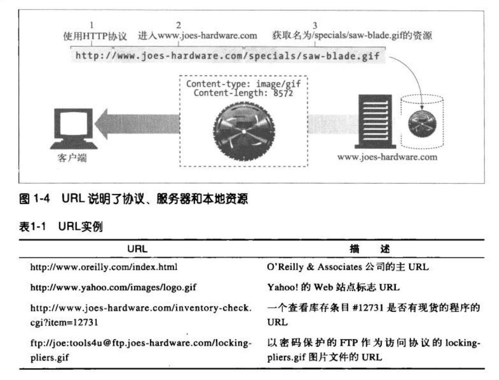

大部分URL都遵循一种标准格式，这种格式包含三个部分。

* URL的第一部分被称为方案（scheme），说明了访问资源所使用的协议类型。这部分通常就是HTTP协议（http://）
* 第二部分给出了服务器的因特网地址（比如，www.joes-hardware.com）
* 其余部分指定了Web服务器上的某个资源（比如，/specials/saw-blade.gif）

现在，几乎所有的URI都是URL。

### URN

URI的第二种形式就是统一资源名（URN），URN是作为特定内容的唯一名称使用的，与目前的资源所在地无关。使用这些与位置无关的URN，就可以将资源四处搬移。通过URN，还可以用同一个名字通过多种网络访问协议来访问资源。

比如，不论因特网标准文档RFC 2141位于何处（甚至可以将其复制到多个地方），都可以用下列URN来命名它：

> urn:ietf:rfc:2141

URN仍然处于试验阶段，还未大范围使用。为了更有效地工作，URN需要一个支撑架构来解析资源的位置。而此类架构的缺乏也延缓了其被采用的进度。但URN确实为未来发展作出了一些令人兴奋的承诺。我们将在第2章较为详细地讨论URN，而本书的其余部分讨论的基本上都是URL。

除非特殊说明，否则本书的其余部分都会使用约定的术语，并且会不加区别地使用URI和URL。

## 事务

我们来更仔细地看看客户端是怎样通过HTTP与Web服务器及其资源进行事务处理的。一个HTTP事务由一条（从客户端发往服务器的）请求命令和一个（从服务器发回客户端的）响应结果组成。这种通信是通过名为HTTP报文（HTTP message）
的格式化数据块进行的，如图1-5所示。

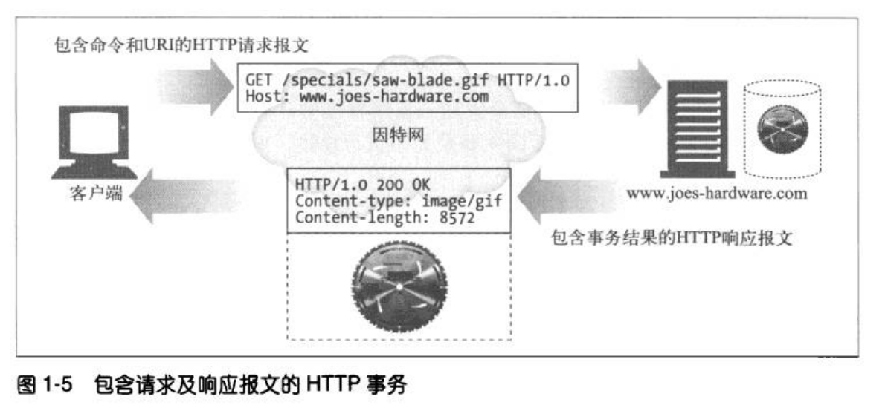

### 方法

HTTP支持几种不同的请求命令，这些命令被称为HTTP方法（HTTP method）。每条HTTP请求报文都包含一个方法。这个方法会告诉服务器要执行什么动作（获取一个Web页面、运行一个网关程序、删除一个文件等）。表1-2列出了五种常见的HTTP方法。

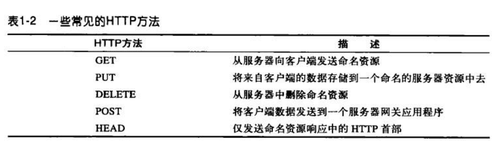

我在第3章详细讨论HTTP方法。

### 状态码

每条HTTP响应报文返回时都会携带一个状态码。状态码是一个三位数字的代码，告知客户端请求是否成功，或者是否需要采取其他动作。表1-3显示了几种常见的状态码。

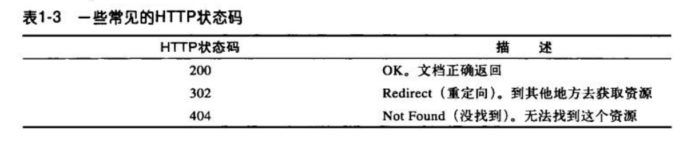

伴随着每个数字状态码，HTTP还会发送一条解释性的“原因短语”文本（参见图1-5中的响应报文），包含文本短语主要是为了进行描述，所有的处理过程使用的都是数字码。

HTTP软件处理下列状态码和原因短语的方式是一样的。

~~~
200 OK
200 Document attached
200 Success
200 All's cool, dude
~~~

第3章详细解释了HTTP状态码。

### Web页面中可以包含多个对象

应用程序完成一项任务时通常会发布多个HTTP事务。比如，Web浏览器会发布一系列HTTP事务来获取并显示一个包含了丰富图片的Web页面。浏览器会执行一个事务来获取描述页面布局的HTML“框架”，然后发布另外的HTTP事务来获取每个嵌入式图片、图像面板、Java小程序等。这些嵌入式资源甚至可能位于不同的服务器上，如图1-6所示。因此，一个"Web页面”通常并不是单个资源，而是一组资源的集合。

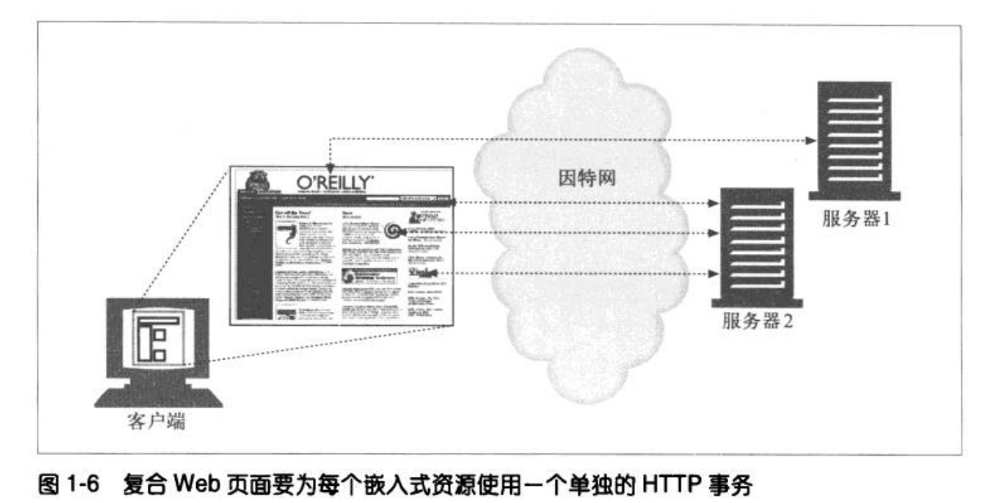

## 报文

现在我们来快速浏览一下HTTP请求和响应报文的结构。第3章会深入研究HTTP报文。

HTTP报文是由一行一行的简单字符串组成的。HTTP报文都是纯文本，不是二进制代码，所以人们可以很方便地对其进行读写。图1-7显示了一个简单事务所使用的HTTP报文。

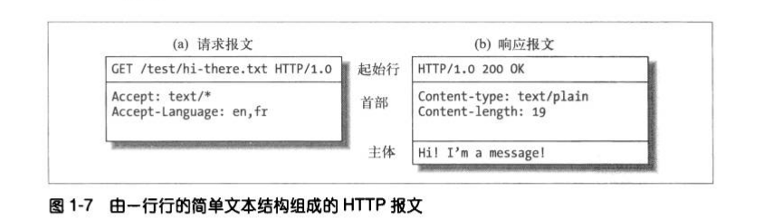

> 有些程序员会抱怨HTTP的语法解析太困难了，这项工作需要很多技巧，而且很容易出错，尤其是在设计高速软件的时候更是如此。二进制格式或更严格的文本格式可能更容易处理，但大多数HTTP程序员都很欣赏HTTP的可扩展性以及可调试性。

从Web客户端发往Web服务器的HTTP报文称为请求报文（request message）。从服务器发往客户端的报文称为响应报文（response message），此外没有其他类型的HTTP报文。HTTP请求和响应报文的格式很类似。

HTTP报文包括以下三个部分。

* 起始行

  报文的第一行就是起始行，在请求报文中用来说明要做些什么，在响应报文中说明出现了什么情况。

* 首部字段

    起始行后面有零个或多个首部字段。每个首部字段都包含一个名字和一个值，为了便于解析，两者之间用冒 	号（:）来分隔。首部以一个空行结束。添加一个首部字段和添加新行一样简单。

* 主体

  空行之后就是可选的报文主体了，其中包含了所有类型的数据。请求主体中包括了要发送给web服务器的数据；响应主体中装载了要返回给客户端的数据。起始行和首部都是文本形式且都是结构化的，而主体则不同，主体中可以包含任意的二进制数据（比如图片、视频、音轨、软件程序），当然，主体中也可以包含文本。

### 简单的报文实例

图1-8显示了可能会作为某个简单事务的一部分发送的HTTP报文。浏览器请求资源http://www.joes-hardware.com/tools.html。

在图1-8中，浏览器发送了一条HTTP请求报文。这条请求的起始行中有一个GET令，且本地资源为/tools.html，这条请求说明它使用的是1.0版的HTTP协议。请求报文没有主体，因为从服务器上GET一个简单的文档不需要请求数据。

服务器会回送一条HTTP响应报文。这条响应中包含了HTTP的版本号（HTTP/1.0），一个成功状态码（200）、一个描述性的原因短语（OK），以及一块响应首部宇段，在所有这些内容之后跟着包含了所请求文档的响应主体。Content-Length首部说明了响应主体的长度，Content-Type首部说明了文档的MIME类型。

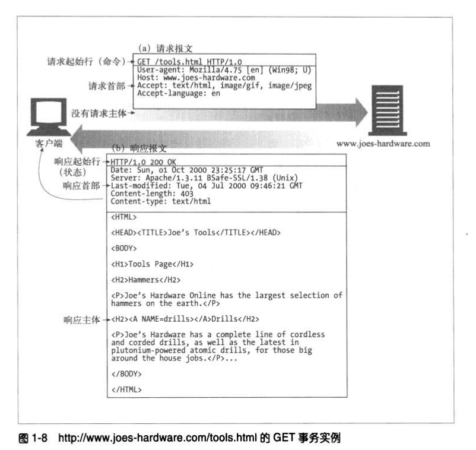

##  连接

概要介绍了HTTP报文的构成之后，我们来讨论一下报文是如何通过传输控制协议
（Transmission Control Protocol，TCP）连接从一个地方搬移到另一个地方去的。

### TCP/IP

HTTP是个应用层协议，HTTP无需操心网络通信的具体细节，它把联网的细节都交给了通用、可靠的因特网传输协议 TCP/IP 

TCP提供了：

* 无差错的数据传输;
* 按序传输（数据总是会按照发送的顺序到达）；
* 未分段的数据流（可以在任意时刻以任意尺寸将数据发送出去）。

因特网自身就是基于TCPIP的，TCPIP是全世界的计算机和网络设备常用的层次化分组交换网络协议集.TCPIP隐藏了各种网络和硬件的特点及弱点，使各种类型的计算机和网络都能够进行可靠地通信。

只要建立了TCP连接，客户端和服务器之间的报文交换就不会丢失、不会被破坏，也不会在接收时出现错序了。

用网络术语来说，HTTP协议位于TCP的上层。HTTP使用TCP来传输其报文数据。与之类似，TCP则位于IP的上层（参见图1-9）。

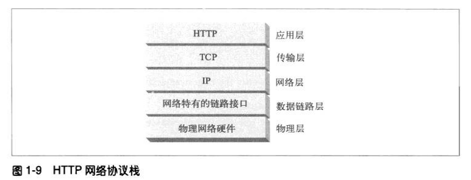

### 连接、IP地址及端口号

在HTTP客户端向服务器发送报文之前，需要用网际协议（Internet Protocol，IP）
地址和端口号在客户端和服务器之间建立一条TCPIP连接。

建立一条TCP连接的过程与给公司办公室的某个人打电话的过程类似。首先，要拨打公司的电话号码。这样就能进入正确的机构了。其次，拨打要联系的那个人的分机号。

在TCP中，你需要知道服务器的IP地址，以及与服务器上运行的特定软件相关的TСР端口号。

这就行了，但最初怎么获得HTTP服务器的IP地址和端口号呢？当然是通过URL了！我们前面曾提到过，URL就是资源的地址，所以自然能够为我们提供存储资源的机器的IP地址。我们来看几个URL：

~~~
http://207.200.83.29:80/index.html
http://www.netscape.com:80/index.html 
http://www.netscape.com/index.html
~~~

第一个URL使用了机器的IP地址，207.200.83.29以及端口号80。

第二个URL没有使用数字形式的IP地址，它使用的是文本形式的城名，或者称为主机名（www.netscape.com），主机名就是IP地址比较人性化的别称。可以通过一种称为域名服务（Domain Name Service，DNS）的机制方便地将主机名转换为IP地址，这样所有问题就都解决了。第2章会介绍更多有关DNS和URL的内容。

最后一个URL没有端口号.HTTP的URL中没有端口号时，可以假设默认端口号是80.
有了IP地址和端口号，客户端就可以很方便地通过TCP/IP进行通信了。图1-10显示了浏览器是怎样通过HTTP显示位于远端服务器中的某个简单HTML资源的。

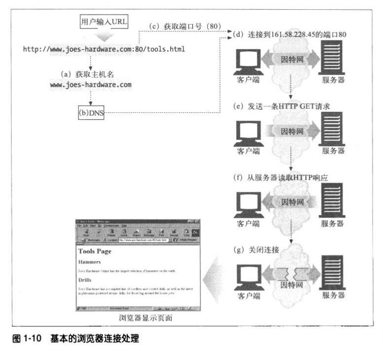

步骤如下：

（a）浏览器从URL中解析出服务器的主机名；

（b）浏览器将服务器的主机名转换成服务器的IP地址;

（c）浏览器将端口号（如果有的话）从URL中解析出来；

（d）浏览器建立一条与Web服务器的TCP连接；

（e）浏览器向服务器发送一条HTTP请求报文

（f）服务器向浏览器回送一条HTTP响应报文;

（g）关闭连接，浏览器显示文档。

### 使用Telnet实例

由于HTTP使用了TCP/IP传输协议，而且它是基于文本的，没有使用那些难以理解的二进制格式，因此很容易直接与web服务器进行对话。

Telnet程序可以将键盘连接到某个目标TCP端口，并将此TCP端口的输出回送到显示屏上。Telnet常用于远程终端会话，但它几乎可以连接所有的TCP服务器，包括HTTP服务器。

可以通过Telnet程序直接与Web服务器进行对话。通过Telnet可以打开一条到某台机器上某个端口的TCP连接，然后直接向那个端口输入一些字符。web服务器会将Telnet程序作为一个Web客户端来处理，所有回送给TCP连接的数据都会显示在屏幕上。

我们用Telnet与一个实际的Web服务器进行交互。我们要用Telnet获取URL http://www.joes-hardware.com：80/tools.html所指向的文档（你可以自己尝试一下这个实例）。

我们来看看会发生什么情况。

* 首先，查找www.joes-hardware.com的IP地址，打开一条到那台机器端口80的TCP连接。Telnet会为我们完成那些“跑腿儿”的工作。
* 一旦打开了TCP连接，就要输入HTTP请求了。
* 请求结束（由一个空行表示）之后，服务器会在一条HTTP响应中将内容回送并关闭连接。

例1-1显示了对http://www.jes-hardware.com：80/tools.html的HTTP请求实例。我们输入的内容用粗体字表示。

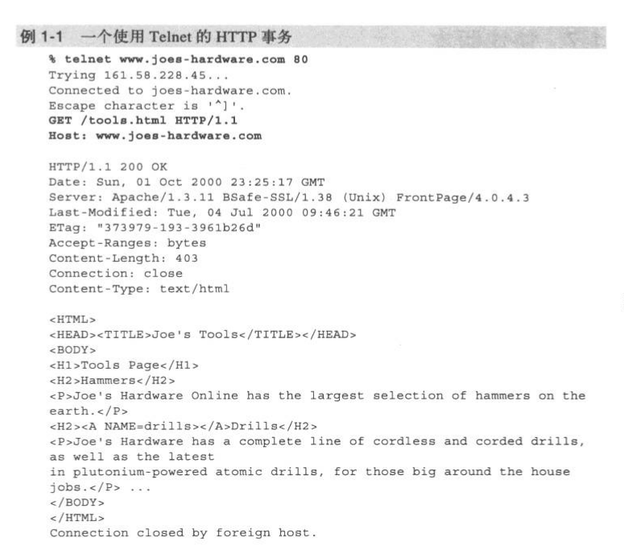

Telnet会查找主机名并打开一条连接，连接到在www.joes-hardware.com的端口80上监听的Web服务器。这条命令之后的三行内容是Telnet的输出，告诉我们它已经建立了连接。

然后我们输入最基本的请求命令GET/tools.html HTTP/1.1，发送一个提供了源端主机名的Host首部，后面跟上一个空行，请求从服务器www.joes-hardware.com上获取资源tools.html，随后，服务器会以一个响应行、几个响应首部、一个空行和最后面的HTML文档主体来应答。

要明确的是，Telnet可以很好地模拟HTTP客户端，但不能作为服务器使用。而且对Telnet做脚本自动化是很繁琐乏味的。如果想要更灵活的工具，可以去看看no netcat），通过nc可以很方便地操纵基于UDP和TCP的流量（包括HTTP），还可以为其编写脚本。更多细节参见http://www.bgw.org/tutorials/utilities/nc.php.

## 协议版本

现在使用的HTTP协议有几个版本。HTTP应用程序要尽量强健地处理各种不同的HTTP协议变体。目前仍在使用的版本如下。

* HTTP/0.9

  HTTP的1991原型版本称为HTTP/0.9，这个协议有很多严重的设计缺陷，只应该用于与老客户端的交互.HTTP/0.9只支持GET方法，不支持多媒体内容的MIME类型、各种HTTP首部，或者版本号。HTTP/0.9定义的初衷是为了获取简单的HTML对象，它很快就被HTTP/1.0取代了。

* HTTP/1.0

  1.0是第一个得到广泛使用的HTTP版本。HTTP/1.0添加了版本号、各种HTTP首部、一些额外的方法，以及对多媒体对象的处理。HTTP/1.0使得包含生动图片的Web页面和交互式表格成为可能，而这些页面和表格促使万维网为人们广泛地接受。这个规范从未得到良好地说明。在这个HTTP协议的商业演进和学术研究都在快速进行的时代，它集合了一系列的最佳实践。

* HTTP/1.0+

  在20世纪90年代中叶，很多流行的Web客户端和服务器都在飞快地向HTTP中添加各种特性，以满足快速扩张且在商业上十分成功的万维网的需要。其中很多特性，包括持久的keep-alive连接、虚拟主机支持，以及代理连接支持都被加入到HTTP之中，并成为非官方的事实标准。这种非正式的HTTP扩展版本通常称为HTTP/1.0+

* HTTP/1.1

  HTTP/1.1重点关注的是校正HTTP设计中的结构性缺陷，明确语义，引入重要的性能优化措施，并删除一些不好的特性.HTTP/1.1还包含了对20世纪90年代末正在发展中的更复杂的Web应用程序和部署方式的支持。HTTP/1.1是当前使用的HTTP版本。

* HTTP-NG（又名HTTP/2.0）

  HTTP-NG是HTTP/1.1后继结构的原型建议，它重点关注的是性能的大幅优化，以及更强大的服务逻辑远程执行框架。HTTP-NG的研究工作终止于1998年，编写本书时，还没有任何要用此建议取代HTTP/1.1的推广计划。更多信息请参见第10章。

## Web的结构组件

在本章的概述中，我们重点介绍了两个web应用程序（Web浏览器和Web服务器）
是如何相互发送报文来实现基本事务处理的。在因特网上，要与很多Web应用程序进行交互。在本节中，我们将列出其他一些比较重要的应用程序，如下所示。

* 代理

  位于客户端和服务器之间的HTTP中间实体。

* 缓存

  HTTP的仓库，使常用页面的副本可以保存在离客户端更近的地方。

* 网关

  连接其他应用程序的特殊Web服务器。

* 隧道

  对HTTP通信报文进行盲转发的特殊代理。

* Agent代理

  发起自动HTTP请求的半智能Web客户端。

### 代理

首先我们来看看HTTP代理服务器，这是Web安全、应用集成以及性能优化的重要组成模块。

如图1-11所示，代理位于客户端和服务器之间，接收所有客户端的HTTP请求，并将这些请求转发给服务器（可能会对请求进行修改之后转发）。对用户来说，这些应用程序就是一个代理，代表用户访问服务器。

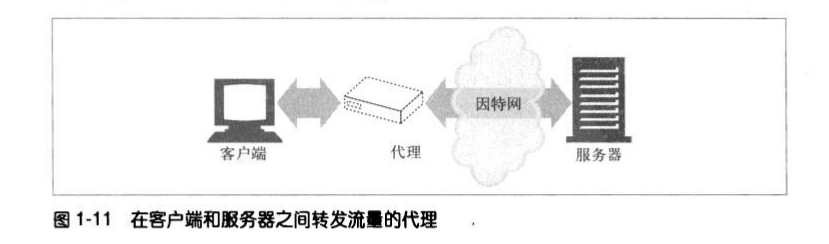

出于安全考虑，通常会将代理作为转发所有Web流量的可信任中间节点使用。代理还可以对请求和响应进行过滤。比如，在企业中对下载的应用程序进行病毒检测，或者对小学生屏藏一些成人才能看的内容。我们将在第6章详细介绍代理。

### 缓存

Web缓存（Web cache）或代理缓存（proxy cache）是一种特殊的HTTP代理服务器，可以将经过代理传送的常用文档复制保存起来。下一个请求同一文档的客户端就可以享受缓存的私有副本所提供的服务了（参见图1-12）。

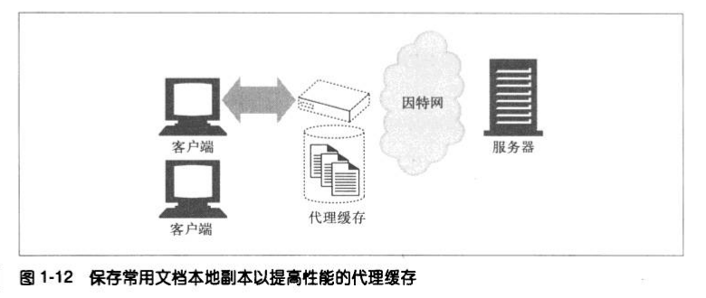

客户端从附近的缓存下载文档会比从远程Web服务器下载快得多.HTTP定义了很多功能，使得缓存更加高效，并规范了文档的新鲜度和缓存内容的隐私性。第7章介绍了缓存技术。

### 网关

网关（gateway）是一种特殊的服务器，作为其他服务器的中间实体使用。通常用于将HTTP流量转换成其他的协议。网关接受请求时就好像自己是资源的源端服务器一样。客户端可能并不知道自己正在与一个网关进行通信。

例如，一个HTTP/FTP网关会通过HTTP请求接收对FTP URI的请求，但通过FTP协议来获取文档（参见图1-13）。得到的文档会被封装成一条HTTP报文，发送给客户端。第8章将探讨网关。

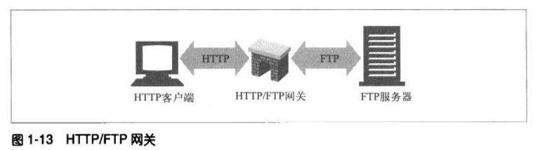

### 隧道

隧道（tunnel）是建立起来之后，就会在两条连接之间对原始数据进行盲转发的HTTP应用程序.HTTP隧道通常用来在一条或多条HTTP连接上转发非HTTP数据，转发时不会窥探数据。

HTTP隧道的一种常见用途是通过HTTP连接承载加密的安全套接字层（SSL，Secure Sockets Layer）流量，这样SSL流量就可以穿过只允许Web流量通过的防火墙了。如图1-14所示，HTTP/SSL隧道收到一条HTTP请求，要求建立一条到目的地址和端口的输出连接，然后在HTTP信道上通过隧道传输加密的SSL流量，这样就可以将其盲转发到目的服务器上去了。

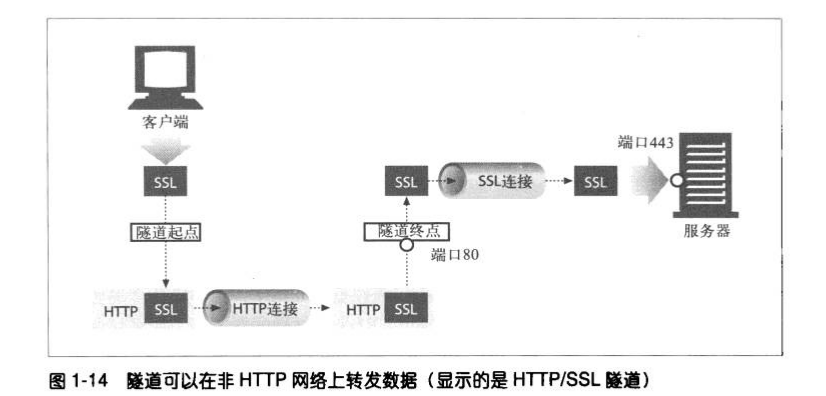

### Agent代理

用户Agent代理（或者简称为Agent代理）是代表用户发起HTTP请求的客户端程序。所有发布Web请求的应用程序都是HTTP Agent代理。到目前为止，我们只提到过一种HTTP Agent代理：Web浏览器，但用户Agent代理还有很多其他类型。

比如，有些自己会在Web上闲逛的自动用户Agent代理，可以在无人监视的情况下发布HTTP事务并获取内容。这些自动代理的名字通常都很生动，比如“网络蜘蛛”
（spiders）或者"Web机器人"（Web robots）（参见图1-15），网络蜘蛛会在Web上闲逛，搜集信息以构建有效的Web内容档案，比如一个搜索引擎的数据库或者为比较购物机器人生成的产品目录。更多信息请参见第9章。

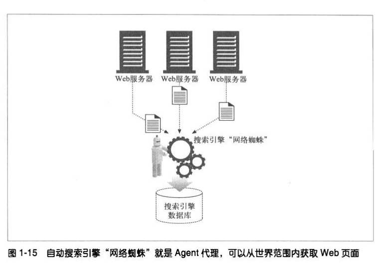

## 起始部分的结束语

这就是我们对HTTP的简要介绍。本章中，我们重点介绍了作为多媒体传输协议使用的HTTP，概要说明了HTTP是怎样使用URI来命名远程服务器上的多媒体资源的，粗略介绍了如何利用HTTP请求和响应报文操纵远程服务器上的多媒体资源，最后考察了几种使用HTTP的Web应用程序。

本书的其余章节会更加详细地介绍HTTP协议、应用程序及资源的技术机制。

# 第2章：URL与资源

我们可以把因特网当作一个巨大的正在扩张的城市，里面充满了各种可看的东西，可做的事情。你和其他居民，以及到这个正在蓬勃发展的社区旅游的游客都要为这个城市大量的景点和服务使用标准命名规范。博物馆、饭店和家庭住址要使用街道地址，消防局、老板的秘书，以及抱怨你太少打电话给她的母亲要使用电话号码。

所有的东西都有一个标准化的名字，以帮助人们寻找城市中的各种资源。书籍有ISBN号，公交车有线路号，银行账户有账户编码，个人有社会保险号码。明天，你要到机场的31号出口去接你的生意伙伴。每天早上你都要乘坐红线火车，并在Kendall广场站出站。

所有人都对这些名字的标准达成了一致，所以才能方便地共享这座城市的宝藏。你告诉出租车司机把你载到McAllister大街246号，他就知道你是什么意思了（即使他走的是一条很远的路）。

URL就是因特网资源的标准化名称。URL指向每一条电子信息，告诉你它们位于何处，以及如何与之进行交互。本章，我们将介绍以下内容：

* URL语法，以及各种URL组件的含义及其所做的工作；
* 很多Web客户端都支持的URL快捷方式，包括相对URL和自动扩展URL；
* URL编码和字符规则；
* 支持各种因特网信息系统的常见URL方案；
* URL的未来，包括URN-这种框架可以在对象从一处搬移到另一处时，保持稳定的访问名称。

## 浏览因特网资源

URL是浏览器寻找信息时所需的资源位置。通过URL，人类和应用程序才能找到、使用并共享因特网上大量的数据资源。URL是人们对HTTP和其他协议的常用访问点：一个人将浏览器指向一个URL，浏览器就会在幕后发送适当的协议报文来获取人们所期望的资源。

URI是一类更通用的资源标识符，URL实际上是它的一个子集。URI是一个通用的概念，由两个主要的子集URL和URN构成，URL是通过描述资源的位置来标识资源的，而URN（本章稍后会介绍）则是通过名字来识别资源的，与它们当前所处位置无关。

HTTP规范将更通用的概念URI作为其资源标识符，但实际上，HTTP应用程序处里的只是URI的URL子集。本书有时会不加区分地使用URI和URL，但我们讲的基本上都是URL

比如说，你想要获取URL http://www.joes-hardware.com/seasonal/index-fall.html那么URL分以下三部分。

* URL的第一部分（http）是URL方案（scheme）。方案可以告知Web客户端怎样访问资源。在这个例子中，URL说明要使用HTTP协议。
* URL的第二部分（www.joes-hardware.com）指的是服务器的位置。这部分告知Web客户端资源位于何处。
* URL的第三部分（/seasonalindex-fall.html）是资源路径。路径说明了请求的是服务器上哪个特定的本地资源。

对此的说明请参见图2-1。

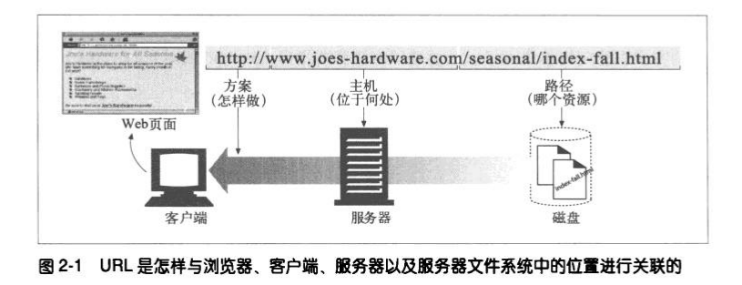

URL可以通过HTTP之外的其他协议来访问资源。它们可以指向因特网上的任意资源，比如个人的E-mail账户：

~~~
mailto:president@whitehouse.gov
~~~

或者其他协议，比如通过文件传输协议（File Transfer Protocol，FTP）才能获取的各种文件：

~~~
ftp://ftp.lots-o-books.com/pub/complete-price-list.xls
~~~

或者从流视频服务器上下载电影：

~~~
rtsp://www.joes-hardware.com:554/interview/cto_video
~~~

URL提供了一种统一的资源命名方式。大多数URL都有同样的：“方案：//服务器位置/路径”结构。因此，对网络上的每个资源以及获取这些资源的每种方式来说，命名资源的方法都只有一种，这样不管是谁都可以用名字来找到这个资源了。但是，事情并不是一开始就是这样的。

### URL出现之前的黑暗岁月

在Web和URL出现之前，人们要靠分类杂乱的应用程序来访问分布在网络中的数据。大多数人都不会幸运地拥有所有合适的应用程序，或者不能够理解，也没有足够的耐心来使用这些程序。

在URL出现之前，要想和朋友共享complete-catalog.xls文件，就得说这样一些话：
“用FTP连接到ftp.joes-hardware.com上。用匿名登录，然后输入你的用户名作为密码。变换到pub目录。转换为二进制模式。现在，可以将名为complete-catalog.xls的文件下载到本地文件系统，并在那里浏览这个文件了
。"

现在，像网景的Navigator和微软的Internet Explorer这样的浏览器都将很多这样的功能捆绑成一个便捷包。通过URL，这些应用程序就可以通过一个接口，以统一的方式去访问许多资源了。只要说“将浏览器指向ftp:/ftp.lots-o-books.com/pub/
complete-catalog.xls"就可以取代上面那些复杂的指令了。

URL为应用程序提供了一种访问资源的手段。实际上，很多用户可能都不知道他们的浏览器在获取所请求资源时所使用的协议和访问方法。

有了Web浏览器，就不再需要用新闻阅读器来阅读因特网新闻，或者用FTP客户端来访问FTP服务器上的文件了，而且也无需用电子邮件程序来收发E-mail报文了。URL告知浏览器如何对资源进行访问和处理，这有助于简化复杂的网络世界'。
应用程序可以使用URL来简化信息的访问过程。

URL为用户及他们的浏览器提供了找到信息所需的所有条件。URL定义了用户所需的特定资源，它位于何处以及如何获取它。

## URL的语法

