(注1：《计算机网络——自顶向下方法》和《图解HTTP》这2本书，太厚又太晦涩，我也就分别只看了一点点，就没有继续再看下去了，这个月学习AJAX，我觉得自己有必要再把计算机网络基础知识再学习一下了，于是我就选了《图解HTTP》这样一本只有200多页的，都是图片的通俗读物，之前也看过，但没看完，趁着这个学AJAX的机会，我要重新开始好好的把这本书给看完吧。)

(注2：这本书是日本人写的，里面有很多图片，还是挺可爱的，拉近了我和计算机网络的距离，关键是通俗。)

# 译者序

目前，国内讲解HTTP协议的书实在太少了。

在我的印象中，讲解网络协议的书仅有两本。一本是《HTTP权威指南》，但其厚度令人望而生畏；另一本是《TCP/P详解，卷1），内容艰涩难懂，学习难度较大。这两本书都是被读者们奉为“圣经”的经典之作，大师们的授道自然无可挑剔，但关键是它们对初学者都不那么友好，大家的学习信心很容易受到打击，阅读中途或将束之高阁。本书的出现及时缓解了该问题。

HTTP协议本身并不复杂，理解起来也不会花费太多学习成本，但纯概念式的学习稍显单调。前端工程师也许对各种具有炫酷效果的页面的实现技巧、赏心悦目的UT框架更感兴趣，但因此常常忽视了 HTTP协议这部分基础内容。实际上，如果想要在专业技术道路上走得更坚实，绝对不能绕开学习HTTP协议这一环节。对基础及核心部分的深入学习是成为一名专业技术人员的前提，以不变应万变才是立足之本。

我在学习Web开发的过程中，曾接触到编写网络爬虫程序、分析抓包数据、实现HTTP服务器、提供网站REST API，修改后端定制框架等方面，它们无一例外，都会用到HTTP协议的各方面知识，并且某些细节无法通过查阅资料立即领会到，还需依靠扎实的基础及平日里的积累。

本书作者的写作手法平实易懂，内容讲解透彻到位。前半部分由HTTP的成长发展史妮娓道来，基于HTTP 1.1标准讲解通信过程，包括HTTP方法、协议格式、报文结构、首部字段、状态码等的具体含义，还分别讲解HTTP通信过程中代理、网关、隧道等的作用。接着介绍SPDY，WebSocket，WebDAV等HTTP的扩展功能。作者还从细节方面举例，让读者更好地理解何为无状态（stateless）.301和302重定向的区别在哪、缓存机制，等等。本书后半部分的重心放在Web安全上，涵盖HTTPS，SSL、证书认证、加密机制、Web攻击手段等内容。

旨在让读者对HTTP协议形成一个整体概念，明确设计HTTP的目的及意义所在，了解HTTP的工作机制，掌握报文中常用的首部字段，返回结果状态码的作用，对各种客户端与服务器的通信交互场景的细节等都做到了然于心，从而在平时的开发工作中独立思考，迅速准确地定位分析由HTTP引发的问题，并辅以适当的方法加以解决。

本书图文并茂，大量图片穿插文中，生动形象地向读者介绍每一个应用案例，减少了读者阅读时的枯燥感。借助一张张配图，读者们不仅会加深视觉记忆，在轻松愉悦的氛围中，还可以更深刻地理解通信机制等背后的工作原理。正所谓一图胜千文。

# 第1章：了解Web及网络基础

> 本章概述了Web是建立在何种技术之上，以及HTTP协议是如何诞生并发展的。我们从其背景着手，来深入了解这部分内容。

## 使用HTTP协议访问Web

你知道当我们在网页浏览器（Web browser）的地址栏中输入URL时，Web页面是如何呈现的吗？

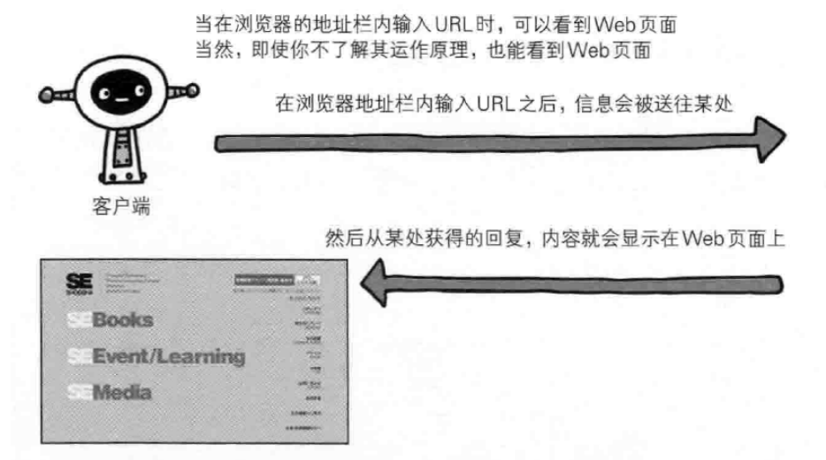

Web页面当然不能凭空显示出来。根据Web浏览器地址栏中指定的URL，Web浏览器从Web服务器端获取文件资源（resource）等信息，从而显示出Web页面。

像这种通过发送请求获取服务器资源的Web浏览器等，都可称为客户端（client）。

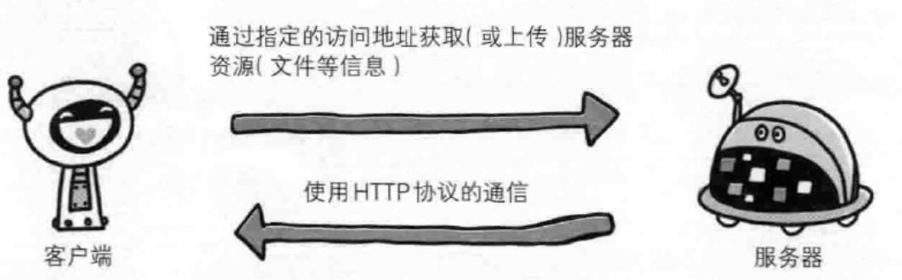

Web使用一种名为HTTP（HyperText Transfer Protocol，超文本传输协议"）的协议作为规范，完成从客户端到服务器端等一系列运作流程。而协议是指规则的约定。可以说，Web是建立在HTTP协议上通信的。

## HTTP的诞生

在深入学习HTTP之前，我们先来介绍一下HTTP诞生的背景。了解背景的同时也能了解当初制定HTTP的初衷，这样有助于我们更好地理解。

### 为知识共享而规划Web

1989年3月，互联网还只属于少数人。在这一互联网的黎明期，HTTP诞生了。

> HTTP通常被译为超文本传输协议，但这种译法并不严谨。严谨的译名应该为“**超文本转移协议**”。但是前一译法已约定俗成，本书将会沿用。

CERN（欧洲核子研究组织）的蒂姆·伯纳斯-李（Tim Berners-Lee）博士提出了一种能让远隔两地的研究者们共享知识的设想。

最初设想的基本理念是：借助多文档之间相互关联形成的超文本(HyperText)，连成可相互参阅WWW（World Wide Web，万维网）。

现在已提出了3项WWW构建技术，分别是：把**SGML**（Standard Generalized Markup Language，标准通用标记语言）作为页面的文本标记语言的**HTML**（HyperText Markup Language，超文本标记语言）；作为文档传递协议的**HTTP**；指定文档所在地址的**URL**（Uniform Resource Locator，统一资源定位符）。

WWW这一名称，是Web浏览器当年用来浏览超文本的客户端应用程序时的名称。现在则用来表示这一系列的集合，也可简称为Web。

### Web成长时代

1990年11月，CERN成功研发了世界上第一台Web服务器和Web浏览器。两年后的1992年9月，日本第一个网站的主页上线了。

* 日本第一个主页

  http://www.ibarakiken.gr.jp/www/

  1990年，大家针对HTML 1.0草案进行了讨论，因HTML1.0中存在多处模糊不清的部分，草案被直接废弃了。

* HTML1.0

  http://www.w3.org/MarkUp/draft-ietf-iiir-html-01.txt

  1993年1月，现代浏览器的祖先NCSA（National Center for Supercomputer Applications，美国国家超级计算机应用中心）研发的Mosaic问世了。

  它以in-line（内联）等形式显示HTML的图像，在图像方面出色的表现使它迅速在世界范围内流行开来。

  同年秋天，Mosaic的Windows版和Macintosh版面世。使用CGI技术的NCSA Web服务器、NCSA HTTPd 1.0也差不多是在这个时期出现的。

* NCSA Mosaic bounce page

  http://archive.ncsa.illinois.edu/mosaic.html

* The NCSA HTTPd Home Page（存档）

  http://web.archive.org/web/20090426182129/http://hoohoo.ncsa.illinois.edu/（原址已失效）

1994年的12月，网景通信公司发布了Netscape Navigator 1.0，1995年微软公司发布Internet Explorer 1.0和2.0。

紧随其后的是现在已然成为Web服务器标准之一的Apache，当时它以Apache 0.2的姿态出现在世人眼前。而HTML也发布了2.0版本。

那一年，Web技术的发展突飞猛进。

时光流转，从1995年左右起，微软公司与网景通信公司之间爆发的浏览器大战愈演愈烈。两家公司都各自对HTML做了扩展，于是导致在写HTML页面时，必须考虑兼容他们两家公司的浏览器。时至今日，这个问题仍令那些写前端页面的工程师感到棘手。

在这场浏览器供应商之间的竞争中，他们不仅对当时发展中的各种Web标准化视而不见，还屡次出现新增功能没有对应说明文档的情况。

2000年前后，这场浏览器战争随着网景通信公司的衰落而暂告一段落。但就在2004年，Mozilla基金会发布了Firefox浏览器，第二次浏览器大战随即爆发。

Internet Explorer浏览器的版本从6升到7前后花费了5年时间。之后接连不断地发布了8、9、10版本。另外，Chrome，Opera，Safari等浏览器也纷纷抢占市场份额。

### 驻足不前的HTTP

#### HTTP/0.9

HTTP于1990年问世。那时的HTTP并没有作为正式的标准被建立。现在的HTTP其实含有HTTP1.0之前版本的意思，因此被称为HTTP/0.9。

#### HTTP/1.0

HTTP正式作为标准被公布是在1996年的5月，版本被命名为HTTP/1.0，并记载于RFC1945。虽说是初期标准，但该协议标准至今仍被广泛使用在服务器端。

* RFC1945- Hypertext Transfer Protocol -- HTTP/1.0

  http://www.ietf.org/rfc/rfc1945.txt

#### HTTP/1.1

1997年1月公布的HTTP/1.1是目前主流的HTTP协议版本。当初的标准是RFC2068，之后发布的修订版RFC2616就是当前的最新版本。

* RFC2616 - Hypertext Transfer Protocol -- HTTP/1.1

  http://www.ietf.org/rfc/rfc2616.txt

可见，作为Web文档传输协议的HTTP，它的版本几乎没有更新。新一代HTTP/2.0正在制订中，但要达到较高的使用覆盖率，仍需假以时日。

当年HTTP协议的出现主要是为了解决文本传输的难题。由于协议本身非常简单，于是在此基础上设想了很多应用方法并投入了实际使用。现在HTTP协议已经超出了Web这个框架的局限，被运用到了各种场景里。

## 网络基础TCP/IP

为了理解HTTP，我们有必要事先了解-下TCP/P协议族。

通常使用的网络（包括互联网）是在TCPIP协议族的基础上运作的。而HTTP属于它内部的一个子集。

接下来，我们仅介绍理解HTTP所需掌握的TCPIP协议族的概要。若想进一步学习有关TCPIP的知识，请参考其他讲解TCP/P的专业书籍。

### TCP/IP 协议族

计算机与网络设备要相互通信，双方就必须基于相同的方法。比如，如何探测到通信目标、由哪一边先发起通信、使用哪种语言进行通信、怎样结束通信等规则都需要事先确定。不同的硬件、操作系统之间的通信，所有的这一切都需要一种规则。而我们就把这种规则称为协议protocol）。

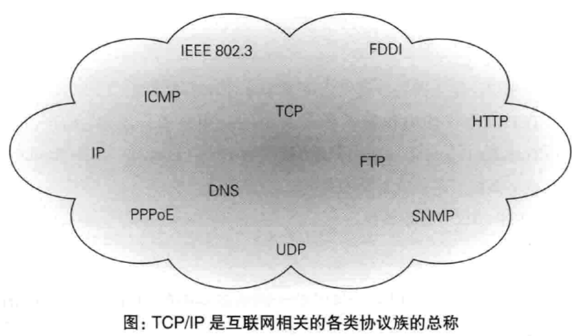

协议中存在各式各样的内容。从电缆的规格到IP地址的选定方法、寻找异地用户的方法、双方建立通信的顺序，以及Web页面显示需要处理的步骤，等等。

像这样把与互联网相关联的协议集合起来总称为TCPIP。也有说法认为，TCP/IP是指TCP和IP这两种协议。还有一种说法认为，TCP/IP是在IP协议的通信过程中，使用到的协议族的统称。

### ТСР/IР 的分层管理

[TCP/IP四层模型与OSI参考模型](https://www.cnblogs.com/dbhui/p/9598980.html)

TCP/IP协议族里重要的一点就是分层。**TCP/IP协议族**按层次分别分为以下**4层**：**应用层、传输层、网络层和数据链路层**。

把TCPIP层次化是有好处的。比如，如果互联网只由一个协议统筹，某个地方需要改变设计时，就必须把所有部分整体替换掉。而分层之后只需把变动的层替换掉即可。把各层之间的接口部分规划好之后，每个层次内部的设计就能够自由改动了。

值得一提的是，层次化之后，设计也变得相对简单了。处于应用层上的应用可以只考虑分派给自己的任务，而不需要弄清对方在地球上哪个地方、对方的传输路线是怎样的、是否能确保传输送达等问题。

TCPIP协议族各层的作用如下。

#### 应用层(FTP、DNS、HTTP等)

应用层决定了向用户提供应用服务时通信的活动。

TCPIP协议族内预存了各类通用的应用服务。比如，FTP（File Transfer Protocol，文件传输协议）和DNS（Domain Name System，域名系统）服务就是其中两类。

HTТP协议也处于该层。

#### 传输层(TCP、UDP等)

传输层对上层应用层，提供处于网络连接中的两台计算机之间的数据传输。

在传输层有两个性质不同的协议：TCP（Transmission Control Protocol，传输控制协议）和UDP（User Data Protocol，用户数据报协议）。

#### 网络层(又名网络互联层)

网络层用来处理在网络上流动的数据包。**数据包**是网络传输的最小数据单位。该层规定了通过怎样的路径（所谓的传输路线）到达对方计算机，并把数据包传送给对方。

与对方计算机之间通过多台计算机或网络设备进行传输时，网络层所起的作用就是在众多的选项内选择一条传输路线。

#### 链路层（又名数据链路层，网络接口层）

用来处理连接网络的硬件部分。包括控制操作系统、硬件的设备驱动、NIC（Network Interface Card，网络适配器，即网卡），及光纤等物理可见部分（还包括连接器等一切传输媒介），硬件上的范畴均在链路层的作用范围之内。

### TCР/IP通信传输流

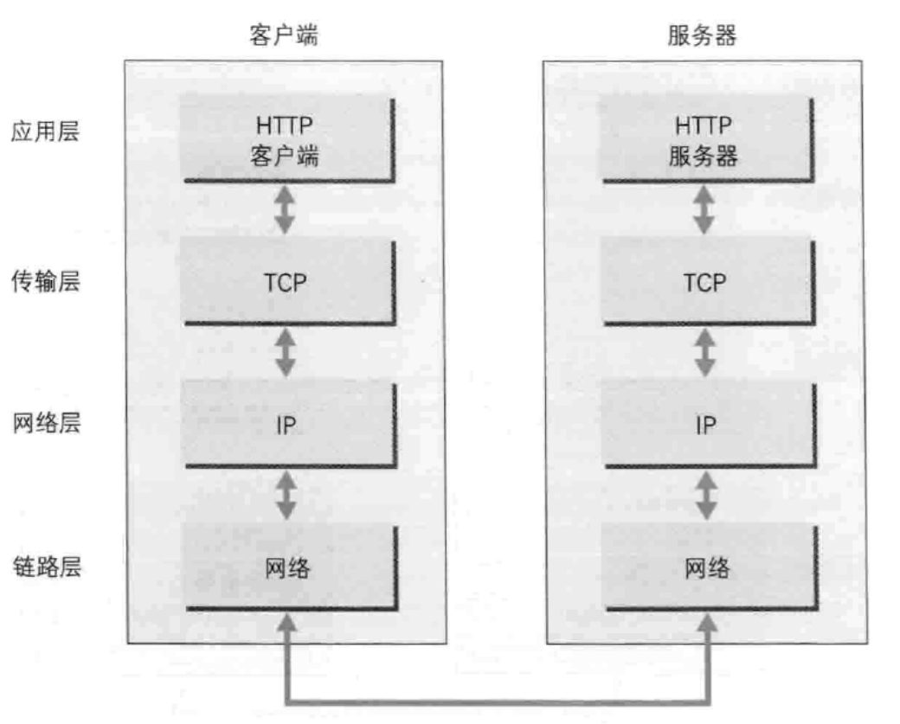

利用TCP/IP协议族进行网络通信时，会通过分层顺序与对方进行通信。发送端从应用层往下走，接收端则往应用层往上走。

我们用HTTP举例来说明，首先作为发送端的客户端在应用层（HTTP协议）发出一个想看某个Web页面的HTTP请求。

接着，为了传输方便，在传输层（TCP协议）把从应用层处收到的数据（HTTP请求报文）进行分割，并在各个报文上打上标记序号及端口号后转发给网络层。

在网络层（IP协议），增加作为通信目的地的MAC地址后转发给链路层。这样一来，发往网络的通信请求就准备齐全了。

接收端的服务器在链路层接收到数据，按序往上层发送，一直到应用层。当传输到应用层，才能算真正接收到由客户端发送过来的HTTP请求。

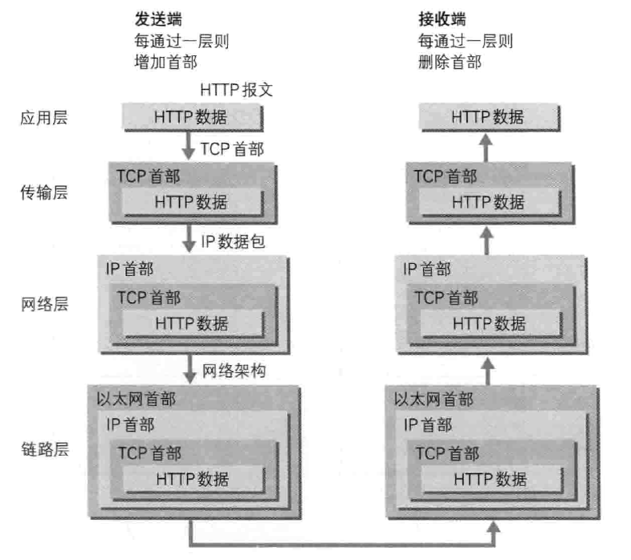

发送端在层与层之间传输数据时，每经过一层时必定会被打上一个该层所属的首部信息。反之，接收端在层与层传输数据时，每经过一层时会把对应的首部消去。

这种把数据信息包装起来的做法称为封装（encapsulate）。

## 与HTTP关系密切的协议：IP，TCP和DNS

下面我们分别针对在TCP/IP协议族中与HTTP密不可分的3个协议（IP，TCP和DNS）进行说明。

### 负责传输的IP协议

按层次分，IP（Internet Protocol）网际协议位于网络层。Internet Protocol这个名称可能听起来有点夸张，但事实正是如此，因为几乎所有使用网络的系统都会用到IP协议。TCPIP协议族中的IP指的就是网际协议，协议名称中占据了一半位置，其重要性可见一斑。可能有人会把"IP"和"IP地址”搞混，"IP"其实是一种协议的名称。

IP协议的作用是把各种数据包传送给对方。而要保证确实传送到对方那里，则需要满足各类条件。其中两个重要的条件是IP地址和MAC地址（Media Access Control Address）。

IP地址指明了节点被分配到的地址，MAC地址是指网卡所属的固定地址。IP地址可以和MAC地址进行配对。IP地址可变换，但MAC地址基本上不会更改。

**使用ARP协议凭借MAC地址进行通信**

IP间的通信依赖MAC地址。在网络上，通信的双方在同一局域网（LAN）内的情况是很少的，通常是经过多台计算机和网络设备中转才能连接到对方。而在进行中转时，会利用下一站中转设备的MAC地址来搜索下一个中转目标。这时，会采用ARP协议（Address Resolution Protocol），ARP是一种用以解析地址的协议，根据通信方的IP地址就可以反查出对应的MAC地址。

**没有人能够全面掌握互联网中的传输状况**

在到达通信目标前的中转过程中，那些计算机和路由器等网络设备只能获悉很粗略的传输路线。

这种机制称为路由选择（routing），有点像快递公司的送货过程。想要寄快递的人，只要将自己的货物送到集散中心，就可以知道快递公司是否肯收件发货，该快递公司的集散中心检查货物的送达地址，明确下站该送往哪个区域的集散中心。接着，那个区域的集散中心自会判断是否能送到对方的家中。

我们是想通过这个比喻说明，无论哪台计算机、哪台网络设备，它们都无法全面掌握互联网中的细节。

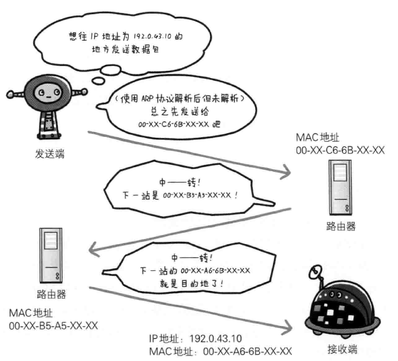

### 确保可靠性的TCP协议

按层次分，TCP位于传输层，提供可靠的字节流服务。

所谓的字节流服务（Byte Stream Service）是指，为了方便传输，将大块数据分割成以报文段（segment）为单位的数据包进行管理。而可靠的传输服务是指，能够把数据准确可靠地传给对方。一言以蔽之，TCP协议为了更容易传送大数据才把数据分割，而且TCP协议能够确认数据最终是否送达到对方。

**确保数据能到达目标**

为了准确无误地将数据送达目标处，TCP协议采用了三次握手three-way handshaking）策略。用TCP协议把数据包送出去后，TCP不会对传送后的情况置之不理，它一定会向对方确认是否成功送达。握手过程中使用了TCP的标志（flag）-SYN（synchronize）和ACK acknowledgement）。

发送端首先发送一个带SYN标志的数据包给对方。接收端收到后，回传一个带有SYN/ACK标志的数据包以示传达确认信息。最后，发送端再回传一个带ACK标志的数据包，代表“握手”结束。

若在握手过程中某个阶段莫名中断，TCP协议会再次以相同的顺序发送相同的数据包。

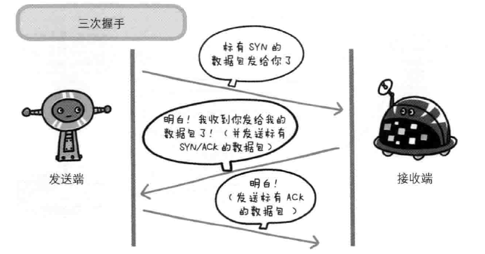

除了上述三次握手，TCP协议还有其他各种手段来保证通信的可靠性。

## 负责域名解析的DNS服务

DNS（Domain Name System）服务是和HTTP协议一样位于应用层的协议。它提供域名到IP地址之间的解析服务。

计算机既可以被赋予IP地址，也可以被赋予主机名和域名。比如www.hackr.jp。

用户通常使用主机名或域名来访问对方的计算机，而不是直接通过IP地址访问。因为与IP地址的一组纯数字相比，用字母配合数字的表示形式来指定计算机名更符合人类的记忆习惯。

但要让计算机去理解名称，相对而言就变得困难了。因为计算机更擅长处理一长串数字。

为了解决上述的问题，DNS服务应运而生。DNS协议提供通过域名查找IP地址，或逆向从IP地址反查域名的服务。

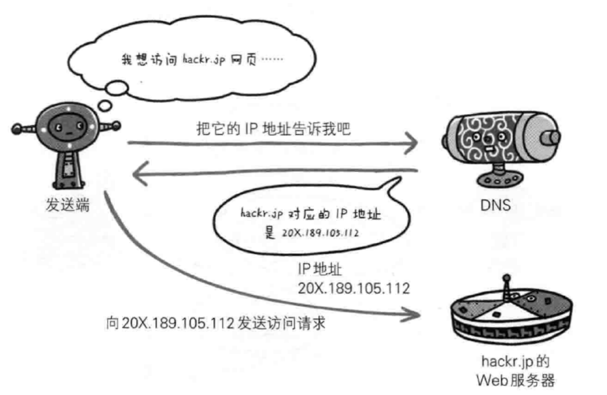

## 各种协议与HTTP协议的关系

学习了和HTTP协议密不可分的TCP/IP协议族中的各种协议后，我们再通过这张图来了解下IP协议、TCP协议和DNS服务在使用HTTP协议的通信过程中各自发挥了哪些作用。

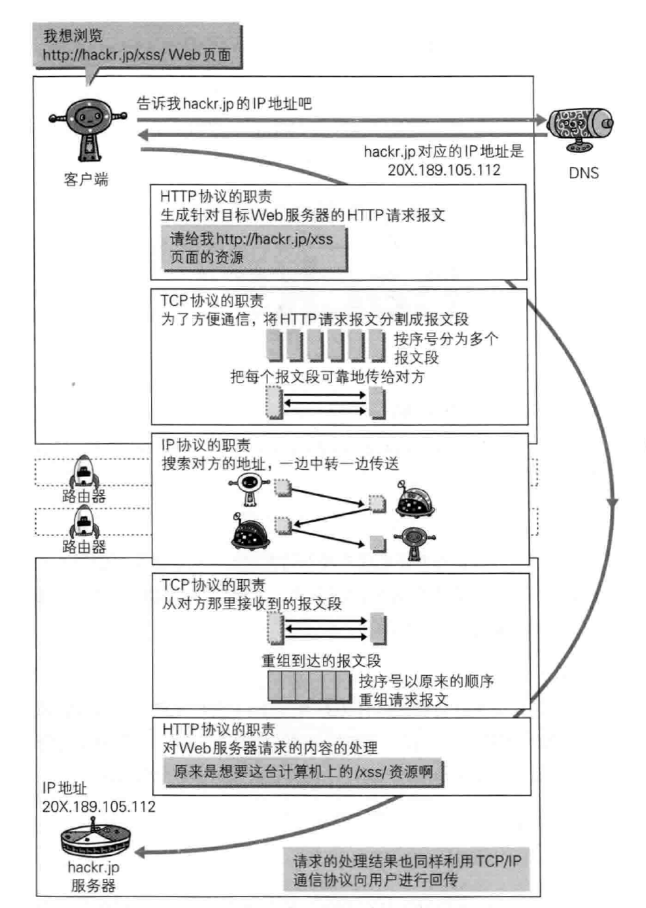

## URI和URL

与URI（统一资源标识符）相比，我们更熟悉URL（Uniform Resource Locator，统一资源定位符），URL正是使用Web浏览器等访问Web页面时需要输入的网页地址。比如，下图的http:/hack.jp/就是URL。

### 统一资源标识符

URI是Uniform Resource Identifier的缩写。RFC2396分别对这3个单词进行了如下定义。

**Uniform**

规定统一的格式可方便处理多种不同类型的资源，而不用根据上下文环境来识别资源指定的访问方式。另外，加入新增的协议方案（如http：或fp）也更容易。

**Resource**

资源的定义是“可标识的任何东西”。除了文档文件、图像或服务（例如当天的天气预报）等能够区别于其他类型的，全都可作为资源。另外，资源不仅可以是单一的，也可以是多数的集合体。

**Identifier**

表示可标识的对象。也称为标识符。

综上所述，URI就是由某个协议方案表示的资源的定位标识符。协议方案是指访问资源所使用的协议类型名称。

采用HTTP协议时，协议方案就是http。除此之外，还有ftp、mailto，telnet，file等。标准的URI协议方案有30种左右，由隶属于国际互联网资源管理的非营利社团ICANN（Internet Corporation for Assigned Names and Numbers，互联网名称与数字地址分配机构）的IANA（Internet Assigned Numbers Authority，互联网号码分配局）管理颁布。

URI用字符串标识某一互联网资源，而URL表示资源的地点（互联网上所处的位置），可见**URL是URI的子集**。

“RFC3986：统一资源标识符（URI）通用语法”中列举了几种URI例子，如下所示。

~~~http
ftp://ftp.is.co.za/rfc/rfc1808.txt 
http://www.ietf.org/rfc/rfc2396.txt
1dap:// [2001:db8::7]/c=GB?objectclass?one 
mailto:John. Doe@example. com 
news:comp.infosystems.www.servers.unix 
tel:+1-816-555-1212
telnet://192.0.2.16:80/
urn:oasis:names: specification: docbook: dtd:xml:4.1.2
~~~

本书接下来的章节中会频繁出现URI这个术语，在充分理解的基础上，也可用URL替换URI。

### URI格式

表示指定的URI，要使用涵盖全部必要信息的**绝对URI**、**绝对URL**以及**相对URL**。相对URL，是指从浏览器中基本URI处指定的URL，形如/imagellogo.gif。让我们先来了解一下绝对URI的格式。

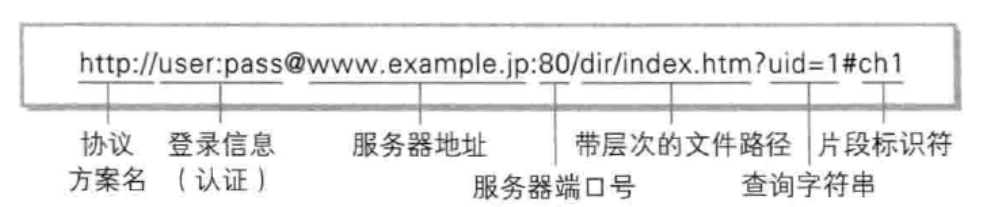

使用http：或https：等协议方案名获取访问资源时要指定协议类型。不区分字母大小写，最后附一个冒号(：)。

也可使用data：或javascript：这类指定数据或脚本程序的方案名。

**登录信息（认证）**
指定用户名和密码作为从服务器端获取资源时必要的登录信息（身份认证），此项是可选项。

**服务器地址**
使用绝对URI必须指定待访问的服务器地址。地址可以是类似hackrjp这种DNS可解析的名称，或是192.168.1.1这类IPv4地址名，还可以是[0：0：0：0：0：0：0：1]这样用方括号括起来的IPv6地址名。

**服务器端口号**
指定服务器连接的网络端口号。此项也是可选项，若用户省略则自动使用默认端口。

**带层次的文件路径**
指定服务器上的文件路径来定位特指的资源。这与UNIX系统的文件目录结构相似。

**查询字符串**
针对已指定的文件路径内的资源，可以使用查询字符串传入任意参数。此项可选。

**片段标识符**
使用片段标识符通常可标记出已获取资源中的子资源（文档内的某个位置）。但在RFC中并没有明确规定其使用方法。该项也为可选项。

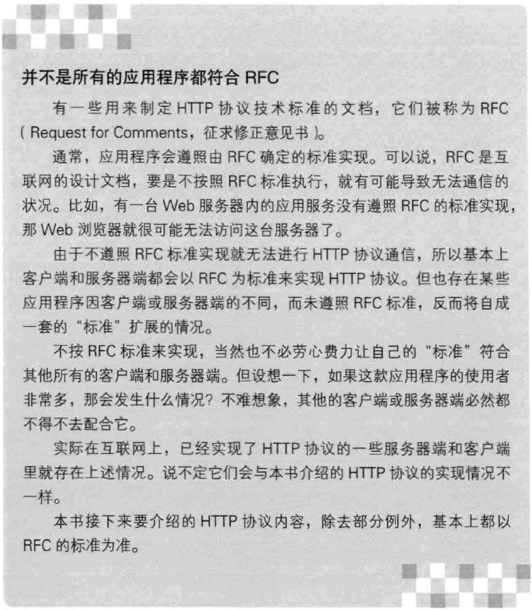

# 第2章：简单的HTTP协议

> 本章将针对HTTP协议结构进行讲解，主要使用HTTP/1.1版本。学完这章，想必大家就能理解HTTP协议的基础了。

## HTTP协议用于客户端和服务器端之间的通信

HTTP协议和TCPIP协议族内的其他众多的协议相同，用于客户端和服务器之间的通信。

请求访问文本或图像等资源的一端称为客户端，而提供资源响应的一端称为服务器端。

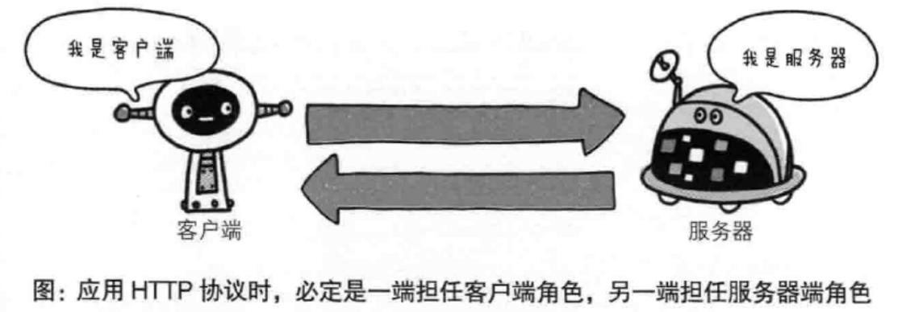

在两台计算机之间使用HTTP协议通信时，在一条通信线路上必定有一端是客户端，另一端则是服务器端。

有时候，按实际情况，两台计算机作为客户端和服务器端的角色有可能会互换。但就仅从一条通信路线来说，服务器端和客户端的角色是确定的，而用HTTP协议能够明确区分哪端是客户端，哪端是服务器端。

## 通过请求和响应的交换达成通信

HTTP协议规定，请求从客户端发出，最后服务器端响应该请求并返回。换句话说，肯定是先从客户端开始建立通信的，服务器端在没有接收到请求之前不会发送响应。

下面，我们来看一个具体的示例。

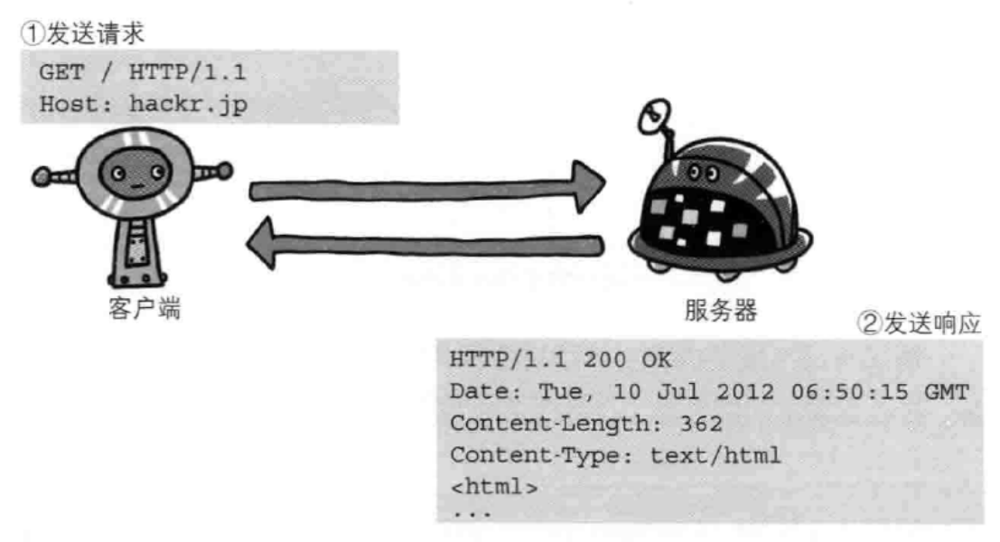

下面则是从客户端发送给某个HTTP服务器端的请求报文中的内容。

~~~javascript
GET /index.htm HTTP/1.1
Host: hackr.jp
~~~

起始行开头的GET表示请求访问服务器的类型，称为方法method），随后的字符串/index.htm指明了请求访问的资源对象，也叫做请求URI（request-URI），最后的HTTP/1.1，即HTTP的版本号，用来提示客户端使用的HTTP协议功能。

综合来看，这段请求内容的意思是：**请求访问某台HTTP服务器上的/index.htm页面资源**。

请求报文是由请求方法、请求URI、协议版本、可选的请求首部字段和内容实体构成的。

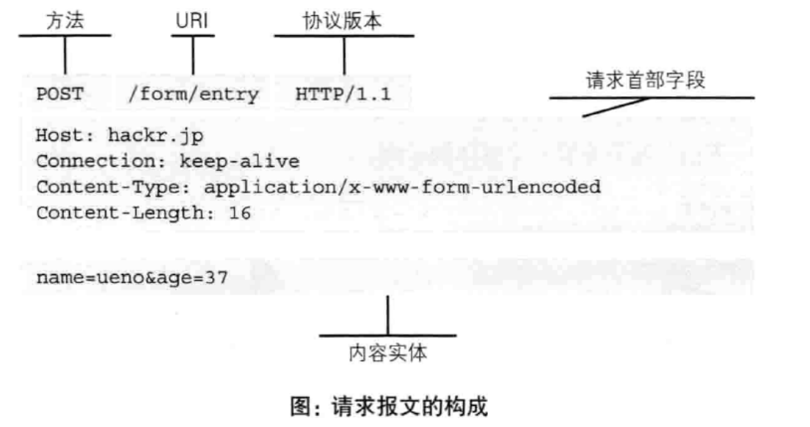

请求首部字段及内容实体稍后会作详细说明。接下来，我们继续讲解。接收到请求的服务器，会将请求内容的处理结果以响应的形式返回。

在起始行开头的HTTP/1.1表示服务器对应的HTTP版本。

紧挨着的200 OK表示请求的处理结果的状态码（status code）和原因短语（reason-phrase），下一行显示了创建响应的日期时间，是首部字段（header field）内的一个属性。

接着以一空行分隔，之后的内容称为资源实体的主体（entity body）。

响应报文基本上由协议版本、状态码（表示请求成功或失败的数字代码）、用以解释状态码的原因短语、可选的响应首部字段以及实体主体构成。稍后我们会对这些内容进行详细说明。

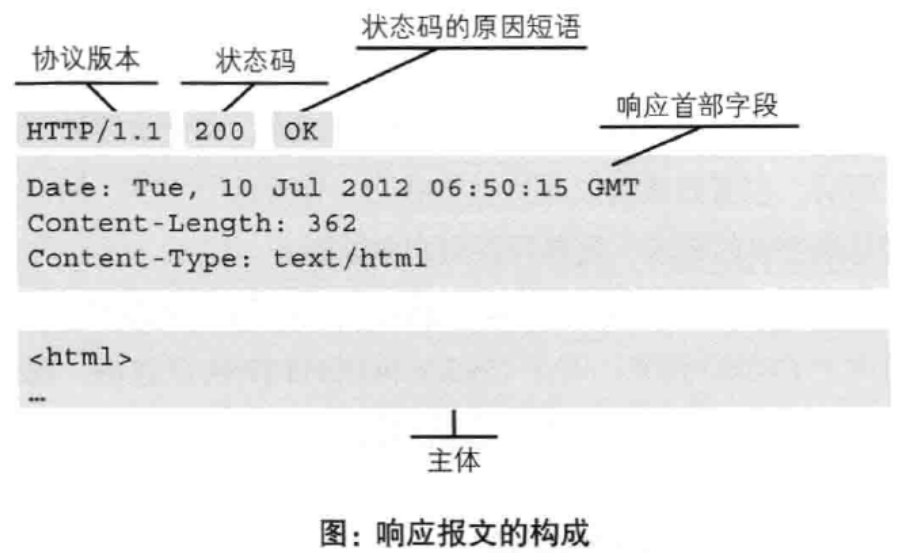

## HTTP是不保存状态的协议

HTTP是一种不保存状态，即无状态（stateless）协议.HTTP协议自身不对请求和响应之间的通信状态进行保存。也就是说在HTTP这个级别，协议对于发送过的请求或响应都不做持久化处理。

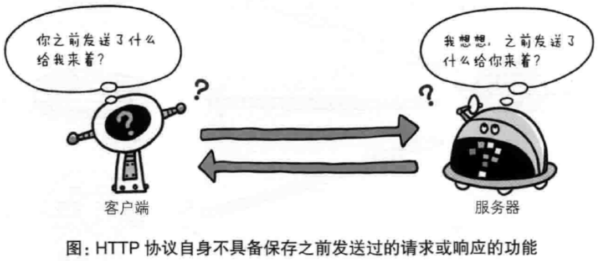

使用HTTP协议，每当有新的请求发送时，就会有对应的新响应产生。协议本身并不保留之前一切的请求或响应报文的信息。这是为了更快地处理大量事务，确保协议的可伸缩性，而特意把HTTP协议设计成如此简单的。

可是，随着Web的不断发展，因无状态而导致业务处理变得棘手的情况增多了。比如，用户登录到一家购物网站，即使他跳转到该站的其他页面后，也需要能继续保持登录状态。针对这个实例，网站为了能够掌握是谁送出的请求，需要保存用户的状态。

HTTP/1.1虽然是无状态协议，但为了实现期望的保持状态功能，于是引入了Cookie技术。有了Cookie再用HTTP协议通信，就可以管理状态了。有关Cookie的详细内容稍后讲解。

## 请求URI定位资源

HTTP协议使用URI定位互联网上的资源。正是因为URI的特定功能，在互联网上任意位置的资源都能访问到。

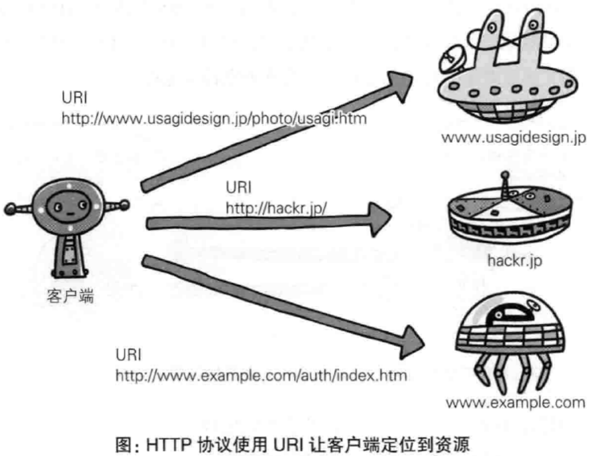

当客户端请求访问资源而发送请求时，URI需要将作为请求报文中的请求URI包含在内。指定请求URI的方式有很多。

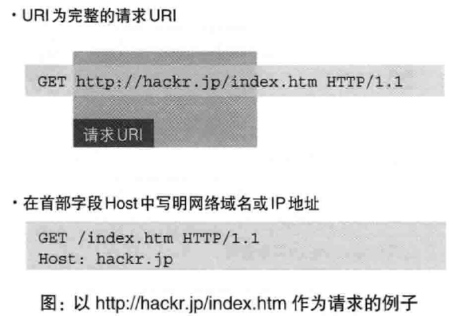

除此之外，如果不是访问特定资源而是对服务器本身发起请求，可以用一个*来代替请求URI。下面这个例子是查询HTTP服务器端支持的HTTP方法种类。

~~~javascript
OPTIONS * HTTP/1.1
~~~

## 告知服务器意图的HTTP方法

下面，我们介绍HTTP/1.1中可使用的方法。

### GET:获取资源

GET方法用来请求访问已被URI识别的资源。指定的资源经服务器端解析后返回响应内容。也就是说，如果请求的资源是文本，那就保持原样返回；如果是像CGI（Common Gateway Interface，通用网关接口）那样的程序，则返回经过执行后的输出结果。

### POST:传输实体主体

POST方法用来传输实体的主体。

虽然用GET方法也可以传输实体的主体，但一般不用GET方法进行传输，而用POST方法。虽说POST功能与GET很相似，但POST的主要目的并不是获取响应的主体内容。

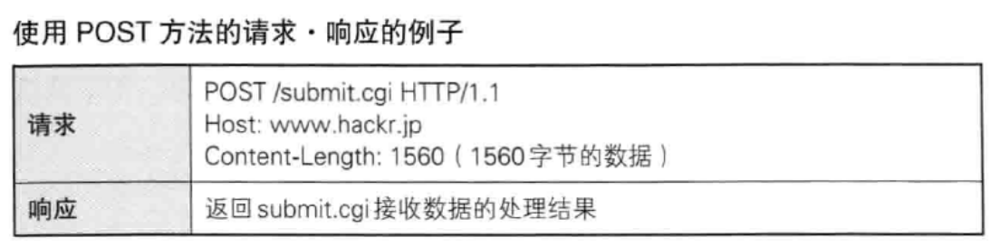

### PUT:传输文件

PUT方法用来传输文件。就像FTP协议的文件上传一样，要求在请求报文的主体中包含文件内容，然后保存到请求URI指定的位置。

但是，鉴于HTTP/1.1的PUT方法自身不带验证机制，任何人都可以上传文件，存在安全性问题，因此一般的Web网站不使用该方法。若配合Web应用程序的验证机制，或架构设计采用REST（REpresentational State Transfer，表征状态转移）标准的同类Web网站，就可能会开放使用PUT方法。

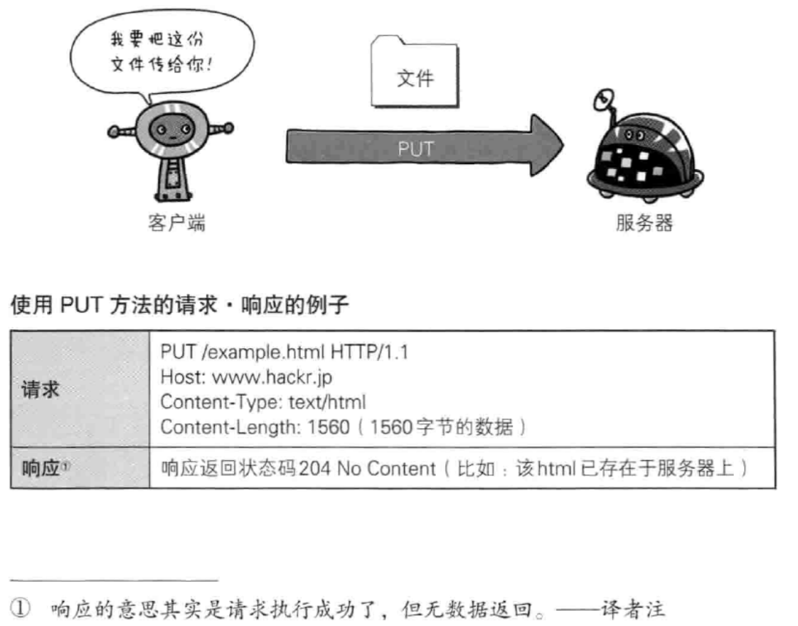

### HEAD:获得报文首部

HEAD方法和GET方法一样，只是不返回报文主体部分。用于确认URI的有效性及资源更新的日期时间等。

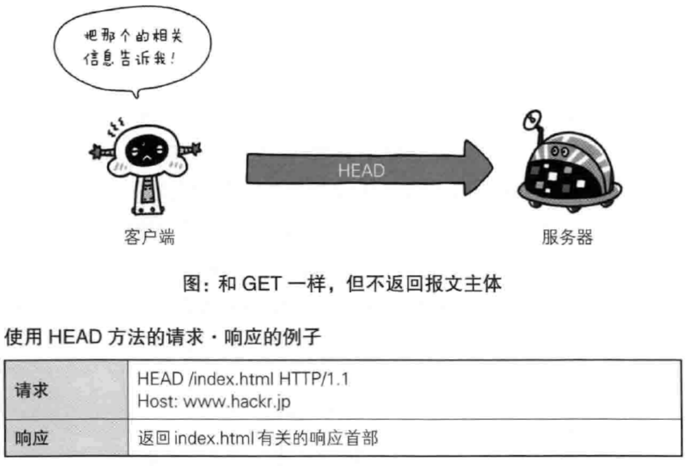

### DELETE:删除文件

DELETE方法用来删除文件，是与PUT相反的方法。DELETE方法按请求URI删除指定的资源。

但是，HTTP/.1的DELETE方法本身和PUT方法一样不带验证机制，所以一般的Web网站也不使用DELETE方法。当配合Web应用程序的验证机制，或遵守REST标准时还是有可能会开放使用的。

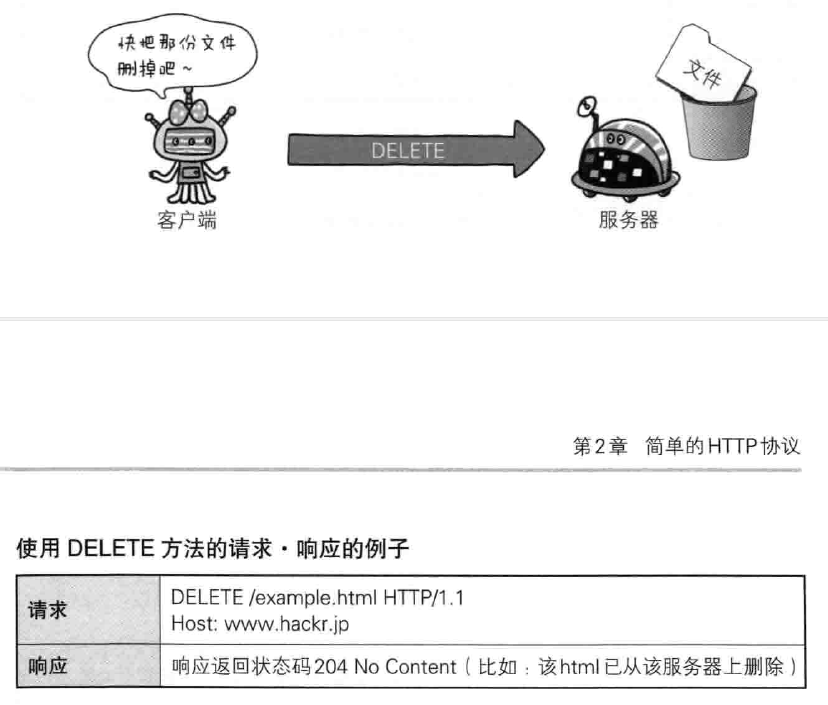

### OPTIONS:询问支持的方法

OPTIONS方法用来查询针对请求URI指定的资源支持的方法。

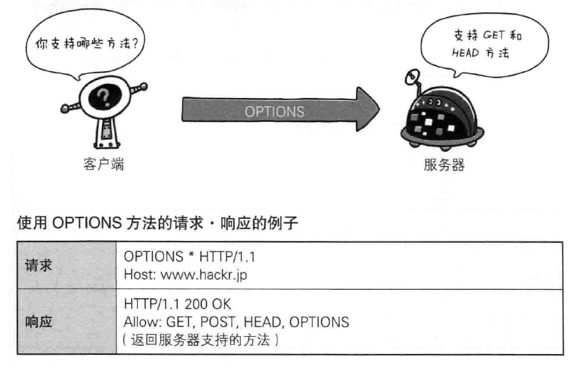

### TRACE：追踪路径

TRACE方法是让Web服务器端将之前的请求通信环回给客户端的方法。

发送请求时，在Max-Forwards首部字段中填入数值，每经过一个服务器端就将该数字减1，当数值刚好减到0时，就停止继续传输，最后接收到请求的服务器端则返回状态码200 OK的响应。

客户端通过TRACE方法可以查询发送出去的请求是怎样被加工修改/篡改的。这是因为，请求想要连接到源目标服务器可能会通过代理中转，TRACE方法就是用来确认连接过程中发生的一系列操作。

但是，TRACE方法本来就不怎么常用，再加上它容易引发XST（Cross-Site Tracing，跨站追踪）攻击，通常就更不会用到了。

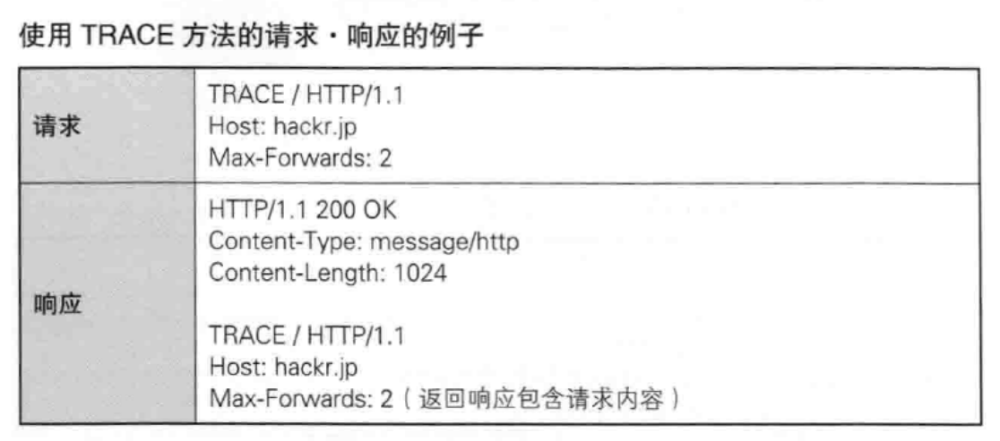

### CONNECT:要求用隧道协议连接代理

CONNECT方法要求在与代理服务器通信时建立隧道，实现用隧道协议进行TCP通信。主要使用SSL（Secure Sockets Layer，安全套接层）和TLS（Transport Layer Security，传输层安全）协议把通信内容加密后经网络隧道传输。

CONNECT方法的格式如下所示。

~~~http
CONNECT 理服务器名：端口号 HTTP版本
~~~

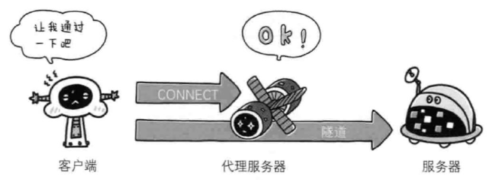

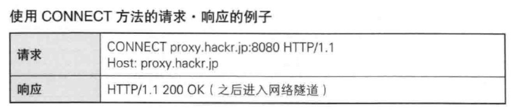

## 使用方法下达命令

向请求URI指定的资源发送请求报文时，采用称为方法的命令。

方法的作用在于，可以指定请求的资源按期望产生某种行为。方法中有GET，POST和HEAD等。

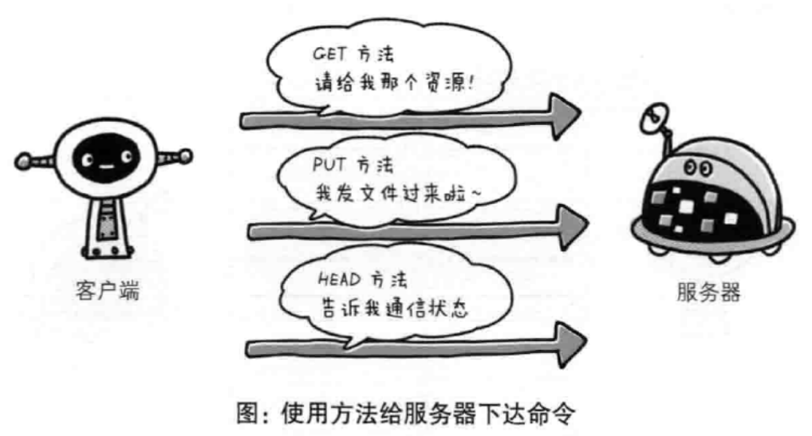

下表列出了HTTP/1.0和HTTP/.1支持的方法。另外，方法名区分大小写，注意要用大写字母。

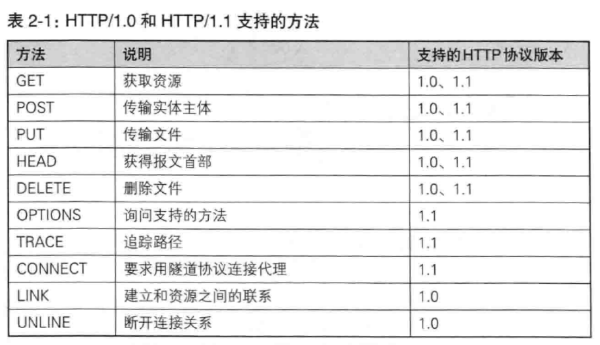

在这里列举的众多方法中，LINK和UNLINK已被HTTP/1.1废弃，不再支持。

## 持久连接节省通信量

HTTP协议的初始版本中，每进行一次HTTP通信就要断开一次TCP连接。

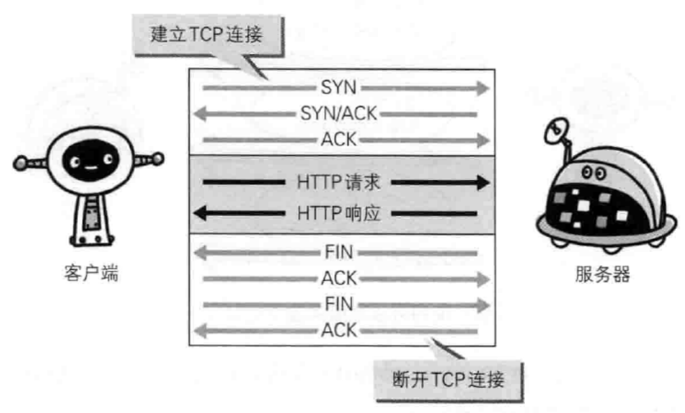

以当年的通信情况来说，因为都是些容量很小的文本传输，所以即使这样也没有多大问题。可随着HTTP的普及，文档中包含大量图片的情况多了起来。

比如，使用浏览器浏览一个包含多张图片的HTML页面时，在发送请求访问HTML页面资源的同时，也会请求该HTML页面里包含的其他资源。因此，每次的请求都会造成无谓的TCP连接建立和断开，增加通信量的开销。

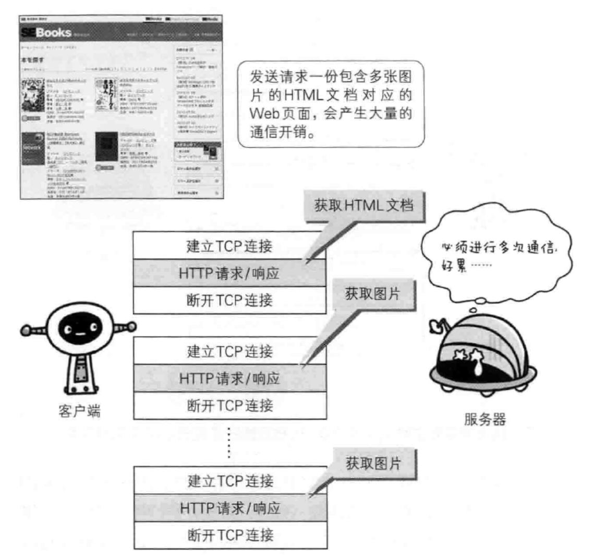

### 持久连接

为解决上述TCP连接的问题，HTTP/1.1和一部分的HTTP/1.0想出了持久连接（HTTP Persistent Connections，也称为HTTP keep-alive或HTTP connection reuse）的方法。持久连接的特点是，只要任意一端没有明确提出断开连接，则保持TCP连接状态。

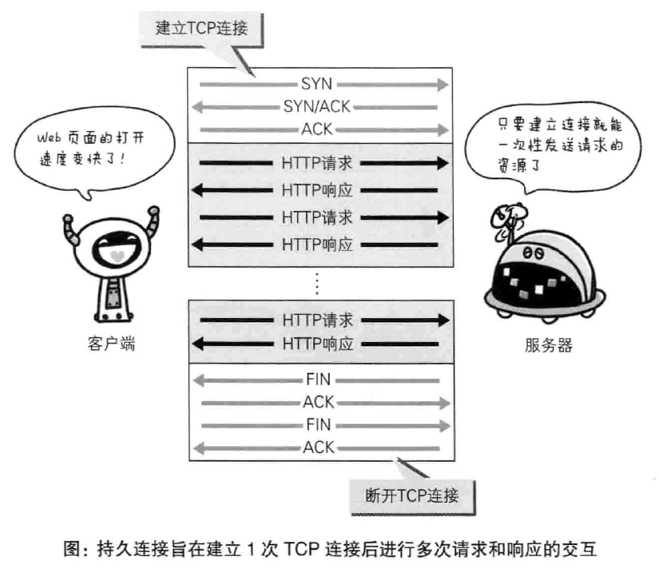

持久连接的好处在于减少了TCP连接的重复建立和断开所造成的额外开销，减轻了服务器端的负载。另外，减少开销的那部分时间，使HTTP请求和响应能够更早地结束，这样Web页面的显示速度也就相应提高了。

在HTTP/.1中，所有的连接默认都是持久连接，但在HTTP/.0内并未标准化。虽然有一部分服务器通过非标准的手段实现了持久连接，但服务器端不一定能够支持持久连接。毫无疑问，除了服务器端，客户端也需要支持持久连接。

### 管线化

持久连接使得多数请求以管线化（pipelining）方式发送成为可能。

从前发送请求后需等待并收到响应，才能发送下一个请求。管线化技术出现后，不用等待响应亦可直接发送下一个请求。

这样就能够做到同时并行发送多个请求，而不需要一个接一个地等待响应了。

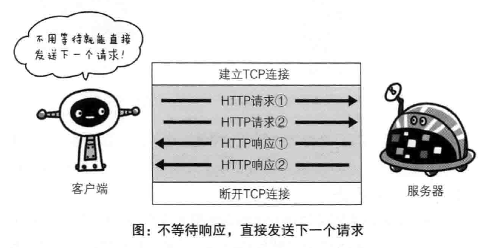

比如，当请求一个包含10张图片的HTML Web页面，与挨个连接相比，用持久连接可以让请求更快结束。而管线化技术则比持久连接还要快。请求数越多，时间差就越明显。

## 使用Cookie的状态管理

HTTP是无状态协议，它不对之前发生过的请求和响应的状态进行管理。也就是说，无法根据之前的状态进行本次的请求处理。

假设要求登录认证的Web页面本身无法进行状态的管理（不记录已登录的状态），那么每次跳转新页面不是要再次登录，就是要在每次请求报文中附加参数来管理登录状态。

不可否认，无状态协议当然也有它的优点。由于不必保存状态，自然可减少服务器的CPU及内存资源的消耗。从另一侧面来说，也正是因为HTTP协议本身是非常简单的，所以才会被应用在各种场景里。

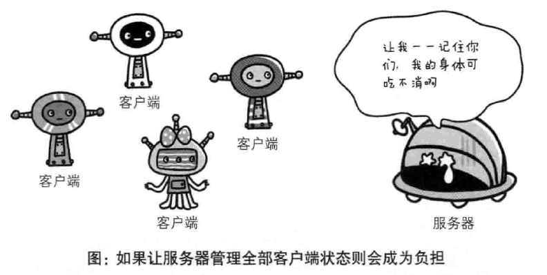

保留无状态协议这个特征的同时又要解决类似的矛盾问题，于是引入了Cookie技术。Cookie技术通过在请求和响应报文中写入Cookie信息来控制客户端的状态。

Cookie会根据从服务器端发送的响应报文内的一个叫做Set-Cookie的首部字段信息，通知客户端保存Cookie，当下次客户端再往该服务器发送请求时，客户端会自动在请求报文中加入Cookie值后发送出去。

服务器端发现客户端发送过来的Cookie后，会去检查究竟是从哪一个客户端发来的连接请求，然后对比服务器上的记录，最后得到之前的状态信息。

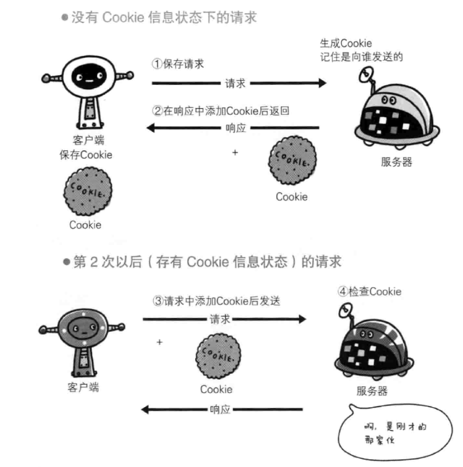

上图展示了发生Cookie交互的情景，HTTP请求报文和响应报文的内容如下。

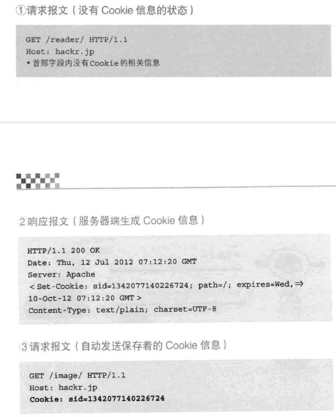

有关请求报文和响应报文内Cookie对应的首部字段，请参考之后的章节。

# 第3章：HTTP报文内的HTTP信息

> HTTP通信过程包括从客户端发往服务器端的请求及从服务器端返回客户端的响应。本章就让我们来了解一下请求和响应是怎样运作的。

## HTTP报文

用于HTTP协议交互的信息被称为HTTP报文。请求端（客户端）的HTTP报文叫做请求报文，响应端（服务器端）的叫做响应报文.HTTP报文本身是由多行（用CR+LF作换行符）数据构成的字符串文本。

HTTP报文大致可分为报文首部和报文主体两块。两者由最初出现的空行（CR-LF）来划分。通常，并不一定要有报文主体。

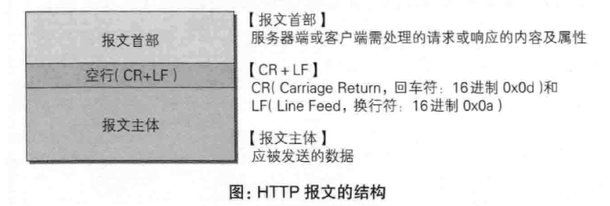

## 请求报文及响应报文的结构

我们来看一下请求报文和响应报文的结构。

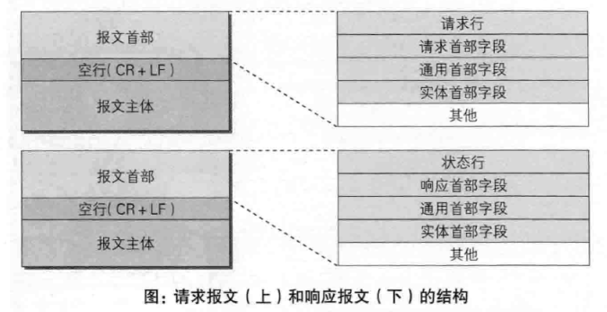

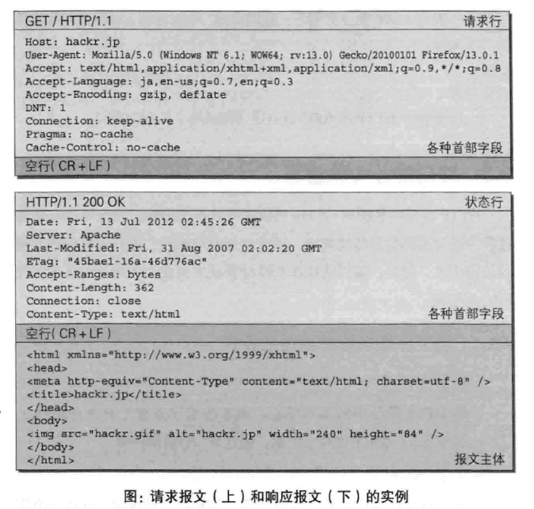

请求报文和响应报文的首部内容由以下数据组成。现在出现的各种首部字段及状态码稍后会进行阐述。

* **请求行**

  包含用于请求的方法，请求URI和HTTP版本。

* **状态行**
  包含表明响应结果的状态码，原因短语和HTTP版本。

* **首部字段**
  包含表示请求和响应的各种条件和属性的各类首部。

  一般有4种首部，分别是：**通用首部、请求首部、响应首部和实体首部**。

* 其他

  可能包含HTTP的RFC里未定义的首部（Cookie等）。

## 编码提升传输速率

HTTP在传输数据时可以按照数据原貌直接传输，但也可以在传输过程中通过编码提升传输速率。通过在传输时编码，能有效地处理大量的访问请求。但是，编码的操作需要计算机来完成，因此会消耗更多的CPU等资源。

### 报文主体和实体主体的差异

[HTTP报文主体和实体主体的区别是什么？](https://www.zhihu.com/question/266296246)

* **报文（message）**
  是HTTP通信中的基本单位，由8位组字节流（octet sequence，其中octet为8个比特）组成，通过HTTP通信传输。
* **实体（entity）**
  作为请求或响应的有效载荷数据（补充项）被传输，其内容由实体首部和实体主体组成。

HTTP报文的主体用于**传输请求或响应**的实体主体。

通常，报文主体等于实体主体。只有当传输中进行编码操作时，实体主体的内容发生变化，才导致它和报文主体产生差异。

报文和实体这两个术语在之后会经常出现，请事先理解两者的差异。

### 压缩传输的内容编码

向待发送邮件内增加附件时，为了使邮件容量变小，我们会先用ZIP压缩文件之后再添加附件发送。HTTP协议中有一种被称为内容编码的功能也能进行类似的操作。

内容编码指明应用在实体内容上的编码格式，并保持实体信息原样压缩。内容编码后的实体由客户端接收并负责解码。

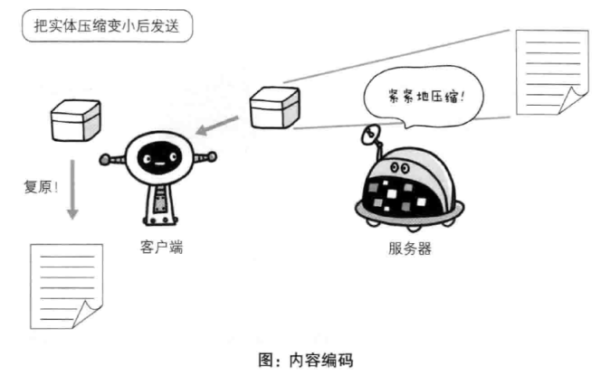

常用的内容编码有以下几种。

* gzip（GNU zip）
* compress（UNIX系统的标准压缩）
* deflate（zlib）
* identity（不进行编码）

### 分割发送的分块传输编码

在HTTP通信过程中，请求的编码实体资源尚未全部传输完成之前，浏览器无法显示请求页面。在传输大容量数据时，通过把数据分割成多块，能够让浏览器逐步显示页面。

这种把实体主体分块的功能称为**分块传输编码**（Chunked Transfer Coding）

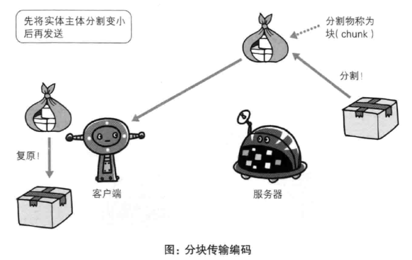

分块传输编码会将实体主体分成多个部分（块），每一块都会用十六进制来标记块的大小，而实体主体的最后一块会使用"0(CR-LF)"来标记。

使用分块传输编码的实体主体会由接收的客户端负责解码，恢复到编码前的实体主体。

HTTP/1.1中存在一种称为传输编码（Transfer Coding）的机制，它可以在通信时按某种编码方式传输，但只定义作用于分块传输编码中。

## 发送多种数据的多部分对象集合

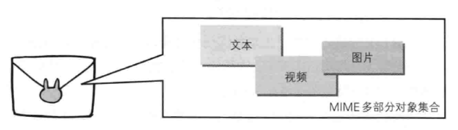

发送邮件时，我们可以在邮件里写人文字并添加多份附件。这是因为采用了MIME（Multipurpose Internet Mail Extensions，多用途因特网邮件扩展）机制，它允许邮件处理文本、图片、视频等多个不同类型的数据。例如，图片等二进制数据以ASCI1码字符串编码的方式指明，就是利用MIME来描述标记数据类型。而在MIME扩展中会使用一种称为多部分对象集合（Multipart）的方法，来容纳多份不同类型的数据。

相应地，HTTP协议中也采纳了多部分对象集合，发送的一份报文主体内可含有多类型实体。通常是在图片或文本文件等上传时使用。

多部分对象集合包含的对象如下。

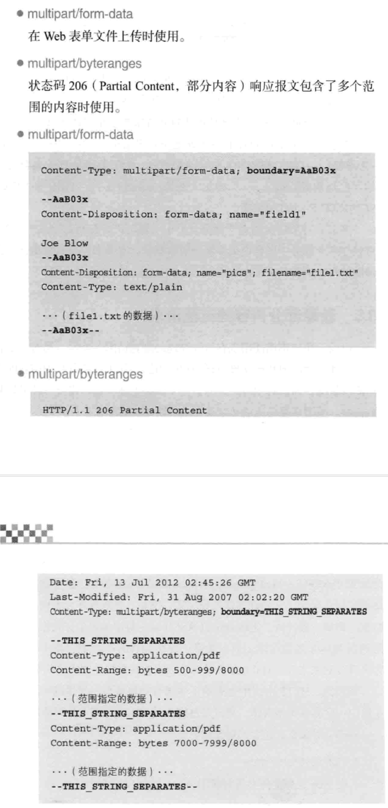

在HTTP报文中使用多部分对象集合时，需要在首部字段里加上Content-type。有关这个首部字段，我们稍后讲解。

使用boundary字符串来划分多部分对象集合指明的各类实体。在boundary字符串指定的各个实体的起始行之前插入“--”标记（例如：--AaB03x，--THIS STRINGSEPARATES），而在多部分对象集合对应的字符串的最后插入“-”标记（例如：--AaBO3x-THIS STRING SEPARATES--）作为结束。

多部分对象集合的每个部分类型中，都可以含有首部字段。另外，可以在某个部分中嵌套使用多部分对象集合。有关多部分对象集合更详细的解释，请参考RFC2046。

## 获取部分内容的范围请求

以前，用户不能使用现在这种高速的带宽访问互联网，当时，下载一个尺寸稍大的图片或文件就已经很吃力了。如果下载过程中遇到网络中断的情况，那就必须重头开始。为了解决上述问题，需要一种可恢复的机制。所谓恢复是指能从之前下载中断处恢复下载。

要实现该功能需要指定下载的实体范围。像这样，指定范围发送的请求叫做范围请求（Range Request）。

对一份10000字节大小的资源，如果使用范围请求，可以只请求5001-10000字节内的资源。

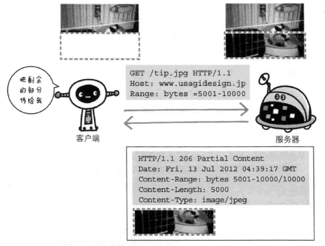

执行范围请求时，会用到首部字段Range来指定资源的byte范围。byte范围的指定形式如下。

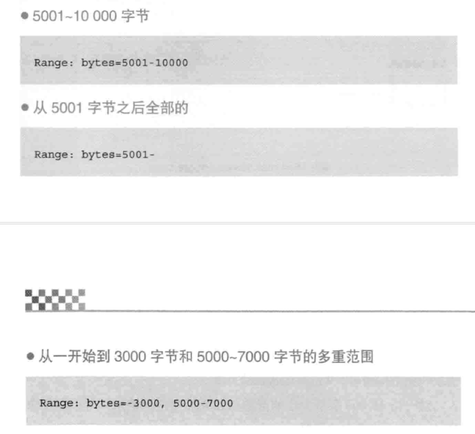

针对范围请求，响应会返回状态码为206 Partial Content的响应报文。另外，对于多重范围的范围请求，响应会在首部字段Content-Type标明multipartbyteranges后返回响应报文。

如果服务器端无法响应范围请求，则会返回状态码200 OK和完整的实体内容。

## 内容协商返回最合适的内容

同一个Web网站有可能存在着多份相同内容的页面。比如英语版和中文版的Web页面，它们内容上虽相同，但使用的语言却不同。

当浏览器的默认语言为英语或中文，访问相同URI的Web页面时，则会显示对应的英语版或中文版的Web页面。这样的机制称为内容协商（Content Negotiation）。

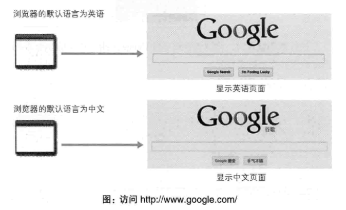

内容协商机制是指客户端和服务器端就响应的资源内容进行交涉，然后提供给客户端最为适合的资源。内容协商会以响应资源的语言、字符集、编码方式等作为判断的基准。

包含在请求报文中的某些首部字段（如下）就是判断的基准。这些首部字段的详细说明请参考下一章。

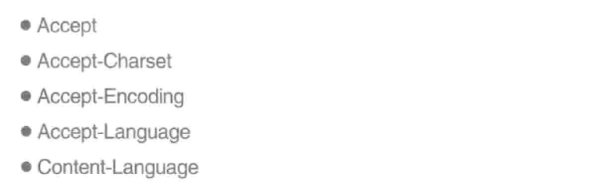

内容协商技术有以下3种类型。

**服务器驱动协商（Server-driven Negotiation）**
由服务器端进行内容协商。以请求的首部字段为参考，在服务器端自动处理。但对用户来说，以浏览器发送的信息作为判定的依据，并不一定能筛选出最优内容。

**客户端驱动协商（Agent-driven Negotiation）**
由客户端进行内容协商的方式。用户从浏览器显示的可选项列表中手动选择。还可以利用JavaScript脚本在Web页面上自动进行上述选择。比如按OS的类型或浏览器类型，自行切换成PC版页面或手机版页面。

**透明协商（Transparent Negotiation）**

是服务器驱动和客户端驱动的结合体，是由服务器端和客户端各自进行内容协商的一种方法。

# 第4章：返回结果的HTTP状态码

> HTTP状态码负责表示客户端HTTP请求的返回结果、标记服务器端的处理是否正常、通知出现的错误等工作。让我们通过本章的学习，好好了解一下状态码的工作机制。

## 状态码告知从服务器端返回的请求结果

状态码的职责是当客户端向服务器端发送请求时，描述返回的请求结果。借助状态码，用户可以知道服务器端是正常处理了请求，还是出现了错误。

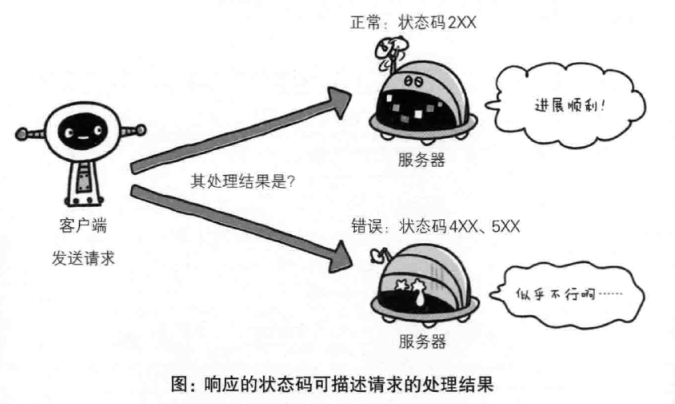

状态码如200 OK，以3位数字和原因短语组成。
数字中的**第一位指定了响应类别**，后两位无分类。响应类别有以下5种。

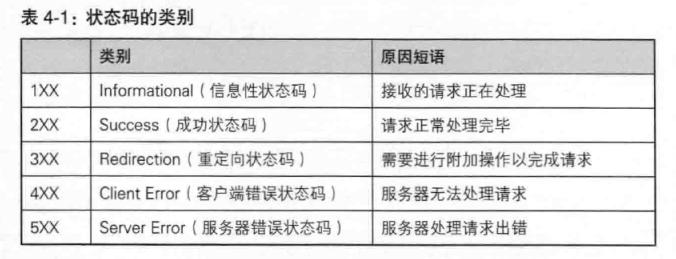

只要遵守状态码类别的定义，即使改变RFC2616中定义的状态码，或服务器端自行创建状态码都没问题。

仅记录在RFC2616上的HTTP状态码就达40种，若再加上WebDAV（Web-based Distributed Authoring and Versioning，基于万维网的分布式创作和版本控制）（RFC4918，5842）和附加HTTP状态码
（RFC6585）等扩展，数量就达60余种。别看种类繁多，实际上经常使用的大概只有14种。接下来，我们就介绍一下这些具有代表性的14个状态码。

## 2XX成功

2XX的响应结果表明请求被正常处理了。

### 200 OK

表示从客户端发来的请求在服务器端被正常处理了。

在响应报文内，随状态码一起返回的信息会因方法的不同而发生改变。比如，使用GET方法时，对应请求资源的实体会作为响应返回；而使用HEAD方法时，对应请求资源的实体首部不随报文主体作为响应返回（即在响应中只返回首部，不会返回实体的主体部分）。

### 204 NO Content

该状态码代表服务器接收的请求已成功处理，但在返回的响应报文中不含实体的主体部分。另外，也不允许返回任何实体的主体。比如，当从浏览器发出请求处理后，返回204响应，那么浏览器显示的页面不发生更新。

一般在只需要从客户端往服务器发送信息，而对客户端不需要发送新信息内容的情况下使用。

### 206 Partial Content

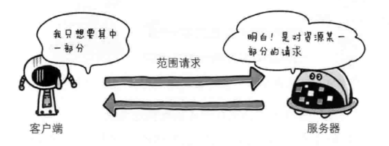

该状态码表示客户端进行了范围请求，而服务器成功执行了这部分的GET请求。响应报文中包含由Content-Range指定范围的实体内容。

## 3XX重定向

> 学习Node的时候用到了3XX重定向状态码(302)

3XX响应结果表明浏览器需要执行某些特殊的处理以正确处理请求。

### 301 Moved Permanently

永久性重定向。该状态码表示请求的资源已被分配了新的URI，以后应使用资源现在所指的URI。也就是说，如果已经把资源对应的URI保存为书签了，这时应该按Location首部字段提示的URI重新保存。

像下方给出的请求URI，当指定资源路径的最后忘记添加斜杠“/"，就会产生301状态码。

~~~html
http://example.com/sample
~~~

### 302 Found

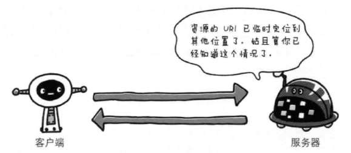

临时性重定向。该状态码表示请求的资源已被分配了新的URI，希望用户（本次）能使用新的URI访问。

和301 Moved Permanently状态码相似，但302状态码代表的资源不是被永久移动，只是临时性质的。换句话说，已移动的资源对应的URI将来还有可能发生改变。比如，用户把URI保存成书签，但不会像301状态码出现时那样去更新书签，而是仍旧保留返回302状态码的页面对应的URI。

### 303 See Ohter

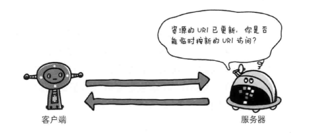

该状态码表示由于请求对应的资源存在着另一个URI，应使用GET方法定向获取请求的资源。

303状态码和302 Found状态码有着相同的功能，但303状态码明确表示客户端应当采用GET方法获取资源，这点与302状态码有区别。

比如，当使用POST方法访问CGI程序，其执行后的处理结果希望客户端能以GET方法重定向到另一个URI上去时，返回303状态码。

虽然302 Found状态码也可以实现相同的功能，但这里使用303状态码是最理想的。

> 本书采用的是HTTP1/.1，而许多HTTP/1.1版以前的浏览器不能正确理解303状态码。虽然RFC 1945和RFC 2068规范不允许客户端在重定向时改变请求的方法，但是很多现存的浏览器将302响应视为303响应，并且使用GET方式访问在Location中规定的URI，而无视原先请求的方法。所以作者说这里使用303是最理想的。——译者注

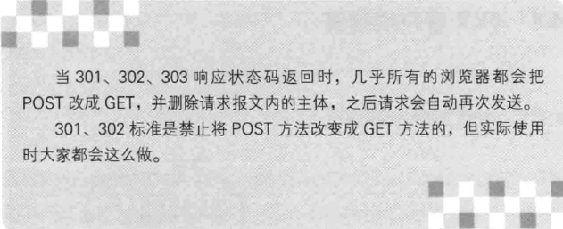

### 304 Not Modified

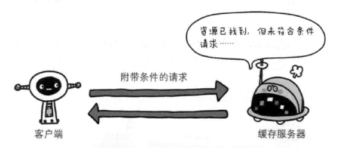

该状态码表示客户端发送附带条件的请求"时，服务器端允许请求访问资源，但未满足条件的情况。304状态码返回时，不包含任何响应的主体部分。304虽然被划分在3XX类别中，但是和重定向没有关系。

> 附带条件的请求是指采用GET方法的请求报文中包含I-Match，If-Modified-Since，If-None-Match，If-Range，If-Unmodified-Since中任一首部。

### 307 Temporary Redirect

临时重定向。该状态码与302 Found有着相同的含义。尽管302标准禁止POST变换成GET，但实际使用时大家并不遵守。

307会遵照浏览器标准，不会从POST变成GET，但是，对于处理响应时的行为，每种浏览器有可能出现不同的情况。

## 4XX客户端错误

4XX的响应结果表明客户端是发生错误的原因所在。

### 400 Bad Request

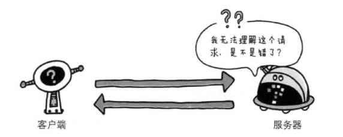

该状态码表示请求报文中存在语法错误。当错误发生时，需修改请求的内容后再次发送请求。另外，浏览器会像200 0K一样对待该状态码。

### 401 Unauthorized

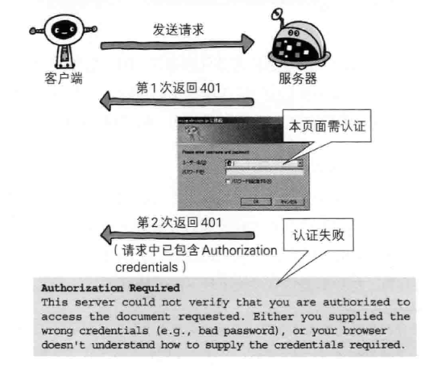

该状态码表示发送的请求需要有通过HTTP认证（BASIC认证、DIGEST认证）的认证信息。另外若之前已进行过1次请求，则表示用户认证失败。

返回含有401的响应必须包含一个适用于被请求资源的www.Authenticate首部用以质询（challenge）用户信息。当浏览器初次接收到401响应，会弹出认证用的对话窗口。

### 403 Forbidden

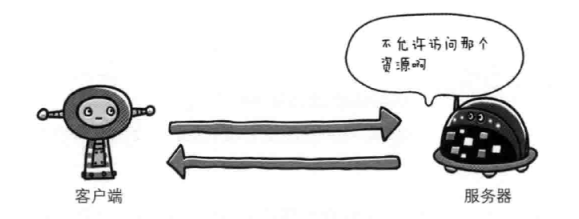

该状态码表明对请求资源的访问被服务器拒绝了。服务器端没有必要给出拒绝的详细理由，但如果想作说明的话，可以在实体的主体部分对原因进行描述，这样就能让用户看到了。

未获得文件系统的访问授权，访问权限出现某些问题（从未授权的发送源IP地址试图访问）等列举的情况都可能是发生403的原因。

### 404 Not Found

该状态码表明服务器上无法找到请求的资源。除此之外，也可以在服务器端拒绝请求且不想说明理由时使用。

## 5XX服务器错误

5XX的响应结果表明服务器本身发生错误。

### 500 Internal Server Error

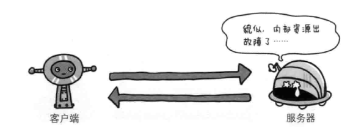

该状态码表明服务器端在执行请求时发生了错误。也有可能是Web应用存在的bug或某些临时的故障。

### 503 Service Unavailable

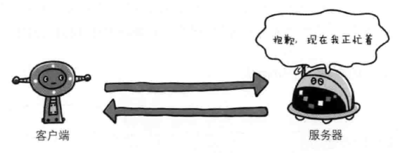

该状态码表明服务器暂时处于超负载或正在进行停机维护，现在无法处理请求。如果事先得知解除以上状况需要的时间，最好写入Retry—After首部字段再返回给客户端。

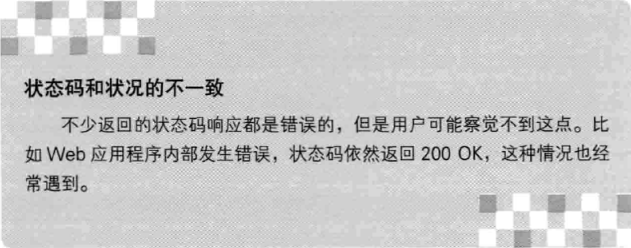

# 第5章：与HTTP协作的Web服务器

> 一台Web服务器可搭建多个独立域名的Web网站，也可作为通信路径上的中转服务器提升传输效率。

## 用单台虚拟主机实现多个域名

HTTP/1.1规范允许一台HTTP服务器搭建多个Web站点。比如，提供Web托管服务（Web Hosting Service）的供应商，可以用一台服务器为多位客户服务，也可以以每位客户持有的域名运行各自不同的网站。
这是因为利用了虚拟主机（Virtual Host，又称虚拟服务器）的功能。

即使物理层面只有一台服务器，但只要使用虚拟主机的功能，则可以假想已具有多台服务器。

客户端使用HTTP协议访问服务器时，会经常采用类似www.hackr.jp这样的主机名和域名。

在互联网上，域名通过DNS服务映射到IP地址（域名解析）之后访问目标网站。可见，当请求发送到服务器时，已经是以IP地址形式访问了。

所以，如果一台服务器内托管了www.tricorder.jp和www.hackr.jp这两个域名，当收到请求时就需要弄清楚究竟要访问哪个域名。

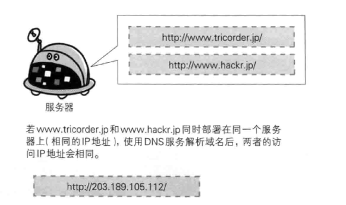

在相同的IP地址下，由于虚拟主机可以寄存多个不同主机名和域名的Web网站，因此在发送HTTP请求时，必须在Host首部内完整指定主机名或域名的URI。

## 通信数据转发程序：代理、网关、隧道

HTTP通信时，除客户端和服务器以外，还有一些用于通信数据转发的应用程序，例如代理、网关和隧道。它们可以配合服务器工作。这些应用程序和服务器可以将请求转发给通信线路上的下一站服务器，并且能接收从那台服务器发送的响应再转发给客户端。

**代理**

代理是一种有转发功能的应用程序，它扮演了位于服务器和客户端“中间人”的角色，接收由客户端发送的请求并转发给服务器，同时也接收服务器返回的响应并转发给客户端。

**网关**

网关是转发其他服务器通信数据的服务器，接收从客户端发送来的请求时，它就像自己拥有资源的源服务器一样对请求进行处理。有时客户端可能都不会察觉，自己的通信目标是一个网关。

**隧道**

隧道是在相隔甚远的客户端和服务器两者之间进行中转，并保持双方通信连接的应用程序。

### 代理

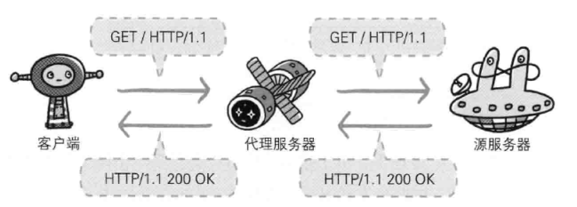

代理服务器的基本行为就是接收客户端发送的请求后转发给其他服务器。代理不改变请求URI，会直接发送给前方持有资源的目标服务器。

持有资源实体的服务器被称为源服务器。从源服务器返回的响应经过代理服务器后再传给客户端。

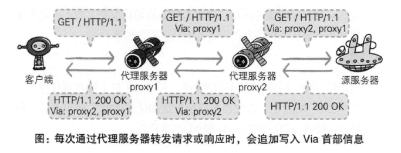

在HTTP通信过程中，可级联多台代理服务器。请求和响应的转发会经过数台类似锁链一样连接起来的代理服务器。转发时，需要附加Via首部字段以标记出经过的主机信息。

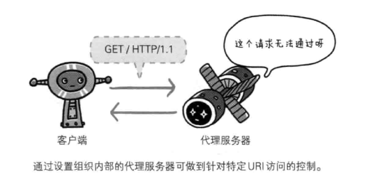

使用代理服务器的理由有：利用缓存技术（稍后讲解）减少网络带宽的流量，组织内部针对特定网站的访问控制，以获取访问日志为主要目的，等等。

代理有多种使用方法，按两种基准分类。一种是是否使用缓存，另一种是是否会修改报文。

**缓存代理**
代理转发响应时，缓存代理（Caching Proxy）会预先将资源的副本（缓存）保存在代理服务器上。

当代理再次接收到对相同资源的请求时，就可以不从源服务器那里获取资源，而是将之前缓存的资源作为响应返回。

**透明代理**
转发请求或响应时，不对报文做任何加工的代理类型被称为透明代理（Transparent Proxy）。反之，对报文内容进行加工的代理被称为非透明代理。

### 网关

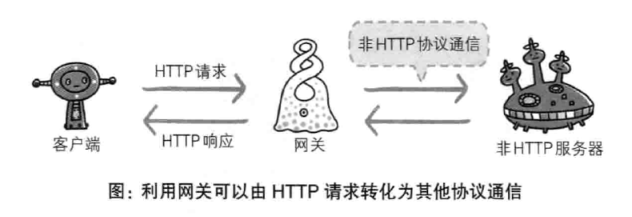

网关的工作机制和代理十分相似。而网关能使通信线路上的服务器提供非HTTP协议服务。

利用网关能提高通信的安全性，因为可以在客户端与网关之间的通信线路上加密以确保连接的安全。比如，网关可以连接数据库，使用SQL语句查询数据。另外，在Web购物网站上进行信用卡结算时，网关可以和信用卡结算系统联动。

### 隧道

隧道可按要求建立起一条与其他服务器的通信线路，届时使用SSL等加密手段进行通信。隧道的目的是确保客户端能与服务器进行安全的通信。

隧道本身不会去解析HTTP请求。也就是说，请求保持原样中转给之后的服务器。隧道会在通信双方断开连接时结束。

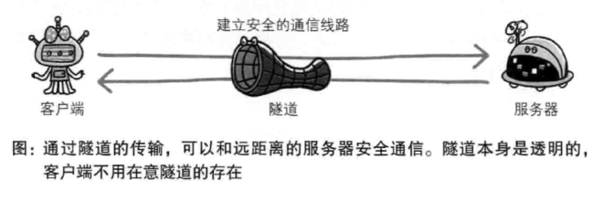

## 保存资源的缓存

缓存是指代理服务器或客户端本地磁盘内保存的资源副本。利用缓存可减少对源服务器的访问，因此也就节省了通信流量和通信时间。缓存服务器是代理服务器的一种，并归类在缓存代理类型中。换句话说，当代理转发从服务器返回的响应时，代理服务器将会保存一份资源的副本。

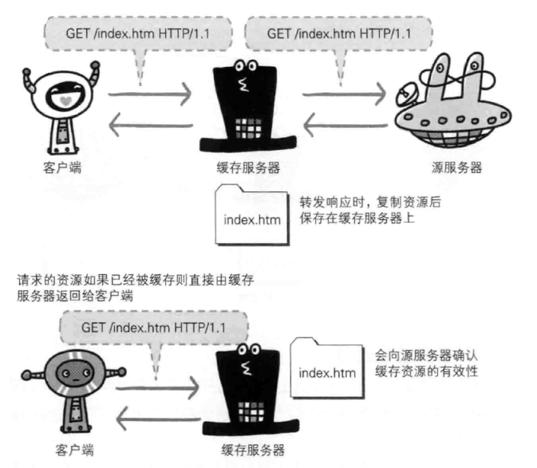

缓存服务器的优势在于利用缓存可避免多次从源服务器转发资源。

因此客户端可就近从缓存服务器上获取资源，而源服务器也不必多次处理相同的请求了。

### 缓存的有效期限

即便缓存服务器内有缓存，也不能保证每次都会返回对同资源的请求。因为这关系到被缓存资源的有效性问题。

当遇上源服务器上的资源更新时，如果还是使用不变的缓存，那就会演变成返回更新前的“旧"资源了。

即使存在缓存，也会因为客户端的要求、缓存的有效期等因素，向源服务器确认资源的有效性。若判断缓存失效，缓存服务器将会再次从源服务器上获取“新"资源。

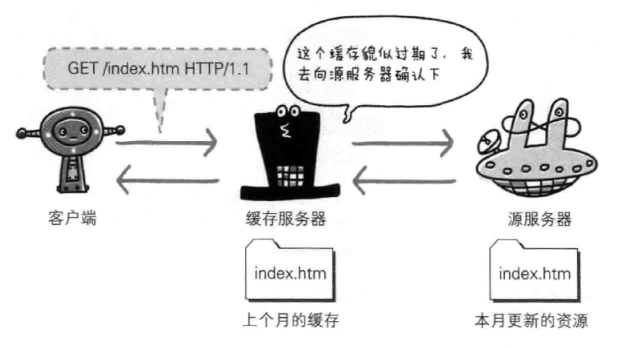

### 客户端的缓存

缓存不仅可以存在于缓存服务器内，还可以存在客户端浏览器中。以Internet Explorer程序为例，把客户端缓存称为临时网络文件（Temporary Internet File）。

浏览器缓存如果有效，就不必再向服务器请求相同的资源了，可以直接从本地磁盘内读取。

另外，和缓存服务器相同的一点是，当判定缓存过期后，会向源服务器确认资源的有效性。若判断浏览器缓存失效，浏览器会再次请求新资源。

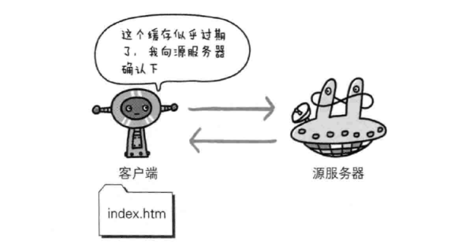

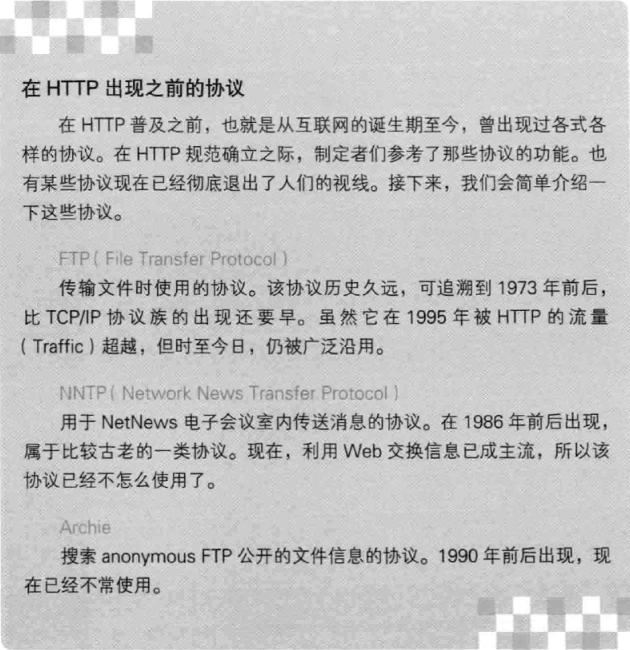

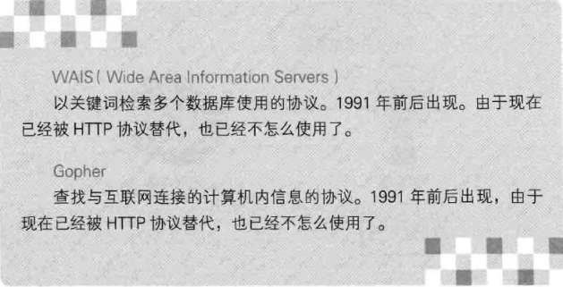

# 第6章：HTTP首部

> HTTP协议的请求和响应报文中必定包含HTTP首部，只是我们平时在使用Web的过程中感受不到。我们一起来学习HTTP首部的结构，以及首部中各字段的用法。

## HTTP报文首部

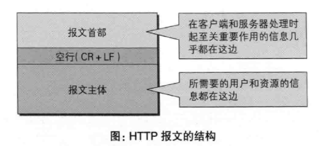

HTTP协议的请求和响应报文中必定包含HTTP首部。首部内容为客户端和服务器分别处理请求和响应提供所需要的信息。对于客户端用户来说，这些信息中的大部分内容都无须亲自查看。

报文首部由几个字段构成。

### HTTP请求报文

在请求中，HTTP报文由方法、URI，HTTP版本、HTTP首部字段等部分构成。

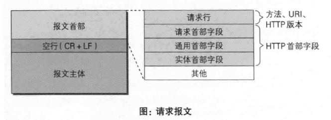

下面的示例是访问http://hackr.jp时，请求报文的首部信息。

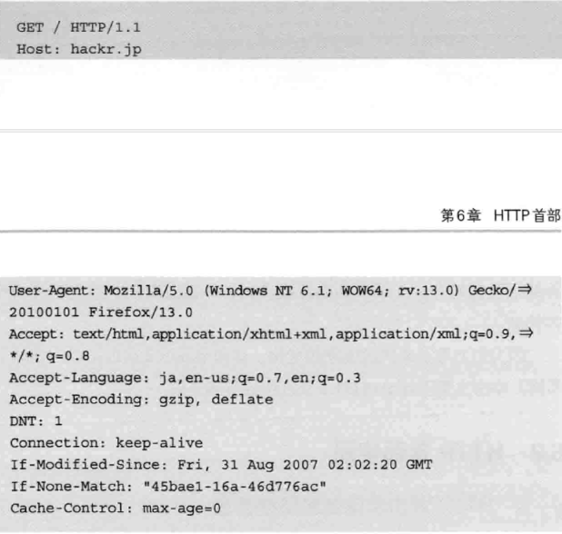

### HTTP响应报文

在响应中，HTTP报文由HTTP版本、状态码（数字和原因短语）、HTTP首部字段3部分构成。

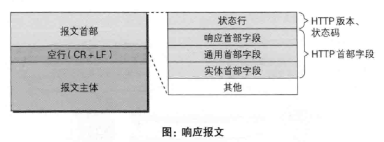

以下示例是之前请求访问http://hackr.jp/时，返回的响应报文的首部信息。

在报文众多的字段当中，HTTP首部字段包含的信息最为丰富。

首部字段同时存在于请求和响应报文内，并涵盖HTTP报文相关的内容信息。

因HTTP版本或扩展规范的变化，首部字段可支持的字段内容略有不同。本书主要涉及HTTP/.1及常用的首部字段。

## HTTP首部字段

### HTTP首部字段传递重要信息

HTTP首部字段是构成HTTP报文的要素之一。在客户端与服务器之间以HTTP协议进行通信的过程中，无论是请求还是响应都会使用首部字段，它能起到传递额外重要信息的作用。

使用首部字段是为了给浏览器和服务器提供报文主体大小、所使用的语言、认证信息等内容。

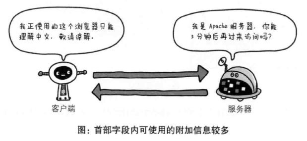

### HTTP首部字段结构

HTTP首部字段是由**首部字段名和字段值**构成的，中间用冒号“：”分隔。

~~~javascript
首部字段名：字段值
~~~

例如，在HTTP首部中以Content-Type这个字段来表示报文主体的对象类型。

~~~http
Content-Type:text/html
~~~

就以上述示例来看，首部字段名为Content-Type，字符串text/html是字段值。

另外，字段值对应单个HTTP首部字段可以有多个值，如下所示。

~~~http
Keep-Alive:timeout=15,max=100
~~~

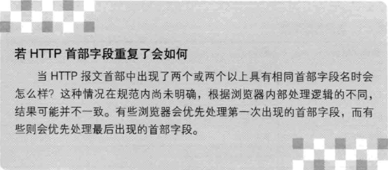

### 4种HTTP首部字段类型

HTTP首部字段根据实际用途被分为以下4种类型。

**通用首部字段（General Header Fields）**：请求报文和响应报文两方都会使用的首部。

**请求首部字段（Request Header Fields）**：从客户端向服务器端发送请求报文时使用的首部。补充了请求的附加内容、客户端信息、响应内容相关优先级等信息。

**响应首部字段（Response Header Fields）**：从服务器端向客户端返回响应报文时使用的首部。补充了响应的附加内容，也会要求客户端附加额外的内容信息。

**实体首部字段（Entity Header Fields）**：针对请求报文和响应报文的实体部分使用的首部。补充了资源内容更新时间等与实体有关的信息。

### HTTP/1.1首部字段一览

HTTP/1.1规范定义了如下47种首部字段。

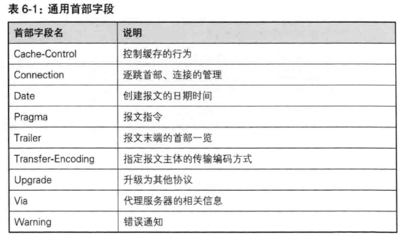

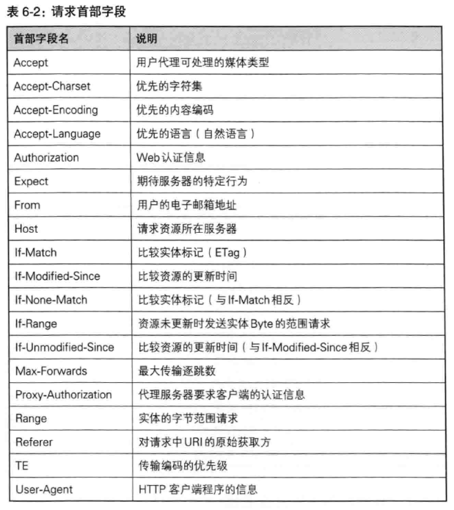

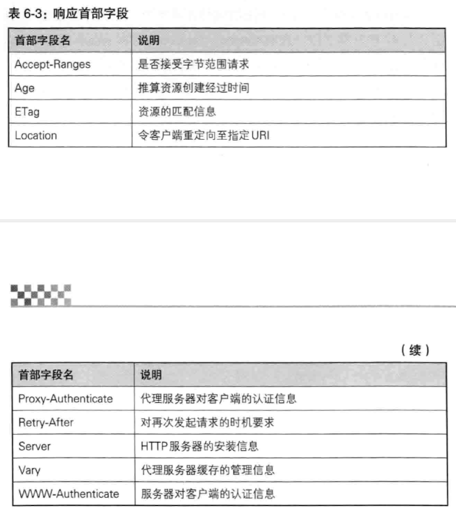

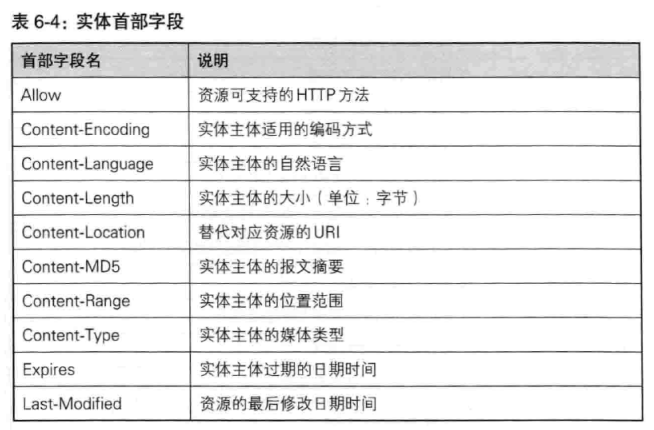

### 非HTTP/1.1首部字段

在HTTP协议通信交互中使用到的首部字段，不限于RFC2616中定义的47种首部字段。还有Cookie、Set-Cookie和Content-Disposition等在其他RFC中定义的首部字段，它们的使用频率也很高。

这些非正式的首部字段统一归纳在RFC4229 HTTP Header Field Registrations中。

### End-to-end 首部和Hop-by-hop首部

HTTP首部字段将定义成缓存代理和非缓存代理的行为，分成2种类型。

**端到端首部（End-to-end Header）**

分在此类别中的首部会转发给请求/响应对应的最终接收目标，且必须保存在由缓存生成的响应中，另外规定它必须被转发。

**逐跳首部（Hop-by-hop Header）**

分在此类别中的首部只对单次转发有效，会因通过缓存或代理而不再转发。HTTP/1.1和之后版本中，如果要使用hop-by-hop首部，需提供Connection首部字段。

下面列举了HTTP/1.1中的逐跳首部字段。除这8个首部字段之外，其他所有字段都属于端到端首部。

* Connection
* Keep-Alive
* Proxy-Authenticate
* Proxy-Authorization
* Trailer
* TE
* Transfer-Encoding
* Upgrade

## HTTP/1.1通用首部字段

通用首部字段是指，请求报文和响应报文双方都会使用的首部。

### Cache-Control

通过指定首部字段Cache-Control的指令，就能操作缓存的工作机制。

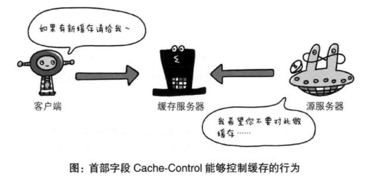

指令的参数是可选的，多个指令之间通过"，”分隔。首部字段Cache-Control的指令可用于请求及响应时。

~~~http
Cache-Control: private, max-age=0, no-cache
~~~

**Cache-Control指令一览**

可用的指令按请求和响应分类如下所示。

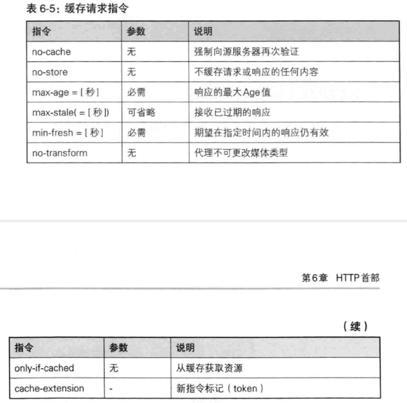

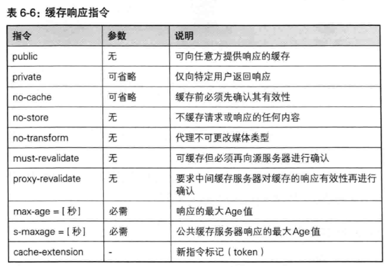

#### 表示是否能缓存的指令

##### public指令

~~~http
Cache-Control: public
~~~

当指定使用public指令时，则明确表明其他用户也可利用缓存。

##### private指令

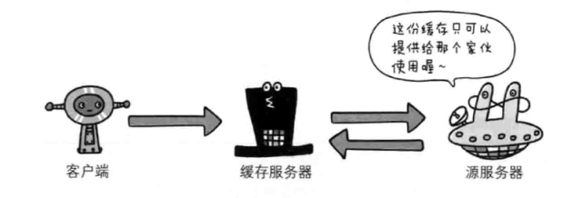

~~~http
Cache-Control: private
~~~

当指定private指令后，响应只以特定的用户作为对象，这与public指令的行为相反。

缓存服务器会对该特定用户提供资源缓存的服务，对于其他用户发送过来的请求，代理服务器则不会返回缓存。

##### no-cache指令

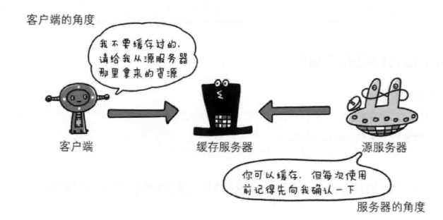

~~~http
Cache-Control: no-cache
~~~

使用no-cache指令的目的是为了防止从缓存中返回过期的资源。

客户端发送的请求中如果包含no-cache指令，则表示客户端将不会接收缓存过的响应。于是，“中间”的缓存服务器必须把客户端请求转发给源服务器。

如果服务器返回的响应中包含no-cache指令，那么缓存服务器不能对资源进行缓存。源服务器以后也将不再对缓存服务器请求中提出的资源有效性进行确认，且禁止其对响应资源进行缓存操作。

~~~http
Cache-Control: no-cache=Location
~~~

由服务器返回的响应中，若报文首部字段Cache-Control中对no-cache字段名具体指定参数值，那么客户端在接收到这个被指定参数值的首部字段对应的响应报文后，就不能使用缓存。换言之，无参数值的首部字段可以使用缓存。只能在响应指令中指定该参数。

#### 控制可执行缓存的对象的指令

##### no-store指令

~~~http
Cache-Control: no-store
~~~

当使用no-store指令时，暗示请求（和对应的响应）或响应中包含机密信息。

因此，该指令规定缓存不能在本地存储请求或响应的任一部分。

> 从字面意思上很容易把no-cache误解成为不缓存，但事实上no-cache代表不缓存过期的资源，缓存会向源服务器进行有效期确认后处理资源，也许称为do-not-serve-from-cache-without-revalidation更合适。no-store才是真正地不进行缓存，请读者注意区别理解。——译者注

#### 指定缓存期限和认证的指令

##### s-maxage指令

~~~http
Cache-Control：s-maxage-604800（单位：秒）
~~~

s-maxage指令的功能和max-age指令的相同，它们的不同点是s-maxage指令只适用于供多位用户使用的公共缓存服务器。也就是说，对于向同一用户重复返回响应的服务器来说，这个指令没有任何作用。

另外，当使用s-maxage指令后，则直接忽略对Expires首部字段及max-age指令的处理。

##### max-age指令

~~~http
Cache-Control：max-age=604800（单位：秒）
~~~

当客户端发送的请求中包含max-age指令时，如果判定缓存资源的缓存时间数值比指定时间的数值更小，那么客户端就接收缓存的资源。

另外，当指定max-age值为0，那么缓存服务器通常需要将请求转发给源服务器。

当服务器返回的响应中包含max-age指令时，缓存服务器将不对资源的有效性再作确认，而max-age数值代表资源保存为缓存的最长时间。

应用HTTP/1.1版本的缓存服务器遇到同时存在Expires首部字段的情况时，会优先处理max-age指令，而忽略掉Expires首部字段。而HTTP/1.0版本的缓存服务器的情况却相反，max-age指令会被忽略掉。

##### min-fresh指令

~~~http
Cache-Control：min-fresh=60（单位：秒）
~~~

min-fresh指令要求缓存服务器返回至少还未过指定时间的缓存资源。比如，当指定min-fresh为60秒后，过了60秒的资源都无法作为响应返回了。

##### max-stale指令

~~~http
Cache-Control：max-stale=3600（单位：秒）
~~~

使用max-stale可指示缓存资源，即使过期也照常接收。

如果指令未指定参数值，那么无论经过多久，客户端都会接收响应；如果指令中指定了具体数值，那么即使过期，只要仍处于max-stale指定的时间内，仍旧会被客户端接收。

##### only-if-cached指令

~~~http
Cache-Control: only-if-cached
~~~

使用only-if-cached指令表示客户端仅在缓存服务器本地缓存目标资源的情况下才会要求其返回。换言之，该指令要求缓存服务器不重新加载响应，也不会再次确认资源有效性。若发生请求缓存服务器的本地缓存无响应，则返回状态码504 Gateway Timeout。

##### must-revalidate指令

~~~http
Cache-Control: must-revalidate
~~~

使用must-revalidate指令，代理会向源服务器再次验证即将返回的响应缓存目前是否仍然有效。

若代理无法连通源服务器再次获取有效资源的话，缓存必须给客户端一条504（Gateway Timeout）状态码。

另外，使用must-revalidate指令会忽略请求的max-stale指令（即使已经在首部使用了max-stale，也不会再有效果）。

##### proxy-revalidate指令

~~~http
Cache-Control: proxy-revalidate
~~~

proxy-revalidate指令要求所有的缓存服务器在接收到客户端带有该指令的请求返回响应之前，必须再次验证缓存的有效性。

##### no-transform指令

~~~http
Cache-Control: no-transform
~~~

使用no-transform指令规定无论是在请求还是响应中，缓存都不能改变实体主体的媒体类型。

这样做可防止缓存或代理压缩图片等类似操作。

#### Cache-Control扩展

##### cache-extension token

~~~http
Cache-Control: private, community="UCI"
~~~

通过cache-extension标记（token），可以扩展Cache-Control首部字段内的指令。

如上例，Cache-Control首部字段本身没有community这个指令。借助extension tokens实现了该指令的添加。如果缓存服务器不能理解community这个新指令，就会直接忽略。因此，extension tokens仅对能理解它的缓存服务器来说是有意义的。

### Connection

Connection首部字段具备如下两个作用。

* 控制不再转发给代理的首部字段
* 管理持久连接

#### 控制不再转发给代理的首部字段

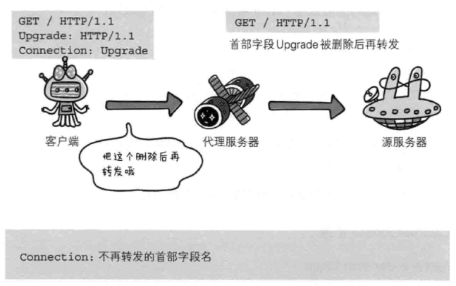

在客户端发送请求和服务器返回响应内，使用Connection首部字段，可控制不再转发给代理的首部字段（即Hop-by-hop首部）。

#### 管理持久连接

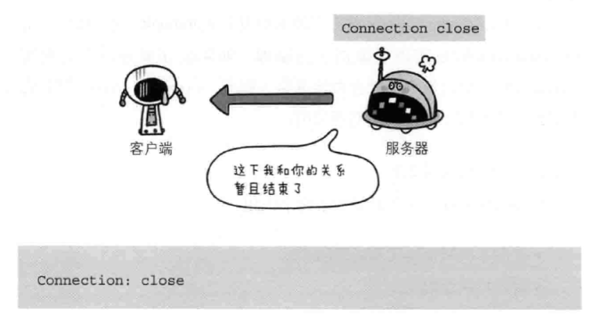

HTTP/1.1版本的默认连接都是持久连接。为此，客户端会在持久连接上连续发送请求。当服务器端想明确断开连接时，则指定Connection首部字段的值为Close。

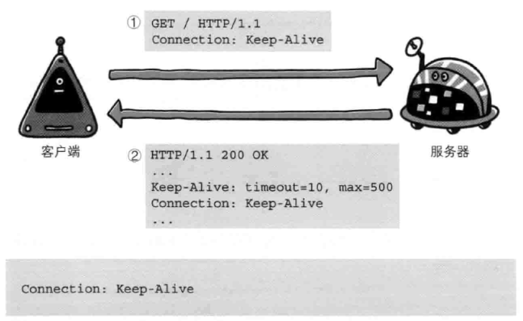

HTTP/.1之前的HTTP版本的默认连接都是非持久连接。为此，如果想在旧版本的HTTP协议上维持持续连接，则需要指定Connection首部字段的值为Keep-Alive。

如上图①所示，客户端发送请求给服务器时，服务器端会像上图2那样加上首部字段Keep-Alive及首部字段Connection后返回响应。

### Date

首部字段Date表明创建HTTP报文的日期和时间。

HTTP/1.1协议使用在RFC1123中规定的日期时间的格式，如下示例。

~~~http
Date: Tue, 03 Jul 2012 04:40:59 GMT
~~~

之前的HTTP协议版本中使用在RFC850中定义的格式，如下所示。

~~~http
Date: Tue, 03-Jul-12 04:40:59 GMT
~~~

除此之外，还有一种格式。它与C标准库内的asctime（）函数的输出格式一致。

~~~http
Date: Tue Jul 03 04:40:59 2012
~~~

### Pragma

Pragma是HTTP/1.1之前版本的历史遗留字段，仅作为与HTTP/1.0的向后兼容而定义。

规范定义的形式唯一，如下所示。

~~~http
Pragma: no-cache
~~~

该首部字段属于通用首部字段，但只用在客户端发送的请求中。客户端会要求所有的中间服务器不返回缓存的资源。

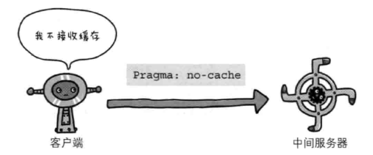

所有的中间服务器如果都能以HTTP/1.1为基准，那直接采用Cache-Control：no-cache指定缓存的处理方式是最为理想的。但要整体掌握全部中间服务器使用的HTTP协议版本却是不现实的。因此，发送的请求会同时含有下面两个首部字段。

~~~http
Cache-Control: no-cache
Pragma: no-cache
~~~

### Trailer

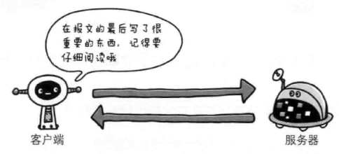

首部字段Tailer会事先说明在报文主体后记录了哪些首部字段。该首部字段可应用在HTTP/1.1版本分块传输编码时。

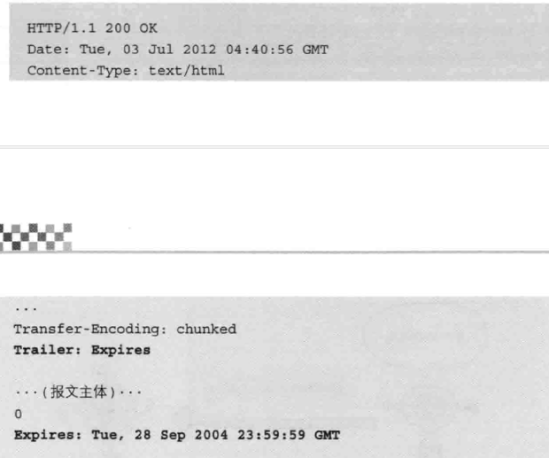

以上用例中，指定首部字段Trailer的值为Expires，在报文主体之后（分块长度0之后）出现了首部字段Expires。

### Transfer-Encoding

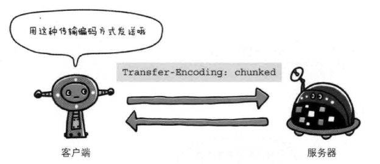

首部字段Transfer-Encoding规定了传输报文主体时采用的编码方式。

HTTP/1.1的传输编码方式仅对分块传输编码有效。

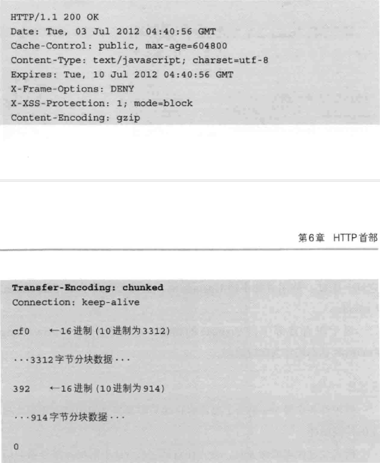

以上用例中，正如在首部字段Transfer-Encoding中指定的那样，有效使用分块传输编码，且分别被分成3312字节和914字节大小的分块数据。

### Upgrade

首部字段Upgrade用于检测HTTP协议及其他协议是否可使用更高的版本进行通信，其参数值可以用来指定一个完全不同的通信协议。

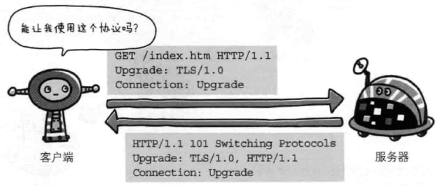

上图用例中，首部字段Upgrade指定的值为TLS/1.0。请注意此处两个字段首部字段的对应关系，Connection的值被指定为Upgrade。

Upgrade首部字段产生作用的Upgrade对象仅限于客户端和邻接服务器之间。因此，使用首部字段Upgrade时，还需要额外指定Connection：Upgrade。

对于附有首部字段Upgrade的请求，服务器可用101 Switching Protocols状态码作为响应返回。

### Via

使用首部字段Via是为了追踪客户端与服务器之间的请求和响应报文的传输路径。

报文经过代理或网关时，会先在首部字段Via中附加该服务器的信息，然后再进行转发。这个做法和traceroute及电子邮件的Received首部的工作机制很类似。

首部字段Via不仅用于追踪报文的转发，还可避免请求回环的发生。所以必须在经过代理时附加该首部字段内容。

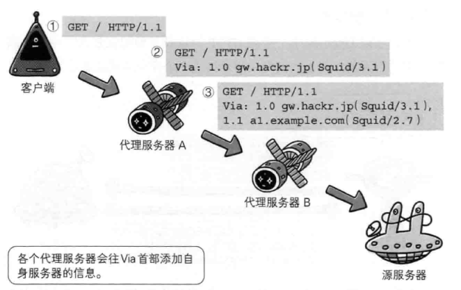

上图用例中，在经过代理服务器A时，Via首部附加了"1.0 gw.hackrjp（Squid/3.1）”"这样的字符串值。行头的1.0是指接收请求的服务器上应用的HTTP协议版本。接下来经过代理服务器B时亦是如此，在Via首部附加服务器信息，也可增加1个新的Via首部写入服务器信息。

Via首部是为了追踪传输路径，所以经常会和TRACE方法一起使用。比如，代理服务器接收到由TRACE方法发送过来的请求（其中Max-Forwards：0）时，代理服务器就不能再转发该请求了。这种情况下，代理服务器会将自身的信息附加到Via首部后，返回该请求的响应。

### Warning

HTTP/1.1 Warning从HTTP/1.0响应首部（Retry-After）演变过来的。该首部通常会告知用户一些与缓存相关的问题的警告。

~~~http
Warning: 113 gw. hackr. jp:8080 "Heuristic expiration"Tue, 03 Jui =>
2012 05:09:44 GMT
~~~

Warning首部的格式如下。最后的日期时间部分可省略。

~~~http
Warning：[警告码][警告的主机：端口号]"[警告内容]"（[日期时间]）
~~~

HTTP/I.1中定义了7种警告。警告码对应的警告内容仅推荐参考。

另外，警告码具备扩展性，今后有可能追加新的警告码。

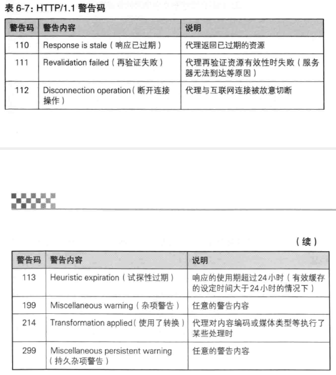

## 请求首部字段

请求首部字段是从客户端往服务器端发送请求报文中所使用的字段，用于补充请求的附加信息、客户端信息、对响应内容相关的优先级等内容。

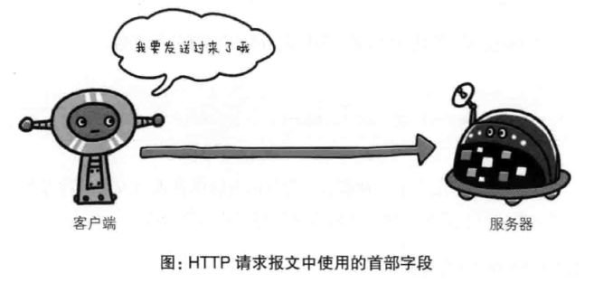

