(注1：原书名叫《计算机的心智：操作系统之哲学原理》，感觉写全名有两个冒号不好看，于是就把这本书简写了。)

(注2：《深入理解计算机系统》确实是本好书，但是也同样艰难晦涩，难以读懂，这本书就算是通俗读物了，以后干脆这样，每看一本大部头的书，都捎带着看一本通俗读物，这样可以相辅相成。)

(注3：这本书我也是跳着看吧)

# 第一篇：基础原理篇

对于任何一门课程来说，首要探讨的问题就是这门课的主题到底是什么？对于刚接触操作系统的入门者来说，自然想到的问题当然也会是操作系统到底是什么东西。回答这个问题是本篇的职责。此外，操作系统作为计算机的核心控制系统，它在计算机运行过程中扮演什么角色？它的来历是什么？它有一些什么基本概念？我们应该如何看待操作系统？它是如何参与到程序的执行过程中的？这些也是学习操作系统需要了解的基本问题。

本书的基础原理篇就是针对上述问题而写成。它对这些问题进行解答和讨论，并为我们接下来介绍操作系统的核心功能部件打下基础和铺垫。本篇包含第1章至第3章内容。第1章的内容包括智者的挑战、人造与神造、程序是如何运行的、什么是操作系统、魔术与管理、用户程序与操作系统、操作系统范畴和为什么学习操作系统。第2章探讨操作系统演变的主要过程：从单一控制终端单一操作员，到批处理、多道批处理、分时操作系统、实时操作系统、现代操作系统；对商业操作系统演变的过程进行分析，然后探讨操作系统分类和操作系统的未来发展趋势。第3章简要回顾计算机硬件基本知识，探讨什么是“抽象”，讲解用户态与内核态，阐述操作系统结构、系统调用、操作系统的売等知识。

本篇最为重要的核心思想是操作系统在计算机运行过程中扮演的角色：魔术师和管理者。魔术师将丑陋变得美好，将没有变为有，将少变为多；而管理者则对所有计算机资源进行管理以达到公平和效率的“双料“境界。对操作系统这两个角色的理解将非常有助于对进程、线程、虚拟内存、文件系统和输入输出系统的掌握。

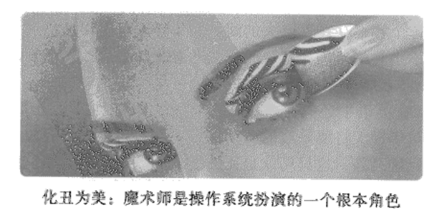

# 第1章：操作系统导论

**引子：智者的挑战**

> 西方有一个著名的故事，名曰：智者的挑战。相传很久以前，有座村子里住着一位智者。同村有个年轻人学到一些知识后就想来挑战这位智者。于是，年轻人想到了一个方法，他来到智者面前，将双手放在背后，问这个智者：
>
> “我刚刚从树上抓了只鸟，现在在我手上。你能告诉我，这只岛是活的还是死的呢？”
>
> 这是一个诡诈的问题。因为，如果回答“是活的”，则这个年轻人只需要在背后将鸟掐死，然后给智者看这只死鸟；如果回答“是死的”，则这个年轻人只需要将鸟放飞即可。这样，无论智者如何回答，年轻人都可以让智者答错，然后可以大大地嘲笑一番智者的水平。
>
> 作为智者，当然一眼看出了年轻人的诡计。但是又不能不回答这个问题。因为不回答问题等于承认答不上来，当然也就不是什么智者了。但如何回答呢？
>
> 智者的回答简洁、精妙，甚至妙不可言："As you will"

咋看上去，这个答案没有什么神奇之处。但如果读者的菜语水平很高，就可以看出其中的奥妙。will这个词在英语中的意思是意愿或意志。因此这个答案的意思是：这只鸟的死活与年轻人的意志保持一致：年轻人的意志是让鸟活，这只乌就 活的，i轻人的意志是ie死，则这只鸟就是死的。

如果到此止步，则这个答案存在着巨大的漏洞：年轻人可以将鸟掐死，但坚持说自己的意志是让鸟活着，即自己不小心将鸟掐死了，而自己的意志却是想让鸟活着。这样的话，智者的回答就错了。

妙不可言的是，will在英语中还有一层意思：将要，即将要发生的事或将要采取的行动。就是说，这只鸟的死活与年轻人将要采取的行动保持一致：年轻人将要放飞这只鸟，这只鸟就是活的；年轻人将要掐死这只鸟，这只鸟就是死的。

因此，智者的回答将人的意志与行为全部包括进来。这样，即使年轻人声称他的意愿和行为并不一致，智者的回答也正确无误。

好，我们知道了智者的回答。但这与操作系统课程有什么关系吗？

有！很多人都觉得操作系统枯燥、乏味，甚至令人厌烦。更有人说懂不懂操作系统没有关系。不是很多人在学习操作系统之前就已经写过程序了吗？有的人甚至已经写过很大很复杂的程序了。可见，不懂操作系统并不妨碍我们学习使用计算机。

如果读者这样想，我劝你再想一想。你虽然写过程序，可你知道程序到底是如何在计算机上运行的吗？如果不知道，你怎么敢肯定你的程序总是会运行正确呢？你怎么敢说你写的程序最大限度地利用了系统的能力了呢？一个人觉得操作系统没用，那是因为他不知道怎么用，或者他没有用操作系统的意愿。说明白一点，你如果认为操作系统没有用，那是因为你的编程和程序开发处在一个低级的水平上。如果你掌握了操作系统，你的编程水平将显著提高。

> 希望有一天我的编程水平也会达到突飞猛进的境地啊。

换句话说，操作系统有没有用，我的回答是"As you will.。你如果有意愿或者有行动使用操作系统，操作系统就是有用的；如果你没有意愿或行动，则操作系统就是没有用的。当然了，我希望读者在看完这本书后能够领悟到操作系统的巨大用途。万一在读完本书后，读者还是困惑或者觉得没用，我唯一能说的也是"As you will"，当然，我希望这种情况发生的概率不大。

## 人造学科

要想学好操作系统，具有恰当的思维模式是十分必要的。这个思维模式就是本书所强调的“哲学"：一种思维方式或一种生活方式。我们以一个问题来说明这一点。这个问题是：什么是计算机的根本特征？

对于这个问题，相信很多人会说计算机就是个计算机器，或者是用来进行大规模计算的机器，或者是用于数据处理的机器，或者是具备某些其他具体功能的机器。这些回答当然没有错，问题是这些答案并不能帮助我们更好地学习理解计算机。就像我们问“张三这个人的根本特征是什么”，而回答是“张三有175cm高”一样。这种答案虽然是正确的，但意义不大，因为我们无法从答案中推导出一系列有用的结论。

那这个问题该如何回答呢？这就要看我们对事物的观察程度。如果我们仔细看看身边的事物，就会发现所有的东西可以划分为两类：一类是本来就存在于自然中，人类所做的只不过是发现；另一类是本来并不存在，人类所做的是发明。第一类事物我们称之为神造事物或者自然存在的事物，第二类事物当然就是人造事物。从这个思维模式上看，计算机毫无疑问就是人造事物，这正是我们所需要的答案，即计算机的根本特征是“人造”。

引申一下可知，计算机学科就是一个人造学科。那么知道计算机学科是人造学科对我们学习计算机有什么帮助呢？有，太多了。下面我们来看看人造和神造有什么区别。

人造学科的四个特点：

* 不精确、具有相对性。
* 从对人类活动的观察导出。
* 依赖于人的主观判断力。
* 通常符合人的直觉。

第一个特点就是所谓的“没有对错”。在人造的学科里，没有什么绝对的对或者错，而只有所谓的“好”或者“坏”，“有意义”或者“没意义”。例如，如果本书在讨论计算机时某个方面的论述与你见到的计算机不一样，这不说明本书错了。就算世界上没有本书所论述的计算机存在，也不说明本书错了。我们只需要按照本书的论述再造一台计算机即可。但是，本书论述的计算机与你知道的计算机之间可以进行好和坏的比较。

第二个特点说的是人造学科是从什么得到灵感的，那就是“对人类活动的观察"。这样，读者只要对人类生活仔细观察，就可以很容易地理解计算机里面的许多原理。例如，在操作系统中，广泛使用的栈和队列就是对从生活中观察得到的现象进行抽象所获得，如图1-1所示。

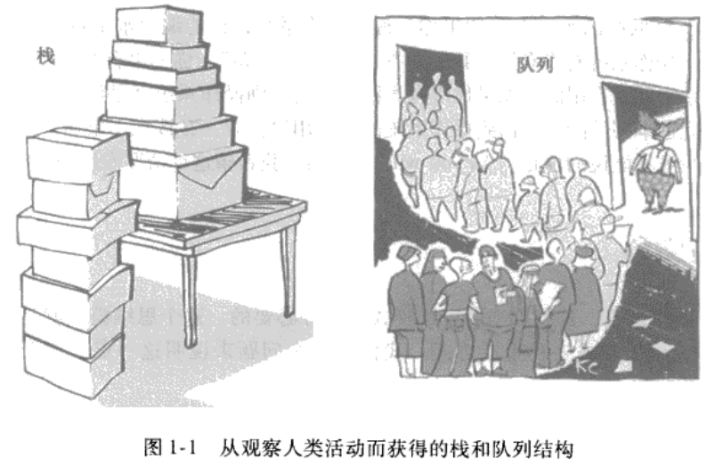

第三个特点说的是在人造学科里，人的主观能动性起着关键的作用。不同的人观察同样的现象，得出的结论或抽象出的东西可能不一样，甚至完全相反。这样，多数人所认同的抽象就将成为人造学科里的标准，即存在少数服从多数的原则。

第四个特点说的是人造学科里面的许多原理与人的直觉直接呼应，即如果我们按照人的直觉去理解这些原理，就会十分直截了当。例如，操作系统里面的同步机制与人类男女谈恋爱时所用的约会机制十分相似。对于一个谈过恋爱或与别人约会过的人来说，如果将自己谈恋爱的直觉用在操作系统进程的学习上，就会发现进程同步是个十分容易理解的概念。

相对于人造学科，神造学科刚好具有相反的四个属性：

* 精确、绝对。
* 从对自然存在的观察导出。
* 不依赖于人的主观判断力。
* 通常违反人的直觉。

第一个特点说的是神造的事物具有精确、绝对的属性。对于这种学科，存在正确与错误之分，我们提出的观点要么正确，要么错误，不存在中间状态。例如，纯数学领域的各种运算，如2^2^的结果应该是4，如果运算的结果不是4，则属于运算错误。

第二个特点说的是人类对这些事物的理解是从对自然存在的观察中获得。例如，牛顿通过观察苹果落地的自然现象和严密的推理，得出了万有引力定律。

第三个特点说的是这些观察的结果是不依赖于人的主观能动性的。如果一个人的观察结果是正确的话，那么他的观察结果将和所有正确的观察结果一样，而绝不会是两样。从另外一个角度说，一个人的观察抽象结果是可以被他人验证的。例如，30 000 000 000 + 20 000 000 000对于任何人来说，如果计算正确，则结果必然是50000 000 0000

第四个特点说的是如果我们按照人的直觉来学习，就会面临重重困难。因为人的思维与神不一样。自然，按照人的思维模式将很难理解神所创造的这一切。这就是为什么在这些学科耕耘的人都必须依赖灵感的出现，和严密、一丝不苟的数学与逻辑推理（见图1-2）。

明白了计算机是人造事物，操作系统是一个人造的系统，我们就可以按照人造物的特点来进行学习，从而易如反掌地掌握操作系统的原理。

## 程序是如何运行的

计算机程序是怎样运行的呢？对于多数人来说，或多或少地知道任何程序必须首先有人写出来，即“编程”，然后放到计算机里即可运行。这种解释当然是过于简单了。计算机程序的运行实际上是一件十分复杂的事情，牵扯到方方面面。

首先当然是进行编程，而编程需要计算机程序设计语言作为基础。对于绝大多数编写程序的人来说，使用的编程语言称为“高级程序设计语言”，如c，C++，Java等。但由于计算机并不认识高级语言编写的程序，编好的程序需要通过编译变成计算机能够识别的机器语言程序，而这需要编译器和汇编器的帮助。其次，机器语言程序需要加载到内存，形成一个运动中的程序，即“进程"，而这需要操作系统的帮助。进程需要在计算机芯片CPU上执行才算是真正在执行，而将进程调度到CPU上运行也由操作系统完成。再次，在CPU上执行的机器语言指令需要变成能够在一个个时钟脉冲里执行的基本操作，这需要指令集结构和计算机硬件的支持，而整个程序的执行过程还需要操作系统提供的服务和程序语言提供的执行环境（runtime environment）。这样，一个从程序到微指令执行的整个过程就完成了。图1-3所示的就是这个过程。

当然了，图1-3描述的从程序到结果的演变过程还是过于简单。我们只是从一个线性的角度来看程序的演变过程，而没有考虑到各种因素之间的穿插和交互过程。不过，对于才入门的计算机专业学生来说，这种描述能够帮助理解整个程序是如何在计算机上执行的问题。

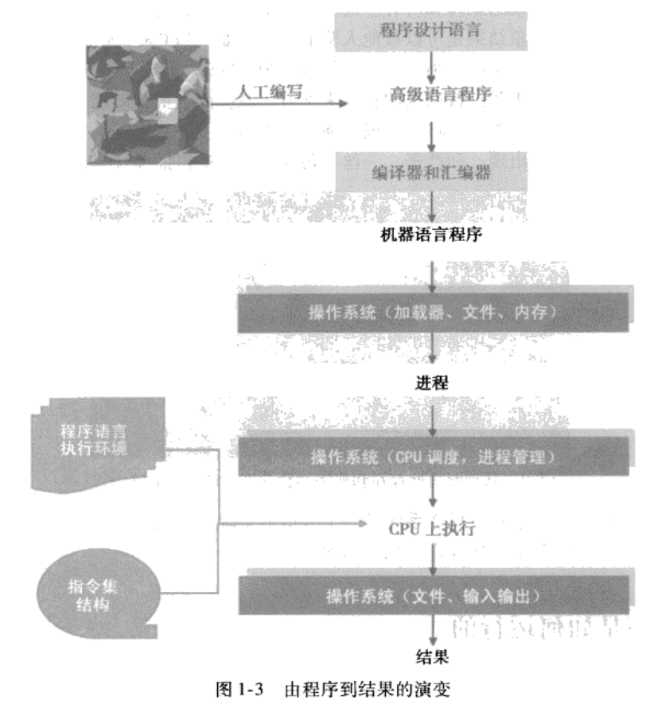

从这个描述可以看出：程序的运行至少需要如下4个因素：

* 程序设计语言。
* 编译系统。
* 操作系统。
* 指令集结构（计算机硬件系统）。

这4个因素都将是大学学习的专业课程。需要注意的是，操作系统在程序的执行过程中具有关键的作用，本书要做的就是阐述这个关键作用是如何发挥的。

需要提醒的是，图1-3给出的程序执行过程是从高级语言编写的程序开始，而实际并非总是这样。事实上，程序可以直接在机器语言或汇编语言上编写。用这种称为“低级”的语言编写出来的机器语言程序无需经过编译器的翻译就可以在计算机指令集上执行。如果是在汇编语言上编写的汇编程序，则只需要经过汇编器的翻译即可加载执行。

## 什么是操作系统

操作系统这个术语听上去稀松平常，并不给人任何兴奋的感觉，甚至有点俗气。原因在于中文的“操作”这个词：提到操作员，通常让人想起操作车床、磨床和起重机的穿着油腻工作服的工人，自然让人兴奋不起来。将英文的Operating翻译为中文的“操作”，是因为翻译的人没有真正理解英文Operating Systems（操作系统的英文名称，一般缩写为Os）这个名字所蕴含的精髓。

那么英文的Operating Systems意味着什么呢？

各位见过手术过程吗？在手术室里，主刀大夫称为Operating Surgeon。在整个手术过程中，主刀大夫具有至高无上的权威：他说要打麻药，麻醉师就要赶紧打麻药；他说需要手术钳，助理大夫就赶忙递给他手术钳；他说需要止血，护士就得马上拿止血药棉来止血。整个手术最关键的部分，切开皮肤、拿掉器官、安装移植器官等均由主刀大夫完成。当然，主刀大夫有时候也会将某些任务，如缝合创口，交给助理大夫或护士来做，但整个手术的过程皆由其主控。一句话，Operating Surgeon就是掌控整个手术过程、具有精湛技术和敏锐判断力的医师。
引申至非医学领域，Operating Person意思是操刀手，就是掌控事情的人。再将Person这个词换成System，则Operating Systems指的就是掌控局势的一种系统。也就是说计算机里面的一切事情均由Operating Systems来掌控。那么，我们现在面临两个问题：第一个问题是操作系统到底是什么？第二个问题是操作系统到底操控什么事情？
我们先回答第一个问题。既然操作系统是掌控计算机局势的一个系统，自然很重要。但这个说法并不能帮助读者理解操作系统，也无法形成有形的概念。如果我们换个说法：操作系统是一个介于计算机和应用软件之间的一个软件系统，则概念就具体多了。从这个定义出发，我们知道操作系统的上面和下面都有别的对象存在：下面是硬件平台，上面是应用软件，如图1-4所示。

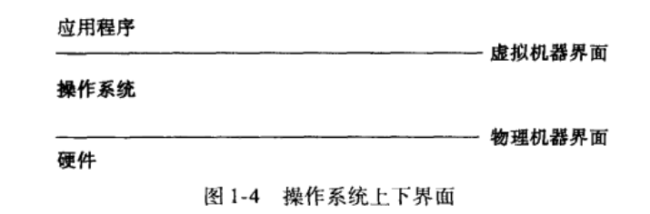

再来回答第二个问题。我们现在知道操作系统代表的是掌控事情的系统。掌控什么事情呢？当然是计算机上或计算机里发生的一切事情。最原始的计算机并没有操作系统，而是直接由人来掌控事情，即所谓的单一控制终端、单一操作员模式。但是随着计算机复杂性的增长，人已经不能胜任直接掌控计算机了。于是我们编写出操作系统这个“软件”来掌控计算机，将人类从日益复杂的任务中解脱出来。这个“掌控”有着多层深远的意义。

首先，由于计算机的功能和复杂性不断发生变化（趋向更加复杂），操作系统所掌控的事情也就越来越多，越来越复杂。同时，操作系统本身能够使用的资源也不断增多（如内存容量）。这是早期驱动操作系统不断改善的根本原因。
其次，既然操作系统是专门掌控计算机的，那么计算机上发生的所有事情自然需要操作系统的知晓和许可，未经操作系统同意的任何事情均视为非法事情，也就是病毒和入侵攻击所试图运作的事情。作为操作系统的设计人员，我们当然要确保计算机不发生任何我们不知情或不同意的事情。但是人的能力是有限的，人的思维也是有缺陷的，我们设计出的系统自然不会十全十美，也会有缺陷的，这就给了攻击者可乘之机。操作系统设计人员和攻击者之间的博弈是当前驱动操作系统改善的一个重要动力。

再次，掌控事情的水平有高低之分，有效率不同之分。就像手术大夫之间也有水平高低之分。为了更好地掌控事情，为了更好地满足人类永不满足的各种越来越苛刻的要求，操作系统自然需要不断改善。这种改善在过去、现在和将来都会继续下去。

好了，说到这里，我们可以给操作系统做一个定义了：操作系统是一个软件系统，使计算机变得好用（将人类从繁琐、复杂的对机器掌控的任务中解脱），使计算机运作变得有序（操作系统掌控计算机上所有事情）。

总结起来就是：**操作系统是掌控计算机上所有事情的软件系统**。

从这个定义可以引申出操作系统的功能包括：

* 替用户及其应用管理计算机上的软硬件资源。
* 保证计算机资源的公平竞争和使用。
* 防止对计算机资源的非法侵占和使用。
* 保证操作系统自身正常运转。

## 魔幻和管理

将上面所陈述的操作系统功能进行提升，就可以得出操作系统所扮演的两个根本角色是：管理者和魔幻家。只要记住了这两个角色，就差不多明白什么是操作系统。

### 魔幻家角色

将计算机以一个更加容易、更加方便、更加强大的方式呈献给用户使用。直白地说，就是把差的东西变好，把少的东西变多，把复杂的东西变得容易。例如，如果在裸机上直接编程是很困难的，因为各种数据转移均需要用户自己来控制，对不同设备要用不同命令来驱动，而这对一般人来说很难胜任。操作系统将这些工作从用户手中接过来，从而让用户感觉到编程是一件容易的事（相对来说，编程对于有些人来说永远很难）（见图1-5）。操作系统通过进程抽象让每一个用户感觉到有一台自己独享的CPU；通过虚拟内存的抽象，让用户感觉到物理内存空间具有无限扩张性。这就是把少变多。当然，操作系统的把少变多不是无中生有。变多也不是无限多，只是针对磁盘容量的大小。

[内存和磁盘的关系](https://blog.csdn.net/weixin_39966065/article/details/104193886)

### 管理者角色

管理计算机上软硬件资源。例如，操作系统对CPU、内存、磁盘等的管理，使得不同用户之间或者同一用户的不同程序之间可以安全有序的共享这些硬件资源。那怎么让用户很好地利用这些硬件资源呢？就是分块（parcels out），把硬件分块出来给应用程序使用。这里关键的原则是有效和公平，这是管理者的必备素质。有效指的是不能浪费资源，公平指的是每个人都有享有资源的可能，即不能有不公平的现象。**当然真正的公平是没有的事，这很像人类生活的现实。不过追求公平却是我们的本能，在虚拟世界里尽可能公平一点还是非常应该的，至少应该是操作系统设计时的不懈追求**。

根据管理的资源不同，操作系统具体功能包括：

* CPU管理，即如何分配CPU给不同应用和用户。
* 内存管理，即如何分配内存给不同应用和用户。
* 外存管理，即如何分配外存（磁盘）给不同应用和用户。
* I/O管理，即如何分配输入输出设备给应用和用户。

除了对上述资源进行管理和抽象外，操作系统作为掌控一切的软件系统，其自身必须是稳定和安全的，即操作系统自己不能出现故障。因此，操作系统本身的设计还需包括如下两项：

* 健壮性管理，即如何确保操作系统自身的正常运作。
* 安全性管理，即如何防止非法操作和人侵。

为完成上述所列的功能，操作系统设计人员构思了许多机制。而所有这些机制均有其来龙去脉，其背后隐含的是人的哲学思维。我们这门课就是要讲解操作系统后面的哲学原理，并依据这些哲学原理阐述操作系统是通过何种机制、以何种方式完成上述列举的各种管理功能。

## 用户程序与操作系统

前面说过，操作系统上下分别是虚拟机器界面和物理机器界面。处于物理机器下面的是硬件，而硬件和操作系统的关系将是本书的关注点。处于虚拟机器界面上面的是应用软件，应用软件和操作系统的关系不是本书的重点，而是系统编程或底层编程等课程的关注点。在这里，我们只想简要讨论一下应用程序和操作系统的关系，因为这个关系对理解操作系统非常重要。

那么，操作系统和应用程序之间是个什么关系呢？很显然，操作系统为用户程序提供了一个虚拟机器界面，而应用程序运行在这个界面之上。但这个答案似乎太抽象。并不能帮助深入理解它们之间的关系。我们前面讲过，操作系统是一个程序，而用户程序也是程序，程序和程序之间能有什么关系呢？无非是调用和被调用的关系。

那操作系统和用户程序之间到底谁是调用者，谁是被调用者呢？答案似乎很清楚。操作系统通过虚拟机器界面给用户程序提供各种服务，用户程序在运行过程中不断使用操作系统提供的服务来完成自己的任务。例如，用户程序在运行过程中需要读写磁盘，这个时候就需要调用操作系统的服务来完成磁盘读写操作。如果需要收发数据包，也需要调用操作系统的服务来完成。当调用这些服务时，控制从用户程序转移到操作系统，而操作系统在完成这些服务后将控制返回给用户程序。在这种思维模式下，用户程序是主程序，操作系统是子程序，如图1-6所示。

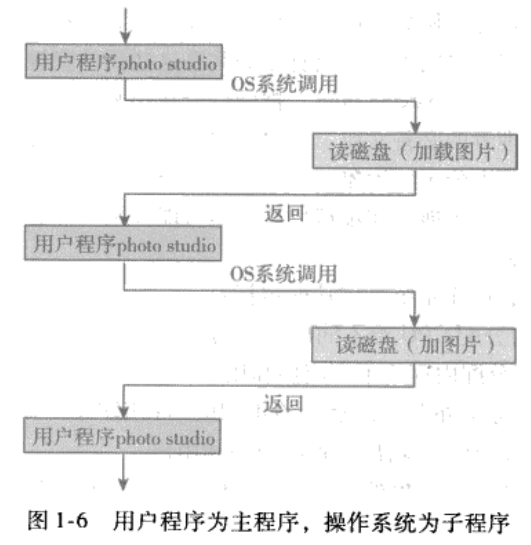

但是有正就有反，这就是哲学中的矛盾论。如果我们从另一个角度来看，会得出相反的结论。系统启动之后最先启动的是什么程序？操作系统。用户程序不能在操作系统启用之前启动（除非是很厉害的病毒）。在此之后，每次启动一个用户程序，都相当于操作系统将控制转移给用户程序；而在用户程序执行完毕后，控制又回到操作系统。这样看上去，操作系统是主程序，它在一生当中不断调用各种应用程序，而每个应用程序执行完之后再回到操作系统。就这样循环往复，直到无穷或机器关闭。在此种思维模式下，操作系统是主程序，用户程序是子程序，如图1-7所示。

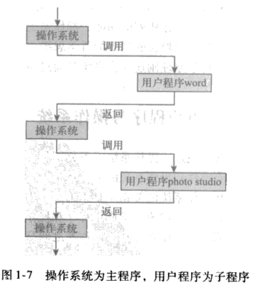

上述两种看法完全相反，但又似乎都有道理，有谁对谁错之分吗？没有。我们说过，人造学科没有对错之分，只有好坏之分。你喜欢哪个观点你就持那种观点，哪个观点帮助你理解操系统，你就持哪种观点。如果两种观点都有帮助，你可同时持有两种观点。

当然了，上述关系描述是非常简单化的。实际上，操作系统和各种用户程序可以看作是互相调用，从而形成一个非常复杂的动态关系。了解并阐述这种复杂的动态关系就是本书的目的。

## 操作系统的范畴

我们前面讲过了操作系统的两个角色：魔术师和管理者。这两个角色之间既有区别，又有联系。为了完成不同的任务，操作系统有时需要扮演魔术师的角色，有时需要扮演管理者的角色，有时则需要同时扮演这两个角色。那操作系统要完成的任务具体有哪些呢？前面提到过：

* CPU管理，即如何分配CPU给不同应用和用户。
* 内存管理，即如何分配内存给不同应用和用户。
* 外存管理，即如何分配外存（磁盘）给不同应用和用户。
* I/O管理，即如何分配输入输出设备给应用和用户。

CPU管理就是我们将要讲的进程管理。进程管理的主要目的有三个：第一个是公平，即每个程序都有机会使用到CPU，第二个是非阻塞，即任何程序不能无休止地阻挠其他程序的正常推进。如果一个程序在运行过程中需要输入输出或者别的什么事情而发生阻塞，这个阻塞不能妨碍别的进程继续前进。就像人类世界，缺了谁地球都照样旋转。第三是优先级。在人类生活中人的地位不是完全一样的，地位高的就比你优先级高。人类把自己生活中的这种关系搬到操作系统里面，就有了优先级的概念，即某些程序比另外一些程序优先级高。如果优先级高的程序开始运行，则优先级低的程序就要让出资源。就像我们经常说的，我们坚决反对大锅饭，应该让一部分人（程序）先富起来。

内存管理主要是管理缓存、主存、磁盘、磁带等存储介质所形成的内存架构。为此目的，操作系统设计人员发明了虚拟内存的概念，即将物理内存（缓存和主存）扩充到外部存储介质（磁盘、光盘和磁带）上。这样内存的空间就大大的增加了，能够运行的程序的大小也大大的增加了。内存管理的另一个目的是让很多程序共享同一个物理内存。这就需要对物理内存进行分割和保护，不让一个程序访问另一个程序所占的内存空间，专业术语称为运行时不能越界。在生活中，就是我家的东西不希望你跑来拿。

存储管理就是众所周知的文件系统了。文件系统的主要目的是将磁盘变成一个很容易使用的存储媒介提供给用户使用。这样我们在访问磁盘时无需了解磁盘的物理属性或数据在磁盘上的精确位置，诸如磁道、磁柱、扇面等。当然，文件系统还可以建立在光盘和磁带上。只是使用最为频繁的文件系统都以磁盘为介质。

设备管理就是管理输入输出设备。其目的有两个：一是屏蔽不同设备的差异性，即用户用同样的方式访问不同的设备，从而降低编程的难度；二是提供并发访问，即将那些看上去并不具备共享特性的设备，如打印机，变得可以共享。

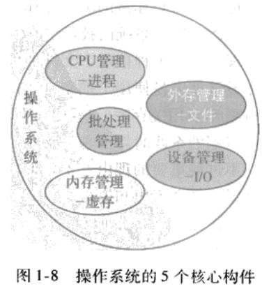

另外还有一个任务称为批处理。批处理提供一种无需人机交互的程序运行模式。有时我们不需要人来交互，就批处理交给计算机。主要是要达到吞吐量最大化，单位时间完成的任务最多，图1-8描述的是操作系统的5个核心功能。

当然，在真实的操作系统里，上述5个核心部件不一定界限分明，甚至它们不在同一个态势下运行（本书后面将说明这点）。图1-9描述的是Windows操作系统简化了的结构。

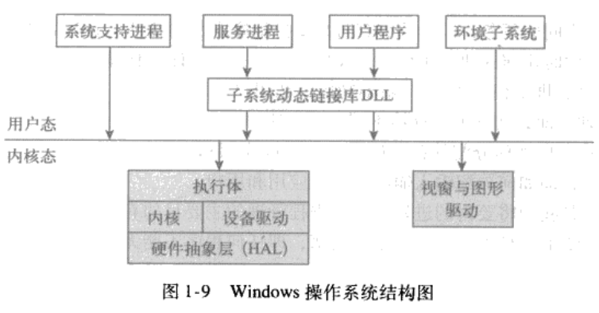

## 为什么学习操作系统

到目前，本书论述了操作系统是什么、操作系统的主要任务和操作系统与用户程序的关系后，读者应该体会到操作系统的重要性。但仅仅是因为操作系统重要就要学习它吗？世界上重要的东西太多了，难道我们都要学吗？即使是计算机专业的学生，不学操作系统也照样可以编程写软件。那我们为什么要学呢？当然我们有一千个理由要学，但这里仅给出几个。

首先，操作系统的功能在很多领域都使用。如果你做并发程序的开发：Web Service、分布式系统和网络，你会发现，这些领域大量使用了操作系统的概念和技术。如果你学好了操作系统，你就可以对你做的事情更加有信心。

其次，操作系统的技巧也在很多领域使用。如抽象、缓存、并发等。操作系统简单来说就是实现抽象：进程抽象、文件抽象、虚拟存储抽象等。而很多领域也使用抽象，如数据结构和程序设计就大量使用了抽象。记得抽象数据类型吗？记得抽象类吗？很多地方都用缓存。你做Web要不要用缓存呢？这些你都得做。如果学了操作系统，你就掌握了这些内容。触类旁通，你学习别的东西时就容易多了。

不过最重要的理由并不是上面两条，而是操作系统真的很有意思。对于一个计算机专业的人来说，难道不想知道自己写的程序到底是如何在计算机上运行的吗？读者一定见过汽车吧。汽车前面那个盖子叫前盖。很多人买车后第一件事是什么？打开前盖。那么打开前盖看到的是什么东西？马达，变速箱。为什么第一件事要打开前盖呢？因为好奇这辆汽车是怎么开动的（见图1-10）。

那么对于一个程序设计员来说，有没有在看到一台计算机的时候，想过为什么计算机能进行计算？有没有买来一台新计算机后就打开盖子呢？多数人恐怕没有打开过计算机外壳。不过，没有打开过也不用遗憾。因为即使你把计算机后盖打开，还是不能明白计算机是怎么运转的，此时只看到一堆硬件：芯片、主板、布线等，而这些硬件并不会告诉你太多有关计算机运转的信息。如果真的想知道计算机是怎么运转的，你就得学操作系统。当然，如果你想知道计算机在硬件层面上是如何运转的，则还应该学习计算机组成和体系结构等课程。

虽然学习操作系统很有趣，但并不是所有人都有这样的感觉。历史证明，对很多人来说学操作系统是一件很痛苦的事情。不过我希望阅读本书对读者来说是一件乐事，难道窥探奥秘不是一件激动人心的事吗？

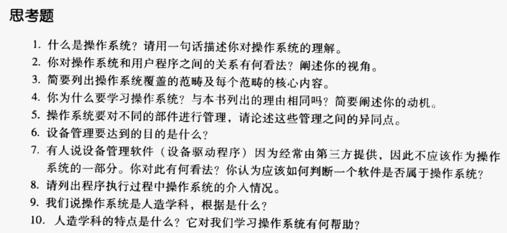

# 第2章：操作系统历史

**引子：操作系统进化的推动因素**

> 上世纪末本世纪初，美国兴起了励志演讲（Motivational Speech）大潮，各种人等乐此不疲。在这拔励志大潮中，出现了多名影响力广泛的励志演说家。这些演说家所到之处，真是万人空巷，人潮涌动，场面之壮观令人叹为观止。
> 其中一位演讲家由于其名望很高接受了电视台采访
> 记者：“您在励志演讲领域声名远播，影响巨大。您的每场演讲都人满为患，能否请您阐述一下什么是励志演说吗？"
> 励志专家：“你想知道吗？告诉你，我跟你一样，我压根就不知道什么是励志演讲。我只知道励志演讲非常流行，我只不过是利用这个潮流来赚钱而已。既然大家都喜欢，我就讲，至于我讲的东西是什么意思，我根本不知道。但是听众很喜欢！”

我想起了一句英语的歌谣："sometimes when we touch，the honest is too much！"（有时，当我抚摸着你，真实让我几乎无法承受！）。也许人都不喜欢真实，于是就成就了很多人在论述探作系统历史（甚至人类历史）时的粉饰太平。

而操作系统的演变就是我们对计算机硬件进行粉饰的过程。

大多数的教材都有一章谈论相关领域的历史，操作系统自然也不例外。不过不同的教材谈论历史的目的却又不同。多数教材是为了铺垫一下本学科的发展背景，让学生了解相关领域里的发展大事，并无将历史与现实的发展联系起来。本课程谈论的历史则是以史明鉴，不是为了谈论历史而谈论历史，而是为了让学生明白操作系统为什么是现在这个样子，以及将来会是什么样子。从根本上把握操作系统这一计算机领域核心学科的脉搏，深刻理解社会变迁给计算机这门人造学科带来的不可抵挡的变化。同时，我们还将揭示计算机发展史上一些鲜为人知的重要细节，给学生一个窥探全貌的快感。

如我们前面所说，操作系统的不断发展与改善由两个因素驱动：

* **硬件成本的不断下降。**
* **计算机的功能和复杂性的不断变化。**

就是这些因素决定了操作系统的历史，我们一定要牢牢掌握这两个因素。硬件成本不断降低，就以硬盘为例，IBM制造的第一张硬磁盘直径达2米，造价100多万美元，而容量仅仅只有IMB，而现在一个容量100GB的硬盘成本只有几十美元。当然，过去的硬盘和今天的硬盘的制造技术完全不同，第1张硬盘的质量坚挺，可以当作咖啡桌来使用，而现在的硬盘（指盘片），非常软，根本不能承受重物。计算机复杂性的不断增加对于很多人来说并不感到惊奇。人类做的任何事情，都是越来越复杂。你住的地方不做整理很快就乱了，有没有这经验？当然，你的生活随着你年龄的增长，也会越来越复杂。最初，计算机的组件虽然巨大，但数量少，且功能简单。现在，一台计算机里面包括的元件数量实在是太多了。

硬件成本的下降和计算机复杂性的提高推动了操作系统的演变。成本降低意味着同样的价格可以买到更为先进的计算机。而复杂性提高自然需要操作系统的能力也得提高。就是这些变化使得操作系统从最初的仅仅几百或几千行代码的独立库函数，发展到今天的多达4000万行代码的Windows XP操作系统。而某些Linux的版本的代码行数更加庞大。

操作系统之所以越来越复杂是因为硬件质量和数量的提升使得操作管理的东西增多，而且人类永不满足的各种越来越苛刻的要求也使得计算机操作系统的复杂性增加。

另外，还有一个附加因素影响着操作系统的发展，这就是操作系统和攻击者之间的博弈。
这个世界上总有些人想利用计算机的缺陷来进行各种损人利己或损人又不利己的活动。操作系统在最初设计时根本就没有想到会有人从事破坏活动。大概因为最早的计算机工作者认为到达能够使用计算机的水平的人都是好人，无需设计任何安全机制。这样，在后来发现有人试图利用计算机进行不良操作时，就迫不得已修改操作系统，使其具有安全上的防范功能。每当操作系统改进了安全性，攻击者也会改良他们的攻击手段，这样循环往复，就造成操作系统安全水平和攻击者攻击水平不断交替上升的历史。

下面我们就来说一说操作系统是如何因上述驱动因素的变化而变化的。

## 第一阶段：状态机操作系统（1940年以前）

这是计算机处在萌芽期时出现的操作系统。这种操作系统运行在英国人**巴贝斯**（Babbes）
想像中的自动机中。所谓状态机操作系统实际上算不上是我们现在通常所定义的操作系统，而是一种**简单的状态转换程序**：**根据特定输人和现在的特定状态进行状态转换而已**。这个时候的计算机也不是现代意义上的计算机，而是所谓的自动机，其功能非常简单，可以用“原始”来形容。**能做的计算也只限于加减法**。这个时代的操作系统没有什么功能，不支持交互命令输人，也不支持自动程序设计。甚至这个时候还没有存储程序的概念。

驱动这一阶段操作系统的动力是**个人英雄主义**。因为此时尚无任何计算机工业、计算机研究及计算机用户。计算机及其操作系统的发展完全是某些人的个人努力。

这个阶段因为计算机刚刚出现，没有多少人能够接触到计算机，自然不存在什么安全问题。这个阶段没有操作系统。如果非要说有的话，**人就是这个时代的操作系统**：因为自动机的一切动作均是人在操控的。

## 第二阶段：单一操作员、单一控制端操作系统（20世纪40年代）

这种单一操作员单一控制终端（SOSC，single operator，single console）的操作系统是在刚出现计算机时人们能想到的最直观的控制计算机的方式。这个时候的代表机型为美国宾夕法尼亚大学与其他机构合作制作的ENIAC计算机。这是第一台电子计算机，但不是第一台计算机。在这之前有个英国人造了一部机械计算机，通过手柄摇动能够进行计算。在ENIAC刚造出来的时候，谁都不知道计算机是怎么回事，所以没有操作系统的整体概念，唯一能想到的就是**提供一些标准命令供用户使用**，这些标准命令集合就构成我们的原始操作系统SOSC 。

**SOSC操作系统的设计目的就是满足基本的功能，并提供人机交互**。在这种操作系统下，**任何时候只能做一件事**，即不支持并发和多道程序运行。操作系统本身只是一组标准库函数而已。**操作系统并不自我运行，而是等待操作员输人命令再运行**。用户想使用什么服务，就直接在命令行键入代表该服务的对应操作系统的库函数名（文件名）即可。这种操作系统的资源利用率很低：**你输入一个命令就执行一个库函数，拨一下动一下。当操作员在思考时或进行输人输出时，计算机则静静的等待**。当然了，从人的角度来看，效率并不低，你键入什么，计算机就立即执行什么。但从机器的角度考虑，因为时刻都等着人相对较慢的动作，效率就太低了。

由于这个时代的计算机很稀少，整个世界也只有几台，而人却不是，提高计算机的利用率就变得十分重要。

## 第三阶段：批处理操作系统（20世纪50年代）

为了提高单一操作员单一控制终端的操作系统SOSC的效率，人们提出了批处理操作系统。在仔细考察了sOSC后，人们发现，**SOSC效率之所以低下，是因为计算机总是在等待人的下一步动作，而人的动作总是很慢**。因此，人们觉得，**如果将人的因素拿走，让所有的人先想好自己要运行的命令，列成一个清单，打印在纸带上，然后交给一个工作人员来一批一批地处理，效率不就提高了吗**？这样就形成了我们所说的批处理操作系统。

批处理操作系统针对的是第二代通用计算机，如IBM的1401和7094等，通过去除人机交互达到CPU和输入输出利用率的改善。批处理的**过程**是：**用户将自己的程序编在卡片或纸带上，交给计算机管理员**。管理员在收到一定数量的用户程序后，将卡片及纸带上的程序和数据通过IBM1401机器读入，并写到磁带上。这样每盘磁带通常会含有多个用户的程序。然后，计算机操作员将这盘磁带加载到1BM7094上，一个一个地运行用户的程序，运行的结果写在另一个磁盘上。所有用户程序运行结束后，将存有结果的磁盘取下来，连到IBM1401机器上进行结果打印，然后就可以将打印结果交给各个用户了。图2-1描述了批处理的过程。

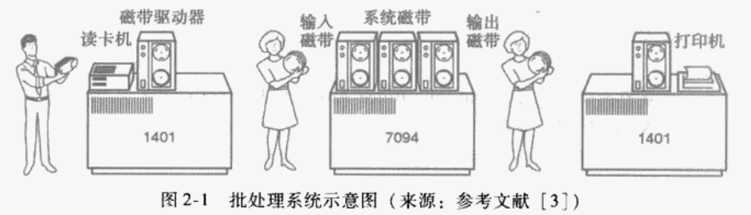

很显然，在批处理下，操作系统的功能和复杂性均得到提升。在SOSC环境下，每个用户自己控制程序的开始和结束。**而在批处理下，很多用户的程序一个接一个地存放在磁带上，用户本人并不在场，无法自己控制程序的开始和结束。而这个任务就交给了批处理操作系统**。负责这个任务的操作系统功能就称为批处理监视器（batch monitor）。整个批处理操作系统就是由批处理监视器和原来的操作系统库函数组成（见图2-2）。

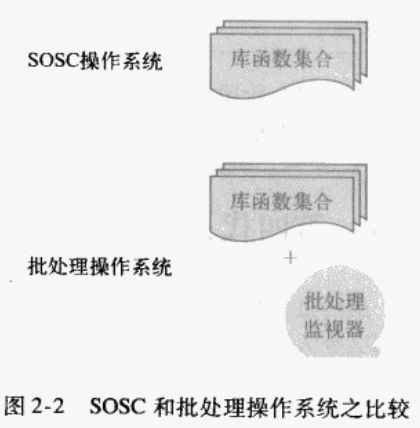

批处理监视器的功能就是按部就班地执行用户的程序。**这个时代的操作系统仍然只能在同一时间执行一个程序，但此时文件的概念已经出现**。之前在SOSC诞生时期没有文件的概念。为什么到批处理时期出现了文件图2-2 SOSC和批处理操作系统之比较的概念呢？因为磁带上的多个用户程序必须以某种方式进行隔离，这需要一个抽象的东西来区分一下。这个抽象的东西不是别的，就是文件。除了文件管理外，此时的操作系统还能够管理读卡机，磁带，打印机等。**此种操作系统的任务就是加载一个程序、运行、打印结果，然后执行下一个程序**。**批处理操作系统的两个部分的关系也很清楚：一部分是控制程序执行，一部分是支持程序执行**。

批处理操作系统的重要实例有IBM开发的FORTRAN监视系统FMS，用于IBM 709；IBM开发的基于磁带的工作监控系统IBSYS，用于IBM 7090和7094；密歇根大学开发的UMES（密根大学执行体系统），用于IBM7094。

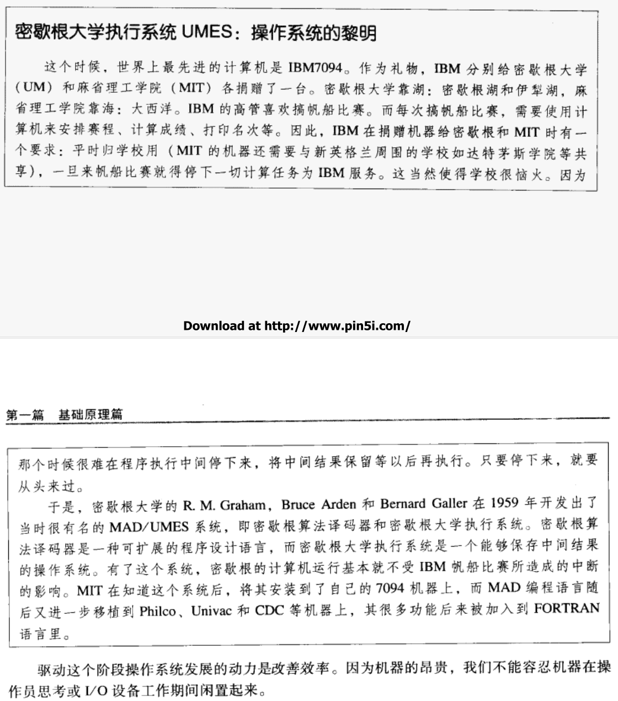

驱动这个阶段操作系统发展的动力是改善效率。因为机器的昂贵，我们不能容忍机器在操作员思考或I/O设备工作期间闲置起来。

## 第四代：多道批处理操作系统（20世纪60年代）

虽然批处理操作系统通过无需人机交互过程而在一定程度上提高了计算机的效率，但还是不那么令人满意。因为，**CPU和输入输出设备的运行是串行的，即在程序进行输入输出时，CPU只能等待**。CPU需要不断地探询I/O是否完成，因而不能执行别的程序。再看一遍图-1：**磁带上的程序需要先读进来，程序才能执行，执行完了又需要写到另一个磁带上。读写磁带的时候CPU是不工作的，这就是很大的浪费**。

这个时候，**由于I/O设备的运行速度相对于CPU来说实在太慢**，这种让高速设备等待低速设备的状况令人颇感痛心。人们又想，**能否将CPU和I/O进行并发呢**？即在一个程序输人输出时，让另一个程序继续执行。换句话说，能否将CPU运行和输人输出设备的运行重叠起来而改善整个系统的效率呢？答案是肯定的，不过需要付出代价。因为**CPU和I/O重叠需要我们将多个程序同时加载到计算机内存里，从而出现了所谓的多道批处理操作系统**。

在多道批处理操作系统时代，**同一时间可以运行多个程序（宏观上）**，但控制计算机的人还是只有一个，即用户将自己的程序交给计算机管理员，由管理员负责将用户的程序加载到计算机里并执行。**由于多个程序同时执行，操作系统需要能够在多个程序（工作）之间进行切换，并且能够管理多个输入输出设备，同时还需要能够保护一个进程不受另一个进程干扰**。显而易见，操作系统的功能和复杂性都比简单批处理时要复杂得多：**既要管理工作，又要管理内存，还要管理CPU调度**。

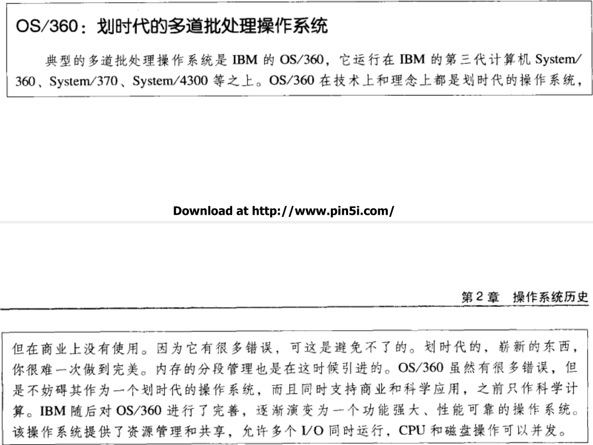

驱动这个阶段操作系统发展的动力仍然是改善效率。因为机器的昂贵，我们不能容忍机器（CPU）在VO设备工作期间闲置下来。同时，我们对计算机的要求也开始多起来。因此，这个阶段还伴随着对用户不断增长的要求进行满足。

## 第五代之一：分时操作系统（20世纪70年代）

多道批处理操作系统的出现使计算机的效率（主要是**吞吐率**）大大提高。不过这时人们又提出了另外一个问题：**将程序制作在卡片上交给计算机管理员统一运行，将使得用户无法即时获知程序运行的结果**。而这是一个大问题。想想如果你编了一个程序，却需要让别人去运行，并等上若干天才能知道结果，这个滋味显然不好受。万一计算机管理员疏忽了，忘记运行你的程序，或者操作错误，导致程序丢失，情况就更加糟糕。

基于上述考虑，人们就想，**能否让人回到计算机前面来，每个人自己管自己的程序，但是，大家的程序可以同时运转。人的因素又引了回来**。这看上去与原始的SOSC似乎一样，但有个关键的不同：**多个人同时连在计算机上，每个人看作是另外的一个I/O终端而已。每个用户拥有一个终端显示器，这些终端显示器经过RS232穿行线缆与计算机连接**。终端显示器只能接收和有限的发送文本命令和信息。**计算机在所有连接的终端用户之间进行分时，即分给每个人有限的时间，只要时间到了，就换一个进程。这种时分切换下的操作系统就是分时操作系统**。

**在分时操作系统下，任意时间可以运行多个程序，且用户直接与计算机交互，当场调试程序**。这就和单一操作员单一终端不一样了。就从人本转成物本。**单一操作员单一终端的情况下，一切等着人。以前执行一条命令就等人，分时系统是人等机器**。这个模型带来一个直接的结果，就是**机器再不用等你，等你想问题时机器就切换到别的程序，等你想完了机器再切换回来，接受你的输人**。就这样，计算机就在很多人之间来回转，你敲个命令就响应，然后切换走。如果时间掌握的好，用户输入完一个命令计算机正好回来，用户就没有等待的时间开销。当然，如果一个用户打字足够快，可能会觉得计算机慢；如果打字足够慢，就有可能觉得计算机很快。不同的人感觉有可能完全不同。

显然，和前面几代的操作系统相比，分时操作系统要复杂得多。相比于多道批处理系统，**最主要的变化是资源的公平管理**。**在多道批处理下，公平不公平没有人知道。大家交了工作后只管回家等结果。至于自己的程序排在谁前面谁后面，或者占用了多少CPU时间是无关紧要的**。现在，大家都坐在计算机显示终端前面，任何的不公平将立即感觉到。因此，公平的管理用户的CPU时间就变得非常重要。**除此之外，池化（pooling）、互斥、进程通信等机制相继出现，使得分时操作系统的复杂性大为增加**。

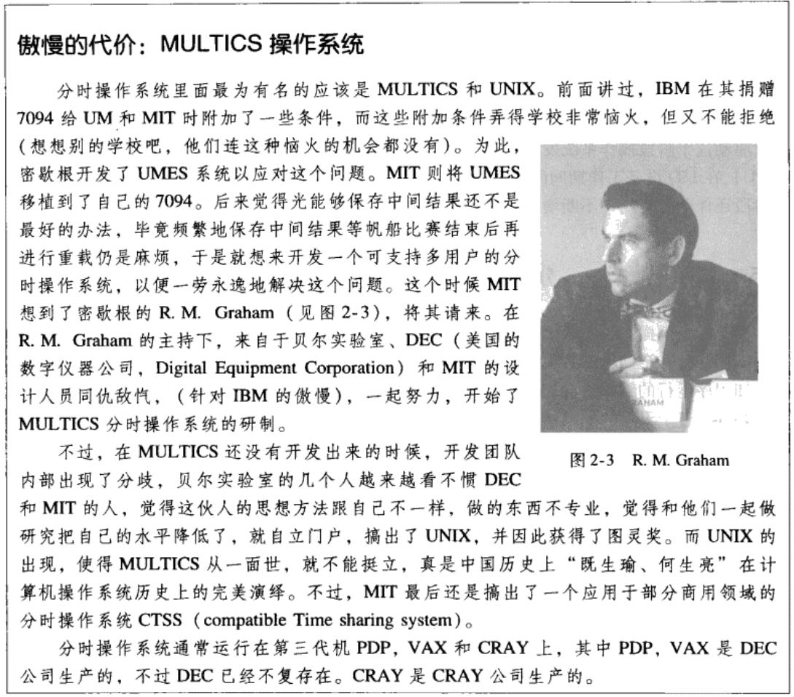

驱动这个阶段操作系统发展的动力是响应时间和对越来越多资源的管理。因为机器昂贵，我们不能容忍机器（CPU）在I/O设备工作期间闲置下来。同时，因为人的时间宝贵，我们不能容忍人们坐在机器前进行漫长的等待。因此，我们发明了分时操作系统来解决这两个问题。因为分时而引入的多道程序设计，又造成操作系统的空前复杂，我们需要应对竞争、通信、死锁、保护等一系列的新功能。因此，操作系统在本阶段变得相当复杂。

## 第五代之二：实时操作系统

随着人类技术的进步，计算机得到了广泛的应用。其中的一种应用称为进程控制系统，即使用计算机对某些工业进程进行监视，并在需要的时候采取行动。所有这些系统都具备一个特点：计算机对这些应用必须在规定时间内作出响应，不然就有可能发生事故或灾难 例如，在工业装配线上，当一个部件从流水线上一个工作站流到下一个工作站时，这个工作站上的操作必须在规定时间内完成，否则就有可能造成流水线瘫痪，影响企业的生产和利润，又例如，在导弹防卫系统中，对来袭导弹的轨迹计算必须在规定时间内完成，否则就可能被来袭导弹击中而无法作出反应。其他对计算机响应时间有要求的系统包括核反应堆状态监视系统、化学反应堆监视系统、航空飞行控制系统等。

这种**对计算机响应时间有要求**的系统通常称为**临界系统或应用**。为了满足这些应用对响应时间的要求，人们就开发出了实时操作系统。实时操作系统是指所有任务都在规定时间内完成的操作系统，即必须满足时序可预测性（timing predictability）。这里需要提请读者注意的是，实时系统并不是反应很快的系统，而是反应具有时序可预测性的系统。当然了，在实际中，实时系统通常是反应很快的系统，但这是实时系统的一个结果，而不是其定义。

显然，实时操作系统的最重要部分就是进程或工作调度。只有精确、合理和及时的进程调度才能保证响应时间。当然，对资源的管理也非常重要。没有精密复杂的资源管理，确保进程按时完成就成为一句空话。另外，基于其使用环境，实时操作系统对可靠性和可用性要求也非常高。如果在这些方面出了问题，时序可预测性将无法达到。

实时系统通常又分为**软实时系统**和**硬实时系统**。软实时系统在规定时间得不到响应所产生的后果是可以承受的，如流水装配线。即使装配线瘫痪，不就是损失点钱吗？而硬实时系统在得不到实时响应可能产生不能承受的灾难，如导弹防卫系统。如果反应迟钝，结果就可能是人命损失。

商业实时操作系统的代表有VxWorks和EMC的DART系统

## 第六代：现代操作系统（1980年以后）

在80年代后期，计算机工业获得了井喷式的发展。各种新计算机和新操作系统不断出现和发展，计算机和操作系统领域均进入到了一个百化齐放、百家争鸣的时代，尤其重要的是工作站和个人机的出现，使计算机大为普及。独享计算机也可以负担得起。这个时候的操作系统代表有：DOS，Windows，UNIX，Linux和各种主机操作系统.如vM，MVS，VMS等。DOS，Windows，UNIX，Linux通常称为开放式系统操作系统，分别运行在PC，VAX和工作站上。操作系统也重新回到子函数库的状态。

随着硬件越来越便宜，个人机出现在人们的视野中。人们可以拥有自己的电脑，无需与别的人分享。在刚刚出现个人机的时候，拥有个人机的人感觉很好，而那些需要与别人共享小型机的人则感觉不好。由于个人机由用户一个人独享，分时操作系统的许多功能就无需存在。因此，个人机操作系统又变回到了标准函数库系统。这个时候最有名的当然是DOS、Windows 3X、苹果机操作系统（MacOS）等。

但在独享了一阵个人机后，人们发现，没有分时功能的操作系统使一些事情做不了。因为，虽然只有一个人在用机器，但这个人可能想同时做好几件事，例如，同时运行好几个程序，没有分时功能这是不可能的。于是，人们觉得需要对个人机操作系统进行改善，将各种分时的功能义加了进去。

这时候就需要对程序进行保护，因为现在运行的多个程序，虽然都是你的东西，但是也不能混淆。于是，Windows NT出现了，Xenix出现了，Utrix出现了。

这个时候的另外一个特征是**网络的出现**。网络触发了网络操作系统和分布式操作系统的出现。对于网络操作系统来说，其任务是将多个计算机虚拟成一个计算机。传统的网络操作系统是在现有操作系统的基础上增加网络功能，而分布式操作系统则是从一开始就把对多计算机的支持考虑进来。

后来**分布式操作**系统出现了，因为网络出现了。我们现在虽然有很多电脑，但是很多处于闲置，这就是一个极大的浪费，我们希望空闲的都能利用起来。分布式计算出现的原因是希望把任务分开，得到的结果是计算资源的集合，这让很多计算机看上去像一个。**有两种分布式系统**，**一个是网络操作系统**，就是在传统操作系统上加一个补丁，**一个是分布式操作系统**。网络操作系统就是打补丁，分布式操作系统是重新设计的一套，所以比网络操作系统效率高。

## 操作系统的演变过程

计算机操作系统的演变可以从三条发展线索来看。这三条发展线索分别是主机操作系统、服务器操作系统和个人机操作系统。图2-4简略地画出了这三条线索上操作系统的演变历史。

图2-4最左面的三列代表主机操作系统的演变，最右面的两列代表个人机操作系统的演变，中间的列为服务器操作系统的演变。当然，到最后，这三大块的界限也不是很清楚。

主机操作系统的演变从输入输出控制系统IOCS和IBSYS开始，经历OS/360的里程碑式的突破，逐步演变为VS，MVS和VM三个系列（其中VM系列还吸取了UMES和CTSS的某些特征），目前IBM是这三个系列的开发商和运营商，其VM操作系统经历多代后已经变得十分可靠。美国大型金融证券公司都在使用它们。

服务器操作系统的演变从UMES开始，经CTSS演变为IBM的MVS和VM操作系统，经MULTICS演变为UNIX系统。在80年代初，UNIX一分为二：由AT&T（美国电话电报公司）提供的System系列和由UCB提供的BSD系列。XENIX是微软公司为PC机而移植的AT&T版的UNIX操作系统。AT&T是UNIX的鼻祖，UCB则在美国国防部的支持下开发了BSD（伯克利软件分配）系列。

IBM和斯坦福大学看到AT&T和UCB的UNIX软件后，也不甘示弱，分别研发了AIX和SUN OS（SUN是斯坦福大学网络Stanford University Networks的缩写）。这样UNIX就形成了4个系列：美国电话电报公司的System系列、国际商用机器公司的AIX系列、斯坦福大学网络的SUN OS系列和伯克利加州大学的软件分配BSD系列。

90年代中期，在美国国防部停止了对BSD的支持后，UCB停止了BSD系列，而AT&T也在与BSD焦头烂额的较量中放弃了System系列。LINUX则趁着AT&T和UCB忙于与对方较量的时候发展出来。卡内基梅隆大学（Carnegie Mellon University）在看到UCB和斯坦福都研发了UNIX，慌忙做了个MACH操作系统。MACH为微内核操作系统，在学术界得到了一定的使用，但由于其运行效率低下而没有获得商业上的广泛应用。这样UNIX的商业使用版本就剩下AIX，SOLARIS系列（SUN OS的后续）和LINUX系列。后来由于惠普公司（HP）加入到服务器行列使得UNIX家族又增加了一个版本：HP-UX，在UNIX家族里面，SUN公司濒临灭亡的命运令SOLARIS的前途堪忧。

个人机操作系统的演变可以说是从DOS开始的。微软在1980年以100美元的成本买断了DOS的版权。而DOS的功能很简单：文件没有文件夹，所有文件都在一个地方，谁都可以删除操作系统。当然那时候也没有那么多人从事破坏活动。在看到苹果的MacOS的图形界面后，微软给DOS增加了一个图形界面，称之为WINDOWS，WINDOWS在发展了几个版本后，到WINDOWS98时，微软改变了战略。因为到目前为止，所有的WINDOWS并不是真正的操作系统，而是覆盖在DOS上的一个用户图形界面，不能支持多道编程。微软高管比尔盖茨亲自打电话给DEC的David Cutler，请其过来主持新一代WINDOWS操作系统研发。

David Cutler是DEC公司VMS操作系统的主要设计人员。他从DEC带过来一批人到微软工作，设计出了WINDOWS NT操作系统。这是一个真正的支持多道编程的操作系统。WINDOWS NT继承了VMS的优良结构和WINDOWs 3x的图形界面，一推出就获得了市场的接受。WINDOWS NT经过几代演变，成为现在的WINDOWS Vista，WINDOWS操作系统系列也从单一的支持个人机演变为支持个人机和服务器的“双料”操作系统。

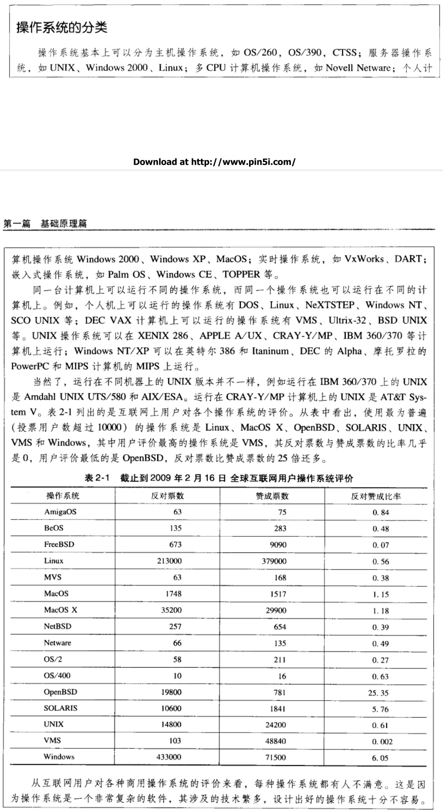

## 操作系统的未来发展趋势

随着计算机的不断普及，操作系统的功能会变得越来越复杂。在这种趋势下，操作系统的发展面临两个方向的选择：一是向微内核方向发展，二是向大而全的全方位方向发展。微内核操作系统虽然有不少人在研究，但在工业界获得认可的并不多。这方面的代表有MACH系统。

对工业界来说，操作系统是向着多功能、全方位方向发展。Windows XP操作系统现在有4000万行代码，某些Linux版本有2亿行代码，Solaris的代码行数也不断增多。鉴于大而全的操作系统管理起来比较复杂，现代操作系统采取的都是模块化的方式，即一个小的内核加上模块化的外围管理功能。

例如，最新的Solaris将操作系统划分为核心内核和可装入模块两个部分。其中核心内核又分为：系统调用、调度、内存管理、进程管理、VFS框架、内核锁定、时钟和计时器、中断管理、引导和启动、陷阱管理、CPU管理；可装入模块又分为：调度类、文件系统、可加载系统调用、可执行文件格式、流模块、设备和总线驱动程序等。

最新的Windows将操作系统划分成内核（kernel）、执行体（executive）、视窗和图形驱动、可装入模块。Windows执行体又划分为：VO管理、文件系统缓存、对象管理、热插拔管理器、能源管理器、安全监视器、虚拟内存、进程与线程、配置管理器、本地过程调用等。而且，Windows还在用户层设置了数十个功能模块，可谓功能繁多，结构复杂（见图2-5）。

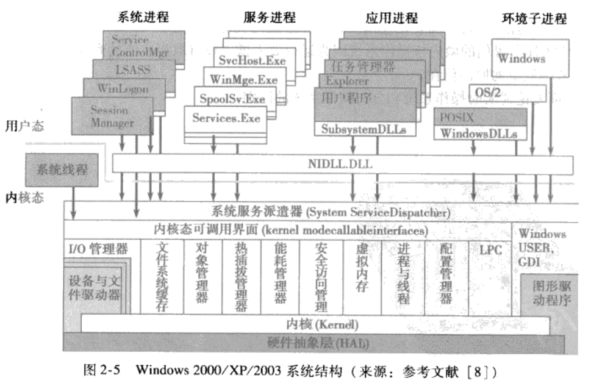

随着人们对信息安全重视程度的不断提升，如何构建可靠、可用和安全的操作系统将成为一个十分重要的课题。而对可靠、可用和安全的追求无疑将使操作系统更为复杂，操作系统的

规模也将不断增大。从UNIX的1400行代码到Windows XP的4000万行代码，这完全是一种爆炸性增长。而爆炸性增长的后果就是，没有什么人能够完全理解一个完整的操作系统，而这种状况又将限制操作系统的可靠、可用和安全性。当然了，人们可以采用各种软件1程的方法和手段来改善这种状况。但无论如何，持续的爆炸性增长恐怕是难以为继的。综上所述，不要预测将来。那就让我们所有关心操作系统的人拭目以待吧。

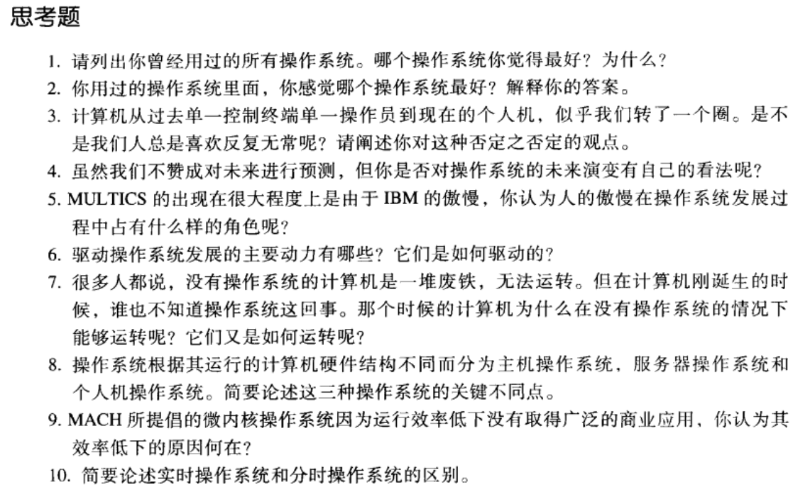

# 第3章：操作系统基本概念

**引子：“差不多”精神**

> 有一个小幽默也许读者听过，说是三个数学家和三个软件专家在一列火车上相遇。攀谈中，六个人发现大家都是参加同一个会议。然而让软件专家们吃惊的是，三个数学家只买了一张车票，而他们自己却各买了一张票。
>
> 三个软件专家于是问数学家：“你们三个人只买一张票，等会列车员查票你们怎么应付呢？"（这里需要指出的是，西方的火车站不查票，而是在车上查票。）
>
> 三个数学家回答说“这你们就不懂了吧。你们看好了，学习学习。”
>
> 过了不久，果然开始查票。只见三个数学家急急忙忙跑到厕所里面，将门从里面反锁上。查票员过来后敲打厕所的门，问里面有人吗。里面传来一个声音“有人，但正在上厕所，无法开门，能否将车票从门底下递出来给查票员检查？"这个时候厕所门下面递出来一张票。查票员看了没有任何问题，于是就离开了。
>
> 三个软件专家看完了这一幕，十分惊叹。心想，数学家就是比研究软件的人聪明，我们怎么从来没有想到这一招呢？于是，他们相约回程再同乘一次车。
>
> 过了几天，开完会后，六个人在回程途中又聚到一起。见面后，三个软件专家就迫不及待地告诉数学家们：“我们这次只买了一张票。你们是否也是只买了一张票？"
>
> 只见数学家们微笑着，不动声色地回答说：“我们这次没有买票。”
>
> 软件专家一听，不敢相信自己的耳朵。接着问道：“那你们这次怎么应付查票呢？"
>
> 数学家们丢下一句话“你们自己想吧。
>
> 软件专家想了半天，实在是想不出来有什么办法可以应付查票员。没有办法，只好硬着头皮来问数学家：“我们想不出来，你们告诉我们吧。”
>
> 数学家们仍然微笑着：“你们的脑袋不够用了吧。看我们再教你们一招。”
>
> 过了不久，查票开始了。三个软件专家急急忙忙跑到厕所里面，将门从里面反锁上。这时有人敲厕所的门，说查票了，里面有人没有。里面传来一个声音“有人，但正在上厕所，无法开门，能否将车票从门底下递出来检查？"这个时候厕所门下面递出来一张票。
>
> 门外的人接了车票，却再也没有递回来….

这个幽默对于学软件的人来说，也许不会感到很幽默。可对于学数学的人来说，听了后感觉很好、做软件的人认为是数学家挣钱挣不过他们，于是编造出这么个故事来，乘机阿Q一把。

不过沉下心来想一想，发现数学家的做法还真有点道理。这个道理不是别的，而是因为数学是严谨的学科，…切都以精确为追求（这里指纯数学，不包括那些不被认为是数学的应用数学）。而软件呢，却没有任何精确可言，是十足的“模糊”学科。因为，软件是一门人造学科，它没有对与错（这里指的是同一功能的不同实现，而不是说程序不可能出现错误），只有好与坏、我们设计软件的时候，也是觉得差不多就可以了，而没有什么精确的追求。

如果不信，就看看我们是如何分析算法的吧。我们使用所谓的渐近分析，将系数和非决定项都抛去了，所谓的“只要数量级对就差不多”。至于软件可靠性、健壮性和成本估算，那就更不用说了，连差不多都不如，而是差很多。

操作系统作为一种软件，自然也是差不多就可以了，其中的许多设计都是各种折中的结果，到处体现着差不多精神。读者在后面学习操作系统时只要留心观察，就会发现这些差不多的存在。而要理解这种“差不多”系统，自然需要抱着一种“差不多”的态度。如果一切吹毛求疵，学习操作系统会非常痛苦，也很难精确（不好意思，用了一次“精确”）把握操作系统的精髓。

令人欣慰的是，中国人自古就有“差不多”的思维逻辑，因此采纳“差不多”的态度对于中国人是很容易的事情。从这种角度看，学好操作系统是水到渠成的事情。（这里需要强调的是，作者并不是说计算机学科里面没有任何需要精确的时候，而是说在计算机学科里面体现“差不多”的地方非常多，以至于整个学科都带有某种“差不多”的精神）。

我们前面说过，操作系统是一个软件，它运行在硬件上，又为更加上层的应用软件提供服务。因此，对底层硬件的了解将帮助我们更好地把握操作系统。下面我们就从计算机硬件开始介绍，探讨一下操作系统的主要概念。

## 计算机硬件基本知识

从概念上讲，计算机的结构非常简单：首先布置一根总线，然后将各种硬件设备挂在总线上。所有这些设备都有一个控制设备，外部设备都由这些控制器与CPU通信。所有设备之间的通信均需通过总线，如图3-1所示。图中的粗线条为总线。

为了提高计算机的效率，人们又设计出了流水线结构，即仿照工业流水装配线，将计算机的功能部件分为多个梯级，并将计算机的每条指令分拆为同样多个步骤，使每条指令在流水线上流动，到流水线最后一个梯级时指令执行完毕。流水线上的每个梯级都可以容纳一条指令同时执行，如图3-2所示。

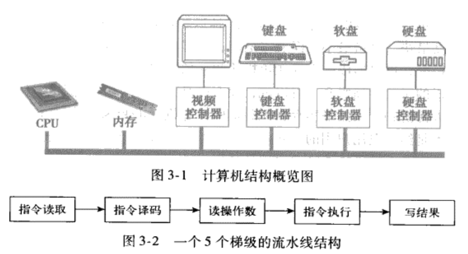

为了进一步提高计算机的效率，在流水线的基础上，人们又发明了多流水线、超标量计算和超长指令字等多指令发射机制。这些机制的发明在提升计算机效率（主要是吞吐量）的同时，也极大地增加了计算机结构的复杂性，并对操作系统和编译器都提出了更高的要求。

图3-3描述的是一个超标量发射的体系结构。这个结构有两队指令读取和译码单元，三个执行单元。通过一个指令保持缓冲区，就可以实现多路复用（multiplex）和反多路复用（de-multiplex），从而提高系统每个功能单元的利用率和整个系统的吞吐量。

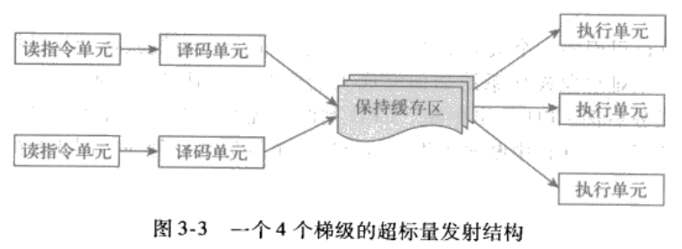

除了指令执行单元外，计算机里面的另一个重要部件是指令的存放单元，称为**存储架构**。

存储架构包括了缓存、主存、磁盘、磁带。有的情况下还存在多级缓存和外部光盘。图3-4描述的是一个包括寄存器的5级存储介质构成的存储架构。

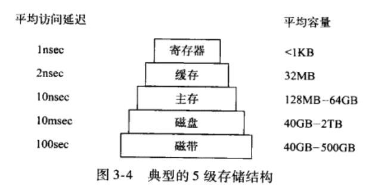

从寄存器到磁带，每一级的存储媒介的访问延迟和容量均依次增大，而价格却依次降低。

寄存器的访问速度最快，容量最小，但成本最高；磁带的访问速度最慢，容量最大，成本却最低。通过合理的搭配，可以形成一个性能价格比颇佳的存储架构。

磁盘是计算机的主要存储媒介。可以说，没有磁盘，计算机就不称其为计算机，或者说计算机的用处就要大打折扣。虽然确实存在无磁盘的计算机（diskless 计算机），但这些计算机都有特别之用，并不是给一般用户用的。磁盘从概念上看非常简单，每个磁盘有多块盘片，盘片两面都可以存储。图3-5描述的是典型的磁盘结构。

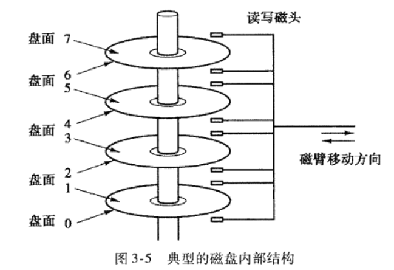

中断是计算机里面的一个最为重要的机制，它也是操作系统获得计算机控制权的根本保证。没有巾断，很难想象操作系统如何完成人们所赋给的任务。中断的基本原理是：设备在完成自己的任务后向CPU发出中断，CPU判断优先级，然后确定是否响应。如果响应，则执行中断服务程序，并在中断服务程序执行完后继续原来的程序。图3-6简单地描述了中断机制。

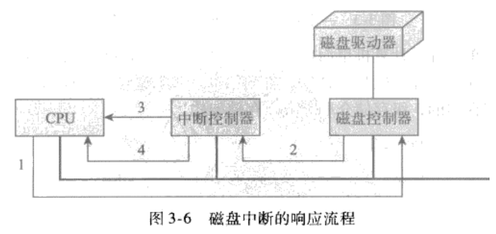

中断是很复杂的过程，中断处理过程中又可以发生中断，且还可以有所谓的软中断，即软件发出的中断。透彻理解中断对了解计算机操作系统的运行具有重要意义。因此，对中断机制不甚了解的读者请复习在计算机组成与体系结构课程中所学的中断内容。

## 抽象

我们已经多次提到过，操作系统提供的是一个抽象。所谓的抽象，就是在根本上存在但现实中不存在的东西。那么到底怎样理解抽象呢？

抽象来源于具体，但又超越具体。例如，人是具体的动物。但如果将人的具体属性，如肉体和骨架全部剥离，剩下的就是抽象，即人的灵魂。绘画史上有抽象派，而抽象画所表现的就是现实中不存在的东西，但这些东西确实又来源于现实，如瓦西里·康定斯基的“海战”（见图3-7）。

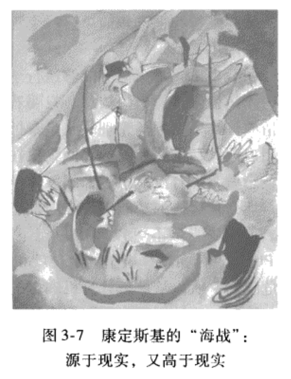

操作系统提供的抽象自然也来源于现实，就是具体的计算机硬件，CPU、内存、I/O设备等。但又超出这些现实，给人提供了强于现实的东西，使人和应用软件感觉到更多、更好的硬件存在，而且只有在操作系统层面上，一般的人才会觉得计算机是可以使用的。

另外，抽象不光是操作系统提供给用户的一个存在，它也存在于操作系统内部。操作系统内部分为不同的功能块，而不同的功能块之间互相提供的也是抽象。

## 内核态和用户态

就像世界上的人并不平等一样，并不是所有的程序都是平等的。世界上有的人占有资源多，有的人占有资源少，有的人来了，别人得让出资源，有的人则专门为别人让出资源。程序也是这样，有的程序可以访问计算机的任何资源，有的程序则只能访问非常受限的少量资源。而操作系统作为计算机的管理者，自然不能和被管理者享受一样的待遇。它应该享有更多的方便或特权。为了区分不同程序的不同权利，人们发明了内核态和用户态的概念。

那么什么是内核态，什么是用户态呢？只要想一想现实生活中，处于社会核心的人与处于社会边缘的人有什么区别就能明白处于核心的人拥有的资源多！因此，内核态就是拥有资源多的状态，或者说访问资源多的状态，我们也称之为特权态。相对来说，用户态就是非特权态，在此种状态下访问的资源将受到限制。如果一个程序运行在特权态，则该程序就可以访问计算机的任何资源，即它的资源访问权限不受限制。如果一个程序运行在用户态，则其资源需求将受到各种限制。

例如，如果要访问操作系统的内核数据结构，如进程表，则需要在特权态下才能办到。如果要访问用户程序里的数据，则在用户态下就可以了。

由于内核态的程序可以访问计算机的所有资源，这种程序的可靠性和安全性就显得十分重要。试想如果一个不可靠的程序在内核态下修改了操作系统的各种内核数据结构，结果会怎样呢？整个系统有可能崩溃。而运行于用户态的程序就比较简单了，如果其可靠性和安全性出了问题，其造成的损失只不过是让用户程序崩溃，而操作系统将继续运行。

很显然，内核态和用户态各有优势：运行在内核态的程序可以访问的资源多，但可靠性、安全性要求高，维护管理都较复杂；用户态程序访问的资源受限，但可靠性、安全性要求低，自然编写维护起来都较简单。一个程序到底应该运行在内核态还是用户态取决于其对资源和效率的需求。

一般来说，一个程序能够运行于用户态，就应该让它运行在用户态。只在迫不得已的情况下，才让程序运行于内核态。只要看看一个国家的治理就清楚了。我们拿什么标准来判断什么事情应该归国家领导管理。凡是牵扯到计算机本体根本运行的事情都应该在内核态下执行，只与用户数据和应用相关的东西则放在用户态执行。另外，对时序要求特别高的事情，也应该在内核态做。你有没有想过，国家领导出门怎么不塞车呢？

那么什么样的功能应该在内核态下实现呢？首先，CPU管理和内存管理都应该在内核态实现。这些功能可不可以在用户态下实现呢？当然能，但是不太安全。就像一个国家的军队（**CPU和内存在计算机里的地位就相当于一个国家的军队的地位**）交给老百姓来管一样，是非常危险的。所以从保障计算机安全的角度来说，CPU和内存的管理必须在内核态实现。诊断与测试程序也需要在内核态下实现。因为诊断和测试需要访问计算机的所有资源，否则怎么判断计算机是否正常呢？就像中医治病，必须把脉触摸病人。你不让中医触摸，他怎么能看病呢（当然，很多人认为中医是伪科学，根本治不了病，本书对此问题不做讨论）？输入输出管理也一样，因为要访问各种设备和底层数据结构，也必须在内核态实现。

对于文件系统来说，则可以一部分放在用户态，一部分放在内核态。文件系统本身的管理，即文件系统的宏数据部分的管理，必须放在内核态，不然任何人都可能破坏文件系统的结构；而用户数据的管理，则可以放在用户态。编译器、网络管理的部分功能、编辑器用户程序，自然都可以放在用户态下执行。图3-8描述的是Windows操作系统的内核态与用户态的界线。

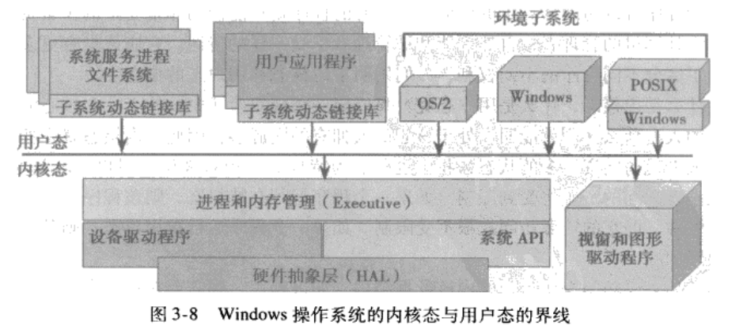

### 态势的识别

那么计算机是如何知道现在正在运转的程序是内核态程序呢？正确作出内核态或用户态的判断对系统的正确运行至关重要。显然作出这种判断需要某种标志。这个标志就是处理器的一个状态位。这个状态位是CPU状态字里面的一个字位。这就是说，所谓的用户态、内核态实际上是处理器的一种状态，而不是程序的状态。我们通过设置该状态字，可以将CPU设置为内核态，或者用户态，或者其他的子态（有的CPU有更多种子态）。一个程序运行时，CPU是什么态，这个程序就运行在什么态。

### 内核态与用户态的实现

前面说过，内核态是特权态，而用户态是普通态。特权态下运行的程序可以访问任何资源，而用户态下的访问则受到限制。那么这种限制是如何实现的呢？

显然，要限制一个程序对资源的访问，需要对程序执行的每一条指令进行检查才能完成。

而这种检查就是地址翻译。程序发出的每一条指令都要经过这个地址翻译过程。通过对翻译的控制，就可以限制程序对资源的访问。关于地址翻译的内容本书将在第11章详细阐述。为了给内核态程序赋予访问所有资源的特权，系统处于内核态时，内核程序可以绕过内存地址翻译而直接执行特权指令，如停机指令。这种绕过翻译的做法突破了系统对资源的控制。

本书在讲完进程和内存后，将再次讨论内核态与用户态的议题。

## 操作系统结构

操作系统的结构也和操作系统历史类似，经历了好几个阶段。在操作系统刚刚出现时，人们还没有意识到操作系统的存在，也没有将那些库函数称为操作系统。那个时候，人们想到什么功能，就把这个功能加进来，并没有对所有这些功能进行统筹兼顾的计划。自然，那个时候的操作系统也是杂乱的、无结构的。

随着操作系统的进化，人们对操作系统的认识逐步加深，操作系统慢慢变得有一些结构了。各种功能归为不同的功能块，每个功能块相对独立，又经过固定的界面互相联系。任意一个功能块可以调用另一个功能块的服务。整个操作系统本身是一个巨大单一体（monolithical system），运行在内核态下，为用户提供服务，如图3-9所示。

后来人们发现单一体的操作系统结构有很多缺点：功能块之间的关系复杂，修改任意功能块将导致其他所有功能块都需要修改，从而导致操作系统设计开发的困难；这种没有层次关系的网状联系容易造成循环调用，形成死锁，从而导致操作系统可靠性降低。这时候，人们想到了人类社会里面的层次关系，何不将人类熟悉的层次关系搬到操作系统设计里来，给操作系统也定义个层次关系呢？将操作系统的功能分成不同层次，低层次的功能为紧邻其上的一个层次的功能提供服务，而高层次的功能又为更高一个层次的功能提供服务。就像人类团体里面的结构：村长→镇长一县长，市长.…如图3-10所示。

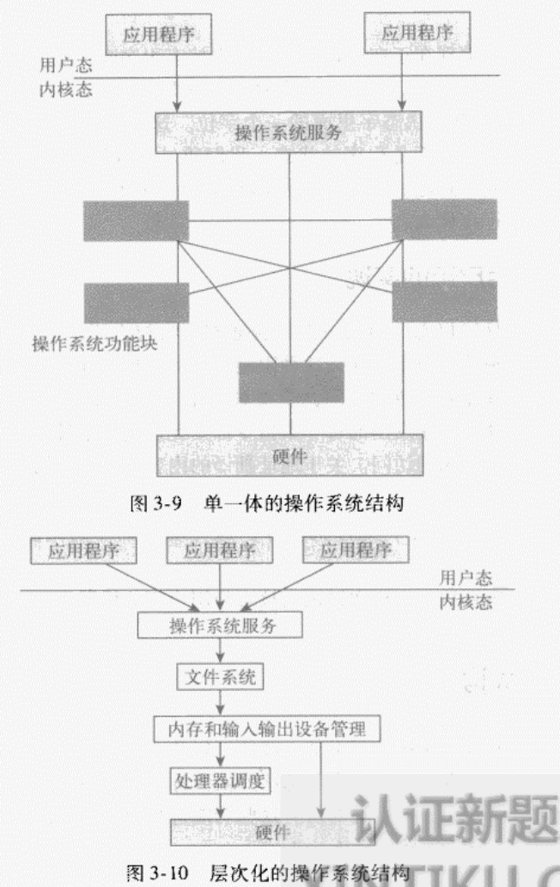

从图3-9和图3-10可以看出，操作系统的所有功能都在内核态下运行。而这带来几个问题。首先，操作系统的所有服务都需要进入内核态才能使用，而从用户态转换为内核态是有时间成本的，这样就造成操作系统效率低下。在操作系统还比较简单时这个问题并不突出，但随着操作系统功能和复杂性的增加，这种问题就十分明显了。

其次，我们前面说过，在内核态运行的程序可以访问所有资源，因此其安全性和可靠性要求十分高。在操作系统很小时，将其设计得可靠和安全不是特别困难。再说，在操作系统历史的早期没有出现那么多的安全问题，自然安全上的考虑就不用太多。但随着操作系统越来越大，破坏者的水平越来越高，操作系统的可靠性和安全性就变得很难达到。只要想一想，1400行的操作系统和40 000 000行的操作系统有什么区别就知道了。

因此，人们又想出了一个办法，就是微内核结构，即只将操作系统核心中的核心放在内核态运行，其他功能都移到用户态。这样就同时提高了效率和安全性（见图3-11）。

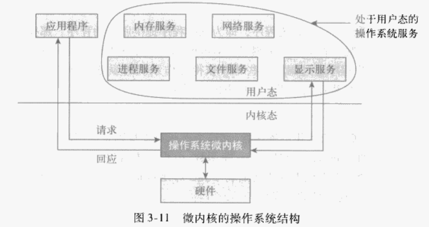

各种操作系统结构各有优缺点，但当前的趋势是第三种模式，即微内核的操作系统结构。

至于这个微内核到底有多“微”，则是仁者见仁、智者见智的。例如，美国卡内基梅隆大学开发的Mach操作系统的内核非常小，而微软的Windows XP的内核就大多了。

## 进程、内存和文件

进程是操作系统里面的核心概念。它指的是一个运动中的程序。从名字上看，进程表示的就是进展中的程序。一个程序一旦在计算机里动起来，它就成为一个进程。操作系统对进程的管理通过进程表来实现。进程表里存放的是关于进程的一切信息。在任何一个时候，进程所占有的全部资源，包括分配给该进程的内存、内核数据结构和软资源形成一个进程核（Core）。核快照（Core Image）代表的是进程在某一特定时刻的状态。

如果在Linux或UNIX下编程序，当出现分段错误（segmentation fault）时，操作系统会自动进行核倒出（core dump）。“核倒出”把所有计算机的状态保存在一个文件中，通过阅读这个文件的内容可以得知出界时的进程状况，从而帮助对程序的调试。

进程与进程之间可以进行通信、同步、竞争，并在一定情况下可能形成死锁。这些概念都将在第4章进行详细的阐述。

内存是操作系统里面的另一个核心概念。它是进程的存放场所。如何对内存进行管理，使得数据的读写具有高效率、高安全、高空间利用率和位置透明的特性是内存管理所要达到的目的。

文件是操作系统提供的外部存储设备的抽象，它是程序和数据的最终存放地点，如何让用户的数据存放变得容易、方便、可靠和安全是文件系统要解决的问题。

## 系统调用

我们说过，操作系统是一个系统程序，即为别的程序提供服务的程序。那操作系统的服务是通过什么方式提供的呢？答案是系统调用（system call）。系统调用就是操作系统提供的应用程序界面（API）。用户程序通过调用这些API获得操作系统的服务。例如，如果用户程序需要进行读磁盘操作，在C程序代码里将使用下面的语句：

~~~c
result =read (fd, buffer, nbytes);
~~~

这个read函数是C语言提供的库函数，而这个库函数本身则是调用的操作系统的read系统调用。注意这里有两个read，一个是read库函数，由程序语言提供；一个是read系统调用，由操作系统提供。编译器在看到上述语句后将read库函数扩展为read系统调用。在真正执行时，操作系统将完成上述文件的读操作。

系统调用按照功能可以划分为六大类：

* 进程控制类
* 文件管理类
* 设备管理类
* 内存管理类
* 信息维护类
* 通信类

系统调用一般不在操作系统原理的课程中论述，而是在操作系统编程或系统编程的课程中论述。这里我们简单说一下系统调用的过程。系统调用分为三个阶段，分别是：

* 参数准备阶段
* 系统调用识别阶段
* 系统调用执行阶段

在参数准备阶段，需要使用系统服务的程序将系统调用所需要的参数，如上述例子中的fd，buffer，nbytes，压到栈上。然后调用库函数read。库函数read将系统调用read的代码放在一个约定好的寄存器里，通过陷入（trap，一种中断方式）将控制交给操作系统。由此进入到第二个阶段。操作系统获得控制后，将系统调用代码从寄存器里取出，与操作系统维护的一张系统调用表进行比较，获得系统调用read的程序体所在的内存地址。之后跳到该地址，进入到第三个阶段，执行系统调用函数。系统调用执行完毕后返回到用户程序（见图3-12）。

### 系统调用中的参数传递

从图3-12可以看出，read系统调用的参数压入到栈里面，即参数传递是通过栈来进行。但这并不是唯一的参数传递办法。事实上，这还不是效率最高的传递方法。效率最高的方法是将参数存放在指定的寄存器里面。由于寄存器的访问速度高于栈，这种参数传递将可以提升系统调用执行的效率。例如，在x64体系结构下，最前面的8个参数由寄存器传递。只有超过8个参数时，超出的参数才通过栈来传递。

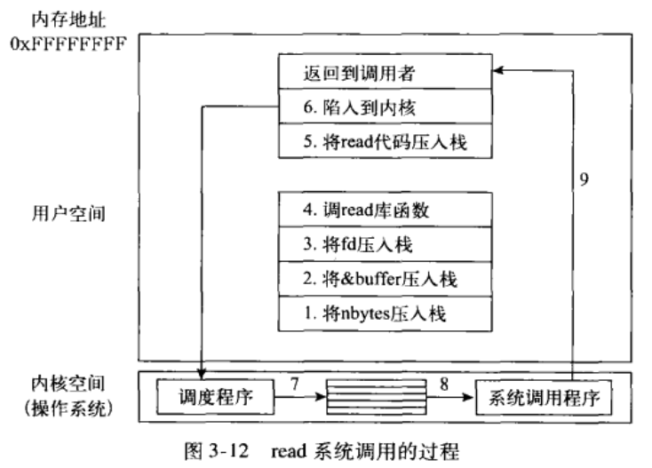

## 壳

[Shell是什么？1分钟理解Shell的概念！](http://c.biancheng.net/view/706.html)

前面一节说明了操作系统是如何给用户程序提供服务的。用户程序通过调用操作系统提供的系统调用API来获得操作系统的各种服务。但使用API需要编程。对于不编程序的用户来说，或对于需要与操作系统进行交互的用户来说，又怎么使用操作系统的服务呢？

为这些不编程的用户，操作系统提供了一个壳（shell），来与用户交互。每个操作系统都提供某种壳，以便与用户进行交互。这个壳是覆盖在操作系统服务上面的一个用户界面，既可以是图形界面，也可以是文本界面。用户在这个界面上输入命令，操作系统则执行这些命令。当然，用户输入的命令不是直接的操作系统服务，而是所谓的utilities，utilities的功用相当于c语言里面的库函数。因为用户不能直接调用系统调用（为什么不能呢？读者知道吗？），c语言提供了库函数来解决这个问题。

同理，在壳上用户也不能直接使用操作系统的服务，而是通过Utilities来获得操作系统服务。

UNIX和Linux的壳都是文本形式，而Windows的壳是图形界面的。在UNIX和Linux里，要启动一个壳只需要运行shel1即可。在Windows里面，要启动壳需要执行explore.exe。在Linux和UNIX下可以同时启动多个壳，而在Windows下只能启用一个壳。2006年，微软推出了Powershell，从此改变了在Windows下只能启用一个壳的限制。Powershell是一个文本命令壳，可以运行在Windows XP SP2，Windows Server 2003，Windows Vista和Windows Server 2008上。Pow ershell提供了一种类似于UNIX和Linux上utilities的东西，称作cmdlets。用户通过键入cmdlets里面不同的命令而指挥计算机进行各种操作。

一个壳的具体功能包括如下几项：

* 显示提示符，如UNIX下的提示符通常为s和%。
* 接受用户命令并执行。
* 实现输人输出间接（或间接输入输出）。
* 启动后台进程。进行工作控制。提供伪终端服务。

例如：我们可以在UNIX shell上执行下述命令：

~~~
键入：$ date
显示：$ September 16，2008
~~~

我们还可以进行输出间接（或间接输出）：

~~~
键入：$ date >file
显示：
~~~

上述命令行里面的`“>"`符号是间接符合，将输出从显示屏转移到了文件file。如果打开文件file，里面的内容将是September 16，2008。

我们还可以同时进行输入和输出间接（或间接输入输出）：

~~~
$sort <filel >file2
~~~

上述命令将filel里面的内容进行排序，然后将排序后的结果存放在文件file2里。

我们还可以将输出间接发送到打印机：

~~~
cat filel file2 file3 > /dev/1pl
~~~

上述命令将file1、file2、file3里面的内容进行连接，然后将结果发送到打印机1pl上打印。

我们还可以启动后台程序：

~~~
$ make all >log &
~~~

上述命令启动一个编译后台程序，将编译的结果输出到文件1og里。

那么壳是怎么实现的呢？下面是一个最为简单的壳，UNIX Shell：

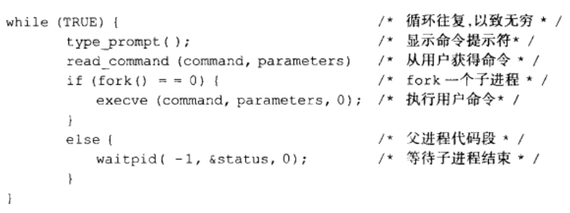

这个壳一旦启动，就循环往复直到无穷。它所做的事情很简单：
1）显示命令提示符。

2）等待用户输入命令。

3）使用fork创建一个子进程。

4）使用execve在创建的子进程里执行用户输入的命令。

5）重复步骤1）-4）。

上述程序片断里的fork和execve均为UNIX操作系统提供的系统调用。fork的功能是创建一个子进程，并将自己的一切数据复制到子进程里，也就是说，fork完成的实际上是自我复制。execve的功能是用另外一个程序的内容覆盖自己，即执行新的程序。

这里值得一提的是，在上述程序代码里，fork命令有两次返回：一次返回值为0，表明是子进程（创建的新进程），对应if-else复合语句的if部分；另一次返回值不是0，表明是父进程，对应if-else复合语句的else部分，而这个返回值就是子进程的进程ID，也就是说，复合语句if-else的if和else部分在fork完成后都将执行。这听上去奇怪吗？

如果奇怪，那是因为你看到的是一个程序。我们知道，在一个程序里，if-else语句的if和else两个部分只能有一个部分执行，而不能两个部分同时执行。我们还知道，一个函数是无法返回两次的。因为你只要写了return，后面的语句就不能再执行了。那么fork命令为什么能返回两次呢？

这是因为fork的特殊功能使然。fork的功效是创建一个和自己完全一样的进程。在fork系统调用完成后，我们面对的是两个进程，而不再是一个进程。这两个进程的程序代码完全一样，就是我们上面给出的代码。在其中一个进程中，执行的是if部分，在另一个进程中，执行的是else部分。因此，从每一个进程内部来看，复合语句if-else的语义并没有破坏。

而且，既然在fork后有了两个拷贝，那么每个拷贝里都有同样的fork调用语句。从另一个角度讲，有两个程序调用了fork，这两次调用都需要返回。从内存结构看，这两个程序拷贝或者进程都有自己的调用堆栈，并都有调用返回的位置。对于每一个进程来说，它调用了一次fork，获得了一次返回。因此，从每个进程内部看，函数返回一次的语义也得到遵守。

那么系统中的两个一模一样的进程如何区分彼此呢？简单，给每个进程一个不同的返回值即可。返回给父进程的是子进程的进程ID，对应else部分；返回给子进程的是0，对应if部分。

本章论述了操作系统的基本概念。这些概念是为下一步的进程、内存、文件和输入输出等章节的学习打下基础。在这些概念里面，最为关键的是内核态和用户态的定义极其关键。当然，抽象是操作系统的根本，而系统调用和操作系统结构也非常重要。

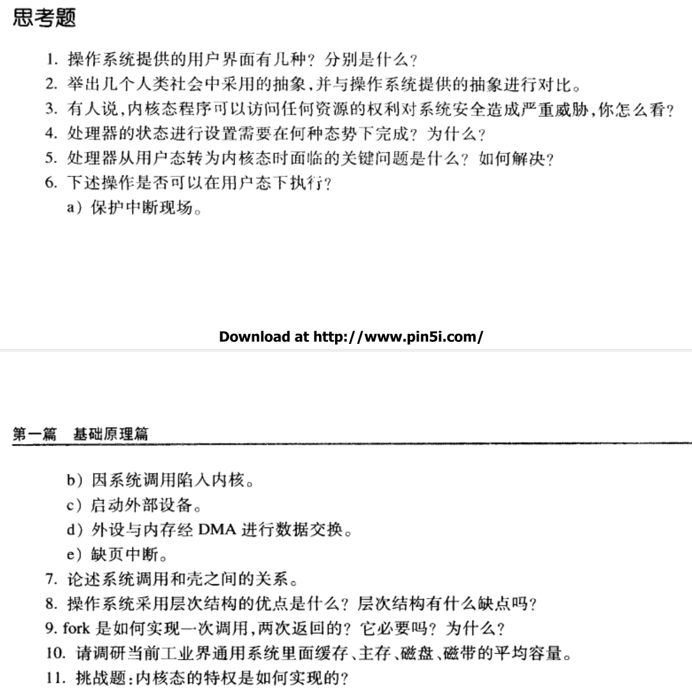

# 第一篇：进程原理篇

[一文搞懂并发和并行](https://segmentfault.com/a/1190000012754925)

> 并发是两个队列交替使用一台咖啡机，并行是两个队列同时使用两台咖啡机，如果串行，一个队列使用一台咖啡机，那么哪怕前面那个人便秘了去厕所呆半天，后面的人也只能死等着他回来才能去接咖啡，这效率无疑是最低的。
>
> 有评论里说，并发是不是一个线程，并行是多个线程？
>
> 答：并发和并行都可以是很多个线程，就看这些线程能不能同时被（多个）CPU执行，如果可以就说明是并行，而并发是多个线程被（一个）CPU轮流切换着执行。

> 保姆（并发系统）喂2个孩子（多个线程）吃饭（多个动作），你的代码逻辑要让主人觉得2个孩子都在吃饭（有并行的潜力）；如果保姆只有一个人（单核），只能轮换（串行、交替）着每人喂一口，表面上（逻辑上）2个孩子都（“同时”，并发）在吃饭；如果保姆有两个（多核）甚至两个以上，就是两个人各自（并行）喂1个孩子，2个孩子也同时（物理上真正的同时）在吃饭。“并行”概念是“并发”概念的一个子集：并行是并发在多核处理器上的物理实现；交替串行是并发在单核处理器上的物理实现

有了基础原理篇的铺垫，我们就可以进入到操作系统核心功能部伴的讲解了。

计算机，顾名思义，是用来进行计算的。而进行计算的关键部件是计算机的芯片。即CPU。CPU能够按照一定的顺序进行正确计算是在一个指挥者的控制之下完成。这个指挥者就是操作系统。而操作系统对CPU进行管理和施行魔法的手段就是进程和线程。对进程和线程这些施法道具进行阐述对理解操作系统自然十分重耍。对其进行管理也就理所当然地成为操作系统的一个关键职费。本篇即对进程和线程进行详细讨论。

本篇内容繁多，包活第4章至第10章内容。第4章阐述的内容包括进程出现的逻辑必然性、多道编程的效率、进程的创建和消亡、进程的状态及其转换、进程与地址空间、进程管理和进程模型的缺陷。第5章讲解的内容包括线程、线程管理、线程的用户态、内演鑫和混合态实现。现代操作系统的饯程实现模型、多线程之间的类系、线程主要考虑的问题。第6章的内容包括为什么要通信、管道、记名管道、套接字、信号、信号量、共享内存、消息队列等。第7章的内容包括为什么同步、同步的目的。锁原语的进化、睡觉与叫醒原语、信号量、管程、消息传递和栅栏。第8章讲解的内容包括调度的目标、先来先服务、时间片轮转、短任务优先、优先级调度、混合调度、实时调度等算法。并对优先级倒挂和线程的不确定性进行讨论。第9章讲述如何使用中断启用和禁止、测试与设置来实现锁原语。第10章对死锁的产生、发展。防止与避免进行评解，并讨论死锁、活锁和饥饿的关系。

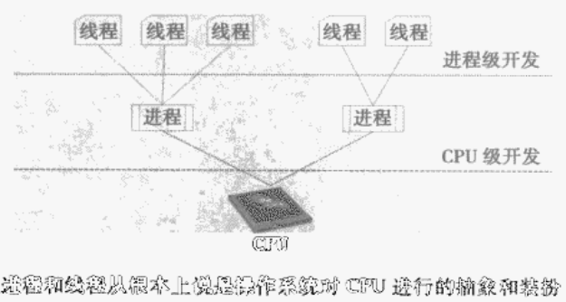

本篇最重要的内容是**并发**。因为要并发。我们发明了进程，又进一步发明了线程。

只不过进程和线程的并发层次不同：进程属于在处理器这一层上提供并发的抽象；线程则属于在进程这个层次上再提供一层并发的抽象。如果我们进入计算机体系结构里，就会发现，流水线提供的也是一种并发。不过是指令级并发。这样，**流水线、线程、进程**就从低到高在三个层次上提候我们所迫切需要的并发！

# 第4章：进程

[我是一个进程](https://mp.weixin.qq.com/s?__biz=MzAxOTc0NzExNg==&mid=2665513283&idx=1&sn=4e5ea6d64a7687d1ddee20fe7de947c1&scene=21#wechat_redirect)

[进程与线程的一个简单解释](https://www.ruanyifeng.com/blog/2013/04/processes_and_threads.html)

**引子：**

> 在艾德蒙德哈雷的耐心劝说和敦促下，牛顿（见图4-1）著下了其传世名作《自然哲学的数学原理》（Philosophiae Naturalis Principia Mathematica，一部包含牛顿经典力学和万有引力定律的物理学著作）。在完成此书后，一种困惑始终挥之不去。牛顿写完书尾的总揽后对他的朋友哈雷感叹道：“一切物体的运动规律，天上的、地上的，我已经全部、完美地阐述清楚了。但一个一直困惑我的问题是：这些规律是从何而来的？或者说这些太空中的天体、地上的物体为什么会遵守这些规律呢？它们如果不遵守这些规律，难道我们还能把它们怎么样不成？”

> 如果这些规律是随着时间与整个宇宙一起进化或演变的，则在进化到一半的时候，即在这些规律既是规律，又不是规律，或者说还是“半规律”时，宇宙是何以存在的呢？我们知道天体的运行轨道只要偏离一点，其存在就有可能大成问题，如果很多天体都随机运动，则后果将不堪设想。
>
> 因此，按照“半规律”存在的宇宙是不可想象的。
>
> 剩下的唯一推论就是，这些规律在宇宙出现的一刹那就完美地存在了。或者更为直白地说，这些规律在宇宙存在之前就已经存在了。而这与约翰福音里的“太初有道（In the beginning wasthe word）”不谋而合。这里的word是希腊语原文logos的英文翻译。而logos就是逻辑，就是规律。这句话的意思是在还没有宇宙的时候，规律就已经存在了。
>
> 而由于规律本身不是物质，其存在自然是无中生有了。至于是谁或者什么导致这些规律的存在，那就留给读者自己去遐思了……
>
> 本章讨论的进程也是无中生有。这点与宇宙的运行规律有一些相似。不过与宇审规律不同的是，我们知道是谁导致了计算机中进程的出现：是人！
>
> 当人们面临困境时通常的做法就是：发明新的概念、新的术语或新的机制来解脱闲境。

## 进程概论

> 进程就好比工厂的车间，它代表CPU所能处理的单个任务。任一时刻，CPU总是运行一个进程，其他进程处于非运行状态。
>
> 线程就好比车间里的工人。一个进程可以包括多个线程。

进程管理、内存管理和文件管理是操作系统的三大核心功能。那么什么是进程呢？顾名思义，进程就是进展中的程序，或者说进程是执行中的程序。就是说，一个程序加载到内存后就变为进程。即：

~~~
进程 = 程序 + 执行
~~~

进程在Multics操作系统出现前叫做工作（job）。“工作”是IBM用于多道批处理程序设计中的概念。由于历史的原因，Multics操作系统的研发人员不愿意承用IBM发明的术语，将工作改为了进程（process）。那么进程出现的动机是什么呢？

本书在第2章说过，单一操作员单一控制终端、批处理均存在效率低下的问题，即CPU使用率不高。为了提高CPU利用率，人们想起**将多个程序同时加载到计算机里，并发执行，这些同时存在于计算机内存的程序就称为进程**。进程让每个用户感觉到自己独占CPU。因此，进程就是为了在CPU上实现多道编程而出现的概念，如图4-2所示。

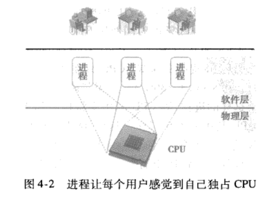

> 可以这么理解：CPU是个渣男，3个进程都是他的女朋友，渣男比较擅长时间管理，脚踏三条船，
>
> 导致这3个女朋友之间都不知道对方的存在，每个人都以为自己是渣男的唯一的女朋友。

## 进程模型

那么进程到底是个什么东西呢？什么是进展中的程序呢？**从物理内存的分配来看**，每个进程占用一片内存空间，从这点上说，进程就是内存的某片空间。由于在任意时刻，CPU上只能执行一条指令，所以任意时刻上在CPU上执行的进程只有一个，而到底执行哪条指令由物理程序计数器指定。也就是说，**在物理层面上**，**所有进程共用一个程序计数器**。

而**从逻辑上来看**，每个进程可以执行，也可以暂时挂起让别的进程执行，之后又可以接着执行。这样，进程就需要某种办法记住每次挂起时自己所处的执行位置，这样才能在下次接着执行时从正确的地点开始。因此，从这个角度看，每个进程有着自己的计数器，记录自己下条指令所在的位置。**从逻辑上说，程序计数器可以有很多个**。

而**从时间上看**，每个进程都必须往前推进。在运行一定的时间后，进程都应该完成了一定的工作量，即每次进程返回，它都处在上次返回点之后。这就像古希腊哲学家赫拉克里特说过的“一个人不能两次踏入同一条河流。”进程的这三种概念可以由图4-3表示。

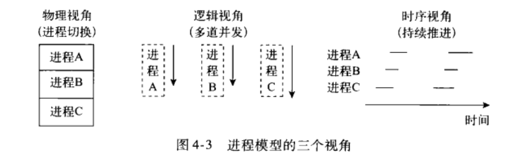

这里需注意的是，进程不一定必须终结。事实上，许多系统进程（用来为别的进程提供系统服务的进程）是不会终结的，除非强制终止或计算机关机。

## 多道编程的效率

我们发明进程是为了多道编程，而多道编程的目的则是提高计算机CPU的效率，或者说是系统的吞吐量。例如，如果一个进程用20%的时间使用CPU进行计算，另外80%的时间用来进行VO，则如果使用单道编程，CPU的利用率只有20%。但如果同时运行两个这样的进程，即进行所谓的2道编程，则CPU利用率将提高到36%（CPU只在两个进程同时进行VO时才处于闲置状态，因此CPU利用率为1-0.8×0.8=36%）。这里忽略了进程切换所需要的系统消耗。

同理，如果同时运行3个这样的进程，则CPU利用率将提高到48.8%。4个进程的CPU利用率将为59%，5个进程的CPU利用率为67.2%。这样，随着进程数量的增加，也就是随着多道编程的度的增加，CPU利用率将逐步提升，直到某个临界点时为止。这个临界点就是多道编程的极限。超过这个极限，多道编程的好处将逐步消失，甚至呈下降趋势。对于我们这个系统来说，多道编程的度达到6以后，CPU利用率的提升就很小了，而进程切换所带来的系统消耗则变得明显。多道编程的度与CPU效率的关系，如图4-4所示。

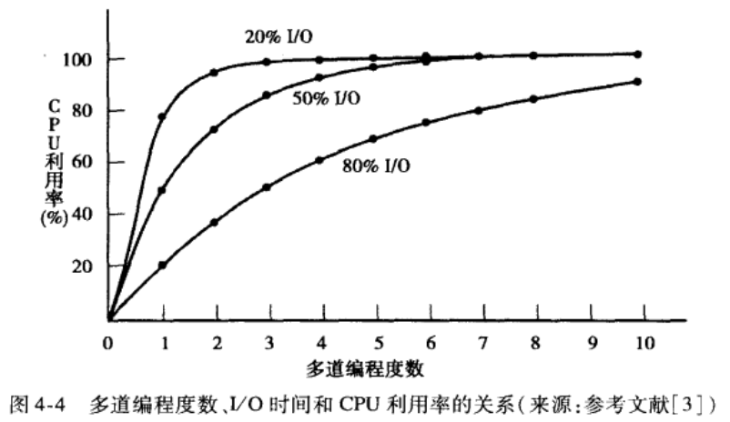

下面我们通过一个多道编程的具体例子，来看看多道编程时计算机里面事件的发生顺序和多道编程环境下系统响应时间的提升。

假定我们有4个程序，每个程序花费80%的时间进行VO，20%的时间使用CPU。每个程序的启动时间和其需要使用CPU进行计算的分钟数如表4-1所示。

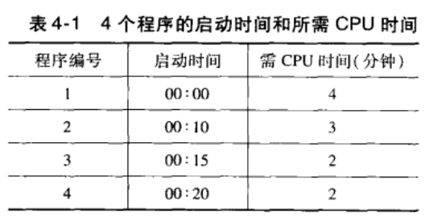

下面我们看看该计算机里面事件的发生顺序。

从0点0分开始到0点10分，系统里只有1个程序，因此属于单道编程状态。单道编程时CPU的利用率为20%，因此第1个程序在该10分钟里总共使用了CPU达2分钟（其他8分钟都用来进行I/O了）。0点10到0点15分钟，系统里有两个程序，因此属于2道编程。我们前面计算过，2道编程时CPU利用率为36%，则在该5分钟时间内，CPU使用了1.8分钟。假定这两个程序完全平等，则每个程序使用CPU的时间为0.9分钟。至此，程序1总共运行了2.9分钟CPU时间，程序2运行了0.9分钟CPU时间。

从0点15分开始到0点20分，系统里有3个程序，因此属于3道编程状态。3道编程时CPU的利用率为48.8%，则在这5分钟时间内，CPU被占用了大约2.4分钟（其他2.6分钟都用来进行VO了）。同样，假定所有程序完全平等，则每个程序使用CPU的时间为0.8分钟。至此，程序1总共运行了3.7分钟CPU时间，程序2运行了1.7分钟CPU时间，程序3运行了0.8分钟CPU时间。此时，程序1离结束所需要的CPU时间最短，仅为0.3分钟。

从0点20分开始，系统里有4个程序，因此属于4道编程。我们前面计算过，4道编程时CPU利用率为59%。而如果程序1想再运行0.3分钟CPU时间，则整个系统需运行时间约为2分钟（2分钟时间内CPU共被使用1.2分钟，平均每个程序使用CPU时间为0.3分钟）。因此，在0点22分时，第1个程序执行完毕，系统变为3道编程。

此时，程序1结束，程序2总共运行了2分钟CPU时间，程序3运行了1.1分钟CPU时间，程序4则运行了0.3分钟CPU时间。此时，程序3离结束所需的CPU时间最短，为0.9分钟。那么系统需要运行多长时间才能使程序3获得0.9分钟的CPU时间呢？答案是5.6分钟。因为3道编程的CPU利用率大约为48%，而5.6分钟内CPU的使用时间约是2.7分钟。三个程序平分，每个程序运行了0.9分钟CPU时间。因此，到0点27.6分钟时，系统里只剩下两个程序。

而在1.6分钟后，即0点28.2分钟时，程序2将结束运行，剩下程序4一个程序。而该程序则在0点3l.7分钟时结束运行。整个事件发生顺序，如图4-5所示。

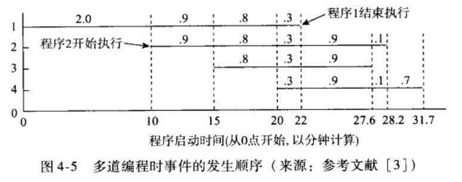

在多道编程环境下，4个程序和整个系统的响应时间为：

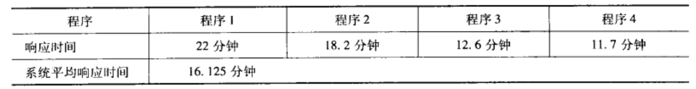

而在单道编程环境下，4个程序和整个系统的响应时间为：

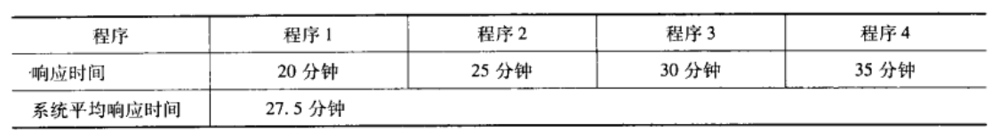

由上述两个表格的数据看出，多道编程比起单道编程，系统平时响应时间缩短了11.375分钟，响应时间减少了41.37%。由此可见多道编程的巨大好处。

当然了，多道编程带来的好处到底有多少与每个程序的性质、多道编程的度数、进程切换消耗等均有关系。但一般说来，只要度数适当，多道编程总是利大于弊。

## 进程的产生和消失

什么事件可以造成进程的产生和消亡呢？当然有很多这样的事件。对于进程产生来说，主要的事件有：

* 系统初始化（神创造人）。
* 执行进程创立程序（人生子）。
* 用户请求创立新进程（试管婴儿）。

在一个系统初始化时，将有许多进程产生。这些产生的进程是系统正常运行必不可少的。

这些进程的存在使得新的进程和用户程序的执行成为可能。例如：在系统初始化后，Windows操作系统将自动产生诸如对话管理（SMSS）、登陆管理（WINLOGON）、安全管理（LSASS）、Windows子系统（CSRSS）、Windows壳（explore）等系统进程。

在系统初始化后，系统就等待用户输入命令。如果这个用户启动一个程序，如双击一个可执行文件，那么系统将为这个可执行文件创立一个进程。除此之外，用户也可以在程序里面通过系统调用，如fork 或者CreateProcess直接生成新的进程。

造成进程消亡的事件则可以分为四种情况：

* 寿终：进程运行完成而退出。
* 自杀：进程因错误而自行退出。
* 他杀：进程被其他进程强行“杀死”。
* 处决：进程因异常而强行终结。

前面两种情况均为自愿退出，后面两种情况均为非自愿退出。在程序设计时我们追求的是前面两种退出，也算是我们在虚拟世界里面追求人权（进程权）的努力吧。第3种情况通常是一个父进程发出命令“杀死”一个子进程。当然，一个用户也可以“杀死”自己的进程，但不能“杀死”别人的进程。但一个超级用户（具有系统管理员特区）则可以“杀死”任何进程。第4种情况在一个进程进行某种非法操作，如访问出界或者除以0之后发生，而这种非法操作将被操作系统捕捉。操作系统捕捉到这种异常后将终结造成异常的进程。

## 进程的层次结构

我们说过，一个进程在执行过程中可以通过系统调用创建新的进程。这个新创建出来的进程就称为子进程，创建子进程的进程则称为父进程。子进程又可以再创建子进程，这样子子孙孙创建下去就形成了所谓的进程树。UNIX称这个进程树里面的所有进程为一个进程组，进程组里面的进程分布在不同的层次上，从而形成一个层次架构。
Windows没有进程组的概念，而是所有进程均地位平等。

[子进程和线程的区别](https://blog.csdn.net/ctthuangcheng/article/details/8508820)

> 1、相同点：
> （a）二者都具有ID，一组寄存器，状态，优先级以及所要遵循的调度策略。
> （b） 每个进程都有一个进程控制块，线程也拥有一个线程控制块。
> （c） 线程和子进程共享父进程中的资源；线程和子进程独立于它们的父进程，竞争使用处理器资源；线程和子进程的创建者可以在线程和子进程上实行某些控制，比如，创建者可以取消、挂起、继续和修改线程和子进程的优先级；线程和子进程可以改变其属性并创建新的资源。
>
> 2、不同点：
> （a） 线程是进程的一部分, 一个没有线程的进程是可以被看作单线程的，如果一个进程内拥有多个进程，进程的执行过程不是一条线（线程）的，而是多条线（线程）共同完成的。
> （b） 启动一个线程所花费的空间远远小于启动一个进程所花费的空间，而且，线程间彼此切换所需的时间也远远小于进程间切换所需要的时间。 
> （c）系统在运行的时候会为每个进程分配不同的内存区域，但是不会为线程分配内存（线程所使用的资源是它所属的进程的资源），线程组只能共享资源。对不同进程来说，它们具有独立的数据空间，要进行数据的传递只能通过通信的方式进行，这种方式不仅费时，而且很不方便。而一个线程的数据可以直接为其他线程所用，这不仅快捷，而且方便。
> （d） 与进程的控制表PCB相似，线程也有自己的控制表TCB，但是TCB中所保存的线程状态比PCB表中少多了。
> （e） 进程是系统所有资源分配时候的一个基本单位，拥有一个完整的虚拟空间地址，并不依赖线程而独立存在。
>
> 举个例子：
>
> 进程和线程的区别在于粒度不同, 进程之间的变量(或者说是内存)是不能直接互相访问的, 而线程可以, 线程一定会依附在某一个进程上执行.我举个例子, 你在Windows下开一个IE浏览器, 这个IE浏览器是一个进程. 你用浏览器去打开一个pdf, IE就去调用Acrobat去打开, 这时Acrobat是一个独立的进程, 就是IE的子进程.而IE自己本身同时用同一个进程开了2个网页, 并且同时在跑两个网页上的脚本, 这两个网页的执行就是IE自己通过两个线程实现的.值得注意的是, 线程仍然是IE的内容, 而子进程Acrobat严格来说就不属于IE了, 是另外一个程序.之所以是IE的子进程, 只是受IE调用而启动的而已.
>
> Linux系统的实现打破了纯粹的进程与纯粹的线程之间的差异。
> 在Linux系统下二者是本质一致的。
>
> 附其他：windows下，当你设计一个应用程序时，你可能想使用一些需要长时间运行的代码，而又不中继当前正在进行的工作。一个方法是使用线程，将这个工作交由一个线程去执行，如果这些代码在运行过程中发生了错误，它可能会影响所在进程空间的所有线程。第二个方法是建立一个子进程，由这个子进程完成所需工作，这样子进程代码的错误不会影响到父进程的执行。
>
> 
>
> 子进程与父进程之间可以通过动态数据交换（DDE）、OLE、管道、邮件槽等进行通信，使用内存映射文件是最便利的方法之一。
>
> 当前子进程终止后，子进程句柄变为有信号，父进程可使用 WaitForSingleObject 来等待子进程退出，这样父进程就可使用 GetExitCodeProcess 来获得子进程的退出码。

## 进程的状态

我们前面说过，进程可以在CPU上执行，也可以处于挂起状态。显然，一个进程至少有这么两个状态。那么进程还有别的状态吗？

如果进程在CPU上执行，自然就是执行状态。而如果是挂起状态呢？那就得看是什么原因挂起的。因为操作系统在进行进程调度时要从挂起的进程里面选择一个来执行，所以清楚一个进程挂起的原因对调度的有效推进十分重要。

那么进程挂起有什么原因呢？**首先**是一个进程在运行过程中执行了某种阻塞操作，如读写磁盘。由于**阻塞操作需要等待结果后才能继续执行**，操作系统将把这个进程挂起来，让其他进程运转。**另外一种情况**是一个进程执行时间太长了，为了公平，操作系统将其挂起，让其他进程也有机会执行。

这两种挂起的原因十分不同：**第一种**挂起是进程自身的原因。这个时候，即使我们把CPU控制权交给它，它也无法运行。**第二种**挂起是操作系统的原因。进程自己并无问题。只要把CPU交给进程，它就可以立即运行。这样，如果我们将挂起进程分为这样两类，操作系统在进程调度时就只需要查看第二类进程，而无需浪费时间查看第一类进程。

因此，我们将进程分为三种状态：**执行、阻塞和就绪**，如图4-6所示。

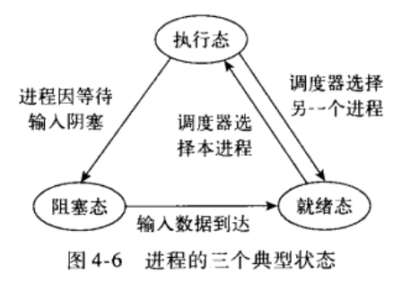

三个状态之间可以进行各种转换。如果每个状态都可以转换为另外一个状态，则一共有6种转换：

* 执行→就绪
* 执行→阻塞
* 阻塞→就绪
* 就绪→执行
* 阻塞→执行(不建议)
* 就绪→阻塞(不行)

问题是，**上面的转换并不是都可以发生**。一个进程在执行时，因为运行时间太长，操作系统可以将其挂起，转换为就绪状态。因此第1种转换是可以的。进程执行过程中如果执行了某种阻塞操作，则将进入阻塞状态。因此第2种转换也是可以的。一个阻塞的进程在其等待的资源达到后，就可以随时执行，成为就绪状态，因此第3种转换也是可以的。就绪进程由操作系统调度到CPU上就成为执行状态，因此第4种转换也是可以的。

但是第5、第6两种转换却是不可以的。我们前面讲过，阻塞进程即使被给予CPU，也无法执行，操作系统在调度时并不会在阻塞队列里挑选。因此，阻塞状态无法转换为执行状态。对于处于就绪状态的进程来说，它因为并没有执行，自然无法进入到阻塞状态。这就像一个人不往前走，自然就不会有任何人是其障碍。因此，就绪状态无法转换为阻塞状态。

这里需要注意的是，第5、第6两种转换虽然都不存在，但其原因是两样的。第5种转换不是因为我们不让它发生。如果我们乐意，完全可以让操作系统在阻塞队列里挑选一个进程予以执行，只不过这个进程在执行第1条指令时就会又发生阻塞（因为其等待的数据尚不可用或者发生异常）。因此，从理论上说，阻塞到执行是可以的，只不过这种状态转换没有任何实际价值而被操作系统禁止。（就像每个人都可以给自己扇耳光，但我们奉劝各位不要这样做，因为没有什么益处）。而第6种状态转换则在理论上不可以。一个进程只能在执行时才可能阻塞，没有执行的进程无法直接转换到阻塞状态。

这里阐述的进程三状态并不是唯一的分类方式。事实上，许多商业操作系统的进程状态不止三个，例如，Windows的进程有7个，Solaris里面的进程则有6个。但不管3个、6个、7个还是几个，其目的都是便于操作系统对进程的管理。只要细分对管理有利，我们就细分。否则就维持三状态。

## 进程创立

进程创立步骤：

1）分配进程控制块。
2）初始化机器寄存器。
3）初始化页表。
4）将程序代码从磁盘读进内存。
5）将处理器状态设置为“用户态”。
6）跳转到程序的起始地址（设置程序计数器）。

这里一个最大的问题是跳转指令是内核态指令，而在第5步时处理器状态已经被设置为用户态，而用户态下是不能执行内核态指令的。这个问题是怎么解决的呢？当然了，这就需要硬件帮忙了。硬件必须将第5、第6两步作为一个步骤一起完成。

进程创立在不同的操作系统所需的方法也不一样。例如，UNIX将进程创立分作两个步骤：
第1个步骤是fork，创建一个与自己完全一样的新进程；第2个步骤是exec，将新的进程的地址空间用另一个程序的内容覆盖，然后跳转到新程序的起始地址，从而完成新程序的启动。而Windows使用一个系统调用就完成进程创建。这个系统调用就是CreateProcess。在调用该函数时我们把欲执行的程序名称作为参数传过来，创建新的页表，不需要复制别的进程。

UNIX和Windows的进程创建过程各有优缺点。UNIX的创建过程要灵活一些，因为我们既可以自我复制，也可以启动新的程序。而自我复制在很多情况下是很有用的。例如，Web服务器在每收到一个用户请求后，就创建一个新的一摸一样的进程来服务用户请求。而在Windows下，复制自我的过程就要复杂一些。而且，共享数据只能通过参数传递来实现。

## 进程与地址空间

进程空间也称为地址空间。地址空间就是进程要用的所有资源。所有资源构成了状态的划分。不可能有两个进程状态完全一样。所以每个进程对应计算机的一种状态，而计算机状态就是所有存储单元的内容。

地址空间的特点就是“被动”，自己不能做什么，只提供支持。打个比方。看过演出吗？话剧、芭蕾、歌剧、京剧？有个舞台，那些道具和舞台就是地址空间。这些空间本身不能发生任何动作，做动作的只能是演员。而那些演员就是我们将要讲述的线程。跳上来一个演员就是一个线程，如图4-7所示。

进程与地址空间研究的主要内容是如何让多个进程空间共享一个物理内存。具体来说，就是高效、安全地让所有进程共享这片物理内存。就像一个政府要完成的任务就是使其国家的人民平等（至少是口头上）地共享这片国土。

> 这个口头上牛皮！

## 进程管理

那么谁管理进程的资源？操作系统。本书前面说过，Operating的意思就是掌控一切。那么怎么掌控呢？操作系统要掌控一切状态，就必须拥有某些手段或资源。那需要什么手段或资源呢？如果让你监视一群人，要你掌握他们的一切情况，你第一件要做的事是什么？装监视器？不是！而是要知道这群人到底是哪些人！即你需要知道并维持这群人的各种信息！

### 进程管理所需要的手段

本章前面有一节讲到进程的产生和终结，但这到底是什么意思呢？产生一个进程对于操作系统来说意味着什么呢？进程消亡又对操作系统有何影响呢？要回答这个问题只需要看一下一个人出生对一个社会来说意味着什么就可以了。在一个人出生后，医院需要在几天内为其建立记录，该记录包括诸如姓名、性别、体重、身高、父母为何人、在何时何地出生、健康状态等信息，然后该记录用来登记户口、办理身份证等。在这些手续之后，这个人就正式存在了。有了这些记录，政府就可以对这个人进行各种管理了。

与一个社会管理人类似，操作系统要管理进程就要维护关于进程的一些信息。当一个进程产生时，操作系统也需要为其建立记录。而操作系统用于维护进程记录的结构就是进程表或进程控制块（PCB，Process Control Block）。这个进程表或PCB里面存放的就是有关该进程的资料。

那么进程表里有什么资料呢？显然，不同的操作系统维护的进程资料是不尽相同的。但一般说来，维护的资料信息应当包括寄存器、程序计数器、状态字、栈指针、优先级、进程ID、信号、创立时间、所耗CPU时间、当前持有的各种句柄等。而采纳的数据结构主要是线性表、链表和结构（Struct），当然也可能使用树和图（网络）结构。例如，Solaris的进程表就使用了上述4种数据结构。表4-2描述的是一个极度简化了的进程表。

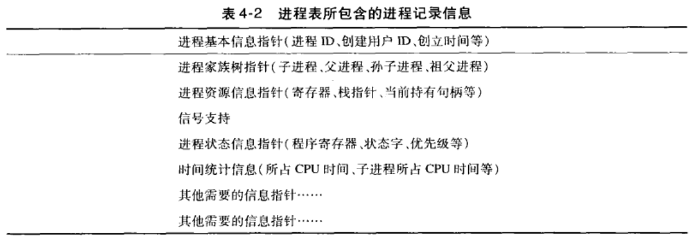

而这个进程表保持在操作系统所在的内核空间里，如图4-8所示。

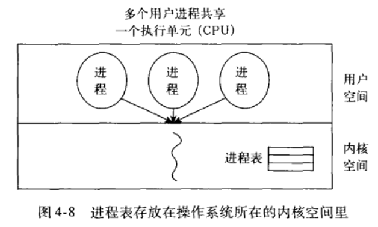

如果想更深入地了解进程表的结构，读者可以参阅相关商业操作系统的内核教程。

### 进程管理要处理的问题

进程管理的最大问题是资源分配。那么怎么分配资源？人类社会最大的问题也是分配资源。谁能解决资源争端，让地球上每个人高高兴兴地共享资源，谁就是人类的救星。当然，计算机的资源分配问题不像人类那样困难，因为程序没有自我意识，就算我们对某些程序不公平，它们也无法抱怨。但这不能成为我们偷懒和堕落的理由。毕竟，我们制造计算机就是想好好地利用它，自然希望能够让所有进程高兴地处在一起。再说了，我们的本性还是追求公平的。

除了公平之外，还有一个问题要考虑：效率。也就是最优。每个进程分配同样的资源不行，大锅饭不行。以前32个终端连到一台计算机上，慢的不行，结果没有任何人高兴。不如让部分人先富起来，给他们使用资源的优先权。

这样，公平与效率，就成了进程管理中永恒的主题。到底是公平重要？还是效率重要？天平的不同倾斜将引出十分不同的进程管理模式。

## 进程的缺陷

看上去，进程是个很好的东西。它提供多道编程，让我们感觉我们每个人都拥有自己的CPU和其他资源，可以提高计算机的利用率，可以让我们练习如何实现公平和效率。

那么进程有什么问题吗？

如果善于观察，就会发现，进程有个很严重的问题。假定现在有两部很好的电影，都只放一次，以后再也不放了。而且，这两部电影同时放，当然了，是在不同的两个房间放。而你很想将这两部电影都看了，有什么办法吗？假定没有光碟刻录机也没有录像机等。

当然，我们没有办法同时看两部电影。这也是进程的缺点。它只能在一个时间干一件事情。如果想同时干两件或多件事情，进程就不够用了。

另外，更为重要的是，进程在执行过程中如果阻塞，例如等待输入，整个进程就将挂起（暂停），而无法继续执行。这样，即使进程里面有部分工作不依赖于输入数据，也无法推进。

为了解决上述两个问题，人们就发明了线程。

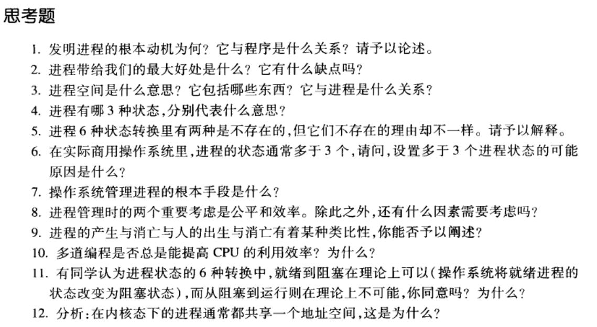

# 第5章：线程

**引子：**

> 公元前337年，年仅20岁的亚历山大缠位赢为马其额（Macedonia）圈王。此时，相邻的希腊各城邦共和国纷纷起来反叛马其顿的统治。北方的野蛮民族也蠢鑫欲动，亚历山大的侍臣顾问们纷纷建议亚历山大放弃对希腊各城郭共和国的平叛，而集中精力对北方野蛮种族进行级灭性打击。这些侍臣顾问们认为，亚历山大一个人无法分身分神同时对付希腊各城邦和北方各野蛮种族，因此，只能选择其一进行打击，通过杀鸡给猴看让另外的人臣服。
>
> 但是亚历山大拒绝了侍臣顾问们的建议。他认为，只要他速度足够快，就能够完成先破希腊再定北方边界的分身术。亚历山大的神速决战，迅速击败了希腊各城邦。而此时，北方野蛮种族还没有回过神来，当亚历山大出现在他们面前时，他们行动的时机已经失去了。
>
> 而就是这种神速的时间分身术，让亚历山大在一继位就慑服了所有闻其名的人，也奠定了其后来东攻西掠、南征北战、征整个文明世界的壮举…

每个人在人生的某个时候，都希望自己能够分身，从而完成某件不可能完成的事。而进程也是一样，它也希望在某些时候能够分身，从而完成更加复杂的使命。于是便有了线程。

## 进程的分身术——线程

[线程的五大状态](https://blog.csdn.net/peter_teng/article/details/10197785)

那么线程是什么？我们知道，进程是运转的程序，是为了在CPU上实现多道编程而发明的一个概念。但是进程在一个时间只能干一件事情。如果想同时干两件事，例如同时看两场电影，我们自然想到传说中的分身术，就像孙悟空那样同时变出多个真身。

当然，人在现实中进行分身是办不到的。但进程却可以办到，办法就是线程。线程就是我们为了让一个进程能够同时干多件事情而发明的“分身术”。

既然线程是进程的分身，每个线程自然在本质上是一样的，即拥有同样的程序文本。但由于是分身，自然也应该有不一样的地方，这就是线程执行时的上下文不一致。事实上，我们说线程是进程里面的一个执行上下文，或者执行序列。显然，一个进程可以同时拥有多个执行序列。这就像舞台，舞台上可以有多个演员同时出场，而这些演员和舞台就构成了一出戏。类比进程和线程，每个演员是一个线程，舞台是地址空间，这个同一个地址空间里面的所有线程就构成了进程。

在线程模式下，一个进程至少有一个线程，但也可以有多个线程，如图5-2所示。

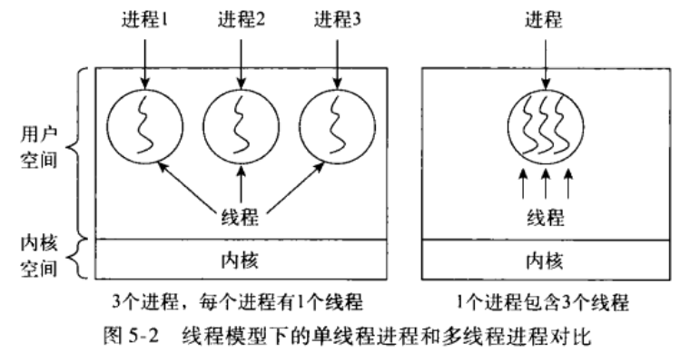

将进程分解为线程还可以有效利用多处理器和多核计算机。在没有线程的情况下，增加一个处理器并不能让一个进程的执行速度提高。但如果分解为多个线程，则可以让不同的线程同时运转在不同的处理器上，从而提高了进程的执行速度。例如，当我们使用文字处理软件，如Microsoft Word时，实际上是打开了多个线程。这些线程一个负责显示，一个接受输入，一个定时进行存盘。这些线程一起运转，让我们感觉到我们的输入和屏幕显示同时发生，而不用键入一些字符，等待一会儿才看到屏幕显示。在我们不经意间，文字处理软件还能自动存盘。当然，此项操作取决于系统当时的状况，有时我们会感觉到存盘时，计算机接受输入的速度慢了下来。但在绝大部分情况下，一切都还是令人满意的，如图5-3所示。

## 线程管理

有进程后，要管理进程。那么有线程后，也要进行管理。而管理的基础也与进程管理的基础类似：就是要维持线程的各种信息。这些信息包含了线程的各种关键资料。存放这些信息的数据结构称为线程控制表或线程控制块。那么线程控制块里面到底包含哪些信息呢？

我们说过线程共享一个进程空间，因此，许多资源是共享的。这些共享的资源显然不需要存放在线程控制块里面，而是存放在进程控制块即可。但由于线程是不同的执行序列，总会有些不能共享的资源。就像一家的兄弟姐妹。家里很多东西都是共享，如所有人同住父母的房子，共用冰箱、彩电、餐桌等。但有的东西则是每个人独享的，如衣服、日记本等。这些不被共享的资源和信息就需要存放在线程控制块里。

到底哪些资源可由（同一进程的）不同线程所共享，哪些不可共享呢？这当然是仁者见仁，智者见智。但也是有规律的。这个规律就是应当让共享的资源越多越好，因为这是我们发明线程的主要动机之一。由于我们发明线程的目的就是要经常协作，共享自然是我们的不懈追求。

因此，一般的评判标准是：如果某资源不独享会导致线程运行错误，则该资源就由每个线程独享；而其他资源都由进程里面的所有线程共享。

按照这个标准来划分，线程共享的资源有地址空间、全局变量、文件、子进程等。定时器，信号和占用CPU时间也可以共享。但程序计数器不能共享，因为每个线程的执行序列不一样。同理，寄存器也不能共享，栈也不能共享，这是线程的上下文（运行环境）。表5-1给出的是一般情况下（同一进程的）线程间共享和独享资源的划分。

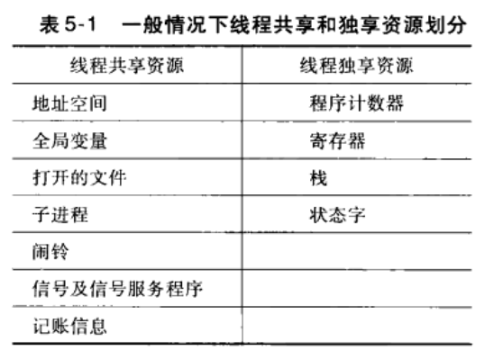

## 线程的实现方式

既然线程是进程的构成部分，或者是进程的分身，那么由谁来管理线程就有两种选择：一是让进程自己来管理线程；二是让操作系统来管理线程。这种不同的选择就出现了内核态线程和用户态线程。这也是线程实现的两种方式。由进程自己管理就是用户态线程实现，由操作系统管理就是内核态线程实现。

细心的读者也许已经注意到，我们在讲述进程时没有提到过实现方式的问题，即是应该在用户态还是内核态实现的问题。这是因为进程是在CPU上实现并发（多道编程），而CPU是由操作系统管理的，因此，进程的实现只能由操作系统内核来进行，而不存在用户态实现的情况，根本没有这种探讨的需要。但对于线程就不同了，因为线程是进程内部的东西，当然存在由进程直接管理线程的可能性。这就是为什么我们要探讨线程内核态与用户态实现。

### 内核态线程实现

前面说过，线程是进程的分身，是进程的不同执行序列。既然每个线程是不同的执行序列，说明线程应该是CPU调度的基本单位。我们知道，CPU调度是由操作系统实现的。因此，让操作系统来管理线程似乎是天经地义的事情。

那么操作系统怎么管理线程呢？与管理进程一样，操作系统要管理线程，就要保持维护线程的各种资料，即将线程控制块存放在操作系统内核空间。这样，操作系统内核就同时保有进程控制块和线程控制块。而根据进程控制块和线程控制块提供的信息，操作系统就可以对线程进行各种类似进程的管理，如线程调度、线程的资源分配、各种安全措施的实现等。图5-4描述的就是内核态线程的实现示意图。

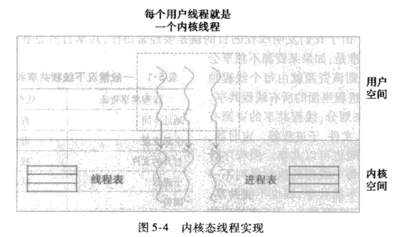

由操作系统来管理线程有很多好处，最重要的好处是用户编程保持简单。因为线程的复杂性由操作系统承担，用户程序员在编程时无需管理线程的调度，即无需担心线程什么时候会执行、什么时候会挂起。另外一个重要好处是如果一个线程执行阻塞操作，操作系统可以从容地调度另外一个线程执行。因为操作系统能够监控所有的线程。

那么内核态线程实现有什么缺点呢？有。首先是效率较低。因为线程在内核态实现，每次线程切换都需要陷入到内核，由操作系统来进行调度。而从用户态陷入到内核态是要花时间的。另外，内核态实现占用内核希缺的内存资源，因为操作系统需要维护线程表。操作系统所占内存空间一旦且装载结束后就已经固定，无法动态改变。由于线程的数量通常大大高于进程的数量，那随着线程数量的增加，操作系统内核空间将迅速耗尽。

如果要建立进程线程，但内核空间不够了，怎么办？我们可以做的选择有：“杀死”别的进程；创建失败；让它等一下。前面说过，“杀死”别的进程是一件很不好的事情，因为将造成服务不确定性。宣称创建失败也很差。因为创建失败有可能意味着某个进程无法往前推进，这违反了我们前面说过的进程模型的时序推进要求。让创建者等一下，这要看创建的是什么进程和线程了。如果是系统进程线程，等一下可能意味着关键服务无法按时启动；如果是用户进程线程，等一下可能引起用户的强烈不满。而且，等多久谁也不知道。

那在内核空间满了后，应该怎么办呢？打一个战场上的比方就清楚了。如果战场上对手太历害了，想再调个师，结果没有，怎么办？投降。也就说，如果内核空间溢出，操作系统将停止运转。因为要创立的进程可能很重要，又不能不创建。所以最好的结局是“死掉”。别人发现系统死了就会采取行动来补救。如果操作系统还要运转，却不能正确地运转，那是很危险得事情。操作系统采取的这种行动在灾难应对领域称为“无害遽止”。

但上面两个缺点还不是最要命的。最要命的是内核态实现需要修改操作系统，这在线程概念提出之初是一件很难办到的事情。试想，如果你作为研究人员提出了线程概念，然后你去找一家操作系统研发商，要求其修改操作系统，加入线程的管理，结果会怎样？操作系统开发商会请你走开。有谁敢把一个还未经证明的新概念加入到对计算机影响甚大的操作系统里？除非我们先证明线程的有效性，否则很难说服他人修改操作系统。

这样，就有了线程的用户态实现。

### 用户态线程实现

[怎样去理解Linux用户态和内核态？](https://zhuanlan.zhihu.com/p/69554144)

线程在刚刚出现时，由于无法说服操作系统人员修改操作系统，其实现的方式只能是在用户态。（谁提出谁举证。）那么用户态实现意味着什么呢？或者说用户态实现是什么意思呢？就是用户自己做线程的切换，自己管理线程的信息，而操作系统无需知道线程的存在。

那么在用户态如何进行线程调度呢？那就是用户自己写一个执行系统（runtime system）作调度器（runtime scheduler），即除了正常执行任务的线程外，还有一个专门负责线程调度的线程。

由于大家都在用户态下运行，谁也不比谁占优势，要想取得CPU控制权只能靠大家的自愿合作。

一个线程在执行完一段时间后主动把资源释放给别人使用，而在内核态下则无需如此。因为操作系统可通过周期性的时钟中断把控制权夺过来。在用户态实现情况下，执行系统的调度器也是线程，没有能力强行夺走控制权。所以必须合作。图5-5描述的是用户态线程的实现示意。

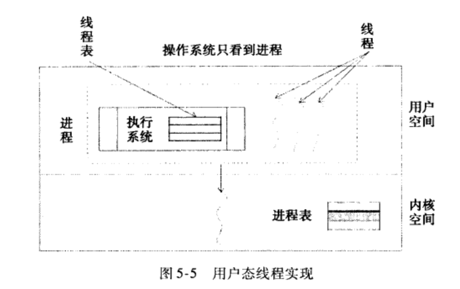

那么用户态实现有什么优点呢？有。首先是灵活性。因为操作系统不用知道线程的存在，所以在任何操作系统上都能应用；第二个优点是线程切换快，因为切换在用户态进行，无需陷入到内核态。第三，不用修改操作系统，实现容易。

那么这种实现方式有什么缺点吗？有。首先编程序变得很诡异。我们前面说过，用户态线程需要相互合作才能运转。这样，我们在写程序时，必须仔细斟酌在什么时候应该让出CPU给别的线程使用。而让出时机的选择对线程的效率和可靠性有很大的影响。这并不是件容易的事。另外一个更为严重的问题是，用户态线程实现无法完全达到线程提出所要达到的目的：进程级多道编程。

如果在执行过程中一个线程受阻，它将无法将控制权交出来（因为受阻后无法执行交出CPU的指令了），这样整个进程都无法推进。操作系统随即把CPU控制权交给另外一个进程。

这样，一个线程受阻造成整个进程都受阻，我们期望的通过线程对进程实施分身的计划就失败了。这是用户态线程的致命弱点。

但是，作为线程的提出者，自然不愿意这么快就承认线程的概念破产。因此，总要想点办法来挽救。那有什么办法来挽救呢？既然线程阻塞造成整个进程阻塞，解决的办法只有两种：一是不让线程阻塞；二是阻塞后想办法激活同一进程的另外线程。

第一种办法如何实现呢？有几种办法。首先来看线程阻塞的原因。

线程之所以阻塞是因为它执行了阻塞操作，如读写磁盘、收发数据包等。那我们就想，如果将这些操作改为非阻塞操作，不就解决问题了吗。但是这种办法根本就行不通。首先，将所有系统调用改为非阻塞就得修改操作系统，而我们刚才说了，用户态线程实现就是不想修改操作系统；第二，就算操作系统的人员很仁慈，帮你修改，那可以吗？不可以，因为很多系统调用的语义里面就包括阻塞，即阻塞是其正确运行的前提。使用这些系统调用的程序期望着阻塞，而修改系统调用的语义就会造成这些程序运行错误。所以这个建议行不通。

既然不能将阻塞操作修改为非阻塞操作，那我们可以不让线程调用阻塞操作。我们只需要在线程进行任何系统调用前，先行确认一下该调用是否会发生阻塞，即我们写一个包裹（wrap），将系统调用包裹起来，用户程序使用系统调用时需通过这个wrap。wrap里有一段代码，专门检查发出的系统调用会不会阻塞。如果会，就禁止调用；否则，就放行。

例如，在读写磁盘时，先行执行一个小的检查程序，看看需要的数据是否可以迅速获得（如检查一下排在前面的磁盘读操作有多少），如果是，就放行该操作。否则，先切换给别人，到不会阻塞了再调用。这样就可以一定程度地缓解线程阻塞造成进程阻塞的问题（但并没有完全解决，知道为什么吗？）。但这样做有很大的缺点：一是，需要修改操作系统，将系统调用wrap包裹起来。

二是，这样做大大降低了线程的效率。三是，这种做法有个关键前提条件。因为我们不让程序发出阻塞调用并不是要永远不让该线程运行，而是让它等一段时间。因此，本做法隐含的前提条件是你等一段时间后该调用就会由阻塞调用变成非阻塞调用，否则的话，该程序就永远不能运转了。而这个前提假定却不一定成立。

当然了，有的调用在等待一段时间后再调用确实会变成非阻塞操作。例如，你想从网络上接受一个数据包，但是发送方尚未发送，这个时候你如果使用receive系统调用（假如我们使用阻塞版的receive）将发生阻塞。但如果过一段时间后你再调用，这个包可能已经发出来了，你的调用就是非阻塞了。但问题是，并不是所有的阻塞调用在等待一段时间后都会转变成非阻塞。

比如读磁盘，你一调用就阻塞，但如果你不调用，就不会读磁盘，那么你在将来任何时候读磁盘仍将阻塞，这样该线程就永远无法推进。

既然不让线程阻塞的两种办法都不怎么样。那就来分析第二种解决办法：即在进程阻塞后想办法激活受阻进程的其他线程。这种办法的实现必须依赖操作系统。因为线程阻塞后，CPU控制权已经回到操作系统手里。而要激活受阻进程的其他线程，唯一的办法是让操作系统在进行进程切换时先不切换，而是通知受阻的进程执行系统（即调用执行系统），并问其是否还有别的线程可以执行。如果有，将CPU控制权交给该受阻进程的执行系统线程，从而调度另一个可以执行的线程到CPU上。这种做法称为调度器激活（Scheduler Activation），因为我们所干的事情就是激活进程里面的调度器（执行系统）。

我们将这种做法称为“第二机会”。因为在一个进程挂起后，操作系统并不立即切换到别的进程，而是给该进程第二次机会，让其继续执行。如果该进程只有一个线程，或者其所有线程都已经阻塞，则控制权将再次返回给操作系统。而这次，操作系统就会切换到别的进程了。

这种办法似乎解决了阻塞线程阻塞进程的问题。但也有两个缺点：首先还是需要修改操作系统，使得其在进行进程切换时，不是立即切换到别的进程，而是调用受阻进程的执行系统。但由于此种修改范围小，只需要对调度器程序做一个外科手术式的小改动，因而尚可以忍受。

但该做法还存在一个更为严重的缺陷：这种操作系统调用用户态执行系统的做法违反了我们所遵循的层次架构原则。因为这种调用属于所谓的up-call，即下层功能调用了上层功能（操作系统在下，执行系统在上）。而平时用户程序使用操作系统服务的调用属于down-call，即上层程序调用下层服务。这种违反上下有别的做法使得操作系统的设计和管理都变得复杂，而且，由于调度器在第一次切换时总是选择阻塞的进程，这样也为黑客和各种攻击者提供了一个系统缺口。另外，这种层次结构的违反让习惯了上下有别的人类感到十分不快，因此，此种做法没有得到商用操作系统的认可。

## 现代操作系统的线程实现模型

[怎样理解线程的睡眠，挂起，和阻塞？](https://www.zhihu.com/question/42962803)

[什么是阻塞，非阻塞，同步，异步？](https://www.zhihu.com/question/26393784)

> 老张爱喝茶，废话不说，煮开水。 出场人物：老张，水壶两把（普通水壶，简称水壶；会响的水壶，简称响水壶）。 
>
> 1 老张把水壶放到火上，立等水开。（同步阻塞） 老张觉得自己有点傻
>
>  2 老张把水壶放到火上，去客厅看电视，时不时去厨房看看水开没有。（同步非阻塞） 老张还是觉得自己有点傻，于是变高端了，买了把会响笛的那种水壶。水开之后，能大声发出嘀~~~~的噪音。 
>
> 3 老张把响水壶放到火上，立等水开。（异步阻塞） 老张觉得这样傻等意义不大 
>
> 4 老张把响水壶放到火上，去客厅看电视，水壶响之前不再去看它了，响了再去拿壶。（异步非阻塞） 老张觉得自己聪明了。
>
> 所谓同步异步，只是对于水壶而言。 普通水壶，同步；响水壶，异步。 虽然都能干活，但响水壶可以在自己完工之后，提示老张水开了。这是普通水壶所不能及的。 同步只能让调用者去轮询自己（情况2中），造成老张效率的低下。
>
> 所谓阻塞非阻塞，仅仅对于老张而言。 立等的老张，阻塞；看电视的老张，非阻塞。 情况1和情况3中老张就是阻塞的，媳妇喊他都不知道。虽然3中响水壶是异步的，可对于立等的老张没有太大的意义。所以一般异步是配合非阻塞使用的，这样才能发挥异步的效用。

鉴于用户态和内核态都存在缺陷，现代操作系统使用的是将二者结合起来。用户态的执行系统负责进程内部线程在非阻塞时的切换；内核态的操作系统负责阻塞线程的切换，即我们同时实现内核态和用户态线程管理。其中内核态线程数量较少，而用户态线程数量多。每个内核态线程可以服务一个或多个用户态线程。换句话说，用户态线程被多路复用到内核态线程上。例如，某个进程有5个线程，我们可以将5个线程分成两组，一组3个线程，另一组2个线程。每一组线程使用一个内核线程。这样，该进程将使用两个内核线程。如果一个线程阻塞，则与其同属于一组的线程皆阻塞，但另外一组线程却可以继续执行，如图5-6所示。

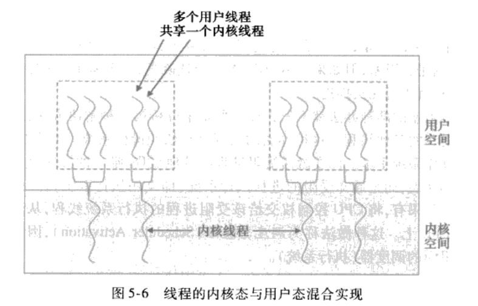

这样，在分配线程时，我们可将需要执行阻塞操作的线程设为内核态线程，而不会执行阻塞操作的线程设为用户态线程。这样我们就可以获得两种态势实现下的优点，而避免其缺点。

## 多线程的关系

推出线程模型的目的就是为了实现进程级并发。因为在一个进程中通常会出现多个线程，否则，我们也没有必要研究什么线程了。就像看舞台剧，如果只跳上来一个人，从头演到尾，没有其他人上场，大部分观众都会觉得无聊。我们要看的是演员对不同人物的刻画，色彩斑斓。因此，研究线程就要研究多线程，多个线程共享一个舞台，时而交互、时而独舞。

但共享一个舞台会带来不必要的麻烦。就像人们共享资源时难免产生争端一样。线程在共享地址空间的过程中也会产生矛盾。这些矛盾归结为下面两个根本问题：

* 线程之间如何通信？
* 线程之间如何同步？

而上述两个问题在进程层面也同样存在。从一个更高的层次上看，不同的进程也共享着一个巨大的空间，这个空间就是整个计算机。因此，进程之间也会存在矛盾，而这些矛盾也体现在如何通信（沟通）和如何同步（协调）上。

本书接下来的两章就分别对进程线程的通信和同步进行详细论述。

## 讨论：从用户态进入内核态

什么情况会造成一个线程从用户态进入到内核态呢？

首先，如果在程序运行过程中发生中断或异常，系统将自动切换到内核态来运行中断或异常处理机制。图5-7描述的就是中断导致态势切换的流程。异常处理的流程与此相同或相似。

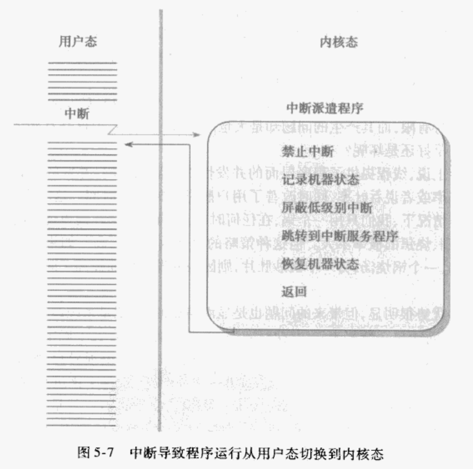

此外，程序进行系统调用也将造成从用户态进入到内核态的转换。例如，一个C++程序调用函数cin。cin是一个标准库函数，它将调用read函数。而read则是由操作系统提供的一一个系统调用。其执行过程如下：

* 执行汇编语言里面的系统调用指令（如sysca11）。
* 将调用的参数 `sys_read，file number，size`存放在指定的寄存器或栈上（事先约好）。
* 当处理器执行到`“syscal1”`指令时，察觉这是一个系统调用指令，将进行如下操作：
  * 设置处理器至内核态。
  * 保存当前寄存器（栈指针、程序计数器、通用寄存器）。
  * 将栈指针设置指向内核栈地址。
  * 将程序计数器设置为一个事先约定的地址上。该地址上存放的是系统调用处理程序的起始地址。

* 系统调用处理程序执行系统调用，并调用内核里面的read函数。这样，就实现了从用户态到内核态的转换，并完成系统调用所要求的功能。

## 讨论：线程的困惑——确定性与非确定性

[指令级并行，线程级并行，数据级并行区别？线程的概念是什么？](https://www.zhihu.com/question/21823699)

讲完这一章后，读者应该得到一个结论：线程是很有用的东西，因为实现了进程内部的并发。但这个结论是真的吗？线程让进程有了分身术，它在进程级别上实现了多道编程，使得一个进程可以同时干多件事情，提高了程序运行的效率，提高了硬件资源的使用率。似乎，线程带给我们的只有优点，或者说线程带给我们的优点远远大于其缺点。

但真的是这样吗？有人不这样认为。2006年夏天，有人在IEEEComputer上发表文章，说线程带给我们的优势有限，而其产生的问题却是大量的，应该剔除掉，说这是万恶之源。

那线程到底是好还是坏呢？

从某种程度上说，线程提供了程序层面的并发性能。毫无疑问，并发的好处是显而易见的，既提高系统的效率或者说吞吐率，同时改善了用户感觉到的响应时间。这有点像一个人烧菜的情况。在单线程情况下，我们只用一个锅，在任何时刻，只有一个菜在锅里烧，我们可以专注于这一个菜，发生烧糊、烧焦的概率不大。但这种策略的时间效率也不高。如果我们同时用几个锅，一个锅烧红烧肉，一个锅烧汤，另一个锅炒肚片，则因为并发操作而提高了时间效率，即可以同时烧好三个菜。

虽然线程的优势很明显，但带来的问题也是显而易见的，那就是系统运行的不确定性。由于多线程的存在，就每个单一线程来看，其执行效率、执行正确性均存在不确定性。当然，通过使用同步机制，可以改善这种不确定性。但如果在多线程执行过程中出现异常，则情况就相当麻烦。另外，在多线程下，如果某个进程的某个线程创建一个子进程，那对于该进程的其他线程来讲意味着什么？这是一个众说纷纭，莫衷一是的话题。用烧菜的例子来说，就是一般情况下我们也许能够掌控局势，使得每个菜都烧得不错。但问题是，如果因为环境的原因，如火候、水量等原因，造成红烧肉干底，汤溢出，则将造成手脚忙乱，顾此失彼，从而导致烧菜失败。

如果读者对计算机硬件与体系结构熟悉，可能能够看出来，线程的机制非常类似于硬件的流水线机制。流水线也是提供并发，不过是指令级的（而不是程序级的）。并发当然提高了计算机的吞吐率，改善了用户响应时间。但问题是，在多流水线多梯级情况下，由于有许多指令同时在不同的流水线和梯级上执行，其之间存在的数据和指令依赖关系十分复杂。如果万一再发生异常，如何保存一个一致性的状态都成了问题。图5-8给出的是流水线的指令级并发和线程的程序级并发的对照。

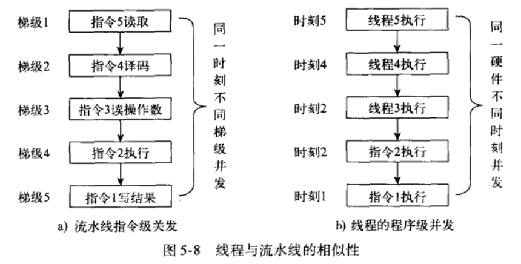

更为重要的是，线程和流水线的管理十分复杂。读者已经看到，线程的同步机制繁多、复杂，使得整个操作系统都变得更为复杂，从而增加整个系统的不可靠性。在硬件层，流水线也一样，需要许多复杂技术的支持，如多指令发射里的超长指令字与超标量计算等，这使得编译器或指令级结构或者两者同时变得复杂。复杂的东西其可靠性是很难保证的。

从某种程度上说，线程与流水线分别是软件层和硬件层不确定性的根源。流水线使得我们可以在硬件指令执行上并发，线程则使我们在软件指令执行上并发。但其带来的操作系统、编译系统和指令集结构的高度复杂是否值得，也许并不容易回答。

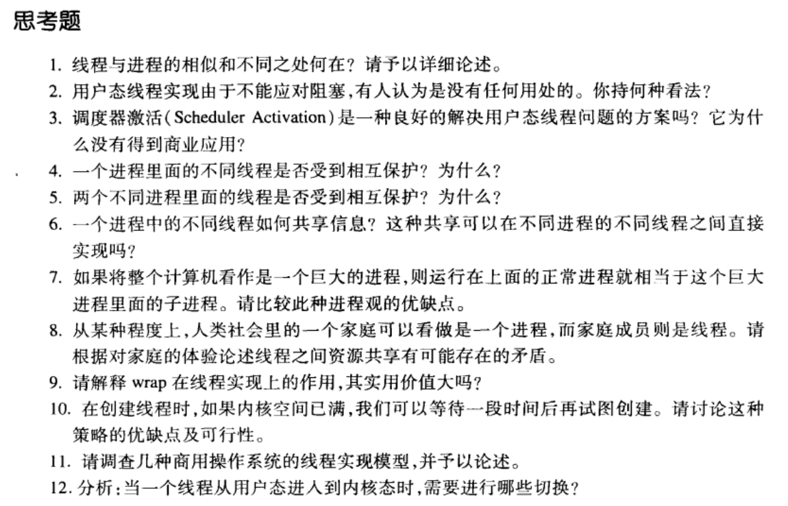

> 现在对操作系统有了一种朦朦胧胧的不一样的感觉了。我脑海中的一幅画：各种齿轮旋转，各种轨道纵横交错，流水线。

# 第6章：线程通信

**引子：**

> 1995年4月24日，纽约时报和华盛顿邮报非常不情愿地，同时刊登了一封长度达4个版面的文章，标题是“工业社会及其未来”。文章作者是西奥多约翰·卡扎斯基，一个被美国联邦调查局搜捕了17年之久的“孤独的爆破手”（见图6-1）。该作者在从1978至1995年的17年间，通过发送炸弹邮件，炸死炸伤几十名学者、科技公司高管和技术倡导人士。
>
> 作为哈佛大学学士、密歇根大学博士，卡扎斯基于25岁成为伯克利加州大学（UC-Berkeley）数学教授。“无论说他怎么聪明都不过分”，这是熟悉他的教授、同事给出的评价。
>
> 就是这样一个人，却在1969年突然从UC-Berkeley消失，并随后隐居美国蒙大拿州乡间。他在使用其他方式反对技术对人类的威胁都遭到失败后，于1978年开始通过自制炸弹来袭击技术界人士，以表达他反对技术带给人类各种灾难的立场。而联邦调查局也随即开始了该局历史上耗时最长、花费最为昂贵的搜捕行动。但却一无所获，孤独的爆破手的炸弹仍然继续发挥着威力。
>
> 而卡扎斯基的文章在纽约时报发表后，他的弟弟认出了其笔迹和信仰，报告了联邦调查局，卡扎斯基从而被捕。联邦调查局历史上最长最昂贵的搜捕行动宣告结束。
>
> 卡扎斯基因为其沟通的欲望而落入法网，可见沟通对人的重要性。而进程和线程也不例外，它们对沟通的需求也非常强烈。

> 我专门去搜了一下这个人，隐隐约约记得以前好像也看过这个人的事迹，电影《前目的地》里面的炸弹客应该也是以这个人为原型的。

## 为什么要通信

通信是人的基本需求。古罗马皇帝的实验证明，没有与人交互的婴儿无法存活。美国“孤独的爆破手”卡扎斯基就因为其强烈的与人沟通的欲望，迫使纽约时报发表了其立场宣言，从而导致被联邦调查局捕获。

而进程作为人的发明，自然脱离不了人的习性，也有通信需求。如果进程之间不进行任何通信，那么进程所能完成的任务就要大打折扣。例如，父进程在创建子进程后，通常须要监督子进程的状态，以便在子进程没有完成给定的任务时，可以再创建一个子进程来继续。这就需要父子进程间通信。

而线程间的通信则需要更多。由于一个进程通常包括多个线程，这多个线程之间因资源共享自然地就存在一种合作关系。这种合作关系虽然可以表现为相互独立，但更多地时候是互相交互。这就是通信。就像舞台上的多个演员，他们之间是一种合作关系，共同将戏演好。虽然这些演员在舞台上的时候可以各自演各自的，不说话，也没有肢体接触，即没有交互，但他们更多的时候会进行对白和拥抱等交互操作。

线程之间的交互我们就称之为线程通信。线程通信是从进程通信演变而来的，进程通信有个专有缩写，叫IPC（Inter-Process Communication）。由于每个进程至少有一个线程，进程的通信就是进程里面的线程通信。在随后的讨论中，我们将统一使用线程通信来进行讲解。

那么线程之间的通信是如何进行的呢？

舞台上的演员可以通过对白、手势和拥抱等方法来交互通信。类似地，线程也可以同样的方式来进行通信。下面我们就来看一下线程的这些交互方式。

## 线程对白：管道、记名管道、套接字

演员最常使用的交互手段就是对白。对白就是一方发出声音，另一方接受声音。声音的传递则通过空气（当面或无线交谈）、线缆（有线电话）进行传递。类似地，线程对白就是一一个线程发出某种数据信息，另外--方接受数据信息，这些数据信息通过一片共享的存储空间进行传递。

在这种方式下，一个线程向这片存储空间的一-端写人信息，另一个线程从存储空间的另外一端读取信息。这看上去像什么？管道。管道所占的空间既可以是内存，也可以是磁盘（见图6-2）。就像两人对白的媒介可以是空气，也可以是线缆--样。要创建一个管道，一个线程只需调用管道创建的系统调用即可。

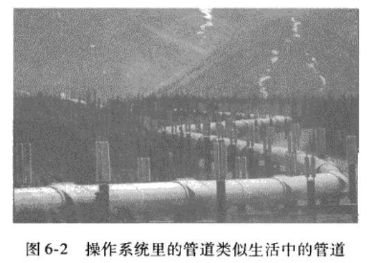

### 管道

从根本上说，管道是一个线性字节数组，类似文件，使用文件读写的方式进行访问。但却不是文件。因为通过文件系统看不到管道的存在。另外，我们前面说了，管道可以设在内存里，而文件很少设在内存里（当然，有研究人员在研发基于内存的文件系统，但这个还不是主流）。

创建管道在壳命令行下和在程序里是不同的。壳命令行下，只需要使用符号“1”即可。例如，在UNIX壳下，我们可以键入如下命令：

~~~javascript
$ sort < filel | grep zou
~~~

在两个utility“排序(sort)”和“查找(grep)”之间创建了一个管道，数据从sort流向grep。sort的结果将作为grep的输人。上述命令的意思是对filel 的内容进行排序，排序完的结果作为utility程序grep的输人，在结果里面找出所有包括字符串zou的文本行。

在程序里面，创建管道需要使用系统调用popen()或者pipe()。popen需要提供-一个目标进程作为参数，然后在调用该丽数的的进程和给出的目标进程之间创建一-个管道。这很像人们打电话时必须提供对方的号码，才能创建连接一样。

创建时还需要提供--个参数表明管道类型：读管道或者是写管道。而pipe调用将返回两个文件描述符（文件描述符是用来识别--个文件流的一个整数，与句柄不同），其中一个用于从管道进行读操作，一个用于写入管道。也就是说，pipe 将两个文件描述符连接起来，使得--端可以读，另一端可以写。通常情况下，在使用pipe调用创建管道后，再使用fork产生两个进程，这两个进程使用pipe返回的两个文件描述符进行通信。例如，下述代码段创建一个管道并利用它在父子进程间通信。

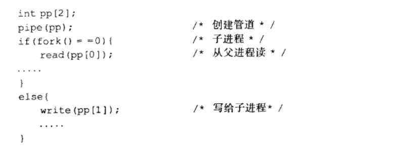

管道的一个重要特点是使用管道的两个线程之间必须存在某种关系，例如，使用popen需要提供另一端进程的文件名，使用pipe的两个线程则分别隶属于父子进程。

### 记名管道

如果要在两个不相关的线程，如两个不同进程里面的线程，之间进行管道通信，则需要使用记名管道。顾名思义，记名管道是-一个有名字的通信管道。记名管道与文件系统共享-一个名字空间，即我们可以从文件系统中看到记名管道。也就是说，记名管道的名字不能与文件系统里的任何文件名重名。例如，在UNIX下使用ls命令可以查看到已经创立的记名管道。

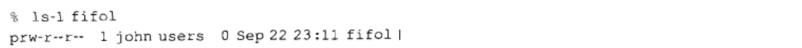

一个线程通过创建一个记名管道后，另外一个线程可使用open来打开这个管道（无名管道则不能使用open操作），从而与另外一端进行交流。

记名管道的名称由两部分组成：计算机名和管道名，例如\\\\[主机名]\管道\[管道名]\。对于同一主机来讲允许有多个同一命名管道的实例并且可以由不同的进程打开，但是不同的管道都有属于自己的管道缓冲区而且有自己的通信环境，互不影响。命名管道可以支持多个客户端连接一个服务器端。命名管道客户端不但可以与本机上的服务器通信也可以同其他主机上的服务器通信。

管道和记名管道虽然具有简单，无需特殊设计（指应用程序方面）就可以和另外--个进程进行通信的优点，但其缺点也是显然的。首先是管道和记名管道并不是所有操作系统都支持。主要支持管道通信方式的是UNIX和类UNIX（如Linux）的操作系统。这样，如果需要在其他操作系统上进行通信，管道机制就多半会力不从心了。其次，管道通信需要在相关的进程间进行（无名管道），或者需要知道按名字来打开（记名管道），而这在某些时候会十分不便。

### 虫洞：套接字

套接字（socket）是另外一种可以用于进程间通信的机制。套接字首先在BSD中出现，随后几乎渗透到所有主流操作系统。套接字的功能非常强大，可以支持不同层面、不同应用、跨网络的通信。使用套接字进行通信需要双方均创建一个套接字，其中-方作为服务器方，另外一方作为客户方。服务器方必须先创建一-个服务区套接字，然后在该套接字上进行监听，等待远方的连接请求。欲与服务器通信的客户则创建一个客户套接字，然后向服务区套接字发送连接请求。服务器套接字在收到连接请求后，将在服务器机器上创建-个客户套接字，与远方的客户机上的客户套接字形成点到点的通信通道。之后，客户端和服务器端就可以通过send和recv命令在这个创建的套接字通道上进行交流了。

服务区套接字有点类似于传说中的虫洞（wormhole），如图6-3所示。虫洞的一端是开放的，它在宇宙内或宇宙间飘移着，另外一端处于一个不同的宇宙，监听是否有任何东西从虫洞来。

而欲使用虫洞者需要找到虫洞的开口端（发送连接请求），然后穿越虫洞即可。

使用套接字进行通信稍微有点复杂，我们下面以一个网页浏览的例子对套接字这种通信方式予以说明。对于一个网站来说，要想提供正常的网页浏览服务，其网站服务器需要首先创建一个服务器套接字，作为外界与本服务器的通信信道。为了使该信道为外人所知，我们通常将该服务器套接字与某公共主机的一个众所周知的端口进行绑定，如图6-4所示。

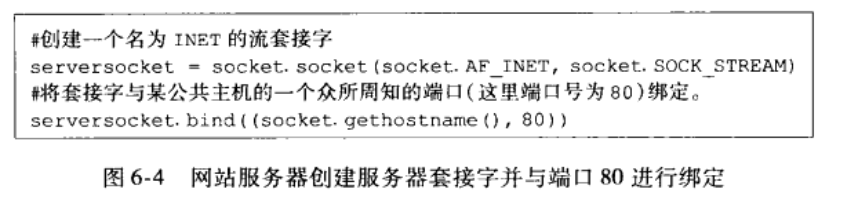

图6-4进行套接字和端口绑定的语句里的socket.gethostname()用来将套接字向外界公开。如果将该语句的使用socket.gethostname()改为' '或者localhost或者某个具体的IP地址如（120.121.4.1），则该服务器套接字将被限制在本地机器上使用。

在创建了服务器套接字并将其向外界打开后，网站服务器即可以在该套接字上进行监听，如图6-5所示。

图中语句里的数字5将端口上的等待队列长度限制为5，即超过5个的请求将被拒绝。

到这里，服务器端的设置就宣告结束。

对于客户来说，如要访问该上述网站，需要点击该网站的网址。在点击网址后（我们这里假定该网站网址为www.sjtu.edu.cn），客户机上的网络浏览器进行若干步操作，如图6-6所示。

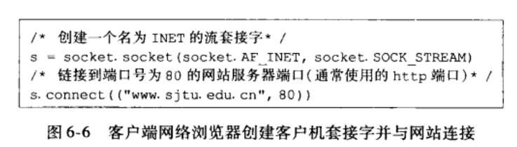

图6-6中的s.connect命令将向服务器www.sjtu.edu.cn在端口80打开的服务器套接字发送连接请求。而服务器端在接收到该连接请求后，将生成一个新的客户端套接字与该客户端套接字对接，从而建立-一个套接字通信信道。图6-7为网站服务器上运行的主循环。

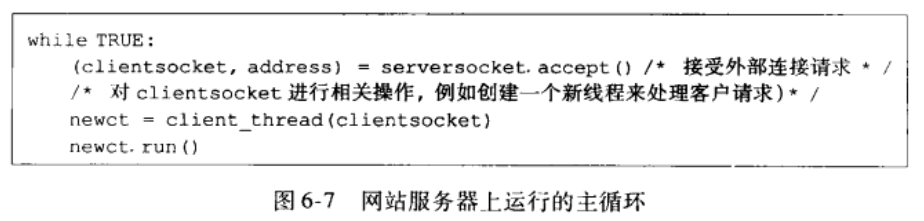

至此，套接字通信信道成功建立。客户端程序可以使用套接字s发送请求，索取网页，而服务器端则使用套接字clientsocket进行发送和接受消息。

这里需要指出的是服务器套接字既不发送数据，也不接收数据（指不接受正常的用户数据，而不是连接请求数据），而仅仅是生产出“客户”套接字。当其他（远方）的客户套接字发出一个连接请求时，我们就创建一个客户套接字。一旦客户套接字clientsocket创建成功，与客户的通信任务就交给了这个刚刚创建的客户套接字。而原本的服务器套接字serversocket则回到其原来的监听操作上。

套接字由于其功能强大而获得了很大发展，并出现了许多种类。不同的操作系统均支持或实现了某种套接字功能。例如按照传输媒介是否为本地，套接字可以分为本地（UNIX域）套接字和网域套接字。而网域套接字又按照其提供的数据传输特性分为几个大类，分别是：

* 数据流套接字（stream socket）：提供双向，有序、可靠、非重复数据通信。
* 电报流套接字（datagramsocket）：提供双向消息流。数据不--定按序到达。
* 序列包套接字（sequential packet）：提供双向、有序、可靠连接，包有最大限制。
* 裸套接字（rawsocket）：提供对下层通信协议的访问。

套接字从某种程度上来说非常繁杂，各种操作系统对其处理并不完全一样。因此，如要了解某个特定套接字实现，读者需要查阅关于该套接字实现的具体手册或相关文档。

## 线程电报：信号

管道和套接字虽然提供了丰富的通信语义，并且也得到了广泛应用，但它们也存在某些缺点，并且在某些时候，这两种通信机制会显得很不好使。

首先，如果使用管道和套接字方式来通信，必须事先在通信的进程间建立连接（创建管道或套接字），这需要消耗系统资源。其次，通信是自愿的。即一方虽然可以随意往管道或套接字发送信息，对方却可以选择接收的时机。即使对方对此充耳不闻，你也奈何不得。再次，由于建立连接消耗时间，一-旦建立，我们就想进行尽可能多的通信。而如果通信的信息量微小，如我们只是想通知一个进程某件事情的发生，则用管道和套接字就有点“杀鸡用牛刀”的味道，效率十分低下。

因此，我们需要一种不同的机制来处理如下通信需求：

* 想迫使一方对我们的通信立即作出回应。
* 我们不愿事先建立任何连接，而是临时突然觉得需要向某个进程通信。
* 传输的信息量微小，使用管道或套接字不划算。

应付上述需求，我们使用的是信号（signal）。

那么信号是什么呢？在计算机里，信号就是-一个内核对象，或者说-一个内核数据结构。发送方将该数据结构的内容填好，并指明该信号的目标进程后，发出特定的软件中断。操作系统接受到特定的中断请求后，知道是有进程要发送信号，于是到特定的内核数据结构里查找信号接受方，并进行通知。接到通知的进程则对信号进行相应处理。

信号非常类似我们生活当中的电报，如图6-8所示。如果你想给某人一封电报.你就拟好电文，将报文和收报人的信息都交给电报公司。电报公司则将电报发送到收报人所在地的邮局（中断），并通知收报人来取电报。发报时无需收报人事先知道，更无需进行任何协调。如果对方选择不对信号作出反应，则将终止操作系统运行。

## 线程旗语：信号量

信号量（Semaphore）是由荷兰人E.W.Dijkstra在60年代所构思出的一种程序设计构造。其原型来源于铁路的运行（见图6-9）：在一条单轨铁路上，任何时候只能有一列列车行驶在上面。而管理这条铁路的系统就是信号量。任何一列火车必须等到表明铁路可以行驶的信号后才能进入轨道。当一列火车进入单轨运行后，需要将信号改为禁止进入，从而防止别的火车同时进入轨道。而当火车驶出单轨后，则需要将信号变回到允许进入状态。这很像以前的旗语，如图6-10所示。

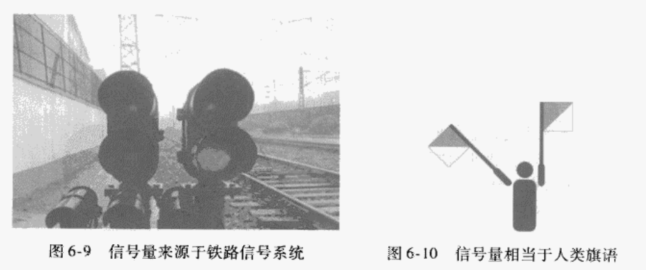

在计算机里，信号量实际上就是一个简单整数。一个进程在信号变为0或者1的情况下推进，并且将信号变为1或0来防止别的进程推进。当进程完成任务后，则将信号再改变为0或1，从而允许其他进程执行。

需要提醒读者注意的是，信号量不光是一种通信机制，更是一种同步机制。本书在下一章进程同步时将再次论述信号量。

## 线程拥抱：共享内存

管道、套接字、信号、信号量，虽然满足了多种通信需要，但还是有一种需要未能满足。这就是两个进程需要共享大量数据。这就像两个人，他们互相喜欢，并想要一起生活时（共享大量数据），打电话、握手、对白等就显得不够了，这个时候需要的是拥抱，只有将其紧紧拥抱于怀，感觉才最到位，也才能尽可能地共享。

**进程的拥抱就是共享内存**（见图6-11）。共享内存就是两个进程共同拥有同一片内存。这片内存中的任何内容，二者均可以访问。要使用共享内存进行通信，一个进程首先创建一片内存空间专门作为通信用，而其他进程则将该片内存映射到自己的（虚拟）地址空间。这样，读写自已地址空间中对应共享内存的区域时，就是在和其他进程进行通信。

乍一看，共享内存有点像管道，有些管道不也是一片共享内存吗？这是形似而神不似。首先，使用共享内存机制通信的两个进程必须在同一台物理机器上；其次，共享内存的访问方式是随机的，而不是只能从一端写，另一端读，因此其灵活性比管道和套接字大很多，能够传递的信息也复杂得多。

共享内存的缺点是管理复杂，且两个进程必须在同一台物理机器上才能使用这种通信方式。共享内存的另外一个缺点是安全性脆弱。因为两个进程存在一片共享的内存，如果一个进程染有病毒，很容易就会传给另外一个进程。就像两个紧密接触的人，一个人的病毒是很容易传给另外一个人的。

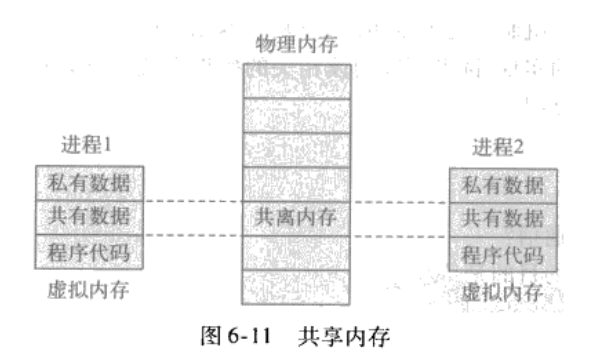

这里需要提请读者注意的是，使用全局变量在同一个进程的线程间实现通信不称为共享内存。

## 信件发送：消息队列

消息队列是一列具有头和尾的消息排列。新来的消息放在队列尾部，而读取消息则从队列头部开始，如图6-12所示。

乍一看，这不是管道吗？一头儿读、一头儿写？没错。这的确看上去像管道。但它不是管道。首先它无需固定的读写进程，任何进程都可以读写（当然是有权限的进程）。其次，它可以同时支持多个进程，多个进程可以读写消息队列。即所谓的多对多，而不是管道的点对点。另外，消息队列只在内存中实现。

最后，它并不是只在UNIX和类UNIX操作系统实现。几乎所有主流操作系统都支持消息队列。

## 其他通信机制

除了上面介绍的主流通信方式外，有些操作系统还提供了一些其操作系统所特有的通信机制，例如Windows支持的进程通信方式就有剪贴板（clipboard）、COM/DCOM、动态数据交换（DDE）、邮箱（mailslots）;而solaris 则有所谓的solaris门机制，让客户通过轻量级（16KB）系统调用使用服务器的服务。

虽然进程之间的通信机制繁多，且每种机制有着自己独特的特性，但归根结底都来源于AT&T的UNIXV系统。该系统在1983年加入了对共享内存、信号量和消息队列的支持。这三者就是众所周知的System VIPC（POSIXIPC也是源于该系统并成为当前IPC的标准）。因此，虽然不同操作系统的IPC机制可能不尽相同，但其基本原理则并无大的不同。如果需要了解具体操作系统的IPC机制的实现，读者可以阅读相关的操作系统内核教程。而本书则既不可能也无必要将它们全部进行介绍。

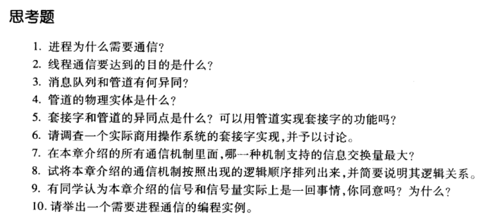

# 第7章：进程同步

**引子：**

> 1815年6月18日，比利时小城滑铁卢（见图7-1）。
>
> 法国皇帝拿破仑发出向由英国元帅惠灵顿指挥的第七联盟军进攻的命令。一时间，法军如潮水般涌向英军阵线，英军左右抵挡，勉力支持，形式十分危急。就在惠灵顿元帅准备放弃抵抗时，由布鲁切率领的普鲁士（今德国的一部）军队赶到，并加入战斗。在普鲁士有生力量的帮助下，英国军队振作起来，与普军联手击败了法军，从而彻底结束了拿破仑的政治生命。
>
> 普鲁士军队的珊珊来迟差点造成了英军的崩渍，同时，也由于普鲁士军队的最后加入拯教了由英国、俄国、瑞典、荷兰等14个国家和地区组成的第七联盟.…
>
> 在战场上，友军之间的同步对战争的胜利至关重要。而在计算机里，线程之间的同步则对程序的正确运行至关重要。

## 为什么要同步

人类活动中不乏各种同步的需要。正是普鲁士军队与英国军队的同步作战才使得不可一世的法国皇帝遭到了其生命中的“致命打击”。

我们前面说过，线程之间的关系是合作关系。既然是合作，那就得有某种约定的规则，不然合作就会出问题。例如，假如我们有两个线程同时运行，第一个线程在执行了一些操作后想检查当前的错误状态errno，但在其作出检查之前，线程2却修改了errno。这样，当第一个线程再次获得控制权后，检查将是线程2改写过的errno，这是不正确的，如图7-2所示。

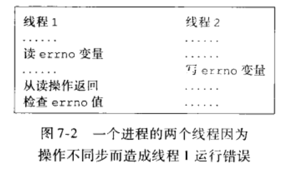

之所以出现上述问题，是因为两个原因：

* errno是线程之间共享的全局变量。
* 线程之间的相对执行顺序是不确定的。

因此，要解决上述问题有两个办法，即分别消除上述两个原因。消除第1个原因的办法就是限制全局变量，给每个线程一个私有的errno。事实上，我们可以将所有的资源都私有化，让线程之间不共享，那么这种问题就不复存在。

但问题是如果所有资源都不共享，那还有必要发明线程吗？甚至也没有必要发明进程了。

因为这样就违背了进程和线程设计的初衷：共享资源，提高资源利用率。因此，这种解决办法是不切实际的。

那剩下的办法就是消除第2个原因，即让线程之间的相对执行顺序在需要的时候可以确定。在讲述这个办法之前，我们再看一个更加戏剧化的例子。

假定有两个线程A和B，分别执行指令x=1和x=2，即：

线程A:x=1；

线程B:x=2；

请问在上述两个线程结束后，x的值是什么？

由于x是共享变量，且线程之间的相对执行顺序是不确定的，线程A既可以在线程B之前执行，也可能在线程B之后出现。前者将使x=2，后者则使x=1。

还有别的结果吗？x有可能等于3吗？

一般情况下，在任何计算机体系结构中，x=1对应的不是一条微指令，即一条高级指令对应的是多条微指令，因此需要多个时钟周期（通常为6个时钟周期以上）才能完成。例如，x=1的赋值语句就是由多个步骤构成。这些步骤可能包括：先把总线清零，然后把1加到上面去。这样的话，线程A和B的执行可能形成如下穿插：A线程把总线清零，B线程把总线清零，A线程将数值1加到总线上，B线程将2加到总线上。这样就有可能出现结果3。当然了，3的结果的出现依赖于特定的指令集结构。如果指令集结构在执行赋值语句时不是先将总线清0，然后将要赋值的常数加到总线上，就不会出现结果3，而只能有结果1或者2。

我们再看一个例子：

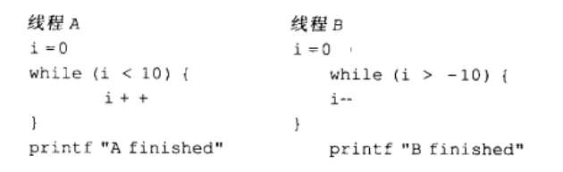

请问，哪个线程会赢呢？即哪个线程会先行运行结束？或者说，有没有哪个线程肯定会赢？答案是不确定的。如果两个线程恰好是你一步、我一步的执行的话，则两个线程都将无法结束。事实上，如果不采取特殊措施，就没有办法确保谁会赢，也没办法确保是否会结束。

由上述例子可见，引入线程后，我们也引入了一个巨大的问题：即多线程程序的执行结果有可能是不确定的。而不确定则是我们人类非常反感的东西。那如何在保持线程这个概念的同时，消除其执行结果的不确定性呢？答案是线程的同步。

## 线程同步的目的

线程同步的目的就是不管线程之间的执行如何穿插，其运行结果都是正确的。或者说，我们要保证多线程执行下结果的确定性。而在达到这个目标的同时，要保持对线程执行的限制越少越好。

除此之外，线程同步的另外一个目的涉及到效率。除了我们前面说过的多线程执行的结果是不确定的外，其执行的效率也是不确定的。比如说在某段时间内，线程A执行了5条指令，而B只执行了3条指令。A比B多执行了2条指令。但这并不是问题的关键。问题的关键是到底A是否比B执行的多，或者是多多少等，皆是不确定的。如果我们想使其变得确定，就需要进行进程同步。

那么到底什么是“同步”呢？同步就是让所有线程按照--定的规则执行，使得其正确性和效率都有迹可寻。线程同步的手段就是对线程之间的穿插进行控制。下面我们以“金鱼问题”来演示线程同步的各种控制手段。

## 锁的进化

读者有没有养过金鱼？养过金鱼的人都知道，金鱼有一个很大的特点，就是没有饱的感觉。因此，金鱼吃东西不会因为吃饱了就停止。它们会不停的吃，一直到鱼缸里面的食物都吃完为止。所以，如果你一直喂，它就一直吃，直到胀死。因此，金鱼吃多少由养金鱼的人来确定，其死活也由人来控制。

现在假定左怡和尤尔两个人合住一套公寓，共同养了一条金鱼。该金鱼每天进食一顿。两个人想把金鱼养活，一天只喂一次，也只能喂一次。如果一天内两人都喂了鱼，鱼就胀死。如果一天内两人都没有喂鱼，鱼就饿死。

他们二人为了把鱼养好，既不让鱼胀死，也不让鱼饿死，做出如下约定：

* 每天喂鱼一次，且仅一次。
* 如果今天左怡喂了鱼，尤尔今天就不能再喂，反之亦然。
* 如果今天左怡没有喂鱼，尤尔今天就必须喂，反之亦然。

显然，要想保证鱼活着，左怡和尤尔得进行某种合作。当然，最简单的情况是不进行任何沟通，每个人觉得需要喂鱼时，查看一下鱼的状态，如果感觉到鱼像是没进过食，则喂鱼，否则就不喂。图7-3给出的是在没有同步情况下左恰和尤尔所执行的程序。

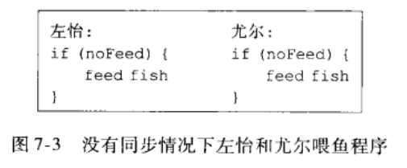

那上述程序里是如何判断noFeed呢？程序里没有给出，因此只能依赖于左移和尤尔的高超养鱼技术：即通过查看鱼的外形看出金鱼当天有没有进食。当然了，这个只有高手才能达到这个水平，一般的人是看不出来的。万一左怡或者尤尔没有看出对方已经喂过鱼了，再喂一次，鱼就胀死了。或者，没有看出对方没有喂过鱼，而没有喂，鱼就饿死了。

即使假设左怡和尤尔都是养鱼高手，通过查看鱼的外形就能断定鱼是否喂过，上述程序能正确执行吗？答案是否定的。由于线程的执行可以任意穿插，左怡可以先检查鱼，发现没有喂，就准备喂鱼。但就在左怡准备喂但尚未喂的时候，程序切换，轮到尤尔执行。尤尔一看，鱼还没有喂（确实如此），就喂鱼。在喂完鱼后，线程再次切换到左怡。此时左怡从检查完鱼状态后的指令开始执行，就是喂鱼。这样鱼喂了两次，鱼就胀死了，如图7-4所示。

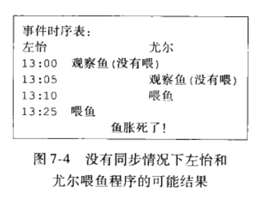

为什么这个程序会出现鱼胀死的情况呢？因为左怡和尤尔两个人同时执行了同一段代码。

这种两个或多个线程争相执行同一段代码或访问同一资源的现象称为竞争（race）。这个可能造成竞争的共享代码段或资源就称为**临界区**（critical section）。

当然我们知道两个线程不可能真的在同一时刻执行（单核情况）。但却有可能在同一个时刻两个线程都在同一段代码上。我们这个例子里竞争的是代码，是代码竞争。如果是两个线程同时访问一个数据就叫数据竞争。图7-3的程序造成鱼胀死就是因为两个线程同时进入了临界区。

以人类进化来比喻，图7-3的程序只相当于氨基酸阶段，胡乱竞争，并不具备任何协调能力。

### 变形虫阶段

要防止鱼胀死，就需要防止竞争。要想避免竞争，就需要防止两个或多个线程同时进入临界区。要达到这点，就需要某种协调手段。

协调的目的就是在任何时刻只能有一个人在临界区里。这称为互斥（mutual exclusion）。

互斥就是说一次只有一个人使用共享资源，其他人皆排除在外，并且互斥不能违反我们前面给出的进程模型。因此，正确互斥需要满足四个条件：

* 不能有两个进程同时在临界区里面。
* 能够在任何数量和速度的CPU上正确执行。
* 在互斥区域外不能阻止另一个进程的运行。
* 进程不能无限制地等待进入临界区。

如果任何一个条件不满足，那么你设计的互斥就是不正确的。

那么我们有没有办法确保一次只有一个人在临界区呢？有，让两个线程协调。当然，最简单的协调方法是交谈。问题是左怡和尤尔不见得有时间碰面。那么剩下的办法是留字条。由此，获得第一种同步方式：左怡和尤尔商定，每个人在喂鱼之前先留下字条，告诉对方自己将检查鱼缸并在需要时喂鱼，如图7-5所示。

上述机制能否避免鱼胀死呢？不能。如果左怡和尤尔交叉执行上述程序，还是会造成鱼胀死的结局，如图7-6所示。

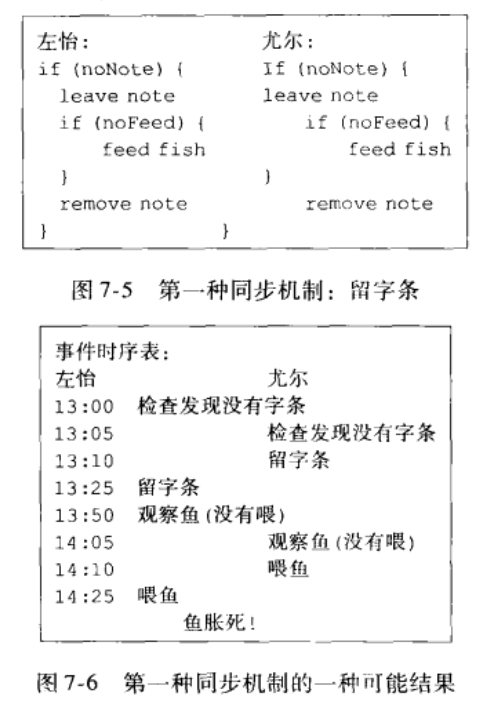

那上面的程序为什么没有效果呢？这是因为我们使用的互斥手段，即留字条，并没有达到互斥的目的。因为字条并没有防止左怡和尤尔两个人同时进入临界区。当然了，与第一个解决方案比起来，本方案还是有所改善，即鱼胀死的概率降低了。只有在左怡和尤尔严格交叉执行的情况下，才可能发生鱼胀死的现象。

此程序虽然加入了一点同步机制，但这个机制太原始，达不到真正的同步目的。以人类进化来比喻，此程序相当于变形虫阶段。

### 鱼阶段

仔细分析发现，上述程序不解决问题的原因是因为我们先检查有没有字条，后留字条。这样造成一个空挡，使得检查字条和留字条之间的空隙。那我们就修改一下顺序，先留字条，再检查有没有对方的字条。如果没有对方的字条，那么就喂鱼，喂完把字条拿掉。不过这种方法需要区分条子是谁的。我们得到如下程序（见图7-7）。

上述程序怎么样？鱼还会不会胀死呢？答案是不会了。因为无论按照什么顺序穿插，总有一个人的留条子在另一个人的检查字条指令前执行，从而将防止两个人同时进入临界区。因而鱼不会因为两个人都喂而胀死。

那这个程序是成功了。不过，不要过快下结论。我们来看一下，如果两个人穿插执行会出现什么结果。这个时候问题出现了。由于穿插执行，在二者检查字条时，发现对方已经留有字体，从而都不会喂鱼。这个时候鱼饿死，如图7-8所示。

虽然胀死很难受，但饿死也好不到哪里去。因此，上述程序也不让我们满意。

本程序虽然防止了胀死，但却允许饿死的情况发生，因此虽然相较于前面两种方式有进步（饿死比胀死好受一点），但还是在很原始的阶段。以人类进化来比，相当于鱼阶段。

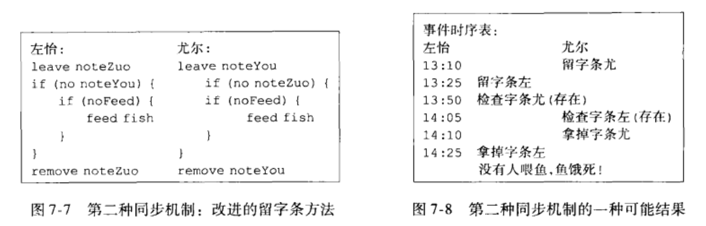

### 猴阶段

那么为什么鱼会饿死呢？是因为没有人进入临界区。虽然互斥确保了没有两个人同时进入临界区，但这种没有人进入临界区的情况则有点互斥过了头。要想鱼不饿死，除了互斥外，我们还要保证有一个人进入临界区来喂鱼。那用什么办法来作出这种保证呢？

办法就是让某个人等着，直到确认有人喂了鱼才离去，不要一见到对方的条子就开溜走人。也就说，在两个人同时留下字条的情况下，必须选择某个人来喂鱼。这样我们就得出第三种同步方式（见图7-9）。

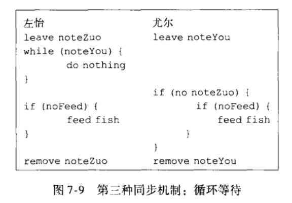

鱼显然不会胀死，因为使用的办法包括了第二种同步方式。那鱼会不会饿死呢？也不会。

因为前面说过，鱼饿死的唯一情况是两个人同时留字条，并且又都走人。而上述程序在两个人都留字条的情况下，左怡不会走人，而是一致循环等待直到对方删除字条后，再检查鱼有没有喂，并在没有喂的情况下喂鱼。因此，该同步方式既防止了胀死，又防止了饿死。

我们终于有了个能正确养鱼的程序了，一切似乎大功告成。但真的吗？

我们终于进化到了猴子阶段，能够有一定的组织，不会饿死，也不会胀死了。但这就足够了吗？

### 锁

图7-9所描述的第三种同步机制虽然正确，但存在很多问题。

首先是程序不对称。左怡执行的程序和尤尔执行的程序并不一样。那不对称有什么问题吗？当然有。做科学研究的人说完全对称的人最好看。自然，完全对称的程序也最好看。上述程序因为不对称而就不美观。这样就没有达到Donald Knuth所谓的“程序就像蓝色的诗歌”的境界。其次，不对称造成程序编写困难。为了追求程序的正确，即使是做同样事情的线程也得编写的不同，这自然就增加编程的难度。最后，不对称还造成程序证明的困难。要想从理论上证明图7-9程序的正确性是一件十分复杂的事情。这点研究程序证明的人是很清楚的。

上述程序的另一个大问题是浪费。上述程序中左怡执行的循环等待是一种很大的浪费。但浪费还不是循环等待的唯一问题。它还可能造成CPU调度的优先级倒挂。优先级倒挂就是高优先级的线程等待低优先级的线程。例如，如果尤尔先于左怡启动，留下字条后正准备检查是否有左怡的字条时，左怡启动。由于左怡的优先级高于尤尔，左怡获得CPU，留下字条，进入循环等待。由于左恰的优先级高，尤尔将无法获得CPU而完成剩下的工作，进而造成左怡始终处于循环等待阶段无法推进。这样高优先级的左怡就被低优先级的尤尔所阻塞。由于优先级倒挂完全违反了我们设立优先级的初衷，就像总统得听平民指挥似的，因此无法令人容忍（至少无法让总统容忍）。

那我们有没有更好的办法来解决喂养金鱼的问题呢？有，就是继续对我们的同步方案进行改进。那我们在哪一个方案的基础上改呢？自然地我们会想到最后一个方案，因为它已经满足了鱼既不饿死也不胀死条件，无非就是不好看和循环等待。关键是这两点改得了吗？答案是否定的。循环等待不能去掉，一去掉就变成第二个方案；若想使其对称、美观，就需要将尤尔改为和左怡同样，而这样同样会造成鱼饿死的可能。因此对最后一个方案进行修改似乎不是明智之举。看来，我们这种零敲碎打似的推进模式已经走到了尽头。需要新的思路了。

新的思路就是直接对最开始的两个方案进行修改。由于最开始两个方案均达不到既不饿死又不胀死的条件，我们自然选择一个较为美观、简单的方案来修改。两个方案之间，第一个方案完全对称，而第二个方案不是完全对称，因为每个人的条子不同。因此，我们选择第一个方案作为修改的基础。但如何修改呢？

要想知道如何修改，就得知道第一个方案为什么不满足条件。

那第一个方案为什么不满足条件呢？我们说过，是因为检查字条和留字条是两个步骤，中间留有被别的线程穿插的空挡，从而造成字条作用的丧失。我们就想，能否将这两个步骤并为一个步骤，或者变成一个原子操作，使其中间不留空挡，不就解决问题了吗？

换句话说，我们之所以到现在还没把金鱼问题处理掉，是因为我们一直在非常低的层次上打转。因为我们试图工作的层面是鱼和鱼缸这个层面，即留字条是为了防止两个人同时查看鱼和鱼缸。我们仅仅在指令层上进行努力。由于控制的单元是一条条的指令，所以对指令之间的空挡无能为力。而解决这种问题的办法，就是提高抽象的层次，将控制的层面上升到对一组指令的控制。

例如，在金鱼问题里，如果我们将抽象层次从保护鱼和鱼缸的层次提高到保护放置鱼缸的房间的层次，这个问题就可以解决。即设计一种同步措施，使得在任何时候只能有一个人进入放置鱼缸的房间。这样，检查字条和留字条的两步操作就变成将房间锁上的一个操作。

那么如何保证这个房间一次只进入一个人呢？我们先看看生活当中我们是如何确保一个房间只能进入一个人的。例如，两个老师都想使用同一个教室来为学生补课，怎么协调呢？进到教室后将门锁上，另外一个教师就无法进来使用教室了。即教室是用锁来保证互斥的。那么在操作系统里，这种可以保证互斥的同步机制我们就称为锁。

有了锁，金鱼问题就可以解决了。当一个人进来想喂鱼时，就把放有鱼缸的房间锁住。这样另外一个人进不来，自然无法喂鱼，如图7-10所示。

从上面程序我们看到，由于锁的互斥性，左怡和尤尔只能有一个人进入房间来喂鱼，因此鱼不会胀死。并且，如果两人都同时执行上述程序时，由于先拿到锁的人会进入房间来喂鱼，因此鱼也不会饿死。更为重要的是，两个人执行完全同样的代码。既对称，也容易写、证明起来也不困难。这样，金鱼问题得到解决。

以人类进化来比喻，上述程序相当于人的阶段了。

#### 锁的基本操作

从图7-10可以看出，锁有两个基本操作：闭锁和开锁。闭锁就是将锁锁上，其他人进不来。开锁就是你做的事情做完了，将锁打开，别的人可以进去了。

闭锁操作有两个步骤，分别如下：

1）等待锁达到打开状态。
2）获得锁并锁上。

开锁操作很简单，就是一步：打开锁。

显然，闭锁的两个操作应该是原子操作，即不能分开。不然，就会留下穿插的空挡，从而造成锁的功效的丧失。那么我们是如何让闭锁的两个操作成为一个原语操作的呢？本书将在第9章来回答这个问题。这里，我们先来仔细看看锁的机制。

细心的读者可能已经看出，我们给出的第一种解决方案里的字条，从某种意义上来说，就是一把锁，只是这把锁没有将资源锁住。那为什么没有锁住呢？这是因为这把锁不具备一把正常锁所应该具备的特性：

* 锁的初始状态要是打开状态。
* 进临界区前必须获得锁。
* 出临界区时必须打开锁。
* 如果别人持有锁则必须等待。

而我们的字条解决方案违反了第4个条件，即在别人持有锁（留下宇条）的情况下，也照样进入临界区（因为检查锁是否有别人持有在别人留锁之前进行了）。因此，这个字条无法起到锁的作用，即是一把破锁。

在用了正常的锁之后（见图7-10），整个程序就可以正确运行了。读者请看，图7-10的程序漂亮吧？想形式化证明这个程序也是很容易的事情。

那么这个程序有什么问题没有？如果左恰正在喂鱼的话，尤尔能干什么事情吗？只能等待等待锁变为打开状态），如果左怡未鱼的动作很慢，尤尔等待的时间就会很长。而这种繁忙等待就将造成浪费，也降低了系统效率。那有没有办法消除锁的繁忙等待呢？答案是否定的，因为锁的特性就是在别人持有锁的情况下需要等待。不过我们还是可以减少繁忙等待的时间长度。怎么缩短等待的时间呢？

仔细分析发现，左怡喂鱼并不需要在持有锁的状态下进行。我们就想喂鱼的这段时间不要放在lock里面，而是获得锁后留下字条说我喂鱼去了，然后释放锁，再喂鱼。而另一方在拿到锁后先检查有没有字条，有就释放锁，干别的去。没有就留字条，然后释放锁，再喂鱼。这样，由于持锁的时间只有设置字条的时间，因此，对方循环等待的时间会很短，而真正的操作在这里是喂鱼）则随便多慢也没有问题了。如图7-11所示：

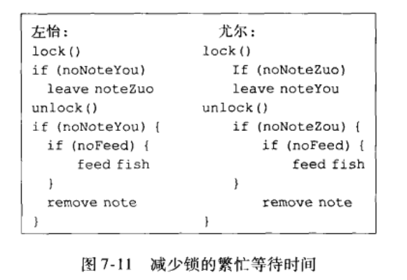

图7-11比起图7-10的程序来说，已经好多了。因为在锁上的繁忙等待时间已经很少了。但不管怎样，终究还是有等待的。那有没有办法不用进行任何繁忙等待呢？有，答案就是睡觉与叫醒，即`sleep&weake up`

## 睡觉与叫醒：生产者与消费者问题

什么是睡觉与叫醒呢？就是如果锁被对方持有，你不用等待锁变为打开状态，而是睡觉去，锁打开后再来把你叫醒。我们下面用生产者与消费者的问题来演示这个机制。

有人说这个世界上只存在两种人：生产者和消费者。要么你生产某种东西，要么你消费某种别人生产的东西。当然，你也可能既是生产者，又是消费者。即在一个产品上你是生产者，但在另一产品上你却是消费者。但在某个特定的产品上，一个人只可能是消费者或者生产者，而不能二者同时具有。当然，在这个具体的产品上，你可能既不是消费者，也不是生产者。但对于任何特定的产品，它一定存在一个消费者和一个生产者（我们这里不探讨废品或没有人要的商品）。

那么生产者生产的产品由消费者来消费，但消费者一般不直接从生产者手里获取产品，而是通过一个中间机构，比如商店。生产者把东西往这里放，消费者到这里来拿。为什么需要这个中间机构呢？这是因为商店的存在使得生产者和消费者能够相对独立的运行，而不必亦步亦趋的跟在另一方后面。因为只要商店货架没满，生产者就可以一直生产。他就不用等消费者定一件他才做一件。而如果没有商店，则生产者无法独立操作，必须拿到消费者订单才能生产。而消费者在每次订货后需要等待生产者制造出产品后，才能进行新的订货。这种你走一步我才走一步的生产一消费模式效率十分低下（见图7-12）。

用计算机来模拟生产者和消费者是很简单的事：一个进程代表生产者，一个进程代表消费者，一片内存缓冲区代表我们的商店。生产者生产的物品从一端放入缓冲区，消费者从另外一端获取物品，如图7-13所示。

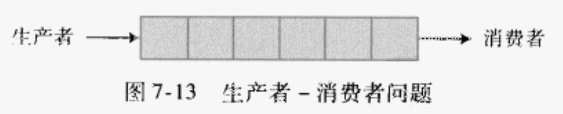

一个非常好的例子是校园的售货机。售货机是缓冲区，负责装载售货机的送货员是生产者，而购买可乐、糖果的学生自然就是消费者。只要售货机不满也不空，则送货员和学生可以继续他们的送货和消费。问题是，如果学生来买可乐，却发现售货机空了，怎么办？学生当然有两个选择：一是坐在售货机前面等着，直到送货员来装货为止；二是回宿含睡觉，等售货员来了后再来买。第一种方式显然效率很低，估计没有什么人愿意这么做。相比较起来，第二种方式要好些。只不过睡觉中的学生不可能知道售货员来了，因此我们需要送货员来了后将学生叫醒。

同样，如果送货员来送货发现售货机满时也有两种应对办法：一是等有人来买掉一些东西，然后将售货机填满；二是回家睡觉，等有人买了后再来送货。当然，这个时候买者需要将送货员叫醒。以程序来表示生产者和消费者问题的解决方案，如图7-14所示。

图7-14中的sleep和wakeup就是操作系统里的睡觉和叫醒操作原语。一个程序调用sleep后将进人休眠状态，其所占用的CPU将被释放。一个执行wakeup的程序将发送一个信号给指定的接收进程，如wakeup（producer）就是发送一个信号给生产者。

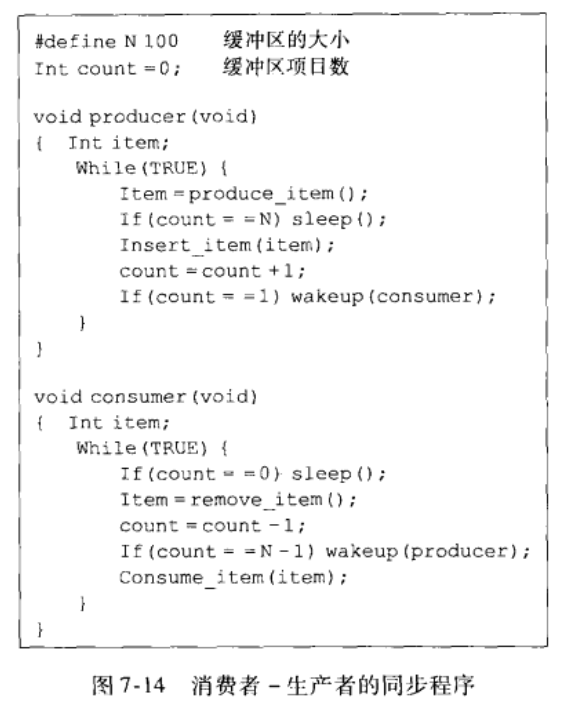

我们仔细来看上面的程序。最上面两行定义了缓冲区的大小（可容纳100件商品）和当前缓冲区里商品个数，初始化为0，生产者程序的运行如下：生产一件商品，检查当前缓冲区的商品数，如果已经满，则进入睡眠状态；否则将商品放入缓冲区，将计数加1。然后判断计数是否等于1，如果是，说明在放这件商品前缓冲区为0，有可能存在消费者来见到空缓冲区而去睡觉，因此需要发送叫醒信号给消费者。

消费者程序运行如下：先检查当前商品计数，如果是0，没有商品，当然睡觉去。否则，从缓冲区拿走一件商品，将计数减1。然后判断计数是否等于N-1，如果是，说明在拿这件商品前缓冲区为N，有可能存在生产者来见到满缓冲区而去睡觉，因此需要发送叫醒信号给生产者。然后尽情地享用商品。

这个程序看上去似乎正确无误。但真是这样吗？

可能有的读者会注意到一个问题：如果生产者在判断count ==1时发送叫醒信号给消费者，但也有可能没有消费者在睡觉（售货机空的时候，恰恰没有人来买东西，自然就不会有学生睡觉了），这个信号不是无的放矢吗？同里，消费者也存在无的放矢发送叫醒生产者信号的问题。那这是不是问题呢？

打过电报的人都知道，如果对方因故（如查无此人、此人暂时不在）无法接收电报，并不会造成什么危害，了不起就是大家浪费一点时间来收发这封电报而已。这里也是一样，如果发送的信号没有进程接收，则这个信号权当浪费了，并不会造成任何损害。因此，这个可能无的放矢的信号发送不是什么问题。

那还有没有其他问题呢？

我们看出来了，这个count有问题。因为变量count没有被保护，可能发生数据的竞争。即生产者和消费者可能同时对该数据进行修改。例如，假定count现在等于1，生产者先运行，对count加1操作后count变为2，但在判断count是否等于1之前，CPU被消费者获得，随后对count进行了减1的操作后切换回生产者，这个时候count等于1，因此生产者将发出叫醒消费者的信号。显然，这个信号是不应该发出的。

对count没有保护并不是上述程序的唯一问题。关键问题是上述程序可能造成生产者和消费者均无法往前推进的景况，即所谓的死锁。例如，我们假定consumer先来，这个时候count==0，于是睡觉去，但是在判断count等于0后却在执行sleep语句前CPU发生切换，生产者开始运行，它生产一件商品后，给count加1，发现count结果为1，因此发出叫醒消费者信号。但这个时候consuer还没有睡觉（正准备要睡），所以该信号没有任何效果，浪费了。而生产者一直运行直到缓冲区满了后也去睡觉。这个时候CPU切换到消费者，而消费者执行的第1个操作就是sleep，即睡觉。至此，生产者和消费者都进入睡觉状态，从而无法相互叫醒而继续往前推进。系统死锁发生。

那我们如何解决上述的两个问题呢？对第1个问题，解决方案很简单：用我们刚刚讲完的锁！在进行对count的操作前后分别加上lock和unlock即可防止生产者和消费者同时访问count情况的出现。不过有细心的读者会说，我们不就是因为锁存在繁忙等待才发明sleep&wakeup原语吗？怎么又把锁给请回来了呢？

确实，我们不喜欢锁所用的繁忙等待，因而发明了sleep wakeup原语。这样在需要等待时，我们去睡觉。但是，我们不喜欢等待，并不是一点都不能等待。只要等待的时间很短，我们是可以接受的。就是让一个人等1分钟，通常都不会觉得漫长。而在count的访问前后加上锁所造成的繁忙等待是很短的。不就是将商品放入或拿出缓冲区吗？这要多长时间呢。

好，上述解释勉强算把第1个问题解决了。但第二个问题怎么解决呢？

显然，生产者和消费者不会自己从睡觉中醒过来。所以如果二者同时睡觉去了，自然也无法叫醒对方。那解决的方案就是不让二者同时睡觉。而造成二者同时睡觉的原因是因为生产者发出的叫醒信号丢失（因为消费者此时还没睡觉）。那我们就想，如果用某种方法将发出的信号累积起来，而不是丢掉，问题不就解决了吗？在消费者获得CPU执行sleep语句后，生产者在这之前发送的叫醒信号还保留，因此消费者将马上获得这个信号而醒过来。而能够将信号累积起来的操作系统原语就是信号量。

## 信号量

信号量可以说是所有原语里面功能最强大的。它不光是一个同步原语，还是一个通信原语。

而且，它还能作为锁来使用！本章前面已经讨论过作为通信原语的信号量，现在我们来看其作为同步原语和锁的能力。
semaphore说白了就是一个计数器。其取值为当前累积的信号数量。它支持两个操作：加法操作Up和减法操作Down，分别描述如下：

Down减法操作：

1）判断信号量的取值是否大于等于1

2）如果是，将信号量的值减去1，继续往下执行。

3）否则，在该信号量上等待（线程被挂起）。

Up加法操作：

1）将信号量的值增加1（此操作将叫醒一个在该信号量上面等待的线程）。

2）线程继续往下执行。

这里提请读者注意的是，Down和Up两个操作虽然包含多个步骤，但这些步骤是一组原子操作，它们之间是不能分开的。如何实现原子操作我们将在第9章里论述。

Up和Down操作在历史上称为P和V操作。P和V指的是荷兰语里proberen和verhogen两个单词，分别表示增加和减少的意思。由于美国人在操作系统领域取得了绝对控制权，自然不能用什么荷兰语来表示操作系统里面最重要同步原语的两个基本操作，因此，将名字改为Up和Down。

如果我们将信号量的取值限制为0和1两种情况，则我们获得的就是一把锁，也称为二元信号量（Binary Semaphore），其操作如下：

二元信号量Down减法操作：

1）等待信号量取值变为1

2）将信号量的值设置为03）继续往下执行。

二元信号量Up加法操作：

1）将信号量的值设置为1。

2）叫醒在该信号量上面等待的第1个线程。

3）线程继续往下执行。

使用二元信号量进行互斥的形式如下：

~~~
down()
<临界区>
up()
~~~

由于二元信号量的取值只有0和1，因此上述程序防止任何两个程序同时进入临界区。二元信号量还可以用来管理线程的执行顺序，例如，下述程序保证B将在A之前执行完毕：

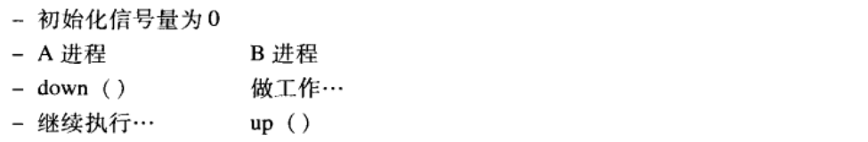

二元信号量具备锁的功能，实际上它与锁很相似：Down就是获得锁，Up就是释放锁。但它又比锁更为灵活：因为等在信号量上的线程不是繁忙等待，而是去睡觉，等另外一个线程执行Up操作来叫醒。因此，二元信号量从某种意义上说就是锁和睡觉与叫醒两种原语操作的合成。

有了信号量，我们就可以轻而易举地解决生产者和消费者的同步问题。具体说来如下：我们先设置三个信号量，分别如下：

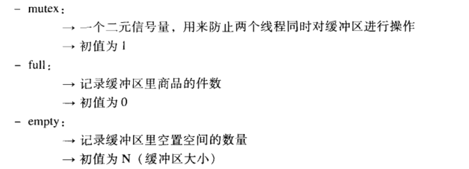

我们的生产者和消费者程序，如图7-15所示。

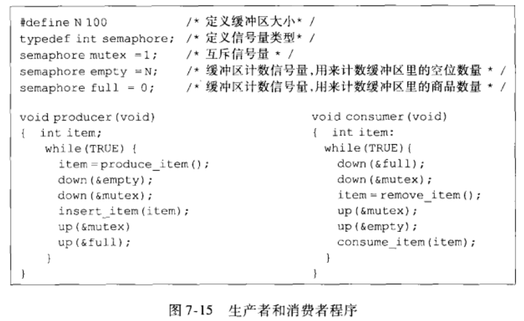

该程序解决了我们前一个版本的问题吗？很显然，上述程序中生产者和消费者不可能同时睡觉而造成死锁。因为两个人同时睡觉就意味着：full =0（producer才睡觉），并且empty=0（consumer睡觉的条件）。那么empty和full能够同时为0吗？当然不会，因为初值是empty=N而full=0，要使empty等于0，生产者就必须生产，而一旦生产者开始生产，full就不能为0了。所以两个不会同时睡觉。

这样上述程序既保护了缓冲区不会被生产者和消费者同时访问，又防止了生产者或消费者发送的信号丢失。生产者生产了多少商品，信号量ful1就取多大的值，这就相当于我们前一个版本里面的发送的信号的个数。而因为消费者等待的地方就是ful1这个信号量，因此，生产者生产了多少商品，就可以最多这么多次叫醒消费者。反之亦然，消费者消费了多少商品，信号量empty里就记录了多少数量，也就可以多少次叫醒生产者。这样解决了信号丢失问题。

到现在我们可以问一个问题了，就是为什么我们需要三个信号量呢？一个二元信号量用来互斥，一个信号量用来记录缓冲区里商品的数量不就可以了吗？缓冲区里空格的数量不是可以由缓冲区大小和缓冲区里商品的数量计算得出吗？干吗需要一个full和一个empty来记录满的和空的呢？这是因为生产者和消费者等待的信号不同，它们需要睡在不同的信号上。

## 锁、睡觉与叫醒、信号量

到现在我们看到，锁解决了同步问题，但带来的是循环等待，我们不满意。为了消除循环等待，我们发明了睡觉与叫醒。但睡觉与叫醒又带来了死锁，因此，我们发明了信号量。而锁的出现本章前面已经花了大量篇幅进行了介绍。由此可以看出，操作系统的各种原语操作并不是毫无联系的，而是一环扣一环，具有严密的逻辑连贯性。

那么信号量是否就是我们的终极原语了呢？它是否就没有任何问题了呢？

我们先来看一下，在图7-12的程序中，两个down的操作如果顺序颠倒的话，有什么问题？

例如，我们将消费者的两个down操作颠倒一下，即先down mutex，然后down ful1.假定con-sumer来了，先down mutex，因为mutex此时取值为1，这个down操作将通过，并且mutex的取值将变为0，消费者然后down full，由于full目前的值为0，于是消费者等在full这个信号量上，睡觉了。这个时候生产者来了，它先down empty，发现empty是N，于是顺利通过，接着down mutex，但是mutex的取值此时是0，因此生产者将等在mutex上。这样生产者等待消费者释放mutex，而消费者则等待生产者up full。两个人均无法继续推进，死锁产生。

同理，如果将生产者的两个down操作颠倒一下，也同样会产生死锁。

但如果我们将两个up操作颠倒一下，有什么问题吗？例如，将生产者的两个up操作颠倒一下，先up full再up mutex。由于信号量能够记住所有的信号，颠倒up操作将不会改变程序的正确性。但却可能使得程序的效率下降。例如，在做了上述修改后，生产者在mutex之间的临界区里面的操作增加了，这样，所有等待mutex的进程的等待时间就延长了。另外，如果系统在生产者up ful1之后，切换到叫醒的消费者，那么消费者叫醒后又将重新在mutex上等待。

这样也就多了一层开销。这些延时和开销在只有两个信号量时还不太会觉察到，但信号量多了，这种效率的下降就会明显。也许有的读者认为这点效率的不同无关紧要，那下面的这个真实故事将改变读者的看法。

在90年代前期，美国电话电报公司AT&T一直独霸美国的通信行业。绝大部分美国人均使用AT&T作为自己的电话服务公司。而后来者MCI（后来变为环球电信WorldCom）公司成立后，就面临着如何从AT&T公司抢夺客源的问题。自然，价格战是免不了的。但光靠价格战是不够的，MCI于是做起了研究。他们发现一个顾客拿起电话，拨完号后，等待对方应答的耐心是4秒钟。如果4秒钟内没有人应答，则75%的人会将电话挂断，不打了。MCI的进一步研究发现，AT&T的长途电话接通时间几乎总是超过5秒钟，有时候甚至要等十几秒钟才接通。这样MCI的机会就来了。那就是在4秒钟时间内接通顾客的电话。

但问题是，4秒钟接通顾客的电话做得到吗？从顾客拨号开始，就需要在数据库内进行查找，将被叫方的地址和所在服务局的信息调出来，并与主叫方的地址和服务局信息进行关联，选出最佳的路由，然后接通电话，这需要速度非常高的存储系统的支持。而市面上的存储系统都无法满足在小于4秒钟内读取大量数据的苛刻要求。MCI找来找去，终于找到了一家公司EMC，其麾下的Symmetrix高速智能存储系统满足其要求。就这样，MCI因为接通时间短于用户的心理等待极限而获得了大块的市场，EMC公司也因为能够生产高速存储器而称为MCI的最大存储设备供应商。由此可见，效率的高低有时候是决定性的因素。

由此我们也可以看出，使用信号量原语时，信号量操作的顺序至关重要。稍有不慎，就可能发生死锁。而这还是在我们只有三个信号量的情况。如果一个程序使用十个、几十个信号量，程序员将很难搞清楚正确的顺序到底是什么，而写程序将变成一个巨大的挑战。事实上，如果一个程序的信号量繁多，死锁或者效率低下几乎是可以肯定的。

那有没有办法改变这种状况，使得编程序不是那么大的一个挑战呢？有办法。办法就是管程。

## 管程

[什么是管程，管程机制及其使用方法详解](http://c.biancheng.net/view/1234.html)

前面说过，信号量存在程序编写困难或程序效率低下的问题。那我们就想，如果能够将信号量的这些组织工作交给一个专门的构造来管，程序员不就解脱了吗？于是我们发明了管程。管程的英文单词是Monitor，即监视器的意思。它监视的就是进程或线程的同步操作。

管程是一个程序语言级别的构造，即它的正确运行由编译器负责保证。这就是计算机里面的一条哲学原理：你不行的时候，把困难交给别人。

具体来说，管程就是一组子程序、变量和数据结构的组合。言下之意，你把需要同步的代码用一个管程的构造框起来，将需要保护的代码置于`begin monitor`和`end monitor`之间，即可获得同步保护。在任何时候只能有一个线程活跃在管程里面。那谁来保证这一点呢？编译器。编译器在看到`begin monitor`和`end monitor`时知道其间的代码需要同步保护，在翻译成低级代码时就会将需要的操作系统原语添上，使得两个线程不能同时活跃于同一个管程内。图7-16描述的就是一个管程的例子。

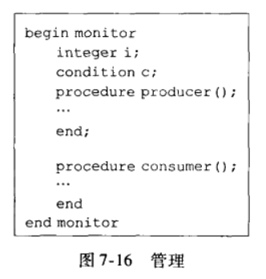

在管程里面，使用两种同步机制：锁用来互斥，条件变量用来控制执行的顺序。从某种意义上说，管程就是锁加上条件变量。那么什么叫条件变量？条件变量就是线程可以在上面等待的东西，而另外一个线程则可以通过发送信号将在条件变量上等待的线程叫醒。因此，条件变量有点像信号量，但又不是信号量，因为不能对其进行Up和Down操作。

管程的中心思想是运行一个在管程里面睡觉的线程。但是在睡觉前需要把进入管程的锁或信号量释放，否则在其睡觉后别的线程将无法进入管程，就会造成死锁。本书前面说过，在临界区里面做的事情要越少越好，那自然不能在里面睡觉了。但这里恰好相反。这是因为，在正常情况下，只有一个线程在临界区里，因此，在临界区待的时间越长，别的线程的等待时间就越长。但在这里情况就不一样了。因为允许别的线程进入管程，因此我们可以睡觉。

而实现锁的释放和睡觉这两件事情必须是原子操作，即中间不能有空挡，否则将造成两个线程同时活跃在管程里，这样就违反了我们关于管程的约定。当然了，这种违反并不会造成程序错误，因为其中的一个线程的下一步操作是睡觉，不会与另外的线程争夺共享资源。

下面我们来看如何使用管程来实现消费者生产者的同步（见图7-17）。我们在管程内部定义了两个操作：生产者往缓冲区插入商品的操作，和消费者从缓冲区取出商品的操作。由于这两个操作使用共享资源：缓冲区，因而需要同步。故此我们将其放在管程里面。

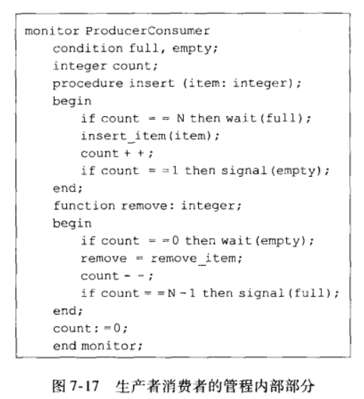

上图中我们看到两个条件变量full和empty；但没有看到锁。那锁在哪里呢？我们前面说过，管程的互斥保证由编译器负责，即编译器在编译上述代码段时将把与锁有关的部分加上。

因此，应用程序员不用担心这个问题。

管程里面的两个操作wait和signal的语义则分别如下：

wait（x）以原子操作完成下述三个步骤：
1）释放锁.
2）将本线程挂在条件变量x的等待队列上。
3）睡觉，等待被叫醒

signal则与我们前面讲过的一样，将等在指定条件变量上面的第1个线程叫醒。在叫醒方面，管程还提供另外一个所谓的广播原语（broadcast），其语义是将指定条件变量上面的所有等待线程全部叫醒。

这里需要读者注意的是，在一个线程调用wait.signal或者broadcast之时，该线程必须持有与管程相连的锁。

由于生产者对缓冲区进行操作的函数insert和消费者对缓冲区进行操作的函数remove均处于管程ProducerConsumer里面，而管程又具有自动防止两个或多个线程同时活跃于其内的功能，因而，缓冲区的访问，即缓冲区计数器count的修改都将是互斥的。

生产者生产商品的部分和消费者消费商品的部分处于缓冲区活动之外。生产者在生产出一件商品后，调用处于管程里面的insert函数来将商品放入缓冲区。而消费者则先调用管程里面的remove函数从缓冲区里面获取一件商品，然后在管程外面慢慢消费商品。图7-18则显示的是生产者和消费者在缓冲区外活动的部分。

下面我们仔细来分析一下在产者和消费者在缓冲区的工作流程。假如生产者先开始运作，生产出一件商品，然后调用insert函数。insert函数首先判断count是否等于N，如果等于N，则将自己挂在条件变量ful1的等待队列上，线程将切换到消费者。否则执行下一步操作将商品放入缓冲区，缓冲区计数count加1。然后判断count是否大于等于1，如果是，发出信号到条件变量empty上。此时，如果有消费者在该变量上等待，则将被叫醒。

如果消费者来到，它首先调用remove函数。remove函数先判断count是否等于0。如果是就将自己挂在empty条件变量的等待队列上，线程将切换到生产者。如果不是则执行下一步，将商品从缓冲区取出，计数器减1。然后判断计数器是否小于等于N-1，如果是，发送信号将可能在full上面等待的生产者叫醒。

乍一看，这个解决方案与本章前面介绍过的sleep和wakeup非常相似：只不过在那里，我们用的是sleep而不是wait，是wakeup而不是signal。那这个方案是否也存在sleep和wakeup方案的缺点，也就是死锁呢？

答案是否定的。这是因为，在使用睡觉和叫醒原语实现生产者和消费者同步的方案中，没有锁的使用。这样，在一个线程判断是否需要睡觉和真的去睡觉这两个操作中间存在空挡，从而对方可以在此时切入，造成信号的丢失，导致死锁的可能。但在管程机制下，这种空挡没有了。虽然判断是否需要等待和等待是两个语句，但请记住：进入管程需要获得该管程的锁（由编译器提供），因此，在一个准备等待的线程真正进入等待之前，由于其持有的管程锁尚未释放，另外的线程是无法执行管程里面的任何代码的。而在锁释放之时，相关线程已经进入等待状态此时如果一个线程发送信号，自然将被收到，而不会丢失。

这里提醒读者注意：一旦一个线程发出释放等待线程的signal，则此时将有两个线程同时活跃于管程内。而这，违反了我们对管程的约定。为了防止这个问题，管程机制特别约定：signal语句是一个线程在管程里面执行的最后一个操作。这样，即使理论上有两个线程同时活跃于管程内，但实际上只有一个线程活跃。因为另一个线程的下一步操作已经在管程之外。我们关于管程的约定从而得到维持。

### MESA 和 HOARE 管程

前面说过，当一个线程发出signal信号后，在理论上将有两个线程同时活跃在管程内。但我们知道，管程只有一把锁。如果两个线程同时活跃，那谁将持有管程的锁呢？

自然的想法是，由于发送signal的线程执行的是管程里面的最后一个语句，不如让其继续执行，从而转到管程外面（因为其下一步操作就是在管程外），这样管理里面不是还只有一个线程吗？即叫醒者继续持有锁，并在离开管程时将锁释放，此时被叫醒者将获得管程的锁，从而可以继续执行。这种处理方法自然，但是保守。因为如果这样的话，线程就没有必要提前叫醒等待的线程。为什么不等到执行到管程外面再叫醒呢？

第二种办法是给被叫醒者优先级，即在发送signa1时同时释放锁，让被叫醒者获得锁。从而在signal后，第一个运行的线程将是被叫醒的线程。叫醒者只能在被叫醒者运行完毕或因其他原因释放锁之后才能继续运行。这种方式因为是HOARE提出，因此这种给予被叫醒者优先的管程称为HOARE管程。

前面两种方法都是在管程设计时就确定了谁将有优先权：前者将优先权给了叫醒者，后者则将优先级给予被叫醒者。这两种方法因为都是在管程设计时就确定了，十分的不灵活，它限制了操作系统的作用。对于操作系统设计人员来说，我们希望下一步谁执行由操作系统说了算。即让两个线程竞争这把锁。这样，操作系统就可以在竞争中发挥作用，使用各种机制动态地调整每个线程获取锁的优先级。这种管程就称为MESA管程。

MESA管程的signal处理方式如下：叫醒者在发出signal后释放锁；被叫醒者与叫醒者同时竞争这把锁。谁先获得锁，谁先执行。

由于MESA管程给予了操作系统以重要角色，它获得大多数操作系统的认可。

## 消息传递

那么管程有什么问题没有？

有。管程最大的问题是对编译器的依赖。因为我们需要编译器将需要的同步原语加在管程的开始和结尾。而这是一个令操作系统人员不放心的选择。俗话说，“相信别人，就等着灾难的发生吧。”另外，搞编译的人也不想在这上面花费心血，他们有编译方面的许许多多的问题还没有解决。而且在实际上，多数的程序设计语言也并没有实现管程机制。

另外，管程只能在单台计算机上发挥效果。如果想在多计算机环境下（或者网络环境下）进行同步，那就需要别的一种机制了。这种别的机制就是消息传递。

消息传递是通过同步双方经过互相收发消息来实现。它有两个基本操作，发送send和接收receive。它们均是操作系统的系统调用，而且既可以是阻塞调用，也可以是非阻塞调用。

~~~
Send (destination, &message)
Receive (source, &message)
~~~

而同步需要的是阻塞调用。即如果一个线程执行receive操作，就必须等待收到消息后才能返回。也就是说，如果调用receive，则该线程将被挂起，在收到消息后，才能转入就绪。

图7-19描述的是使用消息传递实现的生产者和消费者同步问题：

在图7-19中，生产者每生产出一件商品，就需要从消费者那里获取一个空的盒子（m），然后将产品装进盒子里，再把装了产品的盒子发送给消费者。消费者的工作过程刚好反过来，先发送N个空盒子给生产者；然后等待生成者将生成的商品发送过来，消费了之后，将空盒子发送过去。而只要当前既有空盒子，又有满盒子，则生产者和消费者都可以独自运行。如果所有盒子都满了，生产者将在执行下一个receive操作时阻塞，直到消费者消耗掉一件商品并发回空盒子为止。如果在某个时候盒子全空了，则消费者在执行下一个receive时将阻塞，直到生产者生成出至少一件商品并发过来一个满盒子为止。

生产者和消费者就这样通过消息的传送进行同步，既不会死锁，也不会繁忙等待。而且，无需使用临界区等机制。更为重要的是，它可以跨计算机进行同步，即可以对处于不同计算机上的线程实现同步。由于这些优点，消息传递是当前使用非常普遍的线程同步机制（当然了，它更是一种通信机制，记得前面讲过的消息队列吗？）。

那么消息传递有什么问题没有？有。最大的问题就是消息丢失和身份识别。消息在一台计算机内部传递时丢失的可能很低，但在网络间传输时丢失的可能性就很大了，这是因为网络的不可靠性所致，而身份识别指的是你怎么确定收到的信息就是从你想要的对象那里发出的呢？

当然，通过设计各种网络协议，如TCP协议，我们可以将网络数据传输的可靠性提高。但即使是TCP，也不是100%可靠。身份识别则可以使用诸如数字签名和加密等技术来弥补。

使用消息传递的另外一个缺点就是效率。往返发送消息存在系统消耗。另外，数据传输也存在延迟。如果网络速度很慢怎么办呢？

## 栅栏

栅栏barrir，是本章最后要讲的一个通信原语。顾名思义，栅栏就是一个障碍。到达栅栏的线程必须停止下来，直到栅栏被除去才能往前推进。该原语主要用来对一组线程进行协调。因为有时候一组进程协同完成一个问题，我们需要所有进程都到同一个地方汇合之后一起再向前推进。例如，在进行并行计算时就会遇到此种需要，如图7-20所示：

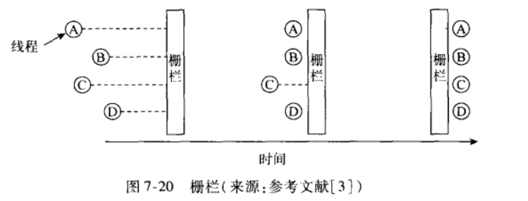

如矩阵乘法。在不优化的情况下，矩阵乘法的时间复杂性N立方（N为矩阵维数），而Stres-sen的优化算法则是将矩阵乘法分解为4个小矩阵的乘法，从而达到n^2.71^效率。而这个算法的思想是先计算出4个小矩阵乘法的结果，然后通过加减运算获得最后的结果。如果将4个小矩阵乘法用4个线程来执行，则最后的加减运算必须等待4个线程的乘法运算都结束后才能往前推进。而等待4个线程都到达同一个状态的机制就可用栅栏。

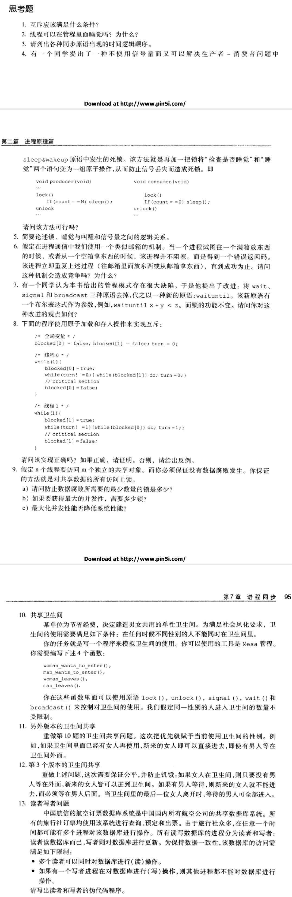

# 第8章：进程调度

**引子：**

> 11：4 	他们说：“来吧，我们要建造一座城和一座塔，塔顶通天，为的是要传扬我们的名，免得我们分散在				地上。
> 11：5 	耶和华降临，要看看世人所建造的城和塔。
> 11：6	 耶和华说：“看哪！他们成为一样的人，使用一样的言语，如今既做起这事来，以后他们所要做的事				就没有不成的了。”
> 11：7	“我们下去，在那里变乱他们的口音，使他们的言语彼此不通。”
> 11：8 	于是，耶和华使他们从那里分散在地上，他们就停工不造城了。
> 11：9 	因为耶和华在那里变乱天下人的言语，使众人分散在地上，所以那城名叫巴别（注：就是“变乱”的意				思，如图8-1）。
>
> ​																																——摘自《创世纪》11章4-9节

神通过调度驱散了聚集在一起的人类，而达到自己的目的。对于掌管着众多进程线程的操作系统来说，也需要通过调度、驱散或聚集进程，来达到维持计算机功能的目的。

## 调度的目标

本书前面讲过，在多进程、多线程并发的环境里，虽然从概念上看，有多个进程或线程在同时执行，但在单一CPU下，实际上在任何时刻只能有一个进程或线程处于执行状态。而其他线程则处于非执行状态。那么这就有一个需要解决的问题：我们是如何确定在任意时刻到底有哪个线程执行，哪些不执行呢？或者说，我们是如何进行线程调度的呢？

进程/线程的调度是操作系统进程管理的一个重要组成部分。其任务是怎么选择下一个要运转的进程。而要探明这一点，则首先需要确定操作系统进程调度的目标是什么。这样，就知道选择什么进程最合适。

那么操作系统进程调度的目标是什么呢？这需要对程序**使用CPU的模式**进行分析。那么程序在执行时有什么样的模式呢？

一般来说，程序使用CPU的模式有三种：**一种程序大部分时间在CPU上执行。另一种程序大部分时间在进行输入输出，还有一种程序则介于前两种模式之间**。

第一种程序运行的模式是在CPU上执行一阵较长时间，接着进行短暂的输入，然后又在CPU上进行较长的运算，之后又进行一下短暂的输入输出操作，就这样循环往复。这种程序由于使用CPU的时间大大多于其用于输人输出上的时间，因此称为**CPU导向**（CPU-bound）或**计算密集型程序**。计算密集型程序通常是科学计算方面的程序。计算宇宙大爆炸各种参数的程序和矩阵乘法程序等就都是CPU-bound的程序。

第二种程序则与第一种相反，这种程序的大部分时间用来I/O，每次1O后进行短暂的CPU执行，因此称为**I/O导向**（VO-bound）或**输入输出密集型程序**。一般来说，人机交互式程序均属于这类程序。如游戏程序，讲课时使用的PPT程序，就都属于I/O-bound的程序。

第三种程序自然介于二者之间，既有长时间的CPU执行部分，又有长时间的I/O部分。或者说，这种程序使用CPU和I/O的时间相差不大。这种程序称为平衡型程序。例如，网络浏览或下载、网络视频等就属于此类程序。

自然，对于不同性质的程序，调度所要达到的目的也有所不同。例如，对于VO-bound的程序来说，响应时间非常重要，而对于CPU-bound的程序来说，则周转时间（turnaround）就比较重要，对于平衡型程序来说，则进行某种响应和周转之间的平衡就显得重要。

## 处理器调度的总体目标

CPU调度就是要达到极小化平均响应时间、极大化系统吞吐率、保持系统各个功能部件均处于繁忙状态和提供某种貌似公平的机制。

极小化平均响应时间就是要极小化用户发出命令和看到某种结果之间所花费的时间，即减少做一件工作平均等待的时间；极大化系统吞吐率就是要在单位时间内完成尽可能多的程序，就是单位时间内能完成的工作数量，即整个系统运行效率高；保持系统各个功能部件繁忙就是要让CPU和输入输出设备均处于忙碌状态。因为CPU非常昂贵，让其闲置显然是一种浪费，因此保持CPU繁忙十分重要。就像人非常珍贵，因此要一直保持学习繁忙状态，才能不浪费生命。

提供公平就是要让各个程序感到某种“平等"，即在CPU面前“人人平等"。公平是任何系统都应该努力达到的目标。因为，没有公平，该系统对用户的吸引力就会急剧下降。就像一个国家或者社会，如果缺乏公平，公民对该国家的认同度就会急剧下降一样。

对于不同的系统来说，在调度目标方面也有一些细微的不同。例如，对于批处理系统来说，由于用户并不坐在计算机前面等待结果，响应时间就显得不太重要，但系统吞吐率、CPU利用率和周转时间则很重要。对于交互式系统来说，因为用户在等待计算机，因此响应时间要很快。但在这里要注意的是适度性（proportionality）。适度性就是响应时间要和期望值相匹配。这里是说你不要超越用户的期望。比如说，用户期待1秒钟的响应时间，你就给他1秒钟的响应时间，而不必提供0.1秒的响应时间。这是因为，提供超出用户期望的响应会增加系统设计的难度，而又不会提高用户的满意度（对于一个人来说，1秒钟和0.1秒钟的差别并不是很大）。对于实时系统来说，调度就是要达到在截止期前完成所应该完成的任务和提供性能可预测性。

## 先来先服务调度算法

先来先服务调度算法缩写为FCFS（first come first serve）。就是谁先来，就先服务谁。这个算法所有地球人都能想到。因为先来先到是人的本性中的一个公平观念，而且生活实际中这种规则随处可见。例如，我们排队买东西或者办理政务体现的就是先来先到原则。

先来先到的一个隐含条件就是不能抢占，一个程序一旦启动就一直运行到结束或者受阻塞为止。这是因为一旦允许抢占，就破坏先来先到的原则了。这类似于我们生活中的干部终身制。先来先到的优点就是简单，人人都能理解，实现起来容易。而缺点则是短的工作有可能变得很慢，因为其前面有很长的工作。这样就造成用户的交互式体验也比较差。

例如，有两个程序：A需要运行100秒，B需要运行1秒。A程序与B程序几乎同时启动，但B就是慢了一丁点，被排在A之后执行，则需要等100秒。这样A的响应时间为100秒，而B的响应时间则为101秒，从而，平均响应时间100.5秒。响应时间非常慢。

就像我们排队办理事情，你要办理的事情只要几分钟就可办好，而你前面的一个人办理的事情因为复杂需要1个小时。这个时候你要等在他后面就十分不高兴。这个时候你就想，要是每个人轮流办理10分钟事务的话，那多好呀。

自然，研究处理器调度的人也想到了这点，而这种轮流办理的调度方式就是时间片轮转。

## 时间片轮转

时间片轮转算法是对FIFO算法的一种改进，其主要目的是改善短程序的响应时间，其方法就是周期性地进行进程切换。例如每1秒钟进行一次进程轮换。这样，短程序排在长程序后面也可以很快得到执行。因此长程序执行1秒后就得把CPU让出来。这样整个系统的响应时间就得到改善。以前面的A、B程序为例，A需要运行100秒，B需要运行1秒。使用FIFO时系统平均响应时间为100.5秒。而使用时间片轮转，则A在执行1秒后，CPU切换到进程B，在执行1秒后，B结束，A接着执行99秒。这样A的响应时间是101秒，而B的响应时间为2秒。系统的平均响应时间是51.5秒。显然比FIFO强多了。

仔细的读者可能已经看出，系统响应时间依赖于时间片的选择。我们因为选择了1秒钟的时间片，上述系统的响应时间是51.5秒。如果时间片是10秒钟，则上述系统的平均响应时间将是65秒。如果选择别的时间片，则响应时间还将不同。那我们自然想知道，到底选择多大的时间片才合适呢？

显然，如果时间片选择过大，时间片轮转将越来越像FIFO，当时间片的选择超过任何一个程序所需要的执行时间长度时，则完全退化为FIFO，而时间片如果选择过小，则进程切换所用的系统消耗将太多，使得系统的大部分时间花在进程的上下文切换上，而用来真正执行程序的有用时间很少，从而降低系统效率，并造成浪费。

那如何选择一个合适的时间片呢？做研究。我们需要知道进行一次进程切换所用系统消耗和我们能够承受的整个系统消耗，就可以得出合适的时间片。例如，如果每次进程切换需要消耗0.1毫秒的CPU时间，则选择10毫秒的时间片将浪费约1%的CPU时间在上下文切换上；如果选择5毫秒的时间片，浪费为2%；20毫秒的时间片浪费为0.5%。如果我们能够承受的CPU浪费为1%，则选择10毫秒的时间片就很合理。

时间片选择还需考虑的一个因素是，有多少进程在系统里运行？如果运行的进程多，时间片就需要短一些，不然，用户的交互体验会很差。进程数量少，时间片就可以适当长一些。因此，时间片的选择是一个综合的考虑，需要权衡各方利益，进行适当的折中。

时间片轮转看上去非常公平，响应时间非常好，每个进程周期性的获得CPU时间。但时间片轮转真的很公平吗？时间片轮转的系统响应时间总是比FIFO的响应时间短吗？答案却是不一定。

还用上面的例子，如果是B比A略微先到，如果用FIFO，B的响应时间为1秒，A的响应时间为101秒，这样系统的平均响应时间为50.5秒。而这是最优的响应时间。如果使用时间片轮转，除非时间片选择的是1秒，否则时间片轮转的系统响应时间将比FIFO慢（记住，进程切换是需要消耗系统时间的）。

## 短任务优先

诚然，轮流坐庄和先来先到到底哪一种方式更公平是仁者见仁、智者见智的一个话题。但是一个事实是现在的社会都不太认同终身制，而更认同轮流坐庄。18世纪以前，欧洲的皇帝是终身制，逃到美国的清教徒则显然不喜欢终身制，从而选择了4年一轮的总统制度。而这种轮流坐庄的制度已被世界绝大多数国家和社会所认可，皇帝终身制度已被世人唾弃。从这点来说，时间片轮转比起FCFS来似乎更加公平。

那么时间片轮转真的那么公平吗？当然不是。如果每个人的能力一样，大家轮流坐庄当然比较公平，问题是并不是每个人的能力完全一样。让一个能力很差的人与一个能力很好的人轮流执政恐怕没有多少人会同意。我们不是因为不满大锅饭而提出让一部分人先富起来吗？而时间片轮转就是大锅饭！

我们前面举例说了，时间片轮转改善了所谓的系统响应时间的论断也不一定经得起推敲。

更为重要的是，时间片轮转所达到的系统响应时间并不是我们所能达到的响应时间下限。如果有30个用户，其中一个用户只需要1秒钟时间执行，而其他29个用户需要30秒钟执行，如果因为某种原因，这个只要1秒钟的程序排在另外29个程序的后面轮转，则需要等待29秒钟才能执行（假定时间片为1秒）。这个程序的响应时间和交互体验变得非常差。

那要改善短任务排在长任务后面轮转而造成响应时间和交互体验下降的办法就是短任务优先算法STCF（shorted time to completion first）。这种算法的核心是所有的程序并不都一样，而是有优先级的不同。具体说来，就是短任务的优先级比长任务的高，而我们总是安排优先级高的程序先运转。就像晚辈在公交汽车上遇到长辈时需要让座一样。

短任务优先算法有两个变种：一种是非抢占，一种是抢占。非抢占短任务优先算法的原理是让已经在CPU上运行的程序执行到结束或阻塞，然后在所有候选的程序中选择需要执行时间最短的进程来执行。抢占式短任务优先算法则是在每进来一个新的进程就需要对所有进程（包括正在CPU上运行的进程）进行检查，谁的时间短，就运行谁。

显然，由于短任务优先总是运行需要执行时间最短的程序，其系统平均响应时间在我们目前已经讨论过的几种调度算法里面是最优的。这就是STCF的优点。事实上，在所有非抢占调度算法中，STCF的响应时间最优。而在所有抢占调度算法中，抢占式STCF的响应时间最优。

下面我们来看一个例子：假定有A、B、C三个进程，A、B均是纯计算进程，分别需要使用CPU计算50和100毫秒，而C每计算1毫秒后进行9毫秒的输入输出操作，并这样重复10次。

显然，如果A，B单独运行，则CPU利用率是100%，如果C单独运行，则磁盘利用率为90%。

如果我们将它们一起运行，结果会怎么样呢？这里假定我们使用STCF调度算法。

要使用STCF算法，首先得搞清楚哪个工作是短工作，哪个是长工作。A，B，C三个进程相对来说，C是短工作，因为其使用CPU的时间远远小于其花在1O上面的时间。而A，B皆是长工作，但相对来说，A又是短工作，因为其使用CPU的时间小于B进程。这样，STCF调度的优先级就是C、A，B，由此我们获得如图8-2所示的调度模式：

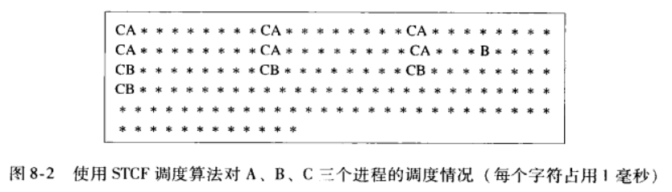

在STCF调度下，磁盘在90%的情况下保持繁忙，这与只运行C一个进程的结果相同。A进程在系统启动后55毫秒结束，B进程在系统启动后159毫秒结束，C进程在系统启动后99毫秒结束。故整个系统的平均响应时间为104.3毫秒。

如果使用FCFS算法，如果A或者B在C之前达到，则磁盘将闲置150毫秒后才能第一次启动，磁盘的利用率将大大低于STCF调度算法。而系统的响应时间（假定A在B前面）为A为50毫秒，B为150毫秒，C为250毫秒，平均响应时间为150毫秒，如果C在A，B前到达，由于C在执行1毫秒后就阻塞进行I/O，整个状况与A、B先来的时候差不多，这个留待读者完成。

如果使用时间片轮转，假定时间片大小为10毫秒，按照C，A，B的顺序轮转，我们获得图8-3所示的调度情况。

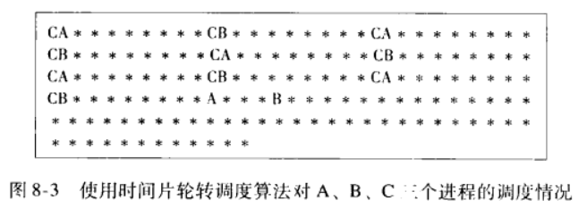

在时间片轮转情况下，系统的响应时间是A为104毫秒，B为159毫秒，C为99毫秒，平均响应时间为120.67毫秒。

由此可见，STCF的响应时间确实最短。当然，在时间片轮转的情况下，时间片大小选择的不同，结果将有所不同，但其响应时间不会短于STCF的响应时间。

但STCF调度也有缺点。第一是可能造成长程序无法得到CPU时间而导致饥饿，除此之外，还有一个重大缺点，就是我们怎么知道每个进程还需要运转多久？难道我们能够预测将来不成？就好像我讲这个课，我第一次讲时怎么知道会讲多长时间呢？

这个时候就需要做研究！我们可以用一些启发式（heuristic）方法来进行估算，例如，根据程序大小来推测一个程序所需CPU执行时间。但这个方法并不可靠。另外一个办法就是先将每个程序运行一遍，记录其所用CPU时间，这样在以后的运行中，即可根据这个实测数据来进行STCF调度了。

## 优先级调度

前面讲过的STCF有一个缺点是可能造成长进程饥饿。但这个问题比较容易解决，使用优先级即可。优先级调度算法的原理是给每个进程赋予一个优先级，每次需要进程切换时，找一个优先级最高的进程进行调度。这样，如果我们给长进程一个高优先级，则该进程就不会再有饥饿。事实上，STCF本身就是一种优先级调度，只不过它给予短进程高优先级而已。

优先级调度的优点是可以赋予重要的进程以高优先级以确保重要任务能够得到CPU时间。
其缺点则与STCF一样，低优先级的进程可能会饥饿。不过，这个问题在优先级调度算法里比在STCF里好解决：只要动态的调节优先级即可。例如，我们在一个进程执行特定CPU时间后将其优先级降低一个级别，或者将处于等待进程的优先级提高一个级别。这样，一个进程如果等待时间很长，其优先级将因持续提升而超越其他进程的优先级，从而得到CPU时间。这样，饥饿现象就可以防止。

不过，优先级调度还有一个缺点，就是响应时间不能保证，除非将一个进程的优先级设为最高。即使将优先级设为最高，但如果每个人都将自己进程的优先级设为最高，响应时间还是无法保证。

## 混合调度算法

我们前面提到过的所有算法都存在缺点，我们自然想设计一个算法合并它们的优点，摒弃它们的缺点。这就是所谓的混合调度算法。该算法的原理是将所有进程分成不同的大类，每个大类为一个优先级。如果两个进程处于不同的大类，则处于高优先级大类的进程优先执行；如果两个进程处于同一个大类，则采用时间片轮转来执行，如图8-4所示。

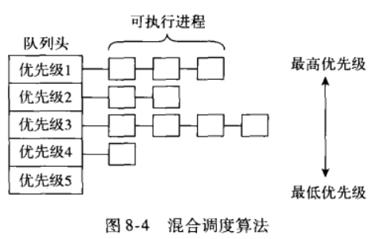

## 其他调度算法

除了上述介绍的各种算法外，有的操作系统还实现了一些其他算法，它们包括：保证调度Guaranteed scheduling）、彩票调度（Lottery scheduling）、用户公平调度（Fair share scheduling per user）。其中保证调度算法的目标是保证每个进程享用CPU的时间完全一样，即如果系统里一共有n个进程，则每个进程占用CPU的时间为1/n。保障调度就是保障每个进程使用1/n的CPU时间。保障就是肯定1/n的时间运转，而不是大概1/n时间运转。那么保障调度和轮转调度是一样吗？时间片轮转能不能达到1/n的效果？关键就是达到1/n不一定要靠轮转。轮转是能够达到1/n的，但是保障调度不一定要轮转。每次给的时间片不一定要一样。

彩票调度算法是一种概率调度算法。你买过彩票就知道，你买的越多中奖的概率越大。在该算法里，给每个进程分发一定数量的彩票，而调度器则从所有彩票里随机抽取一张彩票，持有该彩票的进程就获得CPU。这样，如果想让某个进程获得更多的CPU时间，我们可以给该进程多发几张彩票。彩票算法的优越性是显而易见的，通过给每个进程至少一张彩票就可以防止饥饿，因为该进程获得CPU的概率将大于0，除此之外，彩票算法还可以用于模拟其他进程调度算法。例如，如果给每个进程一样多的彩票，则该算法就近似保证调度算法；如果给短任务赋予更多的彩票，则将类似于短任务优先算法那么彩票调度有什么用呢？比如你要保障A进程50%的时间，那么就把一半的彩票分给A，这样的话就能保障50%。别的调度方法也可能达到这个效果，但是不灵活。

用户公平调度算法则按照每个用户，而不是每个进程来进行公平分配。前面讲过的算法均以进程为单位。这样一个贪婪的用户可以通过启动许多进程来夺占CPU时间。如果每个用户都很贪婪，都试图启动很多进程，则将造成整个系统效率低下，甚至停顿。用户公平调度算法就是将CPU时间按照用户进行平均分配。如果一个用户的进程多，则其所拥有的进程所获得的CPU时间将短，反之则多。

自然，CPU调度算法并不只有上面介绍的几种。由于不同系统的目标不同，不同进程的性质和重要性不同，进程调度也就不同。事实上，调度算法非常多，有兴趣的读者可以参阅在有关调度方面的大量的论文。

## 实时调度算法

实时系统是一种必须提供时序可预测性的系统。由于其应用范围广和特性不同于一般计算机系统，其调度算法也别其一格，和我们前面讲过的所有调度算法均有所不同。前面的算法主要考虑的是平均响应时间和系统吞吐率的问题，而实时系统则考虑每个具体任务的响应时间必须符合要求，即每个任务必须在什么时间之前完成，而无需考虑如何降低整个系统的响应时间或吞吐率。

比如计算来袭导弹轨迹的进程，其计算时间是非常有限的。如果进程不能在规定时间内计算出来袭导弹的轨迹，则结果毫无意义。但如果能够在截止时间前完成，那提前多少则无关紧要。这就是说，只要达到一定响应时间后，再提升响应时间并不能获得任何好处。比如，视频输出，在NTSC制式下（美国、日本、台湾使用的电视视频制式），只要每33毫秒发出一个图像帧，所看到的视频就是连贯的。而如果发送得比这更快，也不会获得任何额外的好处。其他实时系统还有物理控制系统，如核反应堆控制温度的系统、汽车测速机制等。

实时系统调度算法种类繁多，本书不可能覆盖。这样我们只论述一下其最主要或者说最经典的两种算法：动态优先级调度和静态优先级调度。动态优先级调度又称为最早截止任务优先算法（EDF，earliest deadline first），而静态优先级调度又称为最短周期优先算法（RMS，rate monotonic scheduling）。

### EDF 调度算法

该算法就是最早截止的任务先做。**如果新的工作来了，比正在运行的程序的截止期更靠前，那么就抢占当前进程**。EDF算法是实时调度里面的最优算法。如果一组任务可以被调度的话（指所有任务的截止时间在理论上能够得到满足），则EDF可以满足。一批任务如果不能全部满足，那EDF能满足的任务数最多。这就是它最优的体现。

例如，任务A需要15毫秒执行时间，截止时间在进入到系统后的第20毫秒，B需要执行10毫秒，截止时间为进入系统后的第30毫秒.C需要5毫秒执行时间，截止时间为进入到系统后的第10毫秒。使用EDF调度的结果就是先运行C，再运行A，最后运行B，如图8-5所示。

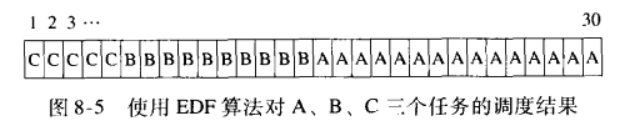

细心的读者可能已经看出，EDF就是STCF变化来的。如果将STCF的任务所需执行时间变为截止时间，则抢占式STCF就是EDF。

### RMS调度算法

EDF是一个动态调度算法。意思是该算法动态的计算每个任务的截止时间并动态调节优先级。如果需要，还会对当前进程进行抢占。虽然EDF在理论上是最优的，但动态计算截止时间和动态抢占CPU均要消耗系统资源，因此EDF实际效果比其理论效果要差一截。与EDF相对的是RMS调度。该算法在进行调度前先计算出所有任务的优先级，然后按照该计算出来的优先级进行调度，任务执行中间既不接收新的进程，也不进行优先级的调整或进行CPU抢占。因此这种机制的优点是系统消耗小，缺点是不灵活。一旦该系统的任务决定了，就不能再接受新的任务。

对于RMS算法来说，一个重要的任务是判断一个任务组能否被调度。而这个判断并不是容易做到的。Liu和Kayland在1973年证明了如果一个系统里所有任务的CPU的利用率低于1n2，则这些任务的截止时间均可以得到满足。具体说来，一个系统里所有任务的截止期如果想都得到满足，则这些任务必须满足下面的条件：

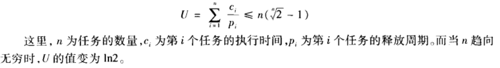

根据上述公式，如果CPU利用率在In2以下时，所有任务的截止期均可满足。因为1n2约等于0.693147，此时系统还剩下约30%的CPU时间。这个时间可以用来处理一些非实时任务。

RMS为静态最优算法。即如果任何静态优先级算法可以满足一组任务的截止期，则RMS也必能满足。具体证明请参阅Liu和Kayland于1973年发表的论文。

## 高级议题：调度异常之优先级倒挂

优先级倒挂（priority inversion）在第7章已经有所提及。其所指的是一个低优先级任务持有一个被高优先级认为所需要的共享资源。这样高优先级任务因资源缺乏处于受阻状态，一直到低优先级任务释放资源为止。这样实际上造成了这两个任务的优先级倒挂。如果此时有其他优先级介于二者之间的任务，并且其不需要这个共享资源，则该中级优先级的进程将获得CPU控制，从而超越这两个任务。

在某些时候，优先级倒挂并不会造成损害。高优先级任务的延迟并不会被注意因为低优先级进程最终会释放资源。但在其他一些时候，优先级倒挂则可能引起严重后果。如果一个高优先级进程一直不能获得资源，有可能造成系统故障，或激发事先定义的纠正措施，如系统复位。例如，美国的火星探测器Mars Pathfinder就是因为优先级倒挂而出现故障。

如果高优先级进程在等待资源时不是阻塞等待，而是循环（繁忙）等待，则将永远无法获得所需资源。因为此时的低优先级进程无法与高优先级进程争夺CPU，从而无法执行，进而无法释放资源。这将造成高优先级进程无法获得资源而继续推进。

优先级倒挂还可能造成系统性能降低。低优先级进程之所以优先级低是因为其所执行的任务并不重要。例如，它们可能是批处理任务或其他非交互式任务。而高优先级任务执行的则是较为重要的任务，如为交互用户提高数据或实时任务。由于优先级倒挂造成低优先级任务在高优先级任务之前执行，系统的响应将降低，甚至实时系统的响应时间保证都有可能受到违反。

### 倒挂的解决方案

优先级倒挂的问题在上世纪70年代就已经发现，但却没有找到一个可以预测其发生的方法。不过，虽然我们不能预测其发生，但却可以采取手段防止其出现。到目前为止，解决优先级倒挂的办法可以归结为如下几种：

* 使用中断禁止

这种办法的核心是通过禁止中断来保护临界区。在采用此种策略的系统巾只有两个优先级：可抢占优先级和中断禁止优先级。前者为一般进程运行时的优先级，后者为运行于临界区的进程的优先级。由于不存在第三种优先级，优先级倒挂无法发生。由于系统里只存在一个锁（中断禁止操作在任何时候只能由一个进程执行），乱序不会发生，因此死锁也不会发生。又由于临界区总能够不被打断而一直运行到结束，悬挂（hang）也不会发生。

这里需要注意的是所有中断都必须禁止。如果禁止的仅仅是一个特定的硬件设备的中断，则硬件的中断优先处理机制将再次引人优先级倒挂。

在多CPU环境则使用一个简单的变种：单一共享标志锁。该方法在共享内存里面提供一个单一标志。所有CPU进入跨CPU临界区时都必须先获得该标志。由于CPU间的通信昂贵并且慢，大多数此种系统都尽量不共享资源。因此这种方法在多数实际系统里都效果良好。

该方法普遍应用于简单的嵌人式系统。这种系统的特点是可靠性、简易性和资源需求低不过这种方法对程序员的要求较高，因此在程序设计时需要将临界区设计的很短，通常应该在100微秒以下。而这个时间对于通用计算机来说很不现实。

* 优先级上限（priority ceiling）

在此种方式下，共享的mutex进程（操作系统代码）有其自身的高优先级。一个程序如果进入mutex保护的临界区，将获得该临界区所具有的高优先级别。此时如果其他试图访问mutex的进程的优先级都低于mutex的优先级，则优先级倒挂将不会发生。

* 优先级继承（Priority inheritance

在此种方式下，当一个高优先级进程等待一个低优先进程所持有的资源时，低优先级进程将暂时获得高优先级进程的优先级别。这样就能防止一个中间优先级的进程抢占低优先级进程而延长资源占用时间。在释放共享资源后，低优先级进程回到其原来的优先级别。

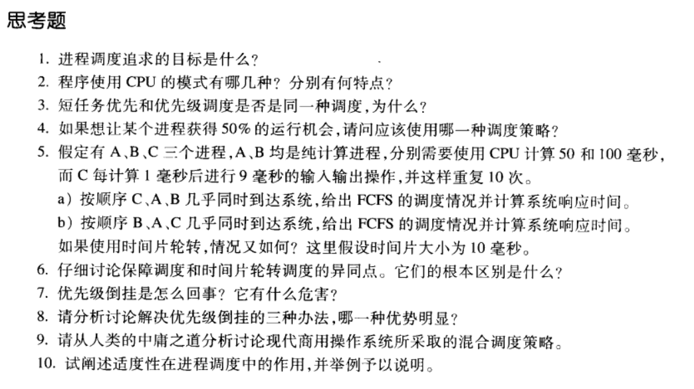

# 第9章：锁的实现

**引子：锁的实现哲学**

> 公元前356年7月下旬的一天，亚历山大出生在马其顿的佩拉城（Pella）。而这一天，位于小亚细亚的以傅所城的戴安娜寺庙突发大火而被烧毁。根据传说，这一天毁灭亚洲的力量降生到世上..…
>
> 公元前334年，在大败大流士的波斯军队后，亚历山大进兵到达小亚细亚的Phrygian。亚历山大在Phrygian首府Gordium城看到了著名的高登绳结。这个复杂不堪的绳结绑在一辆战车上。传说是谁能够打开这个绳结，谁就能成为世界的主人。自古以来，无数人试图破解这个绳结，却终究无人能破。
>
> 亚历山大来到绳结面前，注视着绳结良久。突然，他拨出随身佩戴的短刀，挥手劈下，将绳结斩开成两半，绳结随即打开。
>
> 后来，亚历山大果然征服了为当时西方人所知的“整个世界”

本章讨论的不是如何砍断绳结，而是如何打上绳结，使得亚历山大这样的人无法一刀砍断。

第7章中，我们引入了多种进程/线程同步机制。这些机制虽然各不相同，但都有一个特点，即同步原语均是原子操作，我们看一下闭锁的两个步骤：

1）等待锁变为闲置状态。
2）获得锁，