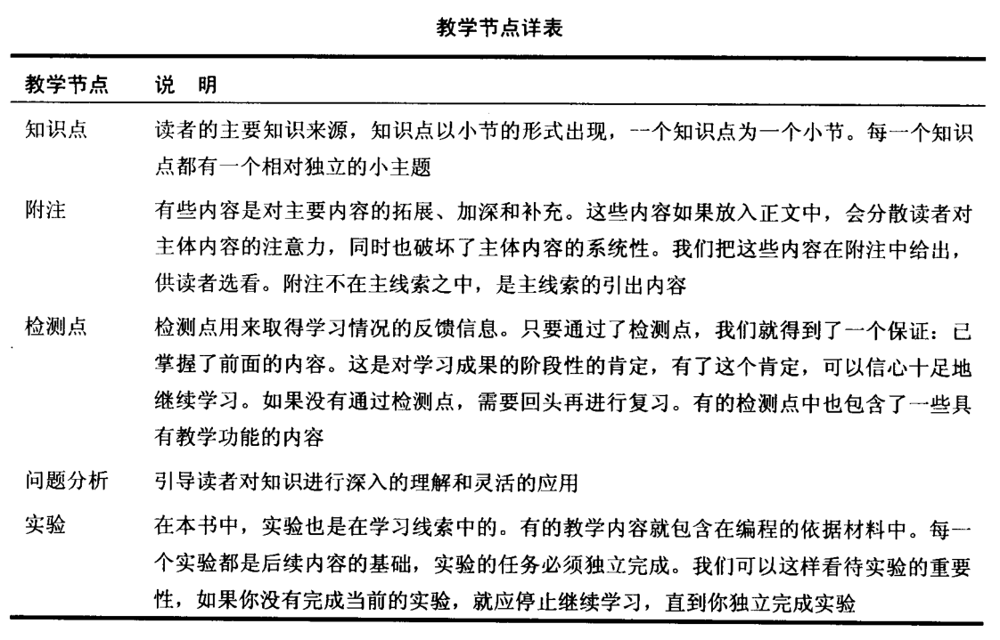
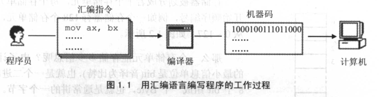
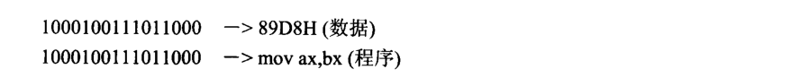
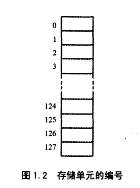
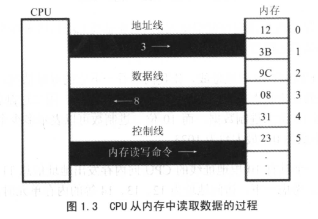

# 前言

汇编语言是很多相关课程（如：数据结构、操作系统、微机原理等）的重要基础。其实仅从课程关系的角度讨论汇编语言的重要性未免片面，概括地说，如果读者想从事计算机科学方面的工作的话，汇编语言的基础是必不可缺的。原因很简单，我们的工作平台、研究对象都是机器，汇编语言是人和计算机沟通的最直接的方式，它描述了机器最终所要执行的指令序列。我们想深入研究英国文化，不会英语行吗？汇编语言是和具体的微处理器相联系的，每一种微处理器的汇编语言都不一样，我们只能通过一种常用的、结构简洁的微处理器的汇编语言来进行学习，从而达到学习汇编的两个最根本的目的：充分获得底层编程的体验，深刻理解机器运行程序的机理。这两个目的达到了，其他目的也就自然而然地达到了。举例来说，你在学习操作系统等课程时，对许多问题就会有很通透的理解。

我们的学习不能在一台抽象的计算机上来进行，必须针对一台具体的计算机来完成学习过程。为了使学习的过程容易展开，本书采用以8086CPU为中央处理器的PC机来进行学习。8086CPU可以满足以下条件：常用而结构简洁，常用保证了可以方便地进行实践，结构简洁则便于进行教学。纯粹的8086PC机已经不存在了，对于现今的机器来讲，它已经属于古玩。但是，现在的任何一台PC机中的微处理器，只要是和Intel兼容的系列，都可以8086的方式进行工作。可以将一个奔腾系列的微处理器当作一个快速的8086微处理器来用。整个奔腾PC的工作情况也是如此，可以当作一台高速的8086PC来用。关于微处理器及相关的一些问题请参看附注1。

为了更好地引导、帮助读者学习汇编语言，作者精心创作了这本书。下面对教学思想和教学内容的问题进行一些探讨，希望在一些重要的问题上和读者达到共识。

**1.教学思想**

一门课程是由相互关联的知识构成的，这些知识在一本书中如何组织则是一种信息组织和加工的艺术。学习是一个循序渐进的过程，但并不是所有的教学都是以这种方式完成的，这并不是我们所希望看到的事情，因为任何不以循序渐进的方式进行的学习，都将出现盲目探索和不成系统的情况，最终学习到的也大都是相对零散的知识，并不能建立起一个系统的知识结构。非循序渐进的学习，也达不到循序渐进学习所能达到的深度，因为后者是步步深入的，每一步都以前一步为基础。

读者也许会问：“我们不是一直以循序渐进的方式学习吗？有哪本书不是从第一章到最后一章，又有哪门课不是从头讲到尾的呢？”

**一本书从第一章到最后一章，一门课从头到尾，这是一个时间先后的问题，这并不等于就是以循序渐进的方式在学习。**我们常有这样的感受，想认真地学习一门较难的课程，可是却经常看不懂书上的内容；有时觉得懂了，可又总有一种不能通透的感觉，觉得书上的内容再反复看，也不能深入下去了。这些情况都说明，我们并未真正以循序渐进的方式学习。

不能循序渐进地学习的根本原因在于：读者所用的教材并未真正地按循序渐进的原则来构造。这不是一个简单的问题，不是按传统的方法划分一下章节就可以解决的。举例来说，在传统的汇编教材中，一般都在开始的章节中集中讲CPU的编程结构，这一章往往成为大多数初学者的障碍。这章所讲的内容有的需要了解其他的知识才能深入理解，可是这些知识都被忽略；有的需要有编程经验才能深入理解，或不进行具体编程就根本无法理解，可编程要在后面的章节里进行…..

我们需要为读者构造合理的学习线索，这个学习线索应真正地遵循循序渐进的原则。我们需要打破传统的章节划分，以一种新的艺术来对课程的内容进行补充、分割、重组，使其成为一个个串连在学习线索上的完成特定教学功能的教学节点。这本书以此作为创作的核心理念，打破了传统的章节划分，构造了合理的学习线索，将课程的内容拆解到学习线索中的各个教学节点中去，学习主线索上的教学节点有4类：**（1）知识点（即各小节内容）**;
**（2）检测点**；**（3）问题和分析**；**（4）实验**。还有一种被称为附注的教学节点不在学习主线索之中，是由知识点引出的节点，属于选看内容。

应用这本书，读者将沿着学习线索来学习一个个知识点，通过一个个检测点，被线索引入到一个个问题分析之中，并完成一个个实验，线索上的每一个教学节点都是后续内容的基础；每一个节点的信息量或难度，又只比前面的多一点，读者在每一步的学习中都会有一种有的放矢的感觉。大的困难被分割，读者在学习的过程中可逐步克服。

这好似航行，我们为读者设计一条航线，航线上分布着港口，每一个港口都是下一个港口的起点。漫长的旅途被一个个港口分割，我们通过到达每个港口来完成整个航行。

为了按循序渐进的原则构造学习线索，本书采用了一种全新的信息组织和加工艺术，我们称其为：知识屏蔽。以往的教材**只注重知识的授予，并不注重知识的屏蔽**。实际上，在教学中**知识的屏蔽**十分重要，这是一个重点突出的问题。计算机是一门交叉学科，一部分知识往往还连带着其他的相关内容，这些连带的相关内容如果处理不好，将影响读者对目前要掌握的知识的理解。本书采用了**知识屏蔽**的方法，对教学内容进行了**最小化分割**，**力求使我们在学习过程中所接触到的每一个知识点都是当前惟一要去理解的东西**。我们在看到这个知识点之前，己理解了从前所有的内容；**在学习这个知识点的过程中，以后的知识也不会对我们造成干扰**。我们在整个学习过程中，每一步都走得清楚而扎实，不知不觉中，由当初的一个简单的问题开始，在经历了一个每一步都相对简单的过程之后，被带入了一个深的层次。这同沿着楼梯上高楼一样，迈出的每一步都不高，结果却上了楼顶。

**2.本书的结构**

本书由若干章构成，一章包含若干知识点，根据具体内容，还可能包含检测点、问题和分析、实验、附注等教学节点。书中的所有教学节点，除附注之外，都在一个全程的主线索之中。

由于本书具有很强的线索性，我们的学习一定要按照教学的线索进行，有两点是必须要遵守的原则：**（1）没有通过检测点不要向下学习**；**（2）没有完成当前的实验不要向下学习**。

下面的表格详细说明了书中的各种教学节点和它们的组织情况。

**3.教学重点和内容特点**

本书的教学重心是：通过学习关键指令来深入理解机器工作的基本原理，培养底层编程意识和思想。本着上面的原则，本书的内容将和传统的教材有着很大的不同：

（1）不讲解每一条指令的功能
指令仅仅是学习机器基本原理和设计思想的一种实例。而逐条地讲解每一条指令的功能，不是本书的重点所在，它应该是一本指令手册的核心内容。这就好像文学作品和字典的区别，前者的重心在于用文字表达思想，后者讲解每个字的用法。

（2）编程的平台是硬件而不是操作系统
这一点尤为重要，直接影响到以后的操作系统的教学。我们必须通过一定的编程实践，体验一个裸机的环境，在一个没有操作系统的环境中直接对硬件编程。这样的体会和经验非常重要，这样我们才能真正体会到汇编语言的作用，并且看到没有操作系统的计算机系统是怎样的。这为以后的操作系统的学习打下了一个重要的基础。

（3）着重讲解重要指令和关键概念
本书的所有内容都是围绕着“深入理解机器工作的基本原理”和“培养底层编程意识和思想”这两个核心目标来进行的。对所有和这两个目标关系并不密切的内容，都进行了舍弃。使读者可以集中注意力真正理解和掌握那些具有普遍意义的指令和关键概念。

本书在深入到本质的层面上对重要指令和关键概念进行了讲解和讨论。这些指令和概念有：jmp、条件转移指令、call.ret、栈指令、int，iret.cmp，loop、分段、寻址方式等。

**4.读者定位**

本书可用作大学计算机专业本科的汇编教材和希望深入学习计算机科学的读者的自学教材。本书的读者应具备以下基础：

* 具有计算机的使用经验；
* 具有二进制、十六进制等基础知识；
* 具有一门高级语言（BASIC，PASCAL，C...）的基本编程基础。

# 第1章：基础知识

汇编语言是直接在硬件之上工作的编程语言，首先要了解硬件系统的结构，才能有效地应用汇编语言对其编程。在本章中，对硬件系统结构的问题进行一部分的探讨，以使后续的课程可在一个好的基础上进行。当课程进行到需要补充新的基础知识（关于编程结构或其他的）时候，再对相关的基础知识进行介绍和探讨。本书的**原则**是，**以后用到的知识，以后再说**。

在汇编课程中不对硬件系统进行全面和深入的研究，因为这不在本课程的范围之内。关于PC机及CPU物理结构和编程结构的全面研究，在《微机原理与接口》中进行；对于计算机一般的结构、功能、性能的研究在一门称为《组成原理》的理论层次更高的课程中进行。汇编课程的研究重点放在如何利用硬件系统的编程结构和指令集有效灵活地控制系统进行工作。

## 机器语言

说到江编语言的产生，首先要讲一下机器语言。机器语言是机器指令的集合。机器指令展开来讲就是一台机器可以正确执行的命令。电子计算机的机器指令是一列二进制数字。计算机将之转变为一列高低电平，以使计算机的电子器件受到驱动，进行运算。

上面所说的计算机指的是可以执行机器指令，进行运算的机器。这是早期计算机的概念。现在，在常用的PC机中，有一个芯片来完成上面所说的计算机的功能。这个芯片就是我们常说的CPU（Central Processing Unit，中央处理单元），CPU是一种微处理器。以后我们提到的计算机是指由CPU和其他受CPU直接或间接控制的芯片、器件、设备组成的计算机系统，比如我们最常见的PC机。

每一种微处理器，由于硬件设计和内部结构的不同，就需要用不同的电平脉冲来控制，使它工作。所以每一种微处理器都有自己的机器指令集，也就是机器语言。

早期的程序设计均使用机器语言。程序员们将用0、1数字编成的程序代码打在纸带或卡片上，1打孔，0不打孔，再将程序通过纸带机或卡片机输入计算机，进行运算。

应用8086CPU完成运算s=768+12288-1280，机器码如下：

~~~
101100000000000000000011
000001010000000000110000
001011010000000000000101
~~~

假如将程序错写成以下这样，请读者找出错误。

~~~
101100000000000000000011
000001010000000000110000
000101101000000000000101
~~~

要书写和阅读机器码程序不是一件简单的工作，要记住所有抽象的二进制码。上面只是一个非常简单的小程序，就暴露了机器码的晦涩难懂和不易查错。写如此小的一个程序尚且如此，实际上一个有用的程序至少要有几十行机器码，那么，情况将怎么样呢？

在显示器上输出"welcome to masm"，机器码如下：

~~~
00011110
1011100000000000000000000
01010000
101110001100011000001111
1000111011011000
1011010000000110
1011000000000000
1011011100000111
101110010000000000000000
1011011000011000
1011001001001111
1100110100010000
1011010000000010
1011011100000000
1011011000000000
1011001000000000
1100110100010000
1011010000001001
10001101000101100010101000000000
1100110100100001
1011010000001010
10001101000101100011000100000000
1100110100100001
1011010000000110
1011000000010100
1011011100011001
1011010100001011
1011000100010011
1011011000001101
1011001000111100
1100110100010000
1101010000000010
1101011100000000
1101000000001100
1101001000010100
1100110100010000
1011010000001001
10001101000101100000000000000000
1100110100100001
11001011
~~~

看到这样的程序，读者会有什么感想？如果程序里有一个"1"被误写为"0"，又如何去查找呢？

## 汇编语言的产生

早期的程序员们很快就发现了使用机器语言带来的麻烦，它是如此难于辨别和记忆，给整个产业的发展带来了障碍。于是汇编语言产生了。

汇编语言的主体是汇编指令。汇编指令和机器指令的差别在于指令的表示方法上。汇编指令是机器指令便于记忆的书写格式。
例如：机器指令1000100111011000表示把**寄存器**BX的内容送到AX中。汇编指令则写成mov ax，bx。这样的写法与人类语言接近，便于阅读和记忆。

> 我叫阿Q，是CPU一号车间里的员工，我所在的这个CPU足足有**8个核**，就有**8个车间**，干起活来杠杠滴。
>
> 我所在的一号车间里，除了负责**执行指令**的我，还有负责**取指令**的小A，负责**分析指令**的小胖和负责**结果回写**的老K。
>
> CPU的每个车间都有**一堆箱子**，人们把这些箱子叫做**寄存器**，我所在的一号车间也不例外，我们每天的工作就是不断执行指令，然后折腾这些箱子，往里面存东西取东西。
>
> 由于我们四个人的出色工作，一号车间业绩突出，在年会上还多次获得了最佳CPU核心奖呢。

操作：寄存器BX的内容送到AX中

~~~
机器指令：10001001110110000
汇编指令：mov ax,bx
~~~

（**寄存器**，简单地讲是**CPU中可以存储数据的器件**，**一个CPU中有多个寄存器**。AX是其中一个寄存器的代号，BX是另一个寄存器的代号。更详细的内容我们在以后的课程中将会讲到。）

此后，程序员们就用汇编指令编写源程序。可是，**计算机能读懂的只有机器指令**，那么如何让计算机执行程序员用汇编指令编写的程序呢？这时，就需要有一个能够将汇编指令转换成机器指令的翻译程序，这样的程序被称为**编译器**。程序员用**汇编语言写出源程序**，再用**汇编编译器将其编译为机器码**，由计算机**最终执行**。图1.1描述了这个工作过程。

## 汇编语言的组成

汇编语言发展至今，由以下3类指令组成。

* **汇编指令**：**机器码的助记符**，有对应的机器码。

* **伪指令**：没有对应的机器码，由编译器执行，计算机并不执行。

* **其他符号**：如：+、一、*、/等，由编译器识别，没有对应的机器码。

汇编语言的**核心是汇编指令**，它决定了汇编语言的特性。

## 存储器

CPU是计算机的核心部件，它控制整个计算机的运作并进行运算。要想让一个CPU工作，就必须向它提供**指令和数据**。指令和数据在**存储器**中存放，也就是平时所说的**内存**。在一台PC机中**内存的作用仅次于CPU**。离开了内存,性能再好的CPU也无法工作。这就像**再聪明的大脑，没有了记忆也无法进行思考**。**磁盘不同于内存**，磁盘上的数据或程序如果不读到内存中，就无法被CPU使用。要灵活地利用汇编语言编程，首先要了解CPU是如何从内存中读取信息，以及向内存中写入信息的。

## 指令和数据

指令和数据是应用上的概念。**在内存或磁盘上，指令和数据没有任何区别，都是二进制信息**。CPU在工作的时候把有的信息看作指令，有的信息看作数据，**为同样的信息赋予了不同的意义**。就像**围棋的棋子，在棋盒里的时候没有任何区别，在对弈的时候就有了不同的意义**。

例如：内存中的二进制信息1000100111011000，计算机**可以**把它看作大小为89D8H的数据来处理，**也可以**将其看作指令mov ax，bx来执行。

## 存储单元

存储器被划分成若干个存储单元，每个存储单元从0开始顺序编号，例如一个存储器有128个存储单元，编号从0~127。如图1.2所示。

那么一个存储单元能存储多少信息呢？**电子计算机的最小信息单位是bit（音译为比特）**，**也就是一个二进制位**。
8个bit组成一个Byte，也就是通常讲的一个字节。微型机存储器的存储单元可以存储一个字节，即8个二进制位。一个存储器有128个存储单元，它可以存储128个字节。

**微机存储器的容量是以字节为最小单位来计算的**(比特实在是太小了，不好算)。对于拥有128个**存储单元**的存储器，我们可以说，它的容量是128字节。

对于大容量的存储器一般还用以下单位来计量容量（以下用B来代表Byte）：

~~~
1KB= 1024B  1MB=1024KB 1GB =1024MB  1TB=1024GB  (1Byte = 8bit)
~~~

## CPU对存储器的读写

以上讲到，**存储器**被**划分**成**多个存储单元**，存储单元**从零开始顺序编号**。这些**编号**可以看作**存储单元在存储器中**的**地址**。就像一条街，每个房子都有门牌号码。

CPU要从内存中**读数据**，首先要指定**存储单元**的**地址**。也就是说它要先确定读取哪个存储单元中的数据。**就像在一条街上找人，先要确定他住哪个房子里**。

另外，在一台微机中，**不只有存储器这一种器件**。CPU在读写数据时还要**指明**，它要对**哪一个器件进行操作**，**进行哪种操作**，**是从中读出数据，还是向里面写入数据**。

可见，CPU要想进行**数据的读写**，必须和**外部器件（标准的说法是芯片）**进行**3类信息的交互**：

* 存储单元的地址（**地址信息**）。
* 器件的选择，读或写的命令（**控制信息**）。
* 读或写的数据（**数据信息**）。

那么CPU是通过什么将**地址**、**数据**和**控制信息**传到**存储器芯片**中的呢？电子计算机能处理、传输的信息都是**电信号**，**电信号当然要用导线传送**。在计算机中专门有连接CPU和其他芯片的导线，通常称为**总线**。总线从**物理**上来讲，就是**一根根导线的集合**。根据**传送信息的不同**，总线从**逻辑**上又分为3类，即**地址总线**、**控制总线**和**数据总线**。

CPU从3号单元中读取数据的过程（见图1.3）如下：

（1）CPU通过地址线将地址信息3发出。
（2）CPU通过控制线发出内存读命令，选中存储器芯片，并通知它，将要从中读取数据。
（3）存储器将3号单元中的数据08通过数据线送入CPU。

写操作与读操作的步骤相似。向3号单元写入数据26：

（1）CPU通过地址线将地址信息3发出。
（2）CPU通过控制线发出内存写命令，选中存储器芯片，并通知它，要向其中写入数据。
（3）CPU通过数据线将数据26送入内存的3号单元中。

从上面我们知道CPU是如何进行数据读写的。可是，我们如何命令计算机进行数据的读写呢？

要让一个计算机或微处理器工作，应向它输入能够驱动它进行工作的电平信息（机器码）。

对于8086CPU，下面的机器码能够完成从3号单元读数据：

~~~
机器码：101000000000001 1000000000
~~~

含义：从3号单元读取数据送入寄存器AX

 CPU接收这条机器码后将完成上面所述的读写工作。
机器码难于记忆，用汇编指令来表示，情况如下：

~~~
机器码：10100000 0000001 0000000000
~~~

对应的汇编指令：MOV AX，[3]

含义：传送3号单元的内容到AX。

