(注1：现在自己写读书笔记不会书上全部文字照抄了，提高一下效率，不重要的自己眼睛看一遍就可以了，不用再文字写一遍了)

(注2：这本书应该比《数据库系统概览》简单一些，但是我现在还是看不懂)

(注3：数据库学习有两条路径，一个是从应用开始学，一个是从理论开始学。当然，最后应该能够把理论、应用结合起来，并且穿插学术研究和项目实践的历史发展及其背景。)

# 第1章：MySQL与开源运动

开源系统正迅速成为改变软件前景的一支重要力量，开源厂商在软件开发和技术支持方面展升现出来的高品质，已成为全世界的信息技术专家所关注和议论的焦点，有许多开源厂商的产品和服务都达到了世界一流的水准，大公司在关注着，因为开源软代能够让它们第一次有机会摆脱商业软件厂商的专利产品；小企业也在关注，因为开源软件可以大幅降低它们在信息系统方面的成本开支；开发人员也在关注，因为开源软件让他们有了更大的挑选余地。在现如今的因特网上，有许许多多的网站都是在Linux，Apache HTTP服务器、BIND、Sendmail、OpenSSL、MySQL和其他一些开源软件的基础上搭建起来的。

促使人们选用开源软件最常见的商业理由是成本。开源软件在从根本上减少软件产品的总体拥有成本（Total Cost of Ownership，TCO）的同时，还提供了一种可行的商业模式，让形形色色的企业去构建和完善它们的市场。具体到开源数据库系统，这一点体现得尤其明显。商业化专利数据库系统少说也要几千美元才能买到，如果加上技术支持方面的费用，总成本往往很容易就达到数万甚至数十万美元。

在过去，有许多人认为开源软件只限于爱好者或黑客们使用，而这些人的目的不过是扰乱大型商业软件公司的市场而已。应该承认，有些开发人员觉得自己就是站在微软巨人面前的大卫(圣经中，牧羊人大卫杀死了巨人哥利亚。这里借指某些开发人员认为他们是微软权威技术方面的克星。)，但开源社区与这些人完全是两回事。开源社区不以彻底取代某种商业专利软件为目标，他们对“开源”的解释是“向人们提供另外一种选择”。本章将向你展示，开源软件不仅让人们在商业软件之外多了一种选择，还在软件的开发和营销方面掀起了一场世界性的革命。

> 注解：在本书中，黑客这个词的含义同理查德·斯托曼（Richard Stallman）对黑客的定义：“热爱编程并为自己的聪明才智感到骄傲的人。”这与报章杂志上面提到的专门偷盗信用卡和损坏他人计算机系统的坏人有着本质的区别。

下面一节是为那些对开源软件或MySQL基本哲理还不甚明了的人准备的。如果你已经很熟悉开源软件的基本哲理，就可以直接跳到1.2节。

## 什么是开源软件

开源软件是人们有意识地抵制软件专利思维的产物。理查德·斯托曼在就职于MIT（Massa-chusetts Instiue of Techoloy，麻省理工学院）的人工智能实验室时，曾于20世纪70年代发起过一场代码共享运动。斯托曼当时的出发点是希望常用的代码能够为全世界的程序员所共享，而这意味着开发人员可以在全世界的范围内彼此合作。这一理念在斯托曼和他的圈内朋友中贯彻得很好-当然，这一切都发生在软件业集体决定软件属于专利并禁止与潜在的竞争对手进行共享之前。在那之后，MIT的许多研究人员因为各种原因离开MIT进入了这些软件公司。最终，这个原本合作无间的小集体消亡了。

幸好，斯托曼没有随波逐流，他留在MIT并创立了GNU（GNU's Not Unix）项目和自由软件基金会（Free Software Foundation，FSF），GNU项目的目标是推出一个没有专利束缚的Unix风格的操作系统。这个系统是自由的，并对所有人开放（包括对源代码的访问）。在这里，"自由”的概念是不禁止任何人使用和修改这个系统。

斯托曼的目标是重新组建一支能够像他们当初在MIT那样合作的开发人员社区。可是，斯托曼预见到这个系统需要一种版权许可证机制来保证一定程度上的自由。（据说，斯托曼用"copyleft"而不是"copyright”来表达自己对这种版权意义的理解，它的含义是保证软件能够自由交流而不是受到限制。）斯托曼起草了GPL（GNU Public License，GNU公共许可证），GPL是一份闪耀着智慧光芒的法律许可文书，它允许代码能够不受限制地进行复制和修改，但要求衍生出来的软件产品（以及被修改过的副本）在发行时必须遵守与原始版本完全相同的许可证，不得增加任何限制性条款。本质上来讲，GPL把专利因素全部排除在外，收到了利用版权法来抵制版权的效果。

遗憾的是，斯托曼的GNU项目最终还是没有完全成功，但它的几个阶段性成果已经成为许多开源系统的基本元素，其中最为成功的包括GNU的C语言编译器（GCC）和GNU文本编辑器（Emacs）。虽然GNU操作系统没能完成，但与斯托曼志同道合的人越来越多。李纳斯·托沃兹（Linus Torvalds）在斯托曼及其追随者的前期工作基础上终于填补了这一空白，Linux操作系统在1991年诞生了.Linux已发展成为一种自由的Unix风格的操作系统，斯托曼的心愿总算实现了。如今，Linux已是世界上最流行、最成功的开源操作系统了。

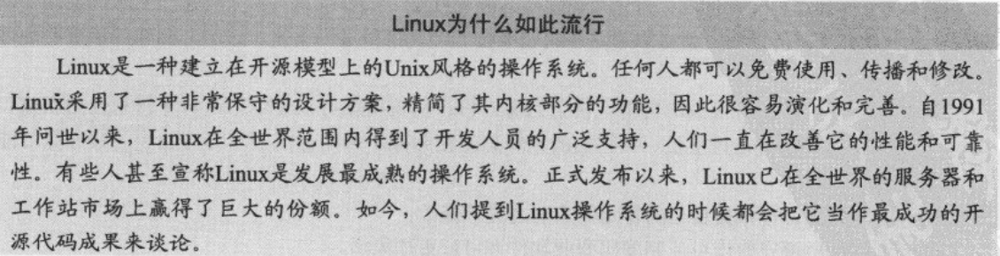

自由软件运动在其发展过程中也曾遇到过问题。这里所说的“自由”（free）指的是人们可以自由地使用、修改和传播有关软件，不是“免费”或“没有成本”的意思（请大家体会“自由发言”和“免费啤酒”的区别）。为了解决这个问题，那些先驱们组建了OSI（Open Source Initiative，开源倡议），并决定采用“开源”这个短语来描述GPL许可证所蕴涵和维护的“自由”含义。对此感兴趣的读者可以到www.opensource.org网站上去看一看。

> 需要注意的是斯托曼本人并不认可开源软件等同于自由软件。——编者注

OSI组织的努力改变了自由软件运动。软件开发人员开始认识到自由软件并非不需要支付成本，而开放软件也只有懂得与他人合作的团体和个人才能合法使用。随着因特网的迅速普及，合作性社区已经成为了一个世界性的开发人员社区。这个世界性的开发人员社区确保斯托曼的初衷能够得以延续。

因此，开源软件是这样一种软件，它用许可证制度确保开发人员在参与某个合作性社区（该社区的根本目的是让高质量的软件能够繁荣发展）的开发时，有权自由地使用它并对其进行复制、修改和传播。“开源”并不意味着零成本，它实际上意味着任何人都能参与某个软件的开发，因而可以无须支付任何费用使用那个软件。事实上，许多开源系统都依托于某个组织，由该组织发布，而该组织会通过为相关软件提供收费的技术支持服务来维持运转。这种模式下，使用该软件的组织可以消除启动成本，大幅减少软件维护费用来降低信息技术方面的成本。

回想当初，斯托曼坚信软件厂商应该通过售后技术服务而不是专利权来谋取利润。为此，他与其他人通过自身的努力创建了一个软件乌托邦。现在，所有的开源系统都与斯托曼等人的基础性工作有着千丝万缕的联系。斯托曼等人的愿望，有好几个都已实现。GNU/Linux（本书后面将只写作"Linux"）的发展催生出了许多通过销售定制的Linux发行版本、并向Linux提供技术支持服务而取得成功（并且赢利）的公司，Red Hat和Slackware就是其中的代表。另一个例子是MySQL，它现在已是最为成功的开源数据库系统。

在当今世界，软件乌托邦能否从人们理想中的概念变成现实还是个未知数，但人们已经可以下载一整套系统软件和工具软件让一台个人电脑或商用电脑运转起来，而无需为软件本身付费。从操作系统到诸如数据库和Web服务器之类的服务器系统，再到办公软件，几乎所有门类的软件都有相应的免费版本可供任何人下载和使用。

### 为什么要使用开源软件

人们总会问到这样一个问题：为什么说使用开源软件是一个好主意？如果你想一劳永逸地堵住那些商业专利软件支持者的嘴，就必须为这个问题准备一个无可辩驳的答案。选用开源软件最重要的理由包括以下几点。

(其他略，都是讲的开源软件好处之类的，和MySQL关系不大)

### 开源软件是否对商业软件构成真正的威胁

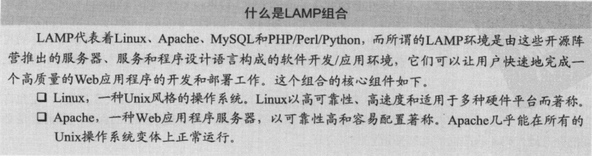

(其他内容略)

### 法律问题与《GNU宣言》

(略)

### 将开源进行到底

(略)

## 用MySQL进行开发

MySQL的诞生过程和它的内部结构对很多人来说还是个秘密。在这个系统的最低层有一个按照多线程模型用C和C+语言开发出来的服务器，这个核心组件的主要部分是在20世纪80年代早期建立起来的，后来又在1995年用一个SQL层对其进行了一些修改。MySQL是用GCC编译的。GCC编译器可以让人们根据目标环境对编译过程做出非常灵活的调整，这意味着MySQL经过编译能在几乎所有类型的Linux操作系统上运行。MySQL AB公司在把其产品移植到Microsoft Windows和Macintosh操作系统方面，也取得了令人瞩目的成功。由于可移植性和速度方面的考虑，MySQL的客户工具大部分是用C语言编写的。适用于.NET、Java，ODBC等环境的客户端库和访问机制也都应有尽有。

为了在规划和开发软件新版本的同时还能保证现有产品得到进一步完善，MySQL的开发活动采用了平行开发策略，也就是把软件的整个开发过程划分为一系列阶段，在每个阶段都会形成多个版本。
MySQL的开发过程可以划分为以下几个阶段：

### 为什么修改MySQL

修改MySQL可不是小事情。如果你是一位有经验的C/C++程序员并熟悉关系数据库系统的内部结构，你可以直接动手。如果不是这样，还是先花点儿时间去考虑一下为什么要修改一个数据库服务器系统，再制定一份详细的修改计划比较稳妥。

需要自己动手修改MySQL的理由很多。比如说，你需要一种新的数据库服务器或客户功能，但没有现成的东西能提供这种功能。再比如说，你有一套定制的应用程序需要一种特定类型的数据库行为，与选用一种商业专利系统相比，自己动手修改MysQL来满足你的要求更简单、更合算。通常你所在的组织无力自行开发一个像MySQL那样复杂精细的数据库系统，但你的解决方案又需要有个东西作为基础。如果你想让自己的应用程序达到世界一流的水平，还有什么办法会比使用一个世界一流的数据库系统作为它的基础更好呢？

> 注解开源的魅力在于：如果某项功能真的非常有用并且有人认为它可以赚钱，这项功能就会以其独到的方式融入某个产品。肯定会有某人在某地研究和建立这项功能。

学习MySQL源代码的最佳办法是反复阅读！本书向大家介绍了MysQL的源代码，讲授了如何添加各种新功能，并介绍了与需要修改哪些代码（以及不应该修改哪些代码）有关的最佳实践经验。接下来的几章还将详细地告诉大家如何获得MySQL源代码，以及如何把修改合并到一个适当的代码路径（分支）里去。还将介绍MySQLAB公司编程指南的细节，对代码样式以及应该避免哪些代码结构等问题提出了明确的建议。

### MySQL里哪些可以修改，有什么限制

MySQL的源代码很复杂，难以阅读和理解。
有人说那些代码的条理很不清晰，也有人说那是天才头脑才能想出的东西。总而言之，阅读那些源代码对最优秀的CC++程序员来说也是一个挑战。

那些复杂的C/C+代码有些让人望而生畏，但那纯属技术问题，与你是否有权修改这个软件没有任何关系。绝大多数程序员修改MySQL源代码的目的是为了增加几条新的SQL命令，或是把某个现有的SQL命令改得更能满足自己对数据库的需求。请不要满足于此，MysQL里可以修改的东西并不仅限于其SQL行为，优化器、查询命令的内部编码格式，甚至是查询缓存机制都可以修改。

### MySQL的许可证问题

(略)

### 到底能否修改MySQL

(略)

### 修改MySQL的指导原则

(略)

## 实际的例子：TiVo

(略)

## 小结

本章回顾了开源软件的起源和MySQL崛起为一个世界级数据库管理系统的发展历程，讲解了什么是开源系统，并把它们与商业专利软件进行了对比。文中还介绍了开源许可证的来龙去脉，说明了作为全球开发人员社区里的一员应该承担哪些责任。

本章还对使用MySQL进行开发的问题做了简要的讨论，介绍了MySQL源代码的特点，给出了一些修改它们的指导原则。文中还讲到了MySQLAB公司采用双重许可证的做法以及对修改MysQL的行为有何约束。最后，讲述了一个把开源系统和商业产品集成在一起并取得巨大成功的例子。

下一章将以MySQL为例对关系数据库系统进行剖析，并介绍如何根据自己的需求对MysQL进行定制。本书的第二部分和第三部分将探讨MysQL的内部工作原理，以及它的源代码中最本质的部分。

# 第2章：数据库系统剖析

想知道数据库系统内部发生着什么吗？你也许知道**关系数据库系统（relational database system，RDBS）**的基本概念，，甚至是一位管理这类系统的专家，但你可能从未探索过数据库系统的内部工作原理。本书的读者中有很多人可能接受过培训并具备管理数据库系统的经验，但学校或职业培训课程在讲解数据库系统构造时往往一笔带过，并不e入讨论。数据库专业人员可能一辈子也不会用到这些知识，但知道系统的工作原理肯定是件好事，这些知识可以帮助你理解如何把服务器优化到最好，让你了解如何把它的功能发挥到极致。

本章将介绍RDBS的各个子系统以及如何构造这些子系统的基础知识。我将以MySQL为例对现代RDBS的核心组件进行剖析。如果你曾学习和研究过这些系统并希望赶快去看看MysQL的体系结构，请直接看2.4节。

## 数据库系统的体系结构

熟悉RDBS的内部工作原理，对于数据库的日常使用、维护和开发工作来说，并非必不可少的先决条件，但如果你想修改或扩展其功能的话，了解这类系统的组织方式就非常重要了。此外，数据库系统并非只有RDBS一种，如果你想知道其他类型的数据库系统与RDBS相比都有哪些优劣之处，掌握几种最流行的数据库系统的基本工作原理是很重要的。

## 数据库系统的类型

RDBS是目前最常见的数据库系统，但另外几种数据库系统也正变得越来越流行。本节将对三种最流行的数据库系统进行介绍和对比，它们是面向对象的数据库系统、对象关系数据库系统和关系数据库系统。只有了解了这些系统的体系结构和基本功能，你才会明白，MySQL AB公司把MySQL开发为一个开放源代码软件并向全世界公开其源代码的做法，是一件多么值得钦佩和赞赏的事情。如果不是这样，本书根本不可能向你展示这个魔盒里的宝物。

如果你熟悉这几种数据库系统，可以跳到2.3节。

### 面向对象数据库系统

面向对象数据库系统（object-oriented database system，OODBS）是支持面向对象编程（object-
oriented programming）模型的数据存储和检索机制，它可以直接把数据当作对象来处理。这类系统包括真正的面向对象（objet-oriented，00）类型的系统，在应用程序和数据库之间传输的是不同类型的对象。不过，大部分OODBS都没有标准的查询语言。（一般通过编程接口来访问数据），所以还算不上是真正的数据库管理系统。

OODBS是RDBS的有力竞争对手，尤其是在应用程序方面，RDBS的建模能力，或者说把数据以对象的形式存入表中的能力有所欠缺。有些应用程序包含大量的数据，并且不会将它们删除，因而就需要管理各个对象的历史。OODBS最独特的功能是它能通过指定可经由某种OOP接口应用到复杂对象的相关操作和结构，来为复杂对象提供支持。

OODBS特别适用于建立与现实世界尽可能一致的模型，不需要人们刻意地在各有关实体之间及其内部定义种种不自然的联系。面向对象的原理就是全面地并且通过建模的手段来再现真实的世界，这种再现对于处理那些变化迅速的事物（比如为某种会随时间而发生变化的东西建立模型）往往是必不可少的，尤其是在需要为结构化的数据添加00功能的场合。不过，虽然宣称自己是一个OODBS的开源软件有很多，但其中有很大一部分不过是在关系数据库系统的基础上增加了几个查询语言接口的产物，与其说它们是OODBS，还不如说它们是带00接口的关系数据库系统。严格地讲，真正的OODBS只允许通过某种编程接口去访问数据。

OO数据库系统的应用领域主要包括：地理信息系统（geographical information system，GIS）、科学和统计数据库、多媒体系统、图片存档和通信系统、XML仓库，等等。

OODBS最受推崇的是数据（即对象）及其行为（即方法）是其专有的。大多数OODBS系统集成商都依赖00方法来描述数据，并将这种表现形式应用于设计中来构建他们的解决方案。因此，OODBS是为特定的实现而构建的，不会是通用的，也不像RDBS那样普遍具有“语句-响应-类型”接口。

### 对象关系数据库系统

**对象关系数据库系统（object-relational database system，ORDBS）**是00技术与RDBS相结合的产物。ORDBS提供了一种机制，允许数据库的设计者为00数据概念实现结构化存储和检索机制。ORDBS提供了关系模型的基础-含义、完整性、关系等，并扩展了这个模型，数据的存储和检索都围绕着对象来进行。ORDBS的具体实现有很多是纯概念性的，这是因为把00概念映射到关系概念的理论和实践目前仍处于探索阶段。对关系数据库技术的修改或扩展，需要修改SQL语言使之支持对象类型、实体、封装操作和继承机制。然而，这些东西往往只是松散地映射到关系理论中的复合数据类型上而已。要知道，SQL语言再怎么扩展也无法提供真正的对象操作和OODBS的控制水平。目前最流行的ORDBS是ESRI公司推出的ArcGIS Geodatabase环境，其他例子还有Oracle和Informix。

ORDBS中的技术使用了基本的关系模型。绝大多数ORDBS是使用现有的商业关系数据库管理系统（如Microsoft SQL Server和Oracle）实现的。因为这些系统是建立在关系模型的基础上的，所以在把00概念转换为关系机制的方面会遇到这样或那样的困难。下面是一些在使用关系数据库去开发面向对象应用程序时经常遇到的问题。

~~~
把OO概念模型映射到数据表不那么容易。
复杂的映射关系意味着复杂的程序和查询。
复杂的程序意味着维护问题。复杂的程序意味着可靠性问题。
复杂的查询不容易优化，进而导致性能很低。
与关系系统相比，从对象概念到复合类型的映射更容易因为模式的变化而崩溃。
select all  where查询的00性能比较低，因为它涉及更多的联接和查找操作。
~~~

这些问题看起来很麻烦，但解决起来并不困难：增加一个OO应用程序层作为关系数据库和00应用程序之间的通信接口，让这个应用程序层去完成把对象转换为结构化（或永久性）数据存储的工作。有意思的是，这种做法违背了ORDBS的概念：这其实是在使用一种00访问机制去访问数据，而创建ORDBS的目的是为了使用一种查询语言（及其扩展）在RDBS里存储和检索对象。

ORDBS与OODBS有很多相似之处，但这二者的内部原理有着很大的差异。OODBS是试图通过一种编程接口和平台把数据库功能添加到00编程语言里去，ORDBS则是试图通过传统的查询语言及其扩展把更多的数据类型添加到RDBS里去。OODBS想要达到的目的是与0OP语言的无缝集成，ORDBS没有这么大的野心-它们通常需要一个中间应用程序层把来自00应用程序的信息转发给ORDBS或底层的RDBS，还有，OODBS侧重于以00技术为核心的应用程序，ORDBS侧重于对支持海量数据的基于对象的系统（如GIS应用）。最后，OODBS的查询机制以专用的00查询语言操作对象为核心，ORDBS的查询机制更倾向于使用对SQL标准的扩展来快速检索大量数据。真正的OODBS都有经过优化的查询机制，如ODL（Object Description Language，对象描述语言）和OQL（Object Query Language，对象查询语言），而ORDBS使用的查询机制则是SQL查询语言的扩展。

ESRI公司的GIS应用程序套件产品里包含着一个名为Geodatabase（geographic database的缩写）的组件，该组件支持地理数据元素的存储和管理。Geodatabase是一个支持空间数据的ORDBS系统，是被实现为ORDBS的空间数据库的例子。

ORDBS基于关系数据库平台是一个事实，但它们也提供了一些数据封装的层次和行为的层次。
绝大多数ORDBS都是RDBS的特殊形式。提供ORDBS产品的数据库厂商通常通过修改SQL以包含对象描述符和空间查询机制的办法，来扩展“语句-响应”接口。这类系统基本上都是为了某种特殊的应用而建立的，所以它们的通用性也像OODBS那样受到了局限。

> 尤其是在一个已经存储了不少信息的数据存储里改变对象的类型的时候。根据模式的变化情况，对象的行为有可能发生改变而不再有原来的意义。改变模式是一个需要深思熟虑的决策，但这个改动对ORDBS的影响，往往比对一般关系系统的影响严重。

### 关系数据库系统

RDBS是基于数据的关系模型（Relational Model of Data）的数据存储和检索服务，该模型是**E.F.Codd**于1970年提出的。这些系统是结构化数据的标准存储机制。正如C.J.Date在他的The Database Relational Model：A Retrospective Review and Analysis一书中所讨论的那样，人们已经进行了大量的研究去充实和细化Codd提出的原始模型。这个模型在理论和实践方面的发展历史在C.J.Date和H.Darwen合著的Foundation for Future Databse Systems：The Third Manijesto一书中有最好的介绍。

关系模型是一个很直观的概念：把数据集中存储在某个地方（数据库），人们使用一种被称为查询语言的机制检索、修改和插入数据。因为有着全面系统的理论、坚实的数学基础和简单的结构，关系模型已经被很多厂商所实现。最常用的查询机制是SQL（Structured Query Language，结构化查询语言），它与自然语言很相似。虽然SQL没被收录在关系模型里，但在实际应用中，SQL却是RDBS里的关系模型不可缺少的组成部分之一。

在关系模型里，数据被表示为关于某个实体的一组相关信息（属性），这些属性的值构成了一个数学意义上的集合，术语称之为元组（tuple，有时也称为记录），元组被保存在包含具有相同属性集的元组的表里。这些表再通过域、键、属性和元组上的约束条件与其他表建立起关系。

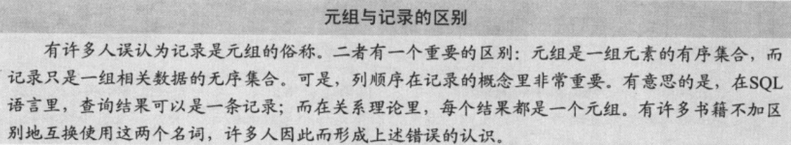

SQL是绝大多数RDBS首选的查询语言。SQL是在20世纪80年代作为一项标准而推出的，它目前已是一项行业标准。有不少人错误地以为SQL来自关系理论，因而是一个坚实的理论概念。这种错误认识的来源大概是因为几乎所有的RDBS都实现了SQL的某种形式。这种流行掩盖了SQL的许多不足，其中包括以下这几点。

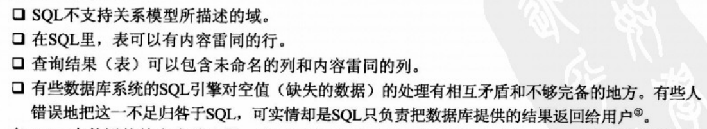

在RDBS中使用的技术多种多样。有些系统偏重于优化关系模型的某个部分，还有些系统是用来优化数据模型的某些应用。有些RDBS只能完成简单的数据存储和检索工作，而高级的RDBS应用程序套件能够对复杂的数据、过程和工作流进行处理。你可以用一个简单的数据库来保存家中光碟的相关信息，可以用一个数据库来管理宾馆的客房预订系统，也可以用一个复杂的分布式系统来管理网上的信息。正如我在第1章里提到的那样，正是由于MySQL成为存储有关数据的数据库，许多Web应用（尤其是采用了Web 2.0技术的）才得以在LAMP组合上实现。

关系数据库系统提供了最健壮的数据独立性和数据抽象性。通过使用“关系”这个概念，RDBS提供了一种真正通用的数据存储和检索机制。与此相应的是，这些系统也变得极其复杂，需要专家来建立和维护。

下一节将对RDBS的体系结构及其各组成部分进行剖析。之后，还将剖析一个RDBS的具体实现（MySQL）.

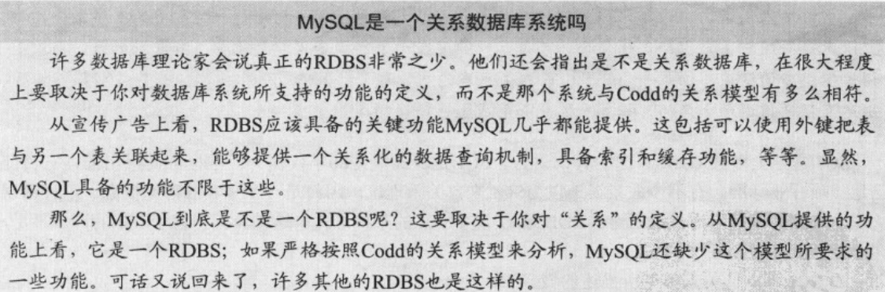

## 关系数据库系统的体系结构

RDBS是一种由特殊机制组成的复杂系统，这些复杂机制专门用来处理存储和检索信息所需的全部函数。人们经常把RDBS的体系结构与操作系统的体系结构相提并论。如果观察一下RDBS（尤其是在那些拥有大量客户端的服务器上）的工作情况，就会发现它们与操作系统有许多共同点。比如说，有多个客户端意味着这个系统必须处理许多请求，而这些请求有可能会在同一时间访问被存储在同一个位置（比如同一个表）的数据。因此，RDBS必须具备高效的并发处理能力。类似地，RDBS必须迅速地向每一个客户端提供它们所检索的数据，这通常是利用文件缓存技术，将最新或最常用的数据保存在内存里而实现的。进行并发处理所需要的内存管理技术与操作系统中的虚拟内存子系统很相像。RDBS与操作系统的其他类似之处还包括网络通信支持，以及为最大限度地提升数据查询命令的执行性能而专门设计的优化算法。

我将从用户的角度，从检索数据的查询操作开始对RDBS体系结构的探索之旅。在接下来的几节里，你可以跳过已经熟悉的内容去阅读自己感兴趣的东西。但我建议大家把所有小节都读一遍，因为它们将向你全面展示一个典型的RDBS的构造细节。

### 客户端应用程序

绝大多数RDBS客户端应用程序都是与服务器分离的可执行程序，它们通过一条通信路径（例如套接字或管道等某种网络协议）与数据库连接。另外一些通过编程接口直接连接到服务器系统，此时的数据库系统变成了客户端应用程序的一部分，这类数据库被称为嵌入式系统。对嵌入式数据库系统的详细讨论见第6章。

在那些通过一条通信路径去连接数据库的系统当中，绝大多数是通过一组被称为数据库连接器的协议建立连接的。数据库接口大都基于ODBC（Open Database Connectivity，开放数据库连接）模型。MySQL还支持用于Java（JDBC）和Microsoft.NET环境的连接器。多数ODBC连接器也支持网络协议上的通信。

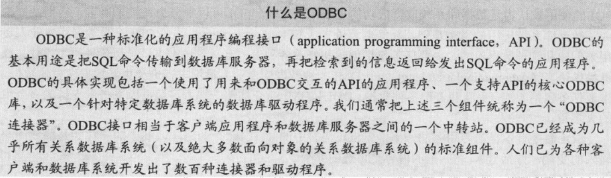

在提到客户端应用程序，我们所指的通常是那些用来向服务器发送和从数据库服务器接收数据的程序。其实，我们用来配置和维护数据库服务器的应用程序也属于客户端应用程序的范畴。这些工具中的绝大多数与其他数据库应用程序一样，也需要通过一条网络路径去连接数据库服务器，它们大部分使用ODBC连接器或是诸如JDBC（Java Database Connectivity，Java数据库连接）之类的变体，少数使用专用的协议来管理数据库服务器和完成特定的管理/维护工作，还有一些（例如phpMyAdmin）使用一个端口或套接字。

不管它们的具体实现是怎样的，客户端应用程序的基本用途是一样的：向数据库系统发出命令并获取那些命令的结果，解释和处理那些结果并把它们呈现给用户。标准的命令语言是SQL。客户端通过ODBC连接器向服务器发出SQL命令，ODBC连接器使用由驱动程序指定的网络协议把命令传输给数据库服务器。这个过程如图2-1所示。

### 查询接口

SQL等查询语言是一种用来向数据库系统“提问”的语言（有自己的语法和语义），事实上，对SQL的使用被认为是数据库系统取得成功的主要原因之一。SQL可以细分为几种子语言，它们共同构成了数据库系统应用的坚实基础。数据定义语言（data definition language，DDL）是数据库专业人员用来创建和管理数据库的，主要任务包括创建和修改各种表、定义各种索引、管理各种约束条件。数据操纵语言（data manipulation language，DML）被数据库专业人员用来查询和更新数据库里的数据，主要任务包括添加、更新和查询各种数据。DDL和DML命令加在一起占了数据库系统所支持的命令中的大多数。

SQL命令有各自的专用语法。下面是SQL语言中的SELECT命令的语法，其中的斜体字是需要用户输入的变量，方括号（[]）里的内容是可选的参数。

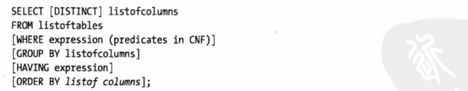

这条命令的语义如下：

~~~
（1）为FROM子句里的表生成笛卡尔积（集合乘法），准备根据其他子句里的条件从中筛选出查询结果。
（2）如果WHERE子句存在，按该子句里所有的表达式到FROM子句列出的表里筛选数据。
（3）如果GROUP BY子句存在，按该子句给出的属性对查询结果进行分组。
（4）如果HAVING子句存在，按该子句给出的条件对分组后的查询结果进行过滤。
（5）如果ORDER BY子句存在，按该子句给出的条件对查询结果进行排序。
（6）如果DISTINCT关键字存在，从查询结果里剔除内容雷同的行。
~~~

上面这段代码示例是绝大多数SQL命令的代表；所有这些命令都有必须给出的部分，其中绝大多数还有可选的部分和基于关键字的修饰符。

在查询语句通过网络协议被传输到服务器[称为运送（ship）]之后，数据库服务器就将开始解释和执行有关的命令。从此时开始，查询语句将被直接称为查询，因为它代表着一个要求数据库系统提供答案的问题。不仅如此，在接下来的几个小节，我将假设“查询”是一条SELECT命令，它代表用户发出的一个数据请求。所有的查询不管它是数据操作还是数据定义，都将沿着同样的路径通过系统。从现在开始，我们将讨论在数据库服务器的内部发生的事情，而整个流程的第一步是分析客户端在请求些什么-对查询进行分析，并把它分解为一系列最基本的可执行元素。

### 查询处理

在基于客户端/服务器模型的数据库系统的环境下，数据库服务器负责处理来自客户的查询并把查询结果返回给客户。有人把这一过程形象地比喻成查询换结果，先把查询“运”到服务器，再把换来的结果（数据）“运”回客户端。这么做的直接好处有两个：其一是可以减少查询的通信时间；其二是可以利用比客户端丰富得多的服务器资源来完成查询。此外，这个模型还把数据在服务器上的存储和检索方式，与数据在客户端的具体使用情况分成两个互不影响的部分。换句话说，客户端/服务器模型支持数据独立性。

数据独立性（data independence）是Codd于1970年提出的关系模型的主要优点之一：把物理实现与逻辑模型分开。Codd是这样说的：

> 大型数据库必须做到让它的用户不必去了解数据在机器里是如何存储的.当数据的内部表示发生变化时，最终用户的操作活动和绝大多数应用程序不应该受到任何影响。

这种分离使得程序员可以专注于逻辑模型的开发而无须考虑它们的物理实现。数据独立性（被Elmasri和Navathe称之为“数据的物理独立性"@）的目标是让每一个逻辑元素都独立于所有的物理元素（参见表2-1），比如说，数据的逻辑层——关系（表）以及按元组（行）排列的属性（字段），与数据在存储介质上是如何存储的完全无关。

数据独立性带来的挑战之一是数据库的编程工作需要完成两个过程：其一是写出逻辑查询（logical query），把查询要干什么描述清楚；其二是写出物理计划（physical plan），把逻辑查询的实现步骤描述清楚。

逻辑查询通常可以写成许多不同的形式，你可以用SQL之类的高级语言来写，也可以用代数查询树来表示。比如说，在传统的关系模型里，逻辑查询可以用关系演算和关系代数来描述。关系演算比较适合用来描述需要计算什么。关系代数则是提供了一个算法（但这个算法没有涉及许多与查询处理有关的细节）来让你找到想要查询的东西。

物理计划是一棵以数据库系统的查询执行引擎能够理解和处理的方式实现出来的查询树。查询树是一种树状结构，它的每个结点包含着一个查询操作符并有一系列子结点，子结点的个数与查询操作所涉及的表的个数相对应。这种查询树可以由数据库系统的优化器转换为一个执行计划，我们可以把这个计划想象成一个可以用查询执行引擎去执行的程序。

查询语句在经过语法分析、错误检查、优化和计划的生成/编译这几个阶段后才会执行。图2-2给出了一个典型的数据库系统所使用的查询处理步骤。语法分析步骤负责检查查询语句的语法是否正确并确定它是哪一种查询操作。解析器（parser）将把查询输出为某种内部格式以方便优化器生成一个高效的查询执行计划。执行引擎负责具体执行各个查询并把结果返回给客户端。整个过程如图2-2所示：分析工作完成后，对查询进行错误检查，然后进行优化，再挑选一个计划并编译，最后执行查询。

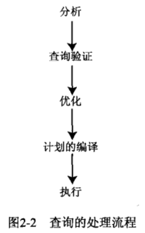

这个过程的第一步是把逻辑查询从SQL语句转换成关系代数里的一棵查询树。这一步由解析器负责完成，常见的做法是先把SQL语句拆分成若干部分，然后构建成一棵查询树。下一步是把逻辑代数中的查询树转换成一个物理计划。一般来说，同一棵查询树可以对应于许多种等价的物理计划。寻找最佳执行计划的过程被称为查询优化，即根据查询的某些执行性能指标（例如执行时间）把有着最佳执行性能的计划找出来。查询优化步骤的目的是从优化器的搜索空间内找出一个最佳或接近最佳的计划来。优化器将先把关系代数中的查询树复制到它的搜索空间里，再通过生成新的执行计划来扩展其搜索空间（扩展次数有一个上限），并从中找出最佳的计划（执行速度最快者）。

从此种意义上讲，我们可以把优化器视为SQL查询命令编译器的代码生成部分。事实上，有些数据库系统的编译步骤的确会把查询转换成为一段可执行程序，但绝大多数数据库系统是把查询转换成某种可以使用内部执行步骤库来执行的格式。此时，代码编译步骤生成的代码将由查询执行引擎解释。与传统意义上的编译器相比，优化器的侧重点是生成“非常高效”的代码。比如说，优化器将使用数据库系统的目录去收集与本次查询所涉及的关系有关的信息（例如元组的个数），而传统的编程语言编译器一般不会这么做。最后，优化器把它找到的最佳物理计划从它的内存结构里复制出来并发送给查询执行引擎。查询执行引擎将以存储在数据库里的关系作为输入来执行这个计划，与查询条件相匹配的各行所组成的表就这样被检索出来了。

所有这些活动都要花费时间和消耗资源，所以数据库的实现者必须把查询优化器和执行引擎的性能作为整体效率中的一个因素来考虑。因为以不同的访问方法（读取数据的方法）和不同的执行顺序组合出来的候选执行计划的数量很大，所以这种优化的开销非常巨大。因此单个查询也有可能产生接近无限个执行计划。但是，数据库系统通常都会把这个问题与一些众所周知的最佳实践放在一起。

生成大量查询计划的主要原因之一是，优化工作是在某些重要的性能指标参数未知或无法确定的情况下进行的。为了保证优化工作的进行，数据库系统通常会在以下（但不仅限于此）几个方面作出一些特定的假设：数据库的内容（例如关系属性中的值分布情况）、物理模式（例如索引的类型）、系统参数的值（例如可用缓冲区的个数）和查询常数的值等。

### 查询优化器

有些人错误地认为查询执行阶段的所有步骤都是由查询优化器完成的。但你即将看到，查询优化只不过是查询执行阶段的步骤之一。以下内容将对查询优化器进行详细的描述并揭示它在查询执行过程中所扮演的角色。

查询优化是查询编译过程的一个环节，它负责把以某种高级的非过程化语言（如SQL）写出的数据操纵语句，转换为一个更详尽的过程化的操作符序列，这个序列就是所谓的查询计划。查询优化器的任务是对各候选计划的开销进行估算，并从中选出一个开销最小的（执行最快者）。

按“基于计划”的方式进行查询优化的数据库系统往往假设，许多计划都可用来产生任意给定的查询。事实也的确如此，但按照这些计划去执行查询时，可能消耗的资源和需要花费的时间就未必相同了。既然如此，就需要把开销最小和/或用时最少的那个计划找出来。在设计一个嵌入式集成系统或个需要在小型平台（资源较少）上提供高流量或高速数据服务的系统时，怎样才能在资源占用量和执行开销之间取得平衡是经常会遇到的一个问题。

基于计划的查询处理策略如图2-3所示，查询将沿着图中的箭头方向移动。SQL命令先被传递到查询解析器接受分析和错误检查，并被转换为一种内部表示；内部表示通常是一个关系代数表达式或一棵查询树（参见前面的讨论），接下来，查询被传递到查询优化器，优化器将对所有等价的关系代数表达式进行检查并为每一种组合分别生成一个计划。优化器将选出开销最小的那个计划并把查询传递到代码生成器，后者将把查询翻译成一种可执行的格式-也许是可直接执行的代码，也许是某种以解释方式执行的中间代码。最后，查询处理器执行查询并逐条返回结果集（result set）里的行。

这是一种常见的实现策略，在绝大多数数据库系统上都能看到这一流程。随着计算机硬件技术的进步，不同的查询计划在预计开销方面差距巨大的情况已非常少见。事实上，绝大多数查询计划的预计开销都相差不大。这种情况使得一部分数据库实现者开始采用另外一种策略来实现查询优化器：在查询优化步骤使用一些大家公认的好规则（称为启发式）和好经验去进行查询优化，这被称为“启发式优化策略”，有些数据库系统混合使用多种优化技术，即以某一种技术为主并吸收其他技术的长处。

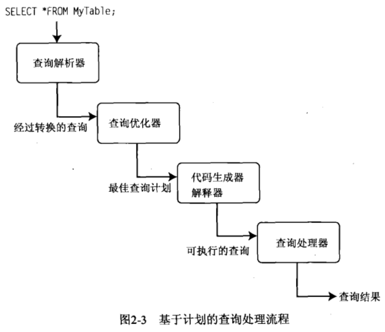

进行查询优化的4种基本技术是：

没有一种优化技术可以保证优化出最佳的执行计划，所有这些方法的目标是在保证正确结果的前提下让查询能够高效率地得到执行。

基于开销的优化器先根据一系列等价规则为给定查询生成一系列查询评估计划，然后再根据关于执行这个查询所需要的关系和操作的性能指标数据（或统计数据）中选出开销最小的那一个。一般来说，查询越复杂，可供选择的等价计划就越多。基于开销的优化技术的目标，是最大限度地利用索引和从过去的查询中收集到的统计数据去安排查询的执行和表的访问。Microsoft SQL Server和Oracle等系统使用的就是基于开销的优化器。

启发式优化器先根据一系列规则把查询改写成最优的形式，然后才开始生成和挑选执行计划。运用那些规则的目的是为了消除那些看起来不太高效的查询，从而保证在此基础上生成的查询计划在接受评估之前就已经是（但不绝对）比较优秀的了。启发式优化技术的目标是用规则来保证“好”的执行效果。使用启发式优化器的系统包括Ingres和各种学术研究性的变体。这类系统往往把启发式优化技术当作一种避免糟糕计划的手段，而非一个主要的优化手段。

语义优化技术的目的是：根据一条查询命令所包含的语义（或拓扑结构）和有关数据库/关系/索引的实际情况而生成的查询执行计划，可以保证这条查询命令在给定数据库上以最优的方式得到执行。虽说目前还没有使用语义优化技术作为其主要优化手段的商业数据库系统，但这种技术正日益成为人们研究的焦点。作为语义优化技术的前提，优化器需要对数据库的构造和当前情况有一个基本的了解。在收到一条查询命令时，优化器将根据自己对系统约束的了解，在确定查询会返回一个空结果集后简化或忽略它。人们对这种技术寄予了很大希望，认为它在未来的RDBS里能够让查询的处理效率得到更大的提高。

参数优化技术是启发式方法和基于开销的优化技术相结合的产物，它提供了一种方法来生成可预估开销的有效查询计划的集合，因此能从中选出一个开销最小的计划去执行。

MySQL就是一个混合使用多种优化技术的数据库系统。MySQL的查询优化器是围绕“选取-投影-联结”策略而设计出来的，它综合了基于开销的优化器和启发式优化器的优点，生成的查询计划相对较少，然后再利用基于开销的优化技术从中选出一个最短的执行路径。这一策略可以从整体上保证-个“好”的执行计划，但不能保证生成最好的计划。实践证明，这一策略对运行在不同环境里的许多种查询来说效果都很好。实践还证明，MySQL的内部表示完全可以满足最大型的生产数据库系统在速度方面的要求。

微软的SQL Server是一个使用基于开销的优化器的数据库系统。SQL Server的查询优化器是围绕着一个传统的基于开销的优化器设计出来的，它将把查询语句翻译为一个可以高效执行并返回相关结果的过程。该优化器根据从以前执行过的查询收集到的信息或统计数据以及数据库里的数据特征，为同一个查询生成多个等效的过程，再利用统计数据去预测哪一个过程的执行效率最高。。一旦确定了最有效率的过程，就开始执行并把结果返回给客户端。

不确定参数（比如用户输入）会让查询优化工作变得复杂。比如说，如果某个存储过程（stored procedure）里有一条查询命令，该命令在这个存储过程执行时接受一个来自用户的参数，那么这个参数就是一个不确定参数（unbound parameter），在这种情况下，对查询进行优化几乎是不可能的；如果无法在执行前收集到一些关于输入的信息，优化器将很难生成一个开销最小的执行计划。反过来说，哪怕一点点信息都会对优化工作有帮助。如果只有很少几条记录满足输入，甚至一个基本的索引也远优于文件扫描。如果满足输入的记录很多，使用索引的效果就更好了。如果输入不确定，优化器将无法在优化阶段作出选择-挑选最优执行计划的工作将推迟到执行开始以后。

可以这样解决选择问题：把输入当作一个开放变量，让优化器根据以前的查询执行情况以及来自基于开销的优化器的统计数据，把有可能发生的执行计划全部生成出来。对解决这个问题有帮助的统计数据包括该不确定参数的属性的频率分布情况。

### 查询的内部表示

在数据库系统的内部，查询可以被表示为其原始SQL命令的几种替代形式。存在这些替代形式的原因包括：原始SQL命令的冗余、子查询和联结操作在特定约束条件下的等价性以及WERE子句里的表达式之间的逻辑运算结果等。查询有多种替代形式给数据库实现者带来了一个问题：不管用户写出的查询命令是什么样的，查询优化器都必须为它选出一个最优的执行计划。

一旦查询优化器构造出了个高效的执行计划（启发式或混合式优化器）或选出了一个最有效率的计划（基于开销的优化器），查询就将被传递到下一个处理环节——执行。

> 利用统计数据进行优化的做法起源于最初的基于开销的优化器。事实上，商业数据库里的许多工具就是为了分析和生成这些统计数据而存在的，数据库专家可以利用这类数据去优化数据库的结构，让查询优化工作更有效率。

### 查询的执行

数据库系统可以使用好几种方法来执行一个查询。大部分数据库系统使用迭代或解释执行策略。

迭代方法提供了一些途径来生成一个可直接执行的函数调用序列来完成各种基本处理操作（联结、投影等），并没有包含内部表示的特性。用来把查询转换为迭代方法的技术主要有函数编程和程序变换。把基于关系代数的查询条件转换成迭代程序的算法有好几种。比如说，有些算法先把查询条件转换为递归程序，再利用一系列变换规则对它进行简化，然后生成一个执行计划。还有一种算法使用两个步骤来完成这一工作：第一步使用一个较小的变换规则集对查询的内部表示进行简化，第二步使用程序变换技术生成等效的函数，然后生成执行计划。

上述机制的具体实现办法是：先用某种高级语言编写出一系列最基本的功能函数，再用一个调用栈或过程调用序列把它们链接在一起。在找出最佳的查询执行计划之后，用一个编译器（通常就是用来创建该数据库系统的那个）把这些过程调用编译成一段可执行的二进制代码。因为迭代方法的开销比较大，所以编译好的执行计划通常会被存起来供类似或相同的查询重复使用。

另外，解释方法使用现有的已编译基本操作抽象来生成查询执行计划。在选出最佳查询执行计划后，先把它重新构造成一个方法调用队列，然后从这个队列里依次取出各个方法进行处理。各个方法的执行结果放在内存里供后续方法做进一步处理。这种策略的实现经常称为懒汉策略"，这是因为虽然队列里的每一个方法都经过了编译和优化，但那些优化并不针对某个特定的查询，所以它们组合在一起的性能就不一定是最优的。采用解释方法来执行查询的数据库系统占绝大多数。

在这里，编译这个概念很容易引起混乱。有些数据库专家认为，对查询进行已编译的查询就是把迭代查询执行计划实际编译成一段可执行代码；但在Date的著作里，对查询进行编译只是对它进行优化并保存起来供今后执行而已。因为MySQL的查询优化器和执行引擎不会保存查询执行计划供今后重复使用（MySQL的查询缓存机制是个例外），而且查询执行引擎实际执行的也不是任何一种编译或汇编代码，所以我在后面的讨论里将尽量避免使用编译这个词。有意思的是，MySQL中的存储过程与Date对“编译”概念的解释不谋而合：对存储过程进行编译（或优化）并把它们保存起来供今后使用，它们可以在满足其输入参数的数据上运行多次。

在查询执行阶段，查询执行引擎将对查询树（或由内部结构表示的查询）的每一个部分进行处理并为每一个部分调用有关的方法。这些方法对应着关系代数里定义的各种操作，如投影、限制、并、交，等等。对于这些操作中的每一个操作，查询执行引擎都将调用一个相应的方法对输入数据进行处理，然后把数据传递到下一步。比如说，投影操作只返回有关数据的某几个属性（即列）--查询执行引擎将把属性不符合筛选条件的数据排除掉，只把剩余的数据传递到查询树（即结构）的下一个操作。表2-2列出了几种最常见的操作并对它们做了简要的解释。

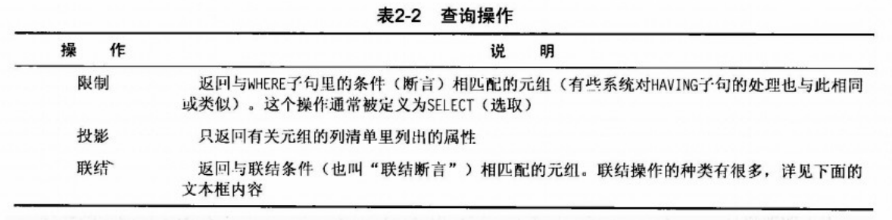

确定了如何执行一个查询（或选中的查询计划）只是问题的一半，还需要考虑的其他事情是如何访问那些数据本身。从磁盘（文件）读写数据的办法有很多，但选择哪个办法取决于查询的目的。文件访问机制的作用是降低从磁盘访问数据的开销，提高查询执行的性能。

### 文件访问

文件访问机制（file-access machanism）也叫数据库的物理设计（physical database design），它从数据库系统开发的早期时代就非常重要。不过，因为操作系统提供的通用文件子系统的效率和简单性，文件访问机制的重要性已经降低了。现在，文件访问只是文件存储和索引创建方面的最佳经验的运用而已，比如把索引文件和数据文件分开并放在不同的磁盘输入/输出（10）系统上以改善性能等。为了让数据库能够根据特定应用程序的需求进行定制，有些数据库系统使用了不同的文件组织技术。MySQL在这方面大概是独一无二的，它支持的文件访问机制（称为存储引擎）非常多。

目标很明确：必须最大限度地降低数据库系统的10开销。这包括选用适当的磁盘数据结构以通过高效率的访问路径又快又准地检索出有关的数据，对磁盘上的数据进行组织以最大限度地降低检索有关数据的1/0开销等。总体性能目标是减少磁盘访问（或磁盘VO）操作的次数。

关于如何设计一个数据库系统的技术有不少，但专门针对文件访问机制（数据文件的实际物理实现）的技术并不多。不仅如此，有许多研究人员认为，最优化的数据库设计（从物理的角度看）不可能真的实现，也不应该过份强求。他们的观点是：现代磁盘子系统的性能已得到极大的提高，这方面的技术和研究已足以让数据库的实现者们满足潜在用户的需求。

如果你想创建一个性能优良的结构，就必须考虑许多因素。早期的研究者们认为应该根据数据的内容或上下文把数据划分为一系列子集合。比如说，在一个人事档案数据库里，应该把部门编号相同的所有数据集中划分为一组，把这些数据和它们对相关数据的引用（指针）保存到同一个地方。按照这一思路，集合可以组织在一起构成超集，最终在文件内部和文件之间形成一种层次化的结构。

在这种层次化结构里访问数据的过程是：从位于最高层次的集合开始扫描，只扫描为获得必要的数据而必须扫描的集合。这种做法大大地减少了需要扫描的元素个数。把同类数据集中保存在一起可以最大限度地缩短搜索时间。磁盘上的数据在结构化文件里的布局叫作文件组织（file organization）文件访问机制的设计目标是找到这样一种访问方法：能连续、快速地完成一连串数据处理操作，使数据库里的数据随时都能反映出现实世界的情况。

为了保证更高效的存储和检索，，文件组织技术随着操作系统的发展也在进步，但许多目前被普遍接受的方法在现代数据库系统中已显得有些力不从心，这在那些配有高速大容量硬盘和高吞吐量的系统上体现得尤其明显。对数据库设计方法的理解和进一步研究，无论是来自书本还是来自实践，都可以帮助我们开发出更好的数据库系统。比如说，随着采用冗余和分布式技术的系统日益普及，新硬件和/或数据可用性、安全性和恢复技术等领域里的研究工作正变得越来越热门。

从磁盘访问数据的开销很大，而使用某种缓存机制（有时称作缓冲区）可以大大提高从磁盘读取数据的效率，降低数据的存储和检索开销。比较常见的做法是通过预测下次磁盘读操作或者根据某个算法把数据提前拷贝到缓冲区里，目的是让最频繁使用的数据驻留在内存里以加快数据访问速度。能否高效处理好磁盘和主存的差异是评判数据库系统质量高低的重要标准之一。使用磁盘或使用主存对数据库性能的影响不可不知。表2-3对主存与磁盐的性能表现进行了汇总。

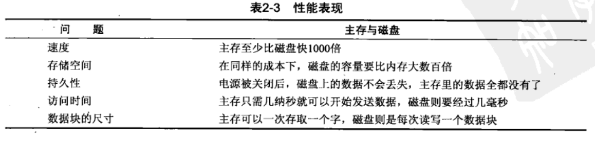

数据库物理存储技术的进步对任何一种存储策略和缓存机制都有所改善，但物理存储技术基本要素的探索性研究工作的进展并不大。有些人在从硬件入手去研究如何利用新硬件，有些人在从实用角度出发去研究人们到底想存储些什么。持久性问题已很少有人在研究，这或许是因为操作系统在这方面已经相当完善和高效的缘故吧。

文件访问机制用来存储和检索数据库里保存的数据。绝大多数文件访问机制都有额外的功能层来快速地确定数据在文件里的位置。这些层次被称为索引机制。索引机制将根据数据的某个组成部分键）来确定有关数据的存放位置并提供相应的访问路径（搜索和检索数据的办法）。简单的索引机制可以是一个简单的键列表，复杂的索引机制会有一些用来加快键搜索速度的复杂结构。

我们的目标是又快有准地找到需要的数据，尽量减少从磁盘读取数据块的个数。这可以通过把标识数据的值（或键）和记录在磁盘上的存放位置保存起来，从而为有关数据生成一个索引的办法来实现。显然，读取索引数据要比读取全部数据快很多。使用索引的最大好处是可以高效率地搜索大量的数据用不着把每个数据项都读取一遍就能找到想要查找的东西。索引机制会提供一系列用来对磁盘上的数据文件进行搜索的方法。这些方法有的可以加快数据的随机访问速度，有的可以加快数据的顺序访问速度。

索引机制有许多种类。它们大都采用某种树结构来存储键和磁盘块地址。例子包括B-树、B+树和散列树。与这些结构配套的是一些能够在最短的时间里从这些结构里找到特定键的遍历算法。绝大多数数据库系统在它们的索引机制里使用的是B-树的某种变体。这些树算法的搜索速度非常快，占用的内存空间却不大。

在查询执行阶段，解释型查询执行方法将通过索引机制调用某个特定的访问方法去请求数据。随后，执行方法读出数据（通常是每次一条记录）、根据对表达式的计算来判断查询是否与断言相匹配、接着对数据进行必要的处理、最后把数据传递到服务器的传输部分并由后者把数据发送回客户端。

### 查询结果

把与本次查询有关的元组全部检索出来并对它们进行了必要的处理后，那些元组将沿着同样的通信路径（有时会是另外一条）返回给客户端。那些元组随后被传递到ODBC接口进行封装并呈现在客户端应用程序里。

### 关系数据库的体系结构小结

本节介绍了通过一个典型的关系数据库系统体系结构查询数据的一系列步骤。正如你所看到的，查询从客户端发出的一条SQL命令开始，经ODBC接口通过一条通信路径（网络）被传递到数据库系统。在查询被分析，转换为一种内部结构，优化和执行之后，查询结果将被返回给客户端。

既然已经介绍了查询处理的所有步骤，大家也看到了数据库系统各子组件的复杂性，现在该看一个实际的例子了。接下来的2.4节将剖析MySQL数据库系统的体系结构。

## MySQL数据库系统

MySQL的源代码组织得非常好，也使用了很多结构化的类（有些是复杂的数据结构，有些是对象，但大部分是结构），但整个系统并不是一个真正的模块化体系结构。记住这一点在分析MySQL的体系结构时很重要，在研究MySQL的源代码时更重要。这句话的意思是说，你在MySQL的源代码里有时会发现体系结构元素之间没有明确的界线。关于MySQL源代码的更多信息（包括如何获得它）请参见第3章。
虽然有些人把MySQL的体系结构描述为一个基于组件的系统，是由一组模块化的子组件构成的，但实际上它既不是基于组件的，也不是模块化的。虽然MysQL的源代码是用C和C+语言混合编写的，这个系统里的许多功能也是用对象实现的，但从严格的面向对象编程意义上讲，这个系统并不真正地面向对象。这个系统建立在一系列函数库和数据结构的基础上，这些函数库和数据结构更侧重于方便编程和源代码管理。
但是，MySQL的体系结构体现了其设计者的智慧，众多井然有序的子系统和谐地构成了一个高效而又可靠的数据库系统。本章前面的内容所提到的所有技术都可以在这个系统里找到。负责具体实现这些技术的子系统设计和实现得非常优秀，构思巧妙的源代码随处可见。许多有成就的C和C程序员都对MySQL源代码的精巧和简洁赞叹不已。我经常一边为看不懂那么复杂的源代码而郁闷，一边为它们精巧的设计感到佩服。事实上，就连那些代码的原作者本人也承认，有很多代码是他们灵光一闪时写出来的，他们自己也得经过认真的分析才能把它们弄明白。如果你看懂了这样的源代码，就一定会惊叹它流畅的运行和简洁的结构。

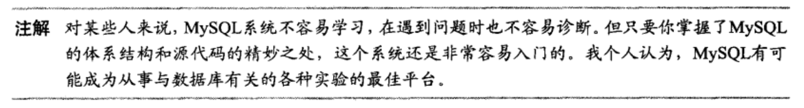

总而言之，MysQL的体系结构和源代码不适合刚入门的C+新手。如果你想重新考虑编写源代码，就应该继续读下去；我将引导大家进入MySQL源代码的世界。在这之前，我们先来看看这个系统的体系结构。

### MySQL系统体系结构

MysQL的体系结构是一个由多个子系统构成的层次化系统。虽然源代码没有被编译成一系列组件或模块，但那些子系统的源代码却是按照一种可以把各子系统封装在源代码里的层次结构组织的。绝大多数子系统依赖于底层的库（如线程控制、内存分配、网络连接、日志和事件处理以及访问控制等）。

基础库、建立在那些库上的子系统以及从其他子系统建立的子系统合起来，构成了一个抽象的API，称为MySQL的C Cient API。这个功能强大的API使MySQL系统既可以被用作一个独立的服务器，也可以被用作大型应用程序中的一个嵌入式数据库系统。

MysQL的体系结构封装着SQL接口、查询解析器、查询优化器和查询执行引擎、缓存/缓冲机制以及一个插件式存储引擎。图2-4给出了MySQL的体系结构和它的各子系统。在图2-4的顶部是一些用来与客户端应用程序建立连接的数据库接口。正如大家看到的那样，MysQL为你们所能想到的任何一种编程环境都提供有相应的数据库接口。在图的左边，按系统管理和服务控制分类列出了许多辅助r具，对这些系统管理工具和服务控制工具的详细讨论请参阅Michael Kruckenberg和Jay Pipes合著的Pro MysQL，该书对MySQL系统管理方面的每一项工作都做了详细的探讨。

从数据库接口往下一级是连接池（connection pool）层，该层负责处理与用户访问有关的各种用户登录、线程处理、内存和进程缓存需求。连接池的下一层是MySQL数据库系统的核心，这里是对查询进行分析和优化的地方，也是对文件访问进行管理的地方。再往下是插件式存储引擎层，这一层是MysQL的体系结构与众不同的部分之一。插件式存储引擎层使得MySQL系统可以灵活地适应各种数据或文件的存储和检索机制。这种灵活性是MySQL独有的，目前市场上的其他数据库系统都不具备这种通过提供多种数据存储机制而调整数据库的能力。

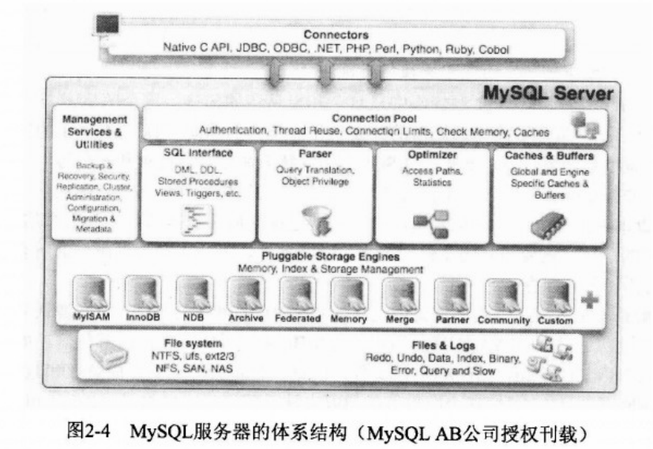

插件式存储引擎的下面是MySQL系统的最底层，即文件访问层。这一层是存储机制读/写数据，系统读/写日志和事件信息的地方。这一层也是最贴近操作系统的层，与线程、进程和内存控制有关的操作都发生在这里。

我将按照从客户端应用程序到数据库、再从数据库回到客户端应用程序的流向对MySQL的体系结构进行讨论。在客户端连接器（ODBC、JDBC，CAPI，等等）把SQL语句传递到服务器的时候，首先遇到的将是SQL接口。

### SQL接口

SQL接口提供了从用户接收命令并把结果返回给用户的机制。MysQL的SQL接口是按ANSI SQL标准建立的，与ANSI标准兼容的其他数据库服务器所支持的基本SQL语句都可以在这里使用。虽然在MySQL支持的SQL命令当中有许多带有不属于ANSI标准的选项，但MySQL的开发者在遵守ANSI SQL标准方面做得非常好。

MySQL服务器从网络接收连接请求并为每个连接创建一个线程。线程是MySQL服务器进行查询处理的核心。MySQL是一个真正的多线程应用程序，每个线程在执行时都独立于其他线程（但有几个特定的辅助线程不在此列）。接收到的SQL命令将存入一个类结构（class structure），查询结果通过把有关数据写到网络通信协议上传输回客户端。创建出一个线程之后，MysQL服务器将开始解析SQL命令并把解析出来的各个部分保存到一个内部数据结构里去。

### 解析器

当收到客户端发出的查询并为之创建一个新线程之后，SQL语句将被传递到解析器接受语法验证（或因错误而被拒绝），MysQL的解析器是用一个很长的Lex-ACC脚本实现的，用Bison对该脚本进行编译就得到了这个解析器。解析器将构造一个用来在内存里代表查询语句（SQL）的查询结构，这个树状结构（也称为抽象语法树）可以用来执行查询。

> 在计算机科学中，抽象语法树（Abstract Syntax Tree，AST），或简称语法树（Syntax tree），是源代码语法结构的一种抽象表示。它以树状的形式表现编程语言的语法结构，树上的每个节点都表示源代码中的一种结构。之所以说语法是“抽象”的，是因为这里的语法并不会表示出真实语法中出现的每个细节。比如，嵌套括号被隐含在树的结构中，并没有以节点的形式呈现；而类似于 if-condition-then 这样的条件跳转语句，可以使用带有两个分支的节点来表示。

有许多人认为解析器是MySQL源代码中最复杂和最精巧的部分。这个解析器是用Lex和YACC实现的，Lex和YACC原本是为了简化编译器的开发工作而推出的辅助工具。MySQL的开发者使用这些工具建立了一个词法解析器，它能够把一条SQL语句分解为命令字、选项和参数等一系列最基本的语法元素（记号）并把这些记号存入一个由变量和列表构成的结构。这个结构（它的名字或者说类型是Lex）就是SQL查询的内部表示。也就是说，查询处理过程的后续步骤都要用到这个结构。Lex结构包含将要用到的表的清单、将要访问的文件的名字、联结条件、表达式和查询命令的所有其他元素，它们与原始的SQL语句分开保存。

MysQL的解析器读入SQL语句并把该表达式（由各种记号和符号构成）与在源代码里定义的规则进行比较。这些规则是用Lex和YACC代码写出，再由Bison编译成一个词法解析器。如果你们看过这个解析器的C语言代码（见/sql/sql-yacc.cc文件）的话，肯定会为它的言简意赅和数量巨大的switch开关分支语句而惊讶不己。了解这个解析器的更好办法是阅读尚未经过编译的Lex和YACC代码（见/sql/sql-yacc.yy文件），这个文件包含着用YACC代码写出来的规则，相对比较容易阅读和理解。利用Lex和YACC来实现MySQL解析器的做法体现了MySQL AB公司的开放源代码理念：既然有Lex，YACC和Bison这些专用的编译器开发工具可以利用，为什么还要创建你自己的语言处理器呢？

在解析器标识该正则表达式并把查询语句分解成一系列基本元素之后，它将把适当的命令类型分配给相应的线程结构并把控制权返回给命令处理器（command processor，它有时被认为是解析器的一个组成部分，但更准确地说是主代码的一部分），命令处理器其实就是一个长长的switch语句，MysQL所支持的每一种命令分别对应着其中的一个分支。查询解析器只检查SQL语句的语法正确性。它不检查有关的表或属性（字段）是否存在，也不检查语义错误（比如使用了一个统计函数，但没有写出必要的GROUP BY子句的情况）。这些事情将由优化器去检查。解析器生成的查询结构将被传递到查询处理器，从那开始的后续工作将由查询优化器负责控制。

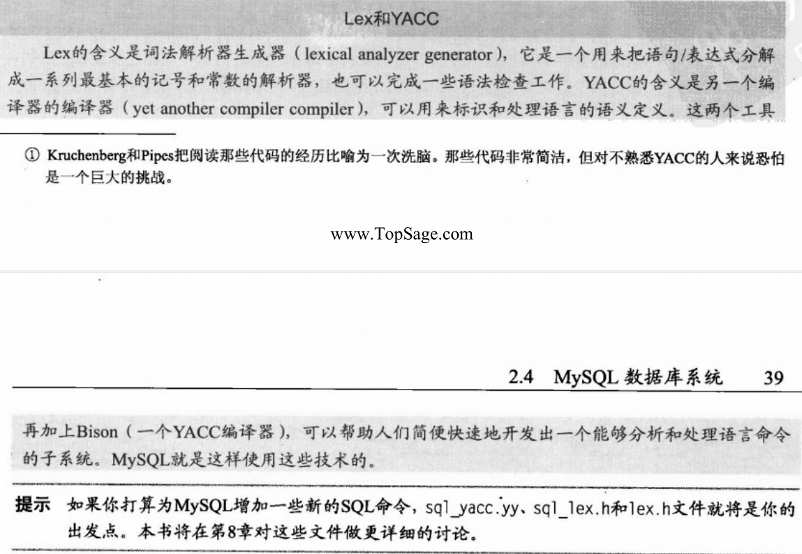

### 查询优化器

有些人认为MySQL的查询优化器子系统应该使用另一个名字。这个优化器使用了一种“选取一投影-联结”策略来处理查询，即先根据有关的限制条件进行选取（SELECT操作）以减少将要处理的元组的个数，再进行投影（对应于关系代数里的投影操作）以减少被选取元组里的属性（字段）的个数，最后根据联结条件生成最终的查询结果。MysQL的查询优化器算不上是最复杂的，它采用的“选取-投影一联结”策略属于一种启发式查询优化机制。它使用的规则很简单：

* 通过计算WHERE子句里的表达式来横向排除多余的数据。
* 只保留在属性（字段）清单里列出的，以及在最后执行联结子句时还需要用到的属性（字段），其他数据全部排除。
* 根据联结条件生成最终的查询结果。

由这几条规则构成的策略可以保证数据检索动作的效率达到或非常接近最优。实践证明，这种“选取-投影-联结”策略即使对于事务处理中的典型查询也能保证很高的效率。图2-5给出了MysQL的查询处理流程。

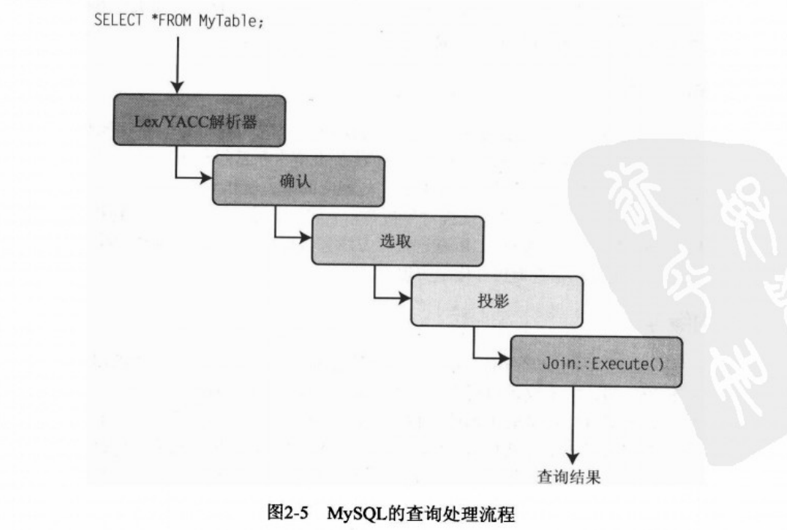

> 注解这里体现了MySQLAB公司的另一个理念：优化团体的当前需求。

优化器里的第一步是检查有关的表是否存在以及用户是否有访问权限；如果发现错误，返回一条相应的出错信息并把控制权交还给线程管理器（thread manager，也就是负责监听连接请求的listener守护进程）。一旦找到了正确的表，就打开并应用适当的并发控制锁。

在所有的维护和初始化任务全部完成后，优化器将使用内部查询结构（即Lex结构）对查询命令中的WHERE条件进行处理（“选取”操作），其结果作为临时表返回供后续步骤做进一步处理。如果查询命令里有UNION操作符，优化器将以循环方式执行完所有的SELECT操作之后再进行下一步。

优化器里的下一步是执行投影操作。投影操作的执行情况与限定操作很相似，这一步的中间结果仍保存在临时表里，且只保存那些由SELECT语句中的列规范所指定的属性。最后，检查Lex结构里有没有用联结类（join class）给出的JOIN条件；如果有，调用join:：optimize（）方法。在这个阶段，查询将接受以下优化：对条件表达式进行简化和求值，消除死分支或恒真/恒假条件（以及许多其他类似的优化）。总之，在执行联结操作之前，优化器会尽量减少查询命令里的条件（能简化的简化，能求值的求值，无效的尽量消除）。做出这种安排的原因是因为，联结操作是所有关系操作中开销最大和耗时最多的。还有一点请大家特别注意：不管是不是真的有联结条件，凡是带有WHERE或HAVING子句的查询都要经历联结优化步骤。这样开发者可以把所有的表达式求值代码集中到一个地方。在联结优化步骤完成之后，优化器将通过一系列条件语句调用一系列适当的库方法去执行查询。

查询优化器和执行引擎大概是MySQL源代码中第二个难点，这与它采用的“选取-投影-联结”策略不无关系。更让人头疼的是，MySQL服务器的这个部分是用C和C++代码混合编写的，基本的“选取”操作被编写成一些C方法，联结操作则被编写成一个C++对象。第11章将向大家介绍如何编写自己的查询优化器并用它来代替MySQL自带的优化器。

### 查询的执行

查询的具体执行是由一组库方法实现的，每种方法负责完成一种特定的查询操作。比如说，mysal_insert（）方法负责插入数据，mysal-select（）方法负责检索和返回与WHERE子句相匹配的数据。这些库方法分散在许多个源代码文件里，文件的名字与相应的库方法相同或接近（如sqlinsert.cc.sql-select.cc）。所有这些方法都有一个线程对象参数，它可以让那些方法直接找到和访问有关的内部查询结构（Lex结构），加快执行速度。所有这些库方法都将使用网络通信路径库返回其执行结果。查询执行库的方法是按照解释型查询执行模型实现的。

### 查询缓存

虽然不是它自己的子系统，但查询缓存却是查询优化和执行子系统不可缺少的组成部分。查询缓存是一项了不起的发明，它不仅可以缓存查询结构，还可以缓存查询结果本身。如果某个查询的结果就在缓存里，系统就可以直接取出那些数据返回给客户端而跳过整个查询优化和执行阶段；这对那些使用频繁的查询来说效果尤其显著。这项技术也是MySQL独有的；其他的数据库系统只缓存查询，不缓存查询结果。查询缓存还必须能够处理查询结果变“脏”的情况，即数据在上次查询之后有一些发生了变化（比如对基表运行INSERT，UPDATE或DELETE命令的情况），以及时不时地对被缓存的查询进行清理。

> 提示 查询缓存是默认打开的。如果你想关闭查询缓存功能，可以使用SQLNOCACHE SELECT选项：SELECT SQL NO CACHE id.Iname，FROM myCustomer:。

如果你还不熟悉这项技术，可以自己去体验一下：找个记录足够多的表执行一个足够复杂的查询，比如一个JOIN或复杂的WHERE子句。记下它的执行时间，然后再次执行这个查询。请注意时间上的差异，就可以看出查询缓存的作用。代码清单2-1演示了这个练习。

### 缓存和缓存区

缓存和缓冲区子系统负责保证使用频率最高的数据（或结构，就像你们将看到的那样）能够以最有效率的方式被访问。换句话说，使用频率最高的数据必须随时驻留在内存里待用。因为那些数据随时都驻留在内存里，不需要访问磁盘就可以检索到，所以缓存机制可以大大缩短对那些数据的请求响应时间。MySQL的缓存子系统把所有的缓存和缓冲区功能封装在一组松散搭配的库函数里。那些库函数散布在多个不同的源代码文件里，但我们必须把它们当作同一个子系统的组成部分来看待。

这个子系统实现了很多缓存，绝大多数缓存机制使用的是相同或相似的概念：把数据封装为某种结构，再把这些结构保存为一个链表（linked list），在MySQL的源代码里，与缓存和缓冲区有关的代码不是集中在某个地方而是散布在各处，哪些地方需要用到它们，它们就会出现在哪里。下面我们来看一下这些缓存。

**1.表缓存**

表缓存（table cache）是为了最大限度地减少打开、读取和关闭表（磁盘上的.RM文件）的开销而创建的。因此，表缓存的主要用途就是把关于表的元数据保存在内存里。这可以大大加快有关线程读取表结构信息的速度而无需每次都打开文件。每个线程都有它自己的表缓存结构表，因而可以独立于其他线程对表进行访问，即使某个线程改变了某个表的模式（但还没有提交那些修改），另一个线程可以继续按照原来的模式使用该表。这种结构是一个封装表的所有元数据信息的简单结构，这些结构在内存里以链表的形式存放并与各有关线程相关。

**2.记录缓存**

记录缓存（record cache）是为了加快存储引擎的顺序读性能而创建的。因此，记录缓存通常只用在表扫描期间。它就像是一个预读缓冲区，每次检索一个数据块，从而减少扫描期间的磁盘访问次数。

一般来说，磁盘访问次数越少，就意味着性能越高。有意思的是，MysQL在顺序写数据的时候也要用到记录缓存：先把新数据（或修改后的数据）写入记录缓存，等它写满时再把全部数据写到磁盘上。0这样一来，写性能也得到了改善。因为记录缓存可以大幅提高顺序读/写（称为引用的局域性）的性能，所以它最经常与MyISAM存储引擎（但并非仅限于此）配合使用。记录缓存是以一种不可知的方式实现的，与用来访问存储引擎AP的代码互不干扰。因为记录缓存是在AP各层的内部实现的，所以程序员无需采用任何额外步骤就可以享受到记录缓存的好处。

**3.键缓存**

键缓存（key cache）其实就是一个用来缓存索引数据的缓冲区，其内容是一个来自索引文件（B-树）的数据块；只有MyISAM表（磁盘上的.MYI文件）才使用键缓存。索引本身被封装在键缓存结构里，这些结构在内存里被存储为一个链表。在第一次打开一个MyISAM表的时候，系统会为它创建一个键缓存。此后的每一次索引读操作都将先访问这个键缓存。如果在缓存里找到了需要的索引，则从那里读出它；如果没有找到，就将从磁盘读入一个新的索引块放到缓存里。这个缓存的长度有一个默认值，但你可以通过配置变量key-cache_-block-size来修改。一般来说，某个索引文件里的所有数据块是不可能同时容纳在内存里的。那么，系统又是如何知道哪些索引块已经被使用过了呢？

缓存有它自己的监控机制，该机制随时记录各索引块的使用频率。键缓存用来记录各索引块的“热度”。在这里，热度指索引块被使用了多少次。warm包括BLOCK_COLD，BLOCK_ARM和BLOCK-HOT，当某个索引块变“冷”，另一个索引块变“热”时，后者就会被读入键缓存而取代前者。这种做法其实是一种“最近最少使用”（least recently used，LRU）页面交换策略，与操作系统中的虚拟内存管理和磁盘缓冲机制所使用的算法是一样的。实践证明，LRU策略相当高效，即使与更复杂的页面交换算法相比也毫不逊色。键缓存用类似的方法随时跟踪各索引块是否变“脏”（被修改过）。当一个“脏”索引块被交换出内存时，它的数据将被写入磁盘上的索引文件。如果被清除的是一个“干净”的索引块，只要从内存里删除它就完事了。

> 注解:经验表明，LRU算法至少在80%的情况下都能取得最优的效果。在一个追求速度以及简单就意味着可靠的世界里，能在80%的情况下取得最优效果的解决方案已经很了不起了.

**4.权限缓存**

权限缓存（privilege cache）用来存放用户账户的授权数据。这些数据与访问控制表（access control list，ACL）的存储方式是一样的，它列出了某个用户对系统里某个对象的全部权限。权限缓存把用户的每项权限封装在一个结构里，这些结构在内存里被存储为一个“先进后出"（first in-last out，FLO）的散列表。权限缓存里的数据是在用户登录上机和初始化期间从各有关权限表里读出并集中到权限缓存里的。

**5.主机名缓存**

主机名缓存（hostname cache）是另外一种辅助性的缓存机制，与权限缓存很相似。它也被实现为一种以结构为元素的栈。这个缓存里的内容是与服务器相连接的所有主机名。你或许会感到惊讶，但主机名的使用频率确实非常高，是专用的缓存的候选机制。

**6.其他缓存机制**

MySQL的源代码里还有许多随处可见的小缓存机制，用在复杂的联结操作里的联结缓冲区（join buffer cache）就是其中的一个例子。比如说，有些联结操作需要把第1个表的一条记录与第2个表里的所有记录进行比较。在这类场合，用一个缓存来存储那些记录可以大大加快联结操作的速度而无需反复多次地把第2个表里的记录读入内存。

### 通过插件式存储引擎访问文件

支持多种存储引擎，或者说支持多种文件类型的能力是MysQL的最佳功能之一。这使得数据库专家可以根据具体应用程序的需要为他们的数据库选择一种性能最佳的存储引擎，比如说，为用于事务处理的数据库选用具备事务控制能力的存储引擎，为读取频繁但很少被修改的表（例如一个字典表）选用内存存储引擎，等等。

MySQLAB公司在第5版里增加了一项新的体系结构设计，这项设计使得增加新存储类型的工作变得更容易了。这个新机制叫作MysQL插件式存储引擎。MySQLAB公司已尽了最大努力让服务器能够通过插件式存储引擎得到扩展。插件式存储引擎的核心是文件访问层的一个抽象接口，任何人都可以利用这个API接口去建立新的文件访问机制，MySQLAB公司称之为“存储引擎"（storage engine）。这个API提供了一套用于读/写数据的方法和访问工具。这些方法共同构成了一个标准化的模块化体系结构，不同的存储引擎可以调用同样的方法去访问数据库里的数据（所谓“插入式”存储引擎的意思是指不同的存储引擎都可以使用同样的APT“插入”服务器）。

插件式存储引擎最让人感兴趣的地方是允许你在一个给定的数据库里为每个表指定一个不同的存储引擎，你甚至可以在创建一个表之后改变它的存储引擎。这种灵活性和模块化使得数据库的实现者可以随时根据需要创建新的存储引擎。下面这条命令可以用来改变某个表的存储引擎：

~~~mysql
ALTER TABLE MyTable 
ENGINE = InnoDB;
~~~

插件式存储引擎大概是MySQL最独特的功能了。其他品牌的数据库系统没有一个能像MysQL这样在文件访问层具有如此大的灵活性和可扩展性。在接下来的几个小节里，将对MySQL服务器支持的所有存储引擎进行描述并对如何创建自己的存储引擎做一个简要介绍。本书将在第7章向大家演示如何创建你自己的存储引擎。

各类存储引擎的优缺点为数众多，且各不相同。比如说，在MySQL里，有几种存储引擎支持并发处理。MySQL的默认存储引擎是MyISAM。它支持表级的并发控制锁：当某个进程对某个表进行更新操作时，在这个操作完成之前，其他进程将不能访问该表里的任何数据。在MySQL所支持的存储引擎当中，MyISAM存储引擎是最快的，这是因为MyISAM表都按照ISAM原则（indexed sequentialaccess method，意思是“索引过的顺序访问方法”）进行过优化。BDB（Berkley Databse的简写）表支持页面级的并发控制锁：当某个进程对某个表进行UPDATE操作时，在这个操作完成之前，其他进程将不能访问与被刷新的记录同处于一个内存页面里的任何数据。InnoDB表支持记录级（也叫作“行级”）的并发控制锁：当某个进程对某个表进行UPDATE操作时，在这个操作完成之前，其他进程将不能访问被更新的记录（行）。既然如此，在并发访问（尤其是数据更新操作）比较频繁的系统上就最适合使用InnoDB表类型。不过，这些存储引擎在只读环境下（例如Web服务器或查号台之类的应用）的性能都很不错。

在数据库系统里，我们刚才讨论的并发操作是用一些专用的命令实现的，这些命令构成了所谓的事务子系统。目前，MySQL只提供了三种支持事务的存储引擎：BDB，InnoDB和NDB.事务提供了一种把一组操作当作一个原子化的操作来执行的机制。比如说，银行转账系统里的数据库应该把从一个账户向另一个账户汇款的两步操作（把钱从第一个账户取出、再放入第二个账户）当做一个整体来执行，在此期间不允许出现意外。事务机制将把这两步操作封装为一个原子化的操作，如果在所有操作完成之前遇到了问题，就会撤销已经做出的任何修改，从而避免第一个账户里的余额减少了、但第二个账户的余额没有增加的情况。下面是一组用来完成上述事务的SQL语句，其中的第一条和最后一条语句是事务命令。

~~~mysql
START TRANSACTION; 
UPDATE SavingsAccount SET Balance = Balance 100
WHERE AccountNum = 123; 
UPDATE CheckingAccount SET Balance = Balance+100
WHERE AccountNum = 345; 
COMMIT;
~~~

在实践中，在追求速度的场合，绝大多数数据库专家会选择MyISAM表类型；在需要事务支持的场合，他们会选择InnoDB.MySQL允许你为同一个数据库里的每一个表分别指定一种表类型。事实上，同一个数据库里的表不必是同样的类型。这种存储引擎的多样性让MySQL数据库系统具备了更广泛的适用性。

有意思的是，MySQL还允许你编写自己的存储引擎。为了让系统开发人员熟悉这项功能，MysQL准备了许多例子和代码框架。允许人们自行编写存储引擎的能力使得为MySQL添加对复杂的、专利数据格式和访问层的支持不再只是一种设想。

**1.MySAM**

MyISAM存储引擎是MySQL的默认文件访问机制，在创建时没有在CREATE语句里明确设置ENGINE选项的所有表都将使用这种存储引擎。绝大多数LAMP应用、数据仓库、电子商务和企业管理应用使用的都是这种存储引擎。MyISAM在ISAM的基础上增加了一些新的缓存和索引机制。为了提高访问速度，这类表还普遍使用了数据压缩和索引优化技术。此外，MyISAM存储引擎还为并发操作准备了表级的锁定机制。MyISAM存储机制的优点是可靠性高、适用范围广、数据检索速度快。在强调数据检索速度（读性能）的场合，MyISAM是首选的存储引擎。

> 提示可以通过修改服务器配置变量STORAGEENGINE的办法来改变MySQL的默认存储引擎。

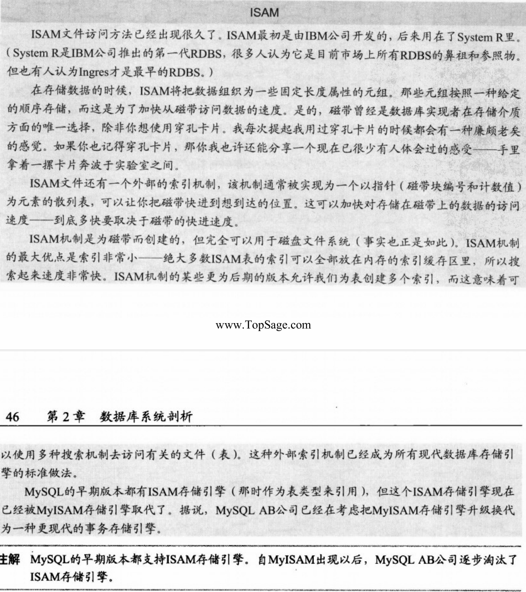

**2.InnoDB**

InooDB是一个采用GNU公共许可证（GNU Public License，GPL）发行的第三方存储引擎，它来自Innobase公司（www.innodb.com）.InnoDB几乎总是用在需要支持事务处理的应用里。InnoDB支持传统的ACID事务处理原则（请参见下面的文本框内容）和外键约束机制。InnoDB里的所有索引都采用了B-树结构-把索引记录存放在叶结点里。InnoDB改进了MyISAM的并发控制，可以提供行级的锁定。在强调可靠性和需要支持事务处理的场合,InnoDB是首选的存储引擎。

**3.BOB**

BDB是Berkley Database的缩写。BDB是一个来自Sleepycat公司（www.sleepycat.com）的第三方存储引擎。BDB存储引擎被认为是InnoDB的更新换代产品，支持事务以及COMIT和ROLLBACK等额外的事务功能。BDB支持散列表、B-树、简单的基于记录编号的存储机制和永久查询。

> 注解Oracle现在虽然拥有InnoDB和BDB，且在接下来的几年也将保持两种技术共存的状态。但是在不久的将来，BDB也许会成为不被支持的存储引擎。

**4.内存**

内存存储引擎（memory storage engine）（有时被称为HEAP表）是一种驻留在内存里的表，它使用了一种散列机制来加快常用数据的检索速度。这种表要比存储在磁盘上的表快很多。它们在使用上与其他存储引擎没有什么不同，只不过数据是存储在内存里并只在MySQL会话期间有效而已。在系统关机（或崩溃）时，HEAP表里的数据将丢失。内存存储引擎特别适合用来存储那些访问频繁但很少需要修改的静态数据，比如邮政编码、国家、地区、产品目录之类的字典表等.HEAP表还可以用在那些利用快照技术提供分布式或历史数据访问服务的数据库。

> 提示：基于内存的表将被创建在/data-dir/database-name/table-name.frm子目录下。利用启动选项--init-file-file可以在系统开机启动时自动创建出基子内存的表来。在这种情况下，给定文件应该包含用来重新创建那些表的SQL语句，因为表只需创建一次，并且表的定义在系统重启时也不会被删除，所以你可以省CREATE语句。

**5.合并**

合并存储引擎（merge storage engine）是用一组有着相同结构（元组布局或模式）的MyISAM表建立的，其效果是那些表可以被当作一个单个的大表来使用。那些表将按照它们各自的位置来分区，并不需要使用额外的分区机制。所有的表必须驻留在同一台机器上（通过同一个服务器访问）。用户只需使用单个操作或SELECT，UPDATE，INSERT和DELETE等语句就可以访问到那些表里的全部数据。幸好，对合并表发出的DROP命令只解除那些表的合并关系，不会改变那些最初的表。

这种表类型的最大优点是速度。利用合并存储引擎，可以把一个大表分成几个较小的表并保存在不同的磁盘上，再通过一些合并表规则把它们合并起来以便同时对它们进行访问。因为每个表里的数据只是全部数据的一部分，所以搜索和排序操作的执行速度会快很多。比如说，如果你是按照某种特定条件来划分数据的，就可以只搜索与你想要搜索的数据有关的各个子表而不是去搜索一个体积庞大的表。类似的，对表进行修复的工作也将变得比较容易，因为修复几个较小的文件要比修复一个大文件要容易和迅速得多。据推测，绝大多数错误都集中发生在一两个文件里，不需要重新创建或修复所有的数据。但这种存储引擎有以下几个缺点：

* 你只能使用结构相同的MyISAM表来构成一个大的合并表。这就把合并存储引擎的应用范围限制在了MyISAM表上。若是合并存储引擎可以接受任何一种表类型的话，合并存储引擎肯定会比现在更加有用。
* 不允许进行替换操作。
* 与一个普通的表相比，使用索引去访问一个合并表的效率要低一些。

合并存储机制最适合用在特大型数据库（very large database，VLDB）应用里，比如一个因为数据量太大而需要把数据分散到多个表、甚至是多个数据库里去的数据仓库。

**6.档案**

档案存储引擎（archive storage engine）是一种用来把大量数据保存为某种压缩格式的机制。档案存储机制最适合用来存放和检索那些不需要频繁访问的档案性或历史积累性数据。就拿系统的操作日志来说吧，普通用户肯定不需要每天都去检索和使用这种东西，但它们在系统出问题的时候就派上用处了。

档案存储引擎没有提供任何索引机制，唯一的访问办法是扫描整个表。因此，档案存储引擎不适合用于日常的数据库存储和检索操作。

**7.联合**

联合存储引擎（fedreted storage engine）是一种用来从多个数据库系统创建一个表的机制。联合存储引擎的工作情况与合并存储引擎很相似，但它还允许你把来自多个数据库服务器的数据（表）链接在一起。这个机制的主要用途也正是把来自其他数据库系统的表链接起来。联合存储引擎最适合用在分布式环境或数据仓库环境里。

联合存储引擎最吸引人的地方是它不移动数据，也不要求远程的表是同一种存储引擎，联合存储引擎会在存储和检索有关数据的过程中自动完成必要的转换。这充分体现出了插件式存储引擎层的强大威力。

**8.群集/NDB**

群集存储引擎（cluster storage engine）（在需要与集簇产品相区别的场合称为NDB）为MySQL提供了群集服务器的能力。群集存储引擎的基本用途是在一个高可用性和高性能的环境里集中使用多个MySQL服务器提供数据库服务。群集存储引擎不存储任何数据，具体的数据存储和检索操作由群集里的各有关数据库所使用的存储引擎负责执行，群集存储引擎只负责控制如何把数据分布到群集簇中的各个数据库以提供冗余和改善性能。NDB存储引擎同时提供了一个AP1供人们创建可扩展的群集解决方案。

**9.CSV**

CSV存储引擎用来创建和读写CSV（coma-separated value，逗号分隔的值）格式的表文件。csv存储引擎不需要把数据复制为另一种格式，CSV表的元数据将它的文件名一起直接保存在服务器上的数据库文件夹里。CSV存储引擎可以让数据库用户快速方便地使用由电子表格软件生成的结构化商务数据。CSV存储引擎没有提供任何索引机制。

**10.黑洞**

黑洞存储引擎（blackhole storage engine）是一项既有趣又非常有用的功能。它允许系统写数据，但并不把写入的数据真正保存起来。不过，如果激活了二进制日志功能，有关的SQL语句将被记载到日志里。这种存储引擎为数据库专家提供了一种临时阻断数据的进出以改变表类型的手段。此外，在只是想测试一下某个应用以确保它是在写数据，而不是想把那些数据真正保存起来的场合，这种存储引擎也非常方便。

**11.定制**

定制存储引擎（custom storage engine）可以是你为了改进数据库服务器而自行创建的任何一种存储引擎。比如说，你想创建一个存储引擎来读取xML文件。你当然可以把XML文件转换为表，但如果你有很多XML文件，这么做会相当麻烦。如果你打算为此创建一个定制的存储引擎，下面给出了这一过程的简要概括。

如果你正在考虑使用XML存储引擎来读取一些特定的XML文件，你应该做的第一件事是分析你的XML文件的格式并确定你想怎样解决XML文件自我描述的“问题”（说是问题，这其实是XML文件的基本特性），我们不妨假设那些XML文件都包含着一些同样的基本数据类型，但也有一些不同的标记，而且那些标记的顺序也不尽相同。在这个例子里，我们不妨假设你决定使用一些样式表把那些XML文件的格式统一起来。

在决定使用什么样的格式之后，就可以参考MySQL源代码提供的存储引擎的例子（可以在MySQL主源代码树的.\storage\example文件夹里找到那些源代码）来开发自己的存储引擎了。你会找到一个制作文件和两个源代码文件（ha-example.h和ha-example.cc），其内容是能够让存储引擎插入系统并运转起来的一套完整的代码框架。因为那些代码只是个框架，所以它们本身没有什么实际的用处，但可以阅读代码里的注释来确定存储引擎需要实现哪些功能以及如何实现。比如说，用来打开文件的方法是haexample::open，通过分析样板存储引擎的源代码文件，可以在ha-example.cpp文件里找到这个方法。代码清单2-2是open方法的一个例子。

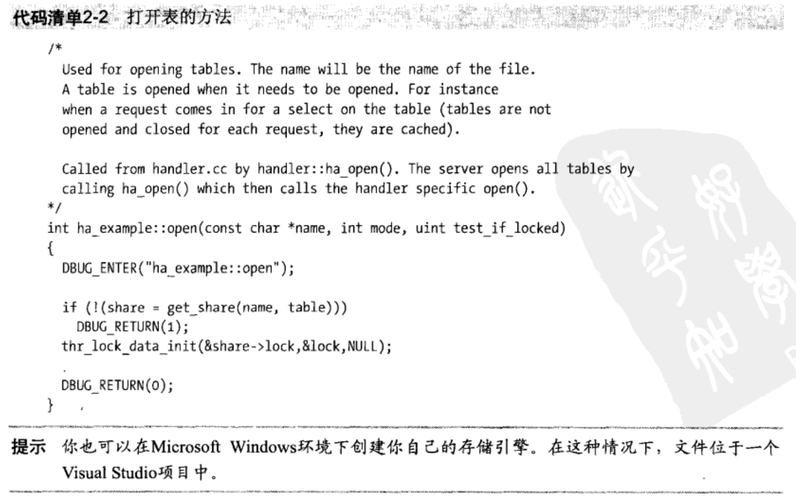

代码清单2-2给出的例子解释了ha-example:：open方法的用途、调用方式和返回值。如果你现在还看不太懂那些源代码，别灰心，反复多读几遍，等你熟悉了MySQL的编程风格就容易领会其中的奥妙了。

> 注解早期的MySQL版本（5.1版之前）允许自行创建定制的存储引擎，但你必须重新编译MySQL服务器的可执行文件才能让你做的改动生效，从5.1版开始，新的插入式体系结构和模块化的API为存储引擎提供了更丰富的实现方式和功能，更重要的是使得存储引擎的开发工作可以完全独立于MySQL的系统代码，因此，你不必直接修改MySQL源代码。你的新存储引擎项目允许你创建定制的引擎，然后编译并把它与正在运行的MySQL服务器链接起来。

把示例存储引擎及其工作原理弄明白之后，应该先把那些文件复制到你的工作子目录并重新命名为一个更贴切的名字，然后再开始修改那些文件来读取XML文件。像所有优秀的程序员那样，你应该每次只改写一个方法并在改好后对它进行全面的测试，等它的工作情况完全达到你的要求之后再去修改下一个方法。当想要的功能全部实现出来之后，编译你的新存储引擎并把它链接到正在使用的MySQL服务器，新的存储引擎就可以为用户提供服务了。

这听起来似乎是个相当艰巨的任务，但真的动起手来就会发现其实并不难。这种练习也是研究MySQL源代码的一个好办法。本书第7章将带领大家一步一步地创建新的定制存储引擎。

## 小结

本章介绍了典型RDBS的体系结构。虽然不能与一本全面探讨数据库理论的图书相比，但本章内容应该能够让大家对关系数据库的体系结构及其工作流程有一个基本的了解。本章还探讨了MySQL服务器的体系结构并说明了如何找到MySQL服务器的各个组成部分的源代码。

了解RDBS的工作原理MySQL服务器的体系结构，将为你进一步扩展MySQL数据库系统打下良好的基础。有了MysQL体系结构的知识，你就全副武装好了（但不会非常危险）。

下一章将介绍MysQL的源代码并开始学习如何根据自己的需要去扩展MySQL系统。好了，卷起袖子，坐到电脑前；我们要开始修改源代码了！