(注1：看PHP视频里面的内容感觉有点单薄，准备再看一本书巩固一下，这本书挑着看，前面有介绍服务器有关的知识挺通俗易懂的，也是需要掌握的知识。)

(注2：截止到今天——2020年7月15日，PHP的最新版本是V7.4.8。)

(注3：不知道为什么这篇博文的图片加载不出来，网页上不显示)

(注4：我觉得学一下PHP也是挺好的，当初学Java学了一段时间就没有继续下去了，C语言也是一样，就把PHP当作我学习的第一个后端语言吧，虽然只是脚本语言，而且好像还‘‘过气’了，但是学里面的思想，思想是不会过气的。)

# 第5章：PHP的基本语法

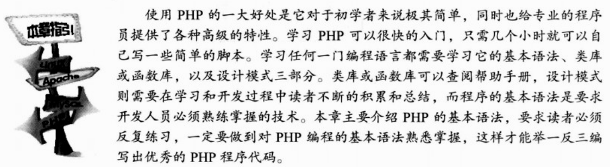

## PHP在Web开发中的应用

PHP（**PHP：Hypertext Preprocessor，超文本预处理器**的字母缩写）是一种被广泛应用的开放源代码的多用途脚本语言。PHP可简单地视为一种较流行的开发动态网页用的程序语言，是一种服务器端的，嵌入到HTML中的脚本语言，是开发Web应用程序的理想工具。它具有开源免费、语法简单、跨平台、功能强大，灵活易用及效率高等优点。可以说，PHP已经成为Web脚本技术的先驱。在融合了现代编程语言（如：C，Java和Perl）的一些最佳特性后，PHP，Apache和MySQL的组合已经成为Web服务器的一种配置标准。

PHP能做很多事，但PHP主要是在Web开发中用于服务端的脚本程序。PHP需要安装PHP应用程序服务器去解释执行，是用来协助Web服务器工作的编程语言，也可以说是对Web服务器功能的扩展，并外挂在Web服务器上一起工作。用户如果通过浏览器访问Web服务器需要得到动态响应的结果，Web服务器就要委托PHP脚本编程语言来完成了。本书中可以用PHP来完成以下工作，但PHP的功能远不局限于此，如图5-1所示。

### 收集表单数据

表单（FORM）是网络编程中最常用的数据输入界面。表单通常在提交时可以使用GET或POST的方法将数据发送给PHP程序脚本。在PHP脚本中，可以以PHP变量的形式访问每一个表单域在PHP脚本中使用。根据PHP版本和设置不同，通过变量可以有3种方法来访问表单数据。所以在PHP中，获得客户输入的具体数据是非常简单的。

### 生成动态网页

PHP脚本程序和客户端的JavaScript脚本程序不同的是，PHP代码是运行在服务端的。PHP脚本程序可以根据用户在客户端的不同输入请求，在服务端运行该脚本后，动态输出用户请求的内容。客户端就能接收到想得到的结果，但他们无法得知其背后的代码是如何运作的。甚至可以将Web服务器设置成让PHP来处理所有的HTML文件，这么一来，用户就无法得知服务端到底做了什么。

### 字符串处理

在编写程序代码或是文本处理时，经常在操作字符串，所以字符串处理一直是程序员使用最多的技术之一，PHP是把字符串作为一种基本的数据类型来处理。在PHP中提供了丰富的字符串处理函数，以及使用强大的正则表达式来对字符串或文本进行搜索、查找、匹配、替换等操作。

### 动态输出图像

使用PHP并不局限于输出HTML文本。PHP通过使用GD扩展库还能被用来动态输出图像，例如文字按钮、验证码、数据统计图等，还可以轻松地编辑图像，例如处理缩略图和为图片添加水印等，具有强大的图像处理功能。

### 处理服务器端文件系统

要想让数据可以长期保留，可以使用数据库或是文件系统来存取信息。在某些存取数据相对简单的应用中，或是一些特定的应用中，没有必要使用数据库，就可以采用文件操作。PHP可以利用文件系统函数任意操作服务器中的目录或文件。包括目录或文件的打开、编辑、拷贝、创建、删除，以及文件属性等操作。

### 编写数据库支持的网页

PHP最强大最显著的特性之一，是它支持很大范围的数据库。用户会发现利用PHP编写数据库支持的网页简单得难以置信。目前，PHP可以连接任何支持世界标准的数据库。

### 会话跟踪控制

我们访问Web服务器通常是使用HTTP协议完成的，但它是一个无状态的协议，没有一个内建机制来维护两个事务之间的状态。也就是当一个用户在请求一个页面后再请求另外一个页面时，HTTP将无法告诉我们这两个请求是来自同一个用户。所以可以在PHP中使用会话控制思想在网站中跟踪一个用户，这样就可以很容易做到用户登录的支持，并根据某个用户的授权级别和个人喜好显示相应的内容，也可以根据会话控制记录该用户的行为。

### 处理XML文件

PHP具有极其有效的文本处理特性，支持从POSIX扩展或者Perl正则表达式到XML文档解析。为了解析和访问XML文档，PHP4支持SAX和DOM标准，也可以使用XSLT扩展库来转换XML文档。PHP5基于强健的libxm2标准化了所有的XML扩展，并添加了SimplexML和XMLReader支持，扩展了其在XML方面的功能。

### 支持利用大量的网络协议

PHP还支持利用诸如LDAP，IMAP，SNMP，NNTP，POP3，HTTP，COM（Windows环境）等不计其数的协议的服务。还可以开放原始网络端口，使得任何其他的协议能够协同工作.PHP支持和所有Web开发语言之间的WDDX复杂数据交换。关于相互连接，PHP已经支持了对Java对象的即时连接，并且可以将他们自由的用做PHP对象。甚至可以用我们的CORBA扩展库来访问远程对象。

### 服务器端的其他相关操作

如果将PHP用于电子商务领域，会发现其Cybercash支付、CyberMUT，VeriSign Payflow Pro以及MCVE函数对于在线交易程序来说是非常有用的。另外，还有很多其他有趣的扩展库。例如mnoGoSearch搜索引擎函数、IRC网关函数、多种压缩工具（gzip，b22）、日历转换、翻译....

PHP能够用在所有的主流操作系统上，包括Linux，Unix的各种变种（包括HP-UX.Solaris和OpenBSD），Microsoft Windows，Mac OS X、RISC OS等。今天，PHP已经支持了大多数的Web服务器，包括Apache，Microsoft Internet Information Server（IIS），Personal Web Server（PWS）、Netscape以及iPlant Server.Oreilly Website Pro Server，Caudium，Xitami，OmniHTTPd等。对于大多数的服务器，PHP提供了一个模块；还有一些PHP支持CGI标准，使得PHP能够作为CGI处理器来工作。

综上所述，使用PHP，可以自由地选择操作系统和Web服务器以及合适的数据库管理系统。同时，还可以在开发时选择使用面向过程和面向对象，或者两者混合的方式来开发。尽管PHP 4不支持OOP所有的标准，但很多代码仓库和大型的应用程序（包括PEAR库）仅使用OOP代码来开发。PHP 5弥补了PHP4的这一弱点，引入了完全的对象模型。

## 第一个PHP脚本程序

读者也许迫不及待地想编写第一个PHP脚本程序。为了帮助读者熟悉PHP的运行过程，以下包含了一个PHP小型程序，让我们快速地完成。现在，读者也许无法理解其中的所有内容，但不用担心，尽管编写并运行它。

每种程序开发周期都有其自己的步骤。PHP的开发只有三步：第一步是使用编辑器创建一个包含源代码的磁盘文件；第二步将文件上传到**Web服务器**上：第三步是通过浏览器访问web服务器运行该文件。以后每个PHP程序要想运行都是采用同样的运行方式。具体步骤说明如下所示。

> Web服务器一般指网站服bai务器，是指驻留于因特网上某种类du型计算zhi机的程序，可以向浏览器dao等Web客户端提供文档，也可以放置网站文件，让全世界浏览；可以放置数据文件，让全世界下载。目前最主流的三个Web服务器是Apache  Nginx  IIS。
>
> WEB服务器也称为WWW(WORLD WIDE WEB)服务器，主要功能是提供网上信息浏览服务。 
>
> WWW 是 Internet 的多媒体信息查询工具，是 Internet 上近年才发展起来的服务，也是发展最快和目前用的最广泛的服务。正是因为有了WWW工具，才使得近年来 Internet 迅速发展，且用户数量飞速增长。

[什么是Web服务器](https://zhuanlan.zhihu.com/p/80936871)

**1.使用编辑器创建一个包含源代码的磁盘文件**

PHP的源代码是一系列的语句或命令，用于指示服务器执行你期望的任务。编写PHP的源代码可以使用任意的文本编辑器，例如Linux系统下的vi，Windows系统下的记事本，还有像Zend Studio等专用的PHP编辑工具等。但编写的PHP源代码文件一定要是以.php结尾的文件，这样才能由PHP引擎来处理。在大部分的服务器上，这是PHP的默认扩展名，不过，也可以在Apache等Web服务器中指定其他的后缀名。

**2.将文件上传到Web服务器上**

要将编写完成的PHP文件上传到Web服务器的根目录下（如：Apache服务器的文档根目录
/usr/local/apache2/tdocs下），在本教程中，假设用户的服务器已经安装并运行了PHP（可以参考第2章环境安装）。

**3.通过浏览器访问Web服务器运行程序**

如果已经将PHP文件成功上传到Web服务器上，开启一个浏览器，在浏览器的地址栏里输入Web服务器的URL访问这个文件，服务器将神奇地自动解析这些文件，并将解析的响应给请求的浏览器。不用编译任何东西，也不用安装任何其他的工具，仅仅只需把这些使用了PHP的文件想象成简单的HTML文件，其中只不过多了一种新的标识符，在这里可以做各种各样的事情。

具体操作过程如下面的示例，打开文本编辑器并用PHP编写了一个HTML脚本，其中嵌入了一些代码来做一些事情。PHP代码被包含在特殊的“起始符”和“结束符”中，使得可以进入"PHP模式"。程序代码所示：

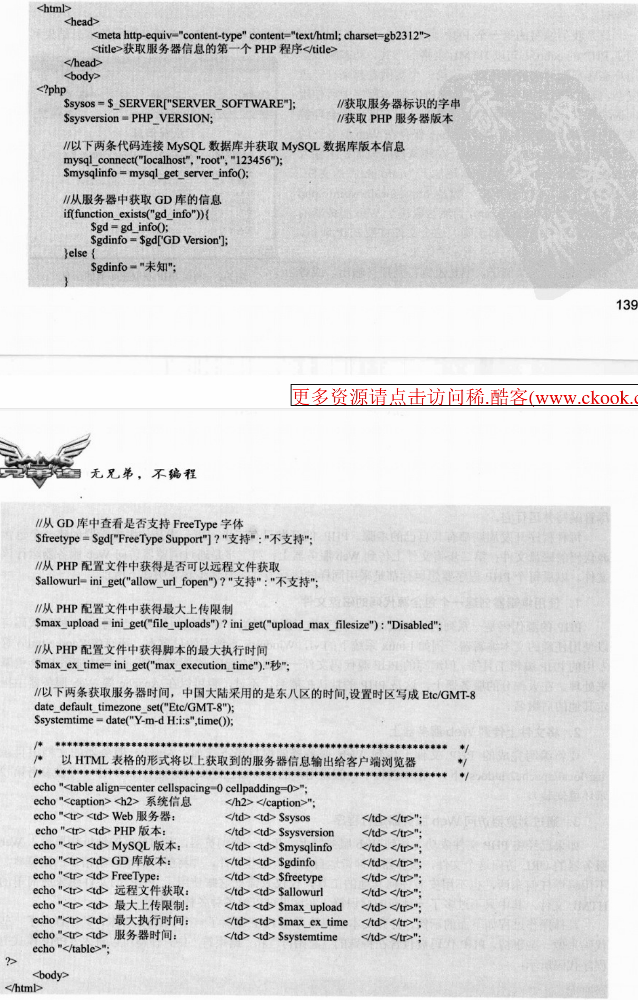

这是我们编写的第一个PHP脚本例子，用来获取服务器端的相关信息，并将获取到的信息结果利用了PHP的echo语句以HTML表格的形式，动态响应给用户在客户端请求的浏览器。这第一个实例看起来有一点复杂，但读者暂时并不用理会上例PHP脚本程序中所使用的语法含义，通过本教程后面内容的学习，读者就会理解其中的代码。将本例以后缀名为.php保存在Web服务器的文档根目录下面，如info.php。在浏览器的地址栏里输入Web服务器的URL，访问在结尾加上"/info.php"的文件。

如果本地开发，这个URL一般是http://ocalhost/info.php或者http://27.0.0./info.php，当然这取决于Web服务器的设置。如果所有的设置都正确，这个文件将被PHP解析，浏览器中将会输出如图5-2所示的结果。

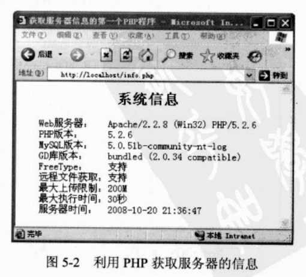

如果试过了这个例子，但是没有得到任何输出，或者浏览器弹出了下载框，再或者浏览器以文本方式显示了源文件。可能的原因是服务器还没有支持PHP，或者没有正确配置。请按本书中的第2章的方法重新配置安装，使得服务器支持PHP。如果运行程序时得到的结果与期望的不同，则需要回到第一步，必须找出导致问题的原因，并在源代码中进行更正。修改源代码后，需要重新上传到Web服务器上，并重新刷新浏览器。你要不断地沿这样的循环进行下去，直到程序的执行情况同期望的完全相符。如果出现如图5-12所示的结果，则表示运行成功。右击浏览器在弹出的菜单中选择“查看源文件”会看到如下内容：

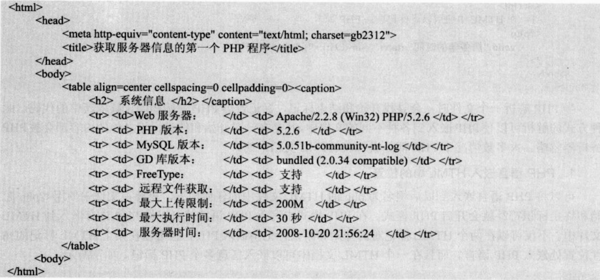

通过在客户端查看源代码会出现上面的内容，所以用户在客户端只能看到PHP脚本被服务器解析后动态输出的HTML内容。他们看不到任何PHP脚本代码，就无法得知其背后的代码是如何运作的。所以用户就无法得知服务端到底做了什么。

现在已经成功建立了一个简单的PHP脚本，还可以建立一个最著名的PHP脚本。调用函数phpinfo），将会看到很多有关自己系统有用的信息，以及预定义变量、已经加载的PHP模块和配置信息。请花一些时间来查看这些重要的信息。

### PHP语言标记

前面例子的目的是为了显示PHP特殊标识符的格式，用<？php来表示PHP标识符的起始，然后放入PHP语句并通过加上一个终止标识符？来退出PHP模式。可以根据自己的需要在HTML文件中像这样开启或关闭PHP模式。大多数的嵌入式脚本语言都是这样嵌入到HTML中并和HTML一起使用，例如CsS.JavaScript，PHP，ASP，以及JSP等。如下所示

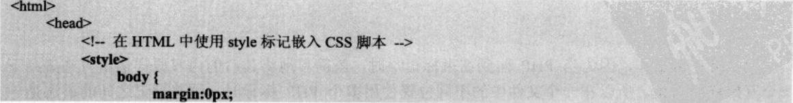

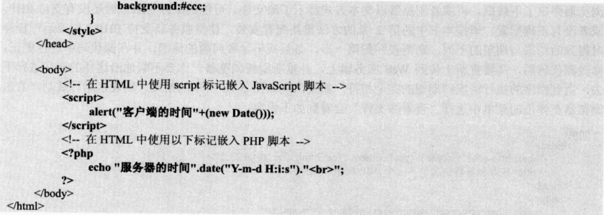

当PHP解析一个文件时，会寻找开始和结束标记，标记告诉PHP开始和停止解释其中的代码。此种方式的解析可以使PHP嵌入到各种不同的文档中，凡是在一对开始和结束标记之外的内容都会被PHP解析器忽略。大多数情况下PHP都是嵌入在HTML文档中的。

**1.PHP语言嵌入HTML中的位置**

可以将PHP语言嵌入到以后缀名为.php的HTML文件中的任何地方，只要在文件中使用<？php起始和终止标识符？>就会开启PHP模式。在PHP模式中写入PHP语法就可以将PHP语言嵌入到HTML文件中。不仅可以在两个HTML标记对的开始和结束标记中嵌入PHP，也可以在某个HTML标记的属性位置处嵌入PHP语言。而且在一个HTML文档中可以嵌入任意多个PHP标记。如下所示：

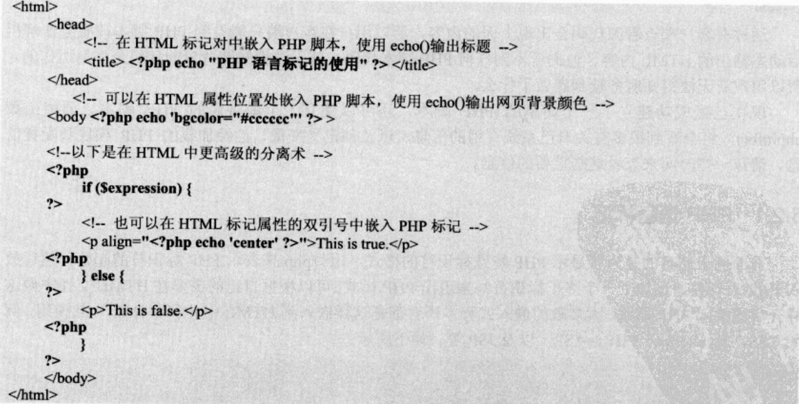

上例可正常工作，因为当PHP碰到结束标记？时，就简单地将其后的内容原样输出直到碰到下一个开始标记为止。所以在一个文件中的不同位置使用多个PHP标记时，这些标记之间的语法是一个整体，只不过需要按内容的执行顺序将它们使用PHP标记分开。当然，上面的例子很做作，但是对输出大块的文本而言，脱离PHP解析模式通常比将所有内容在PHP模式中用echo或者print输出更有效率。

**2.使用四对不同的开始和结束标记**

可以在PHP中使用四对不同的开始和结束标记。其中两种，<？php？>和< script language="php"></scrip总是可用的。另两种是短标记和ASP风格标记，可以在PHP的配置文件php.ini中打开或关闭。尽管有些人觉得短标记和ASP风格标记很方便，但移植性较差，通常不推荐。四对不同的开始和结束标记如下所示：

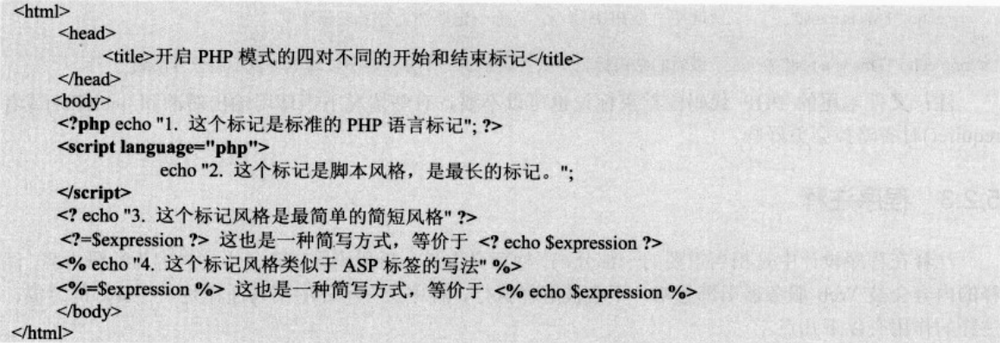

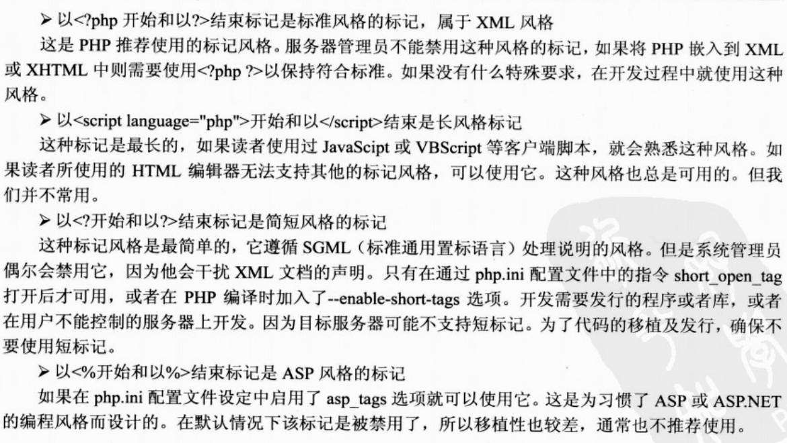

### 指令分隔符'分号'

PHP同C或Perl以及Java一样，语句分为两种：一种是在程序中使用结构定义语句，例如流程控制、函数定义、类的定义等，是用来定义程序结构使用的语句。在结构定义语句后面不能使用分号作为结束；另一种是在程序中使用功能执行语句，例如变量的声明、内容的输出、函数的调用等，是用来在程序中执行某些特定功能的语句，这种语句也可以称为指令，PHP需要在每个指令后用分号结束。一段PHP代码中的结束标记？隐含表示了一个分号，所以在一个PHP代码段中的最后一行可以不用分号结束。如果后面还有新行，则代码段的结束标记包含了行结束。

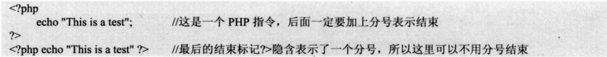

注：文件末尾的PHP代码段结束标记也可以不要，有些情况下当使用输出缓冲和include（）或者require）时省略掉会更好些。

### 程序注释

注释在程序设计中是相当重要的一部分，严格意义上说一份代码应该有一半的内容为注释内容。注释的内容会被Web服务器引擎忽略，不会被解释执行。程序员在程序中书写注释是一种良好的习惯，注释的作用有以下几点。

* 可以将写过的觉得不合适的代码暂时注释掉，不要急于删除，如果再想使用可以打开注释重新启用。
* 注释的主要目的在于说明程序，给自己或他人在阅读程序时提供帮助，使程序更容易理解，也就是增强程序代码的可读性，以方便维护人员的维护。
* 注释对调试程序和编写程序亦可起到很好的帮助作用。
* PHP支持C，C++和Unix Shell风格（Perl风格）的注释，PHP的注释符号有三种：以“/*”和“ */"闭合的多行注释符，以及用“/”和“#”开始的单行注释符。注释一定要写在被注释代码的上面或是右面，不要写到代码的下面。例如：

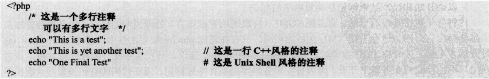

以上几种代码注释风格，可以任意选择合适的代码注释风格使用。和C语言一样，多行注释是以/\*开始和以*/结束，可以注释多行代码。但要注意，多行注释是无法嵌套的。当注释大量代码时，可能犯该错误。如下所示：

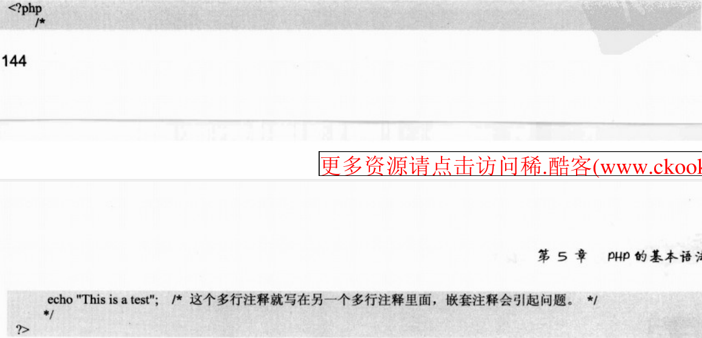

但是在多行注释里可以包含单行注释，在单行注释里也可以包括多行注释。下面的注释使用都是正确的。如下所示：

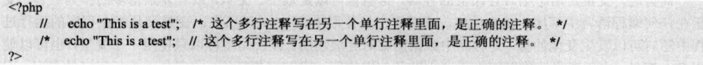

在使用行注释符号#或//之后到行结束之前，或PHP结束标记？或%之前的所有内容都是注释内容。这意味着在//>之后的HTML代码将被显示出来：？>跳出了PHP模式并返回了HTML模式。如果启用了asp tags配置选项，其行为和/1%相同。不过，<scrip 标记在单行注释中不会跳出PHP模式。

如下所示的代码行中，关闭标记之前的代码"echo'simple';"被注释。而关闭标记？>之后的文本"example."
将被当做是HTML输出，因为它位于关闭标记之外。

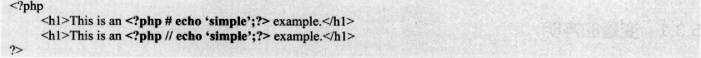

### 在程序中使用空白的处理

一般来说，空白符（包括空格、Tab制表符、换行）在PHP中无关紧要，会被PHP引擎忽略。可以将一个语句展开成任意行，或者将语句紧缩在一行。空格与空行的合理运用（通过排列分配、缩进等）可以增强程序代码的清晰性与可读性，如果不合理运用，便会适得其反。空行将逻辑相关的代码段分隔开，以提高可读性。

下列情况应该总是使用两个空行:

* 一个源文件的两个代码片段之间。
* 两个类的声明之间。

下列情况应该总是使用一个空行：

* 两个函数声明之间。
* 函数内的局部变量和函数的第一条语句之间。
* 块注释或单行注释之前。
* 一个函数内的两个逻辑代码段之间，用以提高可读性。

空格的应用规则是可以通过代码的缩进提高可读性。

* 空格一般应用于关键字与括号之间，不过需要注意的是，函数名称与左括号之间不应该用空格分开。
* 一般在函数的参数列表中的逗号后面插入空格。
* 数学算式的操作数与运算符之间应该添加空格（二进制运算与一元运算除外）。
* for语句中的表达式应该用逗号分开，后面添加空格。
* 制类型转换语句中的强制类型的右括号与表达式之间应该用逗号隔开，添加空格。

## 变量

简言之，变量是用于临时存储值的容器。这些值可以是数字、文本，或者复杂得多的排列组合。变量在任何编程语言中都居于核心地位，理解它们是使用PHP的关键所在。变量又是指在程序的运行过程中随时可以发生变化的量，是程序中数据的临时存放场所。在代码中可以只使用一个变量，也可以使用多个变量。由于变量让你能够把程序中准备使用的每一段数据都赋给一个简短、易于记忆的名字，因此它们十分有用。变量可以保存程序运行时用户输入的数据、特定运算的结果，以及要输出到网页上显示的一段数据等。简而言之，变量是用于跟踪几乎所有类型信息的简单工具。

PHP中最基本的数据存储单元就是变量和常量，可以存储不同类型的数据。另外PHP脚本语言是种弱类型检查的语言。和其他语言不同的是变量或常量的数据类型由程序的上下文决定。由于这个原因使PHP的语法和一些强类型语言（C语言、Java等）有很大的不同。

### 变量的声明

在PHP中我们可以声明并使用自己的变量，PHP的特性之一就是它不要求在使用变量之前声明变量。当第一次给一个变量赋值时，你才创建了这个变量。变量用于存储值，比如数字、文本字符串或数组。一旦设置了某个变量，我们就可以在脚本中重复地使用它。在PHP中的声明变量必须是使用一个美元符号“s”后面跟变量名来表示，使用赋值操作符（-）给一个变量赋值。如果在程序中使用声明的变量，就会将变量替换成前面赋值过的值。如下所示：

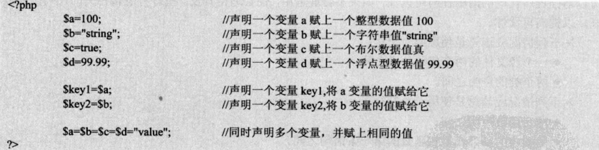

PHP的变量声明以后有一定的使用范围，变量的范围即它定义的上下文背景（也就是它的生效范围）。大部分的PHP变量如果不是在函数里面声明的，只有在声明处到文件结束的一个单独的范围使用。这个单独的范围跨度不仅是在<？php标记开始处到？>结束标记处使用，可以在一个页面的所有开启的PHP模式下使用，也包含了include和require引入的文件。如果使用COOKIE或SESSION还可以在多个页面中应用。

在变量的使用范围周期内，我们可以通过借助**unset()函数**释放指定的变量，使用**isset()函数**检测变量是否设置和使用**empty()函数**检查一个变量是否为空。以可通过以下方式使用这几个函数控制变量。

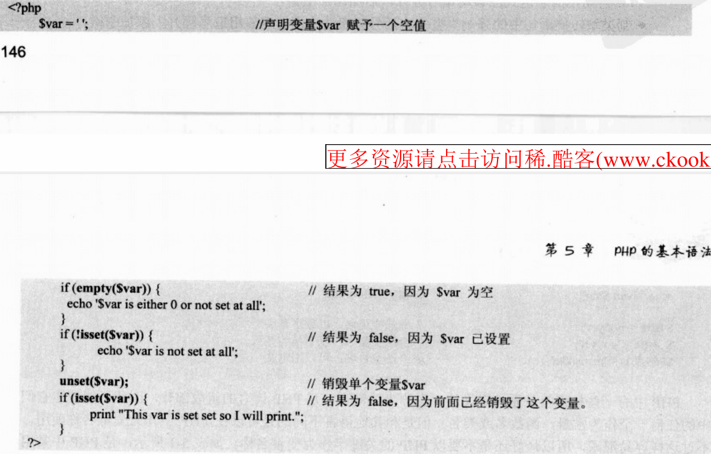

### 变量的命名

首先，我们必须给变量取一个合适的名字，就必须知道如何给变量命名。就好像每个人都有自己的名字一样，否则就难以区分了。在声明变量时要按一定的规则，比如变量名是严格区分大小写的。但内置结构和关键字以及用户自定义的类名和函数名都是不区分大小写的。例如echo、while、class名称、function名称等都可以任意大小写。如下所示：

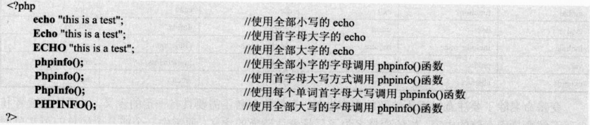

而变量名是严格区分大小写的，不能采用上面的方式应用。相同单词组成的变量，但大小写不同就是不同的变量。如下所示：

上面定义的Sname，SName和SNAME是三个不同的变量。变量名称除了区分大小写之外，变量名与PHP中其他的标签一样需要遵循相同的命名规则。一个有效的变量名由字母或者下画线开头，后面跟上任意数量的字母，数字，或者下画线。按照正常的正则表达式，它将被表述为："la-ZA-Z-x7f-\xf[a-zA-Z0-9 x7f-xfj"。但要注意，变量名的标识符**一定不要以数字开头**，**中间不可以使用空格**，**不能使用点分开**等。如下所示：

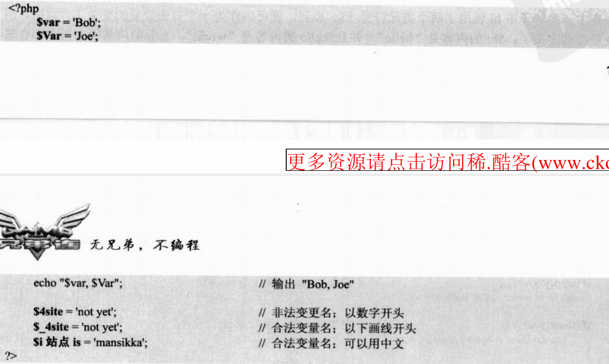

PHP中有一些标识符是系统定义的，也称为关键字。是PHP语言的组成部分，因此不能使用它们中的任何一个作为常量、函数名或类名。但是和其他语言不同的是可以在PHP中作为变量名称使用，不过这样容易混淆，所以最好还是不要以PHP的关键字作为变量名称。如表5-1所示，是PHP中常用的关键字列表。

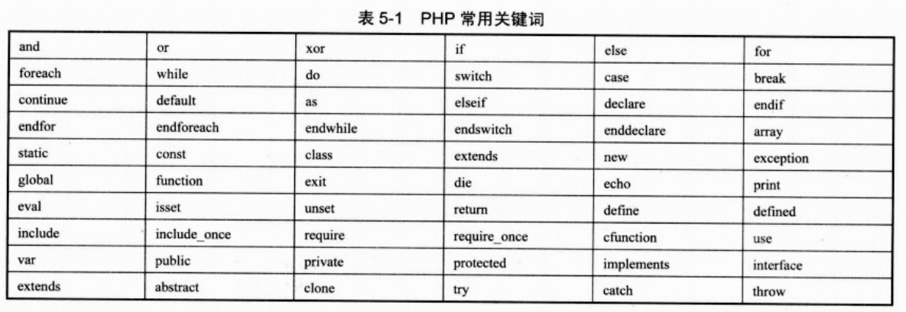

变量命名除了要注意以上所涉及的内容之外，变量的命名还需要具有一定的含义，以便让阅读者和自己了解变量所存储的内容。好的变量名为了尽量表达清晰的含义，通常由一个或几个简单的英文单词构成。如果变量是一个单词构成，通常采用全部小写方式作为变量名。如果变量是由多个单词构成，第一个单词采用全部小写字母，以后的每个单词首字母采用大写的风格。如：SaaBbbCcc风格，函数名称命名和变量命名采用同样的规则。

### 可变变量

有时候使用可变变量名是很方便的。就是说，一个变量的变量名可以动态地设置和使用。一个普通的变量通过声明来设置，而一个可变变量获取了一个普通变量的值作为这个可变变量的变量名，如下所示：

在上面的例子中hi使用了两个美元符号（S）以后，就可以作为一个可变变量的变量了。这时，两个变量都被定义了，Shi的内容是"hello"，并且Shello的内容是"world"，上面的两条输出指令都会输出"hello world"，也就是说，SShi和Shello是等价的。

### 变量的引用赋值

变量总是传值赋值。也就是说，当将一个表达式的值赋予一个变量时，整个原始表达式的值被赋值到目标变量。这意味着，当一个变量的值赋予另外一个变量时，改变其中一个变量的值，将不会影响到另外一个变量。PHP中提供了另外一种方式给变量赋值：引用赋值。这意味着新的变量简单的引用（换言之，“成为其别名”或者“指向”）了原始变量。改动新的变量将影响到原始变量，反之亦然。这同样意味着其中没有执行复制操作，因而，这种赋值操作更加快速。不过只有在密集的循环中或者对很大的数组或对象赋值时才有可能注意到速度的提升。使用引用赋值，简单地将一个"&"符号加到将要赋值的变量前（源变量），例如下列代码片断所示：

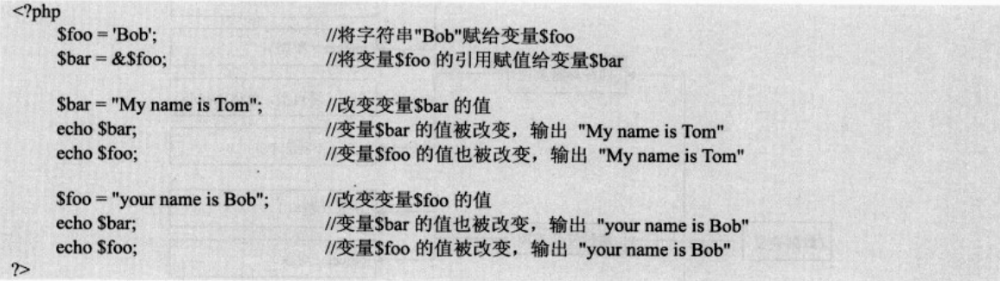

在上面的代码中，我们并不是将变量Sfoo的值赋值给变量Sbar，而是将Sfoo的引用赋值给了Sbar，这时，Sbar相当于是Sfoo的别名。只要其中的任何一个有所改变，都会影响到另一个变量。有一点重要事项必须指出，那就是只有有名字的变量才可以引用赋值。如下所示：

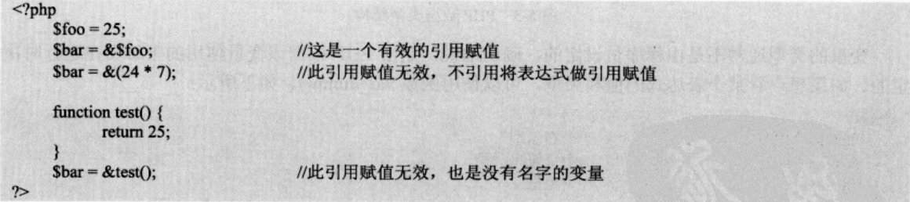

## 变量的类型

变量类型是指保存在该变量中的数据类型。计算机操作的对象是数据，在计算机编程语言世界里，每一个数据也都有它的类型，具有相同类型的数据才能彼此操作。例如书柜是装书用的、大衣柜是放衣服的、保险柜是存放贵重物品的、档案柜是存放文件用的….....

PHP中提供了一个不断扩充的数据类型集，可以将不同数据保存在不同的数据类型中。但PHP语言是一种弱类型检查的语言。和其他语言不同的是，变量或常量的数据类型由程序的上下文决定。在强类型语言中，变量要先指定类型，然后才可以存储对应指定类型的数据。而PHP等弱类型语言中，变量的类型是由存储的数据决定的。例如，强类型语言就好比在制作一个柜子之前，就要决定这个柜子是什么类型的柜子，如果确定了是书柜，那么就只能用了装书用。而在弱类型语言中，同一个柜子，你用来装书它就是书柜。用来装衣服它就是大衣柜，具体什么类型由存放的内容决定。

### 类型介绍

变量有多种类型，PHP中支持以下八种原始类型，为了确保代码的易读性，本书中还介绍了一些伪类型，例如mixed，number，callback，八种类型如图5-3所示。

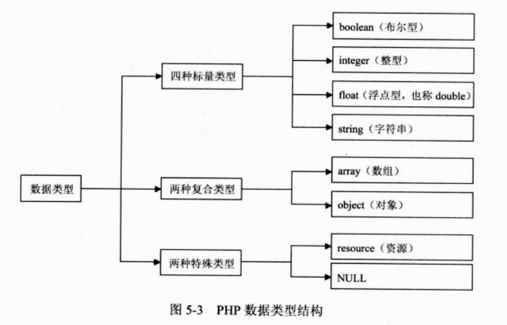

变量的类型通常不是由程序员设定的，确切地说，是由PHP根据该变量使用的上下文在运行时决定的。**如果想查看某个表达式的值和类型**，可以使用函数**var-dump()**。如下所示：

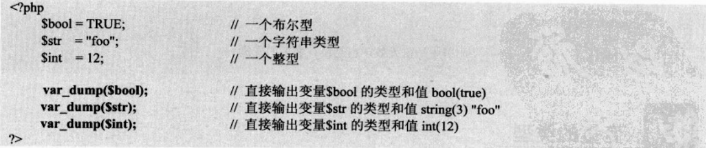

### 布尔型(boolean)

布尔型是PHP中标量类型之一，这是最简单的类型。boolean表达了TRUE或FALSE.即“真”或“假”。在PHP进行关系运算（或称比较运算），以及布尔运算（或称逻辑运算）时，返回的都是布尔结果，它是构成PHP逻辑控制的判断依据。

在PHP中布尔型不光是只有TRUE或FALSE两个值，当运算符，函数或者流程控制需要一个boolean参数时，任何类型的值PHP都会自动转换成布尔型的值。将其他类型作为boolean时，以下值被认为是FALSE，所有其他值都被认为是TRUE（包括任何资源）。

~~~
布尔值FALSE
整型值0（零）为假，-1和其他非零值（不论正负）一样，被认为是TRUE
浮点型值0.0（零）
空白字符串和字符串"0"
没有成员变量的数组
没有单元的对象（仅适用于PHP4）
特殊类型NULL（包括尚未设定的变量）
~~~

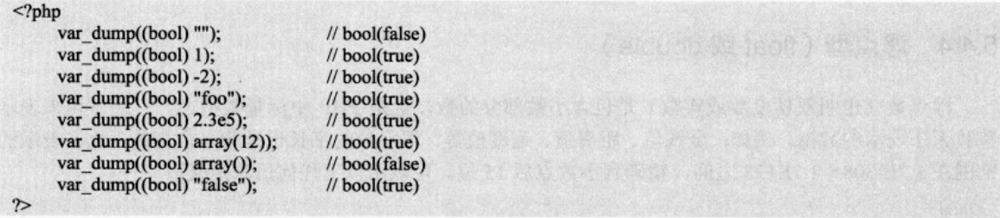

### 整型(integer)

整型也是PHP中标量类型之一，整型变量用于存储整数，例如{...,-2，-1，0，1，2,...}中的 一个数。

在计算机语言中，整型数据不仅是在前面加上可选的符号（+或者-）表示正数或者负数，也不是只有我们常用的十进制数（基数为10），还可以用十六进制（基数为16）或八进制（基数为8）符号指定，如果用八进制符号，数字前必须加上“0"（零），用十六进制符号数字前必须加上"Ox"。声明整型数据如下所示：

其中八进制、十进制和十六进制，都可以用“+”或“.”开头来表示数据的正负，其中“+”都可以省略。八进制与十进制一致，但由0-7的数字序列组成。十六进制由0~9的数字或A~F的字母组成的序列。但在表达式中计算的结果均以十进制数字输出。

整型数值有最大的使用范围，整型数的字长和平台有关，对于32位的操作系统而言，最大值整数为二十多亿，具体为2 147 483 647，PHP不支持无符号整数，所以不能像其他语言那样将整数都变成正数，也就不能将最大值翻一倍。整型的最小值为-2 147 483 648，如果如果给定的一个数超出了integer的这个范围，将会被解释为float，同样如果执行的运算结果超出了integer这个范围，也会返回float。

如下所示：

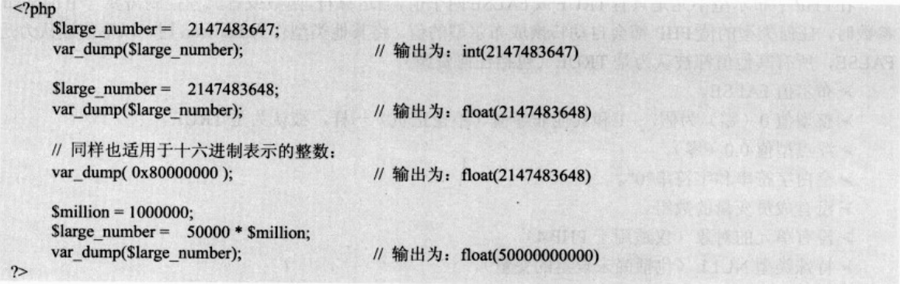

### 浮点型(float或double)

浮点数（也叫双精度数或实数）是包含小数部分的数，也是PHP中标量类型之一。通常用来表示整数无法表示的数据。例如：金钱值、距离值、速度值等。浮点数的字长也是和平台相关，允许表示的范围在1.7E-308~1.7E+38之间，精确到小数点后15位。可以用以下任何语法定义：

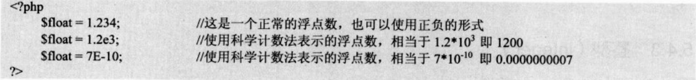

浮点数只是一种近似的数值，如果使用浮点数表示8，该结果内部的表示其实是7.999 999 999 9.......所以永远不要相信浮点数结果精确到了最后一位，也永远不要比较两个浮点数是否相等。如果确实需要更高的精度，应该使用任意精度数学函数或者gmp()函数。

### 字符串(String)

字符串也是PHP中标量类型之一，字符串是一系列字符。在PHP中，字符和字节是一样的，一个字符串可以只是一个字符，一个字符串也可以变得非常巨大，由任意多个字符组成。PHP没有给字符串的大小强加实现范围，所以完全没有理由担心字符串长度。比如一个人的名字、一首诗词、一篇文章等都可以定义成一个字符串。字符串可以使用单引号、双引号、定界符三种字面上的方法定义。虽然这三种方法都可以定义相同的字符串，但它们在功能上有明显的区别。所以我们就可以根据它们之间的区别选择不同的字符串定义方式。这三种字符串的定义和区别如下所示。

**1.单引号**

指定一个简单字符串的最简单的方法是用单引号（'）括起来。在单引号引起来的字符串中不能再包含单引号，试图包含会有错误发生。如果有必要在单引号中表示一个单引号的话，需要用反斜线（|）转义，和很多其他语言一样。如果在单引号之前或字符串结尾需要出现一个反斜线，需要用两个反斜线表示。注意，如果试图转义任何其他字符，反斜线本身也会被显示出来。所以在单引号中可以使用转义字符（|），但只能转义在单引号中引起来的单引号和转义转义字符本身。

另外在单引号字符串中出现的变量不会被变量的值替代。即PHP不会解析单引号中的变量，而是将变量名原样输出。单引号的应用如下所示：

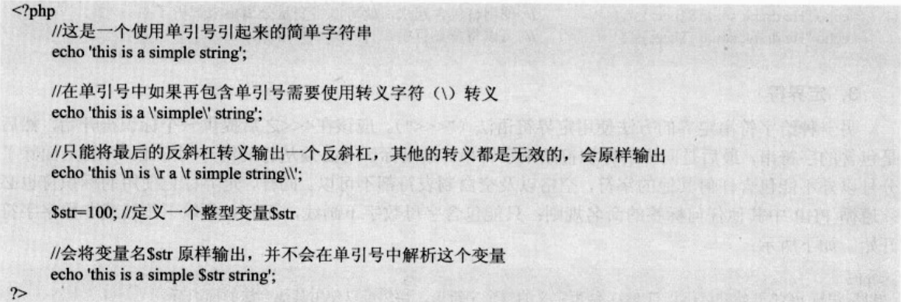

所以在定义简单字符串时，使用单引号时效率会更高，因为PHP解析时不会花费一些处理字符转义和解析变量上的开销。因此，当没有特别需求，应使用单引号定义字符串。

**2.双引号**

如果用双引号（"）括起字符串，PHP懂得更多特殊字符的转义序列。另外，双引号字符串最重要的一点是其中的变量名会被变量值替代，即可以解析双引号中的包含变量。

转义字符“\”与其他字符合起来表示的一个特殊字符，通常是一些非打印字符，如果试图转义任何其他字符，反斜线本身也会被显示出来，如表5-2所示。

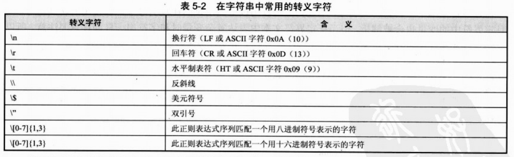

当用双引号指定字符串时，其中的变量会被解析。它提供了解析变量，数组值，或者对象属性的方法。如果是复杂的语法，可以用花括号括起一个表达式。例如遇到美元符号（$），解析器会尽可能多地取得后面的字符以组成一个合法的变量名。如果想明示指定名字的结束，用花括号把变量名括起来。

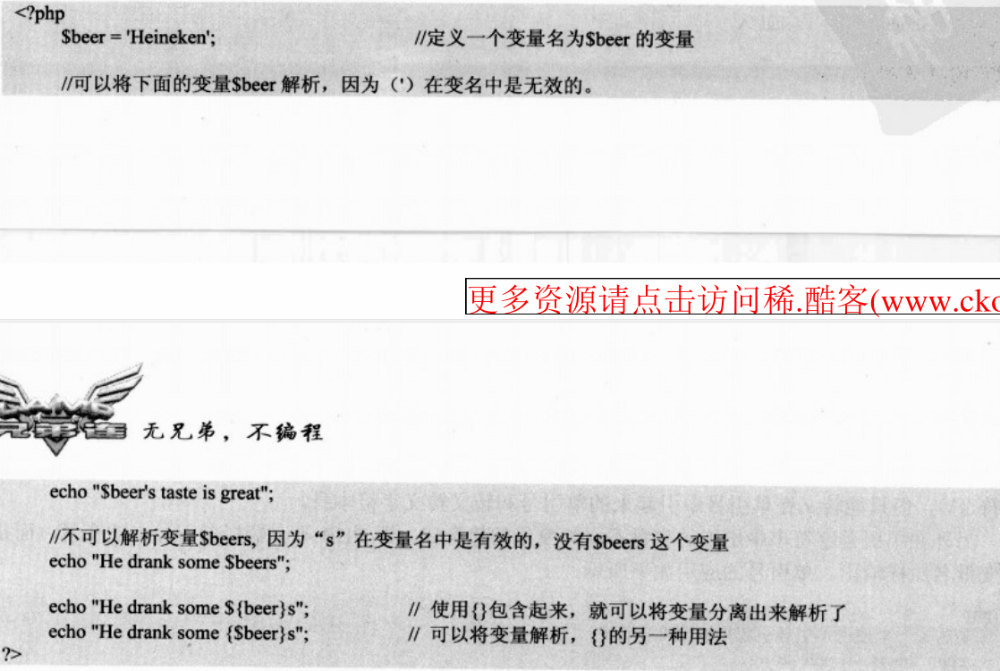

**3.定界符**

另一种给字符串定界的方法使用定界符语法（"<<<"），应该在<<<之后提供一个标识符开始，然后是包含的字符串，最后是同样的标识符结束字符串。结束标识符必须从行的第一列开始，并且后面除了分号以外不能包含任何其他的字符，空格以及空白制表符都不可以。同样，定界标记使用的标识符也必须遵循PHP中其他任何标签的命名规则：只能包含字母数字下画线，而且必须以下画线或非数字字符开始。如下所示：

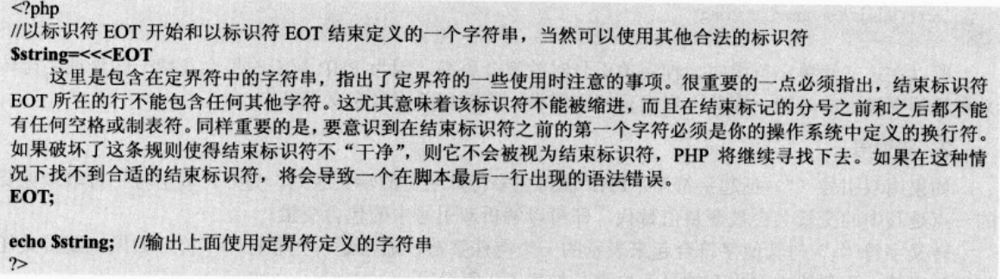

定界符文本除了不能初始化类成员以外，表现的就和双引号字符串一样，只是没有双引号。这意味着在定界符文本中不需要转义引号，不过仍然可以用以上列出来的在双引号中可以使用的转义符号。而且定界符中的变量也会被解析，但当在定界符文本中表达复杂变量时和字符串一样同样也要注意。所以能够很容易地使用定界符定义较长的字符串，通常用于从文件或者数据库中大段地输出文档。如下所示：

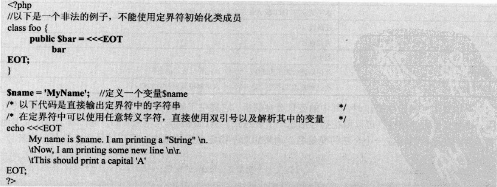

### 数组(Array)

数组是PHP中的一种重要的复合数据类型。前面介绍过的一个标量只能存入一个数据，而数组可以存放多个数据，并且可以存入任何类型的数据。PHP中的数组实际上是一个有序图。图是一种把values映射到keys的类型，此类型在很多方面做了优化，因此可以把它当成真正的数组来使用，或列表（矢量）、散列表（是图的一种实现）、字典、集合、栈、队列，以及更多可能性。因为可以用另一个 PHP数组作为值，也可以很容易地模拟树。本书将用一章介绍数组的声明与使用，这里仅作简要的说明。

PHP中，可以使用多种方法构造一个数组，在这里只用arrayo语言结构来新建一个array。它接受，定数量用逗号分隔的key => value参数对。如下所示：

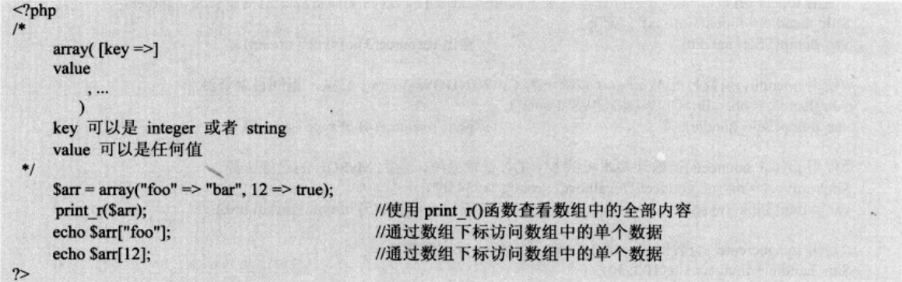

### 对象(Object)

在PHP中，对象和数组一样都是一种复合数据类型。但对象是一种更高级的数据类型。一个对象类型的变量，是由一组属性值和一组方法构成。其中属性表明对象的一种状态，方法通常用来表明对象的功能。本书将用一章的内容介绍对象的使用，这里仅作简要的说明。要初始化一个对象，用new语句将对象实例到一个变量中。对象的声明和使用如下所示：

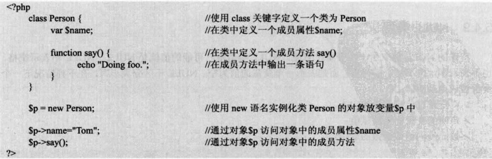

### 资源类型(Resource)

资源是一种特殊类型的变量，保存了到外部资源的一个引用。资源是通过专门的函数来建立和使用的。使用资源类型变量保存有为打开文件、数据库连接、图形画布区域等的特殊句柄。并由程序员创建、使用和释放。任何资源在不需要的时候都应该被及时的释放，如果程序员忘记了释放资源，系统自动启用垃圾回收机制，以避免内存的消耗殆尽。由此原因，很少需要用某些free-result函数来手工释放内存。在下面的实例中，使用相应的函数创建不同的资源变量。如果创建成功返回资源引用赋给变量，创建失败都会返回布尔型false。所以很容易判断资源是否创建成功。如下所示：

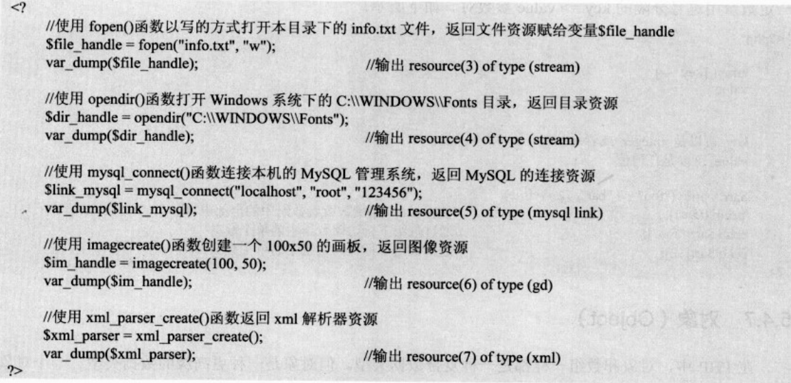

用户虽然无法获知某个资源的细节，但某些函数必须引用相应的资源才能工作。例如上例中使用mysq_lconnect()函数创建一个MySQL数据库连接资源，如果需要获取MySQL数据库管理系统的信息、选择数据库，以及执行SQL语句等操作，所使用的函数都必须对此资源进行引用。

### NULL类型

特殊的NULL值表示一个变量没有值，NULL类型唯一可能的值就是NULL，NULL不表示空格，也不表示零，也不是空字符串，而是表示一个变量的值为空。NULL不区分大小写，在下列情况下一个变量被认为是NULL：

* 将变量直接赋值为NULL.
* 声明的变量尚未被赋值。
* 被unset()函数销毁的变量。

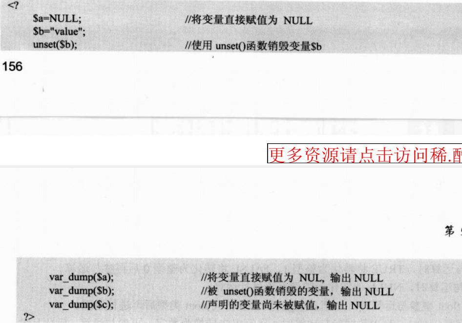

### 伪类型介绍

伪类型并不是PHP语言中的基本数据类型。只是因为PHP是弱类型语言，所以在一些函数中，一个参数可以接收多种类型的数据，还可以接收别的函数作为回调函数使用。为了确保代码的易读性，在本书中介绍一些伪类型的使用。在本书中常用的伪类型有如下几种。

* mixed：说明一个参数可以接受多种不同的（但并不必须是所有的）类型。例如gettype0）可以接受所有的PHP类型，str-replace（）可以接受字符串和数组。
* number：说明一个参数可以是integer或者float.
* callback：有些诸如call user function（）或usort）的函数接受用户自定义的函数作为一个参数。
  callback函数不仅可以是一个简单的函数，它还可以是一个对象的方法，包括静态类的方法。一个PHP函数用函数名字符串来传递。可以传递任何内置的或者用户自定义的函数，除了array()，echo()，empty()，eval()，exit()，isset()，list()，print()和unset()。

### 数据类型之间相互转换

类型转换是指将变量或值从一种数据类型转换成其他数据类型。转换的方法有两种：一种是自动转换；另一种是强制转换。在PHP中可以根据变量或值的使用环境自动将其转换为最合适的数据类型，也可以根据需要强制转换为用户指定的类型。因为PHP在变量定义中不需要（或不支持）明示的类型定义，变量类型是根据使用该变量的上下文所决定的。所以在PHP中如果没有明确地要求类型转换，都可以使用默认的类型自动转换。

**1.自动类型转换**

**每一个数据都有它的类型，具有相同类型的数据才能彼此操作**。在PHP中，自动转换通常发生在不同数据类型的变量混合运算时，若参与运算量的类型不同，则先转换成同一类型，然后再进行运算。通常只有四种标量类型（integer，float，string，boolean）才使用自动类型转换。注意，这并没有改变这些运算数本身的类型，改变的仅是这些运算数如何被求值。自动类型转换虽然是由系统自动完成的，但在混合运算时，自动转换要遵循转换按数据长度增加的方向进行，以保证精度不降低。规则如图5-4所示。

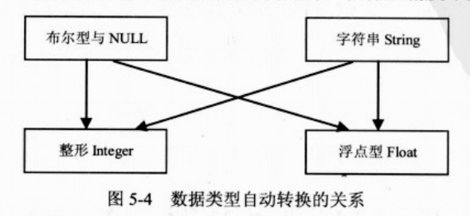

* 有布尔型值参与运算时，TRUE将转化为整型1，FALSE将转化为整型0后再参与运算。
* 有NULL值参与运算时，NULL值转化为整型0再进行运算。
* 有integer型和float型参与运算时，先把interger型变量转成float类型后再进行运算。
* 有字符串和数字型（integer，float）数据参与运算时，字符串先转换为数字，再参与运算。转化后的数字是从字符串开始的数值型字符串，如果在字符串开始的数值型字符串不带小数点则转为integer类型数字。如果带有小数点则转为float类型数字，例如：字符串"123abe"转为整数123，字符串"123.45abe"转为浮点数123.45，字符串"abc"转为整数0。

以下是PHP自动类型转换的一个例子，是使用加号“+”运算。如果任何一个运算数是浮点数，则所有的运算数都被当成浮点数，结果也是浮点数。否则运算数会被解释为整数，结果也是整数。如下所示：

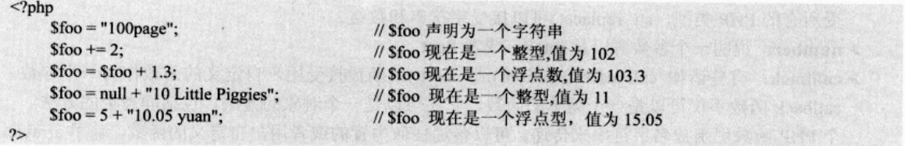

**2.强制类型转换**

PHP中的类型强制转换和其他语言很类似，在要转换的变量之前加上用括号括起来的目标类型，也可以使用具体的转换函数，即 intvalo）、floatval0和strvalo）等，或是使用setType0函数转换类型。在变量之前加上用括号括起来的目标类型如下代码所示：

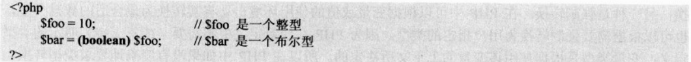

在上例的括号内允许有空格和制表符，在括号中允许的强制转换如下所示：

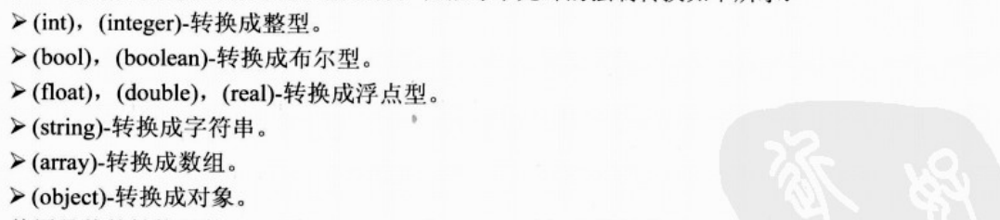

使用具体的转换函数intval()、floatval()和strval()转换变量的类型。函数intval()用于获取变量的整数值，函数floatval()用于获取变量的浮点值，函数strval()用于获取变量的字符串值。如下所示：

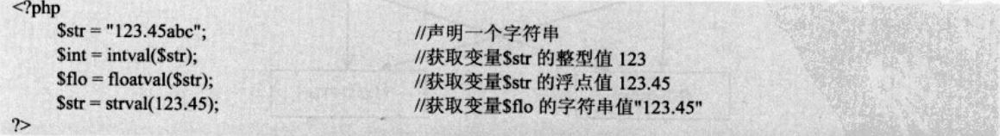

以上两种类型的强制转换都没有改变这些被转换变量本身的类型，而是通过转换将得到的新类型的数据赋值给新的变量，原变量的类型和值不变。如果需要将变量本身的类型改变成其他类型，可以使用Type）函数来设置变量的类型。如下所示：

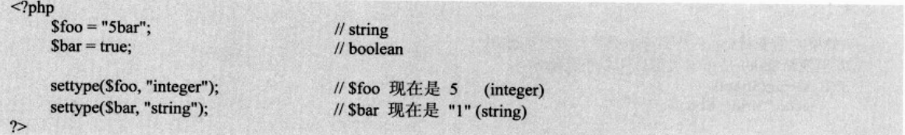

**3.类型转换细节**

整数转化为浮点型，由于浮点型的精度范围远大于整型，所以转化后的精度不会改变。浮点型转化为整型，将自动舍弃小数部分，只保留整数部分。如果一个浮点数超过整型数字的有效范围，其结果将是不确定的。整型的最大值约是2.147e9，当字符串转化为数字时，转化后的数字是从字符串开始部分的数值型字符串，数值型字符串包括用科学计数法表示的数字。NULL值转为字符串，为空字符“"。

**4.变量类型的测试函数**

在上面的介绍中我们使用函数var-dumpO查看某个表达式的值和类型，在PHP中有很多可变函数用来测试变量的类型。如果只是想得到一个易读懂的类型的表达方式用于调试，可以使用gettype()函数，这个函数必须先给它传递一个变量。它将确定变量的类型并且返回一个包含名称的字符串，如果变量的类型不是前面所讲的八种标准类型之一，该函数就会返回"unknown type"，但要查看某个类型，不要用gettype()函数，而用is_type函数。是PHP提供的一些特定类型的测试函数。每个函数都使用一个变量作为其参数，并返回true或false。这些函数如下所示。

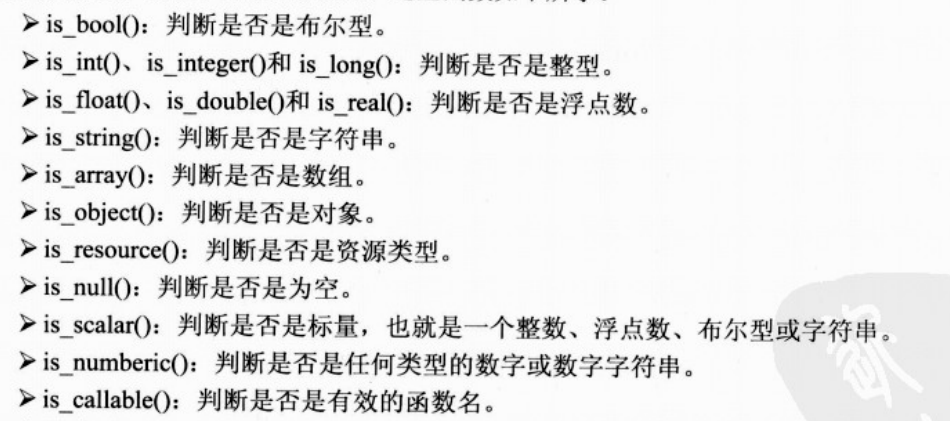

变量类型测试函数使用如下所示：

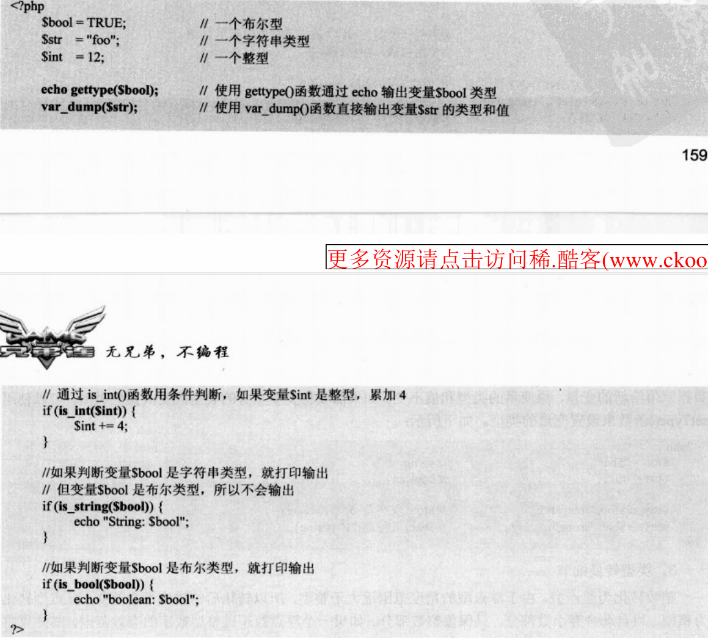

## 常量

常量是一个简单值的标识符。如同其名称所暗示的，在脚本执行期间一个常量一旦被定义，就不能再改变或者取消定义。常量的作用域是全局的，不用管作用域就可以在脚本的任何地方声明和访问常量。另外，虽然常量和变量都是PHP的存储单元，但常量只能包含标量数据（boolean，integer，float和string）。

### 常量的定义和使用

声明常量和声明变量的方式不同，在PHP中是通过使用define（）函数来定义常量的。常量的命名与变量相似，也要遵循PHP标识符的命名规则。常量默认为大小写敏感，按照惯例常量标识符总是大写的，但是不要在常量前面加上"$”符号。define()函数的格式如下：

~~~php
boolean define（string name，mixed value[，bool case insensitive]）;    //常量定义函数
~~~

此函数的第一个参数为常量名，第二个参数为常量的值或是表达式，第三个参数是可选的，如果把第三个参数case insensitive设为TRUE，则常数将会定义成不区分大小写。预设上是区分大小写的。如果只想检查是否定义了某常量，用defined()函数。常量的声明与使用如下所示：

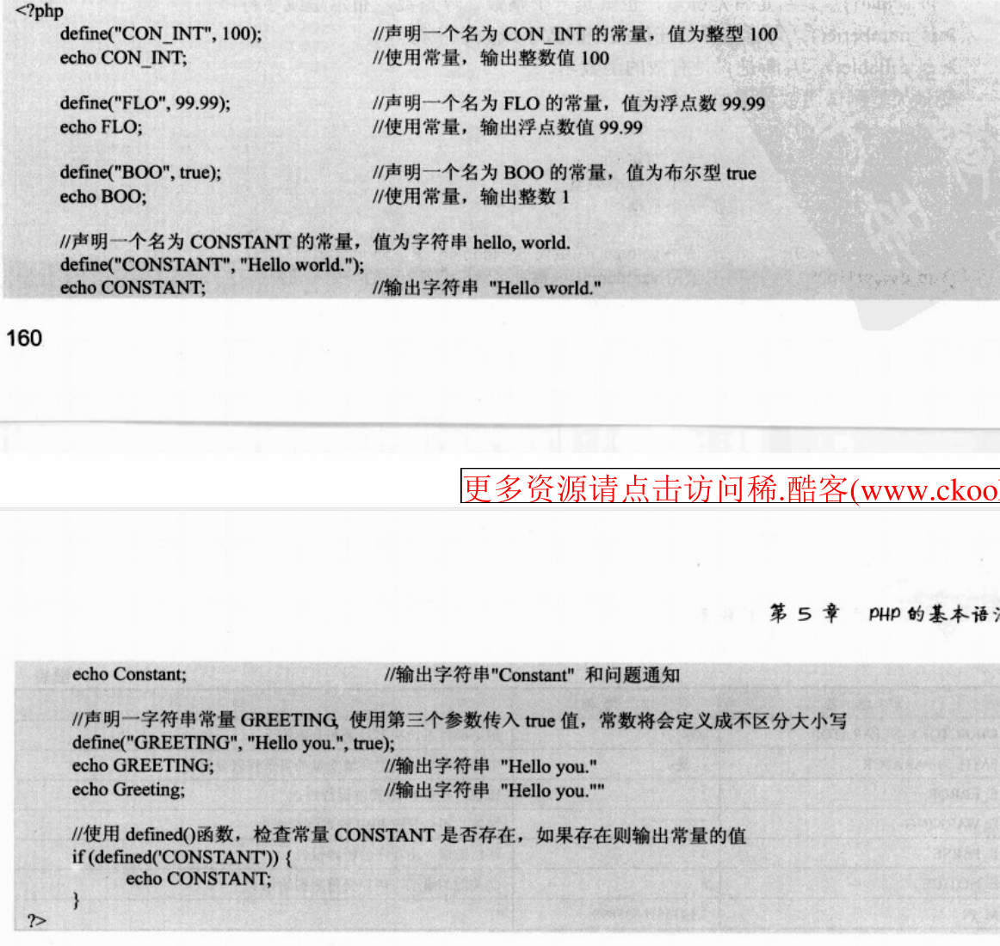

### 常量和变量

常量和变量都是PHP的存储单元，但名称、作用域以及声明方式都有所不同，以下是常量和变量的不同点：

* 常量前面没有美元符号（$）
* 常量只能用define（）函数定义，而不能通过赋值语句。
* 常量可以不用理会变量范围的规则而在任何地方定义和访问。
* 常量一旦定义就不能被重新定义或者取消定义。
* 常量的值只能是标量。

### 预定义常量

在PHP中，除了可以自己定义常量外，还预定义了一系列常量，可以在程序中直接使用来完成些特殊功能。不过很多常量都是由不同的扩展库定义的，只有在加载了这些扩展库时才会出现，或者动态加载后，或者在编译时已经包括进去了。这些预定义的常量有多种不同的开头，决定了各种不同的类型。有些常量会根据它们使用的位置而改变。例如 LINE-的值就依赖于它在脚本中所处的行来决定。

这些特殊的常量不区分大小写。一些常见的预定义常量如表5-3所示。

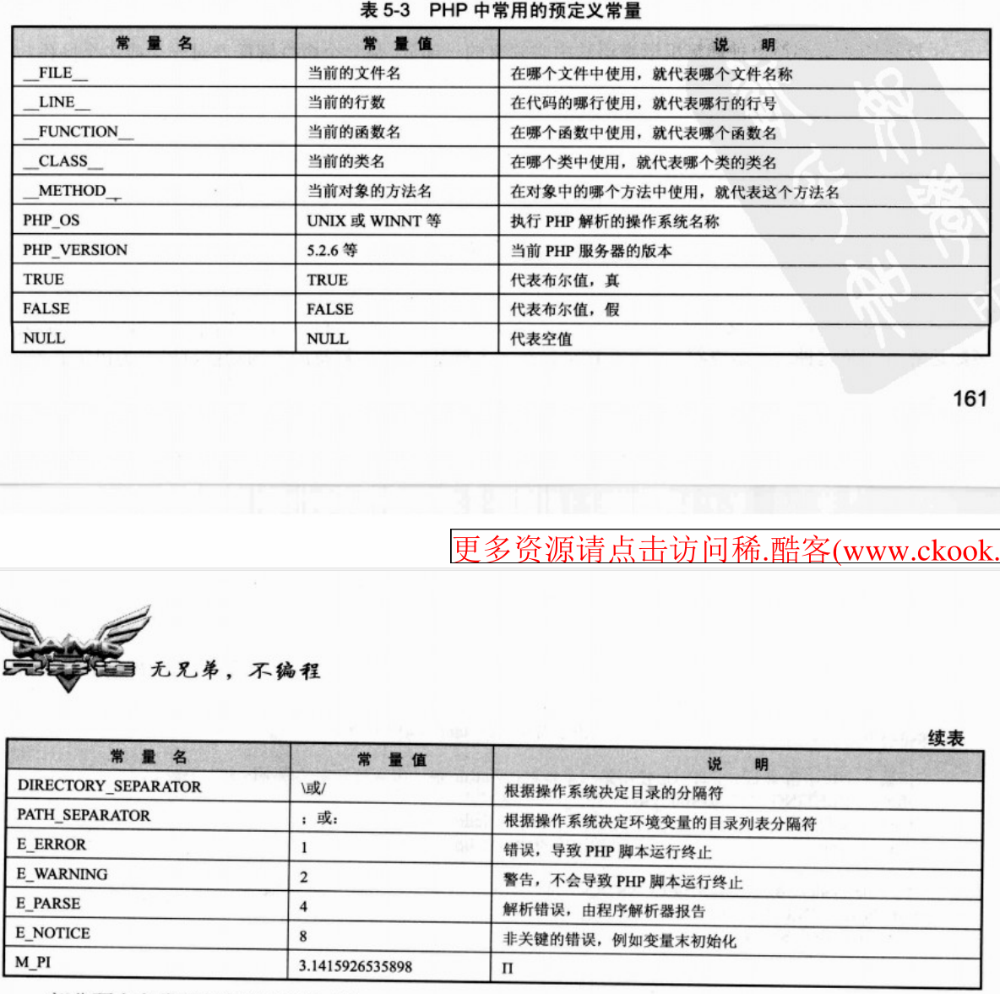

部分预定义常量的简单使用如下：

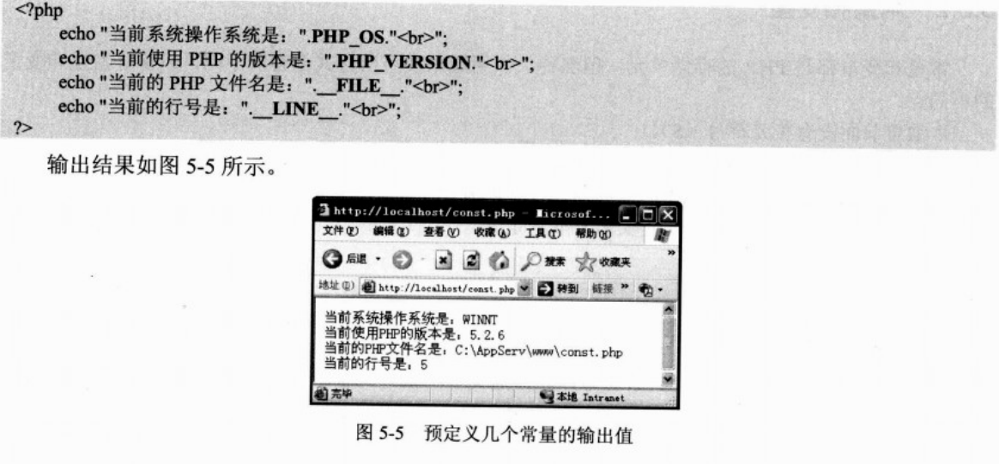

## PHP中的运算符

运算符和变量都是每种计算机语言语法中必须有的一部分，是一个命令解释器对一个或多个操作数
（变量或数值）执行某种运算的符号，也称操作符，如图5-6所示。

如图5-6所示，可以根据操作数的个数分为一元运算符、二元运算符、三元运算符。一元运算符，只运算一个值，例如！（取反运算符）或+（加一运算符），二元运算符可以运算两个值，PHP支持的大多数运算符都是这种二元运算符。三元运算符只有一个就是？：。按运算符的不同功能可以分为以下几类。

* 算术运算符
* 字符串运算符
* 赋值运算符
* 比较运算符
* 逻辑运算符
* 位运算符
* 其他运算符

### 算术运算符

算术运算符是最常用的符号，就是常见的数学操作符，用来处理简单的算术运算。包括加、减、乘、除、取余等。PHP中的算术运算符如表5-4所示。

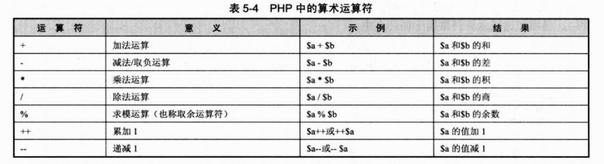

在这里重点介绍一下%、++和-三个算术运算符的使用。求模运算符“%”也称取余运算符，在做求模运算时首先会将%运算符两边的操作数转换为整型，然后返回第一个操作数除以第二个操作数后所得到的余数。在程序开发时使用求模运算符通常有两个目的，第一个是做整除运算，例如在计算闰年时，能被4整除并且不能被100整除，或者能被400整除的就是闰年。使用求模运算符的另一个目的，让输入的数不超过某个数的范围。例如，让任意一个随机数在10以内，就可以让这个随机数和10取余，得到的余数就永远不会超过10，求模运算符的使用如下所示：

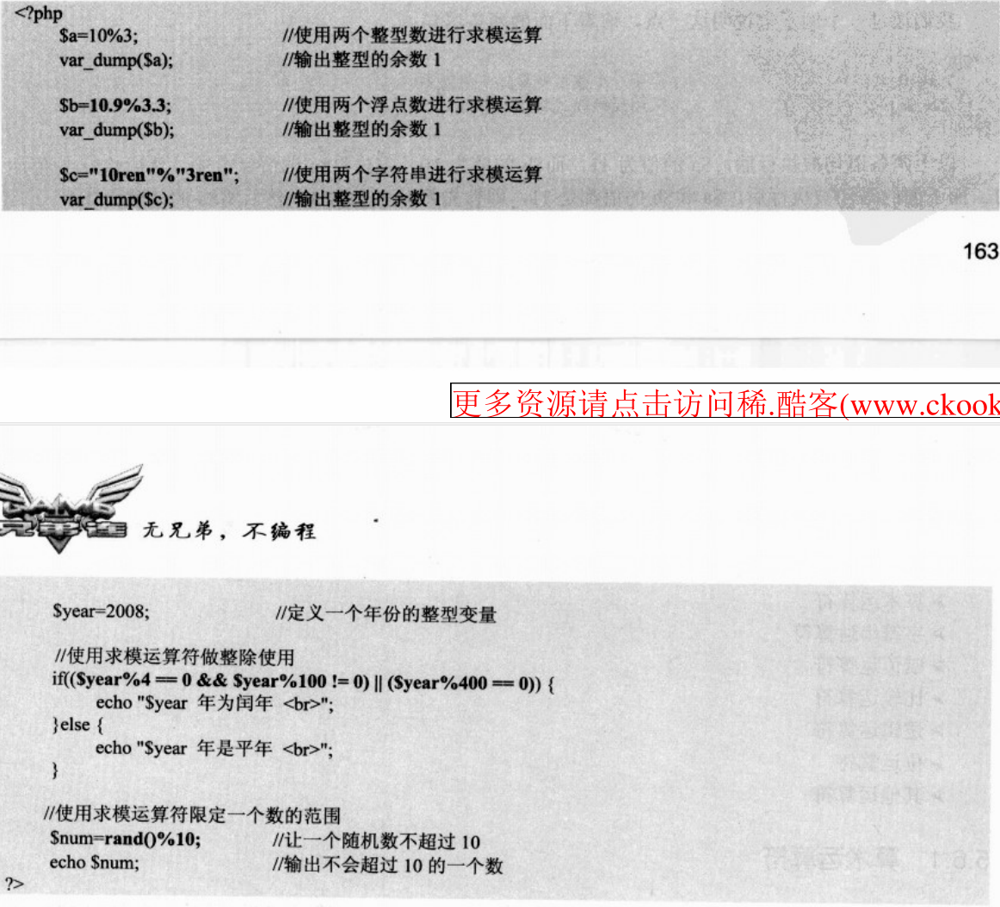

在编程中，最常见的运算是对一个变量进行加1或减1的操作，前面介绍了如何使用赋值运算符修改变量，也可以使用下面要讲到的+=运算符递增变量的值。还可以用-运算符递减变量的值。PHP也提供了另外两个不寻常的算术运算符来执行递增和递减任务，它们分别称为递增和递减运算符，即++和--。递增和递减运算符常用于循环之中。

递增和递减运算符是一元运算符，这两个运算符并不只是递增和递减的另一个选项，在进一步应用PHP的过程中，就可以看出它们的价值了。例如，下面的语句完成的任务都是一样的：

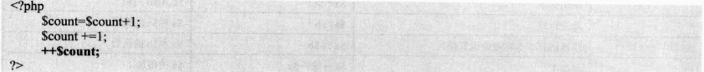

这3个语句都给变量Scount递增1，最后一种形式使用了递增运算符，显然是最简洁的一种。这个运算符的操作不同于前面介绍的其他运算符，因为它直接修改其操作数的值。表达式的结果是递增变量的值，再在表达式中使用已递增的值。

递增和递减运算符都可以在变量的前面使用（前缀模式），也可以在变量的后面使用（后缀模式）。这样就决定了变量是先运算后使用，还是先使用再运算，如表5-5所示。

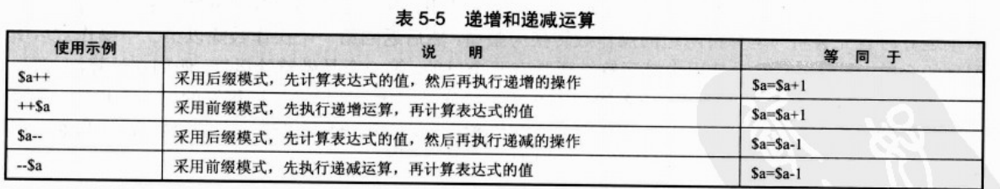

我们通过一个例子来说明这一点，请看下面的两条语句：

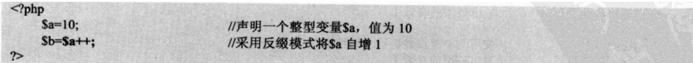

以上两条语句被执行后，\$a的值为11，而$b的值为10，首先将\$a的值赋给\$b，然后将\$a的值加1，而下面的语句被执行后，\$a和\$b的值都是11，即首先将\$a的值加1，然后将\$a的值赋给\$b。

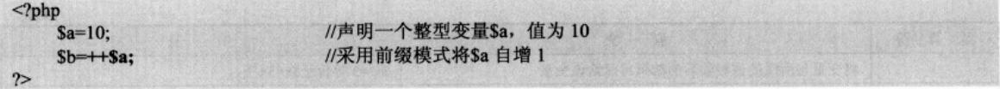

下面的程序说明了前缀模式和后缀模式之间的区别，如下所示：

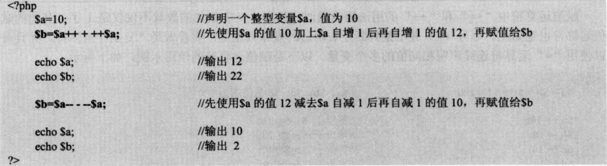

### 字符串运算符

在PHP中字符串运算符只有一个，是英文的句号（".''），也叫做连接运算符。是一个二元运算符，它返回其左右参数连接后的字符串。这个运算符不仅可以将两个字符串连接起来，变成合并的新字符串。也可以将一个字符串和任何标量数据类型相连接，合并成的都是新的字符串。

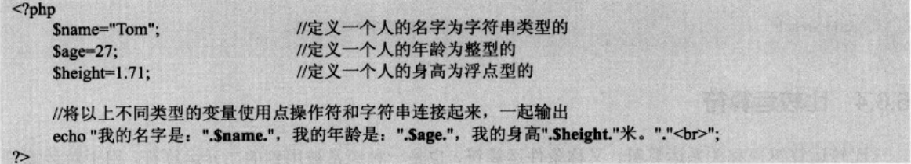

### 赋值运算符

赋值运算符也是一个二元运算符，它左边的操作数必须是变量，右边可以是一个表达式。是把其右边表达式的值赋给左边变量，或者说是将原表达式的值拷贝到新变量中。前面已经接触了一个基本的赋值运算符（=），这个符号总是用做赋值操作符，其读法为“被设置为”或“被赋值”。除了这个基本的赋值运算符外，还有一些复合赋值运符，如表5-6所示。

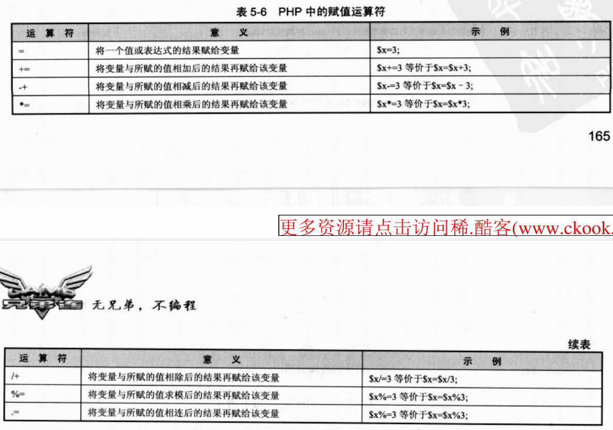

赋值运算符中“+=”和“++”的用法极为类似，使用“+=”累加的数就不仅仅是1了，其他的赋值运算符也是如此。等号(=)并不是判断左右两边的操作数相等，要看做是“复制”运算符，并且可以使用“”运算符连续声明相同值的多个变量。以下是赋值运算符的使用示例，如下所示：

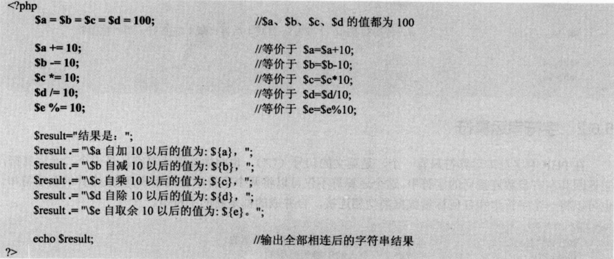

### 比较运算符

比较运算符也称关系运算符，又称条件运算符，也是一种经常被用到的二元运算符，用于对运算符两边的操作数进行比较。比较运算符的结果只能是布尔值，如果比较的关系为真，则结果为TRUE，否则结果为FALSE，表5-7列出了PHP的比较运算符。

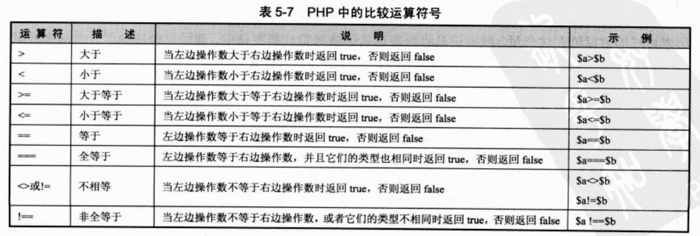

比较运算符经常被用于if条件和while循环等流程控制语句中，用来判断程序执行的条件。需要注意的是，在PHP中提供了一个等号（=）的赋值运算符，两个等号（==）和三个等号的比较运算符定不要将比较运算符“\==”误写成“="，一旦书写有误，程序并不是出现错误提示用户修改。因为“="也是一个合法的运算符，误当做比较运算符使用时，将会根据被赋的值返回真还是假，并不是比较判断的结果，不容易被发现。

比较运算符“\=\==”和“==”的区别在于，当使用“\==”运算符进行比较其两边的操作数时，它只关心参与比较的两个操作数的“值”是否相等，而无论类型是否相同。实际上“\==”是先将两个操作数自动转为相同类型，然后再进行比较，这是非常有效而且简便的方式。如果不光是比较两个操作数的内容，而且还要比较两个操作数的类型也要相同，这时这种严格的比较就可以使用PHP中提供的全等比较运算符“\=\==”，一些比较运算符的简单使用示例如下所示：

### 逻辑运算符

逻辑运算用来判断一件事情是“对”的还是“错”的，或者说是“成立”还是“不成立"。逻辑运算符只能操作布尔型数值。处理后的结果值也是布尔型数值。经常使用逻辑运算符把各个运算式连接起来组成一个逻辑表达式，即通过逻辑运算符来组合多个条件，并返回逻辑条件的布尔型结果。在表5-8中列出了PHP中的逻辑运算符及示例说明。

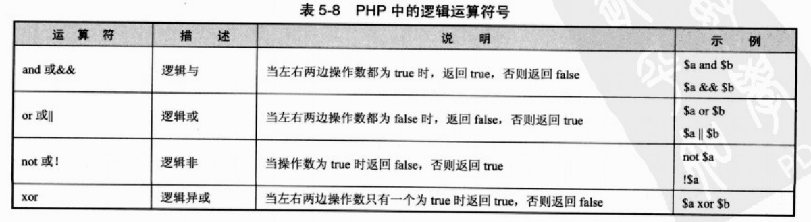

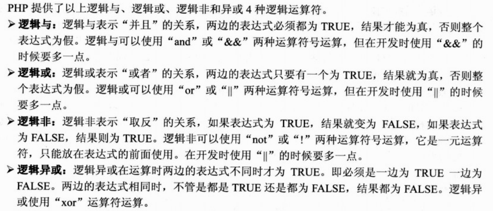

这四种逻辑运算符虽然只能操作boolean类型的值，但很少直接操作boolean值。通常都是使用条件运算符（>、<、==等）比较后的TRUE或FALSE的结果，再使用这些逻辑运算符连接起来做逻辑判断，或者和一些返回布尔型函数一起使用。它们也经常被用于if条件和while循环等流程控制语句中。

每种逻辑运算符可以单独使用，也可以在一个表达式中使用多个，也可以将多个不同逻辑运算符混合在一起使用，使用括号来指定优先级。逻辑运算符的一些简单应用如下所示：

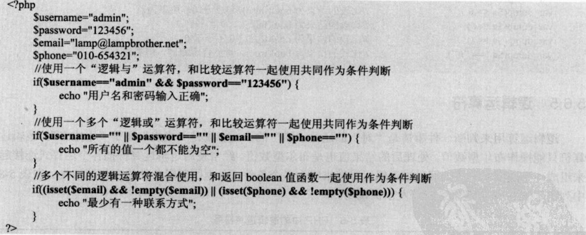

### 位运算符

任何信息在计算机中都是以二进制的形式保存的，位运算符允许对整型数中指定的位进行置位。如果左右参数都是字符串，则位运算符将操作字符的ASCI值，浮点数也会自动转换为整型再参与位运算。位运算用于对操作数中的每一个二进制位进行运算，包括位逻辑运算符和位移运算符，没有借位和进位，如表5-9所示。

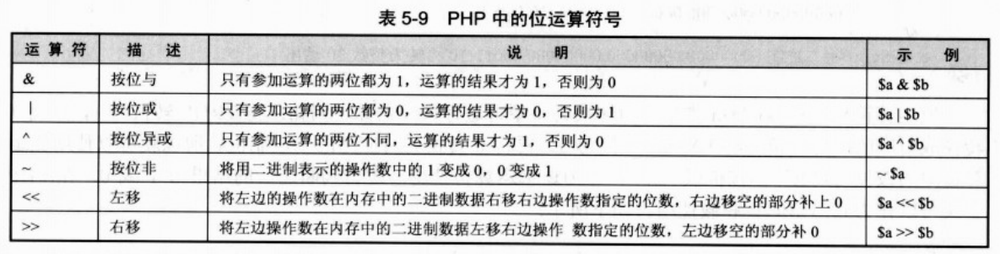

位运算符还可与赋值运算符相结合，进行位运算赋值操作。如：

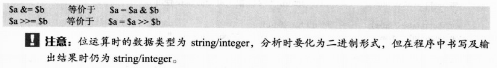

位运算虽然用于对操作数中的每一个二进制位进行运算，可以完成一些底层的系统程序设计。但是在程序开发时很少用到这些位运算，因为使用PHP程序很少参与到计算机底层的技术。在这里重点介绍两个位运算符“&"和"|"

**1.按位与(&)**

规则是参加运算的两运算量相应位均为1时该位为1，否则为0，即0&0=0；0&1=0；1&0=0；1&1=1；如下所示：

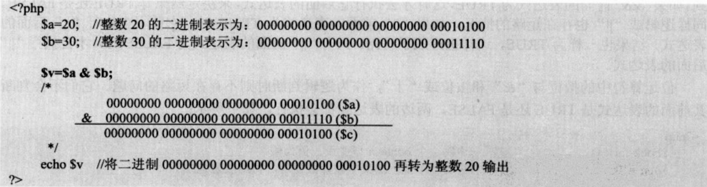

**2.按位或(|)**

规则是参加运算的两运算量相应位有一位为1时该位为1，否则为0。0|0=0；0|1=1；1|0=1；1|1=1；如下所示：

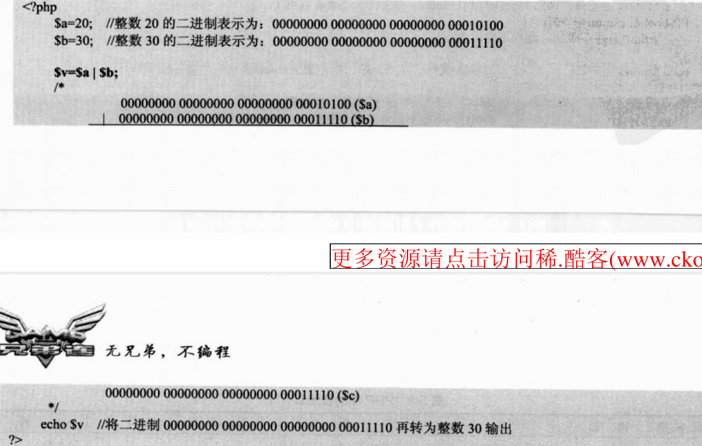

位运算符也可将boolean类型的值转换为整型再进行按位运算。例如：将TRUE转换为1，再将1转换成对应的二进制位。将FALSE转换为0，再将0转换为对应用的二进制位。所以就可以使用位运算符中的按位与“&”和按位或“|"，作为逻辑运算符使用。逻辑判断之后的结果为1或0，在PHP中又可以作为布尔型的真和假使用。如下所示：

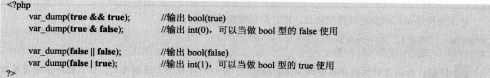

逻辑判断是我们在开发时必不可少的应用，现在有两种符号可以作为逻辑判断使用，那么，在开发时使用哪种会比较好呢？其实不光是逻辑判断有两种方式，在以后课程的学习中，也有很多重复的方式用来完成同样的功能，例如for和while结构都可以用来完成同样的循环功能。如果能找到它们之间的区别，就会知道在什么情况下，选择相同方式中的哪一种方式应用效果会更好。所以运算符号“&&"与“&”，还有"||"与“|”作为逻辑判断时，之间是有区别的。

逻辑运算符中的逻辑与“&&”和逻辑或"||"，存在短路的问题。例如，逻辑与“&&"两边的布尔类型操作数都为TRUE时，结果才能为真。如果运算符"&&”前面的布尔类型操作数为FALSE，它就不去执行“&&"后面的表达式，结果也一样为FALSE，这样就形成了短路，“&&”后边的表达式没有执行到。如果"&&"前面的表达式为TRUE，这时才去执行它后面的表达式，来决定结果是TRUE还是FALSE。同样逻辑或"||"也存在短路的情况，如果"|"前面的表达式为TRUE时，它就不去执行"||"后面的表达式，结果也一样为TRUE，这样也形成了短路。只有"|"前面的表达式为FALSE时，才会执行"||"后面的表达式。

位运算符中的按位与“&”和按位或“|"，作为逻辑判断时则不存在短路的问题。它们不会判断其前面的表达式是TRUE还是FALSE，两边的表达式都会执行。如下所示：

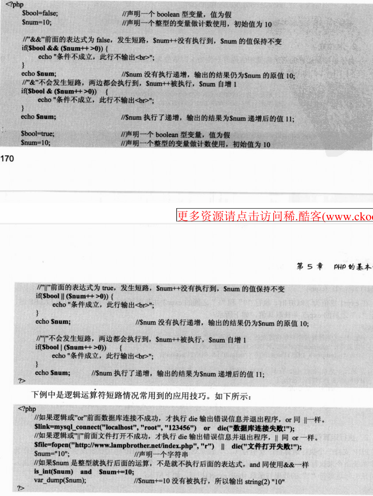

### 其他运算符

在PHP中除了可以使用以上介绍过的运算符外，还有一些其他的运算符用于某些特定功能的使用，如表5-10所示。

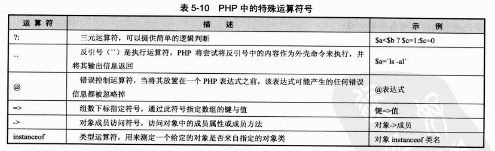

我们在这里主要介绍一下上表中前三个运算符，其余三个和在上表中没有列出来的一些运算符，在后面的章节中遇到时都会详细讲解。

**1.三元运算符(?:)**

"？：”可以提供简单的逻辑判断，在PHP中是唯一的三元运算符。类似于条件语句"if..else...，"但三元运算符使用更加简洁。其语法格式如下所示：

~~~php
（exprl）？（expr2）：（expr3）	//三元运算符
~~~

在exprl求值为TRUE时，执行“？"和“："之间的expr2并获取其值，在exprl求值为FALSE时，执行“：”之后的expr3并获取其值。如下所示：

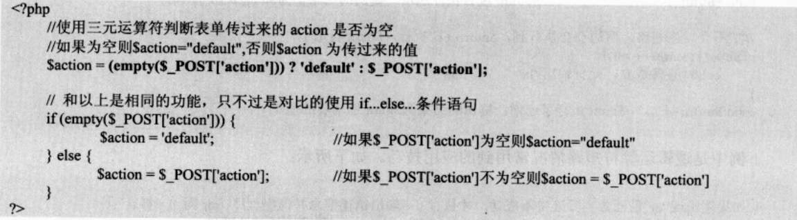

**2.执行运算符(``)**

PHP支持一个执行运算符：反引号（\`\`），注意这不是单引号！PHP将尝试将反引号中的内容作为操作系统命令来执行，并将其输出信息返回（例如，可以赋给一个变量而不是简单地丢弃到标准输出）。使用反引号运算符“`”的效果与函数shell-exec()相同。如下所示：

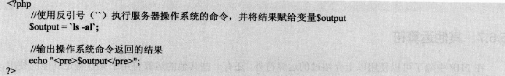

使用执行运算符（"）或是一些函数执行操作系统命令时，所执行的命令是根据操作系统决定的，不同的操作系统之间命令有所不同。为了程序可以跨平台，在开发时能使用PHP函数完成的功能就不要去调用操作系统命令来完成。

**3.错误控制运算符**

PHP支持一个错误控制运算符：@。当将其放置在一个PHP表达式之前，该表达式可能产生的任何警告信息都被忽略掉。使用错误控制运算符@时要注意，它只对表达式有效。对新手来说一个简单的规则就是：如果能从某处得到值，就能在它前面加上@运算符。例如，可以把它放在变量、函数调用，以及常量等之前。不能把它放在函数或类的定义之前，也不能用于条件结构例如if和foreach等。如下所示：

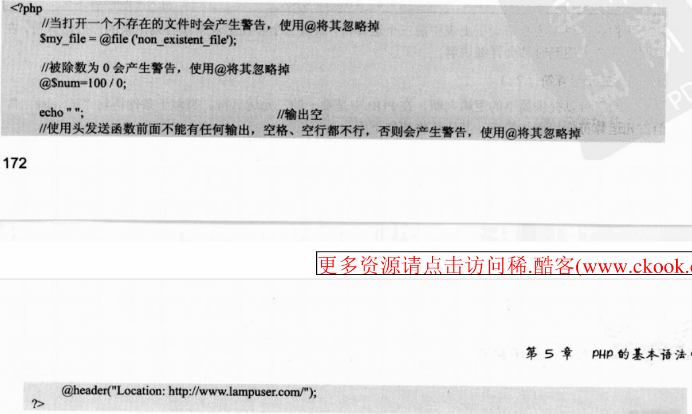

PHP程序在遇到一些错误情况时，都会产生一些警告信息，这些信息对于程序调试是非常有用的。尽量根据这些警告提示信息将遇到的错误解决掉，而不是直接使用@将其屏蔽。如果直接屏蔽掉这些警告信息，只是警告信息不会输出给浏览器，而存在的错误并没有解决。

### 运算符的优先级

所谓运算符的优先级是指在表达式中哪一个运算符应该先计算，就和算术中四则运算时的“先乘除，后加减”是一样的。例如，表达式1+5\*3的结果是16而不是18是因为乘号（\*）的优先级比加号（+）高。必要时可以用括号来强制改变优先级。例如：（1+5）*3的值为18，如果运算符优先级相同，则使用从左到右的左联顺序。下表从高到低列出了运算符的优先级。同一行中的运算符具有相同优先级，此时它们的结合方向决定求值顺序。运算符优先级如表5-11所示。

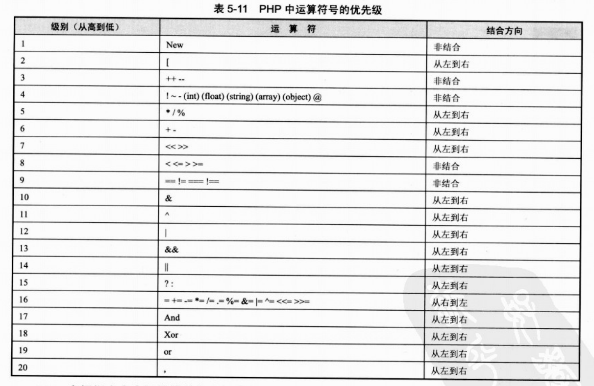

PHP会根据上表中运算符的优先级确定表达式的求值顺序，同时还可以引用小括号"（）"来控制运算顺序，任何在小括号内的运算将最优先进行。在以后的程序开发中尽量使用小括号来强制改变优先级，不用强记上面表格中列出来的优先级顺序。通常使用小括号改变优先级的表达式更加易懂。

## 表达式

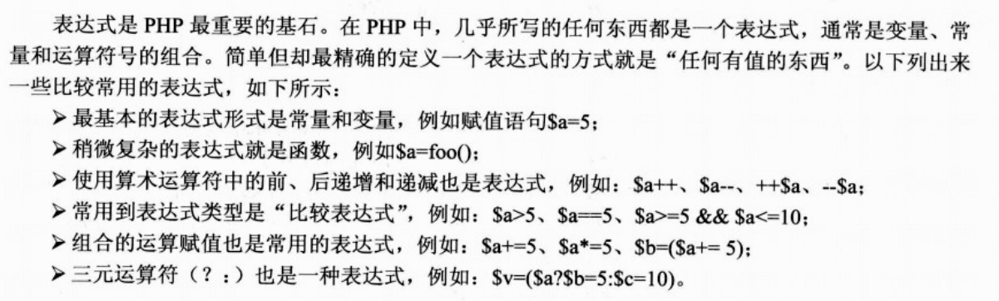

## 小结

熟练掌握本章介绍的基本语法是学习PHP语言的第一步，不管是只有几行的简单代码，还是由几十万条代码开发的大型项目都离不开这些最基本的语法。本章主要介绍了PHP的变量和变量的声明，及数据类型和数据类型之间的转换，还有常量的使用，并详细介绍了PHP中的各种运算符号及表达式的应用。

# 第6章：PHP的语言结构

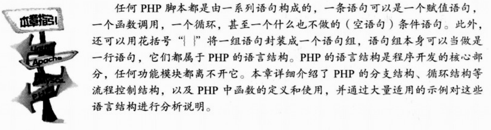

## 流程控制概述

流程控制对于任何一门编程语言来说都是至关重要的，它提供了控制程序步骤的基本手段，是程序的核心部分。可以说，缺少了控制流程，就不会有程序设计语言，因为现在没有哪一种程序只是线性地执行语句序列。程序中需要与用户相互交流，需要根据用户的输入决定执行序列，需要有循环将代码反复执行等，这些都少不了流程控制。在任何一门程序设计语言中，都需要支持满足程序结构化所需要的三基本结构：

* 顺序结构
* 分支结构(选择结构或条件结构)
* 循环结构

在PHP中，为支持这三种结构，提供了实现这三种结构所需的语句。在程序结构中，最基本的就是顺序结构。顺序结构就是语句按出现的先后次序会按照自上而下的顺序执行，在PHP的程序设计语言中，顺序结构的语句主要是赋值语句、输入/输出语句等。所以顺序结构就不必多介绍了。

## 分支结构

顺序结构的程序虽然能解决计算、输出等问题，但不能做判断再选择。对于要先做判断再选择的问题就要使用分支结构，又称为选择结构或者条件结构。分支结构的执行是依据一定的条件选择执行路径，而不是严格按照语句出现的物理顺序。分支结构的程序设计方法的关键在于构造合适的分支条件和分析程序流程，根据不同的程序流程选择适当的分支语句。分支结构适合于带有逻辑或关系比较等条件判断的计算。即程序在执行过程中依照条件的结果来改变程式执行的顺序。满足条件时执行某一叙述块，反之则执行另一叙述块。在程序中使用分支结构可以有以下几种形式：

* 单一条件分支结构
* 双向条件分支结构
* 多向条件分支结构
* 巢状条件分支结构

### 单一条件分支结构(if)

if结构是单一条件分支结构，PHP程序中的语句通常是按其在源代码文件中出现顺序从前到后依次执行的。而if语句用于改变语句的执行顺序，是很多语言，包括PHP在内最重要的特性之一。if语句的基本格式是，对一个表达式进行计算，根据计算结果决定是否执行后面的语句。if语句的格式如下：

~~~php
if（表达式）			//如果在后面加上分号会出现错误
    语句块；		//条件成立则执行的一条语句
~~~

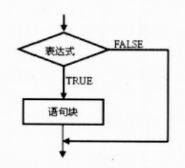

在上面if语句的格式中，它允许按照条件执行代码片段。if后面小括号中的“表达式”就是执行的条件，条件只能是布尔型值。通常是由比较运算符或者逻辑运算符组成的表达式所计算的结果值，或是一些返回布尔型的函数等。如果是传入其他类型的值也会自动转换为布尔型的TRUE或FALSE，如果“表达式”为TRUE，则执行“语句块”，否则不执行。不论结果如何，接着都将执行if后面的语句。可以这么说，是否执行“语句块”取决于“表达式”的结果。"if（表达式）和语句块：”一起组成了完整的if语句，它们并非两条独立的语句。

例如下例中就是if结构的简单使用，如果Sa大于Sb，则以下例子将显示“a大于b"，否则没有任何输出。如下所示：

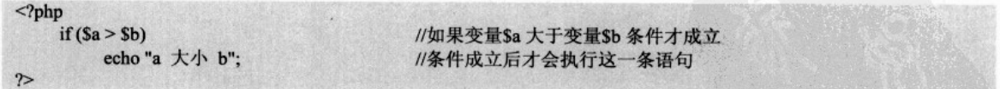

通过使用复合语句（代码块），if语句是否能够控制执行多条语句。代码块是一组用花括号“（）"括起来的多条语句。任何可以使用单条语句的地方，都可以使用语句块。因此，可以像下面这样编写语句:

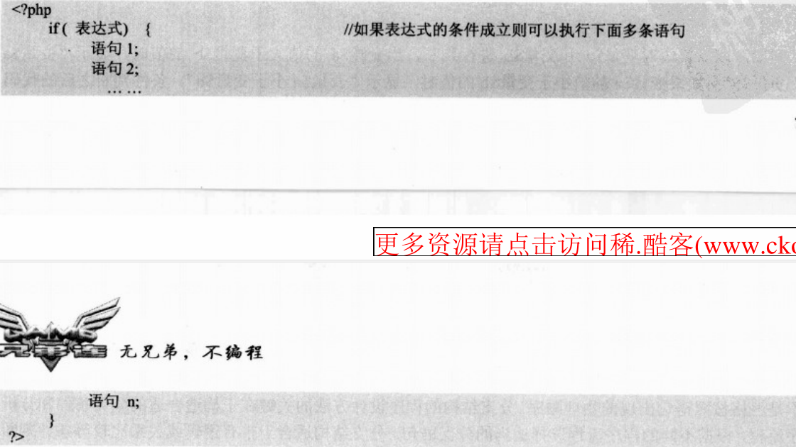

如果是使用if语句控制是否执行一条语句，可以使用花括号括起来，也可以不用。但要想使用if语句能够控制是否执行多条语句，就必须使用花括号括起来形成代码块。例如：已知两个数\$x和\$y，比较它们的大小，使得\$x大于\$y。如果\$x小于$y则调换其值。

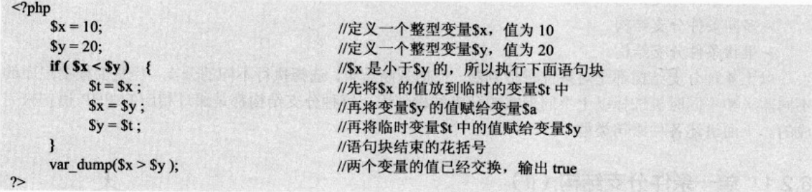

### 双向条件分支结构(else字句)

if语句中也可以包含else子句，经常需要在满足某个条件时执行一条语句，而在不满足该条件时执行其他语句，这正是else子句的功能。else延伸了if语句，可以在if语句中的表达式的值为FALSE时执行语句。这里要注意一点，else语句是if语句的从句，必须和if一起使用，不能单独存在。else语法格式如下所示：

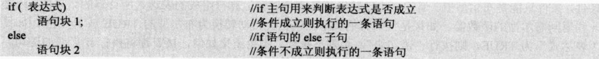

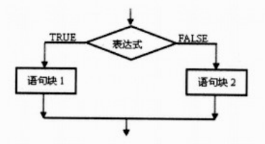

在上面的格式中，如果“表达式”为真，则执行“语句块1”语句；否则执行“语句2”语句。"语句块1”和“语句块2”都可以是复合语句（代码块），如果是复合语句必须使用花括号"｛｝"括起来。语法格式如下所示：

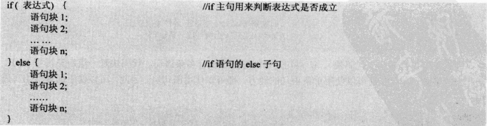

例如，以下代码对变量\$a和变量\$b进行判断，当变量\$a的值大于变量\$b的值时，显示“变量\$a大于变量\$b"，如果变量\$a的值小于变量\$b的值时，显示“变量\$a小于变量\$b"。条件判断之后的代码将继续往下执行，代码如下所示：

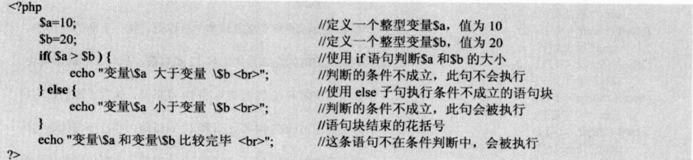

该程序执行后输出结果如下所示：

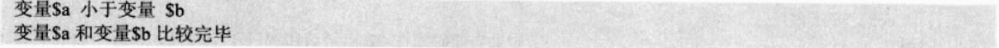

### 多向条件分支结构(elseif子句)

elseif子句，和此名称暗示的一样，是if和else的组合。和else一样，它延伸了if语句，elseif子句会根据不同的表达式值确定执行哪个语句块。在PHP中也可以将elseif分开成两个关键字"else if"来使用。elseif语句的语法格式如下所示：

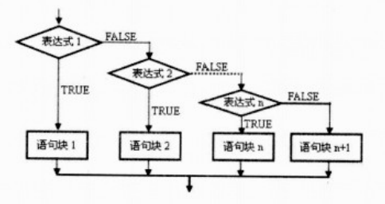

在上面的elseif的语法中，如果第一个“表达式1”为true,则执行“语句块1”语句;如果判断第二个“表达式2”为TRUE，则执行“语句块2”语句；以此类推，判断第n个“表达式n"为TRUE，则执行“语句块n”语句；如果表达式的条件都没有TRUE，则执行else子语中的“语句块n+1"语句，当然最后的else语句也可以省略。

在elseif语句中同时只能有一个表达式为TRUE，即在elseif语句中只能有一个语句块被执行。在开发中这种多向条件分支结构适合对同一个变量的值在不同范围内进行判断，例如下面分时问候的代码，通过获取服务器中当前的时间，并在不同的时间段输出不同的问候。代码如下所示：

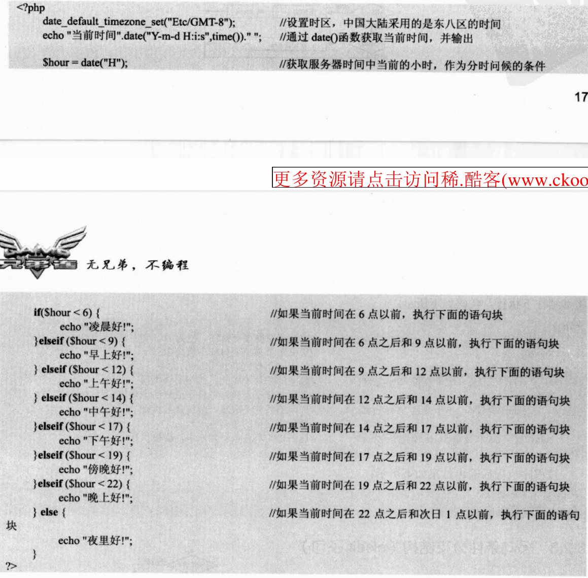

使用elseif语句有一条基本规则，总是优先把包含范围小的条件放在前面处理。如Shour<6和Shour<9两个条件，明显Shours6的范围更小，所以应该先处理Shourc6的情况。使用elseif语句时，一定要先处理包括范围更小的情况。

和前面if语句一样，使用elseif语句控制是否执行一条语句，可以使用花括号括起来，也可以不用。但要想使用elseif语句能够控制是否执行多条语句，也必须使用花括号括起来形成代码块。通常，建议不要省略if，else，elseif后执行块的花括号，即使条件执行体只有一行代码。因为保留花括号会有更好的可读性，而且保留花括号会减少发生错误的可能。

### 多向条件分支结构(switch语句)

switch语句和elseif相似都是一种多向条件分支结构，但if和elseif语句使用布尔表达式或布尔值作为分支条件来进行分支控制：而switch语句则用于测试一个表达式的值，并根据测试结果选择执行相应的分支程序，从而实现分支控制。switch语句由一个控制表达式和多个case标签组成，case标签后紧跟一个代码块，case标签作为这个代码块的标识。switch语句的语法格式如下：

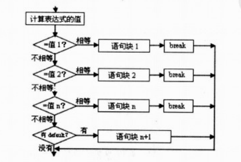

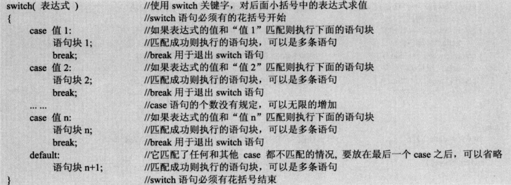

这种分支语句的执行是先对switch后面括号中的“表达式”求值，然后依次匹配case标签后的值1，值2...值n等值，遇到匹配的值即执行对应的执行体；如果所有case标签后的值与“表达式”的值都不相等，则执行default标签后的代码块。在使用switch语句时我们应该注意以下几点：

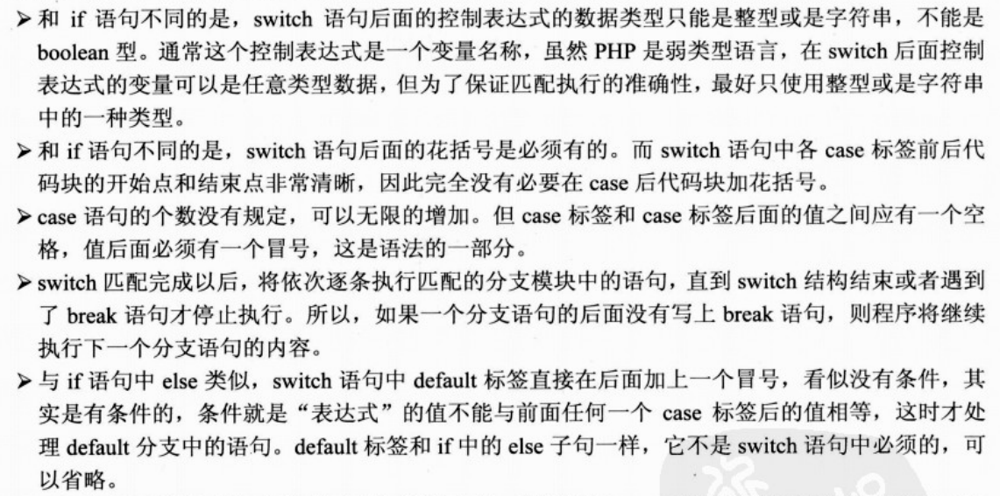

下面两个例子使用两种不同方法实现同样的功能，都是通过date）函数获取服务器端时间格式中的星期值，并将其转换为中文的星期值。一个用一系列的elseif语句，另一个用switch语句。如下所示：

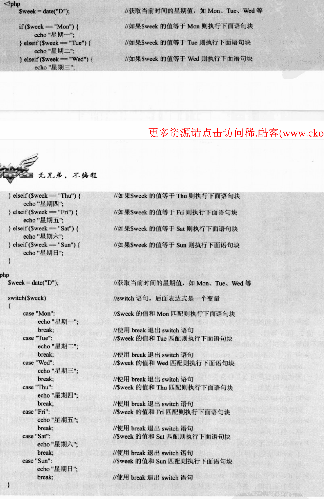

可以看到switch语句和具有同样表达式的一系列的elseif语句相似，但用switch使程序更清晰，可读性更强。两种多路分支结构的使用时机：如果是通过判断一个“表达式的范围”进行分支处理，就要选择使用一系列的elseif语句，例如上一节中的分时间候就是对小时变量进行范围判断，而采用的elseif语句。但很多场合下需要把同一个“变量（或表达式）与很多不同的值比较”，并根据它等于哪个值来执行不同的代码，这正是switch语句的用途。在switch语句中条件只求值一次并用来和每个case语句比较。在elseif语句中条件会再次求值。如果条件比一个简单的比较要复杂得多或者在一个很多次的循环中，那么用switch语句可能会快一些。

在使用switch语句时，还可以匹配多个值时执行同一个语句块。只要将case中的语句设置为空，最重要的是不要加break语句，这样就将控制转移到了下一个case中的语句。例如，当和值0、1或2任意一个匹配上，都会执行相同的语句块。如下所示：

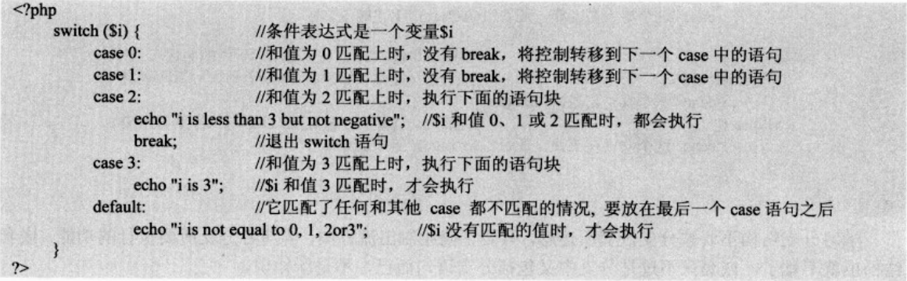

### 巢状条件分支结构

巢状式条件分支结构就是if语句的嵌套，即指if或else后面的语句块中又包含if语句。if语句可以无限层地嵌套在其他if语句中，这给程序的不同部分的条件执行提供了充分的弹性。是程序设计中经常使用的技术。语法格式如下所示：

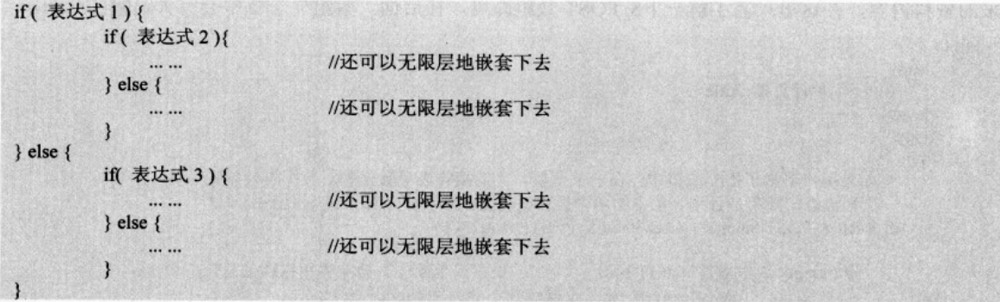

当流程进入某个选择分支后又引出新的选择时，就要用嵌套的if语句。对于多重嵌套if，最容易出现就是if与else的配对错误，嵌套中的if与else的配对关系非常重要。从最内层开始，else总是与他上面相邻最近的不带else的if配对。在使用if语句的嵌套时，避免i与else配对错位的最佳办法是加大括号，同时，为了便于阅读，使用适当的缩进。

例如，输入一个人的年龄，判断他是退休了还是在工作。分析一下，男士60岁退休，女士55岁退休。因此要判断一个人是否已退休，首先判断性别，然后判断年龄，才能得出正确的结论。代码如下所示：

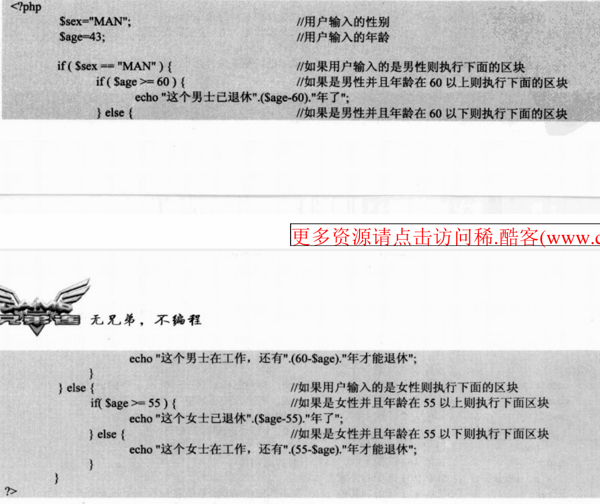

学习分支结构不要被分支嵌套所迷惑，只要正确绘制出流程图，弄清各分支所要执行的功能，嵌套结构也就不难了。嵌套只不过是分支中又包括分支语句而已，不是新知识。

### 条件分支结构应用实例（简单计算器）

这一节主要是通过一个简单的计算器实例来应用上几节中介绍过的分支结构，并没有实用价值。本例中使用HTML代码编写一个用户操作的计算器界面，使用PHP代码的分支结构判断用户操作的各种情况、计算用户输入的值，并动态输出计算结果。其中使用了外部全局数组\$_POST获取从表单中传过来的资料内容，在这里只需了解一下$_POST数组即可，在后面“数组”一章中会有大篇幅的介绍。

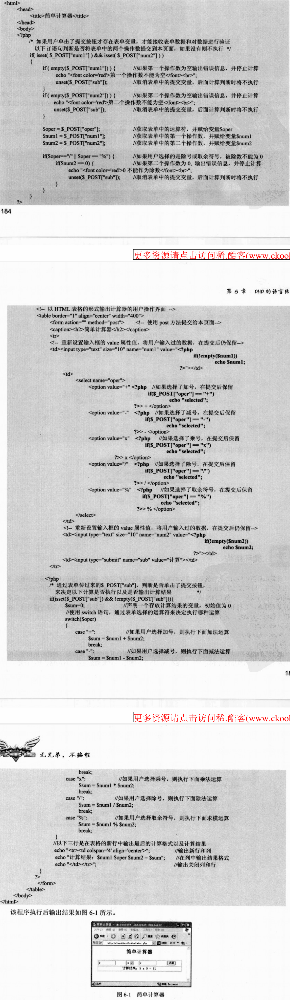

## 循环结构

计算机最擅长的功能之一就是按规定的条件，重复执行某些操作。循环结构可以减少源程序重复书写的工作量，用来描述重复执行某段算法的问题，这是程序设计中最能发挥计算机特长的程序结构。循环结构可以看成是一个条件判断语句和一个向回转向语句的组合。其特点是，在给定条件成立时，反复执行某程序段，直到条件不成立为止。给定的条件称为循环条件，反复执行的程序段称为循环体。在PHP中提供三种循环，如下所示：

* while循环
* do-while循环
* for 循环

以上三种循环可以用来处理同一问题，一般情况下它们可以互相替换。常用的三种循环结构学习的重点在于弄清它们的相同与不同之处，以便在不同场合下使用，这就要清楚三种循环的格式和执行顺序，将每种循环的流程图理解透彻后就会明白如何替换使用，如把while循环的例题用for语句重新编写一个程序，这样能更好地理解它们的作用。

特别要注意在循环体内应包含趋于结束的语句（即循环变量值的改变），否则就可能成了一个死循环，这是初学者的一个常见错误。所以使用循环时一定要有一个停止的条件，根据循环停止的条件不同，在PHP中提供了两种类型的循环语句：

* 一种是计数循环语句，通常使用for循环语句完成。
* 另一种是条件型循环语句，通常使用while或是do-while循环语句完成。

计数循环语句是指按指定的次数执行循环，例如在游戏中指定一个机器人走100步停止，就只反复执行走路的代码100次：所谓的条件型循环语句是指遇到特定的条件才停止循环，循环的次数是不固定的。例如，在游戏中指定一个机器人走路，当遇到障碍物时停止，这样循环走路的代码就不是固定次数的执行。

### while语句

while语句也叫while循环，是PHP中最简单的循环类型。与if语句相同，while语句也需要设定一个布尔型条件，当条件为真时，它不断地执行一个语句块，直到条件为假为止。if语句只执行后续代码一次，而while循环中只要条件为真，就会不断地执行后续的代码。while循环通常用于控制循环次数未知的循环结构。while语句的格式如下：

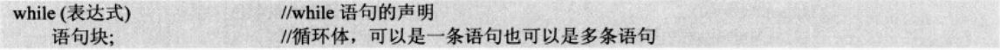

其中while语句中“表达式”的计算结果一定要是布尔型的TRUE值或FALSE值，如果是其他类型的值也会自动转换为布尔类型的值。通常这个表达式是使用比较运算符或者逻辑运算符计算后的值。

“语句块”是一条语句或一个复合语句（代码块），当while语句控制执行一条语句可以加花括号“（}"，也可以不加。如果是多条语句的代码块则一定要用花括号“（）”括起来，才能一起被while语句控制执行。程序执行到while语句后，将发生以下事件：

* 计算表达式的值，确定是TRUE还是FALSE。
* 如果表达式为false，while语句将结束，然后执行while语句之后的语句。有时候如果while表达式的值一开始就是FALSE，则循环语句一次都不会执行。
* 如果表达式为TRUE，则执行while语句控制的语句块。
* 返回到第1步执行。

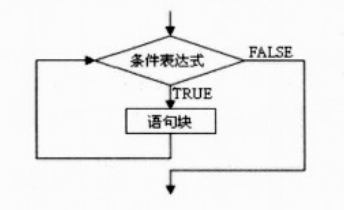

例如，以下示例将执行10次输出语句。虽然while循环通常用于控制循环次数未知的循环结构，但也可以使用计数的方式控制循环执行次数。代码如下所示：

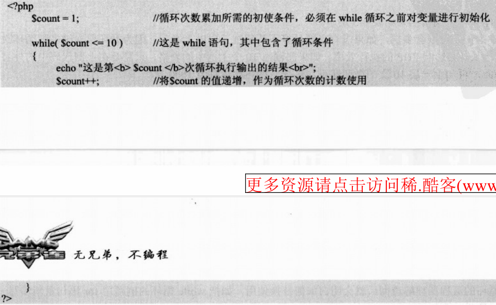

上面的while语句的含意很简单，它告诉PHP只要while表达式的值为TRUE就重复执行嵌套中的循环语句。表达式的值在每次开始循环时检查，所以即使这个值在循环语句中改变了，语句也不会停止执行，直到本次循环结束。该程序执行后输出结果如图6-2所示。

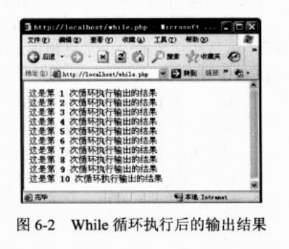

while语句与if语句一样也可以多层嵌套，通常是在对有矩阵形式的输出时使用。例如，输出10行10列的表格时，就可以使用两层循环嵌套，里层的循环执行一次输出一个单元格，连续执行十次则输出一行表格。外层循环执行一次，则里层循环就执行十次输出一行，外层循环执行十次，则输出十行，共输出100个单元格。

代码如下所示：

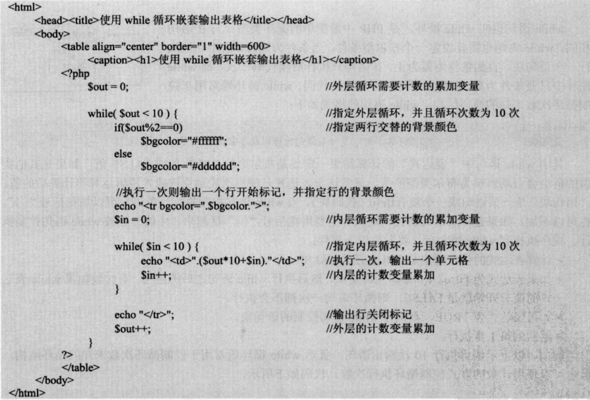

该程序执行后输出结果如表6-3所示。

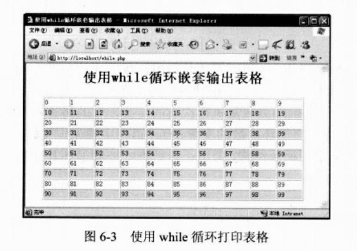

while语句还可嵌套多层，如果没有必要最好不要超过三层以上嵌套。因为循环层次过多则循环次数会成倍增长，会影响PHP的执行效率。如果想输出10个上例中的表格，只需要在上例代码中的外层循环的外面，再加上一层10次的循环即可。这样，循环次数将为1000次。

### do...while循环

do...while和while循环非常相似，区别在于表达式的值是在每次循环结束时检查而不是在开始时。和正规的while循环主要的区别是：do...while的循环语句保证会执行一次，因为表达式的真值在每次循环结束后检查。然而在正规的while循环中就不一定了，表达式的值在循环开始时检查，如果一开始就为FALSE则整个循环立即终止。do..while语句的格式如下：

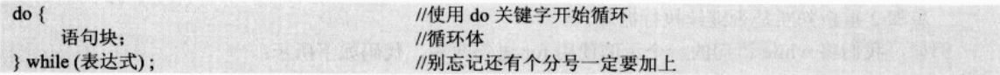

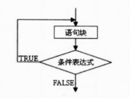

其中while语句中“表达式“的计算结果也一定要是布尔型的TRUE值或FALSE值。“语句块”也可以是一条语句或一个复合语句（代码块）。当do..while语句控制执行一条语句时也可以不加花括号“{}”。使用do...while时最后一定要有一个分号，分号是do...while语法的一部分，程序执行到do...while语句后，将发生以下事件：

* 执行do...while语句控制的语句块。
* 计算表达式的值，确定是true还是false，如果为真，则返回到第1步执行；否则循环结束。

在下面的示例中循环将正好运行一次，因为经过第一次循环后，当检查表达式的值时，其值为FALSE（$count不大于0）而导致循环终止。如下所示：

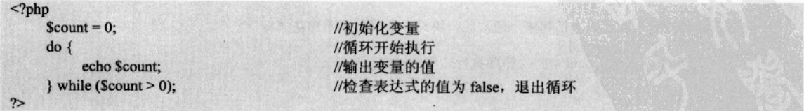

do...while循环与while和for循环相比，在PHP中使用的很少，它最适合循环中的语句至少必须执行一次的情况。当然，也可以使用while循环完成同样的工作，只不过使用do..while看环更为简单明了。

### for语句

虽然前面介绍过的while和do...while循环是使用计数方式控制循环的执行，但这两种循环通常用于条件型循环，即遇到特定的条件才停止循环。而for循环语句的使用适用于明确知道重复执行次数的情况，它的格式和前两种循环语句不一样，for语句将循环次数的变量在for语句中预先定义好。虽然for语句是PHP中最复杂的循环结构，但用于计数方式控制循环其使用更为方便。for语句的格式如下：

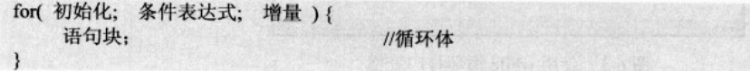

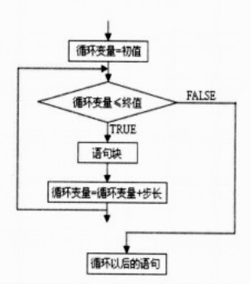

for语句是由分号分隔的三个部分，其中的初始化、条件表达式和增量都是表达式。初始化总是一个赋值语句，它用来给循环控制变量赋初值：条件表达式是一个关系表达式，它决定什么时候退出循环；增量定义循环控制变量，每循环一次后按什么方式变化。而语句块可以为单条语句和复合语句，如果是单条语句也可以不使用花括号“{}"，程序执行到for语句时，将发生以下事件：

* 第一次进入for循环时，对循环控制变量赋初值。
* 根据判断条件的内容检查是否要继续执行循环，如果判断条件为真，继续执行循环；如条件为假，则结束循环执行下面的语句。
* 执行完循环体内的语句后，系统会根据循环控制变量增减方式，更改循环控制变量的值，再回到步骤2重新判断是否继续执行循环。

例如，我们将while语句的一个示例使用for语句改写，代码如下所示：

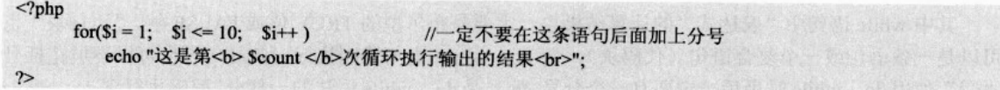

从上例中我们可以看到，for语句这种计数型循环要比while语句制作计数循环简便得多。上例中先给变量\$i赋初值1，接着判断变量\$i是否小于等于10，若是则执行输出语句，之后变量\$i的值增加1。再重新判断，直到条件为假，即i10时结束循环。

在for语句的三个表达式中，一个或多个表达式为空是允许的，通常被称为for循环的退化形式。可以将上面的示例改写成以下几种形式，如下所示：

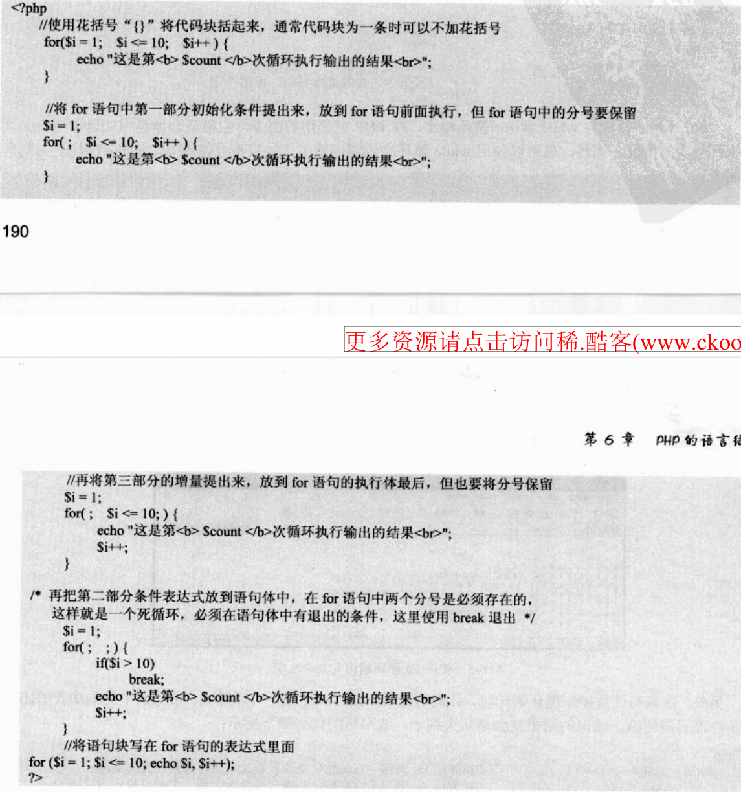

当然，第一个例子看上去最正常，但用户可能会发现在for循环中用空的表达式在很多场合都很方便。不仅可以将for语句中的一个或多个表达式设置为空，还可以在每个表达式中编写多条语句。如下所示：

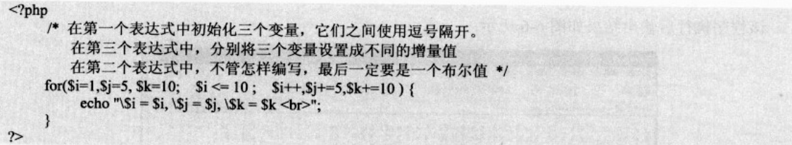

在上例中，不仅是多写几个初始条件或是多写几个增量，只要是合法的表达式都可以写在for语句的三个表达式中，中间使用逗号分隔开即可。该程序执行后输出结果如图6-4所示。

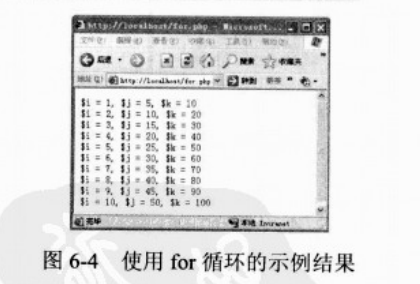

for语句也可以像while语句一样嵌套使用，即在for语句中包含另一条for语句。通过对for语句进行嵌套，可以完成一些复杂的编程。在下例中虽然不是一个复杂的程序，但它演示了如何嵌套for语句。使用双层嵌套for语句输出乘法表，代码如下所示：

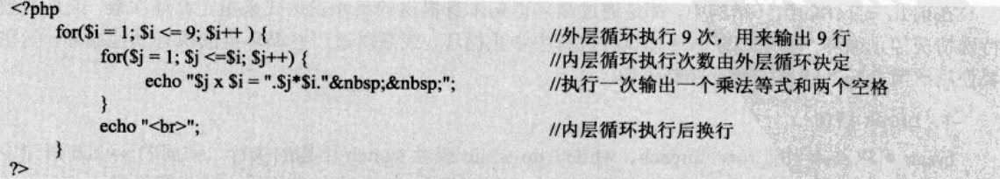

该程序执行后输出结果如图6-5所示。

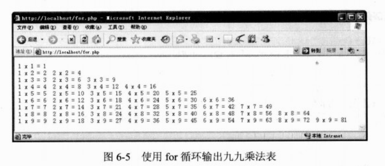

另外，在编写计数控制循环语句时，计数的变量不仅可以递增还可以递减。将上例中的乘法表的递增条件改写成递减，输出的结果就会是从大到小。改写后的代码如下所示：

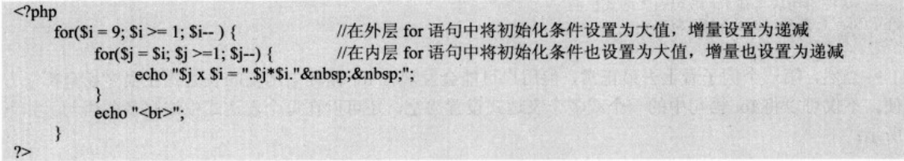

该程序执行后输出结果如图6-6所示：

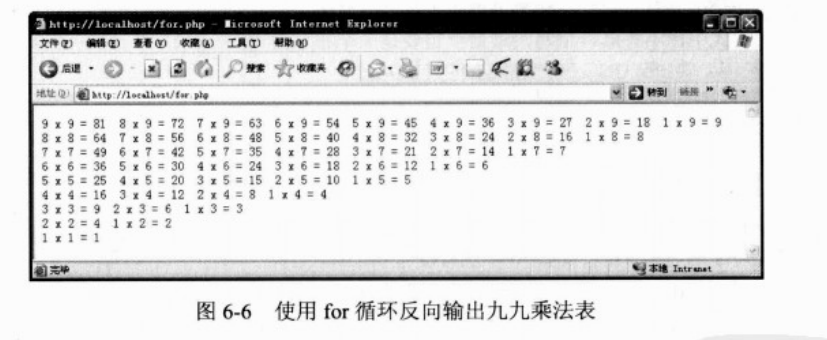

### 特殊的流程控制语句

