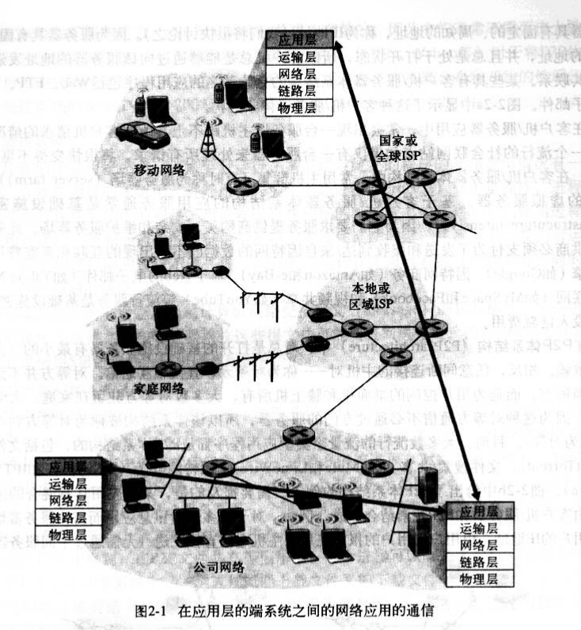
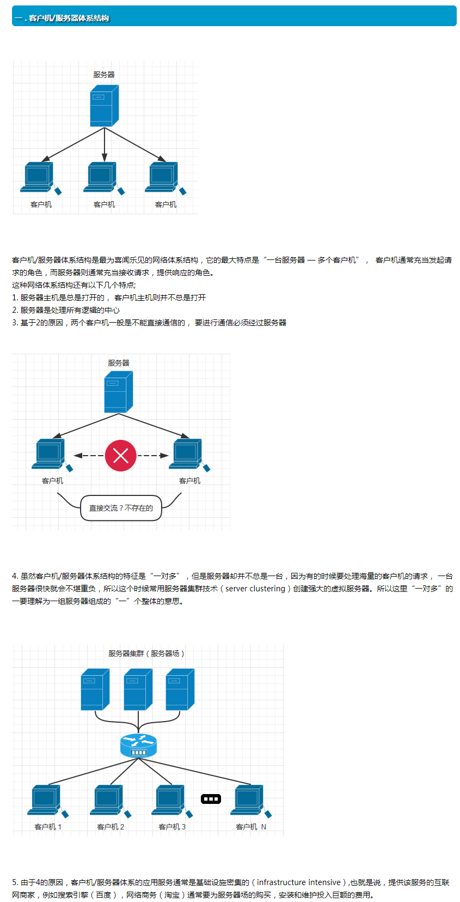
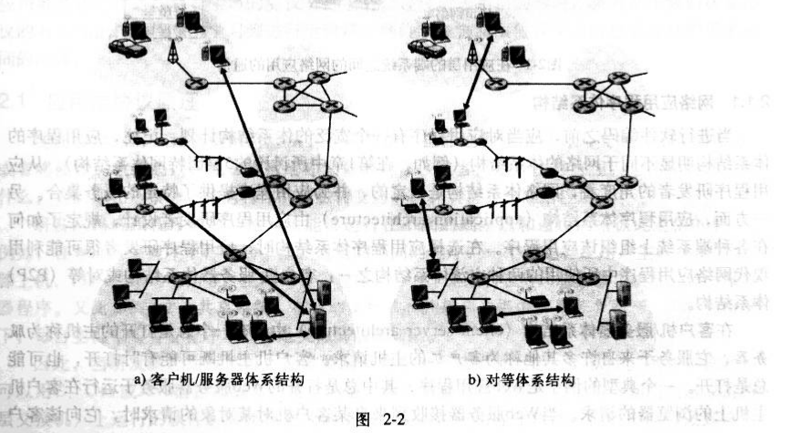
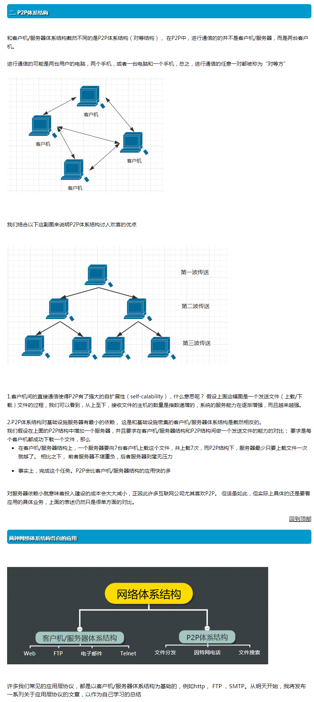
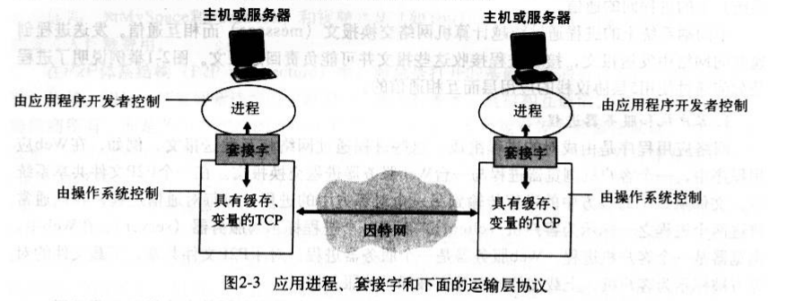
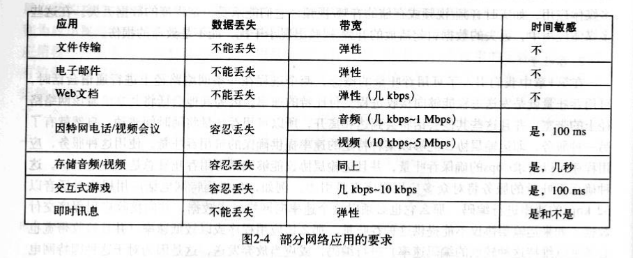
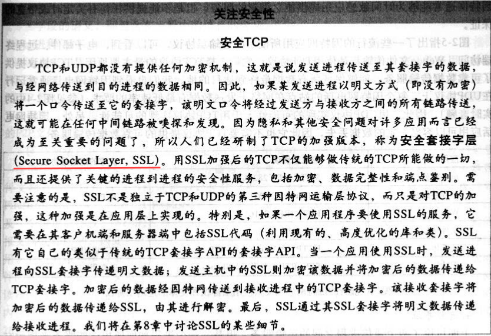
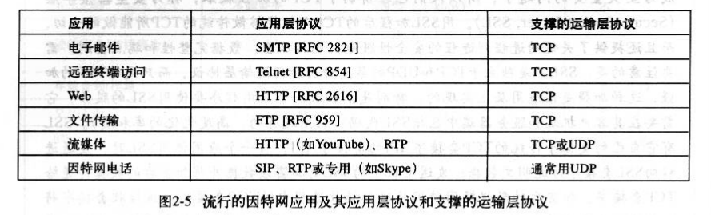
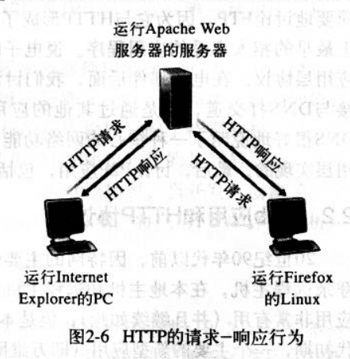
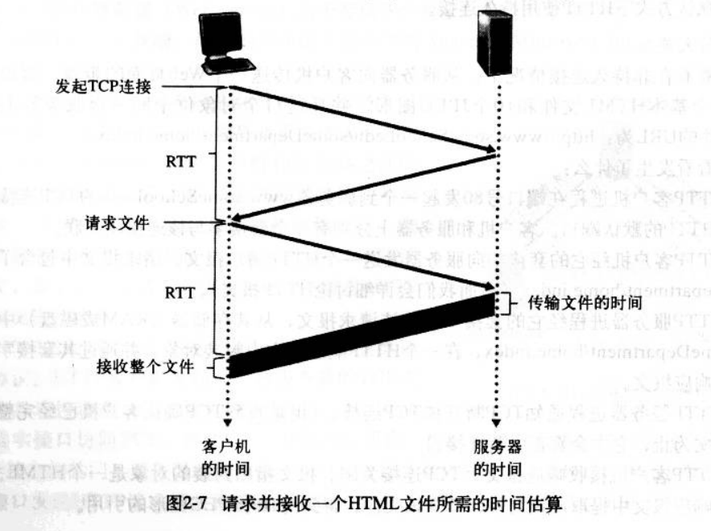

(注1：主要精力放在前端上，这个是为了拓展学习，打一下基本功。)

(注2：现在是2020年7月24日，偶尔看一下这个。)

(注3：现在是2020年11月19日，GET和POST都不熟，来看一下这个。)

# 第1章：计算机网络和因特网

## 什么是因特网

我们试着用一种更具描述性的方法来描绘因特网，而不是对它给出一个一句话的定义。

描述的方法有两种：

一种方法是**描述因特网的具体构成**，即构成因特网的基本硬件和软件组件；

另一种方法是根据为分布式应用**提供服务**的网络基础设施来描述因特网。

### 具体构成描述

在许多非传统设备被联向因特网的情况下，计算机网络这个术语开始听起来有些过时了。用因特网术语来说，所有这些设备都称为**主机**（host）或**端系统**（end system）。到2006年7月为止，有4亿台端系统使用因特网，并且该数目持续迅速增长着。

端系统通过**通信链路**（communication link）和**分组交换机**（packet switch）连接到一起。

在1.2节中，我们将介绍许多类型的通信链路，它们由不同类型的物理媒体组成，这些物理媒体包括同轴电缆、铜线、光纤和无线电频谱。不同的链路以不同的速率传输数据，链路的传输速率是以bps度量的。当一台端系统有数据要向另一台端系统发送时，发送端系统将数据分段，并为每段加上首部字节。用计算机网络的术语来说，由此形成的信息包称为分组（packet）。这些分组通过网络发送到目的端系统，在那里被装配成初始数据。

分组交换机从它的一条入通信链路接收到达的分组，并从它的一条出通信链路转发该分组。市面上流行着各种不同类型且各具特色的分组交换机，但在当今的因特网中，两种最著名的类型是**路由器**（router）和**链路层交换机**（link-layer switch）。这两种类型的交换机朝着最终目的地转发分组。我们将在**第4章详细研究路由器**，在**第5章详细研究链路层交换机**。从**发送端系统到接收端系统**，一个分组所经历的一系列通信链路和分组交换机称为通过该网络的**路径**（route或path）。第一个分组交换网络产生于20世纪70年代，它是今天因特网的“最早祖先”。

用于传送分组的**分组交换网络**在许多方面类似于**承载车辆的公路、铁路和立交桥**。例如，考虑下列情况，一个工厂需要将大量货物搬运到位于数千公里以外的某个目的地仓库。每辆卡车则独立地通过公路、铁路和立交桥的网络向该仓库运送货物。在目的地的仓库，卸载下这些货物，并且与一起装载的同一批货物的其余部分分成一个组。因此，在许多方面，**分组类似于卡车，通信链路类似于公路和铁路，分组交换机类似于立交桥，而端系统类似于建筑物**。就像卡车选取运输网络的一条路径前行一样，分组则选取计算机网络的一条路径前行。

端系统通过**因特网服务提供商（Internet Service Provider，ISP）**接入因特网，每个ISP是一个由**多个分组交换机**和**多段通信链路**组成的网络。为了允许因特网用户之间相互通信，允许用户访问世界范围的因特网内容，这些低层ISP通过国家的、国际的高层ISP（如AT&T和Sprint）互联起来。高层ISP是由通过高速光纤链路互联的高速路由器组成的。无论是高层还是低层ISP网络，它们每个都是**独立管理**的，运行IP协议（参见下文），遵从一定的命名和地址习惯。我们将在1.3节中更为详细地考察ISP和它们的互联的情况。

端系统、分组交换机和其他因特网部件，都要运行控制因特网中信息接收和发送的一系列**协议（protocol）**。**TCP**（Transmission Control Protocol，**传输控制协议**）和**IP**（Internet Protocol，**网际协议**）是因特网中两个最为重要的协议。**IP协议定义了在路由器和端系统中发送和接收的分组的格式**。因特网主要的协议统称为TCP/IP。我们在本章中就开始接触这些协议，但这仅仅是个开始，本书的许多地方与计算机网络协议有关。

指出了因特网协议的重要性后，重要的是每个人都能就各个协议的作用达成共识。这正是标准发挥作用的地方。因特网标准（Internet standard）由因特网工程任务组（Internet Engineering Task Force，IETF）研发[IETF2007]。IETF的标准文档被称为请求评论（Request For Comment，RFC）。RFC最初是作为普通的请求评论（因此而得名），以解决因特网先驱者不面临的体系结构问题。RFC文档往往是技术性很强并相当详细的。它们定义了诸如TCP、IP、HTTP（用于Web）和SMTP（用于电子邮件的开放标准）这样的协议。目前已经有将近5000个RFC。其他组织也在制定用于网络组件的标准，其中最引人注目的是针对网络链路的标准。

例如，IEEE 802LAN/MAN标准化委员会[IEEE 8022007]制定了以太网和无线WiFi的标准。

### 服务描述

前面的讨论已经标识了构成因特网的许多部件。我们还能从一个完全不同的角度，即从**为应用程序提供服务**的基础设施的角度来描述因特网。这些应用程序包括电子邮件、Web冲浪、即时讯息、IP上的话音（VoIP）、因特网广播、流式视频、分布式游戏、对等（peer-to-
peer，P2P）文件共享、因特网上的电视、远程注册等。

这些应用程序称为**分布式应用程序**（distributed application），因为它们涉及多台相互交换数据的端系统。重要的是，因特网应用程序运行在端系统上，即它们并不运行在网络核心中的分组交换机之中。随着本书的讨论我们将愈发清楚，尽管分组交换机促进了端系统之间的数据交换，但是它们并不关心作为数据的源或宿的应用程序。

与因特网相连的端系统提供了一个**应用程序编程接口**（Application Programming Interface，AP1），API规定了运行在一个端系统上的软件请求因特网基础设施向运行在另一个端系统上的特定目的地软件交付数据的方式。因特网APl是一套发送软件必须遵循的规则集合，因此因特网将向目的地软件交付数据。我们将在第2章详细讨论因特网API。

现在，我们给出一个简单的类比，本书中会经常使用这个类比。

假定Alice使用邮政服务向Bob发一封信。当然，Alice不能只是写了这封信（相关数据）然后把该信丢出窗外。邮政服务要求Alice将信放入一个信封中；在信封的中央写上Bob的全名、地址和邮政编码；封上信封；在信封的右上角贴上邮票；最后将该信封投进一个邮局的邮政服务邮箱中。因此，该邮政服务有其自己的“邮政服务API”或一套规则，Alice必须遵循该规则，才能通过邮政服务将自己的信件交付给Bob。
类似地，因特网具有一个发送软件必须遵循的API，以使因特网向目的地软件交付数据。

当然，邮政服务向它的顾客提供了多种服务。它提供了特快专递、挂号、普通服务等。
类似地，因特网向它的应用程序提供了多种服务。当你研发一种因特网应用程序时，你也必须为你的应用程序选择一种因特网服务。我们将在第2章中描述因特网服务，并在第3章中描述因特网是如何提供那些服务的。

因特网的第二种描述方法（根据基础设施向分布式应用程序提供的服务）是很重要的。
因特网具体构成部件的发展日益由新应用程序的需求所驱动。因此，请记住：因特网是一种基础设施，新应用程序正在其上不断地被发明和设置。

### 什么是协议

#### 人类活动的类比

要理解计算机网络协议的概念，也许最容易的办法是：先与某些人类活动进行类比，因为我们人类无时无刻不在执行协议。例如，当你想要向某人询问一天的时间时，将怎样做？
图1-2中显示了一种典型的交互过程。人类协议（或者至少说是好的行为方式）要求一方首先进行问候（图1-2中的第一个“你好”），以开始与另一个人的通信。对这个“你好”的典型响应是返回一个“你好”报文。此人用一个热情的“你好”进行响应，这隐含着能够继续向那人询问时间了。对最初的“你好”的不同响应（例如，“不要烦我！”，或“我不会说英语”，或某些不合时宜的回答）可能表明：能勉强与之通信或不能与之通信。在此情况下，按照人类协议，发话者将不能够询问时间了。有时，一个人询问的问题根本得不到任何回答，在此情况下通常是放弃向该人询问时间的想法。注意，在人类协议中，有我们发送的特定报文，有我们根据接收到的应答报文或其他事件（例如，在某些给定的时间内没有应答）采取的动作。显然，传输的和接收的报文，以及当这些报文被发送和接收或其他事件出现时所采取的动作，在一个人类协议中起到了核心作用。如果人们执行不同的协议（例如，一个人讲礼貌，而另一人不讲礼貌；或一个人明白时间这个概念，而另一人却不知道），该协议就不能互动，因而不能完成有用的工作。在网络中该道理同样成立，为了完成一项工作，要求两个（或多个）通信实体运行相同的协议。

/01.png)

#### 网络协议

网络协议类似于人类协议，只不过交换报文和采取动作的实体是某些设备（如计算机、PDA、蜂窝电话、路由器或其他具有网络能力的设备）的硬件或软件组件。因特网中的所有活动，凡是涉及两个或多个通信的远程实体都受协议的制约。例如，在两台物理连接的计算机的网络接口卡中，硬件实现的协议控制了两块网络接口卡间的“线上”比特流；端系统中的拥塞控制协议控制了发送方和接收方之间传输的分组的速率。因特网中到处运行着协议，因此本书的大量篇幅与计算机网络协议有关。

> 一个协议定义了在两个或多个通信实体之间交换的报文格式和次序，以及在报文传输和/或接收或其他事件方面所采取的动作。

一般来说，因特网和计算机网络广泛地使用了协议。不同的协议用于完成不同的通信任务。当你阅读完这本书后将会知道，一些协议简单而直截了当，而另一些协议则复杂且难懂。
掌握计算机网络领域知识的过程就是理解网络协议的构成、原理和工作的过程。

## 网络边缘

在接下来的一节中，我们将从网络边缘向网络核心推进，探讨计算机网络中的交换和选路。

回想前一节计算机网络的术语，与因特网相连的计算机等设备通常称为端系统（end system）。如图1-3所示，因为它们位于因特网的边缘，故而被称为端系统。因特网的端系统包括桌面计算机（例如，桌面PC、Mac和基于Linux的工作站）、服务器（例如，Web和电子邮件服务器）和移动计算机（例如，便携式计算机、PDA和采用无线因特网连接的电话）。此外，越来越多的其他类型的设备正被作为端系统与因特网相连（参见补充说明）。

端系统也称为主机，因为它们容纳（即运行）诸如Web浏览器程序、Web服务器程序、电子邮件阅读程序或电子邮件服务器程序等应用程序。本书通篇将交替使用主机和端系统这两个术语，即主机=端系统。主机有时又被进一步划分为两类：客户机（client）和服务器（server）。客户机非正式地等同于桌面PC、移动PC和PDA等，而服务器非正式地等同于更为强大的机器，用于存储和发布Web页面、流视频以及转发电子邮件等。

### 客户机和服务器程序

在网络软件的上下文中，客户机和服务器有另一种定义，本书通篇都采用这种定义。**客户机程序**（client program）是运行在一个端系统上的程序，它发出请求，并从运行在另一个瑞系统上的**服务器程序**（server program）接收服务。这种客户机一服务器模式无疑是因特网应用程序的最为流行的结构，我们将在第2章中详细研究。Web、电子邮件、文件传输、远程注册（例如Telnet）、新闻组和许多其他流行的应用程序采用了客户机一服务器模式。因为通常客户机程序运行在一台计算机上，而服务器程序运行在另一台计算机上，所以根据定义，客户机一服务器因特网应用程序是分布式应用程序（distributed application）。客户机程序和服务器程序通过因特网互相发送报文而进行交互。在这个层次的抽象下，路由器、链路和因特网服务的其他具体构件可作为一个“黑盒子”，该黑盒子在因特网应用程序的分布式的、通信的部件之间传输报文。图1-3中显示了这种级别的抽象。

今天的因特网应用程序并非全都是由与纯服务器程序交互的纯客户机程序组成的。越来越多的应用程序是对等（P2P）应用程序，其中的端系统互相作用并运行执行客户机和服务器功能的程序。例如，在P2P文件共享应用程序（如Limewire、eDonkey和Kazaa）中，用户端系统中的程序起着客户机程序和服务器程序的双重作用。当它向另一个对等方请求文件时，起着客户机的作用；当它向另一个对等方发送文件时，起着服务器的作用。在因特网电话中，通信双方作为对等方交互，即通信会话是对称的，双方都在发送和接收数据。在第2章中，我们将详细比较和对照客户机一服务器和P2P体系结构。

/02.png)

### 接入网

讨论了位于“网络边缘”的应用程序和端系统后，我们接下来讨论接入网（access network），即将端系统连接到其边缘路由器（edge router）的物理链路。边缘路由器是端系统到任何其他远程端系统的路径上的第一台路由器。图1-4显示了从端系统到边缘路由器的几种类型的接入链路。图中的接入链路是用粗线突出标示的。网络接入大致可以分为以下三种类型：

* 住宅接入（residential access），将家庭端系统与网络相连。
* 公司接入（company access），将商业或教育机构中的端系统与网络相连。
* 无线接入（wireless access），将移动端系统与网络相连。

> 宽带住宅区接人有两种常见类型：数字用户线（digital subscriber line，DSL）[DSL2007]和混合光纤同轴电缆（hybrid fiber-coaxial cable，HFC）[Cable Labs 2007]。

### 物理媒体

物理媒体划分为两类：导引型媒体（guided media）和非导引型媒体（unguided media）。对于导引型媒体，电波沿着固体媒体（如光缆、双绞铜线或同轴电缆）被导引。对于非导引型媒体，电波在空气或外层空间（例如，在无线局域网或数字卫星频道）中传播。

#### 双绞铜线

最便宜并且使用最为普遍的导引型传输媒体是双绞铜线。一百多年来，它一直用于电话网。事实上，从电话机到本地电话交换机有99%以上的连线使用的是双绞铜线。

非屏蔽双绞线（Unshielded Twisted Pair，UTP）常用在建筑物内的计算机网络中，即用于局域网（LAN）中。目前局域网中的双绞线的数据传输速率从10Mbps到1Gbps。所能达到的数据传输速率取决于线的厚度以及传输方和接收方之间的距离。

双绞线最终已经作为高速LAN连网的主要方式。

> LAN:局域网
>
> WLAN:广域网

#### 同轴电缆

与双绞线类似，同轴电缆由两个铜导体组成，但是这两根导体是同心的而不是并行的。

借助于这种结构与特殊的绝缘体和保护层，同轴电缆能够具有高比特速率。同轴电缆在电缆电视系统中相当普遍。

#### 光缆

光缆是一种细而柔软的、能够导引光脉冲的媒体，其中每个脉冲表示一个比特。一根光纤能够支持极高的比特速率，高达数十甚至数百Gbps。它们不受电磁干扰，长达100km的光缆信号衰减极低，并且很难接头。这些特征使得光纤成为长途导引型传输媒体，特别是成为跨海链路的首选媒体。

#### 陆地无线电信道

无线电信道承载电磁频谱中的信号。因为不需要安装物理线路，并具有穿透墙壁、提供与移动用户的连接以及长距离承载信号的能力，因而成为一种有吸引力的媒体。

陆地无线电信道可以大致地划分为两类：一类是运行在本地区域，通常跨越数十到几百米；另一类是运行在广域，跨越数万米。1.2.2节中描述的无线LAN技术使用了局域无线电信道；蜂窝接入技术使用了广域无线电信道。我们将在第6章中详细讨论无线电信道。

#### 卫星无线电信道

一颗通信卫星连接两个或多个位于地球的微波发射方/接收方，它们被称为地面站。该卫星在一个频段上接收传输，使用一个转发器（下面讨论）再生信号，并在另一个频率上传输信号。卫星能够提供Gbps的带宽。通信中常使用两类卫星：同步卫星（geostationary satellite）
和低地球轨道卫星（low-earth orbiting satellite）

## 网络核心

在考察了因特网的边缘后，我们现在更深入地研究网络核心，即互联了因特网端系统的分组交换机和链路的网状网络。图1-7用黑色阴影线勾画出网络核心部分。

/03.png)

### 电路交换和分组交换

通过网络链路和交换机移动数据有两种基本方法：**电路交换**（circuit switching）和**分组交换**（packet switching）。在电路交换网络中，沿着端系统通信路径，为端系统之间通信所提供的资源（缓存、链路传输速率）在通信会话期间会被预留。在分组交换网络中，这些资源则不被预留；会话的报文按需使用这些资源，这将导致可能不得不等待（即排队）接入通信线路。一个简单的类比是，考虑两家餐馆，一家需要预订，而另一家不需要预订但不保证能安排。对于需要预订的那家餐馆，我们在离开家之前要承受必须先打电话预订的麻烦。但当我们到达该餐馆时，原则上我们能够立即与服务员联系并点菜。对于不需要预订的那家餐馆，我们没有预订餐桌的麻烦，但也许不得不先等到有空闲餐桌后才能找服务员点菜。

无处不在的电话网络是电路交换网络的例子。考虑当一个人通过电话网向另一个人发送信息（话音或传真）时所发生的情况。在发送方能够发送信息之前，该网络必须在发送方和接收方之间建立一个连接。这是一个真正意义上的连接，因为此时沿着发送方和接收方之间路径上的交换机都将为该连接维护连接状态。用电话的术语来说，该连接被称为一条电路（circuit）。当网络创建这种电路时，它也在该网络链路上预留了恒定的连接期间的传输速率。
因为已经为该发送方到接收方的连接预留了带宽，所以发送方能够以确保的恒定速率向接收方传送数据。

今天的因特网是分组交换网络的典范。考虑当一台主机通过因特网向另一台主机发送分组的情况。如同电路交换一样，分组通过一系列通信链路传输。但对于分组交换而言，分组被送往网络而不必预留任何带宽。如果因为其他分组需要同时经过某链路发送，使该链路之一变得拥塞，则分组将不得不在传输链路的发送侧的缓存中等待，从而形成时延。因特网尽力而为（best effort）地以适时的方式传递分组，但它不作任何确保。

并非所有的电信网络都能够被明确地归类为电路交换网络或分组交换网络。然而，这种分组交换和电路交换的基本分类法是理解电信网络技术的一个极好起点。

#### 电路交换

本书的内容是有关计算机网络、因特网和分组交换的，而非电话网络和电路交换的。但是，理解因特网和其他计算机网络为什么使用分组交换而非更为传统的用于电话网的电路交换是很重要的。基于这个原因，我们现在简要概述一下电路交换。

/04.png)

重图1-8显示了一个电路交换网络。在这个网络中，用4条链路互联4台电路交换机。这些链路的每条都有n条电路，因此每条链路能够支持n条电路同时连接。每台主机（例如PC和工作站）都与一台交换机直接相连。当两台主机要通信时，该网络在两台主机之间创建一条专用的端到端连接（end-to-end connection）。（多个设备之间的会议呼叫当然也是可能的。为了简化起见，我们假定每个连接仅有两台主机。）因此，主机A为了向主机B发送报文，该网络必须在两条链路之一上先预留一条电路。因为每条链路具有n条电路，每条链路由端到端连接使用，该连接在连接期间获得该链路带宽的1/n部分。

#### 电路交换网络中的多路复用

链路中的电路要么通过频分多路复用（Frequency-Division Multiplexing，FDM）实现，要么通过时分多路复用（Time-Division Multiplexing，TDM）实现。对于FDM，链路的频谱由跨越链路创建的所有连接所共享。特别是，该链路在连接期间为每条连接专用一个频段。在电话网络中，这个频段通常具有4kHz（即每秒4000赫兹或4000周）。该频段的宽度被称为带宽（bandwidth）。调频无线电台也使用FDM来共享88~108MHz的频谱，其中每个电台被分配一个特定的频带。

对于一条TDM链路，时间被划分为固定区间的帧，并且每帧又被划分为固定数量的时隙。当网络跨越一条链路创建一条连接时，该网络在每个帧中为该连接指定一个时隙。这些时隙专门由该连接单独使用，一个时隙可用于传输该连接（在每个帧内）的数据。

图1-9显示了支持多达4条电路的特定网络链路的FDM和TDM。对于FDM，其频率域被分割为4个波段，每个波段的带宽是4kHz。对于TDM，其时域被分割为帧，在每个帧中具有4个时隙，每个电路在循环的TDM帧中被分配相同的专用时隙。对于TDM，一条电路的传输速率等于一个时隙中的比特数乘以该帧的速率。例如，如果链路每秒传输8000个帧，每个顿由8个比特组成，则一条电路的传输速率是64kbps。

/05.png)

分组交换的支持者总是争辩说，电路交换效率较低，因为在静默期（silent period）专用电路空闲。例如，打电话的一个人停止讲话，空闲的网络资源（即沿该连接路径的链路中的频段或时隙）不能被其他进行中的连接所使用。作为这些资源被无效利用的另一个例子，考虑一名放射科医师使用电路交换网络远程访问一系列X射线图像的情形。该放射科医师建立一条连接，请求一幅图像后，判读该图像，然后请求一幅新图像。在放射科医师判读图像期间，网络资源被浪费了。分组交换的支持者还乐意指出，创建端到端电路和预留端到端带宽是很复杂的，需要复杂的信令软件来协调沿端到端路径的交换机的操作。

在结束电路交换讨论之前，我们讨论一个用数字表示的例子，它更能说明问题的实质。
考虑从主机A到主机B经一个电路交换网络需要多长时间发送一个640kb的文件。假定该网络中的所有链路使用时隙数为24的TDM，并具有1.536Mbps的比特速率。同时假定在主机A能够开始传输该文件时需要500ms创建一条端到端电路。那么，它需要多长时间才能发送该文件？每条电路的传输速率是1.536Mbps/24=64kbps，因此传输该文件需要（640kb）/（64kbps）
=10s。对于这个10s，再加上电路的创建时间，这样就需要10.5s发送该文件。注意到该传输时间与链路的数量无关：即使该端到端电路通过一条链路或100条链路，传输时间也是10s。
（实际的端到端时延还包括传播时延，参见1.4节）。

#### 分组交换

各种应用程序在完成其任务时要交换**报文**（message）。报文能够包含协议设计者需要的任何东西。报文可以执行一种控制功能（例如，握手例子中的“你好”报文），或能够包含数据（例如电子邮件数据、JPEG图像或MP3音频文件）。在现代计算机网络中，源主机将长报文划分为较小的数据块，并称之为**分组**（packet）。在源和目的地之间，这些分组中的每个都通过通信链路和分组交换机（packet switch）（交换机主要有两类：路由器和链路层交换机）传送。分组以该链路的最大传输速率在通信链路上传输。

多数分组交换机在链路的输入端使用**存储转发传输**（store-and-forward transmission）机制。存储转发传输机制是指在交换机能够开始向输出链路传输该分组的第一个比特之前，必须接收到整个分组。因此，存储转发式分组交换机沿着该分组的路径在每条链路的输入端引入了存储转发时延。考虑从一台主机经分组交换网络向另一台主机发送一个L比特分组需要多长时间。假定在这两台主机之间有Q段链路，每段链路的速率为Rbps。假定这是该网络中的唯一分组。从主机A发出的该分组必须首先传输到第一段链路上，这需要L/Rs。然后它要在余下的Q-1段链路上传输，即它必须存储和转发Q-1次，每次都有L/R的存储转发时延，因此总时延为QL/R。

每个分组交换机有多条链路与之相连。对于每条相连的链路，该分组交换机具有一个**输出缓存**（output buffer）（也称为输出队列（output queue）），它用于存储路由器准备发往那条链路的分组。该输出缓存在分组交换中起着重要的作用。如果到达的分组需要跨越链路传输，但发现该链路正忙于传输其他分组，该到达分组必须在输出缓存中等待。因此，除了存储转发时延以外，分组还要承受输出缓存的**排队时延**（queue delay）。这些时延是变化的，变化的程度取决于网络中的拥塞水平。因为缓存空间的大小是有限的，所以一个到达的分组可能发现该缓存被等待传输的分组完全充满了。在此情况下，将出现**分组丢失或丢包**（packet lost）——可能是到达的分组也可能是已经排队的分组之一将被丢弃。回想一下本节前面餐馆类比的例子，该排队时延与你在餐馆吧台等待餐桌空闲下来所花费的时间相类似。分组丢失类比于你被服务员告知，已经有太多的其他人在吧台等待桌子就餐，你必须离开这家餐馆。

图1-10显示了一个简单的分组交换网络。在这张图和下面的图中，分组被表示为3维切片。切片的宽度表示分组的长度。在这张图中，所有分组具有相同的宽度，因此有相同的长度。假定主机A和B向主机E发送分组。主机A和B先通过10Mbps的以太网链路向第一个分组交换机发送分组，该分组交换机将这些分组导向到一条1.5Mbps的链路。如果分组到达该交换机的速率超过了该交换机跨越1.5Mbps的输出链路转发分组的速率，该链路有拥塞，这些分组在通过链路传输之前将在链路输出缓存中排队。我们将在1.4节中更为详细地研究这种排队时延。

/06.png)

#### 分组交换与电路交换对比：统计多路复用

在描述了电路交换和分组交换之后，我们来对比一下这两者。分组交换的批评者经常争辩说，分组交换因其端到端时延是变动的和不可预测的（主要是因为排队时延的变动和不可预测所致），故不适合实时服务（例如，电话和视频会议）。分组交换的支持者却争辩道，①它提供了比电路交换更好的带宽共享；②它比电路交换更简单、更有效，实现成本更低。
分组交换与电路交换之争的有趣讨论参见[Molinero-Fernandez2002]。概括而言，嫌餐馆预订麻烦的人宁可要分组交换而不愿意要电路交换。

分组交换为什么更有效呢？我们看一个简单的例子。假定多个用户共享一条1Mbps链路。
再假定每个用户的活动性周期是变化的，即某用户时而以100kbps恒定速率产生数据，时而静止（这时用户不产生数据）。进一步假定该用户仅有10%的时间活动（在余下的90%的时间空闲下来喝咖啡）。对于电路交换，在所有的时间内必须为每个用户预留100kbps。例如，对于电路交换的TDM，如果一个1秒的帧被划分为10个时隙，每个时隙为100ms，则每个用户每帧将被分配一个时隙。

因此，该链路仅能支持10（=1Mbps/100kbps）个同时上网的用户。对于分组交换，一个特定用户活动的概率是0.1（即10%）。如果有35个用户，有11或更多个同时上网活动的用户的概率大约是0.0004。（课后习题7概述了如何得到这个概率值。）当有10个或更少的同时上网活动的用户时（发生概率为0.9996），到达的数据率总和小于或等于该链路的输出速率1Mbps。
因此，当有10个或更少的活动用户时，通过该链路的分组流基本上没有时延，与电路交换的情况一样。当同时活动的用户超过10个时，分组的到达率总和超过该链路的输出容量，则输出队列将开始变长（一直增长到输入速率总和重新低于1Mbps，此后该队列才会减少长度）。
因为本例中超过10个同时活动用户的概率极小，所以分组交换差不多总是具有与电路交换相同的性能，并且用户数量是所支持的数量的3倍多时也是如此。

我们现在考虑第二个简单的例子。假定有10个用户，某个用户突然产生1000个1kb的分组，而其他用户则保持静默，不产生分组。在具有每帧10个时隙并且每个时隙包含1kb的TDM电路交换情况下，活动用户仅能使用每帧中的一个时隙来传输数据，而每个帧中剩余的9个时隙保持空闲。活动用户的所有1Mb数据要传输完，需要10s的时间。在分组交换情况下，活动用户能够连续地以1Mbps的全部链路速率发送其分组，因为没有其他用户产生的分组需要与该活动用户的分组进行多路复用。在此情况下，该活动用户的所有数据将在1s内发送完毕。

上面的例子从两个方面表明了分组交换的性能能够优于电路交换的性能。这些例子也强调了在多个数据流之间共享链路的两种形式，其传输速率的关键差异。电路交换不考虑要求而预先分配传输链路的使用，这使得已分配但不需要的链路时间未被利用。另一方面，分组交换使用按需的方式分配链路。链路传输能力将只在所有的其分组要在链路上传输的用户中，逐分组地被共享。这样的按需（而不是预分配）共享资源有时被称为资源的**统计多路复用**（statistical multiplexing）。

虽然分组交换和电路交换在今天的电信网络中都是普遍采用的方式，但趋势无疑是朝着分组交换方向发展。甚至许多今天的电路交换电话网正在缓慢地向分组交换迁移。特别是，电话网经常在电话昂贵的海外电话部分使用分组交换。

### 分组是怎样通过分组交换网形成其通路的

前面我们说过，路由器从与它相连的一条通信链路得到分组，将分组转发到与它相连的另一条通信链路。但是，路由器怎样确定它应当向哪条链路进行转发呢？不同的计算机网络实际上是以不同的方式完成的。在这里，我们将描述一种流行的方法，即因特网所采用的方法。

在因特网中，每个通过该网络传输的分组在它的首部包含了其目的地址。就像邮政地址一样，该地址是一种层次结构。当分组到达网络中的一台路由器时，该路由器检查分组的目的地址的一部分，并向相邻路由器转发该分组。更特别的是，每台路由器具有一个转发表，用于将目的地址（或目的地址的一部分）映射到输出链路。当分组到达一台路由器时，该路由器检查目的地址，并用这个目的地址搜索转发表，以找到合适的输出链路。然后，路由器将该分组导向输出链路。

我们刚刚学习了路由器使用分组的目的地址来索引转发表并决定合适的输出链路。但是这里还回避了另一个问题：转发表是如何设置的？是通过人工对每台路由器逐台进行配置的，还是因特网使用更自动的过程进行设置的呢？第4章将深入地探讨这个问题。但为了激发你的求知欲，我们现在将告诉你因特网具有一些特殊的选路协议，它们用于自动地设置**转发表**（forwarding table）。例如，选路协议可以决定从每台路由器到每个目的地的最短路径，并使用这些最短路径来配置路由器中的转发表。

端到端选路过程也与一个不使用地图而喜欢问路的汽车驾驶员相类似。例如，假定Joe驾车从费城到佛罗里达州奥兰多市Lakeside Drive街156号。Joe先驾车到附近的加油站，询问怎样才能到达佛罗里达州奥兰多市Lakeside Drive街156号。该加油站的服务员从该地址中抽取了佛罗里达州部分，告诉Joe他需要上I-95南州际公路，该公路恰有一个与该加油站临近的入口。他又告诉Joe，一旦到了佛罗里达后应当再问当地人。Joe然后上了I-95南州际公路，一直到达佛罗里达的Jacksonville，在那里他向另一个加油站服务员问路。该服务员从地址中抽取了奥兰多市部分，告诉Joe他应当继续沿I-95公路到Daytona海滩，然后再问其他人。Daytona海滩的另一个加油站服务员也抽取了该地址的奥兰多市部分，告诉Joe应当走I-4公路直接前往奥兰多市。Joe走了1-4公路，并从奥兰多市出口下来。Joe又向另一个加油站的服务员询问，

这时该服务员抽取了该地址中的Lakeside Drive部分，告诉Joe到LakesideDrive必须要走的路。
当Joe到达了Lakeside Drive街时，他向一个骑自行车的小孩询问如何到达他的目的地。这个孩子抽取了该地址的156号部分，并指出了房屋的方向。Joe最后到达了他的最终目的地。

在上述类比中，加油站服务员和骑自行车的孩子就好比是路由器，他们大脑中的转发表已经由多年积累起来的经验进行了配置。

怎样才能实际看到分组在因特网中所采用的端到端路径？现在请你自己用一下Traceroute程序，有关情况请访问站点http://www.traceroute.org（参见1.4节有关Traceroute的讨论）。

### ISP和互联网主干

我们在前面看到，端系统（用户PC、PDA、Web服务器、电子邮件服务器等）通过接入网与因特网相连。前面也讲过，接入网可以是有线的或无线的局域网（例如，在一个公司、学校或图书馆），也可以是住宅电缆调制解调器或DSL网络，还可以是通过拔号调制解调器接入的住宅SP（例如，AOL或MSN）。但是，将端用户和内容提供商连接到接入网仅是解决难题的很小的一部分，因为因特网是由数以亿计的用户和几十万个网络构成的。因特网是网络的网络，理解这个术语是解决该难题的关键。

在公共因特网中，坐落在因特网边缘的接入网络通过分层的ISP层次结构与因特网的其他部分相连，如图1-11所示。接入ISP（例如，AOL这样的住宅电缆和DSL网络、拨号接入网络，无线接入网络，使用LAN的公司和大学ISP）位于该层次结构的底部。该层次结构的最顶层是数量相对较少的第一层ISP（tier-1ISP）。第一层ISP在许多方面与其他网络相同，它有链路和路由器，并与其他网络相连。然而，在另外一些方面，第一层ISP是特殊的。它们的链路速率通常是622Mbps或更高，对于大型第一层ISP，其链路速率的范围是2.5~10Gbps，相应地其路由器也必须能够以极高的速率转发分组。第一层ISP的特性可以表示为：

* 直接与其他每个第一层ISP相连。
* 与大量的第二层ISP和其他客户网络相连。
* 覆盖国际区域。

第一层ISP也被称为因特网主干（Internet backbone）网络，包括Sprint、verizon、MCl
（以前的UUNet/WorldCom）、AT&T、NTT、Level3、Qwest和Cable&Wireless。有趣的是，没有任何组织正式批准第一层的状态。如名言所说，如果必须问你是否是一个组织的成员的话，你可能不是。

第二层ISP通常具有区域性或国家性覆盖规模，并且非常重要地仅与少数第一层ISP相连接（参见图1-11）。因此，为了到达全球因特网的大部分区域，第二层ISP需要引导流量通过它所连接的第一层ISP。第二层ISP被称为是它所连接的第一层ISP的客户（customer），第一层ISP相对该客户而言是**提供商**（provider）。许多大公司和机构将它们的企业网直接与第一层或第二层ISP相连，因而成为该ISP的客户。一个提供商ISP向它的客户收费，费用通常根据连接两者的带宽而定。一个第二层网络也可以选择与其他第二层网络直接相连，在这种情况下流量能够在两个第二层网络之间流动，而不必流经某第一层网络。在第二层ISP之下是较低层的ISP，这些较低层ISP经过一个或多个第二层ISP与更大的因特网相连。在该层次结构的底部是接入ISP。在更为复杂的情况下，某些第一层提供商也是第二层提供商（即垂直集成），蛇有除了向较低层ISP出售因特网接入外，也直接向端用户和内容提供商出售因特网接入。当两个ISP彼此直接相连时，它们被称为彼此是**对等**（peer）的。一个有趣的研究[Subramanian2002]是根据客户一提供商和对等关系，通过研究因特网的拓扑来寻求更为精确地定义因特网的层次结构的方式。

/07.png)

在一个ISP的网络中，某ISP与其他ISP（无论它在该层次结构的下面、上面或相同层次）的连接点被称为到汇集点（Point of Presence，POP）。POP就是某ISP网络中的一台或多台路由器组，通过它们能够与其他ISP的路由器连接。一个第一层提供商通常具有许多POP，这些POP分散在其网络中不同的地理位置，每个POP与多个客户网络和其他ISP相连。对于一个与提供商POP连接的客户网络而言，该客户通常从第三方电信提供商租用一条高速链路，并且直接将它的一台路由器与该提供商位于POP的一台路由器相连。两个第一层ISP也可以将一对POP连接在一起，形成彼此对等，这一对POP的每端分别属于这两个ISP之一。此外，两个ISP可以具有多个对等点，将两个或更多POP对彼此相连起来。

总之，因特网的拓扑是很复杂的，它由几十个第一层ISP和第二层ISP与数以千计的较低层ISP组成。ISP覆盖的区域不同，有些跨越多个大洲和大洋，有些限于世界的很小区域。较低层的ISP与较高层的ISP相连，较高层ISP彼此互联。用户和内容提供商是较低层ISP的客户，较低层ISP是较高层ISP的客户。

## 分组交换网中的时延、丢包和吞吐量

回想在1.1节中我们讲过，可以将因特网看成是为运行在端系统上的分布式应用提供服务的基础设施。理想情况下，我们希望因特网服务能够在任意两个端系统之间瞬间移动大量数据，而没有任何数据丢失。然而，这是一个极高的目标，现实中很难做到。与之相反，计算机网络必定要限制端系统之间的吞吐量（每秒能够传输的数据量），在端系统之间引入时延，并能够丢包。一方面，实际中引入时延、丢包和对吞吐量的限制是不好的。而另一方面，因为计算机网络存在这些问题，所以围绕着如何处理这些问题有许多令人着迷的问题，问题多得足以开设一门有关计算机网络方面的课程，可以做上百篇博士论文！在本节中，我们将开始研究计算机网络中的时延、丢包和吞吐量等问题，并使之量化。

### 分组交换网中的时延概述

前面讲过，分组从一台主机（源）出发，通过一系列路由器传输，在另一台主机（目的地）结束它的历程。当分组从一个节点（主机或路由器）沿着这条路径到后继节点（主机或路由器）时，该分组在沿途的每个节点都经受了几种不同类型的时延。这些时延中最为重要的是**节点处理时延**（nodal processing delay）、**排队时延**（queuing delay）、**传输时延**（transmission delay）和**传播时延**（propagation delay），这些时延总体累加起来是**节点总时延**（total nodal delay）。为了深入理解分组交换和计算机网络，我们必须理解这些时延的性质和重要性。

#### 时延的类型

我们来探讨一下图1-12中列出的这些时延。作为源和目的地之间的端到端路径的一部分，一个分组从上游节点通过路由器A向路由器B发送。我们的目的是在路由器A刻画出节点时延。注意到路由器A具有通往路由器B的输出链路。该链路前面有一个队列（也称为缓存）。当该分组从上游节点到达路由器A时，路由器A检查该分组的首部以决定该分组的适当的输出链路，并将该分组导向该链路。在这个例子中，该分组的输出链路是通向路由器B的那条链路。仅当该链路没有其他分组在传输并且没有其他分组排在该队列前面时，才能在这条链路上传输该分组；如果该链路当前繁忙或有其他分组已经在该链路上排队，则新到达的分组将参与排队。

/08.png)

##### 处理时延

检查分组首部和决定将该分组导向何处所需要的时间是处理时延的一部分。处理时延也包括其他因素，如检查比特级差错所需要的时间，该差错出现在这些分组比特从上游节点向路由器A传输的过程中。高速路由器的处理时延通常是微秒或更低的数量级。在这种节点处理之后，路由器将该分组引向通往路由器B链路之前的队列。（在第4章中，我们将研究路由器运行的细节。）

##### 排队时延

在队列中，当分组在链路上等待传输时，它经受排队时延。一个特定分组的排队时延将取决于先期到达的、正在排队等待向链路传输的分组的数量。如果该队列是空的，并且当前没有其他分组在传输，则该分组的排队时延为0。另一方面，如果流量很大，并且许多其他分组也在等待传输，该排队时延将很大。我们将很快看到，到达组的分组数量是到达该队列的流量的强度和性质的函数。实际的排队时延通常在毫秒到微秒级。

##### 传输时延

假定分组以先到先服务方式传输一—这在分组交换网中是常见的方式，仅当所有已经到达的分组被传输后，才能传输我们的分组。用L比特表示分组的长度，用Rbps表示从路由器A到路由器B的链路传输速率。例如，对于一条10Mbps的以太网链路，速率R=10Mbps；对于100 Mbps的以太网链路，速率R=100Mbps。传输时延（又称为存储转发时延，在1.3节中讨论过）是LUR。这是将所有分组的比特推（传输）向链路所需要的时间。实际的传输时延通常在毫秒到微秒级。

##### 传播时延

一旦一个比特被推向链路，该比特需要向路由器B传播。从该链路的起点到路由器B传播所需要的时间是传播时延。该比特以该链路的传播速率传播。该传播速率取决于该链路的物理媒体（即光纤、双绞铜线等），其速率范围是2×10~3×10m/s，这等于或略小于光速。传播时延等于两台路由器之间的距离除以传播速率，即传播时延是d/s，其中d是路由器A和路由器B之间的距离，s是该链路的传播速率。一旦该分组的最后一个比特传播到节点B，该比特及前面的所有比特都被存储于路由器B。整个过程将随着路由器B执行转发而持续下去。在广域网中，传播时延在毫秒的量级。

##### 传输时延和传播时延的比较

计算机网络领域的新手有时难以理解传输时延和传播时延之间的差异。该差异虽说细小但很重要。传输时延是路由器将分组推出所需要的时间，它是分组长度和链路传输速率的函数，而与两台路由器之间的距离无关。另一方面，传播时延是一个比特从一台路由器向另一台路由器传播所需要的时间，它是两台路由器之间距离的函数，但与分组的长度或链路的传输速率无关。

下面通过一个类比来阐明传输时延和传播时延的概念。考虑一条公路每100km有一个收费站，如图1-13所示。你可认为收费站间的公路段是链路，收费站是路由器。假定汽车以每小时100km（100km/h）的速度在该公路上行驶，即传播（也就是说，当一辆汽车离开一个收费站时，它立即加速到100km/h并在收费站间维持该速度）。假定有10辆汽车组成车队在行驶，并且这10辆汽车以固定的顺序互相跟随。可以将每辆汽车看成是一个比特，该车队是一个分组。我们也假定每个收费站以每12s通过一辆汽车的速度提供服务（即传输），由于时间是深夜，因此该车队是该公路上唯一的一批汽车。最后，假定无论该车队的第一辆汽车何时到达收费站，它都在入口处等待直到其他9辆汽车到达并整队依次前行。（因此，整个车队在它能够“转发”之前，必须存储在收费站。）收费站将整个车队推向公路所需要的时间是（10辆车）/（5辆车/分钟）=2分钟。该时间类似于路由器中的传输时延。因此，对于一辆汽车来说，从一个收费站出口行驶到下一个收费站所需要的时间是100km/（100km/h）=1h。这个时间类似于传播时延。因此，从该车队存储在收费站前到该车队存储在下一个收费站前的时间是
“传输时延”加“传播时间”，在本例子中为62分钟。

/09.png)

我们更深入地来探讨一下这个类比例子。如果收费站对车队的服务时间大于汽车在收费站之间行驶的时间，将会发生什么情况呢？例如，假定现在汽车是以1000km/h的速度行驶，收费站是以每分钟一辆汽车的速度为汽车提供服务，则汽车在两个收费站之间的行驶时延是6分钟，收费站服务车队的时间是10分钟。在此情况下，该车队中的最后几辆汽车离开第一收费站之前，前面的几辆汽车将会到达第二个收费站。这种局面在分组交换网中也会发生。一个分组中的前几个比特到达了一台路由器，而该分组中还有余下的比特仍然往前面的路由器中等待传输。

/10.png)

### 排队时延和丢包(看不太懂)

/11.png)

/12.png)

/13.png)

### 端到端时延（看不太懂）

/14.png)

### 计算机网络中的吞吐量（看不太懂）

/15.png)

## 协议层次和它们的服务模型

从我们目前的讨论来看，因特网是一个极为复杂的系统。我们已经看到，因特网有许多部分：大量的应用程序和协议、各种类型的端系统、分组交换机和各种类型的链路级媒体。对于这种巨大的复杂性，存在着组织网络体系结构的希望吗？或者至少存在着我们对网络体系结构进行讨论的希望吗？幸运的是，对这两个问题的回答都是肯定的。

### 分层的体系结构

/16.png)

利用分层的体系结构，我们可以讨论一个定义良好的、大而复杂的系统的特定部分。这种简化本身由于提供模块化而具有很高价值，这使得由层所提供的服务的实现易于改变。只要该层对其上面的层提供相同的服务，并且使用来自下面层次的相同服务，当某层的实现变化时，该系统的其余部分就可以保持不变。（注意，一个服务改变实现方式与改变服务本身是极为不同的！）例如，如果登机口功能被改变了（例如，让人们按身高登机和离机），航线的其余部分将保持不变，因为登机口仍然提供相同的功能（人们登机和离机）；改变后，它仅是以不同的方式实现了该功能。对于大而复杂且需要不断更新的系统，改变服务的实现而不影响该系统其他部分的能力是分层的另一个重要优点。

#### 协议分层

我们对航线已经进行了充分的讨论，现在将注意力转向网络协议。为了给网络协议的设计提供一个结构，网络设计者以分层（layer）的方式组织协议以及实现这些协议的网络硬件和软件。每个协议属于一层，就像图1-18所示的航线体系结构中每种功能属于某一层一样。
我们再次关注某层向其上一层提供的服务（service），即所谓的层的服务模型（service model）。
就像前面航线例子中的情况一样，每层通过在该层中执行某些动作，或使用直接下层的服务，来提供它的服务。例如，层n提供的服务可能包括报文从网络的边缘到另一边缘的可靠传送。这可能是通过使用层n-1的“边缘到边缘”的不可靠报文传送服务，加上层n的检测和重传丢失报文的功能来实现的。

一个协议层能够用软件、硬件或两者的结合来实现。HTTP和SMTP等应用层协议通常都是在端系统中用软件实现的，运输层协议也是如此。因为物理层和数据链路层负责处理跨特定链路的通信，它们通常在与给定链路相关的网络接口卡（例如以太网或WiFi接口卡）中实现。网络层经常是硬件和软件的混合体。还要注意到，在分层的航线体系结构中，功能分布在构成该系统的各机场和飞行控制中心，与此相同，层n协议也分布在构成该网络的端系统、分组交换机和其他组件中。这就是说，层n协议的不同部分常常位于这些网络组件的各部分中。

协议分层具有概念化和结构化的优点。正如我们所见，分层提供了一种结构化方式来讨论系统组件。模块化使得更新系统组件更为容易。然而，需要提及的是，某些研究人员和网络工程师激烈反对分层[Wakeman1992]。分层的一个潜在缺点是某层可能重复其较低层的功能。
例如，许多协议栈都基于链路和端到端这两种情况提供了差错恢复。第二种潜在的缺点是某层的功能可能需要仅在其他某层才出现的信息（如时间戳值），这违反了层次分离的目标。将这些综合起来，各层的所有协议被称为协议栈（protocol stack）。因特网的协议栈由5个层次组成：物理层、链路层、网络层、运输层和应用层（如图1-19a所示）。从本书目录中，可以发现我们大致是按因特网协议栈的层次来组织本书的。

我们采用了**自顶向下**方法（top-down approach），首先讨论应用层，然后依次向下讨论。

/17.png)

##### 应用层

应用层是网络应用程序及其应用层协议存留的地方。因特网的应用层包括许多协议，例如HTTP（它为Web文档提供了请求和传送）、SMTP（它提供了电子邮件报文的传输）和FTP
（它提供了两个端系统之间的文件传送）。我们将看到，某些网络功能，如将像www.ietf.org这样的对人友好的端系统名字转换为32比特网络地址，也是借助于应用层协议——域名系统（DNS）完成的。我们将在第2章中看到，创建并部署自己的新应用层协议是非常容易的。

应用层协议分布在多个端系统上，一个端系统中的应用程序使用协议与另一个端系统中的应用程序交换信息分组。我们将这种位于应用层的信息分组称为**报文**（message）。

##### 运输层

运输层提供了在应用程序端点之间传送应用层报文的服务。在因特网中，有两个运输层协议，即TCP和UDP，利用其中的任何一个都能传输应用层报文。TCP向它的应用程序提供了面向连接的服务。这种服务包括了应用层报文向目的地的确保传递和流量控制（即发送方/接收方速率匹配）。TCP也将长报文划分为短报文，并提供拥塞控制机制，因此当网络拥塞时，源抑制其传输速率。UDP协议向它的应用程序提供无连接服务。这是一种不提供不必要服务的服务，不提供可靠性，没有流量控制，也没有拥塞控制。在本书中，我们将运输层分组称为**报文段**（segment）。

##### 网络层

因特网的网络层负责将称为**数据报**（datagram）的网络层分组从一台主机移动到另一台主机。源主机中的因特网运输层协议（TCP或UDP）向网络层递交运输层报文段和目的地址，就像你向邮政信件提供目的地址一样。
因特网的网络层包括著名的IP协议，该协议定义了数据报中的各个字段以及端系统和路由器如何作用于这些字段。仅有一个IP协议，所有具有网络层的因特网组件都必须运行IP协议。因特网的网络层也包括决定路由的选路协议，数据报根据该路由从源传输到目的地。因特网具有许多选路协议。如我们在1.3节所见，因特网是一个网络的网络，在一个网络中，其网络管理者能够运行所希望的任何选路协议。尽管网络层包括了IP协议和一些选路协议，但它经常只被称为IP层，这反映了IP是将因特网连接在一起的粘合剂这样一个事实。

##### 链路层

因特网的网络层通过一系列路由器在源和目的地之间发送分组。为了将分组从一个节点（主机或路由器）移动到路径上的下一个节点，网络层必须依靠链路层的服务。特别是在每个节点，网络层将数据报下传给链路层，链路层沿着路径将数据报传递给下一个节点。在该下个节点，链路层将数据报上传给网络层。

链路层提供的服务取决于应用于该链路的特定链路层协议。例如，某些协议基于链路提供可靠传递，即从传输节点跨越一条链路到接收节点。注意，这种可靠传递服务不同于TCP的可靠传递服务，TCP是为从一个端系统到另一个端系统提供可靠传递。链路层的例子包括以太网、WiFi和点对点协议（PPP）。因为数据报从源到目的地传送通常需要经过几条链路，所以它可能被沿途不同链路上的不同链路层协议处理。例如，某个数据报可能被一条链路上的以太网和下一条链路上的PPP所处理。网络层将接收来自每个不同的链路层协议的不同服务。
在本书中，我们将链路层分组称为**帧**（frame）。

##### 物理层

链路层的任务是将整个帧从一个网络元素移动到邻近的网络元素，而物理层的任务是将该帧中的一个一个比特从一个节点移动到下一个节点。该层中的协议仍然是链路相关的，并且进一步与链路（例如，双绞铜线、单模光纤）的实际传输媒体相关。例如，以太网具有许多物理层协议：关于双绞铜线的，关于同轴电缆的，关于光纤的，等等。在每种情况下，跨越这些链路移动一个比特的方式不同。

##### ISO模型

讨论过因特网协议栈后，我们应当知道它不是唯一的协议栈。特别是在20世纪70年代后期，国际标准化组织（ISO）提出计算机网络应组织为大约七层，称为开放系统互连（OSI）模型[ISO2007]。当将OSI模型具体化时，就要使之成为因特网协议，而这些协议仍处于襁褓之中，是许多研发中的不同协议栈之一；事实上，初始发明者在创建OSI模型时，并没有考虑到因特网。但是，自20世纪70年代后期开始，许多培训课程和大学课程围绕七层模型挑选主题。由于受到早期网络教育的影响，某些网络教科书和培训课程中仍有七层模型的身影。

图1-19b中OSI参考模型的七层是：应用层、表示层、会话层、运输层、网络层、链路层和物理层。其中与因特网协议栈的五层名字相同的层，其功能也基本对应相同。所以，我们考虑OSI参考模型中另外的两层，即表示层和会话层。表示层的作用是使通信的应用程序能够解释交换数据的含义，它所提供的服务包括数据压缩、数据加密（它们是自解释的）以及数据描述（如我们将在第9章所见，这使得应用程序不必担心在不同的计算机中数据的表示/存储的内部格式不同的问题）。会话层提供了数据交换的定界和同步功能，包括建立检查点和恢复方案的方法。

因特网中没有OSI参考模型中建立的这两层，这引起了一些有趣的问题：这两层提供的服务不重要吗？如果某应用程序需要这些服务之一，将会怎样呢？因特网对这两个问题的回答是相同的：这留给应用程序开发者处理。因此，应用程序开发者应决定这样的服务是否重要，如果重要，就应该在应用程序中构建该功能。

### 报文、报文段、数据报和帧

图1-20显示了这样一条物理路径：数据从发送端系统的协议栈向下，上下中间的链路层交换机和路由器的协议栈，进而向上到达接收端系统的协议栈。在本书后面将讨论，路由器和链路层交换机都是分组交换机。与端系统类似，路由器和链路层交换机以层的方式组织它们的网络硬件和软件。而路由器和链路层交换机并不实现协议栈中的所有层次。如图1-20所示，链路层交换机实现了第一层和第二层；路由器实现了第一层到第三层。例如，这意味着因特网路由器能够实现IP协议（一种第三层协议），而链路层交换机则不能。我们将在后面看到，尽管链路层交换机不能识别IP地址，但它们能够识别第二层地址，如以太网地址。可以看到主机实现了所有5个层次，这与因特网体系结构将它的复杂性放在网络边缘的观点是一致的。

/18.png)

图1-20也举例说明了**封装**（encapsulation）这一重要概念。在发送主机，**应用层报文**
（application-layer message）（图1-20中的M）被传送给运输层。在最简单的情况下，运输层收取报文并附上附加信息（即运输层首部信息，图1-20中的H~n~），该首部将被接收端的运输层使用。应用层报文和运输层首部信息共同构成了运输层报文段（transport-layer segment）。运输层报文段因此封装了应用层报文。附加的信息可能包括下列信息，如允许接收端运输层向上向适当的应用程序交付报文的信息；差错检测比特信息，利用该信息接收方能够判断报文中的比特是否在途中已被改变。运输层则向网络层传递该报文段，网络层增加了如源和目的端系统地址等网络层首部信息（图1-20中的H），形成了**网络层数据报**（network-layer datagram）。
该数据报接下来被传递给链路层，链路层当然也增加它自己的链路层首部信息并创建了**链路层帧**（link-layer frame）。于是，我们看到在每一层，分组具有两种类型的字段：首部字段和有效载荷字段（payload field）。有效载荷通常来自上一层的分组。

这里有一个有用的类比，即通过公共邮政服务发送一封办公室之间的备忘录。假定一个分支机构办公室的Alice要向另一个分支机构办公室的Bob发送一封备忘录。备忘录类比于应用层报文。备忘录被放入办公室间的公函信封中，并在公函信封上方写上了Bob的名字和部门。办公室间的公函信封类比于运输层报文段，即它包括了首部信息（Bob的名字和部门）并封装了应用层报文（备忘录）。发送分支机构办公室的收发室拿到该办公室间的备忘录，将其放入适合在公共邮政服务发送的信封中，在邮政信封上写上发送和接收分支机构办公室的邮政地址。此处，邮政信封类比于数据报，它封装了运输层的报文段（办公室间的公函信封），该报文段封装了初始报文（备忘录）。邮局将该邮政信封交付给接收分支机构办公室的收发室，在此处信封被打开，得到办公室间的公函信封并转给Bob。最后，Bob打开该信封并得到该备忘录。
封装的过程能够比上面描述的更为复杂。例如，一个大报文可以被划分为多个运输层报文段，而这些报文段自身又可能被划分为多个网络层数据报。在接收端，这些数据报则必须要重新还原成报文段。

## 攻击威胁下的网络

目前，对于许多机构（包括大大小小的公司、大学和政府机关）而言，因特网已经成为不可或缺的一部分。同时，许多人也依赖因特网进行许多职业的、社会的和个人的活动。但是在这一切的背后，有一些“坏家伙”（攻击者）试图侵扰我们的日常生活，如损坏我们与因特网相连的计算机，侵犯我们的隐私以及使我们使用的因特网服务无法运行[Skoudis 2006]。

网络安全领域主要探讨以下问题：坏家伙如何攻击计算机网络，以及我们（计算机网络专家）如何防御网络免受攻击，或者最好是事先设计免除攻击的新型体系结构。面对经常发生的、各种各样的现有攻击以及新型、更具摧毁性的未来攻击的威胁，网络安全已经成为近年来计算机网络领域的中心主题。本版的特色之一就是将网络安全问题放在首要位置。在本节中，我们开始网络安全的开创性尝试，简要地描述在今天的因特网中较常见和危害较大的某些攻击。然后，在后继章节中详细地学习各种计算机网络技术和协议时，再探讨与这些技术和协议相关的各种安全性问题。最后，在第8章中，根据我们学习的计算机网络和因特网协议方面的专门技术，我们将深入学习在计算机网络中防御攻击的方法，或者事先设计免除攻击的体系结构的方法。

因为我们现在还不具备计算机网络和因特网协议方面的专业知识，所以这里我们将纵观较流行的安全相关问题，以便在后续章节中进行更为充实的讨论。这里，先提出以下问题：
哪些东西会出现问题？计算机网络是怎样受到攻击的？今天流行的攻击类型是什么？

### 坏家伙能够经因特网将恶意软件放入你的计算机

为了从因特网接收数据或向因特网发送数据，我们将设备与因特网相连。接收或发送的数据包括各种好的东西，例如Web页面、电子邮件报文、MP3、电话、视频实况、搜索引擎结果等。但是，随之而来的还有不好的东西（这些不好的东西统称为**恶意软件**（malware）），它们能够影响我们的设备。一旦恶意软件感染了我们的设备，它就能够做各种不正当的事情，包括：删除文件；安装间谍软件来收集隐私信息，如社会保险号、口令和按键，然后将这些信息经因特网发送给坏家伙。受害主机还可能征召网络上数以千计的类似受害设备，它们被统称为僵尸网络（botnet），坏家伙可以控制**僵尸网络**，有效地对目标主机展开垃圾邮件分发或分布式拒绝服务攻击（很快将讨论）。

今天，大多数恶意软件是**自我复制**（self-replicating）的：一旦它感染了一台主机，就会从那台主机进入更多的主机。按照这种方式，自我复制的恶意软件能够以指数级快速扩散。例如，2003Saphire/Slammer蠕虫感染的设备数量在它爆发后的前几分钟内每8.5秒翻一番，在10分钟内感染了90%易受攻击的主机[Moore2003]。恶意软件能够以病毒、蠕虫或特洛伊木马的！
形式扩散[Skoudis 2004]。**病毒**（virus）是一种需要某种形式的用户交互来感染用户设备的恶意软件。典型的例子是包含恶意可执行代码的电子邮件附件。如果用户接收并打开这样的附件，就在不经意中运行了该恶意软件。通常，这种电子邮件病毒是自我复制的：例如，一旦执行，该病毒就可能向用户地址簿上的每个接收方发送一个带有相同恶意附件的相同报文。**蠕虫**（worm）是一种无需任何明显用户交互就能进入设备的恶意软件，如Slammer蠕虫。例如，用户也许运行了一个攻击者能够发送恶意软件的网络应用程序。在某些情况下，无需用户的任何干预，该应用程序就可能从因特网接收恶意软件并运行它，从而生成蠕虫。新近感染设备中的蠕虫能扫描因特网，搜索其他运行相同易受感染的网络应用程序的主机。当它发现其他易受感染的主机时，它向其他主机发送一个它自身的拷贝。**特洛伊木马**（Trojan horse）是隐藏在有用软件中的恶意软件。今天，恶意软件无所不在，造成的损失惨重。例如，据估计在2005年仅病毒对金融的影响就超过140亿美元[Malware2006]。当你学习这本书时，建议你思考下列问题：
计算机网络设计者能够做些什么来防御与因特网连接的设备免受恶意软件的攻击？

### 坏家伙能够攻击服务器和网络基础设施

**拒绝服务**（Denial-of-Service，DoS）攻击是一种宽泛类型的安全性威胁。顾名思义，DoS攻击使得合法用户不能使用网络、主机或其他基础设施部分。Web服务器、电子邮件服务器、DNS服务器（在第2章中讨论）和机构网络都可以成为DoS攻击的目标。因特网DoS攻击极为常见，每年会出现数以千计的DoS攻击[Moore 2001；Mirkovic2005]。大多数因特网DoS攻击属于下列三种类型之一：

* 弱点攻击。这涉及向目标主机上运行的易受攻击的应用程序或操作系统发送制作精细的的大报文。如果多个分组以适当的顺序发送给一个易受攻击的应用程序或操作系统，该服务可能停止运行，甚至导致主机崩溃。

* 带宽洪泛。攻击者向目的主机发送大量的分组，导致目标的接入链路变得拥塞，从而使合法的分组无法到达服务器。

* 连接洪泛。攻击者在目标主机中创建大量的半开或全开TCP连接（TCP连接将在第3章中讨论）。目标主机因这些伪造的连接而陷入困境，从而停止合法的连接。

  我们现在更详细地研究带宽洪泛攻击。在1.4.2节中我们讨论过时延和丢包问题，显然，如果服务器的接入速率为Rbps，则攻击者需要以大约Rbps的速率发送数据才能产生危害。如果R非常大的话，单一攻击源可能无法产生足够大的流量来危害服务器。此外，如果从单一源发出所有流量的话，上游路由器可以检测出该攻击并在该流量靠近服务器前就将其阻挡下来。
  在图1-21显示的分布式DoS（distributed DoS，DDoS）中，攻击者控制多个源并让每个源向目标猛烈发送流量。使用这种方法，为了损坏服务器，所有受控源的流量加起来需要产生大约R的能力。DDoS攻击充分利用数以千计的受害主机组成的僵尸网络在今天是屡见不鲜的
  [Mirkovic2005]。与来自单一主机的DoS攻击相比，DDoS攻击更加难以检测和防御。

  当你学习这本书时，建议你思考下列问题：计算机网络设计者可以采取哪些措施来防止Dos攻击？我们将看到对于3种不同类型的DoS攻击需要不同的防御方法。

### 坏家伙能够嗅探分组

今天，许多用户经无线设备（例如，WiFi连接的膝上机或使用蜂窝因特网连接的手持设备，将在第6章中讨论）接入因特网。当无所不在的因特网接入极为便利且令人惊奇的新应用程序为移动用户所用时，也产生了重大的安全弱点，即在无线传输设备的附近放置一台被动的接收机，该接收机就能得到传输的每个分组的拷贝！这些分组包含各种敏感信息，包括口令、社会保险号、商业秘密和隐秘的个人信息。记录每个流经的分组拷贝的被动接收机被称为**分组嗅探器**（packet sniffer）。

/19.png)

嗅探器也可以用于有线的环境中。在有线广播中，如在许多以太网LAN中，分组嗅探器能够获得经该LAN发送的所有分组。如1.2节中描述的那样，电缆接入技术也广播分组，因此易于受到嗅探攻击。此外，获得某机构与因特网连接的接入路由器或接入链路访问权的坏家伙能够放置一台嗅探器来得到从该机构出入的每个分组的拷贝，再对嗅探到的分组进行离线分析，就可以得出敏感信息。

在各种Web站点上可免费得到分组嗅探软件，也可通过购买获得。网络课程的实验作业就包括写一个分组嗅探器和应用层数据重构程序。实际上，本章末的Ethereal[Ethereal 2007]
实验使用的正是一种分组嗅探器！

因为分组嗅探器是被动的，即它们不向信道中注入分组，从而难以检测它们的存在，所以当我们向无线信道发送分组时，必须知道某些坏家伙可能记录了我们分组的拷贝。如你所猜想的那样，最好的防御嗅探的方法基本上都与密码学有关，第8章中将涉及这方面的内容。

### 坏家伙能够伪装成你信任的人

生成具有任意源地址、分组内容和目的地址的分组，然后将这个人工制作的分组传输到因特网中，这是非常容易的（当你学完这本教科书后，你就会具有这方面的能力！），当然因特网将忠实地将该分组转发到目的地。想象一下，一个不可信的接收方（比如说因特网上的一台路由器）接收了分组，用（虚假的）源地址伪装真实的源地址，进而执行某些嵌入在该分组中的命令（比如说修改它的转发表）。将具有虚假源地址的分组注入因特网的能力被称为IP哄骗（IP spoofing），它只是一个用户能够冒充另一个用户的多种方式之一。

为了解决这个问题，需要采用端点鉴别（end-point authentication）机制，即确保报文源自我们认为它应当来自的地方的机制。当你继续学习本书各章时，建议你思考一下怎样为网络应用程序和协议做这件事。我们将在第8章研究端点鉴别机制。

### 坏家伙能够修改或删除报文

我们通过描述中间人攻击（man-in-middle attack）来终止这个有关网络攻击的概述。在这类攻击中，坏家伙插入到两个通信实体之间的通信路径中。我们不妨将通信实体称为Alice和Bob，Alice和Bob可能是实际的人，也可能是网络实体（如两台路由器或两台电子邮件服务器）。例如，坏家伙可能是在通信路径中受害的路由器，也可能是驻留在协议栈较低层的一台端主机中的一个软件模块。在中间人攻击中，坏家伙不仅能嗅探所有在Bob和Alice之间传递的分组，而且能够危及Alice和Bob之间发送的数据的完整性。如我们将在第8章所见，机密性（防止嗅探）和端点鉴别（使接收方确保报文的源地址）机制并不能保证数据完整性。因此，还需要另一套技术来提供数据完整性。

在本节结束时，有必要思考一下因特网是如何从一开始就陷入不安全的境地的。大体上讲，答案是因特网最初就是基于“一群相互信任的用户连接到一个透明的网络上”这样的模型
[Blumenthal 2001]进行设计的，在这样的模型中，安全性是没有必要的。初始的因特网体系结构在许多方面都深刻地反映了这种相互信任的观念。例如，一个用户向任何其他用户发送分组的能力是默认的，而不是一种请求/准予的能力。此外，在默认情况下，用户身份也不需要鉴别。

但是，今天的因特网并不涉及“相互信任的用户”。而当今天的用户无法相互信任时，他们仍然需要通信，可能是匿名通信，可能是间接地通过第三方通信（例如，我们将在第2章中学习的Web缓存，将在第6章学习的移动帮助代理），也可能不信任通信的硬件、软件甚至经过的天空。在进一步学习本书之前，已经有许多安全性相关的挑战：我们应当对抗嗅探、端点假冒、中间人攻击、DDoS攻击、恶意软件等。一定要牢记：相互信任的用户之间的通信是一种例外。欢迎来到现代计算机网络世界！

## 计算机网络和因特网的历史

### 分组交换的发展:1961-1972

略

### 专用网络和网络互联：1972~1980

略

### 网络的激增：1980~1990

略

### 因特网爆炸：20世纪90年代

略

### 最新发展

略

## 小结

在本章中，我们讨论了大量的材料！我们已经看到各种构成特别的因特网和普通的计算机网络的硬件和软件。我们从网络的边缘开始，观察端系统和应用程序，以及运行在端系统上为应用程序提供的运输服务。接着，我们也观察了接入网中常见的链路层技术和物理媒体。然后我们进入网络核心更深入地钻研网络，指出通过电信网络传输数据的两种基本方法，即分组交换和电路交换，并且探讨了每种方法的长处和短处。我们也研究了全球性因特网的结构，知道了因特网是网络的网络。我们看到因特网的由较高层和较低层ISP组成的层次结构，允许该网络扩展为包括数以千计的网络。

在本章的后半部分，我们研究了计算机网络领域的几个重要主题。我们首先研究了分组交换网中的时延、吞吐量和丢包的原因。我们研究了传输、传播和排队时延以及用于吞吐量的简单定量模型，我们将在本书的课后习题中广泛使用这些时延模型。接下来，我们研究了协议分层和服务模型、网络中的关键体系结构原则，书中多处会用到它们。我们还概述了当今因特网中一些流行的安全攻击。我们用计算机网络的简要历史结束我们对网络的概述。第1章本身就构成了计算机网络的小型课程。

因此，第1章中的确包括了大量的背景知识！如果你有些不知所云，请不要着急。在后继几章中我们将重新回顾这些概念，更为详细地研究它们。此时，我们希望读者学完本章内容时，对构建一个网络的许多东西有正在发展的直觉，深知网络词汇正在发展（应经常回过头来查阅本章），更多地学习网络的愿望与日俱增。这本书的其余部分是我们面临的任务。

## 本书路线图

在开始任何旅行之前，我们总要先察看路线图，以便更熟悉前面的主要道路和交界处。对于我们着手从事的这个“旅行”，最终目的地是深入理解有关计算机网络的怎么(how)、什么(what)和为什么(why)。我们的路线图是本书各章的顺序：

* 第1章计算机网络和因特网

* 第2章应用层

* 第3章运输层

* 第4章网络层

* 第5章链路层和局域网

* 第6章无线网络和移动网络

* 第7章多媒体网络

* 第8章计算机网络中的安全

* 第9章网络管理

**第2章到第5章是本书的4个核心章**。你应当注意到，**其中的每一章都对应于因特网协议栈上面4层中的一层**。进一步要注意的是，**我们的旅行将从因特网协议栈的顶部（即应用层）开始，然后向下学习**。这种自顶向下旅行的**基本原理**是，**一旦我们理解这些应用程序，就能够理解支持这些应用程序所需求的服务**。然后依次研究由网络体系结构所可能实现的服务的各种方式。**较早地涉及应用程序，也能够为学习本课程其余部分提供动力**。

**第6章到第9章**关注现代计算机网络中的**4个极为重要的（并且在某种程度上是独立的）主题**。在第6章中，我们研究无线网络和移动网络，包括无线LAN（含有WiFi、WiMAX和蓝牙）、蜂窝电话网（含有GSM）和移动网络（含有IP网络和GSM网络）。在第7章中，我们研究音频和视频应用，例如因特网电话、视频会议和流式存储媒体。此外，还讨论如何设计分组交换网络，以对音频和视频应用程序提供一致的服务质量。在第8章中，我们首先学习加密和网络安全的基础知识，然后研究基础理论如何应用于因特网环境。最后一章（第9章）研究网络管理中的关键问题以及网络管理中使用的主要因特网协议。

------

# 第二章：应用层

**网络应用**是计算机网络存在的**理由**，如果我们不能构想出任何有用的应用，也就没有任何必要去设计支持它们的网络协议了。在过去的40年里，**创造**出了无数有影响力而奇妙的网络应用，这些应用程序既包括20世纪70年代和80年代开始流行的、经典的**基于文本**的几种应用（如**文本电子邮件**、**计算机远程访问**、**文件传输**、**新闻组**以及**文本聊天**），也包括**20世纪90年代中期**开始出现的招人喜爱的应用程序——**万维网**（包含了**Web冲浪**、**搜索**和**电子商务**）。此外，还包括20世纪末引入的两个招人喜爱的应用，即**具有好友列表的即时讯息**和**对等（P2P）文件共享**。当然，还有很多成功的**音频和视频应用**，如**因特网电话**、**视频共享**和**流式视频**、**因特网收音机**和**IP电视**（IPTV）。此外，**宽带住宅接入**和**无线接入**的日益普及和不断突破，为未来更多的新型应用提供了舞台。

在本章中，我们学习有关网络应用的原理和实现方面的知识。我们从**定义几个关键的应用层概念**开始，其中包括应用程序所需要的网络服务、客户机和服务器、进程和运输层接口。**然后**，详细讨论几种网络应用程序，包括Web、电子邮件、DNS、对等文件分发和P2P因特网电话。**接下来**，将探讨开发运行在TCP和UDP上的网络应用程序的方法，特别是学习**套接字API**，并概要学习用Java实现的几个简单的客户机/服务器应用。在本章后面，我们也将提供几个有趣而令人好奇的套接字编程作业。

**应用层**是我们学习协议时非常好的起点，因为**它是我们最熟悉的领域**。我们熟悉的很多应用就是建立在这些将要学习的协议基础上的。通过对应用层的学习，将有助于我们认知协议的有关知识，将使我们学习到进行运输层、网络层及链路层协议学习时也会碰到的很多相同的问题。

## 应用层协议原理

现在假定你对某种新型网络应用有许多想法。也许这种应用将对人类提供伟大的服务，或者将使你的教授高兴，或者将带给你大量的财富，或者只是开发得有趣。无论你的动机是什么，我们现在考察一下**如何将你的想法转变为一种真实世界的网络应用**。

研发网络应用程序的**核心**是**写出能够运行在不同的端系统和通过网络彼此通信的程序**。例如，在Web应用程序中，有两个互相通信的不同的程序：**一个**是运行在用户主机（桌面机、膝上机、PDA、蜂窝电话等）上的**浏览器程序**；**另一个**是运行在Web服务器主机上的**Web服务器程序**。又比如**P2P文件共享系统**，在参与文件共享的每台主机中都有一个程序。在这种情况下，每台主机中的这些程序可能都是类似的或相同的。

因此，当研发新应用程序时，你需要编写将在多台端系统上运行的软件。例如，该软件可以用C、C++或Java语言来编写。重要的是，你不需要写在网络核心设备（如路由器或链路层交换机）上运行的软件。即使你想为网络核心设备写应用程序软件，你也不能够做到这一点。如图1-20所显示的那样，**网络核心设备并不在应用层起作用，而是在较低层起作用，具体来说是在网络层及下面层次**。这种基本设计的方法，即**将应用软件限制在端系统**（如图2-1所示），促进了大量的因特网应用程序的研发和部署。

### 网络应用程序体系结构

[客户机/服务器体系和P2P](https://www.cnblogs.com/penghuwan/p/7705088.html)

当**进行软件编码之前**，应当**对应用程序有一个宽泛的体系结构计划**。记住，应用程序的体系结构明显不同于网络的体系结构（例如，在第1章中所讨论的5层因特网体系结构）。从应用程序研发者的角度看，网络体系结构是固定的，并为应用程序提供了特定的服务集合。另一方面，**应用程序体系结构**（application architecture）由应用程序研发者设计，规定了如何在各种端系统上组织该应用程序。在选择应用程序体系结构时，应用程序研发者很可能利用现代网络应用程序中所使用的**两种**主流体系结构之一：**客户机/服务器体系结构**或**对等（P2P）体系结构**。

在**客户机/服务器体系结构**（client-server architecture）中，有一个**总是打开**的主机称为**服务器**，它服务于来自许多其他称为客户机的主机请求。客户机主机既可能有时打开，也可能总是打开。一个典型的例子是Web应用程序，其中**总是打开的Web服务器服务于运行在客户机主机上的浏览器的请求**。**当Web服务器接收到来自某客户机对某对象的请求时，它向该客户机发送所请求的对象作为响应**。注意到客户机/服务器体系结构中，**客户机相互之间不直接通信**，例如，**在Web应用中两个浏览器并不直接通信**。客户机/服务器体系结构的**另一个特征是服务器具有固定的、周知的地址**，称为**IP地址**（我们将很快讨论之）。因为服务器具有固定的、周知的地址，并且总是处于打开状态，所以客户机总是能够通过向该服务器的地址发送分组来与其联系。某些具有客户机/服务器体系结构的更为著名的应用程序包括Web、FTP、Telnet和电子邮件。图2-2a中显示了这种客户机/服务器体系结构。

在**客户机/服务器**应用中，常会**出现一台服务器主机跟不上其所有客户机请求的情况**。例如，一个流行的社会联网站点如果仅有一台服务器来处理所有请求，将很快变得不堪重负。为此，在客户机/服务器体系结构中，常用**主机群集**（有时称为**服务器场**（server farm））创建强大的虚拟服务器。基于客户机/服务器体系结构的应用服务通常是基础设施密集的（infrastrucuture intensive），因为它们要求服务提供商购买、安装和维护服务器场。此外，服务提供商必须支付为了发送和接收到达/来自因特网的数据而不断出现的互联和带宽费用。搜索引擎（如Google）、因特网商务（如Amazon和e-Bay）、基于Web的电子邮件（如Yahoo Mail）、社会联网（如MySpace和Facebook）和视频共享（如YouTube）等流行服务是**基础设施密集**的，需要投入巨额费用。

在**P2P体系结构**（P2P architecture）中，对总是打开的基础设施服务器有最小的（或者没有）依赖。相反，任意间断连接的主机对——称为对等方，直接相互通信。对等方并不为服务提供商所有，而是为用户控制的桌面机和膝上机所有，大多数对等方驻留在家庭、大学和办公室。因为这种对等方通信不必通过专门的服务器，所以该体系结构被称为对等方到对等方（简称为对等）。目前，大多数流行的流量密集型应用程序都是P2P体系结构的，包括文件分发（如BitTorrent）、文件搜索/共享（如eMule和LimeWire）、因特网电话（如Skype）和IPTV（如PPLive）。图2-2b中给出了P2P体系结构的例子。需要提及的是，某些应用具有混合的体系结构，由客户机/服务器和P2P元素结合而成。例如，对于许多即时讯息应用而言，服务器场用于跟踪用户的IP地址，但用户到用户的报文在用户主机之间直接发送（无需通过中间服务器）。

P2P体系结构的最突出特性之一是它的**自扩展性**（self-scalability）。例如，在一个P2P文件共享应用中，尽管每个对等方都由请求文件产生负载，但每个对等方向其他对等方分发文件也为系统增加了服务能力。P2P体系结构也是成本有效的，因为它们通常不需要庞大的服务器基础设施和服务器带宽。为了降低成本，服务提供商（MSN、Yahoo等）对于将P2P体系结构用于应用的兴趣越来越大。另一方面，由于P2P应用程序具有高度分布和开放的性质，因此要格外关注系统的安全[Doucer 2002；Yu 2006；Liang 2006；Naoumov 2006]。

### 进程通信

在构建网络应用程序前，也需要对运行在多个端系统上的程序的互相通信情况有一个基本了解。在操作系统的术语中，进行通信的实际上是**进程**（process）而不是程序。**进程可以被认为是运行在端系统中的程序**。**当进程运行在相同的端系统上的时候，它们使用进程间通信机制相互通信**。**进程间通信的规则由端系统上的操作系统确定**。在本书中，我们对运行在同一台主机上的进程间的通信不感兴趣，而只关注**运行在不同端系统（可能具有不同的操作系统）上的进程间的通信**。

不同端系统上的进程通过跨越计算机网络交换**报文**（message）而相互通信。发送进程创建并向网络中发送报文，接收进程接收这些报文并可能负责回送报文。图2-1举例说明了进程是如何通过使用5层协议栈的应用层而互相通信的。

**1.客户机和服务器进程**

网络应用程序是**由成对的进程组成**，**这些进程通过网络相互发送报文**。例如，在Web应用程序中，一个客户机浏览器进程与一台Web服务器进程交换报文。在一个P2P文件共享系统中，文件从一个对等方中的进程传输到另一个对等方中的进程。对**每对通信进程**，我们通常将这两个进程之一标示为**客户机**（client），而另一个进程标示为**服务器**（server）。在Web中，浏览器是一个客户机进程，Web服务器是一个服务器进程。对于P2P文件共享，下载文件的对等方被标示为客户机，上载文件的对等方被标示为服务器。

你或许已经观察到，**在P2P文件共享等应用中，一个进程可以既是客户机又是服务器**。实际上，在P2P文件共享系统中，一个进程既能上载文件又能下载文件。无论如何，在给定的一对进程之间的通信会话中，我们仍能标示一个进程为客户机，标示另一个进程为服务器。我们定义客户机和服务器进程如下：

> 在给定的一对进程之间的通信会话中，**发起通信**（即在该会话开始时与其他进程联系）的进程被标示为客户机，在会话开始时等待联系的进程是服务器。

在Web中，一个浏览器进程向某Web服务器进程发起联系，因此**该浏览器进程是客户机**，而**该Web服务器进程是服务器**。在P2P文件共享中，当对等方A请求对等方B发送一个特定的文件时，在这个特定的通信会话中对等方A是客户机，而对等方B是服务器。在不会混淆的情况下，我们有时也使用术语“应用程序的客户机端和服务器端”。在本章的结尾，我们将逐步讲解网络应用程序的客户机端和服务器端的简单代码。

**2.进程与计算机网络之间的接口**

[Socket是什么](https://www.jianshu.com/p/01b9a454de5a)

如上所述，多数应用程序由**通信进程**对组成，**每对中的两个进程互相发送报文**。从一个进程向另一个进程发送的报文必须通过下面的网络。**进程通过一个称为套接字（socket）的软件接口在网络上发送和接收报文**。为了有助于理解进程和套接字，我们来打个比方。**进程可类比于一座房子，而它的套接字可以类比于它的门**。当一个进程想向位于另外一台主机上的另一个进程发送报文时，**它把报文推出门（套接字）**。该发送进程**假定门到另一侧之间有运输的基础设施**，**该设施将把报文传送到目的进程的门口**。一旦报文抵达目的主机，它通过报文接收进程的门（套接字）传递，然后**接收进程**对报文进行相应的处理。

图2-3显示了两个经过因特网通信的进程之间的套接字通信情况（图2-3中假定该进程使用的下面的运输层协议是因特网的TCP协议）。如图所示，**套接字是同一台主机内应用层与运输层之间的接口**。由于**该套接字是在网络上建立网络应用程序的可编程接口，因此也将套接字称为应用程序和网络之间的应用程序编程接口（Application Programming Interface，API）**。应用程序开发者**可以控制**套接字在**应用层端**的所有东西，但是对该套接字的**运输层端**几乎没有控制。**应用程序开发者对于运输层的控制仅限于**：**①选择运输层协议**；**②也许能设定几个运输层参数，如最大缓存、最大报文段长度等（在第3章中讨论）**。**一旦应用程序开发者选择了一个运输层协议（如果可供选择的话），则应用程序就建立在由该协议提供的运输层服务之上**。我们将在2.7节和2.8节中对套接字进行更为详细的探讨。

### 可供应用程序使用的远程服务

前面讲过，**套接字是应用程序进程和运输层协议之间的接口**。发送端的应用程序**通过套接字发送报文**。在套接字的**另一侧**，**运输层协议负责将该报文传输到接收套接字的“门”中**。

包括因特网在内的很多网络提供了不止一种运输层协议。当开发一个应用时，必须选择一种可用的运输层协议。如何做出这种选择呢？最可能的方式是，**通过研究这些可用的运输层协议所提供的服务，选择一个能为你的应用提供恰当服务的协议**。这种情况**类似于在两个城市间旅行时，选择飞机或火车作为交通工具。你必须选择其中一种，而且不同的交通方式为你提供不同的服务**。（例如，火车可以直到市区上下，而飞机提供了更短的旅行时间。）

 **运输层协议**能为调用它的应用程序提供什么样的服务呢？我们大体可以从四个方面对应用程序服务要求进行分类：**可靠数据传输、吞吐量、定时和安全性**。

**1.可靠数据传输**

如第1章讨论的那样，**分组能在计算机网络中丢失**。例如，分组能够使路由器中的缓存溢出，或者当分组中的某些比特损坏后可能被丢弃。像电子邮件、文件传输、远程主机访问、Web文档传输以及金融应用等应用，**数据丢失可能会造成灾难性的后果**。（特别是在金融应用中，对银行和顾客都有影响！）因此，对于这些应用，必须确保由应用程序的一端发送的数据正确地、完全地交付给该应用程序的另一端。**如果一个协议提供了这样的确保数据交付服务**，就提供了**可靠数据传输(押镖不会被劫镖)**（reliable data transfer）。运输层协议能够潜在地向应用程序提供的一个重要服务是进程到进程的可靠数据传输。当一个运输层协议提供这种服务时，**发送进程只要将其数据传递到套接字，就可以相信该数据将能无差错地到达接收进程**。

当一个运输层协议不提供可靠数据传输时，由发送进程发送的数据可能不能到达接收进程。对于**容忍丢失的应用**（loss-tolerant application）来说这是可以接受的。最值得注意的是多媒体应用，如实时音频/视频或存储的音频/视频，它们能承受一定程度的数据丢失。**在这些多媒体应用中，丢失的数据引起播放的音频/视频出现小干扰，而不是致命的损伤**。

> 现在是2020年11月19日，截止到这里第二章上面看完。

**2.吞吐量**

在第1章中我们引入了**可用吞吐量**的概念，两个进程在一条网络路径上进行通信会话时，**可用吞吐量就是发送进程能够向接收进程交付比特的速率**。因为其他会话将**共享**沿着该网络路径上的**带宽**，并且这些其他会话将会到达和离开，所以**可用吞吐量将随时间波动**。自然就有了另一种服务，即运输层协议能够以某种特定的速率提供确保的可用吞吐量。使用这种服务，应用程序可以请求`r bps`的确保吞吐量，**并且运输层协议能够确保可用吞吐量总是至少为`r bps`**。这种确保吞吐量的服务将对众多应用程序有吸引力。例如，如果因特网电话应用程序对话音以32kbps的速率进行编码，那么它也必须以这个速率向网络发送数据，并向接收应用程序交付数据。如果运输层协议不能提供这种吞吐量，那么该应用程序或以较低速率（并且接收带宽也必须足以维持这种较低的编码速率）进行编码，或应当放弃发送，这是因为**对于这种因特网电话应用而言，只能达到所需吞吐量的一半是几乎没用的**。具有吞吐量要求的应用程序称为带**宽敏感的应用**（bandwidth-sensitive application）。现在许多多媒体应用是带宽敏感的，但是未来的多媒体应用可能采用**自适应编码技术**，以便能用与当前可用吞吐量相匹配的速率进行编码。

带宽敏感的应用需要提供一定的吞吐量，而**弹性应用**（elastic application）能够根据需要充分利用可供使用的吞吐量。电子邮件、文件传输以及Web传输都属于弹性应用。当然，**吞吐量是越多越好**，有一句格言说，钱越多越好，人越瘦越美，人们永远不会嫌吞吐量太多！

**3.定时**

运输层协议也能提供定时保证。如同吞吐量保证一样，定时保证可以以多种形式实现。

例如，可以设置发送方注入进套接字中的每个比特到达接收方的套接字不迟于100ms。这种服务对交互式实时应用程序非常适用，例如，对于因特网电话、虚拟环境、电视会议和多方游戏，为了有效性而对数据交付有严格的时间限制（参见第7章，[Gauthier 1999；Ramjee 1994]）。例如，**因特网电话中较长的时延会导致会话中不自然的停顿**；在多方游戏和虚拟互动环境中，在做出动作及看到来自环境（如来自位于端到端连接中另一端点的玩家）的响应之间，较长的时延会使游戏失去真实感。在非实时的应用中，**较低的时延总要比较高的时延好**，但对端到端的时延没有严格的约束。

**4.安全性**

最后，运输层协议能够为应用程序提供一种或多种安全性服务。例如，在发送主机中，**运输层协议能够加密由发送进程传输的所有数据**；在接收主机中，运输层协议能够在将数据交付给接收进程之前解密这些数据。这种服务将对发送进程和接收进程保密，以防发送进程和接收进程以某种方式观察到数据。运输层协议也能提供除了机密性以外的其他安全性服务，包括数据完整性和端点鉴别，我们将在第8章中详细讨论这些主题。

### 互联网提供的运输服务

至此，我们已经讨论了计算机网络能够提供的**一般运输服务**。下面要更为具体地考察因特网上的应用程序支持的类型。**因特网（更一般地说是TCP/IP网络）**上的应用使用了**两个运输层协议**：**UDP和TCP**。当你（作为一个软件开发者）创建一个新的因特网应用时，首先要做出的决定是，**选择UDP还是选择TCP**。每个协议为调用它们的应用程序提供了不同的服务集合。图2-4显示了某些应用程序的服务要求。

**1.TCP服务(传输控制协议)**

TCP服务模型包括**面向连接服务**和**可靠数据传输服务**。当应用程序调用TCP协议作为它的**运输层协议**时，该应用程序就能**获得TCP协议提供的这两种服务**。

* **面向连接服务**：使用TCP协议时，在应用层数据报文开始流动之前，其客户机程序和服务器程序之间互相交换运输层控制信息。这个**所谓的握手过程提示客户机和服务器做好传输分组的准备**。在**握手阶段后**，就在**两个进程的套接字之间建立了**一个TCP连接（TCP connection）。这个连接是**全双工**的，即**连接双方的进程可以在此连接上同时进行报文收发**。当应用程序结束报文发送时，必须拆除该连接。我们之所以称之为“面向连接”的服务，而不是“连接”服务，是因为**两个进程间是以一种非常松散的方式进行连接的**。在第3章中我们将详细讨论面向连接的服务，并分析它是如何实现的。

* **可靠数据传输服务**：进行**通信**的进程依靠TCP协议，无差错、按适当顺序交付发送的数据。当应用程序的一端通过套接字传送一个字节流时，它能够依靠TCP协议将相同的字节流交付给接收方的套接字，而**没有字节的丢失和冗余**。

TCP协议还具有**拥塞控制机制**，这种服务不一定能为通信进程带来直接好处，但能为因特网带来整体好处。**当发送方和接收方之间的网络出现拥塞时，TCP协议的拥塞控制机制会抑制发送进程（客户机或服务器）**。如我们将在第3章中所见，TCP协议的拥塞控制试图限制每个TCP连接，使它们达到公平共享网络带宽的目的。对有最低要求带宽限制的实时音频/视频应用而言，抑制传输速率具有非常有害的影响。况且，实时应用是可以容忍数据丢失的，并不需要完全可靠的传输服务。出于这些原因，实时应用的开发者们通常将他们的应用放在UDP协议而不是TCP协议之上。

**2.UDP服务(用户数据报协议)**

UDP是一种**不提供不必要服务的轻量级运输层协议**，它仅提供最小服务。UDP是无连接的，因此在两个进程通信前没有握手过程。UDP协议提供的是**不可靠数据传输服务**，也就是说，当进程通过UDP套接字发送报文时，**UDP协议并不保证该报文能够被接收进程接收到。不仅如此，接收进程收到的报文也可能是乱序到达的**。

**UDP没有拥塞控制机制**，所以发送端可以以任何速率向其下面的层（网络层）注入数据。（然而，注意到实际的端到端吞吐量可能小于这一速率，这可能是因为中间链路的带宽受限或因为拥塞而导致的）。**因为实时应用通常可以忍受一定的数据丢失，同时有最低速率的要求，所以开发者有时在这种应用程序中会选择使用UDP协议，以避开TCP协议的拥塞控制机制和分组开销。**另一方面，因为许多防火墙被配置为阻塞（多数类型的）UDP流量，所以设计者在多媒体和实时应用程序中越来越多地选择使TCP[Sripanidkulchai 2004]。

**3.因特网运输层协议所不提供的服务**

我们已经从4个方面组织了可能的运输层协议服务：**可靠数据传输**、**吞吐量**、**定时**和**安全性**。TCP和UDP提供了哪些服务呢？我们已经注意到TCP提供了**可靠**的端到端数据传输服务，并且我们也知道TCP在应用层可以很容易地**通过SSL**来提供安全服务。但**在对TCP和UDP的描述中，缺少对吞吐量和定时保证的讨论**，即目前的因特网运输层协议并没有提供这两种服务。这是否意味着因特网电话等时间敏感应用就不能运行在今天的因特网上呢？答案显然不是，因为在因特网上时间敏感应用已经存在多年了。这些应用运行得很好是因为设计时尽最大可能弥补了这些保证的缺乏。我们将在**第7章**中研究这些设计的技巧。然而，**聪明的设计对时延过大仍是有限制的**，就像我们在因特网中常遇到的情况那样。总之，**现在的因特网通常能够为时间敏感应用提供使之满意的服务，但是不能提供任何有关定时或带宽的保证**。

图2-5指出了一些流行的因特网应用所使用的运输层协议。可以看到，电子邮件、远程终端访问、Web、文件传输都是使用TCP协议，它们选择TCP协议的最主要原因是TCP协议提供了可靠数据传输服务，能够保证所有数据最终到达目的地。我们也看到因特网电话通常运行在UDP协议上。每个因特网电话的站点在网络上发送数据有最低速率的要求（参见图2-4中的实时音频），因此，用UDP协议实现的可能性大于用TCP协议实现的可能性。另外，因特网电话应用可以容忍一定的数据丢失，因此它也不需要TCP协议提供的可靠数据传输服务。

**4.进程寻址**

上面讨论了两个通信进程之间的运输服务。但是，一个进程**如何使用(how)**这些服务来指示它要与哪个进程进行通信呢？例如，位于美国马萨诸塞州阿默斯特的一台主机上的一个进程如何指定它要与位于泰国曼谷的一台主机上的一个特定进程进行通信呢？为了识别接收进程，需要定义两种信息：**①该主机的名称或地址**，②**用来指定目的主机上接收进程的标识**。

在因特网中，主机是用**IP地址**（IPaddress）进行标识的。我们将在**第4章深入讨论IP地址**。此时，我们知道IP地址是用来唯一标识主机的32比特数就足够了（然而，如第4章要讲到的，**网络地址转换（NAT）的广泛部署意味着实际中32比特IP地址不仅仅唯一地用于寻址一台主机**）。

除了知道报文去往的目的主机的IP地址外，**发送程序**也必须**识别运行在主机上的接收进程**。之所以需要该信息，是因为通常在**一台主机上能够运行许多网络应用程序**。**目的地端口号（port number）就是服务于这个目的的**。已经给流行的应用程序分配了特定的端口号。例如，**Web服务进程用的是80号端口**。邮件服务进程（使用SMTP协议）用的是25号端口。所有因特网标准协议所使用的周知端口的列表可在http://www.iana.org找到。当开发者创建了一个新的网络应用程序时，必须为该应用程序分配一个新的端口号。我们将在**第3章中详细分析端口号**。

### 应用层协议

我们刚刚学习了**通过把报文发送到套接字中来使网络进程间相互通信**。但是如何构造这些报文？这些报文中各个字段的含义是什么？这些问题将我们带进应用层协议的范围。**应用层协议**（application-layer protocol）定义了**运行在不同端系统上的应用程序进程如何相互传递报文**。特别是应用层协议定义了：

* 交换的报文类型，如**请求报文**和**响应报文**
* 各种报文类型的**语法**，如报文中的各个字段及其详细描述。
* 字段的**语义**，即包含在字段中的信息的含义。
* 进程何时、如何发送报文及对报文进行响应的**规则**。

有些应用层协议是由**RFC文档**定义的，因此它们位于**公共领域**。例如，Web的应用层协议HTTP（超文本传输协议[RFC2616]）就作为一个RFC供大家使用。如果浏览器开发者遵从HTTP RFC规则，所开发出的浏览器就能访问任何遵从该文档标准的Web服务器并获取相应的Web页面。**还有很多其他应用层协议是专用的，不能随意应用于公共领域**。例如，**很多现有的P2P文件共享系统使用的是专用应用层协议**。

**区分网络应用和应用层协议是很重要的**。**应用层协议只是网络应用的一部分**。我们来看一些例子。**Web应用是一种客户机/服务器应用程序**，它允许客户机按照需求从Web服务器获得文档。**Web应用有很多组成部分**，包括文档格式的标准（即HTML）、Web浏览器（如Firefox和Microsoft Internet Explorer）、Web服务器（如Apache、Microsoft服务器程序），**以及一个应用层协议**。**Web的应用层协议是HTTP，它定义了在浏览器和Web服务器之间传输的报文格式和序列**。因此，HTTP只是Web应用的一个部分。另外一个例子是因特网电子邮件应用，它也有很多组成部分，包括能容纳用户邮箱的邮件服务器程序，允许用户读取和生成邮件的邮件阅读器，定义电子邮件报文结构的标准，定义如何在服务器之间及服务器与邮件阅读器间传送报文的应用层协议，定义如何解释邮件报文的某个部分（如邮件报文的首部）的内容的应用层协议。用于电子邮件的主要应用层协议就是SMTP（简单邮件传输协议[RFC2821]）。因此，**SMTP也只是电子邮件应用的一个部分**（虽然是较大的一部分）。

### 本书涉及的网络应用

每天都有新的**公共领域**或者**专用领域**的因特网应用被开发出来。我们不愿像百科全书一样涉及大量的因特网应用，而是选择其中的几种重要而流行的应用。本章我们**详细讨论**5种重要的应用：**Web**、**文件传输**、**电子邮件**、**目录服务**和**P2P**。我们首先讨论Web应用，不仅因为它极为流行，而且因为它的应用层协议HTTP相对比较简单并且易于理解。**讨论完Web，我们简要地讨论FTP**，因为它与HTTP形成了很好的对照。**接下来讨论电子邮件应用**，这是因特网上最早的招人喜爱的应用程序。**说电子邮件比Web更复杂，是因为它使用了多个而不是一个应用层协议**。在电子邮件后面，**我们讨论DNS，它为因特网提供目录服务**。大多数用户不直接与DNS打交道，而是通过其他的应用（包括Web、文件传输和电子邮件）**间接使用**它。DNS很好地说明了一种核心的网络功能（**网络名字到网络地址的转换**）是怎样在因特网的应用层实现的。最后，讨论**P2P应用**，包括文件分发、分布式搜索和IP电话。

## Web应用和HTTP协议

20世纪90年代以前，因特网的主要使用者是研究人员、学者和大学生，他们**利用因特网登录远程主机**，**在本地主机和远程主机之间传输文件，收发新闻，收发电子邮件**。尽管这些应用非常有用（并且继续如此），但是本质上因特网只是在**科研领域**内使用。到了20世纪90年代初期，一个主要的新型应用（即**万维网**，World Wide Web）登上了舞台[Berners-Lee 1994]。

Web是一个引起公众注意的因特网应用，**它极大地改变了人们与工作环境内外交流的方式**，它将因特网从只是很多数据网之一的地位提升为仅有的一个数据网。

也许对大多数用户来说，最具有吸引力的就是Web的**按需操作**。**当用户需要时，就能得到他想要的内容**。这不同于广播和电视，用户只能收听、收看内容提供者提供的节目。除了可以按需操作以外，Web还有很多让人们喜爱的特性。任何人要在Web上发布信息都非常简单，只需要极低的费用就能成为出版人。**超链接和搜索引擎**帮助我们在Web站点的海洋里畅游。

**图形化的界面**刺激着我们的感官。表单、Java小程序(现在已经凉了)和很多其他的装置，使我们可以与Web页面和Web站点进行交互。越来越多的Web站点为存储在因特网上的大量视频和音频素材提供了菜单界面，这样一来，**多媒体也可以实现按需访问了**。

> 现在是2020年11月23日，截止到这里复习完。

### HTTP概况

**Web的应用层协议是超文本传输协议（HyperText Transfer Protocol，HTTP），它是Web的核心**，在**[RFC1945]**和**[RFC2616]**中进行了定义。HTTP协议**由两部分程序实现**：**一个客户机程序**和**一个服务器程序**，它们运行在不同的端系统中，通过交换HTTP报文进行会话。HTTP定义了这些报文的格式以及客户机和服务器是如何进行报文交换的。在详细介绍HTTP协议之前，有必要**先了解一下Web中常用的术语**。

Web页面（Web page，也叫文档）是**由对象组成**的。**对象**（object）简单来说**就是文件**，如HTML文件、JPEG图形文件、Java小程序或视频片段文件，**这些文件可通过一个URL地址寻址**。多数Web页面含有一个**基本HTML文件**（base HTMLfile）**以及几个引用对象**。例如，如果一个Web页面包含HTML文本和5个JPEG图形文件，那么这个Web页面有6个对象：一个**基本HTML文件加5个图形**。在基本HTML文件中通过对象的URL地址对对象进行引用。**每个URL地址由两部分组成：存放对象的服务器主机名和对象的路径名**。例如，URL地址`http://www.someSchool.edu/someDepartment/picture.gif`中的`www.someSchool.edu`就是主机名，`/someDepartment/picture.gif`就是路径名。因为**Web浏览器**（Web browser，如Internet Explorer和Firefox）**实现了HTTP的客户机端**，所以在Web环境中，我们经常交替使用“**浏览器**”和“**客户机**”这两个术语。流行的Web浏览器包括Netscape Communicator和Microsoft Internet Explorer。**Web服务器（Web server）用于存储Web对象，每个对象由URL寻址。Web服务器实现了HTTP的服务器端**，流行的Web服务器程序有Apache和Microsoft Internet Information Server。

**HTTP定义了Web客户机是如何向Web服务器请求Web页面，以及服务器如何将Web页面传送给客户机的**。我们下面详细地讨论客户机和服务器之间的交互过程，其基本思想在图2-6中进行了描述。**当用户请求一个Web页面（如点击一个超链接）时，浏览器向服务器发出对该页面中所包含对象的HTTP请求报文，服务器接受请求并用包含这些对象的HTTP响应报文进行响应。**

**HTTP使用TCP（而不是UDP）作为它的支撑运输层协议**。**HTTP客户机发起一个与服务器的TCP连接，一旦连接建立，浏览器和服务器进程就可以通过套接字接口访问TCP**。就像2.1节中描述的那样，**客户机端的套接字接口是客户机进程与TCP连接之间的门，服务器端的套接字接口则是服务器进程与TCP连接之间的门**。客户机从套接字接口发送HTTP请求报文和接收HTTP响应报文。类似地，服务器也是从套接字接口接收HTTP请求报文和发送HTTP响应报文。**一旦客户机发送了一个请求报文，该报文就“脱离客户机控制”并“进入TCP的控制”**。2.1节讲过，TCP为HTTP提供**可靠数据传输服务**。这意味着，**一个客户机进程发出的每个HTTP请求报文最终都能完整地到达服务器**；类似地，**服务器进程发出的每个HTTP响应报文最终也都能完整地到达客户机**。从这里我们看到了分层体系结构最大的优点，即**HTTP协议不用担心数据丢失，也不用担心TCP是如何从网络的数据丢失和乱序故障中恢复的，那是TCP以及协议栈底层协议的工作**。

注意到下列现象是很重要的：**服务器向客户机发送被请求的文件时，并不存储任何关于该客户机的状态信息(服务器只负责发文件，发了 就发了，不会去记)**。假如某个特定的客户机在短短的几秒钟内两次请求同一个对象，服务器并不会因为刚刚为该用户提供了该对象就不再做出反应，而是重新发送该对象，**就像该服务器已经完全忘记不久之前所做过的事一样**。因为一个**HTTP服务器并不保存关于客户机的任何信息**，所以我们说HTTP是一个**无状态协议**（stateless protocol）。我们还注意到，**Web使用了客户机/服务器应用程序体系结构（如2.1节所述）。Web服务器总是打开的，具有一个固定的IP地址，它服务于数以百万计的不同浏览器。**

### 非持久连接与持久连接

在许多因特网应用中，**客户机和服务器进行长时间通信**，其中客户机发出**一系列请求**，服务器对每个请求进行响应。根据不同的应用程序以及应用程序使用的方式，**这一系列请求可以周期性地一个接一个发出，也可以间断性地发出**。当这种客户机/服务器的交互运行于TCP协议之上时，应用程序的研制者需要确定**每个请求/响应对是经一个单独的TCP连接发送，还是所有的请求及相应的响应经相同的TCP连接发送**。如果采用**前一种方法**，该应用程序被称为使用**非持久连接**（non-persistent connection）；如果采用**后一种方法**，该应用程序被称为使用**持久连接**（persistent connection）。为了深入地理解这种设计问题，我们研究在特定的应用程序（即HTTP）中持久连接的优点和缺点。**HTTP既可以使用非持久连接，也可以使用持久连接**，**默认方式下HTTP使用持久连接**。

**1.非持久连接**

我们看看在非持久连接情况下，从服务器向客户机传送一个Web页面的步骤。假设该页面含有一个基本HTML文件和10个JPEG图形，并且这11个对象位于同一台服务器上。该HTML文件的URL为：http://www.someSchool.edu/someDepartment/home.index。

我们看看发生了什么：

1）HTTP客户机进程在端口号80发起一个到服务器www.someSchool.edu的**TCP连接**，该端口号是HTTP的默认端口。客户机和服务器上分别有一个套接字与该连接相关联。

2）HTTP客户机**经由它的套接字**向服务器发送一个HTTP请求报文。请求报文中包含了路径名`/someDepartment/home.index`（后面我们会详细讨论HTTP报文）。

3）HTTP服务器进程**经它的套接字**接收该请求报文，从其存储器（RAM或磁盘）中检索出对象`someDepartment/home.index`，**在一个HTTP响应报文中封装对象，并通过其套接字向客户机发送响应报文**。

4）**HTTP服务器进程通知TCP断开该TCP连接**。（**但是直到TCP确认客户机已经完整地收到响应报文为止，它才会真正中断连接**。）

5）**HTTP客户机接收响应报文，TCP连接关闭**。**报文指出封装的对象是一个HTML文件，客户机从响应报文中提取出该文件，检查该文件，得到对10个JPEG图形的引用**。

6）对每个引用的JPEG图形对象重复前4步。

**当浏览器收到Web页面后，把它显示给用户**。两个不同的浏览器也许会以不同的方式解释（即向用户显示）该页面。**HTTP协议并不管客户机如何解释一个Web页面**。HTTP规约（[RFC1945]和[RFC2616]）**仅定义了在HTTP客户机程序与HTTP服务器程序之间的通信协议**。

上面的步骤举例说明了非持久连接的使用，**每个TCP连接在服务器返回对象后关闭**，即该连接并不为其他的对象而持续下来。注意到**每个TCP连接只传输一个请求报文和一个响应报文**。因此在本例中，用户请求该Web页面，要建立11个TCP连接。

在上面描述的步骤中，我们有意没有明确客户机获得这10个JPEG图形对象，是使用10个**串行**的TCP连接还是使用**并行**的TCP连接。事实上，**用户可以设置浏览器以控制并行度**。默认方式下，大部分浏览器打开5~10个并行的TCP连接，而每个连接处理一个**请求--响应事务**。还可以将最大并行连接数设置为1，这样10个连接就会以串行方式建立。我们在下一章会看到，使用并行连接可以缩短响应时间。

在继续讨论之前，我们来估算一下**从客户机请求基本HTML文件开始到用户收到整个文件为止所花费的时间**。为此，我们给出**往返时间**（Round-Trip Time，RTT）的定义，**即一个小分组从客户机到服务器再回到客户机所花费的时间**。**RTT包括分组传播时延、分组在中间路由器和交换机上的排队时延以及分组处理时延**（这些在1.4节已经讨论过）。接下来，我们看看**当用户点击超链接时会发生什么**。如图2-7所示，浏览器在浏览器和Web服务器之间发起一个TCP连接，这涉及一个**“三次握手”**过程，即**客户机向服务器发送一个小TCP报文段，服务器用一个小TCP报文段做出确认和响应，最后，客户机向服务器返回确认**。**一个RTT等于三次握手中前两个部分所耗费的时间**。完成了三次握手的前两个部分后，客户机将三次握手的第三个部分（确认）与一个HTTP请求报文结合起来发送到该TCP连接。一旦该请求报文到达服务器，服务器向该TCP连接发送HTML文件。该HTTP请求/响应又耗掉一个RTT。因此，粗略地讲，**总的响应时间就是两个RTT加上服务器传输HTML文件的时间**。

**2.持久连接**

非持久连接有一些**缺点**。**首先**，必须为每一个请求的对象建立和维护一个全新的连接。对于每个这样的连接，在客户机和服务器都要分配TCP的缓冲区和变量，这**给服务器带来了严重的负担**，因为一台Web服务器可能同时服务于数以百计的客户机请求。其次，就像我们刚描述的那样，**每一个对象的传输时延为两个RTT，即一个RTT用于建立TCP，另一个RTT用于请求和接收一个对象**。

在持久连接的情况下，服务器在发送响应后保持该TCP连接打开。在相同的客户机与服务器之间的后续请求和响应报文可通过相同的连接进行传送。特别是一个完整的Web页面（如上例中的基本HTML文件加上10个图形）可以用单个持久TCP连接进行传送。更有甚者，位于同一台服务器的多个Web页面在从该服务器发送给同一个客户机时，**可以在单个持久TCP连接上进行。对这些对象的请求可一个接一个地发出，而不必等待未决请求的回答（流水线）**。一般来说，**如果一个连接经过一定时间间隔（一个可配置的超时间隔）仍未被使用，HTTP服务器就关闭该连接**。HTTP的默认模式使用了流水线方式的持久连接。我们把量化比较持久连接和非持久连接性能的任务留作第2、3章的课后习题，有兴趣的读者可参考阅读[Heidemann1997；Nielsen 1997]。

> 现在是2020年11月24日，截止到这里复习完。

### HTTP报文格式

HTTP规约[RFC2616]包含了对HTTP报文格式的定义。HTTP报文有两种：请求报文和响应报文，下面讨论这两种报文。

1. HTTP请求报文

   下面是一个典型的HTTP请求报文

   ~~~
   GET/somedir/page.html HTTP/1.1
   Host:www.someschool.edu 
   Connection:close 
   User-agent:Mozilla/4.0
   Accept-language:fr
   ~~~

   通过仔细观察这个简单的请求报文就能知道很多东西。首先，我们看到该报文是用普通的ASCII文本书写的，这样有一定计算机知识的人就能够阅读它。其次，我们看到该报文含有5行，每行用一个回车换行符结束，最后一行后跟有附加的回车换行符。该报文只有5行，而实际的请求报文可以有更多行或仅有一行。HTTP请求报文的第一行叫做请求行（request line），其后继的行叫做首部行（header line）。请求行有3个字段：方法字段、URL字段和HTTP协议版本字段。方法字段可以取值GET、POST、HEAD、PUT和DELETE。绝大部分的HTTP请求报文使用GET方法。当浏览器请求一个对象时，使用GET方法，在URL字段填写该对象的URL地址。在本例中，浏览器请求对象/somedir/page.htm1。其版本字段是自解释的，在本例中，浏览器实现的是HTTP/1.1版本。

   现在我们看看本例的首部行。首部行Host:www.someschool.edu定义了目标所在的主机。你也许认为该首部行是不必要的，因为在该主机中已经有一个TCP连接了。但是，如我们将在2.2.5节中所见，该首部行提供的信息是Web代理高速缓存所要求的。通过包含Connection: close首部行，浏览器告诉服务器不希望麻烦地使用持久连接，它要求服务器在发送完被请求的对象后就关闭连接。User-agent：首部行用来定义用户代理，即向服务器发送请求的浏览器的类型。这里浏览器的类型是Mozi11a/4.0，即Netscape浏览器。这个首部行是有用的，因为服务器可以正确地为不同类型的用户代理实际发送相同对象的不同版本。（每个版本都由相同的URL处理。）最后，Accept-1anguage：首部行表示用户想得到该对象的语法版本（如果服务器中有这样的对象），否则，使用服务器的默认版本。
   Accept-language：首部行仅是HTTP中众多可选内容协商首部之一。

   在看过一个例子之后，我们再来看看请求报文的通用格式。如图2-8所示，我们看到该通用格式与前面的例子密切对应。你可能已经注意到，在首部行（和附加的回车换行符）后有一个“实体主体”（entity body）。使用GET方法时实体主体为空，而使用POST方法时才使用。
   HTTP客户机常常在用户提交表单时使用POST方法，例如，用户向搜索引擎提供搜索关键词。在使用PoST方法的报文中，用户仍可以向服务器请求一个Web页面，但Web页面的特定内容依赖于用户在表单字段中输入的内容。当方法字段的值为POST时，实体主体中包含的就是用户在表单字段中输入的值。

   /28.png)

   当然，如果不提“用表单生成的请求报文不需要使用POST方法”这一点，那将是失职。
   HTML表单经常使用GET方法，将输入数据（在表单字段中）传送到正确的URL。例如，一个表单使用GET方法，它有两个字段，分别填写的是monkeys和bananas，那么得到的URL结构为www.somesite.com/animalsearch？monkeys&bananas。在日复一日的网上冲浪中，你也许已经留意到了这种扩展的URL。
   HEAD方法类似于GET方法。当服务器收到使用HEAD方法的请求时，会用一个HTTP报文进行响应，但是并不返回请求对象。应用程序开发者常用HEAD方法进行故障跟踪。PUT方法常与Web发行工具联合使用，用户利用它来将对象上传到指定的Web服务器上指定的路径（目录）。PUT方法也被应用程序用来向Web服务器上传对象。利用DELETE方法，用户或者应用程序可以删除Web服务器上的对象。

2. HTTP响应报文

   我们再来看看下面这个典型的HTTP响应报文。可以说，该响应报文是对上面讨论的例子中请求报文的响应。

   ~~~
   HTTP/1.1 200 OK
   Connection: close
   Date: Thu,03 Jul 2003 12;00:00 GMT
   server: Apache/1.3.0(Unix) 
   Last-Modified: Sun,6 May 2007 09:23:24 GMT 
   Content-Length:6821
   Content-Type: text/html
   (data data data data data…)
   ~~~

   我们仔细看一下这个响应报文。它分成三个部分：一个初始状态行（status line）、6个首部行（header line），然后是实体主体（entity body）。实体主体部分是报文的主体，即它包含了所请求的对象本身（表示为data data data data data..…）。状态行有3个字段：协议版本、状态码和相应状态信息。在这个例子中，状态行指示服务器使用的协议是HTTP/1.1，并且一切正常（即服务器已经找到并正在发送所请求的对象）。

   我们现在来看看首部行。服务器用Connection:close首部行告诉客户机在报文发送完后关闭了该TCP连接。Date：首部行指示服务器产生并发送该响应报文的日期和时间。值得一提的是，这个时间不是指对象创建或者最后修改的时间，而是服务器从它的文件系统中检索到该对象、插入到响应报文并发送该响应报文的时间。server：首部行表明该报文是由一个Apache Web服务器产生的，它类似于HTTP请求报文中的User-agent：首部行。Last-
   Modified：首部行指示了对象创建或者最后修改的日期和时间。Last-Modified：首部行对既可能在客户机也可能在网络缓存服务器上的对象缓存来说非常重要。我们将详细讨论缓存服务器（也叫代理服务器）。Content-Length：首部行表明了被发送对象的字节数。
   content-Type：首部行指示了实体主体中的对象是HTML文本。（对象类型应该正式地用content-Type：首部行而不是文件扩展名来指示。）

   看过这个例子后，我们再来查看响应报文的通用格式（如图2-9所示）。该通用格式与前面例子中的响应报文相对应。我们补充说明一下状态码和它们对应的短语，它们指示了请求的结果。一些常见的状态码和相关的短语有：

   /29.png)

* 200OK：请求成功，信息包含在返回的响应报文中。

* 301 Moved permanent1y：请求的对象已经被永久转移了，新的URL定义在响应报文的Location：首部行中指定。客户机软件自动用新的URL获取该对象。

* 400 Bad Request：一个通用差错代码，指示该请求不能被服务器理解。

* 404 Not Found：被请求的文档不在服务器上。

* 505 HTTP Version Not Supported：服务器不支持请求报文使用的HTTP协议版本。

   你想看一下真实的HTTP响应报文吗？这正是我们所推荐的，而且也很容易做到。首先用Telnet工具登录到你最喜欢的Web服务器上，接下来输入一个只有一行的请求报文去请求放在该服务器上的某些对象。例如，假设你在命令行提示下输入：

   ~~~
   telnet cis.poly.edu 80
   GET /-rose/ HTTP/1.1
   Host:cis.poly.edu
   ~~~

   （在输入第二行后连续敲两次回车。）这会打开一个到主机cis.poly.edu的80端口的TCP连接，并发送一个HTTP请求报文。你将会看到一个携带Ross教授主页的基本HTML文件的响应报文。如果你只是想看一下HTTP协议的报文行，而不是获取对象本身，那么可以用HEAD代替GET。最后，用/-banana/代替/-ross/，看看你得到的响应报文是什么样的。

   在本节中，我们讨论了HTTP请求报文和响应报文的部分首部行。HTTP规约中定义了很多可以被浏览器、Web服务器和Web缓存服务器插入的首部行，我们只提到了其中的小部分，在2.2.5节中我们讨论网络Web缓存时还会提到几个。一本可读性很强的文献是[Krishnamurty
   2001]，它对HTTP协议（包括它的首部行和状态码）进行了广泛讨论。开发人员可参阅
   [Luotonen1998]。

   浏览器是如何决定在一个请求报文中包含哪些首部行的呢？Web服务器又是如何决定在一个响应报文中包含哪些首部行呢？浏览器产生哪些首部行与很多因素有关，包括浏览器的类型和协议版本（例如，用HTTP/1.0协议实现的浏览器将不会产生HTTP/1.1中定义的首部行）、用户对浏览器的配置（如喜好的语言）、浏览器当前是否有一个缓存着的但是可能超期的对象版本以及配置，所有这些都会影响响应报文中包含的首部行。

### 用户与服务器的交互：cookie

我们前面提到了HTTP服务器是无状态的。这简化了服务器的设计，并且允许工程师们去开发可以同时处理数以千计TCP连接的高性能的Web服务器。然而一个Web站点通常希望能够识别用户，既可能是因为服务器想限制用户的访问，又可能是因为它想把内容与用户身份关联起来。为此，HTTP使用了cookie。cookie在RFC2109中进行定义，它允许站点跟踪用户。
目前，大多数商务Web站点都使用了cookie。

如图2-10所示，cookie技术有4个组成部分：①在HTTP响应报文中有一个cookie首部行；
②在HTTP请求报文中有一个cookie首部行；③在用户端系统中保留有一个cookie文件，由用户的浏览器管理；④在Web站点有一个后端数据库。根据图2-10，我们通过一个典型的例子来看看cookie的工作过程。假设Susan总是从她的家用PC机使用Internet Explorer上网，她第一次访问Amazon.com。当请求报文到达Amazon Web服务器时，该Web站点将产生一个唯一识别码，并以此作为索引在它的后端数据库中产生一个表项。接下来Amazon Web服务器用一个包含set-cookie：首部行的HTTP响应报文对Susan的浏览器进行响应，其中Set-cookie：首部行含有识别码。例如，该首部行可能是

~~~
Set-cookie: 1678
~~~

当Susan的浏览器收到了该HTTP响应报文时，它会看到该Set-cookie：首部。该浏览器在它管理的特定cookie文件中添加一行，其中包含该服务器的主机名和Set-cookie：首部中的识别码。注意到该cookie文件已经有了用于eBay的表项，因为Susan曾访问过该站点。当Susan继续浏览Amazon网站时，每请求一个Web页面，其浏览器就会从它的cookie文件中获取这个网站的识别码，并放到HTTP请求报文中含有识别码的cookie首部行中。特别是，发往Amazon服务器的每个HTTP请求报文都包括以下首部行：

~~~
Cookie: 1678
~~~

在这种方式下，Amazon服务器可以跟踪Susan在该站点的活动。Amazon Web站点并不需要知道Susan的名字，但它确切地地知道用户1678访问了哪些页面，按照什么顺序，在什么时间！Amazon使用cookie来提供购物车服务，即它为Susan维护所有想购买物品的列表，这样在Susan结束会话时可以一起付费。

/30.png)

如果一个星期后Susan再次访问Amazon站点，她的浏览器会在其请求报文中继续使用首部行Cookie：1678。Amazon将根据Susan过去访问Amazon的记录向她推荐产品。如果Susan在Amazon注册过，即提供了她的全名、电子邮件地址、邮政地址和信用卡账号，则Amazon在其数据库中记录了这些信息，将她的全名与识别码相关联（以及过去访问过的所有页面）。
这就解释了Amazon等电子商务网站如何实现“点击购物”（one-click shopping），即当Susan在后继的访问中购买物品时，她不用重新输入姓名、信用卡账号或者地址等信息。

从上述讨论中我们看到，cookie可以用于标识用户。用户首次访问站点时，可能需要提供一个用户标识（可能是名字）。在后继访问中，浏览器向服务器传递一个cookie首部，供服务器识别该用户。因此，cookie可以在无状态的HTTP上建立一个用户会话层。例如，当用户登录一个基于Web的电子邮件系统（如Hotmail）时，浏览器向服务器发送cookie信息，允许该服务器通过用户与应用程序之间的会话对用户进行验证。

尽管cookie常常能简化用户的因特网购物活动，但是它的使用仍有很大的争议，因为它们被看作是对用户隐私的一种侵害。就像上面所讨论的，结合cookie和用户提供的账户信息，Web站点可以知道许多有关用户的信息，并可能将这些信息出卖给第三方。Cookie Central
[Cookie Central2007]包括了很多对cookie的争论。

### Web缓存

Web缓存器（Web cache）也叫代理服务器（proxy server），它是能够代表初始Web服务器来满足HTTP请求的网络实体。Web缓存器有自己的磁盘存储空间，并在该存储空间中保存最近请求过的对象的拷贝。如图2-11所示，可以配置用户的浏览器，使得用户的所有HTTP请求首先指向Web缓存器。一旦配置了浏览器，每个浏览器对一个对象的请求首先被定向到Web缓存器。举例来说，假设浏览器正在请求对象http://www.someschool.edu/campus.gif，将会发生如下情况：

/31.png)

1）浏览器建立一个到Web缓存器的TCP连接，并向Web缓存器中的对象发送一个HTTP请求。

2）Web缓存器检查本地是否存储了该对象拷贝。如果有，Web缓存器就用HTTP响应报文向客户机浏览器返回该对象。

3）如果Web缓存器没有该对象，它就与该对象的初始服务器（如www.someschool.edu）打开一个TCP连接。Web缓存器则在TCP连接上发送获取该对象的HTTP请求。在收到请求后，初始服务器向Web缓存器发送具有该对象的HTTP响应。

4）当Web缓存器接收该对象时，它在本地存储空间存储了一份拷贝，并用HTTP响应报文向客户机的浏览器发送该拷贝（通过已经建立在客户机浏览器和Web缓存器之间的TCP连接）。

注意到Web缓存器既是服务器又是客户机。当它接收浏览器的请求并发回响应时，它是服务器；当它向初始服务器发出请求并接收响应时，它是客户机。
一般而言，Web缓存器由ISP购买并安装。例如，一所大学可能在它的校园网上安装一台缓存器，并且将所有校园网上的用户浏览器配置为指向它。或者，一个主要的居民区ISP（例如AOL）可能在它的网络上安装一台或多台Web缓存器，并且预先配置其配套的浏览器，使之指向这些缓存器。

在因特网上部署Web缓存器有两个原因。首先，Web缓存器可以大大地减少对客户机请求的响应时间，特别是当客户机与初始服务器之间的瓶颈带宽远低于客户机与Web缓存器之间的瓶颈带宽时更是如此。如果在客户机与Web缓存器之间有一个高速连接，并且用户所请求的对象在Web缓存器上（实际情况通常是这样的），则Web缓存器可以迅速将该对象交付给用户。其次，如下面的例子说明的那样，Web缓存器可以大大减少一个机构内部网与因特网接入链路上的通信量。通过减少通信量，该机构（如一家公司或者一所大学）就不必急于增加带宽，因此会降低费用。此外，Web缓存器能从整体上大大降低因特网上的Web流量，从而改善了所有应用的性能。

为了深入理解缓存器带来的好处，我们考虑图2-12中的例子。该图显示了两个网络，即机构内部网络和公共因特网的一部分。机构内部网络是一个高速局域网。机构内部网络的路由器与因特网上的路由器通过一条15Mbps的链路连接。初始服务器与因特网相连，但遍布全球。假设对象的平均长度为1Mb，机构内的浏览器对初始服务器的平均访问速率为每秒15个请求。假设HTTP请求报文小到可以忽略，因而不会在网络中以及接入链路（从机构内部路由器到因特网路由器）上产生任何通信量。我们还假设，从图2-12中接入链路的因特网一侧的路由器转发HTTP请求报文（在一个IP数据报中）开始，到它收到其响应报文（通常在多个IP数据报中）的时间平均为2s。我们非正式地将该持续时延称为“因特网时延”。
总的响应时间（即从浏览器请求一个对象到接收到该对象为止的时间）是局域网时延、接入时延（即两个路由器之间的时延）和因特网时延之和。我们来粗略地估算一下这个时延。局域网上的流量强度（参见1.4.2节）为

~~~
（15个请求/s）·（1Mb/请求）/（100Mbps）=0.15
~~~

而接入链路上的流量强度（从因特网路由器到机构路由器）为

~~~
（15个请求/s）·（1Mb/请求）/（15Mbps）=1
~~~

/32.png)

局域网上强度为0.15的通信量最多导致数十毫秒的时延，因此我们可以忽略局域网时延。
然而，如1.4.2节所讨论的那样，如果流量强度接近1（就像图2-12中接入链路的情况那样），链路上的时延会变得非常大并且无限增长。因此，满足请求的平均响应时间将以分钟计。显然，必须做点什么来改进时间响应特性。

一个可能的解决办法就是增加接入链路的速率，如从15Mbps增加到100Mbps。这可以将接入链路上的流量强度减少到0.15，这样一来，两个路由器之间的链路时延也可以忽略了。这时，总的响应时间将大约为2s，即为因特网时延。但这种解决方案也意味着该机构必须用较大投资，将接入链路由15Mbps升级为100Mbps。

/33.png)

现在来考虑另一种解决方案，即不升级链路带宽，而是在机构网络中安装一个Web缓存器。这种解决方案如图2-13所示。实际的命中率（即由一个缓存器满足的请求的比率）通常在0.2~0.7之间。为了阐述方便，我们假设该机构缓存器的命中率为0.4。因为客户机和缓存器位于同一个高速LAN上，这40%的请求将几乎立即会得到响应，时延约在10ms以内。毫无疑问，剩下的60%的请求仍然需要通过访问初始服务器才能满足。但是只有60%的被请求对象通过接入链路传送，其流量强度从1.0减小到0.6。一般而言，在15Mbps链路上，当流量强度小于0.8时时延很小，约为几十毫秒。这个值与2s的因特网时延相比，可以忽略不计。考虑这些之后，平均时延因此为

~~~
0.4·(0.010s)+0.6·(2.01s)
~~~

略大于1.2s。因此，第二种解决方案提供的响应时延甚至比第一种解决方案更低，也不需要该机构升级它到因特网的接入链路。该机构理所当然是购买和安装Web缓存器。除此之外，它的成本也低，很多缓存器就是使用在廉价PC机上运行的公共领域软件。

### 条件GET方法

尽管高速缓存能减少用户感受到的响应时间，但也引入了一个新的问题，即存放在缓存器中的对象拷贝可能是陈旧的。换句话说，保存在服务器中的对象在该拷贝缓存在客户机后可能已经被修改了。幸运的是，HTTP协议有一种机制，允许缓存器证实它的对象是最新的。
这种机制就是条件GET（conditional GET）方法。如果①请求报文使用GET方法；②请求报文中包含一个If-modified-since：首部行，那么这个HTTP请求报文就是一个条件GET请求报文。

为了描述GET方法是如何操作的，我们来看一个例子。第一，一个代理缓存器代表一个请求浏览器，向某Web服务器发送一个请求报文：

~~~javascript
GET/fruit/kiwi.gif HTTP/1.1
Host:www.exotiquecuisine.com
~~~

第二，Web服务器向缓存器发送具有被请求的对象的响应报文：

~~~
HTTP/1.1 200 OK Date: Thu,7 Jul 2007 15:39:29
Server: Apache/1.3.0(Unix)
Last-Modified: Mon,4 Jul 2007 09:23:24
Content-Type: image/gif
(data data data data data...)
~~~

缓存器在将对象转发到请求的浏览器的同时，也将对象保存在本地缓存器中。重要的是，缓存器在存储对象时也存储了最后修改时间。第三，一个星期后，另一个用户通过该缓存器请求同一个对象，该对象仍在这个缓存器中。由于在过去的一个星期中位于Web服务器上的该对象可能已经被修改了，该缓存器通过发送一个条件GET，执行最新检查。具体来说，该缓存器发送：

~~~
GET /fruit/kiwi. gif HTTP/1.1
Host: www. exotiquecuisine. com 
If-modified-since: Wed,4 Jul 2007 09:23:24
~~~

注意到If-modified-since：首部行的值正好等于一星期前服务器发送的响应报文中的Last-modified：首部行的值。该条件GET报文告诉服务器，仅当自指定日期之后修改过该对象才发送该对象。假设该对象自2007年7月4日09：23：24后没有被修改。接下来，第四步，Web服务器向该缓存器发送一个响应报文：

~~~
TTP/1.1304 Not Modified 
Date:Sat，14 Jul 2007 15：39：29
Server:Apache/1.3.0（Unix）
（实体主体为空）
~~~

我们看到，作为对该条件GET方法的响应，Web服务器发送一个响应报文，但并没有包含所请求的对象。包含该对象只是对带宽的浪费，并增加用户感受到的响应时间，特别是当该对象很大的时候。应当注意到在最后的响应报文中，状态行中状态码和相应状态信息的值为304
Not Modified，它告诉缓存器可以使用该对象，向请求的浏览器转发该对象的拷贝。

至此，我们已经详细讨论了第一个因特网协议（应用层协议）——HTTP。我们学习了HTTP报文的格式，以及发送和接收HTTP报文时Web客户机和服务器所采取的动作。我们还学习了一些与HTTP协议有关的Web应用程序基础设施，包括缓存、cookie和后端数据库。

## 文件传输协议：FTP

在典型的FTP会话中，用户坐在一台主机（本地主机）前面，向一台远程主机上传文件或从远程主机下载文件。为使用户能访问远程主机的账户，用户必须提供一个用户标识和口令。在提供了授权信息后，用户就能从本地文件系统向远程主机文件系统传送文件，反之亦然。如图2-14所示，用户通过一个FTP用户代理与FTP交互。该用户首先提供远程主机的主机名，使本地主机的FTP客户机进程建立一个到远程主机FTP服务器进程的TCP连接。然后，该用户提供用户标识和口令，作为FTP命令的一部分在该TCP连接上传送。一旦该服务器向该用户授权，用户就可以向远程文件系统拷贝存放在本地文件系统中的一个或者多个文件（反之亦然）。

/34.png)

HTTP和FTP都是文件传输协议，并且有很多共同的特点。例如，它们都运行在TCP上。然而，这两个应用层协议也有一些重要的区别。其中最显著的就是FTP使用两个并行的TCP连接来传输文件，一个是**控制连接**（control connection），一个是**数据连接**（data connection）。
控制连接用于在两个主机之间传输控制信息，如用户标识、口令、改变远程目录的命令以及
“put”和“get”文件的命令。数据连接用于实际传输一个文件。因为FTP协议使用一个分离的控制连接，所以我们也称FTP的控制信息是带外（out-of-band）传送的。在第7章中我们将看到，用于控制音频和视频等连续媒体传输的RTSP协议的控制信息也是带外传送的。正如你所知道的，HTTP协议是在传输文件的TCP连接中发送请求和响应首部行的。因此，HTTP也可以说是带内（in-band）发送控制信息的。FTP协议的控制连接和数据连接如图2-15所示。

/35.png)

当用户主机与远程主机开始一个FTP会话前，FTP的客户机（用户）首先在21号端口上发起一个用于控制的与服务器（远程主机）的TCP连接。FTP的客户机通过该控制连接发送用户的标识和口令，也发送改变远程目录的命令。当FTP的服务器端从该连接上收到一个文件传输的命令后（无论是到远程主机还是从远程主机），就发起一个到客户机的数据连接。FTP在该数据连接上准确地传送一个文件并关闭该连接。如果在同一个会话期间，用户还需要传输另一个文件，FTP则打开另一个数据连接。因而对FTP传输而言，控制连接贯穿了整个用户会话期间，但是针对会话中的每一次文件传输都需要建立一个新的数据连接（即数据连接是非持久的）。

FTP服务器必须在整个会话期间保留用户的状态（state）信息。特别是，服务器必须把特定的用户账户与控制连接联系起来，随着用户在远程目录树上移动，服务器必须追踪用户在远程目录树上的当前位置。对每个活动着的用户会话的状态进行追踪，可以对FTP会话总数进行限制。另一方面，HTTP是无状态的，即它不必对任何用户状态进行追踪。

### FTP命令和回答

下面简要地讨论几个常见的FTP命令和回答。从客户机到服务器的命令和从服务器到客户机的回答，都是按照7位ASCII格式在控制连接上传送。因此，和HTTP协议的命令一样，FTP协议的命令也是人可读的。为了区分连续的命令，每个命令后跟回车换行符。每个命令由4个大写字母组成，有些还具有可选参数。一些常见的命令如下：

* USER username：用于向服务器传送用户标识。

* PAsS password：用于向服务器传送用户口令。

* LIST：用于请求服务器返回远程主机当前目录的所有文件列表。文件列表是在（新建的非持久连接）数据连接上传送，而不是在控制TCP连接上传送。

* RETR filename：用于从远程主机的当前目录检索（即get）文件。该命令触发远程主机发起一个数据连接，并在该数据连接上发送所请求的文件。

* STOR filename：用于向远程主机的当前目录存放（即put）文件。

在用户发出的命令和FTP协议在控制连接上发送的命令之间，一般有一一对应关系。每个命令都对应着一个从服务器返回到客户机的回答。回答是一个3位数字，后跟一个可选信息。这与HTTP响应报文状态行的状态码和状态信息的结构相同。一些典型的回答以及它们可能的报文如下：

* 331 Username OK,Password required
* 125 Data connection already open;transfer starting
* 425 Can't open data connection
* 452 Error writing file

要想学习其他FTP命令和回答，有兴趣的读者可阅读RFC959。

## 因特网中的电子邮件

> Hotmail
>
> 1995年12月，Sabeer Bhatia和Jack Smith拜访了因特网风险投资人Draper FisherJurvetson，建议他开发一个免费的基于Web的电子邮件系统。其基本想法是为任何想要的人分配一个免费的电子邮件账户，并且使得这个账户可以在Web上使用。使用这种基于Web的电子邮件，任何访问Web的人无论是在学校还是在社区图书馆都能阅读和发送邮件。此外，基于Web的邮件系统给它的用户提供了很大的移动性。以15%的公司股份作为交换条件，Draper Fisher Jurvetson向Bhatia和Smith提供了资金，后者组建了一家公司，叫做Hotmail。在3个全职员工和12~14个兼职人员（为自己所拥有的股份而工作）的共同努力下，在1996年7月，他们研发并提供了该服务。之后的一个月内，他们就拥有了100000名用户。用户的数目不断地迅速增长，所有的用户在阅读邮件时都会看到展现在他们眼前的广告条。1997年12月，在启动该服务不到18个月，Hotmail就超过了1200万个用户，并且以4亿美元的价格被微软公司收购。
>
> Hotmail公司的成功常被归结于它的“先行者优势”（first-mover advantage）和它固有的电子邮件“病毒行销”（viral marketing）策略。Hotmail公司具有的“先行者优势”
> 是因为它是第一家提供基于Web的电子邮件服务的公司。其他的公司当然只是模仿它的想法，但是Hotmail具有6个月的领先发展优势。令人垂涎的先行者优势来自于有一个初始的创意，以及接下来秘密进行的快速开发。如果一项服务或者一件产品能够自我行销，那么它就可以被称之为病毒行销。电子邮件是具有病毒行销特征的典型例子，即发送方向一个或多个收件人发送邮件，使得所有的接收方都知道了该项服务。Hotmail公司的成功表明，结合“先行者优势”和“病毒行销”策略就能开发出招人喜爱的应用程序。也许正在阅读本书的某些学生将会成为这种新人之——一构思并且开发具有“先行者优势”
> 和“病毒行销”策略特征的因特网服务。

自从有了因特网，电子邮件就在因特网上流行起来。当因特网还在襁褓之中时，电子邮件已经成为最为流行的应用程序[Segaller1998]，随着时间的推移，它变得越来越精细，越来越强大，并且一直还在发展着。它是当今因特网上最重要、最实用的应用程序之一。

与普通邮件一样，电子邮件是一种异步通信媒介，当人们方便时就可以收发邮件，不必与他人的计划进行协调。与普通邮件相比，电子邮件更为快速并且易于分发，而且价格便宜。现代电子邮件具有许多强大的特性。使用邮件列表，电子邮件报文和垃圾邮件可以一次性发送给数以千计的接收方。另外，现代电子邮件报文常常包含附件、超链接、HTML格式文本和图片。

在本节中，我们将讨论处于因特网电子邮件的核心地位的应用层协议。在深入讨论这些应用层协议之前，我们先总体上看看因特网电子邮件系统和它的关键组件。

图2-16是因特网电子邮件系统的总体情况，从该图中我们可以看出它有3个主要组成部分：
用户代理（user agent）、邮件服务器（mail server）和简单邮件传输协议（Simple MailTransfer Protocol，SMTP）。下面我们结合发送方Alice发电子邮件给接收方Bob的例子，对每个组成部分进行描述。用户代理允许用户阅读、回复、转发、保存和撰写报文。（电子邮件的用户代理有时也叫做邮件阅读器，尽管我们在本书中通常避免使用该术语。）当Alice完成邮件撰写时，她的邮件代理向其邮件服务器发送邮件，并且该邮件被放在邮件服务器发送报文队列中。当Bob想读取一条报文时，其邮件代理从他的位于邮件服务器的邮箱中获取该报文。20世纪90年代末，具有GUI（图形用户界面）的用户代理开始流行起来，它允许用户阅读和编写多媒体邮件。当前，Microsoft Outlook、Apple Mail和Mozilla Thunderbird都是流行的具有GUI的电子邮件用户代理。同时，还有很多免费的基于文本的电子邮件用户代理（包括mail、pine和elm），以及基于Web的界面。

/36.png)

邮件服务器组成了电子邮件体系结构的核心。每个接收方（如Bob）在其中的某个服务器上有一个**邮箱**（mailbox）。Bob的邮箱管理和维护发送给他的报文。一个典型的邮件发送过程是：从发送方的用户代理开始，传输到发送方的邮件服务器，再传输到接收方的邮件服务器，然后在这里被分发到接收方的邮箱中。当Bob在他的邮箱中访问该报文时，包含他的邮箱的邮件服务器鉴别Bob的身份（使用用户名和口令）。Alice的邮箱还必须处理Bob邮件服务器中的故障。如果Alice的服务器不能将邮件交付到Bob的服务器，Alice的邮件服务器在一个报文队列（message queue）中保持该报文并在以后尝试再次发送。通常每30分钟左右进行一次尝试，如果几天后仍不能成功，服务器删除该报文并以电子邮件的形式通知发送方（Alice）。

SMTP是因特网电子邮件中主要的应用层协议。它使用TCP可靠数据传输服务，从发送方的邮件服务器向接收方的邮件服务器发送邮件。像大多数应用层协议一样，SMTP也有两个部分：运行在发送方邮件服务器的客户机端和运行在接收方邮件服务器的服务器端。每个邮件服务器上既有SMTP的客户机端运行也有SMTP的服务器端运行。当一个邮件服务器向其他邮件服务器发送邮件时，它就表现为SMTP的客户机；当邮件服务器从其他邮件服务器上接收邮件时，它就表现为一个SMTP的服务器。

### SMTP

RFC 2821给出了SMTP的定义。SMTP是因特网电子邮件应用的核心。如前所述，SMTP用于从发送方的邮件服务器发送报文到接收方的邮件服务器。SMTP比HTTP问世的时间要长得多（最初关于SMTP协议的RFC可追溯到1982年，而SMTP在此之前很长一段时间就已经出现了）。尽管电子邮件应用在因特网上的独特地位可以证明SMTP有着众多非常出色的性质但它所具有的某种“陈旧”特征表明它仍然是一种遗留下来的技术。例如，它限制所有邮件报文的主体部分（不只是其首部）只能采用简单的7位ASCI码表示。在20世纪80年代早期，这种限制很有意义，因为当时带宽不足，没有人会通过电子邮件发送大的附件或大的图片、声音、视频文件。然而，在今天的多媒体时代，7位ASCII码的限制的确有点痛苦，在用SMTP传送邮件之前，需要将二进制多媒体数据编码为ASCII码，并且在使用SMTP传输后需要将相应的ASCII码邮件解码还原为多媒体数据。在2.2节我们讲过，使用HTTP传送前不需要进行多媒体数据与ASCII码之间的转换。

为了描述SMTP的基本操作，我们看一下常见的情景。假设Alice想给Bob发送一封简单的ASCII报文。

1）Alice调用她的邮件代理程序并提供Bob的邮件地址（如bobesomeschool.edu），撰写邮件，然后通过用户代理发送该邮件。

2）Alice的用户代理把报文发给Alice的邮件服务器，在那里该报文被放在报文发送队列中。

3）运行在Alice邮件服务器上的SMTP客户机端发现了报文发送队列中的这个报文，它就创建一个到运行在Bob的邮件服务器上的SMTP服务器的TCP连接。

4）在经过一些初始SMTP握手后，SMTP客户机通过该TCP连接发送Alice的报文。

5）在Bob的邮件服务器上，SMTP的服务器端接收该报文，Bob的邮件服务器然后将该报文放入Bob的邮箱中。
6）在Bob方便的时候，他调用用户代理阅读该报文。

图2-17总结了上述这个情况。

/37.png)

观察到下述现象是非常重要的：SMTP一般不使用中间邮件服务器发送邮件，即使这两个邮件服务器位于地球的两端也是这样。假设Alice的邮件服务器在中国香港，而Bob的邮件服务器在美国St.Louis（圣路易斯），那么这个TCP连接也是从中国香港到圣路易斯服务器之间的直接相连。特别是，如果Bob的邮件服务器没有开机，该报文会保留在Alice的邮件服务器上并在稍后进行新的尝试，这意味着邮件并不在中间的某个邮件服务器上存留。

我们现在仔细观察一下，使用SMTP如何将一个报文从发送邮件服务器传送到接收邮件服务器。我们将会看到，SMTP与人类面对面交往的行为方式有许多类似性。首先，SMTP客户机（运行在发送邮件服务器上）在25号端口建立一个到SMTP服务器（运行在接收邮件服务器上）的TCP连接。如果某服务器没有开机，客户机会在稍后继续尝试连接。一旦连接建立，服务器和客户机就执行一些应用层的握手，就像人们在互相交流前先进行自我介绍一样。

SMTP的客户机和服务器在传输信息前先相互介绍。在SMTP握手的阶段，SMTP客户机指明发送方的邮件地址（产生报文的那个人）和接收方的邮件地址。一旦该SMTP客户机和服务器彼此介绍之后，客户机就发送该报文。SMTP可以利用TCP提供的可靠数据传输无差错地将邮件投递到接收服务器。该客户机如果有另外的报文要发送到该服务器，就在该相同的TCP连接上重复这种处理；否则，它指示TCP关闭连接。

接下来我们分析SMTP客户机（C）和SMTP服务器（S）之间交换报文脚本的例子。客户机的主机名为crepes.fr，服务器的主机名为hamburger.edu。以c：开头的ASCII码文本行就是客户机交给其TCP套接字的那些行，以s：开头的ASCII码则是服务器发送给其TCP套接字的那些行。一旦创建了TCP连接，就开始了下列过程。

~~~
S:220 hamburger. edu 
C: HELO crepes. fr 
S:250 Hello crepes. fr, pleased to meet you
C: MAIL FROM:<aliceQcrepes. fr>
S:250 aliceecrepes. fr... Sender ok
C: RCPT TO:<bobehamburger. edu>
S:250 bobehamburger. edu... Recipient ok
C: DATA S:354 Enter mail, end with "."on a line by itself
C: Do you like ketchup?
C: How about pickles?
C:.
s:250 Message accepted for delivery 
C: QUIT 
S:221 hamburger. edu closing connection
~~~

在上例中，客户机程序从邮件服务器crepes.fr向邮件服务器hamburger.edu发送了一个报文（Do you like ketchup？How about pickles？）。作为对话的一部分，该客户机发送了5条命令：HELO（是Hello的缩写）、MAIL FROM、RCPT TO、DATA以及QUIT。
这些命令都是自解释的。该客户机通过发送一个只包含一个句点的行，告诉服务器该报文结束了。（按照ASCI码的表示方法，每个报文以CRLF.CRLF结束，其中的CR和LF分别表示回车和换行。）服务器对每条命令做出回答，其中每个回答含有一个回答码和一些（可选的）英文解释。在这里我们指出SMTP用的是持久连接：如果发送邮件服务器有几个报文发往同一个接收邮件服务器，它可以通过同一个TCP连接发送所有这些报文。对每个报文，客户机都用一个新的MAILFROM:crepes.fr开始，用一个独立的句点指示该邮件的结束，并且仅当所有邮件发送完后才发送QUIT。

我们强烈推荐使用Telnet与SMTP服务器进行直接对话。使用的命令是

~~~
telnet serverName 25
~~~

其中，serverName是本地邮件服务器的名称。当你这么做时，就会在本地主机与邮件服务器之间建立一个TCP连接。输完上述命令后，你立即会从该服务器收到220回答。接下来，在适当的时机发出HELO、MATL FROM、RCPT TO、DATA、CRLF.CRLF以及QUIT等SMTP命令。强烈推荐读者完成本章后面的编程作业2。在该作业中，你将建立一个简单的用户代理以实现SMTP的客户机端，它允许你通过本地邮件服务器向任意的接收方发送电子邮件报文。

### 与HTTP的对比

我们简单地比较一下SMTP和HTTP。这两个协议都用于从一台主机向另一台主机传送文件：HTTP从Web服务器向Web客户机（通常是浏览器）传送文件（也称为对象）：SMTP从一个邮件服务器向另一个邮件服务器传送文件（即电子邮件报文）。当进行文件传送时，持久HTTP和SMTP都使用持久连接。因此，这两个协议有一些共同特征。然而，两者之间也有一些重要的区别。第一，HTTP主要是一个拉协议（pull protocol），即人们可以在方便的时候装载Web服务器上的信息，也就是说，用户使用HTTP从该服务器拉取信息。特别是，TCP连接是由想获取文件的机器发起的。另一方面，SMTP基本上是一个推协议（push protocol），即发送邮件服务器把文件推向接收邮件服务器。特别是，这个TCP连接是由要发送文件的机器发起的。

第二个区别就是我们前面间接提到过的，SMTP要求每个报文（包括它们的主体）都使用7位ASCII码格式。如果某报文包含了非7位ASCII字符（如具有重音的法文字符）或二进制数据（如图形文件），则该报文必须按照7位ASCII码进行编码。HTTP数据则没有这个限制。

第三个重要区别在于如何处理一个既包含文本又包含图形（也可能是其他媒体类型）的文档。如2.2节所述，HTTP把每个对象封装到它自己的HTTP响应报文中，而因特网电子邮件则把所有报文对象放在一个报文之中，我们后面将会详细讨论这一点。最后一个重要区别是我们前面已经讨论过的，HTTP使用带内控制，而FTP使用带外控制。

### 邮件报文格式和MIME

当Alice给Bob写一封邮寄时间很长的普通信件时，她可能要在信的上部包含所有各种环境首部信息，如Bob的地址、她自己的回复地址以及日期等。同样，当从一个人给另一个人发送电子邮件时，在报文主体前面也附有环境信息。这些环境信息包括在一系列首部行中，这些行由RFC822定义。首部行和该报文的主体用空行（即回车换行）进行分隔。RFC822定义了邮件首部行及其语义解释的精确格式。如同使用HTTP协议一样，每个首部行都包含了可读的文本，它们是由关键词后跟冒号再后跟值组成的。某些关键词是必需的，有些则是可选的。
每个首部都必须含有一个From：首部行和一个To：首部行，可以包含一个Subject：首部行或者其他可选的首部行。注意到下列事实是很重要的：这些首部行不同于我们在2.4.1节所学到的SMTP命令（即使那里也包含了某些相同的词汇，如from和to）。2.4.1节中的命令是SMTP握手协议的一部分，而首部行则是邮件报文的一部分。

一个典型的报文首部如下：

~~~
From:alicecrepes.fr
To:bobehamburger.edu 
Subject:Searching for the meaning of life.
~~~

在报文首部之后，紧接着是一个空白行，然后是以ACSII格式表示的报文主体。可以用Telnet向邮件服务器发送包含一些首部行的报文，其中含有Subject：首部行。为此，输入命令telnet serverName 25，如2.4.1节中讨论的那样。

1. 非ASCII码数据的MIME扩展

   虽然在RFC822中描述的报文首部适合于发送普通ASCII文本，但它们不能充分地满足多媒体报文（如带有图片、音频和视频的报文）或携带有非ASCII文本格式（例如，非英语语言所使用的字符）的报文的需求。为发送非ASCII文本的内容，发送方的用户代理必须在报文中使用附加的首部行。这些额外的首部行定义在RFC2045和RFC2046中，多用途因特网邮件扩展（Multipurpose Internet Mail Extension，MIME）是对RFC822的扩展。

   支持多媒体的两个关键MIME首部是Content-Type：和Content-Transfer-
   Encoding:。Content-Type：首部允许接收用户代理对报文采取适当的动作。例如，通过指出报文主体包含一个JPEG图形，接收用户代理可以为报文主体启用一个JPEG图形的解压缩程序。为了理解为什么需要Content-Transfer-Encoding：首部行，回想一下，为了不致扰乱SMTP的正常工作，非ASCII报文必须编码成ASCII格式。Content-Transfer-
   Encoding：首部行提示接收用户代理该报文主体已经使用了ASCII编码，并指出了所用的编码类型。因此，当用户代理接收到包含这两个首部行的报文时，就会根据Content-
   Transfer-Encoding：的值将报文主体还原成非ASCII的格式，然后根据Content-Type：
   首部行决定它应当采取何种动作来处理报文主体。

   我们看一个具体的例子。假设Alice想发送一个JPEG图形给Bob。为此，Alice调用她的电子邮件用户代理，指定Bob的邮件地址，定义该报文的主题，并在该报文的报文主体中插入该JPEG图形。（具体操作方法取决于她所使用的用户代理，她可能将该图形作为一个“附件”
   插入。）写完她的报文后，Alice点击“发送”。Alice的用户代理则产生了一个MIME报文，该报文看起来具有如下形式：

   ~~~
   From: alicecrepes.fr
   To: bobehamburger.edu
   Subject: Picture of yummy crepe.
   MIME-Version：1.0
   Content-Transfer-Encoding:base64
   Content-Type: image/jpeg
   （base64 encoded data...
   . . . . . . . . . . 
   ......base64 encoded data）
   ~~~

   从上述MIME报文可以看到，Alice的用户代理使用base64编码对该JPEG图形进行了编码。这是在MIME[RFC2045]中标准化的几种编码技术之一，用于转换为可接受的7位ASCII码格式。另外一个流行的编码技术是引用可打印内容转换编码（quoted-printable content-transfer-
   encoding），该编码常用于将一个8位ASCII报文（可能包含非英文字符）转换成7位ASCII码格式。

   当Bob用他的用户代理阅读该邮件时，他的用户代理对相同的MIME报文进行操作。当Bob的用户代理发现了Content-Transfer-Encoding:base64首部行时，它会对base64编码的报文主体执行解码操作。该报文同时包含Content-rype:image/jpeg首部行，用于提示Bob的用户代理程序，该报文主体应当进行JPEG文件解压缩。最后，该报文中包含了MIME-Version：首部行，它用于指出MIME的版本号。注意，该报文的其他部分遵从的是RFC822/SMTP格式。特别是，在报文首部后有一个空白行，接下来是报文主体。

2. 接收的报文

   如果不提及由SMTP接收服务器插入的另一类首部行，将是不负责任。接收服务器一旦接收到具有RFC822和MIME首部行的报文，就在该报文的顶部添加一个Received：首部行：
   该首部行定义了发送该报文的SMTP服务器的名称（from），接收该报文的SMTP服务器的名称（by），以及接收服务器接收到的时间。这样，目的用户看到的邮件具有如下所示的格式：

   ~~~
   Received:from crepes.fr by hamburger.edu;12 oct 9815:27:39 GMT From:aliceecrepes.frTo:bobehamburger.edu Subject:Picture of yummy crepe.
   MIME-Version:1.0
   Content-Transfer-Encoding:base64
   Content-Type:image/ipeg
   base64 encoded data....
   ........................
   ......base64 encoded data
   ~~~

   几乎每个用过电子邮件的用户都在电子邮件报文的前面看到过Received：首部行（连同其他首部行）。（该行通常在屏幕上或者通过打印机可以直接看到。）你可能注意到，一个邮件有时有多个Received：行和一个更为复杂的Return-Path：首部行。这是因为有的邮件在发送方和接收方之间的路径上要经过不止一个SMTP服务器转发。例如，如果Bob指示他的邮件服务器hamburger.edu向sushi.jp转发他的所有报文，则Bob的用户代理阅读的报文中都有类似于下面的行：

   ~~~
   Received:from hamburger.edu by sushi.jp;3 Jul 01
   15:30.01 GMT 
   Received:from crepes.fr by hamburger.edu;3 Jul 01
   15:17:39 GMT
   ~~~

   这些首部行给接收用户代理提供了所访问的SMTP服务器的踪迹，以及访问发生的时间戳。

